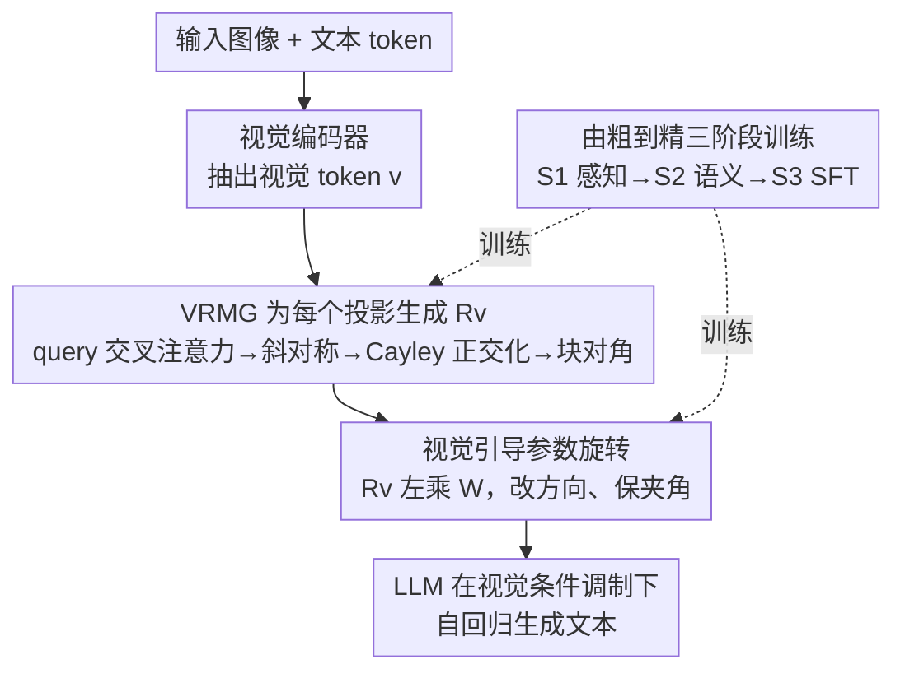

# ROSE: Rotate Your Large Language Model to See

**会议**: CVPR 2026  
**论文**: [CVF Open Access](https://openaccess.thecvf.com/content/CVPR2026/html/Yue_ROSE_Rotate_Your_Large_Language_Model_to_See_CVPR_2026_paper.html)  
**代码**: 将公开（代码与模型权重待放出）  
**领域**: 多模态VLM / MLLM效率 / 参数空间视觉注入  
**关键词**: MLLM、vision injection、参数空间、正交旋转、Cayley 变换、推理效率

## 一句话总结
本文不再把视觉特征拼成 token 塞进 LLM 输入（导致序列暴长、二次复杂度、还冲淡语言先验），而是把视觉语义编码成**正交旋转矩阵**直接左乘到 LLM 的预训练权重上——既避开了上下文扩展、又因正交性保住了参数间的角度结构（即语言先验），由此造出 7B 的 ROSE：在 12 个多模态 benchmark 上与 Qwen2.5-VL-7B 相当，却把 FLOPs 砍掉 80.7%、推理延迟降 56.4%。

## 研究背景与动机

**领域现状**：当前主流 MLLM（LLaVA 系、Qwen-VL 系）走的是「输入空间注入」：视觉编码器抽出特征 → 投影器映射 → 与文本 token 拼成统一多模态序列 → 一起送进 LLM 联合处理。

**现有痛点**：这条路有两个固有代价。其一，**算力爆炸**——视觉编码大幅拉长输入上下文，而 LLM 是 $O(n^2)$ 二次复杂度，分辨率越高、多图/长视频越严重，延迟和显存都顶不住。其二，**冲淡语言先验**——视觉 token 在多模态序列里占主导，训练时参数更新会把 LLM 往视觉域偏，损害它原本的语言能力。

**核心矛盾**：一个理想的视觉注入策略需要同时满足两条原则——**计算高效**（摆脱视觉 token 带来的二次复杂度）与**保留预训练先验**（更强的 LLM 一致带来更强的 MLLM，必须留住预训练知识）。但「拼 token」这条路天然同时违反这两条。已有的效率优化（合并/压缩视觉 token、换更小 backbone）要么丢失细粒度视觉细节，要么牺牲推理/语言能力，都是治标。

**切入角度**：作者做了一个关键预实验——把 LLM 参数向量逐层只保留「方向」或只保留「幅度」，测 MMLU 准确率。结果发现：**语义知识主要由向量的方向承载**（保方向 67.3，保幅度仅 56.7，加噪进一步降到 50.8，原始 71.2）。这指明：要注入视觉语义，就该在「方向」上动刀；而要保住预训练知识，则要维持向量之间的**两两夹角**（角度刻画了向量间的相互依赖，是预训练学到的几何结构）。

**核心 idea**：用一句话概括——**把视觉信号编码成一个由视觉导出的正交矩阵 $R_v$，左乘到 LLM 的预训练权重上做"统一旋转"**：旋转改方向（注入视觉语义），正交性保夹角（守住语言先验），且完全不往输入里加 token（避开二次复杂度）。

## 方法详解

### 整体框架
ROSE 把视觉注入从「输入空间」搬到「参数空间」。给定一张图，视觉编码器抽出视觉 token；一个 Vision-guided Rotation Matrix Generator（VRMG）为 LLM 每个线性投影 $W$ 生成一个专属正交矩阵 $R_v$；这个 $R_v$ 左乘 $W$ 的所有列向量，把它们的方向按视觉做统一旋转——于是 LLM 在不拼接任何视觉 token 的情况下，就在「视觉条件调制」下做文本编码与生成。VRMG 内部用可学习 query 经交叉注意力聚合视觉信息，输出经 reshape 成斜对称矩阵、再用 Cayley 变换转成正交矩阵，并按块对角稀疏化降复杂度。整个框架用一个「视觉条件自回归语言建模损失」端到端训练，配 S1→S2→S3 由粗到精的三阶段流程。

### 关键设计

**1. 视觉引导的参数旋转：改方向注入语义，靠正交性保住夹角（语言先验）**

这是全文的理论基石，回答了「参数该怎么改」。考虑 LLM 任一线性投影 $W=\{w_1,\dots,w_n\}\in\mathbb{R}^{d\times n}$，前向是 $z=W^\top x$。每个 $w_i$ 由方向和幅度唯一确定，而预实验证明语义主要在方向。于是对每个 $W$ 生成一个正交矩阵 $R_v$，用左乘把所有列向量**统一旋转**：$z_v=(R_v W)^\top x$。这样视觉就能引导文本编码/生成，却无需把视觉 token 拼进上下文，算力大降。更关键的是「保夹角」：对任意一对 $(w_i,w_j)$，旋转后的余弦相似度

$$\cos(R_v w_i, R_v w_j)=\frac{(R_v w_i)^\top(R_v w_j)}{\|R_v w_i\|\,\|R_v w_j\|}=\frac{w_i^\top (R_v^\top R_v) w_j}{\|w_i\|\,\|w_j\|}=\cos(w_i,w_j)$$

因为正交性保证 $R_v^\top R_v=I$ 且 $\|R_v w\|=\|w\|$。也就是说，旋转改了每个向量的方向（注入视觉），却原封不动保留了所有向量之间的两两夹角——而这些夹角正是预训练学到的语义几何结构。这就是 ROSE 能在注入视觉的同时不损伤语言先验的数学原因，区别于直接微调权重（会同时破坏方向和夹角）。

**2. VRMG：从视觉特征生成正交矩阵，用 Cayley 变换 + 块对角稀疏化把它做得可学又便宜**

设计 1 要求一个「合法的正交矩阵 $R_v$」且要由视觉决定，VRMG（Vision-guided Rotation Matrix Generator）负责造它。流程：对每个投影分配可学习 query $q$，经交叉注意力从视觉 token 序列 $v$ 聚合信息 $q=\mathrm{Attention}(W_Q^\top q, W_K^\top v, W_V^\top v)$；输出 query 线性映射并 reshape 成下三角部分 $T_v$，填成斜对称矩阵 $P_v$（下三角放 $T_v$、上三角放 $-T_v$，满足 $P_v=-P_v^\top$）；再用 **Cayley 正交化** 转成正交矩阵：

$$R_v=(I+P_v)(I-P_v)^{-1}$$

斜对称矩阵经 Cayley 变换必为正交矩阵，这就**保证了**设计 1 所需的正交性。但 $P_v$ 由下三角的 $\frac{d(d-1)}{2}$ 个参数决定，$d$ 通常是 LLM 的隐层/中间维度，非常大，直接映射开销爆炸。于是 VRMG 把 $R_v$ **稀疏化成块对角矩阵** $R_v=\mathrm{diag}(R_v^1,\dots,R_v^r)$，每个子块尺寸 $d/r$ 且各自正交（整体仍正交），对应地把单个 query 扩成 $r$ 个 query token，各自独立聚合视觉、生成一个子块——复杂度从 $O(d^2)$ 降到 $O(d^2/r)$。论文里每个 $R_v$ 拆成 64 个子块。

**3. 由粗到精的三阶段训练 + 多投影部署：让 VRMG 学会生成有判别力的旋转**

光有结构还不够，要让 $R_v$ 真正「条件于视觉、且有判别力」。ROSE 基于 Qwen2.5-7B + SigLIP2 视觉编码器，VRMG **每隔 4 层均匀插入** LLM（约 +200M 参数），每个被装备的层里 $W_q,W_k,W_v,W_o$（注意力）与 $W_{up},W_{down},W_{gate}$（FFN）共 7 个投影各配一组 $r$ 个 query（共 $7r$ 个），并加投影 embedding 与子块 embedding 区分身份。训练用视觉条件自回归损失 $\mathcal{L}_{LM}=-\sum_t \log P(y_t\mid y_{<t};\theta(v))$，$\theta(v)$ 表示被视觉 $v$ 调制后的 LLM 参数。三阶段由粗到精：**S1 感知预训练**——用 LAION-2B 采的 60M 原始图文对学基础视觉概念，只更新 VRMG，视觉编码器与 LLM 全冻结；**S2 语义预训练**——用 Qwen2.5-VL-7B 给 DataComp-1B 重新 caption 出的 90M 细粒度图文对学细粒度对齐，解冻视觉编码器与 VRMG、LLM 仍冻结；**S3 自监督微调**——在 FineVision（24.3M 多模态指令样本）上全参数端到端微调。这种「先学概念、再学细粒度对齐、最后学指令跟随」的阶梯，配合分阶段解冻，是 VRMG 能产出自适应、判别性 $R_v$ 的关键。

## 实验关键数据

### 主实验
12 个多模态 benchmark（MMB/MMMU/MME/SEED/GQA/TextVQA/DocVQA/ChartQA/InfoVQA/AI2D/RealWorldQA/MMStar）。FLOPs 单位 T、Latency 单位 ms（单卡 H20，无工程加速），Avg 为 12 项平均。

| 模型 | 参数规模 | FLOPs↓ | Latency↓ | Avg↑ |
|------|------|------|------|------|
| LLaVA-OV-0.5B | ≤4B | 9.3 | 196.2 | 54.0 |
| Qwen2-VL-2B | ≤4B | 3.7 | 149.0 | 65.0 |
| Qwen2.5-VL-3B | ≤4B | 11.0 | 239.4 | 71.8 |
| LLaVA-OV-7B | ≥7B | 62.9 | 635.3 | 71.6 |
| Qwen2-VL-7B | ≥7B | 10.0 | 242.5 | 73.1 |
| Qwen2.5-VL-7B | ≥7B | 19.2 | 333.4 | **76.0** |
| **ROSE-7B（本文）** | 7B | **3.7** | **145.1** | 74.5 |

ROSE-7B 的 Avg 74.5 与 Qwen2.5-VL-7B（76.0）相当，但 FLOPs 仅 3.7T（**降 80.7%**）、延迟 145.1ms（**降 56.4%**）——其 FLOPs/延迟甚至低于 2B 级小模型（Qwen2-VL-2B、LLaVA-OV-0.5B），却比它们平均高 9.5%+；相对 LLaVA / Qwen-VL 系最多达 **20× FLOPs 缩减、3× 加速**。

**计算可扩展性**：把视觉序列长度从 512 扫到 32768，ROSE 的 FLOPs/显存/延迟几乎只随长度**线性微增**（因为视觉信息进的是参数空间、不进上下文），而输入空间注入的 Qwen-VL 系受 $O(n^2)$ 复杂度拖累急剧上升。跨 7 个 token 规模平均，ROSE 相对 Qwen2.5-VL-7B：FLOPs −79.9%、显存 −18.3%、延迟 −58.7%。

**语言先验保留**（Table 2，ROSE-style vs LLaVA-style 同数据同配置）：ROSE-style 在 5 个语言 benchmark 上的语言能力与原始 Qwen2.5-7B **持平**，显著强于 LLaVA-style，且总体平均最高；同时只需 LLaVA-style **30% 的训练时间**和 **13.8% 的推理 FLOPs**——印证「保住参数结构关系」对维持语言能力的重要性。

### 消融实验
消融默认在 LAION-2B 采的 30M 图文对预训练 + LLaVA-665K 微调。

| 配置 | 关键指标（4 benchmark Avg） | 说明 |
|------|---------|------|
| VRMG 层数 = 9 | 最优 | 在 {6,9,12,18} 中，中等数量的层做旋转最平衡 |
| 放置：Shallow / Middle / Deep / **Uniform** | 63.4 / 64.5 / 65.0 / **66.1** | 均匀分布跨深度最稳最强 |
| 子块 $r$ = 32 / **64** / 128 | 66.3 / **66.1** / 64.8 | $r$ 越小越密越准，但 $r{=}32$ 参数约 4×，故选 64 平衡 |
| 注入子层：Attn / FFN / **Both** | 65.0 / 64.3 / **66.1** | 两子层都有用，注意力更关键（建模 token 间交互） |

### 关键发现
- **方向承载语义、夹角承载先验**：预实验（保方向 67.3 vs 保幅度 56.7 vs 加噪 50.8 vs 原始 71.2）是整套方法的立论根基——这也解释了为什么「旋转」（只改方向、保模长与夹角）恰好是注入视觉又不伤语言的理想操作。
- **算力不随视觉 token 爆炸**是 ROSE 最大的实用优势：高分辨率、多图、长视频场景下，输入空间注入的二次复杂度被彻底绕开。
- **均匀 + 适量 + 适当密度**：VRMG 装 9 层、均匀分布、$r=64$、注意力子层尤其重要——这组配置在精度与开销间取得最佳折中。
- **数据可扩展**：S1/S2 预训练数据从 10M 扫到 150M，认知类任务（MMBench/SEED）在 S1 涨得快（原始感知数据含更多世界知识），感知类任务（GQA/TextVQA）在 S2 涨得快（细粒度 caption 精修文-视对应）。

## 亮点与洞察
- **把"视觉注入"重新表述为"参数旋转"**：这是最让人「啊哈」的视角——绝大多数 MLLM 在「往输入里加什么」上内卷，ROSE 直接改「LLM 的参数怎么转」，一举绕开二次复杂度。
- **正交性既是手段也是保险**：用 Cayley 变换从斜对称矩阵生成 $R_v$，天然保证正交，于是「保夹角=保语言先验」这件事被**数学性地担保**，而非靠正则项软约束。
- **块对角稀疏化是落地关键**：直接生成 $d\times d$ 正交矩阵不可行，拆成 $r$ 个子块把复杂度从 $O(d^2)$ 压到 $O(d^2/r)$，让这套方法在 7B 尺度真正跑得起来。
- **可迁移的"参数空间条件化"思路**：把任意条件（不只视觉）编码成对预训练权重的正交旋转，可能是给冻结大模型注入新模态/新条件、又不破坏原能力的通用范式。

## 局限与展望
- **VRMG 引入额外参数与生成开销**：约 +200M 参数，且每张图都要在线生成一批正交矩阵（交叉注意力 + Cayley 求逆 $(I-P_v)^{-1}$），其本身的开销与收益拆解，论文主要给汇总值（⚠️ 细节以 Appendix 为准）。
- **块对角是表达力-效率的折中**：$R_v$ 被限制为块对角形式，跨子块的旋转无法表达；$r{=}32$ 更准但参数 4×，说明稀疏化是有代价的、并非免费午餐。
- **仍逊于同级最强模型**：Avg 74.5 < Qwen2.5-VL-7B 76.0，ROSE 卖点是「相当精度 + 大幅省算力」，在纯精度上尚未反超 SOTA。
- **主要在图像 benchmark 验证**：结论页强调 12 个 image-based benchmark，长视频/多图等「最该受益于免上下文扩展」的场景虽被论证可扩展，但端到端任务精度验证相对有限。

## 相关工作与启发
- **vs LLaVA / Qwen-VL 系（输入空间注入）**：它们把视觉拼成 token 进上下文，受 $O(n^2)$ 拖累且冲淡语言先验；ROSE 把视觉变成对参数的正交旋转，免上下文扩展、保语言先验，FLOPs 最多省 20×。
- **vs 视觉 token 压缩/合并（TokenMerging、PruMerge、Q-Former 等）**：它们靠减少视觉 token 降复杂度，但直接削 token 会丢细粒度细节；ROSE 不在 token 数上做文章，而是改变信息进入 LLM 的「通道」。
- **vs 换小 backbone**：换更小 LLM 虽降显存/FLOPs，却牺牲继承自原 LLM 的推理与语言能力；ROSE 保留原 7B LLM 并冻结其结构关系，语言能力与原模型持平。

## 评分
- 新颖性: ⭐⭐⭐⭐⭐ 「视觉=对预训练权重的正交旋转」是少见且自洽的范式转换，预实验立论扎实。
- 实验充分度: ⭐⭐⭐⭐ 12 多模态 + 5 语言 benchmark、效率扫描、4 组消融齐全；纯精度未超 SOTA、部分开销细节进 Appendix。
- 写作质量: ⭐⭐⭐⭐ 从预实验到正交性证明到 VRMG 实现层层递进；OA 版表格排版被打散略影响阅读。
- 价值: ⭐⭐⭐⭐⭐ 在高分辨率/长视频时代，「算力不随视觉 token 爆炸」的注入范式有很强的现实意义与可迁移性。

<!-- RELATED:START -->

## 相关论文

- [\[CVPR 2026\] Learning to See through Illumination Extremes with Event Streaming in Multimodal Large Language Models](learning_to_see_through_illumination_extremes_with_event_streaming_in_multimodal.md)
- [\[CVPR 2026\] See What I Mean: Aligning Vision and Language Representations for Video Fine-grained Object Understanding](see_what_i_mean_aligning_vision_and_language_representations_for_video_fine-grai.md)
- [\[CVPR 2026\] CaptionQA: Is Your Caption as Useful as the Image Itself?](captionqa_is_your_caption_as_useful_as_the_image_itself.md)
- [\[CVPR 2026\] See Less, See Right: Bi-directional Perceptual Shaping For Multimodal Reasoning](see_less_see_right_bi-directional_perceptual_shaping_for_multimodal_reasoning.md)
- [\[CVPR 2026\] TransPrune: Token Transition Pruning for Efficient Large Vision-Language Model](transprune_token_transition_pruning_for_efficient_large_vision-language_model.md)

<!-- RELATED:END -->
