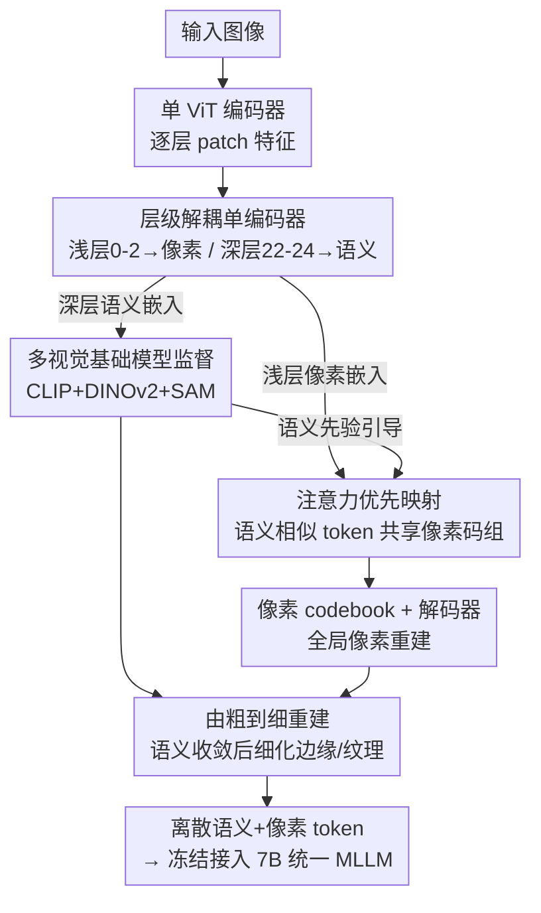

# Rosetta Stone for Unified MLLMs: A Unified Tokenizer to Decipher Understanding and Generation

**会议**: CVPR 2026  
**论文**: [CVF Open Access](https://openaccess.thecvf.com/content/CVPR2026/html/Sun_Rosetta_Stone_For_Unified_MLLMs_A_Unified_Tokenizer_to_Decipher_CVPR_2026_paper.html)  
**代码**: 无  
**领域**: 多模态VLM  
**关键词**: 统一视觉tokenizer, 理解与生成统一, 离散codebook, 注意力优先映射, 层级解耦

## 一句话总结
针对"统一视觉 tokenizer 中重建任务和语义任务相互打架"这个老大难，作者用**单编码器层级解耦**（浅层做像素重建、深层做语义对齐）+ **CLIP/DINOv2/SAM 多基础模型监督** + **注意力优先映射的双 codebook** + **语义收敛后的由粗到细重建**，在 ImageNet 上做到 rFID 0.33、零样本精度 80.9%，并用它驱动的 7B 统一 MLLM 在理解上反超 TokenFlow-13B 3.1%。

## 研究背景与动机

**领域现状**：要在一个自回归（next-token prediction）框架里同时做多模态理解和生成，关键是把图像编码成离散 token 的"统一视觉 tokenizer"。主流做法（VILA-U、TokenFlow、UniTok、QLIP 等）几乎都用两个 pretext 任务——**像素重建**（pixel reconstruction）和**特征对齐**（feature alignment / 对比学习）——来训练 tokenizer。

**现有痛点**：现成的特征提取器各有短板：CLIP 这类对比学习特征**缺乏底层、细粒度细节**，VAE 类特征**缺乏高层语义**。于是很多方法只能"用两套割裂的 tokenizer 拼"，理解走 CLIP、生成走 VAE，高层语义和底层细节之间无法真正互通，理解和生成无法互相增益。

**核心矛盾**：作者把问题定位到 tokenizer 训练阶段本身——**重建任务和语义任务的嵌入空间天然不一致**。语义空间紧凑、结构化；像素空间则庞大、要重建大量细节。两个 proxy task 的优化方向因此错位。作者进一步跟踪训练中两个 codebook 的 index 变化（用归一化 Hamming 距离），发现**语义 codebook 收敛快、像素 codebook 收敛慢且 index 剧烈跳变**，训练资源被重建任务吸走，反过来损害语义。于是 pixel codebook 成了统一 tokenizer 的真正瓶颈。

**切入角度**：作者用 CKNNA 指标分析各视觉基础模型不同层特征与 VQGAN（重建空间）/ Qwen 视觉编码器（理解空间）的相似度，得到两个关键观察：① CLIP 的**浅层**特征比深层更接近生成/重建空间，而 DINOv2、SAM 这类有强分割能力的模型，其特征**天生更对齐重建空间**；② 但 CLIP 在下游语义任务（linear probing、VQA）上仍然最强。这启发作者：**不该让同一层特征同时背重建和语义两个包，而应该按层级把两个任务解耦，并用不同属性的视觉特征分别监督**。

**核心 idea**：在单个编码器内**层级解耦**冲突的 proxy 任务（浅层喂重建、深层喂语义），用多种视觉基础模型丰富语义监督，再用收敛后的强语义先验去**引导**像素分支，把"对抗"的优化目标重构成"协同"。

## 方法详解

### 整体框架

输入是一张图像，目标是把它编码成一串**离散语义 token + 离散像素 token**，使得这套 token 既能高质量重建图像（生成），又携带强语义（理解）。整条 pipeline 是：单个 ViT 编码器把图像编码成逐层 patch 特征 → **聚合 neck** 把浅层（第 0–2 层）聚成像素嵌入、深层（第 22–24 层）聚成语义嵌入 → 语义嵌入查**语义 codebook** 并被 CLIP/DINOv2/SAM 多目标监督，像素嵌入经**注意力优先映射**查**像素 codebook** 再走解码器做重建 → 等语义分支接近收敛后，再用其分割级特征对重建做**由粗到细**的细化监督。最后把这个 frozen tokenizer 接到 LLaMA-2-7B 上构成统一 MLLM。

### 关键设计

**1. 层级解耦的单编码器：让同一座塔的不同层各干各的活**

针对"单编码器最后一层既要重建细节又要对齐语义、负担过重"以及"双编码器（TokenFlow）交互差、算力贵"两个痛点，作者只用**一座** ViT-L 编码器（权重从 CLIP-ViT-L 初始化），但在它身上做层级分工：浅层负责像素、深层负责语义。具体地，前向写成 $z_{sem} = f_{sem}(h_{22}, h_{23}, h_{24})$、$z_{pix} = f_{pix}(h_0, h_1, h_2)$，其中 $h_l$ 是编码器第 $l$ 层的 patch 序列输出，$f$ 是一个轻量 CNN 风格的聚合 neck，$z$ 是送去量化的嵌入。这个设计直接源于前面 CKNNA 分析的观察——浅层特征更靠近重建空间、深层特征语义更结构化——所以不是拍脑袋分层，而是按各层特征的真实属性分配 proxy 任务。消融里它带来 MME-P +35.9 点、零样本精度 +2.5%、rFID −0.64。

**2. 多视觉基础模型监督：用 CLIP+DINOv2+SAM 而不是只用 CLIP**

只用 CLIP 这类对比学习模型做特征对齐，重建能力天然不足（除浅层外多数层的重建相似度远低于 SAM、DINOv2），细节会糊。作者因此让语义分支同时对齐三种互补特征：CLIP（结构化高层语义、利于 VQA/OCR）、DINOv2（细粒度分析）、SAM（强底层/分割细节）。落地上用轻量 MLP 把量化后的语义嵌入投影到各监督目标：$o_{mod} = \text{MLP}_{mod}(\tilde{z}_{sem})$，$\tilde{z}_{sem} = d_{sem}(\hat{z}_{sem})$，$mod \in \{\text{DINO}, \text{CLIP}, \text{SAM}\}$。监督损失对 patch token 同时用余弦损失和 L1（L1 用来匹配空间特征的幅度），对 CLS token 只用余弦：

$$L_S = \sum_{mod}\big[L_{cos}(o_{mod}, T_{mod}) + L_1(o_{mod}, T_{mod})\big]_{\text{patch}} + \sum_{mod} L_{cos}(o_{mod}, T_{mod})_{\text{cls}}$$

消融显示：把 CLIP-only 换成三模型联合监督，零样本精度 +4.9%、rFID −2.52，说明"高层语义 + 底层细节"混合监督让理解和生成两个任务的优化更平滑。

**3. 注意力优先映射：用语义相似度给像素 codebook 减负**

像素 codebook 收敛慢、index 跳变剧烈是统一 tokenizer 的瓶颈。作者的解法是让**语义相似的 patch 共享一组像素子码本**，从而压缩像素重建要搜索的特征空间。先把语义 codebook $C_{sem}\in\mathbb{R}^{N\times d}$ 放大成分组的像素 codebook $C_{pix}\in\mathbb{R}^{N\times m\times d}$（$N$ 是码本大小，$m$ 是每组码数，论文用 $m=2$）。相似度直接取注意力模块里的 key：$sim(i,j) = \frac{k_i\cdot k_j}{\|k_i\|\|k_j\|}$，得到 token 间相似度矩阵 $A$；对 $A$ 跑阈值为 $\tau$ 的 DFS（$\tau=0.7$）把要合并的 token 分成若干组 $M=\{M_1,\dots,M_j\}$；每组 token 找到各自的语义 codebook index 并并成集合 $S_j$，再把对应的像素子码本拼起来：

$$C^j_{pix} = \text{concat}\big(C^{idx}_{pix}\ \text{for}\ idx\ \text{in}\ S_j\big)$$

组内每个 patch token 在拼接后的 $C^j_{pix}$ 上做最近邻查表，保证语义相近的 token 落到相近的像素码组。和 TokenFlow"硬绑定语义-像素 index 一一对应"相比，这里是"语义相近者共享一个更大的聚合码组"，既保留语义先验、又让模型更专注边缘纹理这类细粒度像素信息，同时显著缓解像素 codebook 的 index 漂移。消融里它带来 rFID −0.32、精度 +2%。

**4. 由粗到细重建：语义分支收敛后反过来监督细节**

作者观察到重建结果的粗结构（全局形状）保真度高，但细粒度细节（边缘、纹理）不清晰，而细节本身又难重建。巧的是，语义分支收敛后其嵌入已和 DINO、SAM 强对齐、具备分割级感知力——于是可以**低开销地**用它对重建图做细粒度监督。在 $L_R$ 引导的全局重建之上追加一项 $L_F = \sum_{mod}\|\text{MLP}_{mod}(f_{sem}(E(x))) - T_{mod}(\hat{x})\|_2^2$，$mod\in\{\text{DINO}, \text{SAM}\}$，即用语义分支对原图的特征去对齐对重建图 $\hat{x}$ 提取的 DINO/SAM 特征，相当于在特征空间里逼细节。这一项在训练到 0.5 epoch（语义收敛后）才并入，消融里再降 rFID 0.16。

### 损失函数 / 训练策略

像素重建沿用先前工作的组合：$L_R = L_2(x,\hat{x}) + L_P(x,\hat{x}) + \lambda_G L_G(\hat{x}) + L_{VQ}$，其中 $L_P$ 是 LPIPS 感知损失、$L_G$ 是带权 $\lambda_G$ 的对抗损失、$L_{VQ} = \|\text{sg}[\hat{z}_{pix}] - z_{pix}\|_2^2 + \beta\|\hat{z}_{pix} - \text{sg}[z_{pix}]\|_2^2$ 是 VQ commitment 损失（sg 为 stop-gradient）。总损失分两阶段：

$$L_{total} = \begin{cases} L_S + L_R, & \text{训练早期} \\ L_S + L_R + L_F, & \text{语义收敛之后} \end{cases}$$

训练配置：tokenizer 用 ViT-L 主干，在 COYO 数据集 1 亿对图文上训 1 epoch；语义 codebook 大小 32768、像素 codebook（每组 2 个 index）65536；语义/像素码本维度分别为 32 与 8；学习率 1e-4、梯度裁剪 norm=1、$L_F$ 在 0.5 epoch 引入。统一 MLLM 用 LLaMA-2-7B，tokenizer 冻结，文本-图像生成训练时以 0.1 概率丢 prompt 以支持 CFG。

## 实验关键数据

### 主实验：tokenizer 与统一 MLLM

ImageNet 上 tokenizer 在重建和零样本两端同时领先，且 384 分辨率进一步提升：

| 类型 | 模型 | 分辨率 | rFID ↓ | PSNR ↑ | SSIM ↑ | 零样本 Acc ↑ |
|------|------|--------|--------|--------|--------|--------------|
| 统一 | VILA-U | 256 | 1.80 | − | − | 73.3 |
| 统一 | TokenFlow | 256 | 1.37 | 21.41 | 0.687 | − |
| 统一 | UniTok | 256 | 0.38 | − | − | 78.6 |
| 语义 | SigLIP | 256 | − | − | − | 80.5 |
| **本文** | **Ours** | **256** | **0.33** | **25.17** | **0.822** | **80.9** |
| **本文** | **Ours** | **384** | **0.17** | **28.02** | **0.878** | **81.4** |

把 frozen tokenizer 接成统一 MLLM（LLaMA-2-7B，256 分辨率），离散类里全面 SOTA，并反超更大的 TokenFlow-13B：

| 类型 | 方法 | LLM | SEEDB | GQA | MME-P | POPE | TextVQA | AI2D | MMMU | Avg |
|------|------|-----|-------|-----|-------|------|---------|------|------|-----|
| 离散 | VILA-U | LLaMA-2-7B | 56.3 | 58.3 | 1336.2 | 83.9 | 48.3 | − | − | − |
| 离散 | UniTok | LLaMA-2-7B | − | 61.1 | 1448.0 | 83.2 | 51.6 | − | − | − |
| 离散 | TokenFlow-L | Vicuna-13B | 62.6 | 60.3 | 1365.4 | 85.0 | 54.1 | 56.6 | 34.4 | 60.18 |
| 离散 | **Ours** | **LLaMA-2-7B** | **65.6** | **63.2** | **1442.6** | **86.8** | **56.2** | **60.4** | **38.3** | **63.23** |

文生图方面（GenAI-Bench VQA score + MJHQ-30K gFID），加 Qwen 改写 prompt（Ours†）后优势更明显：

| 类型 | 模型 | Basic ↑ | Advanced ↑ | MJHQ gFID ↓ |
|------|------|---------|------------|-------------|
| 统一 | VILA-U | 0.76 | 0.64 | 12.81 |
| 统一 | UniTok | 0.85 | 0.67 | 7.46 |
| 统一 | **Ours** | **0.86** | **0.74** | **5.01** |
| 统一 | **Ours†** | **0.90** | **0.86** | **4.93** |

### 消融实验

从 baseline（CLIP-L 编码器 + CNN-VAE 像素编码器）逐步叠加四个组件，每一步都在重建和理解两端同时受益：

| 配置（逐步叠加） | MME-P ↑ | POPE ↑ | SEED ↑ | GQA ↑ | rFID ↓ | Acc ↑ |
|------------------|---------|--------|--------|-------|--------|-------|
| Baseline | 1209.1 | 76.5 | 54.9 | 43.2 | 3.97 | 71.2 |
| + 多视觉基础模型监督 | 1331.5 | 81.6 | 59.1 | 54.5 | 1.45 | 76.1 |
| + 层级解耦单编码器 | 1367.4 | 83.9 | 62.3 | 58.9 | 0.81 | 78.6 |
| + 注意力优先映射 | 1384.2 | 85.6 | 63.6 | 61.6 | 0.49 | 80.6 |
| + 由粗到细重建（Full） | 1387.3 | 85.3 | 63.5 | 61.6 | 0.33 | 80.9 |

层选择消融（Table 6）则验证"浅层做像素、深层做语义"的分工是对的：用 $\{0,1,2\}$ 重建、$\{21,22,23\}$ 语义且开聚合模块时 rFID 0.33 / Acc 80.9 最佳；把重建换深层或语义换浅层都明显变差。

### 关键发现
- **四个组件贡献最大的是多模型监督**：它一上来就把 rFID 从 3.97 砍到 1.45、精度从 71.2 拉到 76.1，说明"光靠 CLIP 对齐"确实是统一 tokenizer 性能的天花板。
- **每一步都"理解+生成双赢"**：四个组件叠加过程中 rFID 单调下降、零样本精度单调上升，证明设计真的把两个原本对抗的目标变成了协同，而不是拆东补西。
- **小模型反超大模型**：7B 统一 MLLM 在理解平均分上超过 TokenFlow-13B（63.23 vs 60.18），把收益归功于 tokenizer 而非堆参数。
- **由粗到细那一步在理解指标上几乎不动（甚至 POPE/SEED 略降）**，主要收益在 rFID（−0.16），说明它是纯粹冲生成细节的补丁。

## 亮点与洞察
- **把"特征属性"当一等公民**：先用 CKNNA + codebook index 演化把"浅层近重建、深层近语义""像素码本收敛慢是瓶颈"量化出来，再据此设计分层，而不是常见的"两个编码器各管一摊"。这种"先诊断后开方"的思路很值得迁移到任何多任务 tokenizer。
- **注意力优先映射是最巧的点**：直接复用编码器注意力的 key 算 token 相似度（零额外参数），用 DFS 聚类把语义相近 token 绑到同一组像素子码本，既注入语义先验又压缩像素搜索空间——比 TokenFlow 的"硬绑定 index"更松弛也更利于细节。
- **"语义反哺像素"的时间差设计**：等语义分支收敛后才用它的分割级特征去监督重建细节（$L_F$ 0.5 epoch 引入），相当于免费拿到一个 SAM/DINO 级的细粒度监督源，这个"阶段性课程"思路可复用到其他需要细节的生成任务。

## 局限与展望
- **训练成本高且依赖大数据**：tokenizer 在 1 亿 COYO 对上训，MLLM 还用了 SA-1B/Cambrian/LAION + 千万级内部 MidJourney 风格数据，复现门槛高；消融为省算力只训 50 epoch ImageNet，与主实验设定不完全可比。
- **三模型监督带来的工程复杂度**：要同时跑 CLIP/DINOv2/SAM 作为监督目标并对齐序列长度（插值下采样），推理虽冻结但训练侧不轻量；论文未给三者权重的敏感性分析。⚠️ $\tau=0.7$、$m=2$ 等超参的选择理由文中较简略，以原文为准。
- **生成端评测偏代理指标**：GenAI-Bench 用 CLIP-FlanT5 算 VQA score、MJHQ 用 gFID，缺人评；Advanced prompt 上 Ours（0.74）与 Ours†（0.86）差距大，说明对原始 prompt 的鲁棒性仍依赖 LLM 改写。
- 可改进：把"由粗到细"扩成多级课程、或让注意力优先映射的分组随训练自适应阈值，可能进一步缓解像素码本瓶颈。

## 相关工作与启发
- **vs TokenFlow**：TokenFlow 用双编码器 + 共享映射码本、硬绑语义-像素 index 一一对应；本文用单编码器层级解耦 + 注意力优先映射让语义相近 token 共享聚合像素码组，交互更强、算力更省，7B 反超其 13B。
- **vs VILA-U / UniTok**：二者都是单编码器但让**最后一层**特征同时扛重建和语义对齐，负担过重；本文按层分工（浅层像素、深层语义）缓解了末层压力，rFID 与零样本同时更好。
- **vs DualToken**：DualToken 也用浅层重建、深层理解，但没分析各层特征的差异属性、且只对齐 CLIP 单一来源；本文显式做了 CKNNA 属性分析并引入 CLIP+DINOv2+SAM 多源监督。

## 评分
- 新颖性: ⭐⭐⭐⭐ 注意力优先映射 + 语义反哺像素的组合在统一 tokenizer 里少见，且由扎实的特征属性分析驱动
- 实验充分度: ⭐⭐⭐⭐⭐ tokenizer/理解/生成三端 + 逐组件消融 + 层选择消融，证据链完整
- 写作质量: ⭐⭐⭐⭐ 动机推导清晰、图文对照好，少数公式/超参表述偏简
- 价值: ⭐⭐⭐⭐ 给"统一 tokenizer 为何理解生成打架"提供了可操作的工程解法，对后续 unified MLLM 有参考意义

<!-- RELATED:START -->

## 相关论文

- [\[CVPR 2026\] AToken: A Unified Tokenizer for Vision](atoken_a_unified_tokenizer_for_vision.md)
- [\[CVPR 2026\] UniCompress: Token Compression for Unified Vision-Language Understanding and Generation](unicompress_token_compression_for_unified_vision-language_understanding_and_gene.md)
- [\[CVPR 2026\] OneCAT: Decoder-Only Auto-Regressive Model for Unified Understanding and Generation](onecat_decoder-only_auto-regressive_model_for_unified_understanding_and_generati.md)
- [\[CVPR 2026\] HBridge: H-Shape Bridging of Heterogeneous Experts for Unified Multimodal Understanding and Generation](hbridge_h-shape_bridging_of_heterogeneous_experts_for_unified_multimodal_underst.md)
- [\[NeurIPS 2025\] UniTok: A Unified Tokenizer for Visual Generation and Understanding](../../NeurIPS2025/multimodal_vlm/unitok_a_unified_tokenizer_for_visual_generation_and_understanding.md)

<!-- RELATED:END -->
