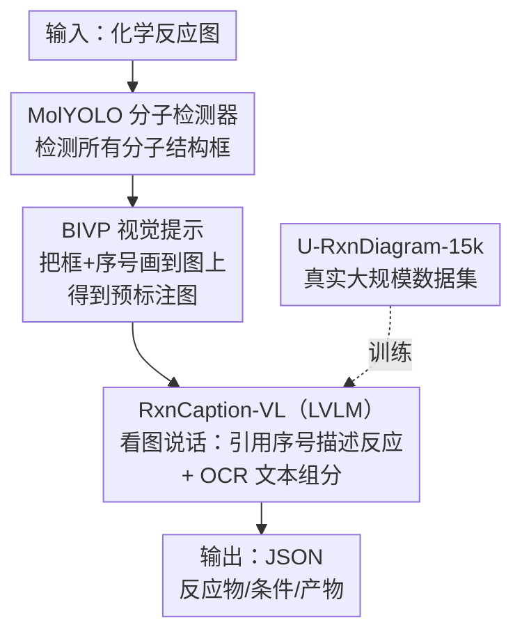

# RxnCaption: Reformulating Reaction Diagram Parsing as Visual Prompt Guided Captioning

**会议**: CVPR 2026  
**论文**: [CVF Open Access](https://openaccess.thecvf.com/content/CVPR2026/html/Song_RxnCaption_Reformulating_Reaction_Diagram_Parsing_as_Visual_Prompt_Guided_Captioning_CVPR_2026_paper.html)  
**代码**: https://github.com/opendatalab/RxnCaption  
**领域**: 多模态VLM  
**关键词**: 化学反应图解析、视觉提示、视觉语言模型、信息抽取、化学AI

## 一句话总结
RxnCaption 把"化学反应图解析（RxnDP）"从让大模型预测分子坐标框，重构成让大模型"看图说话"——先用专门训练的分子检测器 MolYOLO 在图上预先画好分子框和序号，再让 LVLM 只需用自然语言引用这些序号来描述反应，配合自建的 U-RxnDiagram-15k 真实数据集，在多项指标上刷到 SOTA。

## 研究背景与动机

**领域现状**：化学反应数据是 AI for Chemistry 的命脉，但海量高质量反应大多以"反应图"（reaction diagram）的形式埋在论文图片里，机器读不了。反应图解析（RxnDP）的任务就是输入一张反应图、输出图中所有反应，每个反应含三种角色：反应物（reactants）、条件（conditions）、产物（products）。人类读这种图天然分三步：① 检测分子结构（出 bbox）；② 装配反应（把分子框和文本条件拼成完整反应并分配角色）；③ 后处理（OCSR 把分子框识别成 SMILES、OCR 识别文本条件）。

**现有痛点**：此前的深度学习方法（RxnScribe 用 Pix2Seq、RxnIM 首次引入 LVLM）都采用 "Bbox and Role in One Step"（BROS）策略——让模型**同时**预测分子框坐标和角色。但 RxnIM 即便靠合成数据把训练量堆得很大，相比 RxnScribe 提升也很有限，且在分布外（OOD）样本上泛化很差。LVLM 在这个领域始终没出现像别的方向那样的突破。

**核心矛盾**：作者做了一个关键的 pilot study。他们先让 GPT-4o / Gemini-2.5-Pro / Qwen-VL-Max 在 BROS 设定下零样本做 RxnDP，结果惨不忍睹（Gemini F1 仅 35.4，GPT-4o 仅 0.3）。但当他们换个问法、用 VQA 去问这些模型"图里有几个反应""有没有环状结构"时，模型答得很好（Gemini 准确率 75.9%）。这说明 LVLM **看得懂**反应图、有领域知识，真正卡脖子的是"**让它预测精确的 bbox 坐标**"——坐标回归本就不是 LVLM 的强项。

**本文目标**：与其在微调时强行教 LVLM 学一项它不擅长的新技能（坐标预测），不如设计一套能发挥它固有能力（自然语言描述）的预测策略；同时补齐数据短板——真实、规模大、版式多样的 RxnDP 数据集。

**核心 idea**：用"看图说话"代替"画框回归"。先把分子框这件 LVLM 不擅长的脏活交给专门检测器 MolYOLO 干，把框和序号直接画到图上当**视觉提示**，让 LVLM 只需引用序号、用自然语言把反应描述出来——这就是 "BBox and Index as Visual Prompt"（BIVP）策略。

## 方法详解

### 整体框架
RxnCaption 的核心是把 RxnDP 从坐标预测问题重构成图像描述（captioning）问题。整条 pipeline 是两阶段串行：**阶段一**用自研分子检测器 MolYOLO 检测图中所有分子结构、在原图上预先画出 bounding box 并标上序号，得到一张"预标注图"（pre-annotated image）；**阶段二**把预标注图喂给微调后的 LVLM（RxnCaption-VL），模型对**分子组分**只需引用图上序号、对**文本组分**直接抽取文本内容并分配角色，最终以 JSON 格式输出每个反应的反应物/条件/产物。这样 LVLM 完全在自然语言空间里工作，绕开了坐标回归。要让这套框架成立，作者还得解决两个支撑性问题：检测器够不够准（→ MolYOLO + MolDet-33k 数据集）、训练数据够不够真实多样（→ U-RxnDiagram-15k 数据集）。

### 关键设计

**1. BIVP 策略：把坐标回归从 LVLM 身上剥离，改成引用序号的"看图说话"**

这是全文的核心动机点。Pilot study 证明 LVLM 看得懂反应图（VQA 准确率高），但一旦要它直接吐分子框坐标（BROS）就崩（Gemini F1 35.4 → 用 BIVP 喂入真值框后飙到 81.0）。BIVP 的做法很直接：① 在图上预先标注好每个分子组分的 bounding box；② 在框旁边加索引数字。这样 LVLM 不再需要"产生"坐标，只需"引用"已经画好的序号，把一个原本的视觉定位问题转成纯自然语言描述问题。训练时，反应内部的分子组分用真值框、反应外的用 MolYOLO 检测框；推理时则全部依赖 MolYOLO 的检测框。这一招的精妙在于它顺着 LVLM 的强项（语言生成、图文理解）而不是逆着它的弱项（精确坐标回归）来设计任务形式。

**2. MolYOLO：BIVP 的成败前提，一个高精度专用分子检测器**

BIVP 把"画框"外包出去，但前提是这个框得画得准——框错了序号就错，下游全盘皆输。现有检测器（YoDe、MolDetect）在这个任务上精度不够（见表 2，MolDetect P/R 仅 0.84/0.77）。作者基于 YOLOv10-M 架构、在自建的 MolDet-33k 数据集（约 3000 篇有机化学论文、专业标注 219,721 个分子框，最终 12,209 张页级 + 21,155 张图/表级图像）加 YoDe 数据上训练，得到 MolYOLO，在 MolDet-33k-test 上 P/R 双双达到 0.98，大幅领先。消融（表 5）也证实检测器质量直接决定上限：在 RxnScribe-test 上把检测器从最弱的 YoDe 换成 MolYOLO，本文模型 Hybrid-F1 暴涨 18.9 个点（53.3 → 72.2）。

**3. U-RxnDiagram-15k：用真实论文数据破解"合成数据域偏移"瓶颈**

数据是另一个支撑点。此前 RxnScribe 数据集虽真实但只有 1378 个样本，RxnIM 数据集虽大却是合成的、与真实图像分布有明显域偏移（t-SNE 可视化显示 RxnIM 几乎与真实数据不重叠）。这解释了 RxnIM 为何"数据多但性能上不去"。作者构建 U-RxnDiagram-15k：四步流水线——① 分子结构标注（沿用 MolDet-33k 的框）→ ② 反应区域标注（用不规则多边形圈出每个反应区）→ ③ 组分角色标注（按 RxnScribe 规范给每个组分分配化学角色）→ ④ 文本内容抽取（训练集用 Gemini-2.5-Pro 自动 OCR，验证集人工标注保精度）。最终训练集 15,128 图 / 45,426 个反应，比 RxnScribe 大一个数量级；测试集刻意按 Single-line / Multi-line / Tree / Cyclic 四种版式各取 100 张做版式均衡，避免像 RxnScribe-test 那样 50% 都是简单单行版式。

### 一个完整示例
以一张含两个反应的反应图为例走一遍：① MolYOLO 扫一遍，检测出图中全部分子结构、画出框并依次编号 ①②③④⑤；② BIVP 把这张带框带号的预标注图交给 RxnCaption-VL；③ 模型不去算任何坐标，而是"读图描述"：发现序号 ① 和 ② 是反应物、③ 是产物、旁边文本"Pd(PPh₃)₄, 80°C"是条件（直接 OCR 抽出并标成 condition），组装成第一个反应；同理处理第二个反应；④ 全部以 JSON 输出 `{reactants:[1,2], conditions:["Pd(PPh3)4, 80°C"], products:[3]}` 这样的结构化结果。整个过程 LVLM 只在语言空间里引用序号和抄写文本，从不直接生成像素坐标。

### 损失函数 / 训练策略
RxnCaption-VL 以 Qwen2.5-VL-7B 为底座微调。训练集把 RxnScribe-train 从 1,240 扩到 3,720 张以平衡比例，再并入 U-RxnDiagram-15k-train 的 15,000 张，并对含可逆反应、从右到左、从下到上等非常规方向的图做双倍增强，最终 23,432 张。优化用 AdamW、峰值学习率 $1\times10^{-5}$、cosine 衰减 + 前 5% 迭代线性 warm-up，8 张 A100、单卡 batch 1 + 梯度累积 16 步（等效 batch 128），DeepSpeed ZeRO-2，全参数更新，训 5 个 epoch。MolYOLO 则用 SGD（momentum 0.937、weight decay $5\times10^{-4}$）、恒定学习率 0.01、30 epoch、1024×1024 输入。

## 实验关键数据

评测沿用 RxnScribe 的反应实例匹配框架，区分两套指标：**SoftMatch**（只看分子框 IoU≥0.5，排除文本组分）和 **HybridMatch**（更严，BIVP 下分子框需精确匹配、反应物/产物文本需完全一致、条件文本归一化编辑距离≤0.2）。注意 BIVP 的 HybridMatch 评得比 BROS 更严苛。

### 主实验

| 测试集 | 指标 | RxnCaption-VL (BIVP) | Gemini-2.5-Pro (BIVP) | RxnScribe official | RxnIM |
|--------|------|----------------------|------------------------|--------------------|-------|
| RxnScribe-test | Hybrid-F1 | **72.2** | 49.8 | 69.1 | 70.5 |
| RxnScribe-test | Soft-F1 | **86.2** | 76.1 | 80.0 | 76.9 |
| U-RxnDiagram-15k-test | Hybrid-F1 | **59.8** | 40.4 | 34.9 | 37.4 |
| U-RxnDiagram-15k-test | Soft-F1 | **70.4** | 66.6 | 45.9 | 40.5 |

在更难的 U-RxnDiagram-15k-test 上，RxnCaption-VL 比最强对手 Gemini-2.5-Pro(BIVP) 的 Hybrid-F1 高 19.4 个点、Soft-F1 高 3.8 个点。值得注意的是 Gemini-2.5-Pro 配上 BIVP 已是所有通用 VLM 里最强的。

**BROS vs BIVP（同模型同数据对照）**：

| 测试集 | 策略 | Hybrid-F1 | Soft-F1 |
|--------|------|-----------|---------|
| RxnScribe-test | BIVP | **72.2** | **86.2** |
| RxnScribe-test | BROS | 69.2 | 76.2 |
| U-RxnDiagram-15k-test | BIVP | **59.8** | **70.4** |
| U-RxnDiagram-15k-test | BROS | 57.2 | 66.9 |

同样训练数据下，仅改策略，BIVP 在 RxnScribe-test 上把 Soft-F1 提了整整 10.0 个点。所有通用 LVLM 在 BROS 下几乎全军覆没（Qwen2.5-VL-72B BROS 的 Hybrid-F1 仅 1.6，换 BIVP 后到 50.1），印证"坐标回归不是 LVLM 强项"的判断。

### 消融实验

**检测器影响（表 5，本文模型 / RS=RxnScribe-test）**：

| 检测器 | RS Hybrid-F1 | RS Soft-F1 |
|--------|--------------|------------|
| YoDe | 53.3 | 61.5 |
| MolDetect | 70.8 | 84.4 |
| MolYOLO | **72.2** | **86.2** |

**误差归因（表 6，定位瓶颈在哪一阶段）**：

| 配置 | RS Hybrid-F1 | RC-15k Hybrid-F1 | 说明 |
|------|--------------|------------------|------|
| MolYOLO（标准 pipeline） | 72.2 | 59.8 | 完整两阶段 |
| GT bbox + MolYOLO | 73.4 (+1.2) | 63.8 (+4.0) | 给完美召回的真值框，提升有限 |
| 理想抽取器（Stage 2 完美） | 99.7 | 95.3 | 上限由检测器决定 |

### 关键发现
- **瓶颈在 Stage 2 的 LVLM 推理，而非检测器**：给完美真值框后提升很小（RS 仅 +1.2），说明 MolYOLO 已足够好，真正限制性能的是反应抽取（角色装配）这一步；而假设 Stage 2 完美时性能直冲 99.7/95.3——所以未来最该提升的是 LVLM 的推理能力。
- **真实数据 > 合成数据**：RxnIM 训练图数是 RxnScribe 的 38 倍、是本文的 4 倍，但性能明显更差——在 U-RxnDiagram-15k-test 上 Soft-F1 比 RxnScribe official 还低 5.4 个点、比 RxnCaption-VL 低 29.9 个点。合成数据的域偏移是硬伤。
- **数据集本身就能涨点**：用 U-RxnDiagram-15k 重训 RxnScribe（仍 BROS），在 U-RxnDiagram-15k-test 上 Hybrid-F1 涨 12.5 个点，但受 Pix2Seq 容量和 BROS 策略限制仍落后 RxnCaption-VL。

## 亮点与洞察
- **"换问法而非教新技能"的方法论很可迁移**：当一个强模型在某任务上表现差，先用 VQA 探一探它到底是"不会"还是"问法不对"。本文正是发现 LVLM 看得懂图、只是不会画框，于是把不擅长的部分外包给专用检测器，自己只做擅长的语言描述——这种"扬长避短地重构任务形式"思路可迁移到很多让大模型做精确定位/坐标的场景。
- **视觉提示（visual prompt）作为人机接口的巧用**：把 bbox+序号直接画在图上当提示，相当于给 LVLM 造了一套"指物词汇表"，让它能用语言精确指代视觉对象，绕开坐标这个不友好的输出空间。
- **误差归因实验设计干净**：通过"真值框 / 理想抽取器"两个理想化设定，把两阶段各自的贡献和瓶颈干净地拆开，直接指出未来该往哪使劲。

## 局限与展望
- 性能强依赖第一阶段检测器：分子框检测错误会直接传导到下游序号引用，框漏/框错则该分子无法被正确解析（作者也承认 MolYOLO 是 BIVP 成败前提）。
- 主要瓶颈仍在 LVLM 的反应抽取推理（角色装配），在复杂版式（Tree/Cyclic）上仍有较大提升空间——理想抽取器能把性能从 59.8 拉到 95.3，差距巨大。
- ⚠️ 当前框架把任务切成"检测→描述"两段，分子结构最终的 SMILES 识别（OCSR）属于后处理，端到端程度有限；文本组分的 OCR 质量（训练集用 Gemini 自动标注）也可能引入噪声。
- 改进方向：把分子检测与反应抽取做更紧的联合优化、或让 LVLM 在描述时具备自纠错/复核能力以缓解推理瓶颈。

## 相关工作与启发
- **vs RxnScribe**：RxnScribe 用 Pix2Seq 的序列生成同时做检测和反应抽取（BROS），受限于模型容量且坐标回归对 LVLM 不友好；本文改用 BIVP 把检测外包给 MolYOLO、让 LVLM 只做语言描述，在两个测试集上全面领先。
- **vs RxnIM**：RxnIM 首个把 LVLM 用于 RxnDP，但同样走 BROS 路线、靠大规模合成数据补强，结果合成数据域偏移导致泛化差；本文用真实大规模数据集 + BIVP 策略双管齐下，在真实测试集上大幅超越。
- **vs 通用 VLM（GPT-4o / Gemini-2.5-Pro / Qwen-VL）**：这些模型在 BROS 下几乎为零，但配上本文的 BIVP 后性能大涨（Gemini 成最强通用基线），说明 BIVP 是一个对各类 LVLM 都通用的"赋能"策略，而非只对自家模型有效。

## 评分
- 新颖性: ⭐⭐⭐⭐⭐ 把坐标回归重构成"引用序号的看图说话"，视觉提示用法巧妙且直击 LVLM 痛点
- 实验充分度: ⭐⭐⭐⭐⭐ 多模型多策略对照 + 检测器消融 + 误差归因，把瓶颈拆得很清楚
- 写作质量: ⭐⭐⭐⭐⭐ pilot study 引出动机的叙事流畅，图表支撑充分
- 价值: ⭐⭐⭐⭐⭐ 同时贡献方法、SOTA 检测器、大规模真实数据集，对化学文献信息抽取实用价值高

<!-- RELATED:START -->

## 相关论文

- [\[CVPR 2026\] PaddleOCR-VL: Boosting Document Parsing Efficiency and Performance with Coarse-to-Fine Visual Processing](paddleocr_vl_coarse_to_fine_document_parsing.md)
- [\[CVPR 2026\] Boosting Document Parsing Efficiency and Performance with Coarse-to-Fine Visual Processing](boosting_document_parsing_efficiency_and_performance_with_coarse-to-fine_visual_.md)
- [\[CVPR 2026\] Dual-Modality Anchor-Guided Filtering for Test-time Prompt Tuning](dual-modality_anchor-guided_filtering_for_test-time_prompt_tuning.md)
- [\[CVPR 2026\] SPOT: Spatiotemporal Prompt Optimization for Motion-Stabilized MLLM-Guided Video Segmentation](spot_spatiotemporal_prompt_optimization_for_motion-stabilized_mllm-guided_video_.md)
- [\[ICLR 2026\] Revisit Visual Prompt Tuning: The Expressiveness of Prompt Experts](../../ICLR2026/multimodal_vlm/revisit_visual_prompt_tuning_the_expressiveness_of_prompt_experts.md)

<!-- RELATED:END -->
