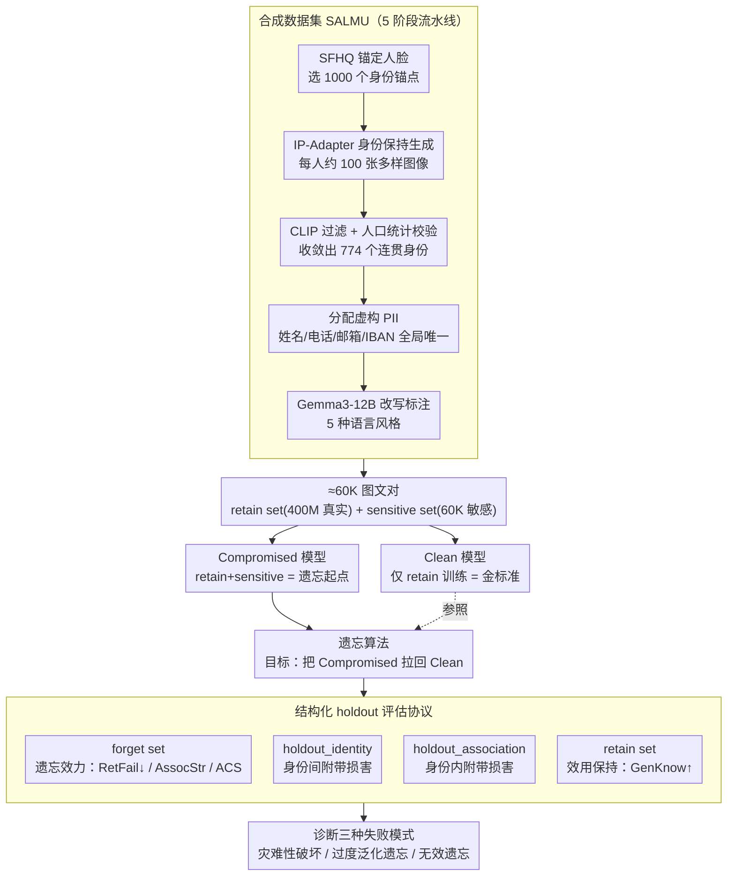

# SALMUBench: A Benchmark for Sensitive Association-Level Multimodal Unlearning

**会议**: CVPR2026  
**arXiv**: [2603.26316](https://arxiv.org/abs/2603.26316)  
**代码**: [cvc-mmu.github.io/salmubench](http://cvc-mmu.github.io/salmubench)  
**领域**: 多模态VLM  
**关键词**: machine unlearning, CLIP, 隐私保护, 关联级别遗忘, benchmark

## 一句话总结
提出 SALMUBench——首个针对 CLIP 类模型的关联级别机器遗忘基准，包含 60K 合成人物-敏感属性配对数据集、从头训练的 Compromised/Clean 模型对，以及结构化 holdout 集评估协议，首次系统揭示了现有遗忘方法的三种失败模式（灾难性破坏、过度泛化遗忘、无效遗忘）。

## 研究背景与动机
CLIP 等视觉语言模型在海量网络数据上训练，可能无意间记忆敏感个人信息（如将人脸与电话号码关联）。GDPR 中的"被遗忘权"要求模型能选择性地删除已学习的敏感关联。

**现有局限**：(1) 单模态遗忘方法难以迁移到对比学习的嵌入型模型；(2) 现有多模态遗忘基准（MLLMU-Bench、FIUBench）主要针对生成式 MLLM 的 VQA 评估，不适用于 CLIP 的嵌入空间；(3) 现有评估通过微调注入敏感知识，无法隔离遗忘效果与预训练伪影；(4) 最关键的是，现有的简单"遗忘-保留"评估框架**无法检测过度泛化遗忘**——方法可能在成功遗忘目标信息的同时无意间擦除相关但不应遗忘的知识。

## 方法详解

### 整体框架
SALMUBench 不是又一个遗忘算法，而是一整套用来客观判断"遗忘到底成没成"的评估基础设施。它要回答的核心问题是：当我们要求 CLIP 忘掉"某张脸 ↔ 某个电话号码"这条敏感关联时，怎么确认它真的忘了，又没有连带擦掉不该忘的知识？为此论文搭了三层东西——先合成一个 60K 规模、人物与敏感属性一一对应的数据集，再从零训练出一对"见过敏感数据"和"没见过"的 CLIP 作为对照，最后用一套带结构化 holdout 的协议去同时量化遗忘效力和附带损害。

### 关键设计

**1. 合成数据集 SALMU：用可控的虚构身份替代真实隐私**

真人隐私数据既不合规也无法公开复现，所以论文用一条 5 阶段流水线造了一批"看着真实、其实全是虚构"的身份。先从 SFHQ 选 1000 张合成人脸当身份锚点；再用 IP-Adapter-FaceID Plus 为每个人生成约 100 张保持同一身份的多样图像；接着用 CLIP 零样本标注 + 一致性检查过滤，收敛出 774 个连贯身份；然后给每人分配文化一致且全局唯一的虚构 PII（姓名、城市、电话、邮箱、IBAN 等）；最后用 Gemma3-12B 把模板标注改写成 5 种语言风格保证文本多样性。最终得到约 60K 图文对，覆盖 774 个虚构人物、65 个国家。这样既给出了一条明确"该被遗忘的关联"，整套数据又能公开发布。

**2. 从头训练的 Compromised/Clean 模型对：把"遗忘目标"和"预训练伪影"隔离开**

以往基准常通过微调把敏感知识注入模型，可这样根本分不清遗忘擦掉的是注入的关联还是模型本就带的预训练痕迹。SALMUBench 改成从零训练两个 ViT-B/16 CLIP：Clean 模型只在 retain set（约 400M 真实图文对）上训练，Compromised 模型在 retain + sensitive（60K）上一起训练，两者同种子、同架构、同配置（32 epochs、128 张 H100）。于是两个模型的唯一差别就来自那 60K 敏感数据——Clean 模型天然就是"理想遗忘结果"的金标准，任何遗忘方法的目标都该是把 Compromised 拉回 Clean。

**3. 结构化 holdout 评估协议：让"过度泛化遗忘"第一次变得可测**

简单的"遗忘集 / 保留集"二分法有个致命盲区——它只看目标关联忘没忘、通用能力掉没掉，却看不见模型在忘掉目标时是否顺手擦掉了相关但不该忘的知识。论文把 774 个敏感身份拆成两组来堵这个盲区：forget set 是遗忘算法能看到的全部数据（含 forget_identity + forget_association）；holdout_identity 是不在 forget 里的另一批身份，用来测**身份间附带损害**；holdout_association 是同一个人的其他关联（比如忘了电话之后，他的职业是否也被擦掉），用来测**身份内附带损害**。配套指标分两类：遗忘效力看 RetFail（检索失败率，主指标，MRR 越低越好）、AssocStr（forget set 上的平均余弦相似度）、ACS（关联一致性，逻辑回归区分正确/打乱配对的准确率）、IdZSC（身份零样本分类准确率）、CoreAssoc（核心关联鲁棒性）；效用保持看 GenKnow（主指标，ImageNet-1K 零样本 Top-1）、InterIdSim / IntraIdSim（holdout 集余弦相似度）、VisIdInt（视觉身份完整性）、FragSim（脆弱知识保持）。靠 holdout 这一层，过度泛化遗忘第一次能被量化诊断出来。

## 实验关键数据

### 主实验（5× 预算）

| 方法 | RetFail ↓ | GenKnow ↑ | InterIdSim | IntraIdSim |
|------|-----------|-----------|------------|------------|
| Clean（目标） | 0.001 | 0.633 | 0.143 | 0.143 |
| Compromised | 0.236 | 0.638 | 0.321 | 0.321 |
| CLIPErase | 0.001 | 0.634 | 0.024 | 0.024 |
| DELETE | 0.001 | 0.632 | 0.023 | 0.023 |
| VLUnlearn | 0.001 | 0.638 | 0.210 | 0.210 |
| Finetuning | 0.003 | 0.638 | 0.209 | 0.209 |
| Neg. Gradient | 0.009 | 0.630 | 0.063 | 0.061 |
| Shuffled Captions | 0.004 | 0.548 | 0.212 | 0.212 |
| Direct Sim. Min. | 0.001 | 0.615 | -0.420 | -0.425 |

### 三种失败模式分析

| 失败类型 | 代表方法 | 特征 |
|---------|---------|------|
| 灾难性破坏 | Shuffled Captions, Direct Sim. Min. | 遗忘有效但 GenKnow 大幅下降 |
| 过度泛化遗忘 | DELETE, CLIPErase | 遗忘精准+GenKnow 保持，但 holdout 严重损坏 |
| 无效遗忘 | Generic Captions | 附带损害小但未能有效遗忘 |

### 关键发现
- **无一方法同时避免三种失败模式**——这是该领域的核心开放问题
- 效用高效的遗忘（>99% 泄漏减少 + <1% GenKnow 下降）是可行的，但现有达到此效果的方法（DELETE, CLIPErase）是通过过度泛化实现的
- AssocStr 被推到 Clean 模型基线（0.142）以下时，会触发过度泛化——方法过度矫正后擦除了相关的、未见过的关联
- 简单"遗忘-保留"评估对过度泛化完全"盲目"

## 亮点与洞察
- **结构化 holdout 评估设计**是论文最大亮点——holdout_identity 和 holdout_association 的设计极其巧妙，首次使过度泛化遗忘可量化
- 从头训练两个完整 CLIP 模型（400M 数据, 128 H100）作为控制实验，虽然成本高但提供了最干净的评估基准
- 合成数据流水线设计精良：IP-Adapter 身份保持 + CLIP 过滤 + LLM 改写 + Faker 生成 PII，可复用性强
- **三种失败模式的分类学**为未来方法研究提供了清晰的目标：需要同时解决遗忘效力、效用保持、和避免过度泛化

## 局限与展望
- 仅针对 CLIP 双编码器，对以 CLIP 为 backbone 的扩散模型中敏感信息传播的评估是自然扩展方向
- 仅覆盖结构化 PII（姓名、电话等），对隐式敏感概念（艺术风格、政治立场等）的泛化未知
- 缺少**可恢复性诊断**——遗忘后的模型能否通过微调快速重新学习被遗忘的信息？
- 合成人脸虽通过 KS 检验验证域一致性，但 100 张真实人像的样本量有限

## 相关工作与启发
- **vs MultiDelete / CLIPErase**：现有方法的遗忘目标不特定于个人隐私信息，且通过微调注入敏感数据，评估不够严格
- **vs TOFU / FIUBench**：针对生成式 MLLM 的 VQA 评估，不适用于 CLIP 的嵌入空间评估
- **启发**：过度泛化遗忘这一现象可能在 LLM 的知识编辑/遗忘中也存在类似问题，值得跨领域验证

## 评分
- 新颖性: ⭐⭐⭐⭐⭐ 首个 CLIP 关联级遗忘基准，结构化 holdout 评估设计极具创新
- 实验充分度: ⭐⭐⭐⭐ 9 种基线方法、多预算对比、三种失败模式分析完整，但主实验仅 ViT-B/16 一种架构
- 写作质量: ⭐⭐⭐⭐⭐ 数据集构建、评估协议、失败模式分类均写得清晰严谨
- 价值: ⭐⭐⭐⭐⭐ 为多模态机器遗忘领域建立了新标准，公开全部数据+模型+评估代码

<!-- RELATED:START -->

## 相关论文

- [\[CVPR 2026\] Empowering Semantic-Sensitive Underwater Image Enhancement with VLM](empowering_semanticsensitive_underwater_image_enha.md)
- [\[CVPR 2026\] Mixture of States (MoS): Routing Token-Level Dynamics for Multimodal Generation](mos_mixture_of_states_multimodal_generation.md)
- [\[ICML 2025\] Efficient Quantification of Multimodal Interaction at Sample Level](../../ICML2025/multimodal_vlm/efficient_quantification_of_multimodal_interaction_at_sample_level.md)
- [\[ACL 2025\] AGRI-CM3: A Chinese Massive Multi-Modal Multi-Level Benchmark for Agricultural Understanding](../../ACL2025/multimodal_vlm/agri-cm3_a_chinese_massive_multi-modal_multi-level_benchmark_for_agricultural_un.md)
- [\[CVPR 2026\] Training High-Level Schedulers with Execution-Feedback Reinforcement Learning for Long-Horizon GUI Automation](training_high-level_schedulers_with_execution-feedback_reinforcement_learning_fo.md)

<!-- RELATED:END -->
