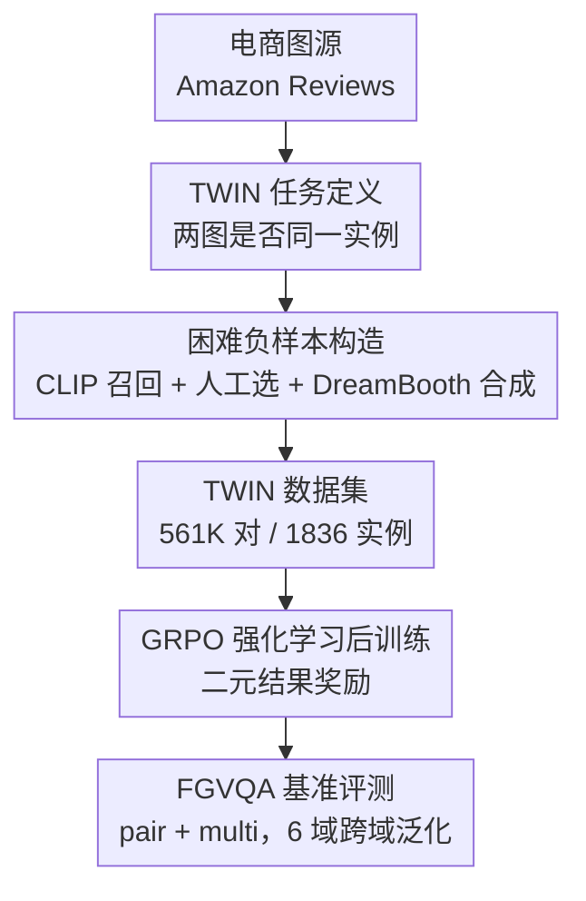

# Same or Not? Enhancing Visual Perception in Vision-Language Models

**会议**: CVPR 2026  
**论文**: [CVF Open Access](https://openaccess.thecvf.com/content/CVPR2026/html/Marsili_Same_or_Not_Enhancing_Visual_Perception_in_Vision-Language_Models_CVPR_2026_paper.html)  
**代码**: https://glab-caltech.github.io/twin/ （项目主页，承诺开源数据/代码/模型）  
**领域**: 多模态VLM  
**关键词**: 细粒度视觉感知, 实例级对比, 困难负样本, 强化学习后训练, VQA基准

## 一句话总结
作者把"细粒度视觉感知"重新定义成一个最简单的二选一任务——给两张相似图片，判断它们是不是同一个物体实例，据此构建了 561K 对的 TWIN 数据集，用 GRPO 强化学习在上面后训练 VLM，让 Qwen2.5-VL 在自建的 FGVQA 基准上最高涨 19.3%，且不损伤通用 VQA 能力。

## 研究背景与动机
**领域现状**：现代 VLM（GPT-4o、Qwen2.5-VL 等）在"宽视野"的视觉理解上很强——能回答物体是什么、空间关系、常识推理。但它们的感知粒度很粗。

**现有痛点**：VLM 系统性地"看不清细节"。论文开篇那个例子很典型：两台 Eureka 牌吸尘器，颜色、品牌、logo 都一样，但集尘桶几何、把手、底座形状完全不同；Qwen2.5-VL 却判定它们是"同一款产品"，并给出自相矛盾的解释。这种粗粒度、视觉偏见、漏看细节的毛病在开源 VLM 上尤其严重。

**核心矛盾**：作者把根因归到训练数据上。主流图文语料压倒性地奖励"类别级"理解（猫还是狗、空间关系、数学推理），几乎没有任何监督信号去逼模型关注"实例级"的细微差异。模型从没被训练去区分"同一类里两个长得几乎一样的不同个体"，自然学不会。

**本文目标**：造一份专门奖励细粒度感知的训练语料，并造一套能量化这种能力的基准。

**切入角度**：与其让模型去描述差异（如已有的 SpotTheDiff），不如把任务压成最干净的二元判断——"这两张图是不是同一个物体？"。这个 setup 监督信号极便宜（只需一个 yes/no 标签，无需任何文字描述标注），却强迫模型去抠形状、纹理、部件几何这些区分实例的线索。

**核心 idea**：用"两图同一实例与否"的成对判断任务（TWIN）替代类别级识别，作为可直接掺进 VLM 训练语料的"细粒度感知增强剂"。

## 方法详解

### 整体框架
这篇论文的"方法"本质是**一条数据驱动的感知增强管线**：先从真实电商图构造一个奖励细粒度判别的成对数据集 TWIN（正样本 + 困难负样本 + 合成负样本），再用纯强化学习（GRPO，奖励只看最终答案对错）后训练现成 VLM，最后用一套跨域的 FGVQA 基准去验证感知能力是否真的提升、且没破坏通用能力。整条链路的关键全在"喂什么数据"上，训练算法本身刻意保持简单。

### 关键设计

**1. TWIN 任务：把细粒度感知压成"两图是否同一实例"的二元判断**

痛点直接对准"训练语料只奖励类别级识别"：作者把细粒度感知重新形式化为一个实例级判别问题——给定两张图 $(I_1, I_2)$，模型输出一段解释和一个最终答案 $\hat{y} \in \{\text{yes}, \text{no}\}$，判断它们是否是同一个物理实例。这里"实例"被定义为同一个物体在不同视角、光照、背景下的图像集合。和"猫 vs 狗"的类别识别相反，这个任务逼模型去关注形状、纹理、部件几何这些**区分同类不同个体**的细线索。最妙的是监督成本：整个任务只需要成对的 yes/no 标签，不需要任何描述性文字标注，因此天然可扩展。数据从 Amazon Reviews 取材，聚焦家居物品（图源充足、且与机器人/具身交互等下游任务高度相关），人工标注员逐张核验。

**2. 困难负样本：真实困难负样本 + DreamBooth 合成负样本双轨构造**

这是整篇论文实验中被证明"最关键"的设计。痛点是：如果负样本太随机（拿杯子配电扇），任务就退化成类别识别，学不到细粒度。所以作者只要**长得像、但确实不同**的负样本。真实困难负样本的挖法是：先用 CLIP 算图像 embedding 的两两余弦相似度，把视觉相似的候选短名单召回，再由人工标注员从中敲定最终配对（例如两个形状略异的白花瓶、纹理与扶手设计不同的两把白椅子）。但人工挖困难负样本昂贵且难扩展，于是第二轨用个性化生成模型 DreamBooth 给某个实例生成"保持整体外观、只改细节"的变体当合成困难负样本——例如同款音箱，几何颜色都对得上，但少了红色 logo、轮廓也更淡，每张合成图同样过人工核验。最终 TWIN 含 123K 正样本、438K 负样本、22K 张图、1836 个实例、5288 张合成图。消融显示，去掉困难负样本平均掉 4.5%（63.1%→58.6%），在 TWIN-Eval 上更是从 65.3% 暴跌到 51.1%，坐实了它的价值。

**3. GRPO 纯强化学习后训练：只用"答案对错"二元奖励**

痛点是后训练常见的"学了新技能、忘了旧本事"（SFT/蒸馏容易遗忘、泛化下降）。作者选用强化学习而非 SFT，因为 RL 被反复证明能在提升能力的同时保住原有技能。具体地，VLM $\pi_\theta$ 被提示先产出文字解释、再给最终答案 $\hat{y}$，奖励是最朴素的二元结果奖励 $R(y, \hat{y}) = \mathbb{1}\{y = \hat{y}\}$——只比对最终答案与真值，完全不监督中间解释的 token。优化用 GRPO（在最大化期望优势和防止偏离预训练模型之间取平衡）。这种"只奖励最终答案"的设计让监督信号极稀疏却也极干净。论文还专门对比了 SFT vs RL：RL 在分布外数据集上明显更强（CUB 65.0% vs 53.9%，MET 58.7% vs 52.3%），印证了 RL 更能保住泛化。

**4. FGVQA 基准：把已有识别/检索数据集重铸成跨域 VLM 评测**

光有训练数据不够，还得有量尺。痛点是传统细粒度识别基准都是 1-of-N 分类或检索格式，不适合直接评 VLM。作者把 6 个现成数据集重新改造成 VQA 格式，共 12K 条查询，覆盖艺术品（MET）、零售商品（ILIAS）、地标（LANDMARKS）、鸟类（CUB）、动植物（INQUIRE），外加同 TWIN 工艺但用未见实例采集的 TWIN-Eval。每个数据集出两种题型各 1000 条：**pair** 题给两张图问是否同一实例；**multi** 题给一张参考图 + 三张候选，问有几张和参考匹配（0-3 各 250 条均匀分布）。multi 题在结构上和训练数据不同，因此模型在 multi 上同样涨点，能证明学到的是真感知能力而非任务过拟合。

### 损失函数 / 训练策略
后训练目标即上面的二元结果奖励 $R(y, \hat{y}) = \mathbb{1}\{y = \hat{y}\}$，用 GRPO 优化。实现上训练 Qwen2.5-VL-3B-Instruct 与 InternVL3.5-1B-Instruct，4 张 A100、1 个 epoch、batch size 480、group size 5、学习率 $10^{-6}$，每个 batch 内平衡正负样本，框架用 verl。

## 实验关键数据

### 主实验
在 FGVQA 上后训练 TWIN 带来跨域一致提升（除 TWIN-Eval 外均为 zero-shot 评测）。下表为 Qwen2.5-VL 3B 的 Total 准确率（%）：

| 数据集 | Qwen2.5-VL 3B | + TWIN | 提升 |
|--------|---------------|--------|------|
| TWIN-Eval | 50.1 | 67.3 | +17.2 |
| ILIAS | 43.5 | 61.8 | +18.3 |
| INQUIRE（域外） | 54.4 | 73.7 | +19.3 |
| CUB（域外） | 60.7 | 75.1 | +14.4 |
| LANDMARKS（域外） | 53.9 | 57.9 | +4.0 |
| MET（域外） | 55.5 | 66.0 | +10.5 |

INQUIRE 的提升把与专有模型的差距从 29.5% 缩到 10.2%；训练后的 Qwen2.5-VL 在 TWIN-Eval、INQUIRE、CUB 上还反超了最强开源 baseline Gemma3。InternVL3.5 1B 虽更小，也有一致小幅增益（CUB +3.8、LANDMARKS +3.0）。

### 消融实验

| 配置 | MEAN | TWIN-Eval | ILIAS | INQUIRE | 说明 |
|------|------|-----------|-------|---------|------|
| Qwen2.5-VL 3B | 53.0 | 50.1 | 43.5 | 54.4 | 基线 |
| + TWIN w/o 困难负样本 | 58.6 | 51.1 | 53.1 | 60.9 | 困难负样本换成随机负样本 |
| + TWIN | 63.1 | 65.3 | 58.4 | 68.7 | 完整数据 |

困难负样本平均贡献 +4.5%，在 in-domain 的 TWIN-Eval 上贡献最大（+14.2）。另一组 SFT vs RL 对比（同一 TWIN 子集）：

| 后训练方式 | MEAN | CUB | MET | 说明 |
|------------|------|-----|-----|------|
| SFT | 53.8 | 53.9 | 52.3 | 监督全部输出 token（含 CoT） |
| RL (GRPO) | 57.5 | 65.0 | 58.7 | 仅奖励最终答案 |

### 关键发现
- **困难负样本是命门**：它是唯一被反复强调"critical"的构造决策，去掉后 in-domain 性能近乎腰斩到基线水平。
- **数据规模才是上限**：5K→561K 时 TWIN-Eval 48.5%→67.3%、ILIAS 44.2%→61.8%，且域外的 INQUIRE 53.3%→73.7% 同步涨，说明 TWIN 随实例标注数良性扩张是性能关键。
- **不伤通用能力**：在 11 个通用 VQA 基准（SEED/MMMU/POPE/TEXTVQA 等）上后训练后基本持平甚至小涨（NLVR2 +1.4、AI2D +0.8）；纯文本基准（MMLU/HELLASWAG/GSM8K）几乎不变。
- **改善的是底层表示**：对 Qwen2.5-VL 视觉编码器做线性探针/KNN，PETS 线性探针 75.0%→79.1%、CIFAR100 KNN 71.8%→73.2%，说明 TWIN 让编码器产出更适合细粒度判别的 embedding，而非仅靠语言端记题。

## 亮点与洞察
- **"二选一"是被低估的强监督**：把细粒度感知压成 yes/no 成对判断，既让标注成本降到只需一个布尔标签，又能用纯结果奖励驱动 RL——监督最稀疏，效果却最跨域，这个"少即是多"的设计很值得借鉴。
- **困难负样本的双轨工程化**：CLIP 召回缩小人工搜索空间 + DreamBooth 合成补量，是一个可复用的"低成本造困难负样本"配方，可迁到任何需要 instance-level 对比的任务（检索、reID、防伪）。
- **multi 题作为"防过拟合探针"**：用一种结构不同于训练数据的题型来验证"学到的是能力而非任务"，这种评测设计思路对任何"在窄任务上训、想证明泛化"的工作都有参考价值。
- **drop-in 定位**：作者把 TWIN 明确定位成可直接掺进现有开源 VLM 训练语料的补充剂，而非独立模型，这让它的落地门槛极低。

## 局限与展望
- 作者承认奖励只用最终答案，较"贫瘠"；未来可用多模态验证器给出更结构化的奖励信号。
- 困难负样本仍靠人工敲定，规模化受限；可探索 model-in-the-loop 数据引擎自动挖更难的负样本。
- TWIN 含大量视角变化，要求模型对跨图变化的部件几何做推理；引入显式 3D 表示或许能进一步提升。
- ⚠️ 自评补充：训练规模集中在 1B/3B 小模型，对大模型是否仍有同等增益、以及合成负样本占比（5288/22157）对最终性能的独立贡献未单独消融。家居物品域虽强调可泛化，但 MET/LANDMARKS 提升明显偏小（+10.5/+4.0），暗示跨域增益并非均匀。

## 相关工作与启发
- **vs SpotTheDiff / Birds-to-Words**：它们给图配文字描述差异，TWIN 改成二元同/异判断且同时含正负配对，规模大两个数量级（561K vs 13K/3.3K），且跨多类物体而非单一鸟类域——监督更便宜、覆盖更广。
- **vs 传统细粒度识别（CUB/iNat 等）**：那些是 1-of-N 分类/检索，格式不适配 VLM；本文把它们重铸成 pair/multi 的 VQA 题，让同一套数据既能训也能评 VLM。
- **vs SFT/蒸馏后训练**：本文选 GRPO 强化学习，实验证明在分布外数据上明显更抗遗忘、更保泛化，与"RL 比 SFT 更利于保住通用能力"的既有结论一致。

## 评分
- 新颖性: ⭐⭐⭐⭐ 任务形式化与数据构造的组合很巧，但底层是"造数据 + 标准 GRPO"，算法层创新有限。
- 实验充分度: ⭐⭐⭐⭐⭐ 主结果 + 困难负样本/规模/SFT-vs-RL 消融 + 编码器探针 + 通用VQA/纯文本保持性，覆盖非常全。
- 写作质量: ⭐⭐⭐⭐⭐ 动机（吸尘器例子）到方法到验证逻辑闭环清晰，图表丰富。
- 价值: ⭐⭐⭐⭐⭐ drop-in 数据集 + 开源数据/代码/模型 + 跨域基准，对开源 VLM 社区实用性强。

<!-- RELATED:START -->

## 相关论文

- [\[CVPR 2026\] Enhancing Descriptive Captions with Visual Attributes for Multimodal Perception](enhancing_descriptive_captions_with_visual_attributes_for_multimodal_perception.md)
- [\[CVPR 2026\] DiG: Differential Grounding for Enhancing Fine-Grained Perception in Multimodal Large Language Models](dig_differential_grounding_for_enhancing_fine-grained_perception_in_multimodal_l.md)
- [\[CVPR 2026\] Perception Programs: Unlocking Visual Tool Reasoning in Language Models](perception_programs_visual_tool_reasoning.md)
- [\[CVPR 2026\] Abstract 3D Perception for Spatial Intelligence in Vision-Language Models](abstract_3d_perception_for_spatial_intelligence_in_vision-language_models.md)
- [\[CVPR 2026\] Bias Is a Subspace, Not a Coordinate: A Geometric Rethinking of Post-hoc Debiasing in Vision-Language Models](bias_is_a_subspace_not_a_coordinate_a_geometric_rethinking_of_post-hoc_debiasing.md)

<!-- RELATED:END -->
