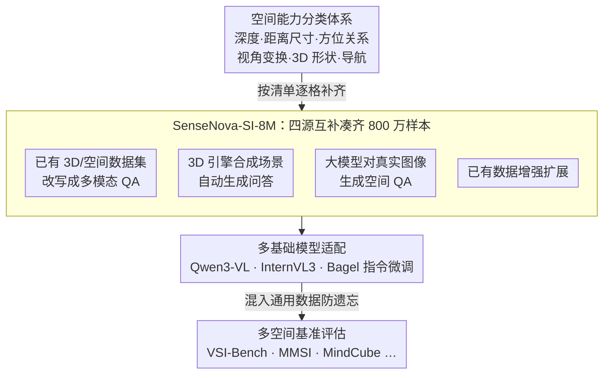

# Scaling Spatial Intelligence with Multimodal Foundation Models

**会议**: CVPR 2026  
**arXiv**: [2511.13719](https://arxiv.org/abs/2511.13719)  
**代码**: [https://github.com/OpenSenseNova/SenseNova-SI](https://github.com/OpenSenseNova/SenseNova-SI)  
**领域**: 多模态VLM / 空间智能  
**关键词**: 空间智能, 多模态基础模型, 数据扩展, 空间推理, 基准测试

## 一句话总结

SenseNova-SI 通过系统化构建800万级多样化空间数据（SenseNova-SI-8M），在 Qwen3-VL、InternVL3 和 Bagel 等多模态基础模型上培养空间智能能力，在 VSI-Bench、MMSI 等多个空间基准上取得前所未有的性能，同时保持通用多模态理解能力。

## 研究背景与动机

**领域现状**：多模态基础模型（如 GPT-4V、Gemini、Qwen-VL 等）在视觉理解、文本生成等任务上表现优异，但在空间智能——包括深度估计、空间关系判断、3D 场景理解、视角变换推理等方面仍存在明显不足。

**现有痛点**：(1) 现有多模态模型在空间推理任务上的表现远低于其在通用视觉问答上的水平，说明互联网规模的训练数据中缺乏足够的空间信息；(2) 缺少系统性的空间能力分类体系来指导数据构建；(3) 数据扩展对空间智能的影响、过拟合风险、语言捷径等问题尚未被充分研究。

**核心矛盾**：多模态模型的空间智能不足，根源在于训练数据中空间相关样本的数量和多样性不足，而非模型架构的限制。

**本文目标**：通过大规模数据扩展的方式，在已有的多模态基础模型上培养空间智能，并深入分析数据规模、多样性、过拟合风险等因素的影响。

**切入角度**：不改模型架构，而是系统化地构建一个覆盖多种空间能力的大规模数据集（800万样本），通过数据驱动的方式提升空间智能。

**核心 idea**：以严格的空间能力分类体系为指导，构建800万级多样化空间数据，在已有基础模型上通过微调实现空间智能的显著提升。

## 方法详解

### 整体框架

SenseNova-SI 构建于已有的多模态基础模型之上，采用"数据驱动"的策略提升空间智能。整体流程为：(1) 建立空间能力分类体系；(2) 在该体系指导下系统化收集、生成、扩增800万级数据样本（SenseNova-SI-8M）；(3) 在 Qwen3-VL、InternVL3（视觉理解模型）和 Bagel（统一理解-生成模型）上进行微调；(4) 在多个空间基准上评估并分析各种因素的影响。

### 关键设计

**1. 空间能力分类体系：先把"空间智能"拆成可定义、可采集的子能力，再去找数据**

如果一上来就笼统地"收空间数据"，很容易全堆在某一类样本上（比如清一色的左右关系判断），其它维度却几乎没覆盖。本文先把空间智能拆成若干具体维度——深度感知、距离与尺寸估计、上下左右/前后远近的关系判断、视角变换推理、3D 形状理解、空间导航等——每个维度都对应一类明确的训练样本。这套分类体系成了后续所有数据采集的"清单"：要凑齐 800 万样本，先看每个格子里有没有装满，缺哪类就补哪类。它的价值不只是指导建数据，也顺带给社区提供了一个评估空间能力的框架。

**2. SenseNova-SI-8M：用四条互补的来源把分类体系的每个格子都填满**

光有分类体系还不够，关键是怎么按这套清单真正凑出 800 万条覆盖均衡的样本。本文用了四条互补的渠道：从已有的 3D / 空间数据集里提取标注并改写成多模态 QA 格式；用 3D 引擎合成空间场景、自动生成配套问答；让大模型对真实图像生成空间相关的问答对；再对已有数据做增强扩展。四条来源各有侧重——真实数据集保真实性、3D 引擎保精确几何标注、大模型生成保语言多样性——合在一起既上了量级，也补齐了之前工作覆盖维度有限、数据量不够的短板。

**3. 多基础模型适配：在三类不同架构上都验证，证明涨点来自数据而非某个模型**

数据扩展方法最容易被质疑的一点是"会不会只是恰好契合某个模型"。为打消这个疑虑，本文特意选了三类结构不同的基础模型来跑：纯视觉理解的 Qwen3-VL 和 InternVL3，以及统一理解-生成的 Bagel。同一份 SenseNova-SI-8M 喂给这三者做指令微调，空间能力都得到显著提升，说明收益来自数据本身、是一种可迁移的通用策略，而不是绑死在某一种架构上的偶然结果。

### 损失函数 / 训练策略

- **训练方式**：标准的指令微调（Instruction Tuning），使用 SenseNova-SI-8M 数据集对已有基础模型进行进一步微调
- **防止能力遗忘**：在微调过程中混入一定比例的通用多模态数据，避免空间智能提升的同时通用能力下降
- **数据配比策略**：不同空间能力维度的数据按照一定比例混合，确保各能力均得到充分训练

## 实验关键数据

### 主实验

| Benchmark | 指标 | SenseNova-SI | 之前SOTA | 提升 |
|-----------|------|-------------|----------|------|
| VSI-Bench | Accuracy | 68.8% | ~55% | +13.8% |
| MMSI | Accuracy | 43.3% | ~35% | +8.3% |
| MindCube | Accuracy | 85.7% | ~70% | +15.7% |
| ViewSpatial | Accuracy | 54.7% | ~45% | +9.7% |
| SITE | Accuracy | 47.7% | ~40% | +7.7% |
| BLINK | Accuracy | 63.9% | ~55% | +8.9% |
| 3DSR | Accuracy | 55.5% | ~45% | +10.5% |
| EmbSpatial | Accuracy | 72.0% | ~60% | +12.0% |
| MMBench-En | Accuracy | 84.9% | 84.9% | 持平 |

### 消融实验

| 配置 | VSI-Bench | MMBench-En | 说明 |
|------|-----------|------------|------|
| 基础模型（无微调） | ~55% | 84.9% | 空间能力弱但通用能力强 |
| + 1M 空间数据 | ~60% | 84.5% | 空间提升但有限 |
| + 4M 空间数据 | ~65% | 84.7% | 数据扩展带来持续提升 |
| + 8M 空间数据 (Full) | 68.8% | 84.9% | 最佳空间 + 保持通用 |

### 关键发现

- **数据扩展曲线**：空间智能随数据量增加呈近似对数增长，说明更多数据仍有收益但边际效应递减
- **涌现泛化能力**：在多样化数据训练后，模型在未见过的空间任务类型上也展现了一定的泛化能力
- **过拟合风险**：某些空间基准上存在过拟合迹象，尤其是数据分布与测试集相似的情况
- **语言捷径**：部分空间推理任务存在语言捷径（不看图就能猜对），需要注意数据去偏
- **通用能力保持**：通过适当的数据混合策略，空间智能的提升不会损害通用多模态理解能力

## 亮点与洞察

- **数据驱动而非架构创新的范式**：证明空间智能可以通过大规模数据扩展来获得，不需要修改模型架构。这对其他能力缺陷的改进提供了参考思路
- **系统化的空间能力分类**：建立的分类体系不仅指导了数据构建，也为社区评估空间智能提供了框架
- **涌现泛化的早期信号**：数据多样性带来的涌现泛化是一个值得深入研究的方向，暗示大规模多样数据可能是通向通用空间智能的关键

## 局限与展望

- 800万数据的构建成本高，且部分依赖合成数据，合成数据的真实性和多样性有待评估
- 空间链式思维推理（Spatial CoT）还处于初步阶段，更复杂的多步空间推理能力有限
- 主要在静态图像上评估，视频和交互式场景中的空间智能评估缺失
- 对于需要精确数值输出的空间任务（如精确深度估计），当前方法的精度仍有提升空间
- 数据扩展的边际效应递减，未来可能需要结合架构改进或新的训练范式

## 相关工作与启发

- **vs SpatialVLM**: SpatialVLM 专注于2D空间关系，SenseNova-SI 覆盖的空间能力维度更广泛（包括3D）且数据规模大得多
- **vs SpatialRGPT**: SpatialRGPT 关注区域级空间推理，SenseNova-SI 从更宏观的角度系统化地提升整体空间智能
- **vs 专用3D模型**: 专用3D视觉模型在特定任务上可能更强，但 SenseNova-SI 保持了通用多模态能力，是通用模型路线

## 评分

- 新颖性: ⭐⭐⭐ 核心思路是数据扩展，方法层面创新有限，但系统性工作有价值
- 实验充分度: ⭐⭐⭐⭐⭐ 8个空间基准 + 通用基准，消融和分析非常全面
- 写作质量: ⭐⭐⭐⭐ 报告式写作，内容丰富但略显冗长
- 价值: ⭐⭐⭐⭐ 模型和数据开源，对社区有明确贡献

<!-- RELATED:START -->

## 相关论文

- [\[CVPR 2026\] SpatialScore: Towards Comprehensive Evaluation for Spatial Intelligence](spatialscore_towards_comprehensive_evaluation_for_spatial_intelligence.md)
- [\[ICLR 2026\] On the Generalization Capacities of MLLMs for Spatial Intelligence](../../ICLR2026/multimodal_vlm/on_the_generalization_capacities_of_mllms_for_spatial_intelligence.md)
- [\[ICML 2026\] Thinking in Structures: Evaluating Spatial Intelligence in Constraint-Governed Spaces](../../ICML2026/multimodal_vlm/thinking_in_structures_evaluating_spatial_intelligence_in_constraint-governed_sp.md)
- [\[CVPR 2026\] Nano-EmoX: Unifying Multimodal Emotional Intelligence from Perception to Empathy](nano-emox_unifying_multimodal_emotional_intelligence_from_perception_to_empathy.md)
- [\[ICML 2026\] ReVSI: Rebuilding Visual Spatial Intelligence Evaluation for Accurate Assessment of VLM 3D Reasoning](../../ICML2026/multimodal_vlm/revsi_rebuilding_visual_spatial_intelligence_evaluation_for_accurate_assessment_.md)

<!-- RELATED:END -->
