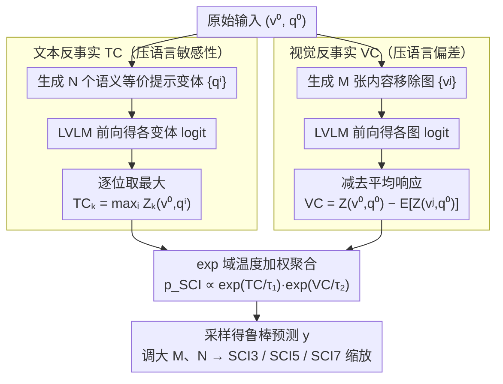

# Scaling Test-Time Robustness of Vision-Language Models via Self-Critical Inference Framework

**会议**: CVPR 2026  
**arXiv**: [2603.07659](https://arxiv.org/abs/2603.07659)  
**代码**: [https://github.com/KaihuaTang/Self-Critical-Inference-Framework](https://github.com/KaihuaTang/Self-Critical-Inference-Framework)  
**领域**: 多模态VLM  
**关键词**: LVLM鲁棒性, 反事实推理, 语言偏差, 语言敏感性, 测试时缩放

## 一句话总结
提出 Self-Critical Inference (SCI) 框架，通过多轮文本+视觉反事实推理的 logit 聚合来同时解决 LVLM 的语言偏差和语言敏感性问题，并提出 DRBench 动态鲁棒性基准来模型特异地评估鲁棒性。增加反事实推理轮次可持续提升鲁棒性，开辟了测试时缩放的新方向。

## 研究背景与动机
**领域现状**：LVLM 通过将视觉编码器与预训练 LLM 结合并联合微调，取得了强大的视觉语言能力。

**现有痛点**：
   - **语言偏差**：模型依赖语言先验而非视觉输入回答问题，产生物体幻觉（如生成不存在的内容）
   - **语言敏感性**：对提示词的微小语义等价变化产生不同回答，破坏一致性和可靠性
   - VCD 等方法只处理视觉反事实（偏差问题），完全忽略了文本反事实（敏感性问题）

**核心矛盾**：VCD 本质是对原始 logit 用 TIE logit 进行加权，只有一个维度（视觉）的反事实；但 LVLM 的鲁棒性问题是双维度的。

**本文目标**：同时缓解语言偏差和语言敏感性，并发现增加推理轮次可以提升鲁棒性。

**切入角度**：从 CF-VQA 的因果分析角度统一理解 VCD，揭示 $\alpha$ 的物理意义（TIE 的温度参数），然后自然扩展到文本反事实。

**核心idea**：VCD = TIE 重加权，那么可以同时做 Textual Counterfactual (TC) 和 Visual Counterfactual (VC)，通过多轮 logit 聚合实现测试时鲁棒性缩放。

## 方法详解

### 整体框架
SCI 想在不训练的前提下，同时压住 LVLM 的两个老毛病——靠语言先验瞎编（语言偏差）和换个措辞就改口（语言敏感性）。它的做法是把"自我批判"塞进解码：对原始输入 $(v^0, q^0)$，一方面造出 N 个语义等价但说法不同的文本变体 $\{q^i\}$，一方面造出 M 个抹掉关键内容的视觉变体 $\{v^j\}$，分别算出文本反事实 logit（TC）和视觉反事实 logit（VC），最后在 exp 域把两者按各自温度加权相乘得到预测：$p_{SCI}(y) \propto \exp(TC/\tau_1) \cdot \exp(VC/\tau_2)$。两条反事实线各管一种鲁棒性，缺一不可，而变体数 M、N 越大、推理轮次越多，鲁棒性越高——这正是它"测试时缩放"的入口。整套机制的理论支点则来自一个观察：VCD 本质就是拿 TIE logit 给原始分布做温度重加权，这让"把反事实从视觉维度扩展到文本维度"变得顺理成章。

### 关键设计

**1. 把 VCD 看成 TIE 重加权：给文本维度的扩展找到理论支点**

之前 VCD 这类去偏方法只在视觉一侧动手，要把同样的思路搬到文本一侧，先得想清楚 VCD 到底在做什么。本文从 CF-VQA 的因果视角拆解 VCD 的 logit：$Z_{vcd} = (1+\alpha)Z(v,q) - \alpha Z(v^*,q)$，其中 $v^*$ 是抹掉内容的反事实图像。把它放到 exp 域展开，会得到 $p(y) \propto \exp(Z(v,q)) \cdot \exp(\text{TIE}/\tau)$——也就是说 VCD 本质上是拿 TIE（总间接效应）logit 当一个词汇级的重加权项乘到原始分布上，而 $\alpha$ 不是什么神秘系数，它就是温度 $\tau = 1/\alpha$。这一步把 VCD 和 CF-VQA 接到了同一套框架里，关键意义在于：既然反事实重加权可以沿视觉维度做，那它同样可以沿文本维度做，TC 的引入就有了顺理成章的落点。

**2. Textual Counterfactual：用"逐位取最大"挑出跨措辞最稳的预测，压住语言敏感性**

语言敏感性的症结是同一个问题换个说法答案就变，说明模型在某些 token 上被特定措辞带偏了。TC 的对策是把语义等价的多个提示变体 $\{q^i\}$ 一起喂进去，对每个词汇位置 $k$ 取所有变体 logit 的逐元素最大值：$TC_k = \max_i\big(Z_k(v^0, q^i)\big)$。直觉是：如果某个候选 token 只在个别措辞下被强行推高、在其他说法下并不突出，那它多半是措辞带来的噪声；而真正由视觉证据支撑的答案，会在各种措辞下都保持高 logit，取最大值恰好保留这些一致信号、削掉措辞专属的偏置。举个具体的：问"图里有几只猫"和"数一数画面中猫的数量"，若前者因句式诱导把"three"顶高、后者没有，TC 不会让这种不稳定的"three"主导最终分布。

**3. Visual Counterfactual：用多张内容移除图的平均 logit 稳健估计语言偏差**

VCD 只拿单张噪声图当反事实，估出来的偏差方差大、不稳。VC 把它扩成多张反事实图像：$VC = Z(v^0, q^0) - \mathbb{E}\big[Z(v^j, q^0)\big]$，用 M 张内容被移除的图像的平均响应来刻画"没有视觉证据时模型会怎么答"，再从原始 logit 里减掉这部分纯语言先验。多张取均值让偏差估计更平滑，因此减偏更可靠，这也是它比单图 VCD 更稳的原因。

**4. SCI3 / SCI5 / SCI7：把变体数当旋钮，换来测试时鲁棒性缩放**

把 TC 的 N 和 VC 的 M 一起调大，就得到不同档位的 SCI：SCI3 取 $M=N=1$（共 3 次前向），SCI5 取 $M=N=2$（5 次），SCI7 取 $M=N=3$（7 次）。实验里档位越高鲁棒性越强，代价是前向次数线性增长。它的意义在于给出了一条和 CoT 拉长中间 token 正交的缩放轴——不靠更长的思维链，而靠更多轮反事实推理来换鲁棒性。

### 损失函数 / 训练策略
纯推理时方法，无需训练。TC 与 VC 的温度参数 $\tau_1, \tau_2$ 在验证集上调一次即可。

## 实验关键数据

### 主实验（DRBench BS Subset Overall）

| 方法 | LLaVA-NeXT BS↑ | Qwen2-VL BS↑ |
|------|:---------:|:---------:|
| Baseline | 18.75 | 14.52 |
| TIE | 27.31 | - |
| VCD | 27.89 | - |
| M3ID | 29.05 | - |
| **SCI3** | **32.72** | - |
| **SCI5** | **34.19** | - |
| **SCI7** | **34.92** | - |

### 消融分析

| 配置 | 效果 | 说明 |
|------|------|------|
| 仅 VC (≈VCD) | 偏差改善但敏感性不变 | 只解决一半问题 |
| 仅 TC | 敏感性改善但偏差不变 | 只解决另一半 |
| VC + TC (SCI) | 同时改善两个问题 | 统一框架的优势 |
| SCI3→SCI5→SCI7 | 持续提升1-2% | 测试时缩放有效 |

### 关键发现
- **偏差与敏感性样本重叠极少**：LLaVA-NeXT 的 24.68% 困难样本中仅 7.34% 与 Qwen2-VL 共享，证明鲁棒性是模型特异的
- Qwen2-VL 整体更鲁棒，但更容易受偏差影响；LLaVA-NeXT 敏感性问题更突出
- 增加反事实轮次（SCI3→SCI7）持续提升，暗示测试时鲁棒性缩放的潜力未被充分探索
- TC 和 VC 解决不同类型的鲁棒性问题，缺一不可

## 亮点与洞察
- **统一了 VCD 和 CF-VQA**：揭示 VCD 就是加了温度缩放的 TIE 重加权，这个分析本身就有独立价值
- **测试时鲁棒性缩放**：不同于传统的测试时缩放（增加中间 token 长度），通过增加反事实推理轮次来提升鲁棒性。这开辟了与 CoT 扩展正交的新方向
- **DRBench 的设计思想**：动态、模型特异的 benchmark，可以自动从任何数据集转化，解决了固定 benchmark 被后续模型训练数据包含的问题
- 方法与模型无关，可以直接插入任何 LVLM 推理流程

## 局限与展望
- 推理成本线性增长：SCI7 需要 7 次前向传播
- 文本变体和视觉变体的生成策略相对简单，更先进的反事实生成可能进一步提升
- 温度参数 $\tau_1, \tau_2$ 需要人工调优
- DRBench 依赖特定的反事实生成方法来构建偏差和敏感性子集

## 相关工作与启发
- **vs VCD**：VCD 是 SCI 的特例（N=0, M=1），SCI 扩展了反事实维度并引入了测试时缩放
- **vs CF-VQA / TDE**：在传统 VQA 中使用因果分析去偏，本文证明同样的思想适用于 LVLM 并且可以自然扩展到语言敏感性

## 评分
- 新颖性: ⭐⭐⭐⭐ 统一分析有洞察力，测试时缩放方向新颖
- 实验充分度: ⭐⭐⭐⭐ 6个数据集两个模型，DRBench设计合理
- 写作质量: ⭐⭐⭐⭐⭐ 理论分析精彩，从VCD到SCI的推导自然
- 价值: ⭐⭐⭐⭐ 实用的推理时鲁棒性增强方法

<!-- RELATED:START -->

## 相关论文

- [\[CVPR 2026\] Evolving Contextual Safety in Multi-Modal Large Language Models via Inference-Time Self-Reflective Memory](evolving_contextual_safety_in_multi-modal_large_language_models_via_inference-ti.md)
- [\[CVPR 2026\] Activation Matters: Test-time Activated Negative Labels for OOD Detection with Vision-Language Models](activation_matters_test-time_activated_negative_labels_for_ood_detection_with_vi.md)
- [\[NeurIPS 2025\] The Illusion of Progress? A Critical Look at Test-Time Adaptation for Vision-Language Models](../../NeurIPS2025/multimodal_vlm/the_illusion_of_progress_a_critical_look_at_testtime_adaptat.md)
- [\[CVPR 2026\] Decoupling Stability and Plasticity for Multi-Modal Test-Time Adaptation](decoupling_stability_and_plasticity_for_multi-modal_test-time_adaptation.md)
- [\[NeurIPS 2025\] SITCOM: Scaling Inference-Time COMpute for VLAs](../../NeurIPS2025/multimodal_vlm/sitcom_scaling_inference-time_compute_for_vlas.md)

<!-- RELATED:END -->
