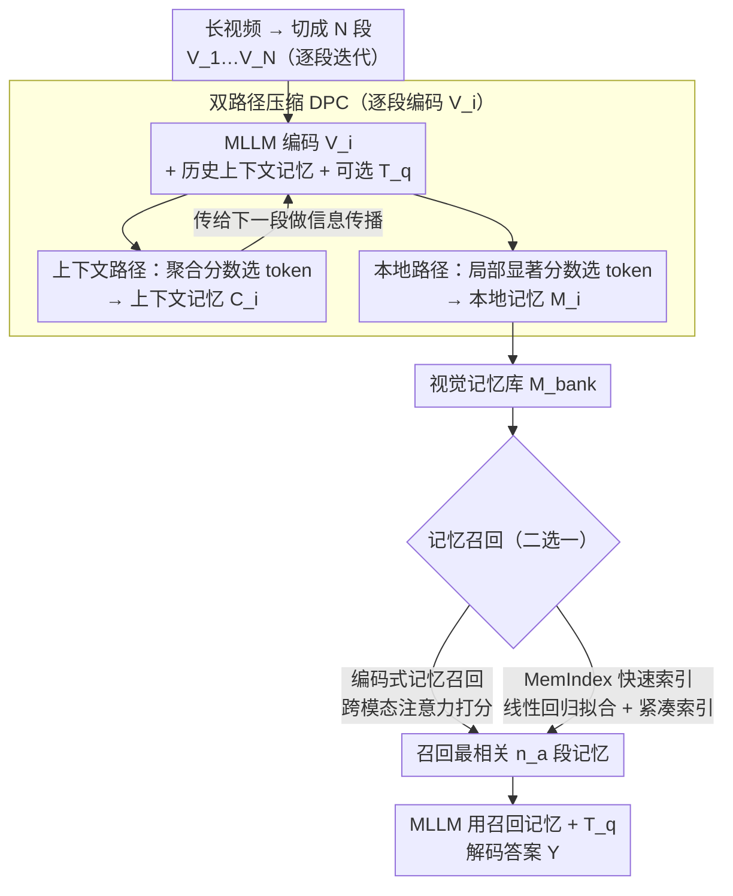

# Scaling the Long Video Understanding of Multimodal Large Language Models via Visual Memory Mechanism

**会议**: CVPR2026  
**arXiv**: [2603.29252](https://arxiv.org/abs/2603.29252)  
**代码**: [FlexMem](https://github.com/FlexMem)  
**领域**: 多模态VLM  
**关键词**: 长视频理解, 视觉记忆, KV缓存压缩, 训练免, 流式视频

## 一句话总结
提出 FlexMem——一种训练免的视觉记忆机制，通过迭代式双路径 KV 缓存压缩构建视觉记忆库，结合编码式和快速索引式记忆召回策略，让 MLLM 在单张 3090 GPU 上处理 1000+ 帧长视频，大幅超越现有高效视频理解方法。

## 研究背景与动机
长视频理解是 MLLM 面临的核心挑战。主要困难在于：长视频的大量视觉 token 容易超过 MLLM 的序列长度上限（如 1024 帧可产生 200K+ token），导致性能退化和巨大内存开销。

现有方案的不足：(1) **RAG 方法**（如 AKS）：检索关键帧+局部处理，擅长 needle-in-haystack 但无法处理需全局理解的任务，且仍受内存限制；(2) **视觉压缩方法**（如 AdaRETAKE）：压缩 KV 缓存增加输入帧数，但仍需一次性输入所有压缩特征进行解码，计算瓶颈依然存在，且输入长度随视频时长线性增长。

**核心 idea**：模拟人类观看视频的行为——持续观看、形成记忆、基于相关记忆片段回答问题。通过迭代处理视频片段形成固定大小的记忆库，打破输入长度上限，理论上可处理无限长视频。

## 方法详解

### 整体框架
FlexMem 想解决的是"长视频一股脑塞进 MLLM 会爆序列长度"这件事。它的思路模仿人看视频——不是把 1000 多帧一次性记住，而是边看边压缩、形成固定大小的记忆库，回答问题时再按相关性把片段召回来。具体地，把长视频切成 $N$ 个片段 $\{V_1, ..., V_N\}$ 逐段处理：每段编码时带上历史上下文记忆，经双路径压缩产出两份东西——传给下一段的上下文记忆 $C_i$ 和存进记忆库的本地记忆 $M_i$；全部处理完后，从记忆库里召回和问题最相关的几段来作答。因为记忆库大小固定，输入长度不再随视频时长线性增长，理论上能处理无限长视频。

### 关键设计

**1. 双路径压缩：prefill 和 decoding 对 token 的需求根本不同**

如果只用一种压缩策略，要么丢掉了跨段传递信息所需的"连接 token"，要么留了一堆对最终解码没用的冗余。FlexMem 据此分两条路压。一条产出上下文记忆 $C_i$，服务 prefill 阶段的信息传播，用聚合分数 $s_j^l = \sum_{k \in C} a_{jk}^l + \sum_{h \in V_i} a_{hj}^l$ 来选——既能从历史上下文聚合信息、又能向后传播信息的 token 才留，压缩比为 $\alpha_c$；另一条产出本地记忆 $M_i$ 存进记忆库供 decoding 用，用局部显著性分数 $\hat{s}_j^l = \sum_{k \in V_i} a_{kj}^l$ 选片段内最具辨别力的 token，压缩比 $\alpha_s$。这样上下文记忆保证了迭代间的**连续性**，本地记忆保证了每段证据的**独特性**，两者职责互补。

**2. 编码式记忆召回：用跨模态注意力当相关性度量**

记忆库里片段那么多，作答时不能全喂进去。FlexMem 在编码每段记忆时（可选地把问题 $T_q$ 也输进去），直接拿 MLLM 自己的跨模态注意力权重当相关性信号：$g_i = \sum_{l=3}^{L} \sum_{j \in T_q} \sum_{k \in V_i} a_{jk}^l$，召回得分最高的 $n_a$ 段来回答。好处是不引入额外的检索模型，复用模型本身就有的注意力。

**3. MemIndex 快速索引：把"为召回而重复推理"省掉**

编码式召回有个工程痛点——每来一个新问题都要重新跑一遍编码推理。MemIndex 用线性回归去拟合编码式检索的结果 $\arg\min_\sigma \sum_i \|\sigma(R_i) - g_i\|_2$，把召回近似成一次轻量查表。实际只挑 $K=3$ 个最重要的缓存层、每层 $k=5$ 个最显著 token 构成紧凑索引张量，问题端只用最后一个 token 的特征。它能逼近编码式召回 95%+ 的效果，却支持离线建索引和"一段视频多问题"的场景。

### 损失函数 / 训练策略
- **完全训练免**：FlexMem 不需要任何额外训练，直接套到现有 MLLM 上
- MemIndex 的层权重 $\alpha^l$ 只靠少量数据上的线性回归拟合得到
- 已在 LLaVA-Video 和 LLaVA-OneVision 两个基座上验证

## 实验关键数据

### 主实验（LLaVA-Video 7B，单 3090 GPU）

| 方法 | 采样帧数 | 输入Token | TimeScope | LVBench | Video-MME(All) | LongVideoBench(All) |
|------|---------|-----------|-----------|---------|----------------|---------------------|
| LLaVA-Video 基线 | 32frm | 7k | 58.3 | 41.4 | 61.7 | 58.6 |
| AKS (RAG) | 1fps | 7k | 84.6 | 46.6 | 62.8 | 59.7 |
| AdaRETAKE (压缩) | 384frm | 40k | 78.2 | 46.8 | 63.6 | 59.8 |
| **FlexMem** | 512/1024frm | 13k | **85.6** | **50.2** | **64.6** | **63.0** |

### vs SOTA MLLM 对比

| 方法 | TimeScope | LVBench | MLVU | Video-MME(All) | LongVideoBench |
|------|-----------|---------|------|----------------|----------------|
| GPT-4o | - | 27.0 | 64.6 | 71.9 | 66.7 |
| Gemini-1.5-Pro | - | 33.1 | - | 75.0 | 64.0 |
| LLaVA-Video+FlexMem | 85.9 | **51.0** | 72.4 | 64.7 | 63.6 |

### 消融实验

| 设计选择 | LongVideoBench(All) | LVBench |
|---------|---------------------|---------|
| 仅上下文压缩 | 62.5 | 49.9 |
| 仅本地压缩 | 62.6 | 49.7 |
| **双路径压缩** | **63.6** | **51.0** |
| 全部记忆库（不召回） | 59.8 | 49.3 |
| **记忆召回** | **63.6** | **51.0** |

### 关键发现
- FlexMem 对 LLaVA-Video 在 TimeScope 提升 32.2%、LVBench 提升 19.7%
- 单 3090 GPU 上比 AKS 和 AdaRETAKE 分别高 3.9% 和 5.2%（五个 benchmark 平均）
- 将 LLaVA-Video 提升到接近 Gemini-1.5-Pro 水平，在 LVBench 上超越 54.1%
- 双路径压缩比单路径提升 1-1.3%，证明上下文连续性和局部显著性互补
- 全部记忆输入（不做召回）反而大幅下降 3.8%，说明召回过滤噪声非常重要
- 8 帧/片段最优，更长片段（16/32 帧）因信息冗余反而降低
- MemIndex 在流式 QA 场景表现优异，与编码式召回差距小（<1%）

## 亮点与洞察
- **人类视频观看行为的优雅建模**：迭代处理+记忆形成+选择性回忆的范式非常自然且有效
- **双路径压缩的独到设计**：上下文记忆保证连续性、本地记忆保证独特性，服务于不同阶段的不同需求
- **MemIndex 的工程价值**：通过简单的线性回归拟合+层/token 选择，将记忆检索开销降低到极低水平
- **极致的资源效率**：在单张 3090 GPU 上处理 1000+ 帧，且性能超越需要更多资源的方法
- 训练免设计使其成为任何 video-MLLM 的即插即用增强

## 局限与展望
- 迭代处理每个片段仍需逐步推理，对极长视频的总处理时间可能不短（虽然单步内存恒定）
- 上下文记忆仅保留近期 $n_s$ 个片段，对跨越很大时间跨度的依赖关系可能遗漏
- MemIndex 的线性回归拟合需要少量标注数据，虽然量小但引入了对分布的依赖
- 仅验证了 LLaVA-Video 和 LLaVA-OneVision，对其他架构（如 Qwen-VL）的泛化性待验证

## 相关工作与启发
- **vs AKS (RAG 方法)**：RAG 擅长精确定位但缺乏全局理解；FlexMem 通过迭代记忆兼顾两者
- **vs AdaRETAKE (压缩方法)**：AdaRETAKE 一次性输入所有压缩特征，仍有计算瓶颈；FlexMem 通过记忆库+召回解耦了编码和解码
- **vs Video-XL (特殊 token 方法)**：Video-XL 引入特殊 token 汇总信息但输入线性增长；FlexMem 的记忆库大小固定

## 评分
- 新颖性: ⭐⭐⭐⭐ 双路径压缩和 MemIndex 设计有创新，视觉记忆机制的范式值得推广
- 实验充分度: ⭐⭐⭐⭐⭐ 5 个长视频+1 个流式 benchmark，两个基座模型，详细消融和资源受限对比
- 写作质量: ⭐⭐⭐ 方法部分公式较多但逻辑清晰，部分语言可改进
- 价值: ⭐⭐⭐⭐⭐ 单 3090 处理 1000+ 帧的实用价值极高，训练免+即插即用适合广泛应用

<!-- RELATED:START -->

## 相关论文

- [\[CVPR 2026\] ReMoRa: Multimodal Large Language Model based on Refined Motion Representation for Long-Video Understanding](remora_multimodal_large_language_model_based_on_refined_motion_representation_fo.md)
- [\[CVPR 2026\] REVISOR: Beyond Textual Reflection, Towards Multimodal Introspective Reasoning in Long-Form Video Understanding](revisor_beyond_textual_reflection_towards_multimodal_introspective_reasoning_in_.md)
- [\[CVPR 2026\] TimeViper: A Hybrid Mamba-Transformer Vision-Language Model for Efficient Long Video Understanding](timeviper_a_hybrid_mamba-transformer_vision-language_model_for_efficient_long_vi.md)
- [\[CVPR 2025\] Video-XL: Extra-Long Vision Language Model for Hour-Scale Video Understanding](../../CVPR2025/multimodal_vlm/video-xl_extra-long_vision_language_model_for_hour-scale_video_understanding.md)
- [\[CVPR 2026\] MSJoE: Jointly Evolving MLLM and Sampler for Efficient Long-Form Video Understanding](msjoe_jointly_evolving_mllm_and_sampler_for_efficient_long-form_video_understand.md)

<!-- RELATED:END -->
