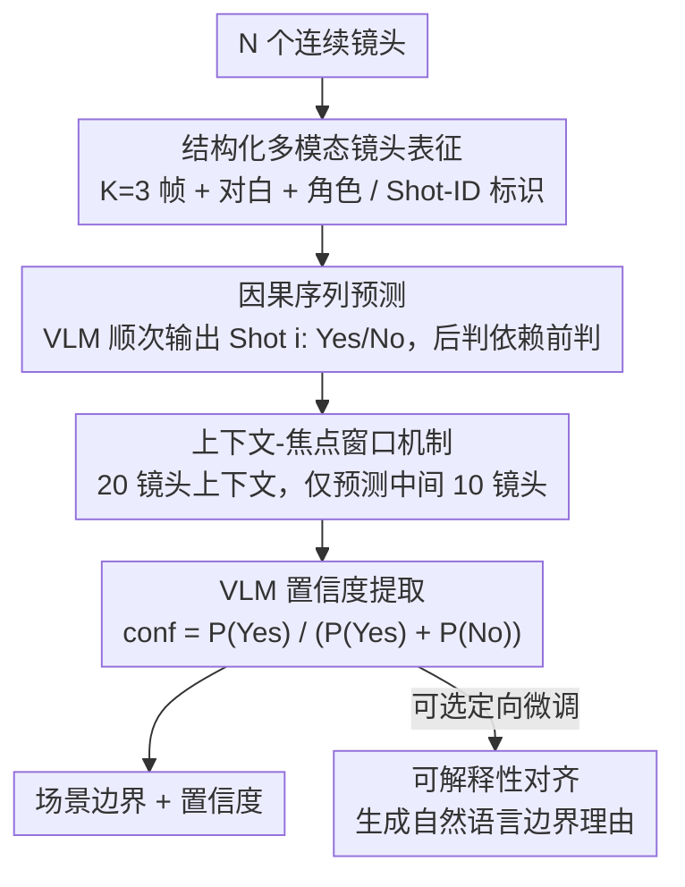

# Scene-VLM: Multimodal Video Scene Segmentation via Vision-Language Models

**会议**: CVPR2026  
**arXiv**: [2512.21778](https://arxiv.org/abs/2512.21778)  
**代码**: 无  
**领域**: 多模态VLM  
**关键词**: 视频场景分割, 视觉语言模型, 多模态推理, 序列预测, 置信度估计

## 一句话总结
提出 Scene-VLM——首个基于微调 VLM 的视频场景分割框架，通过结构化多模态镜头表征（视觉帧+对白+元数据）、因果序列预测、上下文-焦点窗口机制和 token logits 置信度提取，在 MovieNet 上取得 +6 AP 和 +13.7 F1 的大幅提升，并展示了自然语言解释能力。

## 研究背景与动机
视频场景分割（将长视频切分为语义连贯的场景）是视频理解的基础任务，对自动化结构化摘要、语义检索等应用至关重要。形式上，场景由共享位置、时间、角色或叙事主题的连续镜头组成。

现有编码器方法（BaSSL、TranS4mer、MEGA）的三大局限：(1) **视觉偏重**：忽视或低利用对白、角色等非视觉信号；(2) **逐点独立预测**：每个镜头独立分类，未利用连续决策间的因果依赖；(3) **无可解释性**：仅输出置信度分数，无法解释为什么预测为边界。

**核心 idea**：利用 VLM 的多模态推理+文本生成能力，将场景分割重新定义为按序输出"Shot i: Yes/No"的序列生成任务，自然实现因果依赖、多模态融合和可解释性。

## 方法详解

### 整体框架
Scene-VLM 把"视频场景分割"从传统的编码器逐镜头分类，改造成 VLM 的序列生成任务。它基于 Qwen2.5-VL-7B 微调，输入是 $N$ 个连续镜头的多模态表征（视觉帧 + 对白 + 角色 ID），让模型按顺序对焦点窗口内每个镜头吐出"Shot i: Yes/No"判定是否为场景边界，再从判定 token 的 logits 里读出置信度。这一改造一举把多模态融合、镜头间的因果依赖和可解释性三件事都装进了同一个生成框架。

### 关键设计

**1. 结构化多模态镜头表征：把对白和角色这些非视觉信号也喂进去**

以往编码器方法偏重视觉、低估甚至忽略对白和角色等叙事信号。Scene-VLM 给每个镜头 $s_i$ 配 $K=3$ 个采样帧、同步字幕和角色信息，并在每帧上叠一个视觉标识符（shot-ID marker），帮模型把画面内容和文本里提到的镜头编号对应起来。这样模型拿到的是以视觉为中心的方法根本看不到的叙事上下文。

**2. 因果序列预测：让每个边界判定看得见前面的判定**

逐镜头独立分类的毛病是每个镜头各判各的，用不上"决策之间的因果依赖"。把它改成序列生成后，模型顺次输出多个镜头的 Yes/No，每个边界判定都因果地影响后续判定，能拿之前的预测当上下文。注意力分析也印证了这点——模型确实"信任"已经做出的判定，对已处理镜头分配更少注意力，把更多注意力留给后面待判的镜头。

**3. 上下文-焦点窗口机制：给每个被判镜头都留足前后证据**

序列两端的镜头天然缺一侧上下文，直接预测会在边缘掉点。Scene-VLM 用 20 个镜头当上下文窗口，却只对中间 10 个镜头（焦点窗口）做预测，保证每个被评估的镜头左右都有充足证据。消融里去掉焦点机制后边缘位置 F1 急剧下降，有焦点时各位置一致，正说明了它的作用。

**4. VLM 置信度提取：从 Yes/No 的 logits 里读出分数**

VLM 不像编码器有分类头能直接给分数。Scene-VLM 取判定 token 处的 softmax logits 算归一化置信度 $\text{conf}_i = P(\text{Yes}) / (P(\text{Yes}) + P(\text{No}))$，于是又能像传统方法那样做精确率-召回率的权衡。这个技巧简单，却让任何二分类式的 VLM 输出都能拿到可调的置信度。

**5. 可解释性对齐：让模型说出"为什么这是边界"**

编码器只能吐一个置信度分数，说不清判定理由。通过在少量带标注解释的样本上做定向微调，Scene-VLM 能生成连贯的自然语言解释（如"场景从室内转到室外，角色和叙事话题都变了"），这是编码器方法做不到的。

### 损失函数 / 训练策略
- 标准 next-token prediction loss
- 基座模型：Qwen2.5-VL-7B
- 训练数据：MovieNet-318（190 部电影用于训练）

## 实验关键数据

### 主实验（MovieNet-318）

| 方法 | F1 ↑ | AP ↑ |
|------|------|------|
| BaSSL | 47.0 | 57.4 |
| TranS4mer | 48.4 | 60.8 |
| MEGA | 55.3 | 58.6 |
| Chapter-LLaMA | 38.6 | 41.5 |
| **Scene-VLM** | **62.1** | **66.8** |

### 零样本跨域（BBC Planet Earth）

| 方法 | AP ↑ |
|------|------|
| TranS4mer | 43.6 |
| **Scene-VLM** | **45.8** |

### 消融实验

| 配置 | F1 | AP | 说明 |
|------|----|----|------|
| 完整模型 | 62.1 | 66.8 | - |
| 去掉视觉 | 32.0 | 34.7 | 视觉是核心信号 |
| 去掉 Shot-ID | 60.8 | 64.1 | 时序锚定有价值 |
| 去掉字幕 | 61.1 | 62.2 | 字幕提供互补信号 |
| 仅视觉 | 58.6 | 61.4 | 多模态融合提升 3.5 F1 |
| 上下文20+焦点10 | **62.1** | - | 最优配置 |
| 上下文20+焦点1（逐点式） | 60.1 | - | 序列预测优于逐点 |
| 上下文5+焦点5 | 55.8 | - | 更大上下文更好 |

### 模型规模影响

| 参数量 | F1 | AP |
|--------|----|----|
| 1.5B | 55.9 | 58.7 |
| 3B | 59.6 | 62.8 |
| **7B** | **62.1** | **66.8** |

### 关键发现
- 视觉是最重要的信号源（去掉后 F1 暴跌 30 点），但字幕和角色 ID 提供了不可替代的补充
- 注意力分析显示：长度归一化后，字幕和角色 token 的注意力与视觉 token 相当
- 模型对后续镜头的注意力高于前序镜头——因为已通过输出 token 编码了前序信息
- 焦点机制对边缘位置至关重要：无焦点时边缘 F1 急剧下降，有焦点时全位置一致
- 从 1.5B 到 7B 持续单调提升，且 7B 提升仍然显著，暗示更大模型可能继续受益

## 亮点与洞察
- **范式转换**：从编码器分类框架转向 VLM 序列生成框架，一举解决了多模态融合、序列依赖和可解释性三个长期问题
- **置信度提取技巧**：从 Yes/No logits 计算归一化置信度的方法简单有效，为 VLM 应用于所有二分类任务提供了通用方案
- **注意力分析深入**：揭示了 VLM 在场景边界预测时的信息流动模式——信任历史预测+重点关注未来上下文
- 零样本在 BBC 上的泛化表明框架不局限于电影领域

## 局限与展望
- 每个镜头 3 帧的采样可能不足以捕捉镜内剧烈运动的场景
- 20 个镜头的上下文窗口对超长电影可能不够——需要层次化或记忆增强的扩展
- 推理速度可能慢于轻量编码器方法（论文未报告延迟）
- 可解释性对齐需要人工标注解释样本，成本不可忽略

## 相关工作与启发
- **vs MEGA**：MEGA 也融合字幕和剧本，但用固定融合策略+逐点预测；Scene-VLM 用 VLM 端到端推理更灵活
- **vs Chapter-LLaMA**：基于 LLM 的分章方法，但仅用文本描述无直接视觉处理，在电影上 F1 仅 38.6
- **vs TranS4mer**：用自注意力+SSM 建模长程依赖，但仍是编码器，无可解释性

## 评分
- 新颖性: ⭐⭐⭐⭐⭐ 首次将 VLM 应用于视频场景分割，范式创新解决了多个长期痛点
- 实验充分度: ⭐⭐⭐⭐⭐ 消融极其细致（模态、窗口、帧数、模型规模），注意力分析深入
- 写作质量: ⭐⭐⭐⭐⭐ 结构清晰，图示直观，从方法到分析的叙述逻辑完整
- 价值: ⭐⭐⭐⭐ 为视频结构理解提供了新范式，置信度提取和可解释性设计有广泛迁移价值

<!-- RELATED:START -->

## 相关论文

- [\[CVPR 2026\] RE-VLM: Event-Augmented Vision-Language Model for Scene Understanding](re-vlm_event-augmented_vision-language_model_for_scene_understanding.md)
- [\[CVPR 2026\] HOG-Layout: Hierarchical 3D Scene Generation, Optimization and Editing via Vision-Language Models](hog_layout_hierarchical_3d_scene_generation_optimization_and_editing.md)
- [\[CVPR 2026\] Can We Build Scene Graphs, Not Classify Them? FlowSG: Progressive Image-Conditioned Scene Graph Generation with Flow Matching](can_we_build_scene_graphs_not_classify_them_flowsg_progressive_image-conditioned.md)
- [\[CVPR 2025\] Embodied Scene Understanding for Vision Language Models via MetaVQA](../../CVPR2025/multimodal_vlm/embodied_scene_understanding_for_vision_language_models_via_metavqa.md)
- [\[CVPR 2026\] InfiniBench: Infinite Benchmarking for Visual Spatial Reasoning with Customizable Scene Complexity](infinibench_infinite_benchmarking_for_visual_spatial_reasoning_with_customizable.md)

<!-- RELATED:END -->
