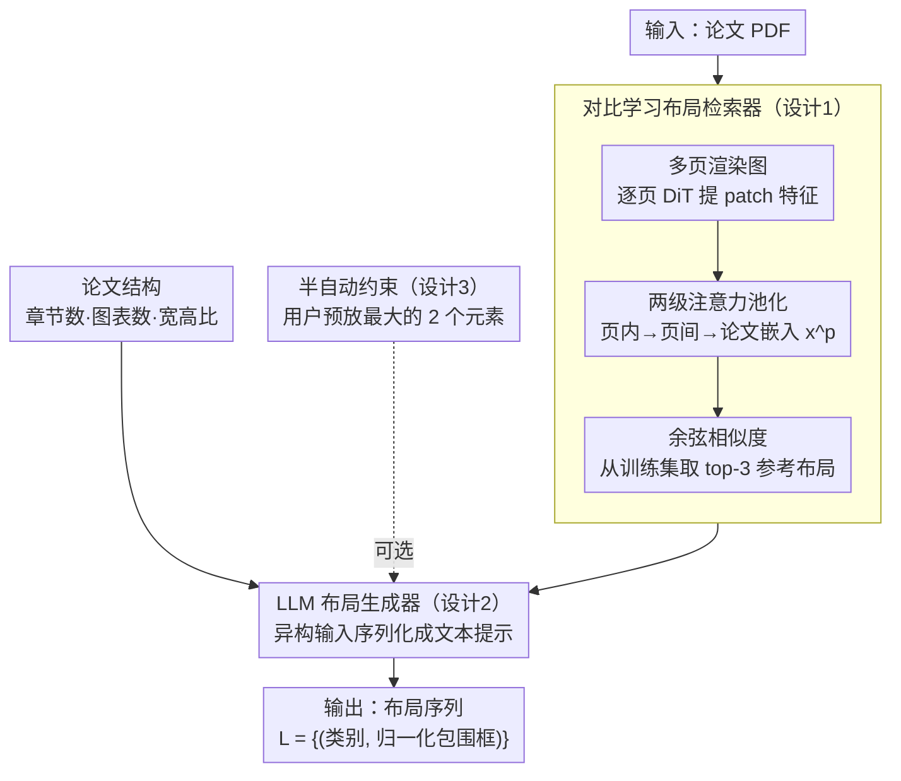

# SciPostGen: Bridging the Gap between Scientific Papers and Poster Layouts

**会议**: CVPR 2026  
**arXiv**: [2511.22490](https://arxiv.org/abs/2511.22490)  
**代码**: [https://omron-sinicx.github.io/paper2layout/](https://omron-sinicx.github.io/paper2layout/)  
**领域**: 多模态VLM / 文档理解  
**关键词**: 海报布局生成, 科学论文, 检索增强生成, 对比学习, 文档布局分析

## 一句话总结

构建了包含 18,097 个论文-海报对的大规模数据集 SciPostGen，分析发现论文结构与海报布局元素数量存在中等相关性，并提出检索增强海报布局生成框架，通过对比学习检索与论文匹配的布局模板来指导 LLM 生成海报布局。

## 研究背景与动机

科学论文数量持续增长（arXiv 月投稿量从 2015 年约 8000 篇增长到 2025 年超 2 万篇），海报是高效传达研究成果的重要媒介。自动从论文生成海报需解决两个问题：内容摘要（放什么）和布局生成（怎么排）。

现有工作主要聚焦内容摘要，布局要么用固定模板要么用基于论文结构的规则生成。然而，布局设计对信息传达效果有重要影响，值得数据驱动地学习论文到布局的映射关系。

核心瓶颈是**缺乏大规模配对数据集**。现有海报生成数据集仅包含几百个论文-海报对，不足以支持数据驱动的方法。SciPostGen 通过结合自动标注和人工校正，将规模扩大到 18,097 对，同时提供论文（OCR 文本、图表包围框）和海报（8 类布局元素标注）的细粒度标注。

分析发现论文结构与海报布局存在可利用的相关性：论文文本量越多，海报中图元素越少（Spearman $\rho < -0.40$）；论文图表数量与海报图元素正相关。这启发了检索增强的布局生成策略——检索结构相似的论文的海报布局作为生成参考。

## 方法详解

### 整体框架

这套系统要回答的是「给一篇论文，海报上的各个元素该放在哪、放多大」。它把任务拆成检索和生成两步：先用一个布局检索器，把论文页面和海报布局都编码成向量，从训练集里捞出结构最像的 top-3 海报布局当参考；再把这些参考布局连同论文的结构信息（章节数、图表数量和宽高比）一起喂给一个 LLM 生成器（Llama-3.1-8B-Instruct），让它吐出最终布局，也就是一串「类别 + 归一化包围框」$L = \{(c_i, b_i)\}$。整条流程支持全自动和半自动两种模式，后者允许创作者先放好几个主元素，系统再补完剩下的。

### 关键设计

**1. 对比学习布局检索器：用图像编码隐式抓住「论文长什么样、海报就该怎么排」的对应关系**

前面提到论文结构和海报布局只是中等相关，没法靠几条规则硬推；这个检索器的思路是干脆让模型自己从数据里学这层对应。论文编码器把多页 PDF 渲染成图像序列，每页过一个 DiT（文档图像 Transformer）提 patch 特征，再做两级注意力池化——先在页内聚合 patch、再在页间聚合各页——压成一个论文嵌入 $x^p$；布局编码器对海报布局的渲染图做同样处理，得到布局嵌入 $x^l$。训练时用 InfoNCE 把配对的论文-布局拉近、batch 内其余推远，推理时直接用余弦相似度从训练集里取 top-3。这里有意思的一点是它编码的是**渲染图像**而不是结构化标注，图像里天然保留了元素的空间排布关系，比把布局拆成一串坐标喂进去更管用（消融里图像编码的检索性能明显更高）。取 top-3 而非单一最优，也是因为同一篇论文的海报本就有多种合理排法，多给几个参考能覆盖这种多样性。

**2. LLM 布局生成器：把异构的参考布局、论文结构、用户约束揉成一份文本提示交给 LLM**

检索给了「长得像的海报怎么排」，但还得结合这篇论文自己的结构和创作者的意图，把它落成具体坐标。这一步的关键在于输入是高度异构的——检索到的若干布局、论文的章节/图表统计、半自动模式下用户预放的元素，格式各不相同。作者把这些信息统统序列化成文本喂给 LLM，让它生成布局序列。选 LLM 而不是 GAN/Transformer/Diffusion 这类专用布局模型，正是看中它对非结构化输入的整合能力：要融合这么多来源不同的条件，专用模型往往得为每种条件单独设计接口，而 LLM 一个文本提示就吞下了。

**3. 半自动约束机制：模拟「人定大框架、AI 补细节」的真实协作流程**

全自动生成很难照顾到创作者的个性化意图，这个机制就是为实用性留的口子。具体做法是从 gold layout 里挑出面积最大的两个元素，作为约束直接写进 LLM 的输入，让模型在「这两个大块已经定死」的前提下补全其余元素的位置。这恰好对应实际做海报时的习惯——人先把标题、主图这种最显眼的大块摆好，剩下的零碎元素交给系统填。实验里这种约束的加入显著拉高了生成布局与真实布局的一致性。

### 损失函数 / 训练策略

检索器用 InfoNCE 对比损失训练，记 $s_{ij}$ 为第 $i$ 篇论文嵌入与第 $j$ 个布局嵌入的余弦相似度，目标是让对角线上的配对项相似度最高：

$$\mathcal{L} = -\frac{1}{N}\sum_{i=1}^{N} \log \frac{\exp(s_{ii})}{\sum_{j=1}^{N}\exp(s_{ij})}$$

生成器在 Llama-3.1-8B-Instruct 上微调，训练标签用的是 SciPostGen 训练集的 silver layout（自动标注）。

## 实验关键数据

### 主实验

**布局检索性能（论文→布局检索）**

| 方法 | Recall@1 | Recall@3 | Recall@5 |
|------|----------|----------|----------|
| Random | 0.05 | 0.15 | 0.25 |
| 仅论文编码器 | 4.83 | 12.12 | 18.11 |
| 完整检索器 | **8.20** | **19.87** | **28.37** |

**布局生成质量（FID / mIoU / Alignment）**

| 配置 | FID ↓ | mIoU ↑ | Overlap ↓ |
|------|-------|--------|-----------|
| 无检索 | 基线 | 基线 | 基线 |
| + 检索增强 | 改善 | 改善 | 减少 |
| + 检索 + 约束（半自动） | 最优 | 最优 | 最低 |

### 消融实验

| 配置 | 检索 Recall@3 | 生成 FID | 说明 |
|------|-------------|----------|------|
| 仅图像编码（DiT） | 19.87 | - | 基础检索性能 |
| 仅布局标注编码 | 更低 | - | 图像编码优于结构化标注 |
| 无检索直接生成 | - | 更高 | 无参考布局质量差 |
| 检索 top-1 | - | 中等 | 单模板多样性不足 |
| 检索 top-3 | - | 最低 | 多模板提供更好指导 |

### 关键发现

- 论文结构与海报布局的 Spearman 相关性为中等水平（|ρ| 约 0.40-0.50），说明结构信息有用但不足以完全决定布局
- 图像编码比直接用布局标注作为输入效果更好——图像隐式保留了空间关系
- 半自动模式下约束的加入显著提升了布局与真实布局的一致性
- silver（自动标注）和 gold（人工校正）布局的 mAP@0.50:0.95 为 0.53，属中等一致性

## 亮点与洞察

- **数据集构建方法论值得借鉴**：自动标注（Azure Document Intelligence + Nougat OCR）+ 人工校正验证/测试集，兼顾规模和质量。在标注资源有限时的实用策略
- **"论文结构→海报布局"这一研究问题本身有新意**：之前工作聚焦内容摘要，本文首次系统研究结构到布局的映射关系，定量分析了两者的相关性
- **检索增强策略**：通过检索相似论文的布局作为"参考设计"来指导生成，比从零生成更可控且多样性更好

## 局限与展望

- 仅生成布局（包围框），不生成实际海报内容（文字、图片），离端到端海报生成仍有距离
- 数据集限于计算机科学会议（CVPR/ICLR/ICML/NeurIPS），其他学科海报风格可能不同
- 检索 Recall@1 仅 8.2%，说明论文到布局的映射关系仍较弱，可能需要更丰富的论文表示
- 未评估生成布局的主观质量（如可读性、美观度），仅用数值指标衡量

## 相关工作与启发

- **vs PosterLayout [56]**: 提供了细粒度布局标注但仅数百对，SciPostGen 规模大 30 倍
- **vs 基于规则的布局**: 如 [42] 用预定义规则从论文结构推导布局，缺乏灵活性和多样性
- **vs 通用布局生成**: 广告/网页布局生成方法无法利用论文结构信息，本文引入论文作为条件

## 评分

- 新颖性: ⭐⭐⭐⭐ 研究问题新颖（论文→海报布局），数据集有价值，但方法本身是标准的检索增强+LLM 组合
- 实验充分度: ⭐⭐⭐ 缺乏用户研究和主观评估，检索和生成的定量指标不够全面
- 写作质量: ⭐⭐⭐⭐ 数据集构建和分析部分清晰，整体结构合理
- 价值: ⭐⭐⭐⭐ 数据集对社区有价值，框架为自动化学术海报生成奠定基础

<!-- RELATED:START -->

## 相关论文

- [\[CVPR 2026\] Responses Fall Short of Understanding: Revealing the Gap between Internal Representations and Responses in VDU](responses_fall_short_of_understanding_gap_between_internal_representations_and_responses_in_vdu.md)
- [\[AAAI 2026\] Bridging the Copyright Gap: Do Large Vision-Language Models Recognize and Respect Copyrighted Content?](../../AAAI2026/multimodal_vlm/bridging_the_copyright_gap_do_large_vision-language_models_r.md)
- [\[AAAI 2026\] Remember Me: Bridging the Long-Range Gap in LVLMs with Three-Step Inference-Only Decay Resilience Strategies](../../AAAI2026/multimodal_vlm/remember_me_bridging_the_long-range_gap_in_lvlms_with_three-step_inference-only_.md)
- [\[ACL 2025\] Can Multimodal Foundation Models Understand Schematic Diagrams? An Empirical Study on Information-Seeking QA over Scientific Papers](../../ACL2025/multimodal_vlm/can_multimodal_foundation_models_understand_schematic_diagrams_an_empirical_stud.md)
- [\[CVPR 2026\] Text-Only Training for Image Captioning with Retrieval Augmentation and Modality Gap Correction](text-only_training_for_image_captioning_with_retrieval_augmentation_and_modality.md)

<!-- RELATED:END -->
