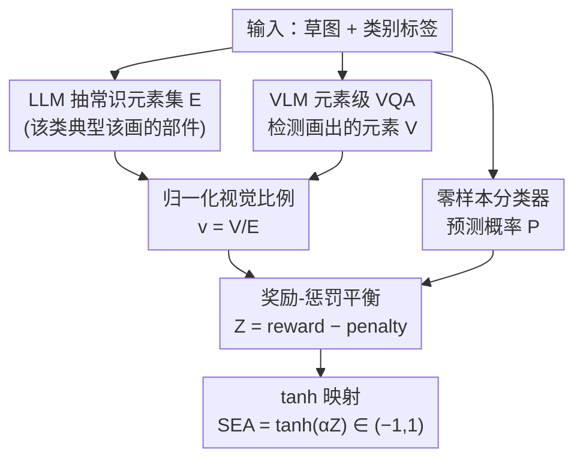

# SEA: Evaluating Sketch Abstraction Efficiency via Element-level Commonsense Visual Question Answering

**会议**: CVPR 2026  
**论文**: [CVF Open Access](https://openaccess.thecvf.com/content/CVPR2026/html/Park_SEA_Evaluating_Sketch_Abstraction_Efficiency_via_Element-level_Commonsense_Visual_Question_CVPR_2026_paper.html)  
**代码**: 无（项目页 https://zihos.github.io/SEA/）  
**领域**: 多模态VLM  
**关键词**: 草图理解, 抽象效率评价, 无参考指标, 常识视觉元素, 元素级VQA

## 一句话总结
针对「草图好不好」没有合适指标的问题，本文提出无参考指标 SEA——把「识别概率 P、类别常识元素总数 E、草图实际画出的元素数 V」三个信号组合成奖励-惩罚式分数，专门衡量草图「用尽量少的笔画保留可识别性」的抽象效率，并配套发布首个带元素级标注的草图数据集 CommonSketch（300 类、23,100 张人工草图），实验证明 SEA 与人类判断高度一致（一致率约 88%）。

## 研究背景与动机
**领域现状**：草图是最精炼的视觉表达——用寥寥几笔传递语义。当前草图研究主要做两件事：草图分类（给标签）和草图-照片匹配（sketch-photo retrieval）。评价草图生成质量时，大家普遍借用通用图像指标，如 Top-K 分类准确率、FID、SSIM、LPIPS、DreamSim、CLIPScore 等。

**现有痛点**：这些做法都没抓住草图的本质。① 数据集层面：TU-Berlin、Sketchy、QuickDraw、SEVA 要么只给「草图-标签」，要么给「草图-照片对」，都不记录「画对象时到底该画哪些部件、哪些可以省」这种元素级信息。② 指标层面：FID/SSIM/LPIPS 这些是为照片级真实感设计的，要么需要参考图（reference-based），要么只测像素相似度或类别可识别性，根本无法回答「这张草图是否用最少的元素高效传达了概念」。

**核心矛盾**：草图的定义性属性是**刻意的抽象**——只保留一小撮「诊断性视觉元素」就能让人认出。但现有指标只会奖励「画得越细越像照片越好」，这与抽象效率背道而驰：一张画满细节的图能拿高 SSIM/分类置信度，却恰恰是「抽象失败」的草图。可识别性（recognizability）和视觉简洁性（visual economy）之间存在 trade-off，而没有指标显式刻画这个 trade-off。

**本文目标**：① 造一个能在「元素级」推理草图的数据集；② 设计一个无参考、能量化「抽象效率」的指标。

**切入角度**：作者观察到，每个类别其实有一组「常识性视觉代表元素」（commonsense visual representatives）——人画鸟通常画翅膀、画马克杯通常画把手、画自行车通常画轮辐和车轮。如果先用 LLM 把这些「该画的元素」列出来，再用 VLM 检测草图里「实际画了哪些」，就能把抽象过程显式量化。

**核心 idea**：用「类别常识元素」当锚点，把草图评价从「label 预测」升级到「元素级推理」——一张好草图 = 用尽量少的常识元素（低 $v$）保住高识别概率（高 $P$）。

## 方法详解

本文是「数据集 + 指标」型工作，核心有两块：CommonSketch 数据集的构建，以及 SEA 指标的计算公式。

### 整体框架
SEA 的设计目标是：给定一张草图和它的类别标签，输出一个落在 $(-1, 1)$ 区间、越高代表「抽象越高效」的连续分数。它融合三个互补信号：① 零样本分类器给出的对正确类的预测概率 $P$（衡量可识别性）；② LLM 从常识知识里抽出的该类「可画元素」集合 $\mathcal{E}$，其大小 $E=|\mathcal{E}|$；③ VLM 通过元素级 VQA 检测出草图里实际画出的元素子集 $\mathcal{V}\subseteq\mathcal{E}$，其大小 $V=|\mathcal{V}|$。由此定义归一化视觉比例 $v = V/E \in [0,1]$，表示草图表达了多少比例的常识元素。三个信号进入一个「奖励 − 惩罚」结构，再经 $\tanh$ 压到有界区间。整条流水线如下：

数据侧，CommonSketch 提供了让上面这条流水线跑起来的「锚点」——每个类的常识元素集 $\mathcal{E}$ 的人工核验版本，以及每张草图的元素级二元标注（present/absent），后者直接当作 VLM 元素级 VQA 的 ground truth。

### 关键设计

**1. CommonSketch 数据集：把「抽象」变成可标注的元素级监督**

针对「现有草图数据集只有标签或照片对、无法在元素层面推理」的痛点，作者构建了首个带元素级常识标注的草图数据集：从 TU-Berlin 和 QuickDraw 里精选 300 个类（归入 food/animal/clothing/vehicle 等 14 个大类，taxonomy 改编自 THINGS 数据库并新增 structure、icon、把 plant 拓宽为 nature），共 23,100 张人工草图（平均每类约 77 张）。构建流水线分四步：① **采集**——12 名非美术专业志愿者，每个类别在 60–80 秒内用平板手绘一个对象，存为 512×512 黑线白底 PNG，无后处理；② **caption 生成兼校验**——用 GPT-4o 给每张草图生成描述性 caption，并把它当过滤器：若生成的 caption 里不含目标类名，说明画得不像，直接丢弃重画，一举两得地保证了标签一致性；③ **常识抽取**——用 GPT-4o（并用 GPT-OSS、Qwen2.5、Llama3、Mistral 等开源 LLM 复现以验证可复现性）为每类抽取「外部可见、可在草图中画出」的视觉部件，人工审核时剔除心脏、大脑这类内部不可见元素；④ **元素级标注**——人工标注员对每张草图的每个常识元素做 present/absent 二元判断，并据此调平元素出现频率，构成一个元素级 VQA benchmark。相比之下，TU-Berlin/Sketchy/QuickDraw/SEVA 都没有常识元素、caption 或 QA 这三栏。

**2. SEA 的整体结构：奖励-惩罚分解 + tanh 有界映射**

针对「需要一个无参考、可解释、连续可导的抽象效率分数」的需求，SEA 把一个潜在的「效率信号」$Z$ 经双曲正切压缩：

$$\mathrm{SEA} = \tanh(\alpha Z), \qquad Z = \mathrm{reward}(P, v) - \mathrm{penalty}(P, v)$$

其中 $\alpha>0$ 控制决策边界附近的敏感度。$Z>0$ 表示草图「用极少视觉细节维持了高识别概率」（高效抽象），$Z<0$ 表示要么过度绘制、要么识别概率不足。这种「奖励项减惩罚项」的显式分解是关键——因为两项分别拆开了 $P$（识别）与 $v$（视觉比例）的贡献，所以拿到一个低分时，可以反查到底是「识别太差（$P$ 低）」还是「画得太满（$v$ 高）」导致抽象失败，让指标具备可诊断性，而不只是给个黑箱数字。最终 SEA $\in(-1,1)$ 连续可导，既能用于分析也能当训练目标。

**3. 奖励项与惩罚项：用「自一致线 $v=P$」刻画抽象效率**

这是 SEA 最精巧的地方。奖励项鼓励「保住可识别性的同时画得最少」：

$$\mathrm{reward}(P, v) = P^{\gamma}\, u(v)\, g(P, v)$$

第一个因子 $u(v) = \log\frac{1+\delta}{v+\delta}$ 是「表达经济性」项，$v$ 越小（画得越省）$u(v)$ 越大，直接奖励抽象。第二个因子 $g(P,v) = \tanh\!\big(\frac{\beta}{2}\log\frac{P+\delta}{v+\delta}\big)$ 是一个**居中门控**，它定义了一条自一致线：当 $v=P$ 时 $g=0$；当 $v<P$（用很少元素就拿到高识别概率）时 $g>0$ 放大奖励；当 $v>P$（相对识别概率画得过细）时 $g<0$ 抑制奖励。$\beta$ 控制这个转变有多陡，$\gamma$ 控制 $P$ 小时对奖励的压制强度。惩罚项则打压「画得多又认不出」：

$$\mathrm{penalty}(P, v) = \lambda\, v^{\eta}(1-P)^{k} + \tau\,(1-P)^{r}$$

第一项 $\lambda v^{\eta}(1-P)^k$ 专门惩罚「高视觉比例 $v$ 却低识别概率 $P$」的情形（$\eta$ 控制随 $v$ 的增长、$k$ 控制对识别失败的敏感度）；第二项 $\tau(1-P)^r$ 是与 $v$ 无关的基线惩罚，专门打压那些「画得简单但根本认不出」的草图。其中常数 $\delta>0$（实验取 $10^{-6}$ 或 $10^{-7}$）加在对数和比值里保证数值稳定。⚠️ 公式中符号 $\delta$ 取值在 notation 段（$10^{-6}$）与实验段（$10^{-7}$）略有出入，以原文为准。

### 一个例子：SEA 怎么区分四档抽象
拿 SEVA 数据集里同一个对象在 4/8/16/32 秒约束下画出的草图为例：4 秒草图画得太草、$P$ 很低（约 0.17），SEA 给出 −0.56（抽象失败）；随着时间放宽到 16、32 秒，识别概率升到 0.64、0.75，视觉比例 $v$ 也只从 0.40 缓慢升到 0.45，于是 SEA 升到 0.29、0.43（高效抽象）。这正体现 SEA 的取向：它奖励「$P$ 上去但 $v$ 没怎么涨」的草图，而不是单纯奖励「画得更多」。

## 实验关键数据

### 主实验：SEA 随抽象档位单调上升（SEVA 数据集）
固定全部超参（$\alpha=2.2, \beta=8.0, \lambda=1.0, \eta=0.8, k=2.3, \tau=0.4, r=1.7, \gamma=1.7$），在 SEVA 的四个时间档（4/8/16/32 秒）上评测，SEA 随抽象档位提升而单调上升，奖励项升、惩罚项降，符合预期：

| 指标 | Level 4 | Level 8 | Level 16 | Level 32 |
|------|---------|---------|----------|----------|
| SEA | −0.56±0.32 | −0.23±0.30 | 0.29±0.24 | 0.43±0.29 |
| reward(P,v) | 0.16±0.20 | 0.30±0.20 | 0.52±0.20 | 0.57±0.26 |
| penalty(P,v) | 0.53±0.11 | 0.41±0.09 | 0.24±0.09 | 0.18±0.11 |
| visual ratio v | 0.22±0.06 | 0.31±0.08 | 0.40±0.08 | 0.45±0.10 |
| prediction P | 0.17±0.17 | 0.37±0.15 | 0.64±0.11 | 0.75±0.11 |

### 元素级常识 VQA：VLM benchmark
把 CommonSketch 的人工元素标注当 ground truth，评测各 VLM 检测「画出哪些元素」的能力。GPT-4o 综合最强（F1=0.881、Acc=0.855）；开源里 Molmo 召回最高（0.949）但属于严重的假阳性偏置（什么元素都判 present），可靠性差，故作者实际选 Qwen2.5-VL 当开源 VLM（与 GPT-4o 预测模式最对齐）：

| 模型 | Precision↑ | Recall↑ | F1↑ | Accuracy↑ |
|------|-----------|---------|-----|-----------|
| LLaVA | 0.749 | 0.819 | 0.782 | 0.706 |
| BLIP | 0.731 | 0.760 | 0.746 | 0.666 |
| Molmo | 0.798 | **0.949** | 0.867 | 0.812 |
| Qwen2.5-VL | 0.898 | 0.782 | 0.836 | 0.802 |
| mPLUG-Owl3 | 0.883 | 0.686 | 0.772 | 0.739 |
| InternVL | 0.804 | 0.890 | 0.845 | 0.789 |
| PaliGemma2 | 0.673 | 0.809 | 0.735 | 0.624 |
| SmolVLM | 0.808 | 0.346 | 0.485 | 0.526 |
| **GPT-4o** | **0.935** | 0.832 | **0.881** | **0.855** |

### 关键发现
- **与人类判断高度一致**：用 27 名参与者做排序任务（每题给 3 张按 SEA 升序排列的草图，共 160 题），人类对排序的认同率达到闭源 SEA 87.8%、开源 OpenSEA 88.0%；另用 37 人对 88 张图打分，SEA 的分数分布在四个分桶上都贴合人类评分。说明 SEA 抓到了人对「抽象质量」的共识。
- **开源 pipeline 可平替**：元素抽取（$E$）上 GPT-OSS 20B 在 Soft F1（0.850）、CLIP Score（0.941）、BERT Score（0.813）上最接近 GPT-4o；配合 Qwen2.5-VL，OpenSEA 与闭源 SEA 几乎同样可靠（人类一致率 88.0% vs 87.8%）。
- **CommonSketch 质量更高**：在三个数据集的预测概率分布上，CommonSketch 的 ground-truth 类预测概率 $\mu=0.86$、mode=0.97，明显高于 TU-Berlin（$\mu=0.62$）和 QuickDraw（$\mu=0.29$，因其游戏式采集协议在模型猜中或超时即停笔，草图常残缺），因此 SEA 分数也最高。
- **能外推到 300 类之外**：对未见类（mosquito、tank）也能给出与人类一致的分数——画不清的拿负分，Level 32 可识别的拿强正分。

## 亮点与洞察
- **「自一致线 $v=P$」是点睛之笔**：把「视觉比例应当与识别概率匹配」编码成门控 $g(P,v)$ 的零点，让指标天然区分「高效抽象（$v<P$）」与「过度绘制（$v>P$）」，比单看相似度高明很多——这套「让两个本应匹配的量在某条线上对齐、偏离就奖励/惩罚」的思路可迁移到任何需要权衡「成本 vs 效果」的评价场景。
- **用 caption 当数据清洗的过滤器**：让 GPT-4o 生成 caption，若不含类名就重画，把「生成标注」和「质量校验」合并成一步，是很省事的数据工程 trick。
- **奖励-惩罚显式分解带来可诊断性**：低分能直接归因到「$P$ 低」还是「$v$ 高」，这让 SEA 不只是打分器，还是分析草图为何抽象失败的工具。
- **无参考 + 连续可导**：不需要参考图（适用于 text-to-sketch），且 $\tanh$ 输出可导，理论上可直接当草图生成模型的训练目标。

## 局限与展望
- **强依赖底层模型**：SEA 的三个信号全由外部 VQA、分类器、LLM 提供，这些模型本身的偏置（如 Molmo 的假阳性）会直接污染分数；作者也承认「放松对模型的依赖」是重要未来方向。
- **只覆盖单对象草图**：CommonSketch 当前限于单个对象的草图，缺多对象/场景；语言与文化覆盖也有限（常识元素由特定 LLM 抽取，可能带文化偏见）。
- **超参较多需固定**：SEA 含 $\alpha,\beta,\gamma,\lambda,\eta,k,\tau,r,\delta$ 共 9 个超参，虽全程固定，但其选取来自 supplementary、对结果的鲁棒性正文交代有限。⚠️ 不同 LLM 抽取的元素集 $\mathcal{E}$ 大小不同，会直接改变 $v=V/E$，跨配置的 SEA 绝对值可比性需谨慎。
- **改进思路**：可探索用多对象/场景草图扩展数据集，或把 SEA 当可导损失接入草图生成模型做端到端的「抽象效率」优化。

## 相关工作与启发
- **vs 通用图像指标（FID/SSIM/LPIPS/DreamSim/CLIPScore）**：它们为照片级真实感设计，要么需要参考图、要么只测像素/分布相似度或文本对齐，无法衡量「用最少元素高效表达」；SEA 无参考且显式建模抽象效率。
- **vs SketchRef**：SketchRef 用 mOKS + CLIP 余弦衡量结构一致性与可识别性，但需要参考图，无法用于无参考的 text-to-sketch；SEA 不依赖参考图。
- **vs GACL（Geometry-Aware Classification Layer）**：GACL 用分类几何算无标注质量分，但本质仍是分类导向、且倾向奖励细节复杂的渲染，不适合衡量抽象；其绝对值还依赖类别监督骨干，跨数据集不可比。SEA 用常识知识直接判断「是否通过恰当抽象表达了类的语义元素」，绕开了分类导向的偏好。

## 评分
- 新颖性: ⭐⭐⭐⭐⭐ 首个「元素级抽象效率」指标 + 首个带元素级常识标注的草图数据集，把草图评价从 label 预测升级到元素推理，角度新。
- 实验充分度: ⭐⭐⭐⭐ 覆盖多 LLM/VLM/分类器的组合分析、跨数据集对比、两轮人类研究与外推验证，较扎实；但缺与 SketchRef/GACL 的直接量化对比。
- 写作质量: ⭐⭐⭐⭐ 动机清晰、公式分解可读，奖励-惩罚的诊断性解释到位；超参选取与 $\delta$ 取值的小出入略影响严谨度。
- 价值: ⭐⭐⭐⭐ 给草图生成/理解提供了无参考、可导、对齐人类的评价工具，CommonSketch 也是有用的 benchmark，社区可直接复用。

<!-- RELATED:START -->

## 相关论文

- [\[CVPR 2026\] ChartR: Evaluating Reasoning Accuracy and Robustness in Chart Question Answering](chartr_evaluating_reasoning_accuracy_and_robustness_in_chart_question_answering.md)
- [\[CVPR 2026\] VQ-VA World: Towards High-Quality Visual Question-Visual Answering](vq-va_world_towards_high-quality_visual_question-visual_answering.md)
- [\[CVPR 2026\] StaR-KVQA: Structured Reasoning Traces for Implicit-Knowledge Visual Question Answering](star-kvqa_structured_reasoning_traces_for_implicit-knowledge_visual_question_ans.md)
- [\[CVPR 2026\] DocPrune: Efficient Document Question Answering via Background, Question, and Comprehension-aware Token Pruning](docpruneefficient_document_question_answering_via_background_question_and_compre.md)
- [\[ACL 2025\] MAGIC-VQA: Multimodal and Grounded Inference with Commonsense Knowledge for Visual Question Answering](../../ACL2025/multimodal_vlm/magic-vqa_multimodal_and_grounded_inference_with_commonsense_knowledge_for_visua.md)

<!-- RELATED:END -->
