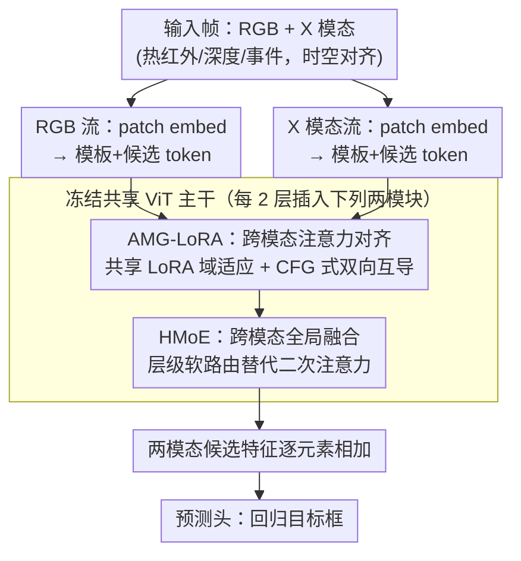

# SEATrack: Simple, Efficient, and Adaptive Multimodal Tracker

**会议**: CVPR 2026 Oral  
**arXiv**: [2604.12502](https://arxiv.org/abs/2604.12502)  
**代码**: 有  
**领域**: 目标跟踪 / 多模态  
**关键词**: 多模态跟踪, 参数高效微调, 注意力对齐, 混合专家, LoRA

## 一句话总结

提出 SEATrack 多模态跟踪器，通过 AMG-LoRA 实现跨模态注意力图的动态对齐，以及 HMoE 实现高效全局关系建模的跨模态融合，在 RGB-T/D/E 跟踪中以极少参数实现 SOTA 的性能-效率平衡。

## 研究背景与动机

**领域现状**：多模态跟踪通过融合 RGB 与热红外/深度/事件等互补数据实现全天候鲁棒跟踪，PEFT 范式逐渐取代全量微调以避免灾难性遗忘。

**现有痛点**：PEFT 方法的可调参数量从早期方法到最新 SOTA 膨胀了 16 倍，从根本上违背了 PEFT 的效率初衷。同时，双流架构中的域差距导致不同模态产生冲突的注意力图，阻碍联合表示学习。

**核心矛盾**：性能-效率困境——更多参数换来更好性能，但侵蚀了 PEFT 的核心价值。

**本文目标**：(1) 通过跨模态注意力对齐打破性能-效率权衡；(2) 设计高效的全局关系建模替代注意力融合。

**切入角度**：多模态输入在时空上对齐，模态内目标匹配的注意力图原则上应一致——利用这种一致性进行跨模态互导。

**核心 idea**：AMG-LoRA 用一个模态的匹配信息引导另一个模态的匹配过程，实现双向动态对齐。

## 方法详解

### 整体框架

SEATrack 想解决的是多模态跟踪里"参数越加越多、却背离了 PEFT 初衷"的怪圈。它的骨架是一个双流 ViT：冻结预训练好的 RGB 跟踪器主干，让 RGB 流和 X 模态流（热红外/深度/事件）各走一路，只在每隔 2 层的位置插入两个轻量模块——AMG-LoRA 负责把两路的注意力图对齐、顺带做域适应，HMoE 负责把两路特征做全局融合。一帧进来，两个模态各自抽出候选目标的特征，逐元素相加聚合成统一表示，再交给预测头回归出目标框。整套可调参数只有 0.8M，绝大部分算力仍跑在冻结的主干上。

### 关键设计

**1. AMG-LoRA：用一个模态的匹配信息去校准另一个模态的注意力**

双流架构最棘手的问题是域差距——RGB 和热红外看同一个目标，注意力图却可能各指一方，硬融只会互相拖累。SEATrack 注意到一个被忽视的先验：多模态输入在时空上本就对齐，模态内"目标在哪"的注意力图原则上应当一致。于是它把 LoRA 装在注意力层的 K/V 投影上先做域适应，再借 Classifier-Free Guidance 的思路把跨模态对齐写成一次分支权衡：

$$\textbf{attn}_{rgb} = \tilde{\textbf{attn}}_{rgb} + w_X(\tilde{\textbf{attn}}_X - \tilde{\textbf{attn}}_{rgb})$$

这里 $\tilde{\textbf{attn}}_{rgb}$、$\tilde{\textbf{attn}}_X$ 是两路各自的注意力图，$w_X$ 是可学习缩放因子，扮演 CFG 里"引导强度"的角色——当 X 模态可靠时把 RGB 往它身上拉，不可靠时就把 $w_X$ 压小、几乎退回 RGB 自己的判断。这正是它比固定 $w=1$ 静态对齐好 3–5 个百分点的原因：目标在不同模态的显著性随场景变化，对齐强度必须跟着动。代价极小——相比纯 LoRA 只多了 0.02M 参数（0.12M → 0.14M），却把 LasHeR PR 从 60.8 抬到 70.4。

值得一提的是，这条 LoRA 旁路是 RGB 流和 X 流**共享**的，并不给每路各配一套：既直接把参数量砍掉一半，又因为两路被同一组适配权重塑形，天然倾向于学出彼此一致的跨模态表示，和 AMG 的对齐目标互为呼应。推理时这条低秩旁路还能直接合并回原始注意力权重（$K/V$ 投影），不给延迟添任何额外开销。

**2. HMoE：用层级软路由把注意力的二次融合换成线性开销**

注意力融合表达力强但复杂度是二次的，局部融合便宜却看不到全局，HMoE 想在两者之间走条线性而又有全局感受野的路。它被插在注意力与 FFN 子层之后，对模板或候选 token 序列做跨模态融合。它和常见 MoE 的区别在粒度：常规 MoE 只在专家这一级做集成，HMoE 把交互下沉到从子 token 到 token 的层级——先把每个 token 切成 $h$ 个子 token，每个专家是一个低秩线性层，再由一个可学习的门控矩阵 $\boldsymbol{\Phi}$ 给不同层级分配软权重，让信息在细粒度上流动而不必两两算注意力。效果上它和注意力融合性能基本持平（70.4 vs 70.2 PR），速度却快约 35%，参数也从 1.6M 降到把整个模型收在 0.8M 之内。

### 损失函数 / 训练策略

标准跟踪损失（分类+回归）。AMG 的缩放因子初始化为 1，训练中自动适应场景。

## 实验关键数据

### 主实验

| 方法 | 可调参数 | LasHeR PR↑ | DepthTrack PR↑ | VisEvent PR↑ |
|------|---------|-----------|---------------|-------------|
| ProTrack | 0.3M | 52.1 | 58.3 | 65.2 |
| Un-Track | 4.8M | 65.4 | 63.8 | 69.1 |
| SDSTrack | 2.1M | 68.2 | 65.5 | 71.3 |
| **SEATrack** | **0.8M** | **70.4** | **65.5** | **71.3** |

### 消融实验

| 配置 | LasHeR PR | 参数量 | 说明 |
|------|----------|--------|------|
| 基线 (冻结ViT) | 52.1 | 0M | 无适配 |
| + LoRA | 60.8 | 0.12M | 仅域适应 |
| + AMG-LoRA | 70.4 | 0.14M | 域适应+对齐 |
| + HMoE | 70.4 | 0.8M | 完整模型 |
| 用注意力替代 HMoE | 70.2 | 1.6M | 速度慢35% |

### 关键发现

- AMG-LoRA 仅增加 0.02M 参数（从 LoRA 的 0.12M 到 0.14M）就带来近 10% 的 PR 提升
- HMoE 与注意力融合性能相当但速度快 35%
- CFG 启发的动态对齐比静态对齐（固定 $w=1$）效果好 3-5 个百分点

## 亮点与洞察

- 从 Classifier-Free Guidance 借鉴到跟踪的跨模态对齐是一个巧妙的类比：将模态可靠性视为"条件"vs"无条件"分支
- "跨模态注意力对齐是打破性能-效率困境的关键"这个洞察可推广到其他多模态任务

## 局限与展望

- 仅在跟踪任务上验证，未测试在检测或分割上的效果
- HMoE 的专家数和头数需要手动调整
- 未考虑多于两个模态的场景
- 可将 AMG 扩展到更多类型的注意力对齐

## 相关工作与启发

- **vs SDSTrack**: SDSTrack 复用冻结注意力层做全局交互但复杂度高，SEATrack 用 HMoE 替代
- **vs ProTrack**: ProTrack 开创了提示调优范式但表达力有限，SEATrack 的 AMG-LoRA 更有效

## 评分

- 新颖性: ⭐⭐⭐⭐ AMG-LoRA 和 HMoE 的设计都有新意
- 实验充分度: ⭐⭐⭐⭐ RGB-T/D/E 三个任务的全面评估
- 写作质量: ⭐⭐⭐⭐ 动机和设计逻辑清晰
- 价值: ⭐⭐⭐⭐ 对多模态 PEFT 有参考价值

<!-- RELATED:START -->

## 相关论文

- [\[CVPR 2026\] ReaGEN: Adaptive Generation of Structured Chains-of-Thought for Efficient Multimodal Reasoning](reagen_adaptive_generation_of_structured_chains-of-thought_for_efficient_multimo.md)
- [\[CVPR 2026\] AdaptVision: Efficient Vision-Language Models via Adaptive Visual Acquisition](adaptvision_efficient_vision-language_models_via_adaptive_visual_acquisition.md)
- [\[ACL 2025\] AVG-LLaVA: An Efficient Large Multimodal Model with Adaptive Visual Granularity](../../ACL2025/multimodal_vlm/avg-llava_an_efficient_large_multimodal_model_with_adaptive_visual_granularity.md)
- [\[ICCV 2025\] LLaVA-PruMerge: Adaptive Token Reduction for Efficient Large Multimodal Models](../../ICCV2025/multimodal_vlm/llava-prumerge_adaptive_token_reduction_for_efficient_large_multimodal_models.md)
- [\[ACL 2025\] MadaKV: Adaptive Modality-Perception KV Cache Eviction for Efficient Multimodal Long-Context Inference](../../ACL2025/multimodal_vlm/madakv_adaptive_modality-perception_kv_cache_eviction_for_efficient_multimodal_l.md)

<!-- RELATED:END -->
