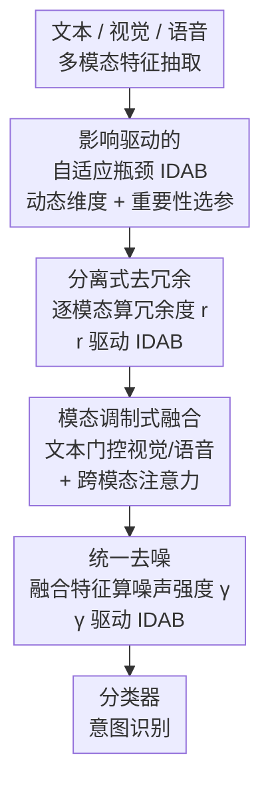

# SeD-UD: An Influence-Driven and Hierarchically-Decoupled Information Bottleneck for Multimodal Intent Recognition

**会议**: CVPR 2026  
**论文**: [CVF Open Access](https://openaccess.thecvf.com/content/CVPR2026/html/Li_SeD-UD_An_Influence-Driven_and_Hierarchically-Decoupled_Information_Bottleneck_for_Multimodal_Intent_CVPR_2026_paper.html)  
**代码**: https://github.com/9meiye/SeD-UD  
**领域**: 多模态VLM  
**关键词**: 多模态意图识别, 信息瓶颈, 自适应压缩, 去冗余去噪解耦, 特征净化

## 一句话总结
针对多模态意图识别中文本/语音/视觉特征里冗余与噪声并存的问题，SeD-UD 提出一个由「影响因子」驱动、能按样本动态调整瓶颈维度的信息瓶颈模块 IDAB，并把「去冗余」和「去噪」拆成分层解耦的两步——先在各单模态内并行去冗余、融合后再统一去噪，在 MIntRec、MELD-DA、CH-SIMS 上超过现有 SOTA。

## 研究背景与动机
**领域现状**：多模态意图识别（MIR）要从文本、语音、视觉三路互补信息里推断用户意图，主流路线是设计各种跨模态融合策略学判别性表征；近年一支重要分支把信息瓶颈（Information Bottleneck, IB）原理引进来——通过对融合特征做压缩+重建，挤掉冗余与噪声、保留判别信息（InMu-Net、DIB、MIB 等）。

**现有痛点**：视觉、语音模态信噪比（SNR）低，容易让噪声和意图标签产生虚假相关；文本 SNR 高但有歧义、反讽这类语义噪声；不同模态间还存在弱相关的冗余信息，会引入不一致信号干扰融合。现有 IB 方法有两个硬伤：（1）**瓶颈维度固定**——一刀切的压缩维度无法适配样本级别的冗余/噪声差异，冗余低时会误删判别特征、冗余高时又留有残余干扰；（2）**冗余和噪声混在一起处理**——同一次压缩既去冗余又去噪，但冗余来自跨模态特征重叠、噪声来自模态内在失真，两者性质不同，统一处理会削弱抑制效果。

**核心矛盾**：信息保留与干扰抑制之间需要按样本权衡，而固定维度+统一压缩既不能自适应、又把两类性质不同的干扰耦在一起。

**本文目标**：让 IB 框架（a）按输入自适应地调容量，（b）把去冗余和去噪解耦分层处理。

**核心 idea**：用一个「影响因子驱动、动态选维度+动态选参数」的自适应瓶颈 IDAB 替换固定瓶颈，并把它分层部署成「各模态先并行去冗余 → 融合 → 融合特征统一去噪」的 SeD-UD（Separated de-redundancy and Unified Denoising）结构。

## 方法详解

### 整体框架
SeD-UD 的输入是文本/视觉/语音三路原始信号，输出是意图类别。整条流水线由一个可复用的基础模块 IDAB 和一个分层解耦的处理顺序构成：先用模态专用编码器抽取三路特征并投到统一维度 $D$；然后**对每个单模态特征单独估计它相对其余两路的冗余度 $r$，用 $r$ 驱动 IDAB 做去冗余**；再用文本特征去调制（modulate）视觉/语音特征做融合；最后对融合特征**估计噪声强度 $\gamma$，再用 $\gamma$ 驱动一次 IDAB 做统一去噪**，把净化后的特征送进分类器。

这里贯穿全程的「自适应」来自 IDAB：传统 IB 用一对固定的编码-解码器、固定压缩维度，而 IDAB 给定一个量化后的影响因子（冗余度或噪声强度）后，会**先算出该样本应该用多大的压缩维度 $D^c$，再从预训练好的编码/解码器里按参数重要性挑出 Top-$D^c$ 个参数**来做这一次压缩与重建。

「先去冗余、再融合、最后去噪」这个顺序不是随意排的，作者给了两条依据：去冗余依赖跨模态数据分布做粗粒度语义匹配，若先去噪会扰乱该分布、削弱后续冗余估计；噪声很难在单模态视角下判断（一路看着像噪声的特征可能在另一路是有用线索），而且融合本身会引入模态差异带来的交互噪声，所以去噪必须放在融合之后统一做。

### 关键设计

**1. IDAB：影响驱动的输入自适应瓶颈，把固定维度换成按样本动态分配的容量**

针对「固定瓶颈维度无法适配样本级冗余/噪声」的痛点，IDAB 让压缩维度和压缩参数都随一个标量影响因子 $\alpha$（去冗余时取冗余度、去噪时取噪声强度）变化。它的合理性来自一个变分推导的结论（Theorem 1）：IB 最优压缩 $q^*(Z|X)$ 的表征本身就会随输入的噪声/冗余水平而自适应。具体做三件事：

（a）**先预训练一对线性编码-解码器**（$W^{en}, W^{de}\in\mathbb{R}^{D\times D}$），这一步不做任何参数挑选以保证优化稳定；收敛后在留出小批上用一阶 Taylor 显著性给每个参数 $\theta_i$ 打重要性分

$$\text{Importance}(\theta_i) = \|\theta_i\|_2^2 \cdot \|\nabla_{\theta_i}\mathcal{L}^{total}\|_2^2$$

再按重要性降序排出全局排名 $\pi$。这个准则和 SNIP、GraSP 这类显著性剪枝同源，用一阶敏感度近似「删掉该参数后损失的变化」。

（b）**用 $\alpha$ 算压缩维度 $D^c$**：先做带温度的归一化 $\bar\alpha = \tanh(\alpha/\tau)/(\|\tanh(\alpha/\tau)\|_2+\epsilon)$，再过一个可学习的单调投影 $\beta = w_2\,\text{SiLU}(w_1\bar\alpha+b_1)+b_2$，最后用非线性缩放律

$$D^c = \min\!\big(\max(\lfloor D^{1-\beta}\rceil,\, D^{\min}),\, D^{\max}\big)$$

并用 $D^{\min}, D^{\max}$ 卡边界。作者证明（Proposition 1）：只要 $\beta$ 随 $\alpha$ 非减，$D^c$ 就随 $\alpha$ 分段非增——即**冗余/噪声越大的样本，分到的瓶颈维度越小**，压得越狠，符合直觉。

（c）**按排名取 Top-$D^c$ 个参数**做实际的压缩与重建：$\hat W^{en}=W^{en}[:,\pi_{1:D^c}]$ 等，最终 $Z=\text{ReLU}(\hat W^{en\top}X+\hat b^{en})$、$\hat X=\text{ReLU}(\hat W^{de\top}Z+b^{de})$，其中 $Z\in\mathbb{R}^{D^c}$、$\hat X\in\mathbb{R}^{D}$。作者也坦言 IDAB 并非严格的互信息最优解器（高维连续下 MI 难精确优化、且基于重要性的门控不平滑），更应理解为「IB 一致的近似」——按参数重要性分配容量，尽量留住与标签相关的信息。⚠️ 部分公式从 CVF 抽取文本中有断字，符号以原文为准。

**2. 分离式去冗余：在各单模态内部、用跨模态冗余度逐路驱动 IDAB**

针对「冗余来自跨模态重叠、不该和噪声混处理」，SeD-UD 在融合前对每个模态单独去冗余。把三路特征 $F^t, F^v, F^a$ 之一当主特征 $F^{pri}$、另两路当辅助特征 $F^{aux}_1, F^{aux}_2$，先用注意力把辅助特征对齐到主特征上：$V_i=\text{Softmax}(F^{pri}F^{aux\top}_i/\sqrt{D})F^{aux}_i$，再算冗余度

$$r = \text{Sigmoid}(W^{r\top}\text{Concat}(V_1,V_2)+b^r)$$

$r$ 衡量该模态相对其余两路的冗余程度，随后把 $r$ 当影响因子喂给 IDAB 对 $F^{pri}$ 去冗余，得到 $\hat F^t, \hat F^v, \hat F^a$。这样冗余高的模态会被分到更小的瓶颈维度、压得更狠，而判别信息丰富、冗余低的模态则保留更多维度——这正是固定维度 IB 做不到的逐样本逐模态自适应。

**3. 模态调制融合 + 融合后统一去噪：先用文本主导融合，再对融合特征一次性净化噪声**

冗余去完后进入融合与去噪。**融合**上，作者依据「文本在 MIR 里提供关键语义/上下文」的先验，用文本特征去门控非文本特征：算门控权重 $g^v=\text{Sigmoid}(W^{gv\top}\text{Concat}(\hat F^t,\hat F^v)+b^{gv})$（$g^a$ 同理），用门控加权得到非文本融合特征 $\hat F^{nt}=g^v\cdot(W^{v\top}\hat F^v)+g^a\cdot(W^{a\top}\hat F^a)+b^{nt}$，再以 $\hat F^t$ 为 query、$\hat F^{nt}$ 为 key/value 跑多头跨模态注意力，经 Add&Norm、FFN 得融合特征 $\hat F^{fu}$——保证文本主导的同时吸收视/听互补信息。

**去噪**上，先估计 $\hat F^{fu}$ 的噪声强度：$I=\text{Sigmoid}(W^{p\top}\hat F^{fu}+b^p)$ 给出各维重要性权重，再聚合成标量

$$\gamma = \text{Sigmoid}\!\Big(\frac{1}{D}\sum_{d=1}^{D} I_d\,|\hat F^{fu}_d|\Big)$$

然后用 $\gamma$ 驱动 IDAB 对 $\hat F^{fu}$ 去噪得 $\hat F^{de}$，送进分类器。把去噪放在融合后做，正好处理了融合阶段引入的、单模态视角看不出来的交互噪声。

### 损失函数 / 训练策略
为放大去冗余与去噪的效果，作者引入信息蒸馏式监督：每个模态的去冗余损失 $\mathcal{L}^{dr}_m=\mathcal{L}^{kl}(\hat y_{F^m}, \hat y_{\hat F^m})$ 约束去冗余前后的预测分布；去噪损失 $\mathcal{L}^{dn}=\mathcal{L}^{kl}(\hat y_{\hat F^{fu}}, \hat y_{\hat F^{de}})+\mathcal{L}^{ce}(y,\hat y_{\hat F^{de}})$ 兼顾分布一致与分类正确；再加融合监督 $\mathcal{L}^{fu}$（对 $\hat y_{\hat F^{fu}}$ 的交叉熵）。总损失

$$\mathcal{L}^{total}=\frac{\sum_m \lambda_m \mathcal{L}^{dr}_m}{3}+\eta\mathcal{L}^{dn}+\omega\mathcal{L}^{fu},\quad m\in\{t,v,a\}$$

实现上 $D=768$、$\tau=1$、$\epsilon=10^{-6}$、$D^{\min}=64$、$D^{\max}=768$、注意力头 $H=8$，$\{\lambda_t,\lambda_v,\lambda_a\}=\{1.0,0.8,0.8\}$、$\eta=0.8$、$\omega=1$，AdamW、100 epoch。

## 实验关键数据

### 主实验
两个 MIR 数据集（MIntRec 20 类细粒度意图、MELD-DA 12 类情绪相关意图）上的对比，加粗为全体最优、下划线为 IB 类方法最优：

| 数据集 | 指标 | SeD-UD | DIB | InMu-Net | SDIF-DA | 最强基线 |
|--------|------|--------|-----|----------|---------|----------|
| MIntRec | ACC | 73.81 | 73.20 | 72.91 | **73.90** | SDIF-DA 73.90 |
| MIntRec | wF1 | 73.55 | 72.66 | 72.46 | 73.93 | SDIF-DA 73.93 |
| MIntRec | wP | **73.96** | 73.42 | 72.82 | 73.96 | 并列最优 |
| MIntRec | R | **71.88** | 69.89 | 69.42 | 71.61 | 本文最优 |
| MELD-DA | ACC | **63.72** | 62.72 | 61.52 | 61.31 | 本文最优 |
| MELD-DA | wF1 | **62.44** | 61.06 | 59.34 | 58.01 | 本文最优 |
| MELD-DA | R | **52.83** | 51.53 | 50.22 | 49.96 | 本文最优 |

MIntRec 上 ACC/wF1 略低于 SDIF-DA，作者解释是后者用了 ChatGPT 数据增强缓解小样本；但与同类 IB 方法（InMu-Net、DIB）相比，SeD-UD 在两数据集全部指标上都最优。MELD-DA 这种复杂对话场景下 SeD-UD 全指标领先，体现鲁棒性。跨域到 CH-SIMS 情感分析（ACC-2 82.43、F1 82.11、MAE 0.415 均最优）也验证了泛化性。推理速度 21.8ms/样本，比 TCL-MAP/SDIF-DA/InMu-Net（约 25.x ms）快约 15%——虽然 IB 执行次数更多，但自适应维度避免了无用计算。

### 消融实验：去冗余 vs 去噪（Table 6，ACC）
| t 去冗余 | v 去冗余 | a 去冗余 | 去噪 | MIntRec | MELD-DA |
|:---:|:---:|:---:|:---:|---|---|
| - | - | - | - | 68.54 | 59.01 |
| ✓ | ✓ | ✓ | - | 69.21 | 61.36 |
| - | - | - | ✓ | 71.69 | 62.66 |
| - | ✓ | ✓ | ✓ | 71.97 | 62.88 |
| ✓ | - | ✓ | ✓ | 72.21 | 63.10 |
| ✓ | ✓ | - | ✓ | 72.28 | 63.14 |
| ✓ | ✓ | ✓ | ✓ | **73.81** | **63.72** |

只去冗余比基线涨 0.67%/2.35%，只去噪涨 3.15%/3.65%（去噪贡献更大），两者全开最优。去掉文本去冗余（行 4）比去掉视频/语音去冗余掉得更多，印证文本承载更关键的判别信息。

### IDAB 组件消融（Table 4，MIntRec）
| 变体 | ACC | wF1 |
|------|-----|-----|
| FIB（固定维度 IB） | 71.47 | 71.06 |
| $D^c_{avg}$ + 随机选参 | 67.83 | 67.09 |
| $D^c_{avg}$ + 重要性排名 | 69.99 | 69.44 |
| 动态 $D^c$ + 随机选参 | 71.91 | 71.58 |
| 动态 $D^c$ + 重要性排名（本文） | **73.81** | **73.55** |

IDAB 整体显著优于 FIB；拆开看，**动态维度比固定平均维度贡献更大**，重要性排名选参在两种维度设定下都优于随机，二者叠加最佳。

### 关键发现
- **解耦顺序很重要**：把单模态去噪（SD）插到不同位置，`DR→SD→MF`（71.24/61.63）和 `SD→DR→MF`（70.63/60.24）都不如本文 `DR→MF→MD`（73.81/63.72），印证「先去冗余、融合后再统一去噪」的排序设计。
- **边界值敏感**：$D^{\min}=64$、$D^{\max}=768$ 最优；$D^{\min}$ 太小/太大、$D^{\max}$ 太小都会因过度压缩丢信息而掉点（如 $D^{\max}=256$ 时 MIntRec ACC 仅 69.66）。
- **影响因子可解释**：注入高斯噪声方差增大时 $\gamma$ 单调上升、随机打乱视频模态比例增大时冗余度 $r$ 下降，sanity check 与 $\gamma/r$ 的设计语义一致。
- **融合方式**：模态调制融合（MM）优于线性映射和 MAP 门控（MIntRec ACC 73.81 vs 64.33 / 72.93）。

## 亮点与洞察
- **把「压缩维度」做成样本级可学习量**：传统 IB 的瓶颈维度是超参，本文用影响因子 + 单调投影 + 缩放律 $D^c=\min(\max(\lfloor D^{1-\beta}\rceil,D^{\min}),D^{\max})$ 把它变成随输入连续可变的量，并证明了「冗余/噪声越大维度越小」的单调性——这个把容量自适应化的思路可迁移到任何用 IB 做特征净化的多模态任务。
- **用参数重要性排名实现「软剪枝式」自适应压缩**：先训一对满维编解码器、再按一阶 Taylor 显著性排名取 Top-$D^c$，等于把网络剪枝的显著性准则借来做 IB 的动态容量分配，避免为每个维度单独训练子网络。
- **去冗余/去噪的解耦不是简单堆两个模块，而是带顺序约束的**：去冗余要在融合前（保护跨模态分布以便冗余估计）、去噪要在融合后（处理融合引入的交互噪声），这个「位置即设计」的洞察被 Table 7 实验直接支撑。

## 局限与展望
- 作者自陈 IDAB 不是严格 MI 最优解，只是 IB 一致的近似，缺乏严格最优性保证；高维连续下的理论分析仍是开放问题。
- 影响因子 $\alpha$（$r$ 和 $\gamma$）的估计本身依赖可学习模块，其可靠性只用受控扰动 sanity check 验证，未给出更强的理论刻画；估计偏差会直接传导到维度选择。⚠️
- 评测集中在意图识别/情感分析的三模态数据，模态数更多、或模态严重缺失场景下的表现未验证；自适应维度对极端长尾意图类别的效果也未单独分析。
- 改进方向：把重要性排名做成可端到端微分的软选择、把 $D^c$ 的缩放律换成更有理论依据的容量-噪声关系、或将解耦顺序扩展为可学习的模块路由。

## 相关工作与启发
- **vs InMu-Net**：同为 MIR 的 IB 方法，InMu-Net 用固定维度瓶颈+显著性保留+峰度调节统一去噪/去冗余；SeD-UD 把维度做成自适应、并把去冗余去噪分层解耦，IB 类指标全面反超，且因避免无用计算反而推理更快（21.8 vs 25.5ms）。
- **vs DIB**：DIB 用低秩 Rényi 熵在单模态和多模态两级双重压缩提升噪声鲁棒性，仍是固定容量、未区分冗余与噪声来源；SeD-UD 在 MIntRec/MELD-DA/CH-SIMS 上对 DIB 多数指标占优，差别在「按样本调容量 + 分离两类干扰」。
- **vs SDIF-DA**：SDIF-DA 靠 ChatGPT 数据增强缓解小样本，在 MIntRec ACC/wF1 上略高；本文不依赖外部 LLM 增强，靠特征净化在召回率、wP 及 MELD-DA 全指标上领先，路线互补。

## 评分
- 新颖性: ⭐⭐⭐⭐ 把 IB 瓶颈维度做成影响因子驱动的样本级自适应量并带单调性证明，加上去冗余/去噪的顺序解耦，思路清晰且有新意。
- 实验充分度: ⭐⭐⭐⭐ 三数据集 + 推理速度 + 多组消融（IDAB 组件、解耦顺序、边界值、影响因子 sanity check）较完整，但模态缺失/更多模态场景未覆盖。
- 写作质量: ⭐⭐⭐⭐ 动机—方法—实验逻辑顺畅，公式与图配合清楚；部分理论（Theorem 1）放附录，正文略简。
- 价值: ⭐⭐⭐⭐ 自适应 IB 容量 + 干扰解耦是可迁移到广义多模态特征净化的通用思路。

<!-- RELATED:START -->

## 相关论文

- [\[ICML 2025\] Learning Optimal Multimodal Information Bottleneck Representations](../../ICML2025/multimodal_vlm/learning_optimal_multimodal_information_bottleneck_representations.md)
- [\[ACL 2026\] From Verbatim to Gist: Distilling Pyramidal Multimodal Memory via Semantic Information Bottleneck](../../ACL2026/multimodal_vlm/from_verbatim_to_gist_distilling_pyramidal_multimodal_memory_via_semantic_inform.md)
- [\[AAAI 2026\] Conditional Information Bottleneck for Multimodal Fusion: Overcoming Shortcut Learning in Sarcasm Detection](../../AAAI2026/multimodal_vlm/conditional_information_bottleneck_for_multimodal_fusion_overcoming_shortcut_lea.md)
- [\[CVPR 2026\] MODIX: Training-Free Multimodal Information-Driven Positional Index Scaling for VLMs](modix_positional_index_scaling.md)
- [\[ACL 2026\] Thinking Like a Botanist: Challenging Multimodal Language Models with Intent-Driven Chain-of-Inquiry](../../ACL2026/multimodal_vlm/thinking_like_a_botanist_challenging_multimodal_language_models_with_intent-driv.md)

<!-- RELATED:END -->
