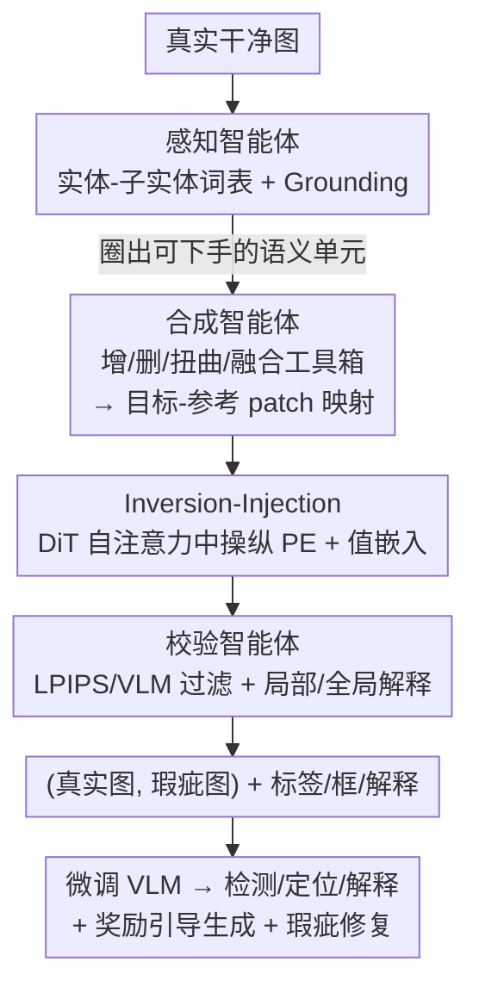

# See and Fix the Flaws: Enabling VLMs and Diffusion Models to Comprehend Visual Artifacts via Agentic Data Synthesis

**会议**: CVPR 2026  
**论文**: [CVF Open Access](https://openaccess.thecvf.com/content/CVPR2026/html/Park_See_and_Fix_the_Flaws_Enabling_VLMs_and_Diffusion_Models_CVPR_2026_paper.html)  
**代码**: https://huggingface.co/datasets/KRAFTON/ArtiBench  
**领域**: 多模态VLM / 扩散模型  
**关键词**: 视觉瑕疵, 智能体数据合成, 扩散瑕疵注入, VLM瑕疵理解, DiT位置嵌入操纵

## 一句话总结
针对"现代扩散模型生成的结构性瑕疵难以人工标注、VLM 又看不懂"的双重困境，本文提出 **ArtiAgent**——一个由感知/合成/校验三智能体组成的全自动流水线，通过在 DiT 自注意力里**操纵位置嵌入(PE)+ 值嵌入**把可信瑕疵注入真实图像，零人工合成 10 万张带框带解释的瑕疵数据，用它微调的开源 VLM 在检测/定位/解释三任务上反超 GPT-5。

## 研究背景与动机
**领域现状**：现代扩散模型(FLUX、Qwen-Image、Nano-Banana 等 DiT 架构)在文图对齐和美学上已极强，但仍会产生**视觉瑕疵**——生成内容物理结构被扭曲(六指手、双鼻子、融合实体)。同时 VLM 在 VQA、场景描述上能力突出，被当作各种视觉任务的自动判官。

**现有痛点**：作者实测发现，即便 GPT-5、Gemini-2.5-Pro 这类顶级 VLM，在 AI 生成图上检测/定位/解释瑕疵的能力**几乎等同随机猜测**(ArtiBench 检测准确率仅 0.58–0.62)。要训练 VLM 看懂瑕疵就得有瑕疵标注数据，而现有数据集(PAL、SynthScars、DiffDoctor)有两个硬伤：(1) 主要瞄准**早期瑕疵类型**(高斯噪声、模糊)，这些在 SD1.0 时代常见，现代模型早已基本消除；(2) **重度依赖人工标注**(多达 1 万–2.5 万标签)，昂贵且无法规模化覆盖瑕疵的全部多样性。

**核心矛盾**：现代瑕疵是"像素质量很高、但结构违反常识"的**可信结构性瑕疵(plausible structural artifacts)**，恰恰最难被人察觉、也最难被规则生成；而想规模化训练 VLM，又必须摆脱人工标注瓶颈。两者叠加，使得"可信瑕疵 × 无需标注 × 可规模化"成为一个空白。

**本文目标**：构造一条**无人工干预**的自动管线，能在任意真实图像上注入**可信的结构性瑕疵**，并自动产出二值标签、位置框、局部/全局文字解释，供检测/定位/推理下游训练。

**切入角度**：作者把"造瑕疵"重新定义为一个**图像编辑里的逆推-修复(inversion-restoration)**问题——既然 DiT 编辑可以做精确局部替换，那把"替换"故意做歪(把某块区域的位置/语义错配到另一块)就能造出结构错乱却像素自然的瑕疵。

**核心 idea**：用三智能体协同(找哪里改 → 怎么改 → 改得好不好)＋一套在 DiT 自注意力中**操纵位置嵌入与值嵌入**的 inversion-injection 工具，把瑕疵注入流程化、自动化、可规模化。

## 方法详解

### 整体框架
ArtiAgent 输入一张干净真实图，输出一对(真实图, 瑕疵注入图)及其丰富标注。整条管线由三个相互衔接的智能体串成:**感知智能体**先把图分解成实体/子实体并 grounding，圈出适合下手的语义单元;**合成智能体**用一个工具箱(增/删/扭曲/融合)生成"目标-参考 patch 映射"，再经 inversion-injection 模块把它落到图像上，造出可信瑕疵;**校验智能体**做质量过滤并生成局部+全局解释，把结果整理成可训练数据。整套流程把"造瑕疵+标注"全自动化，最终用合成的 10 万样本微调开源 VLM。

### 关键设计

**1. 感知智能体：把图分解成"可下手"的实体-子实体层级**

合成瑕疵之前必须知道"改哪里才像物理结构错误"。感知智能体先用现成 VLM 把输入图分解成**层级词表**:实体(如 dog)和子实体(如 nose/leg)，子实体再分两级语义——外周子实体(手指、腿)和中层子实体(身体、脸)。然后用 Grounded-SAM 对实体和子实体做分割定位，并通过计算重叠比例做**包含分析(containment analysis)**，把每个子实体挂到它的父实体上(如"狗的一条腿")。这一层级结构直接决定后续哪种工具作用于哪种粒度——外周子实体适合增/删，中层子实体适合扭曲，重叠实体适合融合，从而保证注入的瑕疵落在语义合理的位置上。

**2. 合成智能体：工具箱 + inversion-injection，在 DiT 注意力里"错位"造瑕疵**

这是全文技术核心，要解决"如何生成像素自然但结构违常识的可信瑕疵"。它分两步。其一是**目标-参考 patch 映射工具箱**，含四种工具，每种产出一组 $M=\{(p_t, p_r)\}$ 的目标-参考 patch 映射:**add**(从邻近无冲突 patch 选最佳目标补到子实体区域，造重复/多余)、**remove**(用周围上下文 patch 替换子实体区域，造缺失)、**distort**(对目标 patch 施加 jitter 随机位移/strip 环形移位/随机置换三种核，造扭曲)、**fuse**(把两个重叠实体的 patch 互相错配，造融合)。

其二是**inversion-injection 模块**，把映射真正落到图像。它扩展了图像编辑的 inversion-restoration 范式:**Inversion 阶段**把真实图反演成噪声潜变量，按式 $Q^{(\ell)}=X^{(\ell)}W_Q^{(\ell)},\ K^{(\ell)}=X^{(\ell)}W_K^{(\ell)},\ V^{(\ell)}=X^{(\ell)}W_V^{(\ell)}$ 算自注意力，并用 RoPE 注入位置 $\tilde Q^{(\ell)}_p=\text{RoPE}(Q^{(\ell)},p)$，同时**缓存每层的值嵌入** $V^{(\ell)}_{inv}$。**Injection 阶段**在去噪时对每个目标 patch $p_t$(映射到 $p_r$)同时做两件事:把它的**位置嵌入换成参考 patch 的位置**($\tilde Q^{(\ell)}_{p_t}=\text{RoPE}(Q^{(\ell)}_{p_t}, p_r)$、key 同理)，并把它的**值嵌入替换为参考 patch 缓存的值** $V^{(\ell)}_{p_t}\leftarrow V^{(\ell)}_{p_r,inv}$;背景 patch 则保留原位置与原值。直觉是:**PE 注入控制"模型以为去噪发生在哪"，值注入提供"那个位置填什么语义内容"**，两者组合就能在局部精确植入真实瑕疵、背景保持一致。作者强调值注入虽是编辑领域成熟手段，但**在注入时操纵其位置、以及 PE 注入本身都是此前编辑工作没用过的新做法**;为避免学到边缘断裂之类捷径特征，PE/值注入只在**早-中层**进行、最后几步去噪关闭。该方法**训练无关、模型无关**，可直接套到任意 DiT(实现用 FLUX.1-dev + FireFlow)。

**3. 校验智能体：双过滤 + 局部/全局解释，把脏数据洗成可训练标注**

合成结果良莠不齐，校验智能体做质量保障与标注富化，关键在于它拿到的是**(真实图, 瑕疵图)成对输入**，可以对照判定。**过滤**分两路:扭曲类用 **LPIPS 过滤**，保留满足 $\tau_1 \le 1 - d_{\text{LPIPS}}(x_{\text{original}}, x_{\text{artifact}}) \le \tau_2$ 的对——$\tau_2$ 滤掉变化太小看不出的、$\tau_1$ 滤掉损坏太重不可信的;重复/缺失/融合类用 **VLM 过滤**，给 VLM 喂一个三元组(目标区域被遮的原图提供全局上下文、裁出的原始目标区、裁出的瑕疵目标区)，让它二值判断是否真的出现了新实例/消失了物体/不自然融合。**解释生成**同样用这个三元组让 VLM 写**局部解释**(瑕疵区相比真实区差在哪)，再汇总所有局部解释+框，对整图写**全局解释**(为什么这张图算瑕疵图)。最终产出 50K 成对图+元数据(源图来自 COCO/Caltech-101/11K Hands/CelebA-HQ，VLM 用 GPT-4o)。

### 损失函数 / 训练策略
ArtiAgent 本身是数据合成管线、不训练新模型。下游训练把合成数据转成 VQA 样本，微调 Qwen2.5-VL-7B 与 InternVL3.5-8B(各 10 万训练样本)。在缓解应用里另训了一个 **Bradley-Terry 奖励模型**(CLIP 为骨干)，学习"给真实图比瑕疵图更高分"，配合 test-time scaling 引导 FLUX-schnell 生成无瑕疵图。

## 实验关键数据

### 主实验
在 ArtiBench(本文新建 1K 现代生成图基准)及 RichHF/LOKI/SynthScars 三个旧基准上评测检测(Acc/F1)、定位(mIoU/F1)、解释(ROUGE/CSS)。核心结论:用 ArtiAgent 合成数据微调的开源 VLM 全面碾压原版，并普遍追平甚至超过 GPT-5/Gemini-2.5-Pro。

| 任务/基准 | 指标 | Qwen2.5-VL-7B | + ArtiAgent | GPT-5 | Gemini-2.5-Pro |
|--------|------|------|----------|------|------|
| 检测 ArtiBench | Acc | 0.501 | **0.627** | 0.599 | 0.582 |
| 检测 ArtiBench | F1 | 0.336 | **0.627** | 0.577 | 0.575 |
| 定位 ArtiBench | mIoU | 0.075 | **0.119** | 0.126 | 0.061 |
| 定位 SynthScars | mIoU | 0.013 | **0.137** | 0.117 | 0.064 |
| 解释 ArtiBench | CSS | 0.263 | **0.643** | 0.434 | 0.420 |

> InternVL3.5-8B 的检测准确率从 0.498 提到 0.630(+26.5%);旧瑕疵分割基线 PAL/DiffDoctor 在 LOKI 上尚可，但**无法泛化到 ArtiBench**(DiffDoctor LOKI mIoU 0.175 → ArtiBench 0.081)，印证现代瑕疵更难。整体 ArtiBench 检测准确率都偏低(0.6 上下)，说明现代结构性瑕疵确实是个未解难题。

### 消融/分析实验

| 配置 | 检测 Acc | 定位 mIoU | 解释 CSS | 说明 |
|------|---------|---------|---------|------|
| 1K SynthScars(人工标注) | 0.555 | **0.094** | 0.521 | 人工监督 |
| 1K ArtiAgent(合成) | 0.555 | 0.074 | **0.606** | 合成监督 |
| 数据规模 1K → 100K | 持续上升 | — | — | 检测随规模一路涨 |

### 关键发现
- **合成监督已可媲美人工标注**:同为 1K 样本，ArtiAgent 在检测上打平、解释上更好，仅定位略逊于 SynthScars。作者归因于 ArtiAgent 标签是 **patch 级粒度**(不如人工框精细)，但整体证明它是人工标注的低成本可规模化替代。
- **数据规模效应清晰**:三任务随合成数据增多稳定上升;定位/解释在**仅 1K 样本时就已超过 GPT-5**，说明监督信号极其样本高效;检测则持续受益到 10 万规模，说明检测更吃瑕疵多样性。
- **两个下游应用都奏效**:用 ArtiAgent 数据训的奖励模型引导扩散采样，6 轮搜索后奖励从 0 稳步升至 0.23±0.08，生成结构更清晰;用瑕疵感知 VLM 定位+FLUX inpainting 迭代修复，能自动定位并自然补全瑕疵区。

## 亮点与洞察
- **把"造瑕疵"转成"做歪的图像编辑"**:最巧的一步是借 inversion-restoration 范式，通过**位置嵌入错配**让模型"以为"在 A 处去噪却填 B 处的语义，造出像素自然却结构违常识的瑕疵——这正好命中现代瑕疵"看着真、结构错"的本质，比加噪声/模糊真实得多。
- **PE 注入是真正的新点**:值注入在编辑里早有，但"注入时操纵其位置"和"单独的 PE 注入"是此前编辑工作没碰过的;且方法训练无关、DiT 无关，可即插即用到任意新 DiT 模型。
- **成对数据设计一鱼多吃**:同内容的(真/瑕)成对图天然适合做 Bradley-Terry 偏好学习，所以同一份数据既能训瑕疵理解 VLM，又能直接喂奖励模型引导生成——数据复用率高。
- **可迁移思路**:"操纵注意力的位置编码来定向控制生成内容落点"这一手段，可迁移到可控编辑、对抗样本生成、受控数据增广等需要"精确局部干预"的任务。

## 局限与展望
- **标注粒度受限**:ArtiAgent 标签是 patch 级，定位精度天然不如人工框(实验里定位是唯一逊于人工标注的指标)，对需要像素级精度的下游不够。
- **瑕疵真实度依赖工具与超参**:四种工具+三种扭曲核+LPIPS 阈值 $\tau_1,\tau_2$、注入层范围都需调，合成瑕疵分布是否覆盖真实模型失败模式的全谱仍有 ⚠️ 待验证空间;注入层选择(早-中层)的鲁棒性也依赖具体 DiT。
- **依赖现成 VLM 做感知/校验**:GPT-4o 作为感知与校验主力，其偏差会传导到合成数据;若 VLM 本身对某类结构看不准，合成与过滤都可能系统性偏移。
- **绝对难度仍高**:即便最强配置，ArtiBench 检测准确率也只到 0.63 左右，现代结构性瑕疵理解远未解决。

## 相关工作与启发
- **vs SynthScars / PAL / DiffDoctor(人工标注瑕疵数据集)**:它们靠人工像素级/半监督标注(1 万–2.5 万),且多为旧式瑕疵;本文零人工、瞄准现代结构性瑕疵、可规模到 10 万，且证明合成监督质量可媲美人工。
- **vs LEGION(SynthScars 训练的统一检测-定位-解释模型)**:LEGION 在自家训练分布上强、但跨到 ArtiBench 这类现代瑕疵就掉;本文合成数据带来的泛化性更好。
- **vs 图像编辑里的 inversion-restoration / value injection(FireFlow 等)**:它们追求"保真编辑"，本文反其道把同一机制用来"定向破坏"，并新增 PE 注入这一前人未用的维度。

## 评分
- 新颖性: ⭐⭐⭐⭐⭐ 把瑕疵合成重构为"做歪的 DiT 编辑"并引入 PE 注入，角度新且彻底绕开人工标注。
- 实验充分度: ⭐⭐⭐⭐ 三任务×四基准、规模效应、人工对比、两个下游应用都覆盖，仅定位粒度偏弱。
- 写作质量: ⭐⭐⭐⭐ 问题动机和方法链路清晰，注入机制的数学表述到位。
- 价值: ⭐⭐⭐⭐⭐ 同时给 VLM 瑕疵理解和扩散瑕疵缓解提供可规模化数据引擎，外加 ArtiBench 现代基准。

<!-- RELATED:START -->

## 相关论文

- [\[CVPR 2026\] LLaDA-V: Large Language Diffusion Models with Visual Instruction Tuning](llada-v_large_language_diffusion_models_with_visual_instruction_tuning.md)
- [\[CVPR 2026\] CRIT: Graph-Based Automatic Data Synthesis to Enhance Cross-Modal Multi-Hop Reasoning](crit_graph-based_automatic_data_synthesis_to_enhance_cross-modal_multi-hop_reaso.md)
- [\[CVPR 2026\] Thinking Diffusion: Penalize and Guide Visual-Grounded Reasoning in Diffusion Multimodal Language Models](thinking_diffusion_penalize_and_guide_visual-grounded_reasoning_in_diffusion_mul.md)
- [\[CVPR 2026\] ARM-Thinker: Reinforcing Multimodal Generative Reward Models with Agentic Tool Use and Visual Reasoning](arm-thinker_reinforcing_multimodal_generative_reward_models_with_agentic_tool_us.md)
- [\[CVPR 2026\] MindPower: Enabling Theory-of-Mind Reasoning in VLM-based Embodied Agents](mindpower_enabling_theoryofmind_reasoning_in_vlmba.md)

<!-- RELATED:END -->
