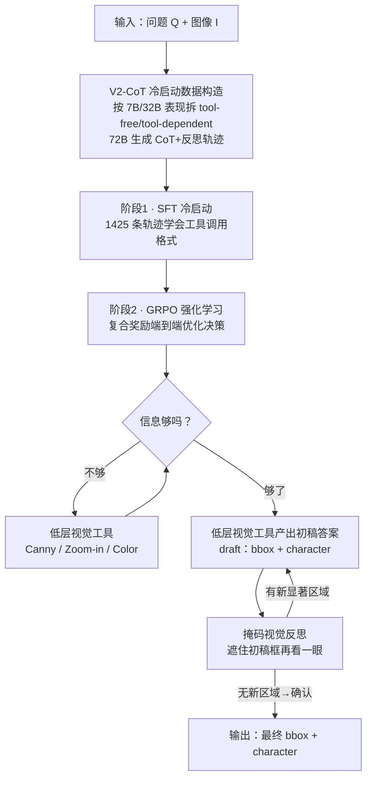

# See Further, Think Deeper: Advancing VLM's Reasoning Ability with Low-level Visual Cues and Reflection

**会议**: CVPR 2026  
**论文**: [CVF Open Access](https://openaccess.thecvf.com/content/CVPR2026/html/Wu_See_Further_Think_Deeper_Advancing_VLMs_Reasoning_Ability_with_Low-level_CVPR_2026_paper.html)  
**代码**: 无  
**领域**: 多模态VLM  
**关键词**: 视觉语言模型, 强化学习, 多模态思维链, 低层视觉工具, 视觉反思

## 一句话总结
ForeSight 给 VLM 配上一套低层视觉工具（Canny / 缩放 / 调色）和一个基于掩码的视觉反思机制，用 GRPO 强化学习让 7B 模型在推理时自主决定"何时调工具、要不要推翻初稿答案"，在自建的 Odd-One-Out 显著性定位基准 CG-SalBench 上把 IoU 从 32.56% 拉到 62.24%，逼近 72B 模型。

## 研究背景与动机

**领域现状**：用 RL（尤其 DeepSeek-R1 式"只用答案正确率当奖励"）增强 VLM 的推理能力是当前主流。为了让视觉信息进入推理链，社区提出了交错式多模态思维链（i-MCoT），如 DeepEyes 的"用图思考"、DriveAgent-R1 的文本/工具混合思考，让模型在推理中调用图像工具。

**现有痛点**：作者指出 i-MCoT 有两个被忽视的缺口。其一是**缺低层视觉信息**——现有工具大多围着 RoI 缩放、3D 检测、深度图这类高层任务转，没人去抠边缘、颜色这种"低层"线索；而 SalBench 已经揭示 SOTA 大 VLM 在检测图中"那个跟别人不一样的物体"（Odd-One-Out）这类对人类极其简单的显著性异常上表现很差。其二是**没有有效的视觉反馈**——从推理到出答案是开环的：答案一旦生成就不再回看、不再修正，这种单向"推理→答案"只能带来有限的智能。

**核心矛盾**：VLM 的推理过程几乎全在语言模态里打转（text-only reasoning），符号推理缺乏对视觉证据的动态 grounding，这与人类"信息不够就主动再去看一眼"的视觉推理方式相悖。推理链越长，细粒度视觉特征被忽略得越严重。

**本文目标**：让 VLM 既能"看得更远"（See Further，主动获取低层视觉细节），又能"想得更深"（Think Deeper，对自己的答案做视觉反思与自我纠错）。

**切入角度**：模仿人类——信息不足时主动调工具去抠细节；给出初步答案后，把答案对应区域遮住再看一眼，验证它到底对不对。

**核心 idea**：把开环的"推理→答案"升级成闭环的"推理→答案→视觉反馈→推理→答案……"，并用 RL 让模型自主学会"何时调工具、要不要改答案"，全部以最终答案的定位/识别精度作奖励信号。作者称这是首个把"带视觉反馈的反思"引入 VLM 推理的工作。

## 方法详解

### 整体框架

ForeSight 是一个统一的多模态工具增强推理框架，骨干是 Qwen2.5-VL-7B。给定问题 $Q$ 和图像 $I$，模型在文本 CoT 的每一步自主判断：现有信息够不够给出正确答案？够就直接输出；不够就调用合适的低层视觉工具处理/增强图像，再带着更新后的视觉输入继续推理，如此迭代直到自认为答对或超过最大调用次数。出了初稿答案后，再触发**视觉反思**：把初稿定位框对应的区域在原图上遮掉，喂回模型重新审视，决定是否推翻并修正。

训练分两阶段串行：**阶段 1（SFT 冷启动）**先用自动构造的高质量 V2-CoT 轨迹做监督微调，教会模型"工具怎么调、反思轨迹长什么样"；**阶段 2（RL）**用 GRPO + 一组复合奖励做端到端优化，把"何时调、何时改"这种决策能力真正练出来。

### 关键设计

**1. 低层视觉工具集：让模型按需抠出边缘/缩放/颜色这些被高层工具漏掉的线索**

针对"i-MCoT 工具只盯高层任务、忽略低层视觉信息"这个痛点，ForeSight 配了三个基础低层视觉工具，模型在 CoT 里可自主决定调不调、调哪个：(1) **Canny 工具**用 Canny 边缘检测算法，靠强梯度区域勾出物体轮廓，给模型显式的结构线索，支撑"轮廓感知"的推理；(2) **Zoom-In 工具**让模型自评细节是否充分，不够就自适应放大相关区域抠更细的线索（实验里最多调 2 次）；(3) **Color 工具**放大图像里的颜色差异，强化局部特征、提升 grounding 可靠性（最多调 1 次）。调用后工具产物以 `<tool_response><image></tool_response>` 形式回灌，模型据此再推理。关键不是"有这些工具"，而是模型学会了"信息不足时主动去看"——这正是 SalBench 暴露的、纯靠内部知识的大 VLM 做不到的事。

**2. 基于掩码的视觉反思：把开环推理改造成"遮住答案再验一遍"的闭环自纠错**

针对"出了答案就不再回看"的开环痛点，这是本文最核心、也是作者声称的首创点。设 $I$、$I_{\text{ans}}$、$T_{\text{ans}}$ 分别为输入图、当前步预测的定位区域、对应的预测答案；模型先把初稿写进 `<draft_answer>`（含 $T_{\text{ans}}$ 和 $I_{\text{ans}}$）。反思时把上一轮定位区域 $I_{\text{ans}}^{(k-1)}$ 在原图上掩掉，得到第 $k$ 轮输入并重新推理：

$$I'^{(k)} = I \odot \big(1 - \mathbf{1}_{I_{\text{ans}}^{(k-1)}}\big), \quad T_{\text{ans}}^{(k)}, I_{\text{ans}}^{(k)} = f_\theta\big(I'^{(k)}, T_{\text{ans}}^{(k-1)}, I_{\text{ans}}^{(k-1)}\big)$$

其中 $\mathbf{1}_{I_{\text{ans}}^{(k-1)}}$ 是上一轮区域的二值掩码，$\odot$ 是逐元素乘，$f_\theta(\cdot)$ 是模型的 CoT 推理+grounding 函数。直觉很妙：如果初稿真的框对了 Odd-One-Out 物体，把它遮掉后图里应该再无显著异常区域，模型就确认答案；若遮掉后还冒出新的显著区域，说明初稿框错了，模型就改答案。实验里最大迭代 2 轮。相比 GThinker 那种仍以文本为中心、不真正交错的反思，这里的反馈是显式视觉信号，形成真正的闭环交叉验证。

**3. V2-CoT 冷启动数据构造：用三档模型自动产出"什么时候该调工具"的平衡训练集**

RL 之前需要高质量冷启动数据，作者设计了 V2-CoT（Visual Cues and Visual Feedback chain）自动构造流程，三步走：(1) **数据划分**——Qwen2.5-VL-7B 不用工具就能高分的样本判为 *tool-free*；Qwen2.5-VL-32B 用工具明显比不用好的样本判为 *tool-dependent*。这一刀切得巧：用"小模型够不够、中模型用工具有没有提升"的能力差，来界定一条样本到底该不该用工具。(2) **CoT 标注生成**——用 Qwen2.5-VL-72B 给两类数据生成带视觉反思的结构化 CoT 轨迹。(3) **数据清洗**——人工规则过滤低质标注。最终 SFT 集 1425 条（596 tool-free + 829 tool-dependent），让模型同时学到"纯文本推理够用时别瞎调工具"和"需要时果断调"的混合推理习惯。

**4. GRPO + 五项复合奖励：用可验证奖励教会模型"工具用对、反思一致"**

阶段 2 用 GRPO 做 RL，奖励是五项加权和：

$$R(\tau) = \lambda_{\text{fmt}} R_{\text{fmt}} + \lambda_{\text{IoU}} R_{\text{IoU}} + \lambda_{\text{F1}} R_{\text{F1}} + \lambda_{\text{tc}} R_{\text{tc}} + \lambda_{\text{ver}} R_{\text{ver}}$$

权重依次取 $0.2, 1.2, 1, 0.8, 1.2$。其中 $R_{\text{fmt}}$ 约束推理轨迹格式合理；$R_{\text{IoU}}$ 用预测框与 GT 框的 IoU 提升定位精度；$R_{\text{F1}}$ 用生成文本与 GT 的 F1 提升 character 识别。两项专门服务本文机制：**工具奖励** $R_{\text{tc}}$ 只在"用了工具 $T_{\text{used}}{=}1$、没滥用 $T_{\text{over}}{=}0$、答案准确 $A{>}\theta$"时给 $+1$，滥用或格式非法给 $-1$，否则 $0$——核心是奖励"用对工具且答对"，遏制为调而调；**验证奖励** $R_{\text{ver}}$ 检查反思自洽：若初稿匹配 GT，则 `<verify>` 必须判"正确"且最终答案不动；若初稿偏离 GT，则 `<verify>` 必须判"错误"且最终答案被修正，自洽给 $+1$、格式非法给 $-0.5$、否则 $0$。这把"反思有没有在认真验证、而不是走过场"也变成了可优化的信号。

## 实验关键数据

### 主实验

CG-SalBench 是作者在 SalBench 上扩展的 Odd-One-Out 定位+识别基准（合成 P3 + 真实 O3），训练 3929、测试 661 样本，要求同时输出 bbox 和异常 character。ForeSight-7B 对比开源与闭源 SOTA：

| 模型 | IoU | F1 | Precision | Recall |
|------|-----|-----|-----------|--------|
| InternVL3-8B | 30.50 | 72.09 | 69.74 | 79.01 |
| Qwen2.5-VL-7B（基座） | 32.56 | 64.97 | 61.46 | 75.81 |
| Qwen2.5-VL-72B | 66.00 | 82.70 | 82.37 | 86.74 |
| Qwen3-VL-8B | 48.40 | 70.94 | 67.76 | 81.15 |
| GPT-5（闭源） | 7.85 | 89.85 | 87.79 | 95.54 |
| Doubao-Seed-1.6（闭源） | 47.66 | 89.10 | 90.55 | 89.99 |
| Claude-Sonnet-4（闭源） | 20.82 | 82.50 | 82.40 | 89.13 |
| **ForeSight (7B)** | **62.24** | **84.24** | 84.52 | 87.18 |
| Δ vs Qwen2.5-VL-7B | **+29.68** | **+19.27** | +23.06 | +11.37 |

7B 的 IoU（62.24%）逼近 72B（66.00%），并在定位上大幅甩开所有闭源模型（最强的 Doubao 才 47.66%，领先 14% 以上）。值得注意的是 GPT-5 的 F1/Recall 很高但 IoU 仅 7.85%——识别得出"哪种异常"却定不准位置；ForeSight 各指标高且均衡，说明设计真正补的是"定位+反思"这块短板，而非靠堆规模。

泛化性上，ForeSight 在三个 RefCOCO 系定位基准和 MME 上也都有提升：

| 基准 | Qwen2.5-VL-7B* | ForeSight (7B) | Δ |
|------|----------------|----------------|----|
| RefCOCO | 88.91 | 91.42 | +2.51 |
| RefCOCO+ | 82.11 | 83.66 | +1.55 |
| RefCOCOg | 86.4 | 88.43 | +2.03 |
| MME | 2288.2 | 2326 | +37.8 |
| MMBench | 82.47 | 81.50 | −0.97 |

（*为作者复现值。MMBench 略降，作者归因于训练偏向基础视觉/定位。）

### 消融实验

**训练组件消融**（tools / reflect 单独 vs 组合）：

| tools | reflect | IoU | F1 | Precision | Recall | 说明 |
|:---:|:---:|-----|-----|-----------|--------|------|
| × | × | 59.36 | 51.40 | 39.68 | 84.25 | 都不要 |
| ✓ | × | 59.23 | 57.19 | 45.40 | 91.10 | 仅工具：F1 51.40→57.19 |
| × | ✓ | 61.04 | 45.96 | 32.77 | 93.18 | 仅反思：Recall 84.25→93.18 |
| ✓ | ✓ | **62.24** | **84.24** | **84.52** | 87.18 | 二者互补，全面飙升 |

**训练阶段消融**（SFT / RL）：

| SFT | RL | IoU | F1 | Precision | Recall |
|:---:|:---:|-----|-----|-----------|--------|
| ✓ | × | 57.47 | 72.34 | 69.64 | 81.10 |
| × | ✓ | 52.80 | 74.94 | 75.12 | 74.77 |
| ✓ | ✓ | **62.24** | **84.24** | **84.52** | **87.18** |

**推理期免训练消融**（Table 3）：直接给闭源模型在推理时挂上工具/反思，IoU 提升有限且不稳定（最大 +15.27%，Doubao 反而掉），证明"光给工具没用，必须训练模型学会何时/如何用"。

### 关键发现
- **工具和反思是互补而非冗余**：单用工具主要补 F1/Precision（主动感知），单用反思主要补 Recall（错误纠正），两者合起来 F1 才从 ~51% 跃到 84%——这是全文最强的证据，说明"看得远"和"想得深"解决的是不同失败模式。
- **冷启动不可省**：仅 RL（无 SFT）IoU 只有 52.80% 且训练不稳，SFT 先把工具调用/反思格式打底，RL 才能稳定细化到 62.24%。
- **小模型靠推理设计可补规模差距**：7B 的 IoU 逼近 72B，且 GPT-5/Claude 这类强闭源在"定位"上反而很差，说明 Odd-One-Out grounding 是规模也难自动解决的短板，需要专门的低层感知+反思设计。

## 亮点与洞察
- **"遮住答案再看一遍"的反思机制特别巧**：它把"答案对不对"转化成一个可视化的自检——框对了遮掉后应无显著异常，框错了会冒出新异常区域。这比纯文本自我批判更可靠，因为有显式视觉证据交叉验证，且天然适配 Odd-One-Out 这种"找不同"任务。
- **用模型能力差来切数据是可复用的 trick**：拿 7B 能不能独立答对、32B 用工具有没有增益来界定"这条样本该不该调工具"，避免了人工标注"工具必要性"，可迁移到任何"要不要调用外部工具"的 agent 训练。
- **奖励里专门为"反思自洽"设计 $R_{\text{ver}}$**：不只奖励答对，还奖励"verify 的判断和实际对错一致"，把反思从走过场逼成真验证——这对所有带自我反思的 RL 训练都有借鉴价值。

## 局限与展望
- **任务面偏窄**：核心收益都在 Odd-One-Out 显著性定位（CG-SalBench）这一自建任务上，虽在 RefCOCO/MME 有泛化，但 MMBench 反而略降，说明训练对"基础视觉+定位"有偏置，对更综合的多模态理解未必正向。
- **工具是固定的低层算子**：Canny/Zoom/Color 三件套针对边缘、尺度、颜色这类低层线索，对纹理、语义关系等更复杂的视觉判别可能力有不逮；工具集如何自动扩展、组合是开放问题。
- **反思上限只有 2 轮、依赖 bbox 质量**：掩码反思建立在"初稿 bbox 大致框对"的前提上，若初稿定位严重偏离，遮错区域可能误导后续反思；迭代轮数小也限制了复杂场景的纠错深度。
- ⚠️ 论文未公开代码，部分奖励指示变量（$T_{\text{over}}$ 的判定阈值、$A>\theta$ 的 $\theta$ 取值）细节以原文为准。

## 相关工作与启发
- **vs DeepEyes / DriveAgent-R1**: 同属 i-MCoT 工具增强推理，但它们的工具聚焦 RoI 缩放、3D 检测、深度图等高层任务，本文专攻 Canny/颜色这类低层视觉线索，且额外引入闭环视觉反思；在 RefCOCO 等基础视觉任务上 ForeSight 对 DeepEyes 提升更明显。
- **vs GThinker**: GThinker 也有视觉引导的反思，但其推理过程仍以文本为中心、未真正实现交错多模态，本文的掩码视觉反馈是显式视觉信号驱动的真闭环。
- **vs SalBench / VAT**: SalBench 揭示大 VLM 在显著性异常检测上很弱、VAT 证明低层视觉信息能增益 VLM——本文把这两点结合，既造了更难的 CG-SalBench（要求同时定位+识别 character），又用工具把低层信息真正注入推理链。
- **vs DeepSeek-R1 式纯文本 RL 反思**: R1 证明只用答案正确率当奖励就能涌现自我验证，本文把这套搬到多模态，但指出通用视觉推理涉及模糊感知、开放目标，单一确定性奖励不够，于是设计了 IoU/F1/工具/验证多奖励组合。

## 评分
- 新颖性: ⭐⭐⭐⭐ 首个把"带视觉反馈的掩码反思"引入 VLM 推理，闭环自纠错思路新颖且贴合 Odd-One-Out 任务。
- 实验充分度: ⭐⭐⭐⭐ 主实验对比开源+闭源 SOTA，三组消融（组件/阶段/免训练）拆解清晰，另有 RefCOCO/VQA 泛化验证。
- 写作质量: ⭐⭐⭐⭐ 动机—方法—实验逻辑顺畅，图示丰富；个别奖励变量定义略简。
- 价值: ⭐⭐⭐⭐ 7B 逼近 72B 的定位精度，且"遮答案再验"与"用模型能力差切数据"两个 trick 可迁移到其他工具增强 agent。

<!-- RELATED:START -->

## 相关论文

- [\[CVPR 2026\] See Less, See Right: Bi-directional Perceptual Shaping For Multimodal Reasoning](see_less_see_right_bi-directional_perceptual_shaping_for_multimodal_reasoning.md)
- [\[CVPR 2026\] REVISOR: Beyond Textual Reflection, Towards Multimodal Introspective Reasoning in Long-Form Video Understanding](revisor_beyond_textual_reflection_towards_multimodal_introspective_reasoning_in_.md)
- [\[CVPR 2026\] See, Think, Act: Teaching Multimodal Agents to Effectively Interact with GUI by Identifying Toggles](see_think_act_teaching_multimodal_agents_to_effectively_interact_with_gui_by_ide.md)
- [\[ICML 2026\] What You Think is What You See: Driving Exploration in VLM Agents via Visual-Linguistic Curiosity (GLANCE)](../../ICML2026/multimodal_vlm/what_you_think_is_what_you_see_driving_exploration_in_vlm_agents_via_visual-ling.md)
- [\[CVPR 2026\] Don't Show Pixels, Show Cues: Unlocking Visual Tool Reasoning in Language Models via Perception Programs](dont_show_pixels_show_cues_unlocking_visual_tool_reasoning_in_language_models_vi.md)

<!-- RELATED:END -->
