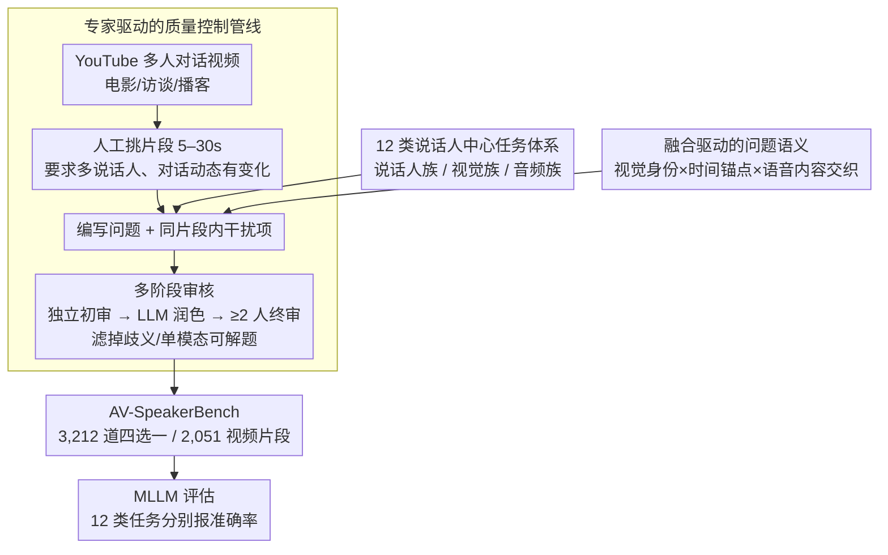

# See, Hear, and Understand: Benchmarking Audiovisual Human Speech Understanding in Multimodal Large Language Models

**会议**: CVPR 2026  
**arXiv**: [2512.02231](https://arxiv.org/abs/2512.02231)  
**代码**: [https://plnguyen2908.github.io/AV-SpeakerBench-project-page/](https://plnguyen2908.github.io/AV-SpeakerBench-project-page/)  
**领域**: 多模态VLM / 音视频理解  
**关键词**: 多模态基准, 说话人中心推理, 音视频融合, 大语言模型评估, 视听理解

## 一句话总结

提出 AV-SpeakerBench 基准，包含 3,212 道以说话人为中心的音视频推理多选题，系统评估多模态大语言模型在"谁在说话、说了什么、何时说的"上的细粒度音视频融合能力，揭示当前最强模型与人类表现仍有超 20% 的差距。

## 研究背景与动机

多模态大语言模型（MLLM）正从图像-文本扩展到音频-视频-语言的统一理解，但现有视频基准存在严重缺陷：大多数问题仅靠视觉就能回答（如"视频中有几个人？"），几乎不需要音频信息。即使少数包含音频的基准也仅停留在粗粒度的声音事件分类层面（如"男声/女声"），无法评估模型是否真正理解了**谁在说什么**。

说话人感知（audiovisual speaker perception）是长期研究问题，涉及说话人检测、识别和语音定位。但现有数据集基于闭集标签或帧级标注，与 MLLM 的开放式语言评估不兼容。

核心问题：**当前 MLLM 能否将视觉中看到的人与听到的语音精确关联？** 这需要跨模态的时序推理——不仅要识别说话人的外貌和声音，还要在时间轴上对齐"谁在什么时候说了什么"。

AV-SpeakerBench 的三个设计原则：(1) 以说话人为核心推理单元（而非场景）；(2) 融合驱动的问题设计——将音视频依赖嵌入问题语义本身；(3) 专家手工标注确保时序精度和跨模态有效性。

## 方法详解

### 整体框架

AV-SpeakerBench 是一个包含 3,212 道四选一多选题的评估基准，覆盖 2,051 个视频片段（5-30 秒）和 12 种任务类型。它的构建是一条"设计原则 + 人工管线"协同的流水线：先按**说话人中心的 12 类任务体系**框定要考什么、按**融合驱动的问题语义**约束怎么出题，再由**专家驱动的质量控制管线**实际从 YouTube 多人对话视频里挑片段、编写问题与干扰项、多轮审核，最终产出基准并用于 MLLM 评估。三大设计分别对应"考什么 / 怎么写 / 如何把关"，互相咬合。

### 关键设计

**1. 说话人中心的 12 类任务体系：把"谁在说话"拆成可测的维度**

旧基准的问题要么只问场景（"视频里有几个人"），要么粗粒度地分类声音（"男声还是女声"），都绕开了说话人级别的细粒度推理。AV-SpeakerBench 改以单个说话人为推理单元，把能力拆成三大族、共 12 类任务：说话人族关注检测、识别与计数（如"穿黑色 T 恤的人什么时候说了'怎么了'？"）；视觉族考视觉属性、活动与计数，但答案要靠音频锁定到具体说话人；音频族问持续时间、音高、语速、强度和语音计数，又必须借视觉确认说话人是谁。这样一来，从识别、计数到时序定位的多个维度都被覆盖，且每一类都被刻意设计成单看一个模态无法作答。

**2. 融合驱动的问题语义：把跨模态依赖写进题面本身**

光在视频里加音频不够——只要问题是"视频里说了什么"，一段语音转录加 LLM 就能蒙对，音频和视觉其实没真正绑在一起。这里的做法是把音视频依赖直接编码进问题文本和选项：一是用可见身份锚定口头短语（"穿灰衬衫的人说完后……"），二是用视觉事件定位语音（"她喝水前说了什么？"）或反过来用语音定位视觉（"他说'我们不酷'时有几个人可见？"），三是在多说话人场景里做综合推理（"灰衬衫男人摇手指后到视频结束，'红线'被所有人提到了几次？"）。视觉身份、时间锚点和语音内容被交织在同一道题里，模型只有真正完成跨模态对齐才能答对，单模态捷径直接失效。

**3. 专家驱动的质量控制管线：用多轮人工审核守住"必须融合"这条底线**

众包标注很难保证每道题都真的要求跨模态推理，于是标注全部交给经验丰富的研究人员，分三步走：先从完整视频中挑出满足任务要求的 5–30 秒片段（要求多说话人、对话动态有意义），再依据详细任务指南编写问题和干扰项（干扰项取自同一片段里的实体、动作或语音事件，保证迷惑性），最后经多阶段审核——独立研究员初审、语言模型润色、至少两名额外研究员终审，把歧义、前后不一致以及任何能靠单模态解出的题目筛掉。成本虽高，但换来了时序精度和"每题都需音视频融合"的有效性。

### 损失函数 / 训练策略

AV-SpeakerBench 是纯评估基准，不涉及模型训练。评估采用多选题准确率，在 12 种任务类型上分别报告。

## 实验关键数据

### 主实验

| 模型 | 参数量 | 总体准确率 | vs 人类 (93.74%) |
|------|--------|-----------|-----------------|
| **Gemini 2.5 Pro (Thinking)** | - | **73.04** | -20.70 |
| Gemini 2.5 Flash (Thinking) | - | 67.84 | -25.90 |
| Gemini 2.0 Flash | - | 53.21 | -40.53 |
| **Qwen3-Omni** | 30B | **54.14** | -39.60 |
| Qwen2.5-Omni | 7B | 46.64 | -47.10 |
| Phi-4 Multimodal | 5.6B | 38.45 | -55.29 |
| VITA-1.5 | 7B | 36.27 | -57.47 |
| Video-LLaMA2 | 7B | 37.67 | -56.07 |
| PandaGPT | 7B | 22.88 | -70.86 |

### 消融实验（模态消融）

| 模型 | 仅视觉 | 音+视 | 音频增益 | 说明 |
|------|--------|-------|---------|------|
| Gemini 2.5 Pro | ~60% | 73.04 | **+10-20%** | 持续从音频获益 |
| Qwen3-Omni 30B | ~52% | 54.14 | **+2% 甚至负** | 音视频融合较弱 |

### 关键发现

- 人类准确率 93.74%，最强模型 73.04%，差距超 20pp——说话人中心的音视频推理仍是核心难题
- Gemini 2.5 Pro 的优势主要来自更强的音视频融合能力（音频一致带来 10-20% 增益），而非视觉感知
- Qwen3-Omni 30B 已接近 Gemini 2.0 Flash，但加入音频后提升有限甚至为负——开源模型的融合能力是瓶颈
- 错误分析显示音频感知和时序推理是失败的主要来源
- 早期开源模型（Video-LLaMA、PandaGPT、Unified-IO 2）表现接近随机猜测，尽管声称支持音视频

## 亮点与洞察

- **基准设计哲学值得学习**：不是简单地标注问答对，而是将跨模态依赖"硬编码"在问题语义中，使得单模态捷径无法生效。这种"融合驱动设计"可推广到其他多模态基准
- **模态消融揭示本质差距**：Gemini vs Qwen 的差距不在视觉感知而在融合能力，这一发现对开源社区有明确的改进方向指导
- **12 类任务的细粒度分解**：从检测/识别到音高/语速的多维度评估，比笼统的"音视频理解"分数更有诊断价值

## 局限与展望

- 仅评估多选题准确率，未覆盖开放式回答、对话等更自然的交互形式
- 视频来源以英语为主，跨语言泛化性未测试
- 部分任务（如音高比较）在实际应用中需求较小
- 数据量 3,212 题对于训练不够，仅作为评估用途
- 未分析模型是否通过唇读（lip reading）而非真正听到音频来回答

## 相关工作与启发

- **vs Video-MME**: 900 视频/2,700 题但大多可视觉单独解答；AV-SpeakerBench 强制音视频融合
- **vs AVQA**: 评估音视频匹配但不以说话人为中心，且为非语音声音事件
- **vs WorldSense**: 涉及音视频但聚焦场景级理解（音乐风格、声音摘要），非说话人级推理

## 评分

- 新颖性: ⭐⭐⭐⭐⭐ 首个系统评估说话人中心音视频推理的基准，填补了重要空白
- 实验充分度: ⭐⭐⭐⭐⭐ 覆盖 6 个 Gemini 版本 + 12 个开源模型，模态消融和错误分析深入
- 写作质量: ⭐⭐⭐⭐⭐ 设计原则阐述清晰，任务示例直观
- 价值: ⭐⭐⭐⭐⭐ 揭示了当前 MLLM 音视频融合的核心瓶颈，对社区有明确指导意义

<!-- RELATED:START -->

## 相关论文

- [\[ACL 2026\] "I See What You Did There": Can Large Vision-Language Models Understand Multimodal Puns?](../../ACL2026/multimodal_vlm/i_see_what_you_did_there_can_large_vision-language_models_understand_multimodal_.md)
- [\[CVPR 2026\] Venus: Benchmarking and Empowering Multimodal Large Language Models for Aesthetic Guidance and Cropping](venus_benchmarking_and_empowering_multimodal_large_language_models_for_aesthetic.md)
- [\[CVPR 2026\] GraphVLM: Benchmarking Vision Language Models for Multimodal Graph Learning](graphvlm_benchmark_vlm_graph_learning.md)
- [\[CVPR 2026\] HumanVBench: Probing Human-Centric Video Understanding in MLLMs with Automatically Synthesized Benchmarks](humanvbench_probing_human_centric_video_understanding_in_mllms_with_automatica.md)
- [\[ACL 2025\] Can Multimodal Large Language Models Understand Spatial Relations?](../../ACL2025/multimodal_vlm/spatialmqa_mllm_spatial_relations.md)

<!-- RELATED:END -->
