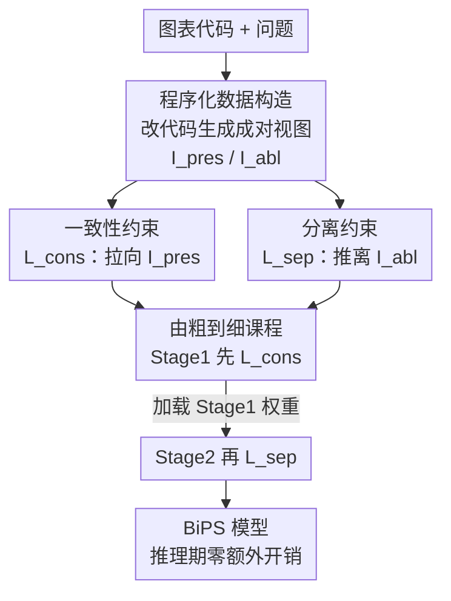

# See Less, See Right: Bi-directional Perceptual Shaping For Multimodal Reasoning

**会议**: CVPR 2026  
**论文**: [CVF Open Access](https://openaccess.thecvf.com/content/CVPR2026/html/Zhang_See_Less_See_Right_Bi-directional_Perceptual_Shaping_For_Multimodal_Reasoning_CVPR_2026_paper.html)  
**代码**: https://github.com/zss02/BiPS  
**领域**: 多模态VLM  
**关键词**: 视觉语言模型, 强化学习, 感知塑形, KL 约束, 图表理解

## 一句话总结
BiPS 把"该看哪里"的视觉线索从推理期的工具/隐 token 搬到训练期，用一对 KL 约束（向"只留证据"的图靠拢、和"抹掉证据"的图拉开）在 GRPO 框架里塑造 VLM 的感知策略，仅用 13K 图表样本就让 Qwen2.5-VL-7B 在八个 benchmark 上平均涨 7.3%（加 39K 数学数据涨到 8.2%），且推理期零额外开销。

## 研究背景与动机

**领域现状**：视觉语言模型（VLM）做视觉问答（VQA）时，常常需要中间视觉线索来"指明该看哪"。主流做法有两条：一是推理期调外部工具（裁剪、mask、分割）产生证据聚焦的中间图；二是训练模型在推理时吐出"视觉思维链"——bounding box、工具调用轨迹、隐式视觉 token。

**现有痛点**：这两条路都把视觉线索当成**推理期的拐杖**，带来三个具体问题。其一**形状僵硬**：聚焦区域多是矩形裁剪或粗 mask，抓不住不规则证据——图表里细细的折线和交点、医学图像的病灶轮廓、几何图的非凸多边形都会漏掉。其二**场景绑死**：定制工具和"教模型吐特定 token"的训练流水线都和具体版式/领域强耦合，换个数据集就泛化不动。其三**推理开销**：无论外部工具还是学到的视觉提示，推理期生成中间线索都要多走几步、多算一遍，还放大了级联误差的风险。

**核心矛盾**：把视觉线索放在推理期，就注定要在"线索质量"和"推理成本/泛化性"之间反复纠结——线索越精细，工具越专用、越慢、越不通用。

**本文目标**：让模型把"看正确的细粒度证据"这件事**内化进权重**，推理时不再需要任何额外的工具、parser 或视觉 token。

**切入角度**：作者的观察是——既然图表是用代码渲染出来的，每个元素（marks/axes/legend）都有明确的代码出处，那就可以在代码层"动手术"，程序化地生成两种**完美的、ground-truth 级别**的视觉视图：一种只保留回答问题所需的证据，一种恰好抹掉关键证据。这些视图不当推理期拐杖用，而是当**训练信号**用。

**核心 idea**：用一对方向相反的 KL 约束塑造策略——把模型在原图上的预测**拉向**"只留证据"的视图（学会该看哪），同时**推开**"抹掉证据"的视图（逼它真的依赖视觉、而非文字捷径），即 Bi-directional Perceptual Shaping（BiPS）。

## 方法详解

### 整体框架

BiPS 是一套嫁接在 GRPO 之上的**两阶段训练课程**，核心是用程序化生成的成对视图去"双向塑形"VLM 的感知策略，整个机制全部发生在训练期，推理时模型就是一个普通的 Qwen2.5-VL，不需要任何额外步骤。

整条管线分三块：先有一个**程序化数据构造 pipeline**，对每张图表的渲染代码动手术，产出 $(I, q, I_{pres}, I_{abl})$ 四元组——原图、问题、只留证据的视图、抹掉证据的视图；然后是**双向 KL 约束**，一个一致性项把原图策略拉向 $I_{pres}$，一个分离项把原图策略推离 $I_{abl}$；最后用**由粗到细的两阶段课程**把两个目标拆开训，先建立"该看哪"的粗粒度焦点，再加"必须依赖视觉"的细粒度约束。

### 关键设计

**1. 程序化数据构造 pipeline：在代码层动手术，造出像素级精确的成对视图**

要双向塑形，先得有"该看哪/不该看哪"的精确监督，也就是每个 `(图, 问)` 配一张证据保留视图和一张证据抹除视图。常见的像素级 mask/裁剪太粗、形状受限（矩形抓不住折线）。BiPS 的关键观察是：图表是代码渲染的，每个对象都有明确代码出处，于是把"动手术"从像素层挪到**代码层**。基于 ECD 这个带可执行渲染代码的多面板图表语料，pipeline 走三步：(i) **问题重构与校验**——原始问题是开放式、难以规则化验证的，用 GPT5-mini 这个 LLM 仲裁者（喂给它图表源码和元数据）把问题改写成多选题，保证可验证且正确答案唯一，适配下游 RLVR 训练；(ii) **难度过滤**——对每个问题用 base 模型（Qwen2.5-VL-7B-Instruct）跑 8 次 rollout，8 次全对的"太简单"题直接丢弃，让训练聚焦难样本；(iii) **代码编辑与渲染**——证据保留视图 $I_{pres}$ 是删掉与问题无关的代码段后重新渲染，只剩必要视觉元素；证据抹除视图 $I_{abl}$ 是定位并删掉提供关键证据的代码段，但保留坐标轴、图例、布局等全局上下文。这样产出 13K 高质量样本，监督是语义精确且天然对齐的——这是后面消融里"程序化编辑 49.4 vs 随机 mask 44.8"差距的根源。

**2. 一致性约束 $L_{cons}$：把原图策略拉向"只留证据"的视图，学会粗粒度聚焦**

针对"被无关信息干扰、抓不住正确区域"的痛点。一致性约束要求模型在原图 $I$ 上的策略与在证据保留视图 $I_{pres}$ 上的策略保持一致，通过**最小化** KL 散度实现：

$$L_{cons} = \mathbb{E}_{(I,q,r)}\Big[\mathbb{I}(r{=}1)\min\big(c_{cons},\ D_{KL}(\pi_\theta(\cdot|I,q)\,\|\,\mathrm{sg}[\tilde\pi_\theta(\cdot|I_{pres},q)])\big)\Big]$$

其中 $\pi_\theta$ 是模型在原图上的答案分布，$\tilde\pi_\theta$ 是在保留视图上算的目标分布，$\mathrm{sg}[\cdot]$ 表示 stop-gradient（让 $I_{pres}$ 分支当固定靶子），$\mathbb{I}(r{=}1)$ 把监督限制在验证正确的样本上，$c_{cons}$ 对 KL 项做截断以保证稳定。前向 KL $D_{KL}(\pi_\theta\|\tilde\pi_\theta)$ 把原图上的概率质量往"有证据支撑的答案"上拽，等于在告诉模型：把无关区域当冗余、决策要落在被保留的证据上。这一步建立的是"看哪里"的粗粒度焦点。

**3. 分离约束 $L_{sep}$：把原图策略推离"抹掉证据"的视图，掐断文字捷径**

光有一致性不够——模型可能靠周围 OCR 文字或语言先验，在原图和保留视图上给出相同答案来"满足" $L_{cons}$，却根本没看细粒度的曲线，这就是 shortcut learning。分离约束作为正则项，强制模型在原图 $I$ 上的策略必须与证据抹除视图 $I_{abl}$ 上的策略**发散**，通过**最大化** KL 散度实现：

$$L_{sep} = \mathbb{E}_{(I,q)}\Big[\min\big(c_{sep},\ D_{KL}(\pi_\theta(\cdot|I,q)\,\|\,\mathrm{sg}[\tilde\pi_\theta(\cdot|I_{abl},q)])\big)\Big]$$

$c_{sep}$ 是截断超参，目标会一直惩罚两个策略的相似性，直到散度超过 $c_{sep}$ 为止。由于 $I_{abl}$ 抹掉了关键证据、只留全局上下文，逼模型在原图和"无证据图"上给出不同答案，本质上就是断了"只看文字也能蒙对"的退路，强制细粒度视觉依赖。这正是 BiPS 名字里"See Right"的来源——不光看得少（聚焦），还得看得对（真的依赖证据）。

**4. 由粗到细的两阶段课程：拆开两个相互冲突的目标，先聚焦再 grounding**

$L_{cons}$ 是吸引力、$L_{sep}$ 是排斥力，同时优化两者梯度方向可能打架。BiPS 因此把它们解耦成先后两阶段课程，底座是标准 GRPO 目标 $L_{GRPO}$（用组内 rollout 归一化的 group-relative advantage $A_t$ 稳定训练）。**Stage 1（一致性阶段）**：$L_{Stage1} = L_{GRPO} + \alpha L_{cons}$，在 7K 含 $I_{pres}$ 的样本上训 5 epoch，先把"该聚焦哪"这个粗粒度技能建起来。**Stage 2（分离阶段）**：加载 Stage 1 权重后，$L_{Stage2} = L_{GRPO} - \beta L_{sep}$，在 13K 含 $I_{abl}$ 的样本上训 3 epoch，让已学到的焦点变得稳健、真正 visually grounded。消融证明这个顺序很关键：先建立稳定的证据对齐策略、再施加 grounding 约束，比联合训练或反序（先 $L_{sep}$ 后 $L_{cons}$）都好——过早施加 grounding 会在焦点还没立稳时强行制造发散，导致收敛更慢更不稳。$\alpha=0.01$、$\beta=0.02$、$c_{cons}=1.0$、$c_{sep}=0.2$。

### 损失函数 / 训练策略
- 底座目标：$L_{GRPO} = -\mathbb{E}\big[\min(r_t(\theta)A_t, \mathrm{clip}(r_t(\theta),1-\epsilon,1+\epsilon)A_t) - \gamma D_{KL}(\pi_\theta\|\pi_{ref})\big]$。
- 课程：Stage 1（5 epoch / 7K，$+\alpha L_{cons}$）→ Stage 2（3 epoch / 13K，$-\beta L_{sep}$）得到 BiPS-Chart；再用标准 GRPO 在 39K 数学样本（ViRL39k）上微调 3 epoch 得到 BiPS-General。
- 优化：AdamW，lr $=1\times10^{-6}$，8×H100。

## 实验关键数据

### 主实验
base 模型 Qwen2.5-VL-7B，八个 benchmark（图表理解 + 通用感知推理）平均准确率：

| 模型 | 训练数据量 | CharXiv | Evochart | MathVista | MMStar | 八项平均 |
|------|-----------|---------|----------|-----------|--------|---------|
| Qwen2.5-VL-7B（base） | - | 42.5 | 52.0 | 68.2 | 62.1 | 44.3 |
| DeepEyes-7B | 14K+33K | 42.9 | 65.6 | 70.8 | 63.0 | 47.5 |
| Chart-R1-7B | 258K | 46.2 | 64.7 | 67.5 | 61.1 | 45.5 |
| **BiPS-Chart-7B** | **13K** | 49.4 | 68.2 | 73.5 | 64.9 | **51.6 (+7.3)** |
| **BiPS-General-7B** | 13K+39K | 50.6 | 68.7 | 75.0 | 65.7 | **52.5 (+8.2)** |

关键看点：BiPS-Chart 只用 **13K** 图表样本就超过用几十万到上百万样本训练的 Chart-R1、BigCharts-R1、TinyChart，数据效率极高；而且只在图表数据上训，却在没见过的通用推理任务（MathVista +5.3、MMStar +2.8）上同样涨点，OOD 泛化很强。

### 消融实验

双向约束逐项拆解（在 GRPO baseline 上叠加）：

| 配置 | CharXiv | ECD | ChartMuseum | 说明 |
|------|---------|-----|-------------|------|
| Qwen2.5-VL-7B | 42.5 | 19.0 | 26.0 | base |
| GRPO | 44.3 | 35.6 | 30.8 | 纯 RL baseline |
| GRPO + $L_{cons}$ | 47.2 | 36.3 | 31.3 | 只加一致性，CharXiv +2.9 |
| GRPO + $L_{sep}$ | 47.7 | 38.3 | 31.8 | 只加分离，ECD +2.7 / CharXiv +3.4 |
| **Ours（两者）** | **49.4** | **39.9** | **33.5** | 两阶段协同最优 |

训练课程顺序 + 数据构造策略：

| 对比维度 | 配置 | CharXiv | ECD | ChartMuseum |
|---------|------|---------|-----|-------------|
| 课程顺序 | Joint Training（同时优化） | 46.4 | 36.7 | 31.5 |
| 课程顺序 | Reversed（先 $L_{sep}$ 后 $L_{cons}$） | 46.8 | 39.2 | 31.3 |
| 课程顺序 | **Ours（由粗到细）** | **49.4** | **39.9** | **33.5** |
| 视图生成 | Random Masking（随机抹 60% patch） | 44.8 | 37.6 | 31.8 |
| 视图生成 | **Ours（程序化代码编辑）** | **49.4** | **39.9** | **33.5** |

### 关键发现
- 两个约束各有侧重也互补：$L_{cons}$ 主要拉高 CharXiv（粗粒度聚焦），$L_{sep}$ 在 ECD / CharXiv 上提升更大（细粒度 grounding、抑制捷径），合起来才到最优——粗聚焦和细 grounding 协同。
- 由粗到细的顺序不可换：反序会在焦点未立稳时过早正则化，CharXiv 从 49.4 掉到 46.8；联合训练因梯度方向冲突表现最差。
- 程序化编辑 vs 随机 mask 差距显著（CharXiv 49.4 vs 44.8）：随机抹 patch 造不出"干净的干扰视图"，$L_{sep}$ 算在脏视图上就失效，印证了语义忠实的成对视图是双向约束生效的前提。
- 案例分析显示，base 模型常把图表数值读错（如把 94.0% 看成 94.6%、把不相交的曲线数错），BiPS 因为被逼着依赖细粒度视觉证据，读数和计数都更准。

## 亮点与洞察
- **把推理期拐杖变成训练期信号**：最"啊哈"的地方是视角翻转——别人用视觉线索当推理时的工具，BiPS 用同样的线索去塑造策略，于是推理期零额外开销却把感知能力内化进权重。这个思路可迁移到任何"推理期靠外部提示"的范式。
- **代码层动手术造监督**：利用"图表由代码渲染、每个元素有代码出处"这一结构特性，在代码层精确增删元素，绕开了像素 mask 形状受限的死结，产出像素级精确的成对视图，且全程无需人工标注。
- **正负双向 KL 的对称设计**：一个最小化（拉向证据）、一个最大化（推离无证据），用对称的力学结构同时解决"看哪里"和"是否真的在看"，比单向引导或单纯加噪声扰动（ChiP/PAPO）更能逼出细粒度依赖。
- **数据效率惊人**：13K 样本超过百万级训练的专用模型，说明"提升核心感知"比"灌更多任务数据"更划算，这对资源受限的微调场景很有启发。

## 局限与展望
- 数据 pipeline 强依赖**可执行渲染代码**：图表能拿到 ECD 这种带源码的语料，但自然图像、医学图像没有"渲染代码"，证据保留/抹除视图怎么程序化生成是开放问题（作者也只在图表域实例化）。
- 依赖 GPT5-mini 当 LLM 仲裁者做问题重构和代码编辑，pipeline 质量受这个闭源模型能力上限制约，且把开放式问题转成多选题可能损失一部分推理形态的多样性。⚠️ 仲裁者的具体 prompt 与失败率未在正文给出。
- 实验主要围绕图表 + 数学 VQA，虽展示了 OOD 泛化，但在自然场景密集 VQA、视频等更远域上的有效性未验证。
- $\alpha/\beta/c_{cons}/c_{sep}$ 四个超参需要调（Fig.4 显示对 $\alpha,\beta$ 有敏感性），换 base 模型或数据域可能要重新搜参。

## 相关工作与启发
- **vs 外部工具 / 视觉 CoT（DeepEyes、Chart-R1 等）**：他们在推理期生成 box/mask/轨迹并让模型复现，BiPS 把这些线索只用在训练期塑形，区别在于推理零开销 + 不绑定任务版式；优势是泛化和效率，代价是训练阶段要先有程序化造视图的能力。
- **vs ChiP / PAPO（注噪声/随机 mask 的负扰动）**：两者也想破文字捷径，但用随机噪声/随机 mask 当负样本，忽略了图内有信息量的细节信号；BiPS 用语义精确的证据抹除视图，负空间更干净，因此 grounding 更强（消融里程序化编辑显著优于随机 mask）。
- **vs 隐式 latent 推理方法**：有工作让模型走内部隐过程、去掉显式中间图，但仍绑死在特定任务上；BiPS 通过塑造感知策略实现跨域泛化。

## 评分
- 新颖性: ⭐⭐⭐⭐⭐ "推理期线索→训练期信号 + 代码层造成对视图 + 双向 KL"组合视角新颖且自洽。
- 实验充分度: ⭐⭐⭐⭐ 八 benchmark + 三组消融 + 案例分析较扎实，但局限在图表/数学域、未触及更远的自然图像。
- 写作质量: ⭐⭐⭐⭐⭐ 动机—方法—消融逻辑清晰，公式与课程设计交代到位。
- 价值: ⭐⭐⭐⭐⭐ 13K 样本超百万级专用模型、推理零开销，数据效率和落地性都很高。

<!-- RELATED:START -->

## 相关论文

- [\[CVPR 2026\] See Further, Think Deeper: Advancing VLM's Reasoning Ability with Low-level Visual Cues and Reflection](see_further_think_deeper_advancing_vlms_reasoning_ability_with_low-level_visual_.md)
- [\[CVPR 2026\] Perceptual-Evidence Anchored Reinforced Learning for Multimodal Reasoning](perceptual-evidence_anchored_reinforced_learning_for_multimodal_reasoning.md)
- [\[CVPR 2026\] Noise-Aware Few-Shot Learning through Bi-directional Multi-View Prompt Alignment](noise-aware_few-shot_learning_through_bi-directional_multi-view_prompt_alignment.md)
- [\[CVPR 2026\] Aligning What Vision-Language Models See and Perceive with Adaptive Information Flow](aif_adaptive_information_flow_vlm.md)
- [\[CVPR 2026\] ROSE: Rotate Your Large Language Model to See](rose_rotate_your_large_language_model_to_see.md)

<!-- RELATED:END -->
