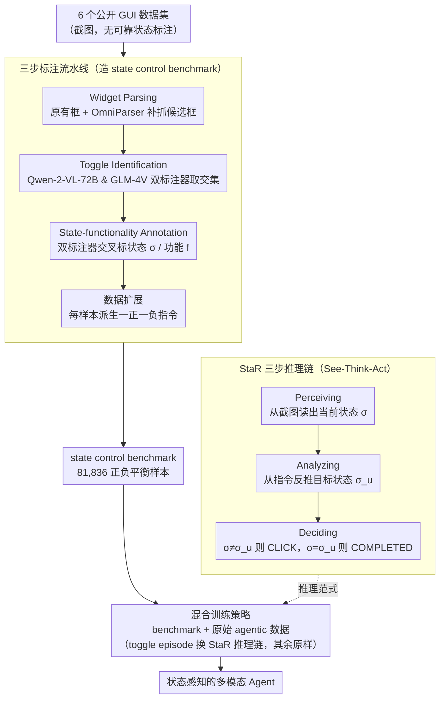

# See, Think, Act: Teaching Multimodal Agents to Effectively Interact with GUI by Identifying Toggles

**会议**: CVPR 2026  
**arXiv**: [2509.13615](https://arxiv.org/abs/2509.13615)  
**代码**: [有](https://github.com/ZrW00/StaR)  
**领域**: 多模态VLM  
**关键词**: GUI Agent, Toggle Control, 多模态推理, 状态感知, State-aware Reasoning  

## 一句话总结

提出 State-aware Reasoning (StaR)，通过教会多模态 Agent "感知当前状态→分析目标状态→决定是否操作"的三步推理链，将 GUI 开关控制准确率提升超 30%，同时不损害通用 Agent 任务性能。

## 研究背景与动机

### 1. 领域现状

多模态 Agent（如 AppAgent、UI-TARS、Mobile-Agent 等）利用多模态大语言模型（MLLM）直接感知 GUI 截图并执行类人操作，已在 GUI 交互领域取得显著进展。这些 Agent 无需依赖 API，可作为灵活可靠的人机交互助手。

### 2. 痛点

**Toggle 控件（开关/切换按钮/复选框）是 GUI 中无处不在的基本交互元素**，广泛存在于手机设置、车载系统、智能家居和工业控制等场景。然而，现有 Agent 在执行 toggle 指令时极不可靠——作者构建基准测试后发现，包括 GPT-5 在内的大多数 Agent 执行准确率低于 50%。

### 3. 核心矛盾

Agent 存在强烈的"点击偏向"（toggling bias）：
- **假阳性 (False Positive)**：当前状态已满足目标，Agent 仍去点击切换
- **假阴性 (False Negative)**：当前状态不满足目标，Agent 却未执行切换

本质原因是 Agent 缺乏对 toggle 当前状态的感知与推理能力，总是倾向于预测 CLICK，而不会先判断"是否需要操作"。

### 4. 要解决什么

提升多模态 Agent 的内在推理能力，使其能准确感知、推理和执行 toggle 控制指令。

### 5. 切入角度

分析现有两种直觉方案的不足：(a) Prompt engineering 无法从根本上增强推理；(b) 引入额外标注器（multi-agent 协作）存在悖论——若标注器自身不可靠则无意义，若可靠则不如直接用标注器。因此需要一种能提升 Agent 自身推理能力的方法。

### 6. 核心 Idea

模拟人类执行 toggle 指令的认知过程：先看当前状态 → 再理解指令要求的目标状态 → 最后比较决定是否操作。将这种"See-Think-Act"的三步推理通过训练内化到 Agent 中。

## 方法详解

### 整体框架

这篇论文要解决的是一个被长期忽视的具体毛病：多模态 Agent 面对 toggle（开关、复选框）时几乎不看当前状态，张口就预测 CLICK。StaR（State-aware Reasoning）的思路是把"先看状态、再想目标、最后决定动不动"这条人类直觉显式塞进 Agent 的推理链，并用训练把它内化下来。

整体跑通要先后做两件事。第一件是造数据：手上没有带可靠状态标注的 toggle 数据，于是作者从 6 个公开数据集出发，用一条三步标注流水线把它们清洗、识别、扩展成一个 81,836 样本的 state control benchmark。第二件是训练：在这个 benchmark 上让 Agent 学会 StaR 的三步推理，同时把 Agent 原有训练集里凡是涉及 toggle 的 episode 的推理链替换成 StaR 风格、其余 episode 原样保留，从而既注入新能力又不破坏旧能力。

### 关键设计

**1. 三步标注流水线：从没有状态标注的截图里，造出可靠的 toggle 基准**

要训练 Agent "看状态"，前提是数据里得有干净的状态标签，可公开数据集普遍缺乏可靠的 XML 树来抽取 toggle 是开还是关，只能自己标。作者把标注拆成三步顺次过滤：先做 Widget Parsing，从截图里取出原有的 widget bounding box，再用 OmniParser 补抓额外的可点击元素，合并成统一的候选框集合；再做 Toggle Identification，让 Qwen-2-VL-72B 和 GLM-4V 两个标注器各自独立判断哪些框是 toggle，只有两者一致认定的才保留；最后做 State-functionality Annotation，同样由这两个标注器独立标出每个 toggle 的状态（on/off）和功能描述，再用交叉一致性过滤掉分歧样本。

之所以坚持双标注器交叉验证，是为了抵消单一模型的系统性偏差——这一点有人工抽检背书：随机验证 200 个样本，状态标注准确率 91%、功能标注 92.5%。过滤完还要做数据扩展，把每个样本 $\langle s, b, \sigma, f \rangle$（截图、框、状态、功能）派生成一正一负两条指令：若某 toggle 当前 $\sigma=1$（已开启），就生成"关闭 $f$"对应 CLICK、"开启 $f$"对应 COMPLETED 两条，逼着模型必须看状态才能答对。最终得到 81,836 个正负平衡的样本（73,652 训练 + 8,184 测试）。

**2. StaR 三步推理链：把"看状态—想目标—再决定"显式写进推理过程**

现有 Agent 的推理是 Thought→Action 的直筒结构，中间从不显式确认 toggle 当下是开是关，于是无脑预测 CLICK。StaR 把这一步拆开、按人类认知顺序补上：Perceiving 阶段引导 Agent 从截图里读出当前状态 $\sigma$，把视觉特征和细粒度的开关状态绑定；Analyzing 阶段从用户指令反推目标状态 $\sigma_u$（正向指令意味着 $\sigma_u \neq \sigma$，负向指令意味着 $\sigma_u = \sigma$）；Deciding 阶段拿 $\sigma$ 和 $\sigma_u$ 一比，只有不相等时才输出 CLICK，相等就直接标 COMPLETED，从源头掐掉"已满足还去点"的假阳性。

举个具体的：屏幕上 WiFi 开关当前是关的（$\sigma=0$），指令是"关闭 WiFi"。直筒推理的 Agent 看到"关闭"+"开关"就倾向点一下，反而把它打开了；StaR 则先感知出 $\sigma=0$、再分析出目标也是 $\sigma_u=0$，两者相等于是判定 COMPLETED、不动手。关键在于这条推理链不能靠提示词临时叮嘱——后面实验会看到，光在 prompt 里要求"注意 toggle 状态"收益很小，必须通过训练把这三步固化成 Agent 的默认行为。

**3. 混合训练策略：在注入 toggle 推理的同时，不让通用任务退化**

只在 toggle benchmark 上训练有灾难性遗忘的风险——Agent 可能学会盯状态，却把原本会做的长链 GUI 任务忘了。作者的做法是联合训练，并且对原始 agentic benchmark 做精细的"只换推理链、不加新数据"处理：在 AndroidControl、AITZ、GUI-Odyssey 这些数据里，凡涉及 toggle 的 episode 就把它的推理链改写成 StaR 风格，其余 episode 的推理原封不动。

这样设计的巧妙之处在于，这几个 benchmark 本就是目标 Agent 原始训练集的组成部分，替换而非追加意味着不引入分布外的新样本，Agent 学到的是"在 toggle 场景自动切到三步推理、在别的场景保持老路子"，从而把新能力精准注入到该用的地方，而不是覆盖式重训。

### 损失函数 / 训练策略

- 使用 LLaMA-Factory 框架进行微调
- 学习率 $5 \times 10^{-6}$，训练 3 个 epoch
- 使用 FlashAttention 加速
- Click 坐标归一化到 $[0, 1000]$
- 在 4 个不同架构的 Agent（OS-Atlas-7B、UI-TARS-7B、AgentCPM-GUI-8B、GUI-Owl-7B）上分别训练验证

## 实验关键数据

### 主实验一：State Control Benchmark 上的表现

| 模型 | 设置 | O-TMR↑ | O-AMR↑ | P-AMR↑ | N-AMR↑ | N-FPTR↓ | N-FPR↓ |
|------|------|--------|--------|--------|--------|---------|--------|
| OS-Atlas-7B | Zero-shot | 67.16 | 43.95 | 52.10 | 35.80 | 64.10 | 28.67 |
| OS-Atlas-7B | StaR Prompting | 73.52 | 50.07 | 49.88 | 50.27 | 49.62 | 22.21 |
| OS-Atlas-7B | **StaR Training** | **96.13** | **79.72** | **62.95** | **96.48** | **3.52** | **1.52** |
| UI-TARS-7B | Zero-shot | 67.14 | 47.45 | 54.94 | 39.96 | 48.29 | 17.62 |
| UI-TARS-7B | **StaR Training** | **95.82** | **77.86** | **59.19** | **96.53** | **3.45** | **1.34** |
| AgentCPM-GUI-8B | Zero-shot | 81.74 | 64.08 | 60.04 | 68.11 | 30.69 | 11.07 |
| AgentCPM-GUI-8B | **StaR Training** | **95.98** | **79.00** | **60.53** | **97.46** | **2.54** | **0.95** |
| GUI-Owl-7B | Zero-shot | 76.58 | 53.57 | 48.97 | 58.16 | 39.15 | 14.66 |
| GUI-Owl-7B | **StaR Training** | **95.99** | **77.60** | **58.87** | **96.33** | **3.67** | **1.56** |

**关键结论**：StaR 训练在 O-AMR 上分别提升 +35.77%（OS-Atlas）、+30.41%（UI-TARS）、+14.92%（AgentCPM）、+24.03%（GUI-Owl）。训练后的 7B 模型超越了 zero-shot 的 Qwen-2-VL-72B（O-AMR 66.42%），弥合了模型规模差距。

### 主实验二：动态环境评估

| 模型 | 无 StaR | 有 StaR |
|------|---------|---------|
| UI-TARS-7B | 35 (7/20) | 40 (8/20) |
| OS-Atlas-7B | 10 (2/20) | **55 (11/20)** |
| AgentCPM-GUI-8B | 20 (4/20) | 42.5 (8.5/20) |

**关键结论**：在 AndroidWorld 框架下的真实动态环境中，StaR 一致性提升任务成功率。OS-Atlas-7B 从 10% 跃升至 55%，印证了 StaR 对弱推理 Agent 改造效果最显著。

### 消融实验

- **StaR-style Prompting vs. StaR Training**：仅 prompting 效果有限（如 OS-Atlas O-AMR 仅提升 6.12%），而训练提升 35.77%，证明结构化推理必须通过训练学习
- **Prompt Engineering baseline**（Section 3.2）：简单提示关注 toggle 状态对 UI-TARS 和 GUI-Owl 略有改善，但对 AgentCPM 几乎无效
- **跨架构泛化**：四种不同架构和历史建模策略的 Agent 均受益，验证了 StaR 的模型无关性

### 关键发现

1. **所有现有 Agent 存在强烈的点击偏向**：低 P-FNR + 高 N-FPTR + 非零 N-FPR，表明 Agent 倾向于无条件预测 CLICK
2. **通用专有模型 grounding 能力差**：GPT-5/GPT-4o/Gemini 2.5 Pro 的 P-TMR 接近 100% 但 P-AMR 仅约 20%
3. **StaR 最大收益来自弱推理模型**：OS-Atlas-7B 起点最低但提升最大（O-AMR +35.77%，动态环境 10%→55%），说明 StaR 能有效重塑推理能力
4. **通用 Agent 任务不受损**：在 AndroidControl、AITZ、GUI-Odyssey 上一致保持或超越 baseline，复杂长链任务（GUI-Odyssey）TSR 提升近 10-20%
5. **StaR 推理链可进一步辅助决策**：在 AndroidControl-L 中，StaR 风格的推理链比原始低级指令更能促进准确决策

## 亮点与洞察

- **问题定义精准**：首次系统性地揭示了 toggle 控制这个被忽视但极其常见的 GUI Agent 瓶颈，构建了包含 81,836 样本的大规模基准
- **方法优雅简洁**：三步推理链（See-Think-Act）直觉清晰，模拟人类认知过程，无需额外标注器或多 Agent 协作
- **双标注器交叉验证**的数据构建流水线具有通用参考价值
- **实验全面**：静态 benchmark + 通用 agentic benchmark + 真实动态环境，三个层面逐步验证

## 局限与展望

- 仅聚焦于移动端 toggle（二值状态），未涉及 slider、dropdown 等连续/多值控件
- 动态评估仅 20 个任务，规模偏小
- StaR 需要对每个目标 Agent 单独微调，缺乏即插即用的 zero-shot 方案
- 未探索 StaR 推理与 RL-based reasoning（如 GUI-R1 的 GRPO）的结合
- Toggle 状态识别依赖视觉感知，对极细粒度或非标准 toggle 样式的鲁棒性未充分验证

## 相关工作与启发

- **多模态推理**：CoAT (AITZ) 的语义标注+推理链 → StaR 进一步将状态感知嵌入推理链
- **GUI Agent**：UI-TARS、AgentCPM-GUI 等已有较强基础能力，但在细粒度控件交互上仍有盲区
- **启发**：StaR 的"感知-分析-决策"模式可推广到其他需要状态比较的 GUI 交互场景（如判断列表项是否已选中、文本框是否已填写等）

## 评分

⭐⭐⭐⭐ 问题定义清晰、方法简洁有效、实验充分且涵盖真实场景，但核心贡献更偏向工程优化（通过训练注入推理模式），技术新颖性中规中矩。

<!-- RELATED:START -->

## 相关论文

- [\[CVPR 2026\] HiconAgent: History Context-aware Policy Optimization for GUI Agents](hiconagent_history_context-aware_policy_optimization_for_gui_agents.md)
- [\[ICML 2026\] What You Think is What You See: Driving Exploration in VLM Agents via Visual-Linguistic Curiosity (GLANCE)](../../ICML2026/multimodal_vlm/what_you_think_is_what_you_see_driving_exploration_in_vlm_agents_via_visual-ling.md)
- [\[CVPR 2026\] See Further, Think Deeper: Advancing VLM's Reasoning Ability with Low-level Visual Cues and Reflection](see_further_think_deeper_advancing_vlms_reasoning_ability_with_low-level_visual_.md)
- [\[AAAI 2026\] See, Symbolize, Act: Grounding VLMs with Spatial Representations for Better Gameplay](../../AAAI2026/multimodal_vlm/see_symbolize_act_grounding_vlms_with_spatial_representations_for_better_gamepla.md)
- [\[CVPR 2026\] See Less, See Right: Bi-directional Perceptual Shaping For Multimodal Reasoning](see_less_see_right_bi-directional_perceptual_shaping_for_multimodal_reasoning.md)

<!-- RELATED:END -->
