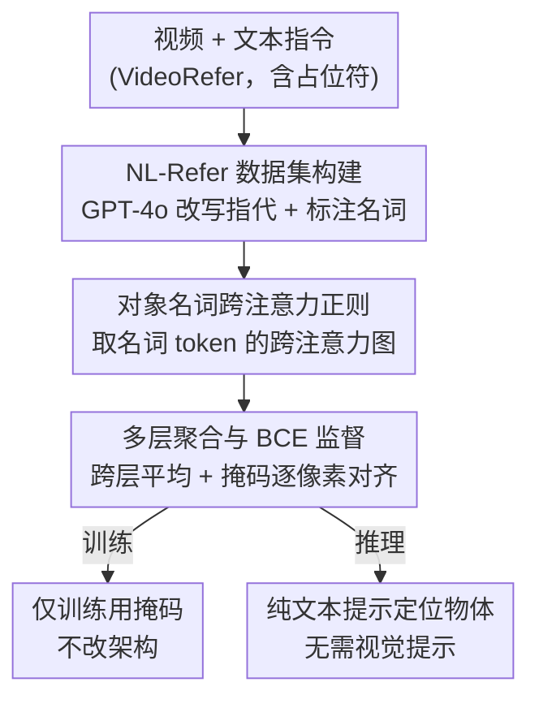

# See What I Mean: Aligning Vision and Language Representations for Video Fine-grained Object Understanding

**会议**: CVPR 2026  
**论文**: [CVF Open Access](https://openaccess.thecvf.com/content/CVPR2026/html/Sun_See_What_I_Mean_Aligning_Vision_and_Language_Representations_for_CVPR_2026_paper.html)  
**代码**: https://github.com/HumanMLLM/SWIM  
**领域**: 多模态VLM / 视频理解  
**关键词**: 视频细粒度理解, 视觉语言对齐, 跨注意力监督, 指代理解, MLLM

## 一句话总结
SWIM 是一种训练策略：只在训练阶段用对象掩码去监督 MLLM 中「对象名词 token → 视觉 token」的跨注意力，让模型学会从纯文本提示里精确定位用户指定物体，推理时不再需要任何点 / 框 / 掩码等视觉提示，在视频细粒度理解 benchmark 上反超依赖视觉提示的专家模型。

## 研究背景与动机

**领域现状**：通用多模态大模型（MLLM）在整体场景理解上很强，但要稳定地「盯住用户指定的那个物体」做细粒度描述/问答时常常跑偏。主流的补救范式是给模型额外喂视觉提示——点（Osprey）、框（Ferret）、掩码（VideoRefer、PixelRefer），再加一个 region-level 编码器把对象单独编码成 token。

**现有痛点**：这类做法要在**推理时**也提供视觉提示，既增加了额外编码器和算力开销，又偏离了用户最自然的交互方式——现实里人就是用一句话「描述那个穿条纹衫的男人」来指物，而不是先画个框。

**核心矛盾**：作者用 Qwen2.5-VL 可视化跨注意力图后发现一个系统性现象：**属性词**（颜色、纹理，如 striped、brown）会在视觉模态上产生**尖锐、局部化**的激活，而**对象名词**（man、shirt）却产生**弥散、分散**的激活。原因是属性词天然映射到低层视觉特征、且与特定空间纹理强绑定；对象名词依赖高层语义表示、在海量语料里出现语境太杂，空间关联被稀释，于是在没有显式监督时名词与区域之间对齐很差。

**本文目标**：在不改架构、推理不加视觉提示的前提下，把对象名词与其视觉区域的对应关系「补回来」。

**切入角度**：既然跨注意力是多模态交互的直接指示器，那就直接对「名词 token 的跨注意力」施加空间监督，强迫它聚焦到正确区域。

**核心 idea**：用「掩码只在训练时监督跨注意力」替代「推理时输入视觉提示」，把视觉提示从推理输入变成训练信号。

## 方法详解

### 整体框架
SWIM 建立在 Qwen2.5-VL-7B 之上（视觉编码器 SigLIP，LLM 为 Qwen2.5），整条流水线分两步走。第一步是离线**数据精炼**：从 VideoRefer 数据集出发，把原本只有占位符 `<region>` 的人类指令，用 GPT-4o 改写成包含清晰自然语言指代的句子，并标出其中最具代表性的对象名词，得到 NL-Refer 数据集。第二步是**带注意力正则的有监督微调**：训练时，把被标注的名词 token 在多个中间层产生的跨注意力图取出来、映射回原始空间网格、跨层平均聚合，再用真值掩码做逐像素 BCE 监督，逼着这个名词把注意力压到正确物体上。掩码 $M_i$ 只参与训练损失，推理时整条网络只吃「视频 + 纯文本」，不需要任何视觉提示。

### 关键设计

**1. NL-Refer 数据集构建：把「占位符指代」换成可监督的自然语言指代**

痛点很直接：VideoRefer 里的指令长这样——「请描述视频里标记区域 `<region>` 的重要元素」，占位符靠外部掩码定位，文本里**根本没有**说出这个物体「是什么」，模型自然学不到名词与区域的直接对应。SWIM 用 GPT-4o 做精炼：对每条样本，把 `<region>` 替换成一段简洁无歧义的自然语言指代 $r_i$，措辞素材取自配对的 gpt 回答 $G_i$；同时让 GPT-4o 从 $r_i$ 里挑出**唯一一个最具代表性的对象名词** $w_i$，用特殊标记 `<ins>` 包起来以便训练时确定性地定位该 token。形式化为 $\hat H_i = \mathrm{Mark}(\mathrm{Replace}(H_i, \texttt{<region>}, r_i), w_i)$，其中 $r_i = \mathrm{NLRef}(G_i)$。这样改写后，标记的名词 token 与真值掩码 $M_i$ 一一锚定，为后续跨注意力监督提供了「词 ↔ 像素」的可靠映射，而对话结构和描述上下文保持不变。

**2. 对象名词跨注意力正则：直接监督「名词 → 视觉区域」的对齐**

这是 SWIM 的核心，针对的就是动机里「对象名词注意力弥散」的毛病。训练时把 $\hat H_i$ tokenize，定位到被 `<ins>` 标记的名词 token 位置 $j_i$；在 LLM decoder 的第 $l$ 层跨注意力里，取该名词的 query $Q^t_l[j_i]$ 与该帧所有视觉 token 的 key $K^v_l$，算出注意力分布

$$A_{l,i} = \mathrm{softmax}\!\left(\frac{Q^t_l[j_i]\,(K^v_l)^\top}{\sqrt{d}}\right),$$

softmax 在 $L_v$ 个视觉 token 上归一。再把这条注意力向量按视觉 token 与 patch 的空间对应关系映射回 $(H, W)$ 网格（分辨率不一致时双线性插值到掩码分辨率），得到 $\bar A_{l,i}\in[0,1]^{H\times W}$。关键之处在于：监督直接作用在「名词」这个特定 token 的注意力上，而不是泛泛地重建视觉特征——这与 Cambrian、VIRAL 等「从中间层重建视觉嵌入」的工作正好相反，后者关注视觉表示本身、忽略了视觉-语言对齐，而 SWIM 补的就是这块对齐。整套监督不改基座架构，推理时 $M_i$ 不参与，所以推理零额外开销。

**3. 多层聚合与 BCE 监督：让对齐信号既稳定又适配稀疏注意力**

由于不同层的注意力模式差异很大，单层监督不稳。SWIM 从选定层集合 $S$ 聚合：$\bar A_i = \frac{1}{|S|}\sum_{l\in S} A_{l,i}$，并用真值掩码做逐像素二元交叉熵

$$\mathcal{L}^{(i)}_{\mathrm{BCE}} = -\frac{1}{HW}\sum_{u,v}\Big[M_i(u,v)\log\bar A_i(u,v) + (1-M_i(u,v))\log(1-\bar A_i(u,v))\Big].$$

三个工程选择都有消融支撑：层数上，从单层（3.43）涨到 6 层（3.78）后趋于饱和，且**均匀分布**地选层（如 `[2,7,12,17,22,27]`）优于挤在窄深度段；融合方式上，**简单求平均**最好（3.78），因为它在不偏向任一深度的前提下平滑噪声、保留显著峰值，而逐元素乘积要求所有层都点亮同一处、会过度压制中等但有意义的激活；损失上，**BCE** 胜过 mIoU / Focal / Dice，因为 MLLM 抽出的注意力图本身高度稀疏、只占网格一小块，重叠率类损失或聚焦难负样本的损失会对弥散激活惩罚不足，而 BCE 逐像素独立施加均匀概率惩罚，既压制无关高激活又强化目标区域的置信注意力，更契合这里的细粒度监督信号。

### 损失函数 / 训练策略
总训练数据约 235K：其一是 NL-Refer（由 VideoRefer-700K 细描述子集转换而来，125K 视频带精炼自然语言指代 + 实例掩码）；其二是少量通用视频 QA（从 LLaVA-Video-178K 拆成单轮后采样约 100K + videorefer-qa-75k 采样 10K）以保住多选题等通用能力。整体数据量不到 VideoRefer 的 1/3。训练在 8× A100 上进行，注意力正则作为辅助监督叠加在常规文本损失上。

## 实验关键数据

### 主实验
在视频细粒度 benchmark VideoRefer-Bench 上，SWIM（纯文本提示）反超所有依赖视觉提示的专家模型与更强的通用模型。

| Benchmark | 指标 | SWIM | VideoRefer-7B(Mask) | DAM-8B(Point/Box/Mask) | GPT-4o |
|-----------|------|------|---------------------|------------------------|--------|
| VideoRefer-Q | Avg. 准确率 | **78.3** | 71.9 | – | 71.3 |
| VideoRefer-Q | Basic | **83.8** | 75.4 | – | 62.3 |
| VideoRefer-D | Avg. (0–5) | **3.78** | 3.46 | 3.68 | 3.25 |
| VideoRefer-D | SC（主体对应） | **4.92** | 4.44 | 4.69 | 4.15 |

在通用视频理解上，SWIM 也保持竞争力（不因对齐训练而牺牲泛化）：MVBench 62.1、Video-MME 55.9、ActivityNet 55.6，均不弱于 VideoRefer 等基线。

### 消融实验
| 实验 | 配置 | VideoRefer-D Avg. | 说明 |
|------|------|-------------------|------|
| 监督层数 | 单层 [1] | 3.43 | 太浅，对齐弱 |
| 监督层数 | 6 层均匀 [2,7,…,27] | **3.78** | 最佳，>6 层后饱和 |
| 多层融合 | Add | 3.57 | 引入深度偏置 |
| 多层融合 | Prod. | 3.55 | 过度压制中等激活 |
| 多层融合 | Mean | **3.78** | 平滑噪声、保留峰值 |
| 损失函数 | mIoU / Focal / Dice | 3.71 / 3.69 / 3.74 | 对稀疏注意力惩罚不当 |
| 损失函数 | BCE | **3.78** | 逐像素均匀惩罚最适配 |

注意力定位质量用 GamePoint@P（最高注意力的前 P% 像素落在目标掩码内的比例）衡量：SWIM 在 P=1 / 5 / 10 上分别为 0.392 / 0.348 / 0.317，全面超过 Qwen2.5-VL-7B 的 0.329 / 0.293 / 0.270，其中 P=1 提升最大（+6.3%），说明「最自信的那个注意力点」更可能落在正确物体上。

### 关键发现
- **掩码从推理输入变训练信号**是最大价值点：SWIM 不改架构、推理零额外开销，却反超推理时还要喂掩码的 VideoRefer 与 DAM。
- **属性词 vs 名词的注意力差异**是全文支点：可视化显示监督后名词的弥散激活被收紧到正确区域，与 attribute 词一样尖锐。
- **可扩展性单调**：掩码标注数据从 30K 增到 125K，VideoRefer-D 分数从 3.23 单调升到 3.78，125K 处仍无平台期，暗示更多掩码数据还能继续涨。
- 工程上「6 层均匀 + Mean 聚合 + BCE」是最稳组合，三者都有清晰的可解释理由。

## 亮点与洞察
- **把视觉提示「内化」进训练**：核心洞见是视觉提示对推理不是必需的，只要训练时用它监督好跨注意力，推理就能从纯语言里复现定位能力——一种很优雅的「训练时拐杖、推理时丢掉」思路，可迁移到任何「推理依赖额外标注」的细粒度任务。
- **用跨注意力诊断对齐缺陷**：先可视化定位「名词激活弥散」这个具体病灶，再对症下监督，比泛泛地「加 region 编码器」更有针对性，也给出了 GamePoint@P 这种可量化的对齐指标。
- **稀疏性决定损失选择**：注意力图天然稀疏，所以 BCE（逐像素独立）胜过 IoU/Dice（重叠率导向），这个「损失要匹配监督信号的统计特性」的判断可复用到其他注意力监督场景。

## 局限与展望
- 作者承认实验受限于现有掩码数据规模（125K），曲线未饱和但更大规模未验证；NL-Refer 的指代质量依赖 GPT-4o 改写，可能引入描述偏差或错误名词标注（⚠️ 论文未量化改写错误率）。
- 自己观察：方法依赖「每条样本恰好一个被标记名词」，对一句话指多物体、或指代关系复杂（「左边那个人手里的杯子」）的场景如何扩展未讨论；通用 benchmark 上仅「不掉点」而非提升，说明对齐监督主要利好细粒度任务。
- 改进思路：把单名词监督推广到多名词 / 短语级、或引入属性词作辅助锚点，可能进一步收紧名词激活。

## 相关工作与启发
- **vs VideoRefer / PixelRefer（视觉提示派）**：它们靠掩码 + 额外视觉编码器在推理时定位，SWIM 把掩码挪到训练监督、推理纯文本，效果反而更好且更省。
- **vs Cambrian / VIRAL（中间层重建派）**：它们从中间层重建视觉嵌入、关注视觉表示本身，SWIM 直接监督「名词 token 的跨注意力」，补的是被忽略的视觉-语言对齐这一环。
- **vs Osprey / Ferret（点/框/掩码指代）**：同样做细粒度指代，但这些方法的交互方式偏离自然语言，SWIM 回到「一句话指物」这一最常见的真实交互。

## 评分
- 新颖性: ⭐⭐⭐⭐ 「掩码只做训练监督、推理纯文本」的视角清晰且有可视化诊断支撑
- 实验充分度: ⭐⭐⭐⭐ 主结果 + 层数/融合/损失/数据规模/GamePoint 多维消融齐全
- 写作质量: ⭐⭐⭐⭐ 从注意力现象到方法的逻辑链顺畅，图表对应清楚
- 价值: ⭐⭐⭐⭐ 提供了一条让 MLLM 免视觉提示做细粒度理解的可复用训练范式

<!-- RELATED:START -->

## 相关论文

- [\[CVPR 2026\] Aligning What Vision-Language Models See and Perceive with Adaptive Information Flow](aif_adaptive_information_flow_vlm.md)
- [\[CVPR 2026\] HanDyVQA: A Video QA Benchmark for Fine-Grained Hand-Object Interaction Dynamics](handyvqa_a_video_qa_benchmark_for_fine-grained_hand-object_interaction_dynamics.md)
- [\[CVPR 2026\] MA-Bench: Towards Fine-grained Micro-Action Understanding](ma-bench_towards_fine-grained_micro-action_understanding.md)
- [\[CVPR 2026\] Hugging Visual Prompt and Segmentation Tokens: Consistency Learning for Fine-Grained Visual Understanding in MLLMs](hugging_visual_prompt_and_segmentation_tokens_consistency_learning_for_fine-grai.md)
- [\[CVPR 2026\] CropVLM: Learning to Zoom for Fine-Grained Vision-Language Perception](cropvlm_learning_to_zoom_for_fine_grained_vision_language_perception.md)

<!-- RELATED:END -->
