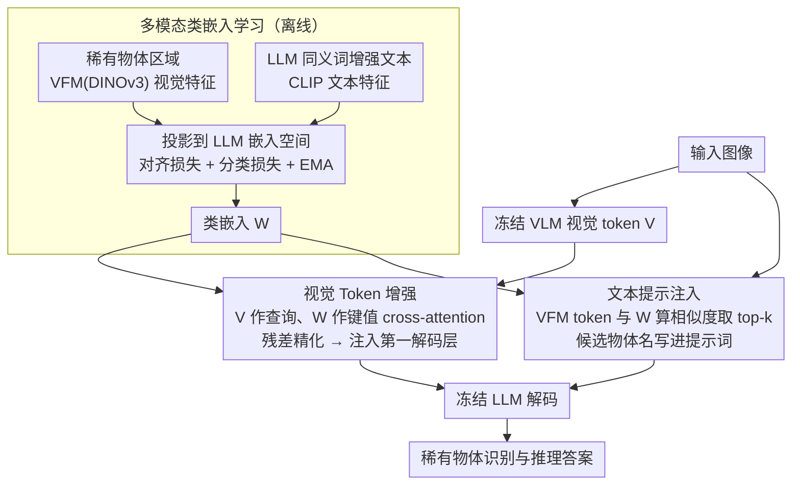

# Seeing Clearly, Reasoning Confidently: Plug-and-Play Remedies for Vision Language Model Blindness

**会议**: CVPR 2026  
**arXiv**: [2602.19615](https://arxiv.org/abs/2602.19615)  
**代码**: 无  
**领域**: 多模态VLM  
**关键词**: 稀有物体识别, 视觉token增强, 多模态类嵌入, 即插即用, VLM鲁棒性

## 一句话总结
提出一种高效的即插即用模块，通过学习多模态类嵌入来增强 VLM 对稀有物体的识别和推理能力：在视觉端用 cross-attention 适配器精化视觉 token，在文本端注入物体检测提示，无需微调 VLM 即可在 CODA-LM 上获得 72.8→75.4 的显著提升。

## 研究背景与动机
**领域现状**：VLM 在通用视觉理解上表现出色，但在涉及稀有/罕见物体的推理任务上表现明显下降。

**现有痛点**：
   - VLM 在中间解码层对稀有物体区域的注意力权重显著低于常见物体
   - 引入更强视觉编码器或全模型微调的方法计算成本高，且不针对物体级别优化
   - 检索增强学习（RAL）需要大规模外部数据和 VLM 微调，可能遗忘原有能力

**核心矛盾**：稀有物体在预训练数据中出现频率极低，导致 VLM 对其学到的视觉-语言对齐不充分；但现有改进方法不是针对物体级别设计的，且需要昂贵的全模型微调。

**本文目标**：在不微调 VLM 的前提下，高效提升 VLM 对稀有物体的感知和推理能力。

**切入角度**：通过注意力可视化发现 VLM 在解码中间层对稀有物体关注不足，因此需要从两个方面补救——增强视觉 token（让稀有物体更"显眼"）和丰富文本提示（引导注意力到目标区域）。

**核心idea**：学习融合视觉基础模型特征和同义词增强文本描述的多模态类嵌入，用它既作为视觉 token 精化锚点，又作为物体检测器生成文本提示。

## 方法详解

### 整体框架
这篇论文想解决的是 VLM 的"稀有物体盲区"：模型见过太少护柱、锥桶这类罕见物体，解码时对它们的视觉区域几乎不看一眼。作者的思路是不动 VLM 本体，而是在它两侧各加一道补丁——一道修视觉、一道修文本，靠一组共享的"多模态类嵌入"把两道补丁串起来。整条流水线分三步：先离线学好这组类嵌入（让它同时对齐稀有物体的视觉特征和文本描述），再在视觉端用它作锚点精化 VLM 的视觉 token，最后在文本端用它当检测器、把检测到的候选物体名写进提示词里。视觉 token 增强 + 文本提示注入双管齐下，VLM 自身参数全程冻结。

### 关键设计

**1. 多模态类嵌入学习：把稀有物体的视觉与文本知识压进一组统一锚点**

后两步的视觉精化和文本检测都要靠类嵌入，所以第一步是把它训好。每个稀有类别对应一个可学习的嵌入向量，训练时让它同时贴近两路信号：VFM（DINOv3）抽出的物体视觉特征 $z_v$，和 CLIP 抽出的文本特征 $z_t$，两者各经一个投影层映射到 LLM 的嵌入空间。为了缓解稀有类别本身样本就少、还分布不均的问题，作者先用 LLM 给每个类别生成一批同义词和描述性文本，数据越少的类别就采样越多文本变体来补。对齐用对比损失 $\mathcal{L}_{align}$ 把同类的视觉-文本特征拉近、异类推远；再叠一个分类损失 $\mathcal{L}_{class}$ 并对嵌入做 EMA 滑动更新，让它收敛成视觉和文本共用的统一锚点。嵌入不是随机初始化，而是从同类样本的平均视觉特征起步，这样训练更稳。

**2. 视觉 Token 增强：用类嵌入做 cross-attention 的键值，把判别性知识注回视觉 token**

VLM 对稀有物体"看不见"的直接表现，是解码中间层对那片区域的注意力权重偏低。作者的补救是在视觉侧加一个轻量 cross-attention 适配器：以冻结 VLM 输出的视觉 token $V$ 为查询、训好的类嵌入 $W$ 为键值，让每个视觉 token 去类嵌入里检索与自己相关的稀有物体知识，再以残差形式加回去：

$$\hat{V} = V + \mathcal{C}_{att}(V, W)$$

精化后的 $\hat{V}$ 只在 VLM 的第一解码层替换原 token 注入，越早注入、后续各层就越能顺着这条线索把注意力放到稀有物体上。适配器的训练目标一边用重建损失 $\mathcal{L}_{rec}$ 约束 $\hat{V}$ 不偏离原始 token 分布太远（避免破坏 VLM 已有的视觉理解），一边用自回归损失 $\mathcal{L}_{autoreg}$ 让增强后的 token 真能改善下游生成。

**3. 文本提示注入推理：让同一组类嵌入兼职物体检测器，把候选物体写进提示词**

光改视觉 token 还不够显式，作者顺势把类嵌入的第二个用途挖出来——当检测器用。推理时计算 VFM 视觉 token 与每个类嵌入的余弦相似度，相似度高就说明图里大概有这个稀有物体，取 top-k 类别作为候选，再把它们的名字拼进文本提示，例如"In this image, there might be objects such as: [bollard, debris, …]"。这相当于用一句自然语言把 LLM 的注意力显式钉到目标物体上，和视觉端的隐式增强形成互补。妙处在于这步不需要额外训练一个检测头，复用的就是第一步那组类嵌入。

### 一个完整示例
拿一张含护柱（bollard）的自动驾驶图走一遍：图先过冻结 VLM 得到视觉 token $V$。视觉端，$V$ 作查询去 cross-attention 检索类嵌入 $W$，"护柱""锥桶"对应的嵌入因与图中那片像素相关而被加权融入，得到 $\hat{V}$ 注入第一解码层——原本被忽略的护柱区域注意力被抬高。文本端，VFM token 和各类嵌入算相似度，护柱、debris 等排进 top-k，于是提示词被补成"…there might be objects such as: [bollard, debris]"。VLM 拿着增强后的视觉 token 和点过名的提示词去回答，护柱这类稀有物体就不再被漏看——这也是实验里 Barrier 类从 39.3 涨到 68.3 的来源。

### 损失函数 / 训练策略
- 阶段1：$\mathcal{L}_{align} + \mathcal{L}_{class}$（训练类嵌入和投影层，20 epochs）
- 阶段2：$\mathcal{L}_{adapter} = \mathcal{L}_{rec} + \mathcal{L}_{autoreg}$（训练适配器，10 epochs）
- VLM 全程冻结。单卡 RTX 4090 即可完成全部训练。

## 实验关键数据

### 主实验（CODA-LM GPT Score）

| 模型 | Barrier↑ | Cone↑ | Vehicle↑ | All↑ |
|------|:-------:|:-----:|:--------:|:----:|
| LLaVA-1.5-7B | 39.3 | 54.5 | 48.9 | 46.5 |
| **LLaVA-1.5-7B + Ours** | **68.3** | **84.9** | **73.0** | **72.8** |
| Qwen2.5-VL-7B | 70.9 | 84.9 | 66.5 | 67.9 |
| **Qwen2.5-VL-7B + Ours** | **79.8** | **91.7** | **71.0** | **75.4** |
| InternVL3-8B | 59.7 | 73.3 | 66.9 | 65.4 |
| **InternVL3-8B + Ours** | **76.4** | **85.8** | **73.8** | **74.2** |

### 消融实验

| 配置 | All↑ | 说明 |
|------|:----:|------|
| LLaVA-1.5-7B baseline | 46.5 | 无任何增强 |
| + 仅文本提示 | 56.2 | 提示有效但不充分 |
| + 仅视觉增强 | 65.8 | 视觉增强贡献更大 |
| + 视觉增强 + 文本提示 | **72.8** | 双管齐下效果最优 |

### 关键发现
- LLaVA-1.5-7B 提升 26.3 分（46.5→72.8），提升幅度惊人
- 跨模型通用：LLaVA, Qwen2.5-VL, InternVL3 均有效
- 视觉增强贡献 > 文本提示贡献，但两者互补
- 仅需单卡 4090 和极少训练数据（CODA-LM 万级 QA 对）
- 在 Barrier（护柱）类上提升最显著（39.3→68.3），正是典型的稀有物体

## 亮点与洞察
- **多模态类嵌入的多用途性**：同一组类嵌入既作为视觉精化锚点（cross-attention 的键值），又作为物体检测器（相似度匹配），一举两得
- **VLM 冻结的高效方案**：只训练一个轻量 cross-attention 适配器和类嵌入，在严格不改变 VLM 参数的条件下实现大幅提升。这对于部署已有大模型的场景非常有价值
- **注意力可视化分析**：直接展示 VLM 中间层对稀有物体注意力不足的问题，为方法设计提供了清晰的动机

## 局限与展望
- 需要预定义稀有类别集合，不能处理训练时完全未见过的新类别
- 类嵌入数量受限于稀有类别数 C，超大规模类别场景需要调整
- top-k 检测可能引入误检，生成错误的文本提示反而误导推理
- 在 GeoBench-VLM（卫星图像）上效果弱于 CODA-LM，说明在极稀缺数据下仍有挑战

## 相关工作与启发
- **vs VLM 内部特征监督方法 (LLaVA-Grounding)**：它们通过 VFM 对齐全部视觉 token，不针对稀有物体；本文用类嵌入实现物体级精化，更加精准高效
- **vs 检索增强学习 (RAL)**：RAL 从外部大规模数据检索并微调 VLM，计算成本高且可能遗忘；本文无需大规模数据和 VLM 微调

## 评分
- 新颖性: ⭐⭐⭐⭐ 多模态类嵌入的双重用途设计巧妙
- 实验充分度: ⭐⭐⭐⭐ 多模型验证+注意力可视化分析
- 写作质量: ⭐⭐⭐⭐ 动机清晰，图示直观
- 价值: ⭐⭐⭐⭐ 对稀有物体理解的实用解决方案

<!-- RELATED:START -->

## 相关论文

- [\[CVPR 2026\] Prune2Drive: A Plug-and-Play Framework for Accelerating Vision-Language Models in Autonomous Driving](prune2drive_a_plug-and-play_framework_for_accelerating_vision-language_models_in.md)
- [\[AAAI 2026\] LLMC+: Benchmarking Vision-Language Model Compression with a Plug-and-play Toolkit](../../AAAI2026/multimodal_vlm/llmc_benchmarking_vision-language_model_compression_with_a_plug-and-play_toolkit.md)
- [\[AAAI 2026\] Seeing Justice Clearly: Handwritten Legal Document Translation with OCR and Vision-Language Models](../../AAAI2026/multimodal_vlm/seeing_justice_clearly_handwritten_legal_document_translation_with_ocr_and_visio.md)
- [\[AAAI 2026\] Plug-and-Play Clarifier: A Zero-Shot Multimodal Framework for Egocentric Intent Disambiguation](../../AAAI2026/multimodal_vlm/plug-and-play_clarifier_a_zero-shot_multimodal_framework_for_egocentric_intent_d.md)
- [\[CVPR 2026\] Visual Funnel: Resolving Contextual Blindness in Multimodal Large Language Models](visual_funnel_resolving_contextual_blindness_in_multimodal_large_language_models.md)

<!-- RELATED:END -->
