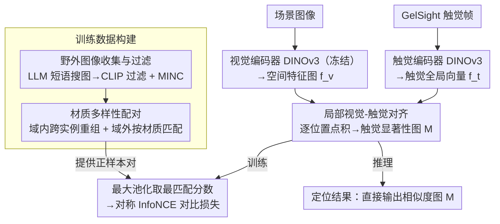

# Seeing Through Touch: Tactile-Driven Visual Localization of Material Regions

**会议**: CVPR 2026  
**arXiv**: [2604.11579](https://arxiv.org/abs/2604.11579)  
**代码**: [https://mm.kaist.ac.kr/projects/SeeingThroughTouch/](https://mm.kaist.ac.kr/projects/SeeingThroughTouch/)  
**领域**: 多模态VLM  
**关键词**: 触觉定位, 视觉-触觉对齐, 材质分割, 跨模态学习, 数据集

## 一句话总结
提出触觉定位任务——给定触觉输入识别图像中具有相同材质属性的区域，通过局部视觉-触觉对齐和材质多样性配对策略学习密集跨模态特征，构建两个新的触觉-材质分割数据集。

## 研究背景与动机

**领域现状**：视觉-触觉学习主要聚焦于全局对齐（判断图像和触觉是否对应同一材质），但缺乏空间定位能力——无法在视觉场景中找到"摸起来一样"的区域。

**现有痛点**：(1) 全局对齐方法无法定位材质区域；(2) 现有数据集以近距离特写为主，视觉帧几乎无变化且单一材质填满画面，缺乏场景级多材质图像；(3) 缺少触觉-材质分割的评估基准。

**核心矛盾**：触觉定位需要细粒度的局部跨模态对应，但现有方法和数据都只提供粗粒度的全局对齐。

**核心 idea**：学习局部视觉-触觉对齐产生触觉显著性图，并通过材质多样性配对扩展有效训练对。

## 方法详解

### 整体框架
这篇论文要解决的是「触觉定位」：给一张图像和一段触觉读数，在图里圈出那些「摸起来和这段触觉一样」的区域。它不像以前的视觉-触觉学习只回答「这张图和这段触觉是不是同一种材质」这种全局是非题，而是要逐像素地指出材质相同的区域在哪。

整条 pipeline 这样转：触觉编码器把一帧 GelSight 触觉图压成一个全局向量 $\bar{f}_t$，视觉编码器把图像编码成保留空间结构的特征图 $f_v$（双编码器都用 DINOv3，视觉骨干冻结只训对齐器）；把触觉向量和特征图上每个位置逐点做内积，得到一张密集相似度图 $M[h,w] = \bar{f}_t \cdot f_v[h,w]$——这张图本身就是「触觉显著性图」，亮的地方就是摸起来一样的区域。训练时对这张图做最大池化，取最匹配位置的分数喂进对称 InfoNCE 对比学习；推理时则直接拿整张相似度图当定位结果输出。而要把这套局部对齐训起来，还得先解决「有效训练对太少」的问题——这就是「材质多样性配对」和「野外图像收集与过滤」两步数据构建在做的事：前者把稀疏的触觉-视觉对扩容成跨实例、跨场景的正样本，后者负责攒出一张图里含多种材质的场景级图像，给配对提供素材。

### 关键设计

**1. 局部视觉-触觉对齐：把「是不是同一材质」改成「在哪里是同一材质」**

全局对齐方法把整张图和触觉各自压成一个向量比对，丢掉了空间信息，自然无法定位。这里换成密集对齐：触觉仍是一个全局向量 $\bar{f}_t$，但视觉保留空间特征图，两者逐位置点积出相似度图 $M$，再用最大池化 $s = \max_{h,w} M[h,w]$ 取出最匹配位置的分数参与对比学习。最大池化是这步的关键——它让模型只盯着图里最像的那块区域去拉近触觉，而不是对所有位置求平均，于是被推高响应的恰好是材质相同的局部，相似度图天然变成了定位图。

**2. 材质多样性配对策略：靠「相似材质相似触觉」把稀疏的训练对撑起来**

Touch-and-Go 这类数据集的硬伤是同一次采集里视觉帧几乎不动、一种材质铺满画面，能凑成的有效正样本对极少。这里用两层配对扩容：域内配对把同一材质类别下不同触觉实例、不同视觉帧跨实例重新组合成正对，等于打破「一帧只配自己那一帧」的限制；域外配对则更激进，去网上找场景图像，按材质类别去匹配已有的触觉样本——背后是「相似材质会产生相似触觉」这个假设，所以一段砖墙触觉可以配上任何一张含砖墙的新场景图。两层叠加后正样本的多样性大幅上升，模型也被逼着学习跨实例、跨场景都成立的材质对应，而不是记住某次采集的视觉外观。

**3. 野外图像收集与过滤：给训练补上「一张图里多种材质」的场景**

域外配对要成立，前提是有足够多的场景级图像，但 TG 数据集全是单材质的近距离特写，训不出场景定位能力。作者用 LLM 给每个材质类别生成多样的搜索短语（如 "brick chimney in a cozy living room"）去搜索引擎抓图，再用 CLIP 相似度过滤掉跟目标材质对不上的错图，并补进 MINC 材质数据集的图像。这样攒出的图像里一张往往含多种材质、视角和距离也更丰富，正好填上 TG 缺的那一类样本。

### 损失函数 / 训练策略
对称的 InfoNCE 对比损失（视觉→触觉与触觉→视觉两个方向）。训练时冻结视觉 DINOv3 骨干，只更新触觉编码器和两个对齐器模块，以保住视觉特征的空间结构。

## 实验关键数据

### 主实验

| 数据集 | 指标 | STT | 之前最佳 | 提升 |
|--------|------|-----|---------|------|
| TG-Seg (新) | mIoU | 显著优 | ImageBind | 大幅 |
| Web-Mat-Seg (新) | mIoU | 显著优 | UniTouch | 大幅 |
| OpenSurfaces | F1 | 优 | 基线 | 提升 |

### 消融实验

| 配置 | mIoU | 说明 |
|------|------|------|
| Full (域内+域外) | 最优 | 完整模型 |
| 仅域内配对 | 次优 | 缺少场景级泛化 |
| 仅标准配对 | 差 | 有效训练对太少 |
| 全局对齐替代 | 差 | 无空间定位能力 |

### 关键发现
- 局部对齐显著优于全局对齐，证明空间分辨的跨模态特征是定位的关键
- 材质多样性配对（尤其域外图像）是泛化到场景级图像的关键因素
- 弱触觉信号（如轻触或不确定材质）的处理能力因域外数据增加而显著提升

## 亮点与洞察
- **新任务定义**：触觉定位是一个自然但未被正式研究的问题，可启发更多感官交互研究
- **"相似材质相似触觉"的利用**：简单假设大幅扩展训练数据，是跨模态学习中解决数据稀缺的通用策略

## 局限与展望
- 触觉传感器类型固定（GelSight），跨传感器泛化未验证
- 材质类别粒度有限（18 类）
- 未来可扩展到更细粒度的材质属性（如粗糙度、硬度）

## 相关工作与启发
- **vs ImageBind/UniTouch**: 全局对齐方法，无法定位
- **vs TaRF**: 在 3D NeRF 中做触觉定位，限于重建场景

## 评分
- 新颖性: ⭐⭐⭐⭐ 任务定义新颖，数据策略实用
- 实验充分度: ⭐⭐⭐⭐ 构建了两个新数据集进行评估
- 写作质量: ⭐⭐⭐⭐ 动机和方法描述清晰
- 价值: ⭐⭐⭐⭐ 开辟了触觉定位的新方向

<!-- RELATED:START -->

## 相关论文

- [\[AAAI 2026\] SToLa: Self-Adaptive Touch-Language Framework with Tactile Commonsense Reasoning in Open-Ended Scenarios](../../AAAI2026/multimodal_vlm/stola_self-adaptive_touch-language_framework_with_tactile_commonsense_reasoning_.md)
- [\[CVPR 2026\] Rethinking VLMs for Image Forgery Detection and Localization](rethinking_vlms_for_image_forgery_detection_and_localization.md)
- [\[CVPR 2026\] VLM-Loc: Localization in Point Cloud Maps via Vision-Language Models](vlm-loc_localization_in_point_cloud_maps_via_vision-language_models.md)
- [\[CVPR 2026\] PinPoint: Focus, Don't Prune — Identifying Instruction-Relevant Regions for Information-Rich Image Understanding](focus_dont_prune_identifying_instruction-relevant_regions_for_information-rich_i.md)
- [\[CVPR 2026\] Generate, Analyze, and Refine: Training-Free Sound Source Localization via MLLM Meta-Reasoning](generate_analyze_and_refine_training-free_sound_source_localization_via_mllm_met.md)

<!-- RELATED:END -->
