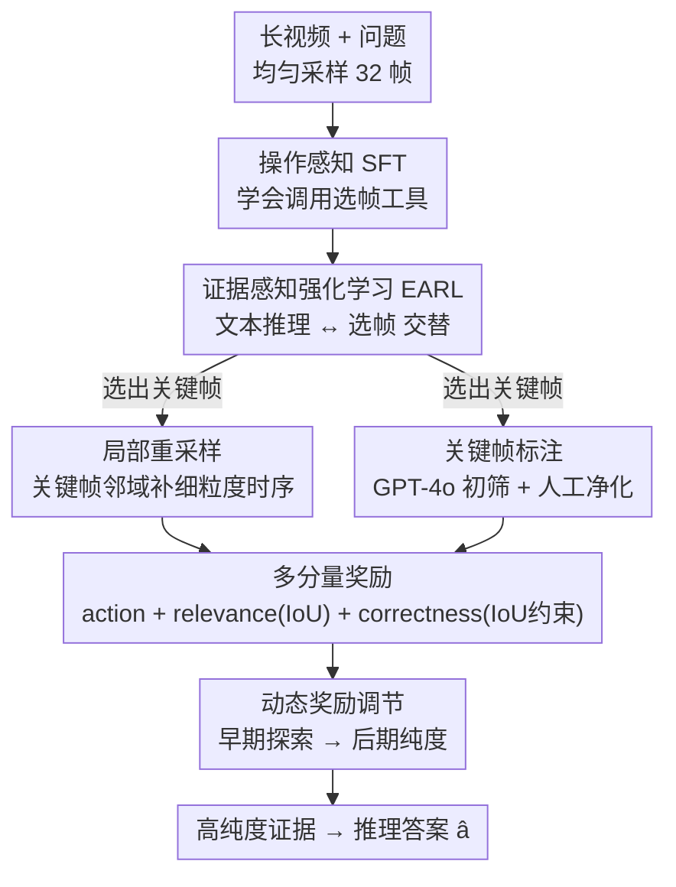

# Select Less, Reason More: Prioritizing Evidence Purity for Video Reasoning

**会议**: CVPR 2026  
**论文**: [CVF Open Access](https://openaccess.thecvf.com/content/CVPR2026/html/Li_Select_Less_Reason_More_Prioritizing_Evidence_Purity_for_Video_Reasoning_CVPR_2026_paper.html)  
**代码**: 无  
**领域**: 多模态VLM / 视频推理 / 视频理解  
**关键词**: 长视频推理、Video LLM、像素空间推理、证据纯度、强化学习帧选择

## 一句话总结
针对长视频里"均匀采样把关键证据稀释、现有帧选择又没有纯度奖励"的问题，本文提出 EARL（证据感知强化学习），让 Video LLM 边推理边主动选关键帧、再在关键帧附近做局部重采样补细粒度时序，并用基于 IoU 的多分量奖励逼着模型"少选精选"，7B 模型在 LongVideoBench/MVBench/VideoMME 上分别拿到 59.8% / 69.0% / 64.9%，刷新开源 Video LLM 的 SOTA。

## 研究背景与动机
**领域现状**：Video LLM（视频大语言模型）把视觉特征抽取和 LLM 推理拼在一起，在视频理解上进步很快。但要让模型处理几分钟甚至上小时的长视频，绕不开一个工程现实——视觉上下文窗口有限，没法把成千上万帧都塞进去，于是几乎所有方法都先做**均匀采样**，把视频压成固定的 32 帧或几百帧再喂给模型。

**现有痛点**：均匀采样有两个硬伤。一是**信息稀释**——长视频里真正回答问题需要的关键证据可能只在某几帧，均匀采样塞进来一大堆冗余帧，把有限的上下文窗口挤占掉，反而把关键线索淹没了。二是**时序粒度不足**——一旦采样完成，模型就只能在这批预采样帧里翻找，没办法去访问采样间隙里更细的时序细节（比如"某个动作发生在第几秒"这种问题，关键帧之间的过渡帧才是答案）。

为缓解这两点，社区出现了两条路线。一条是**文本空间推理**：把视觉输入当成固定的起点，靠 LLM 生成的思维链（CoT）质量来推理，但视觉输入是被动接收的，初始采样不够好就无能为力。另一条是**像素空间推理**（"Thinking with Images"范式）：让模型能主动和视频交互、迭代请求新的视觉信息。后者又分多智能体（如 Video-RAG 用外部检索）和端到端 agent（如 Pixel Reasoner、VITAL、FrameMind 用 RL 训练模型主动选帧）。

**核心矛盾**：现有端到端 agent 方法有个共同的致命短板——它们只奖励"选了帧"这个**粗动作**，却**不验证选出来的帧到底对不对、纯不纯**。模型可能选了一堆和问题无关的帧照样拿到奖励，证据纯度无从保证。更糟的是像 Pixel Reasoner 这类方法只能在预采样帧里挑，根本碰不到更细的时序粒度。一句话：**缺证据纯度奖励 + 够不到细粒度时序**，这两个缺口正是本文要补的。

**核心 idea**：作者的哲学叫 **"Select Less, Reason More"（少选，多推理）**——用更干净、更高密度的相关证据去换更强的推理。具体做法是把"选哪几帧"本身当成像素空间里的核心推理步骤：模型动态决定哪些稀疏帧是关键，然后在这些关键帧周围做**局部重采样**补回细粒度时序；训练上用一套以 IoU 为核心的多分量奖励（EARL）逼模型选出"最小且最纯"的证据集。

## 方法详解
整套方法分两阶段训练：先用**操作感知的监督微调（SFT）**让模型学会"调用选帧工具、走多步推理"的基本姿势；再用**证据感知强化学习（EARL）**把这种模仿来的初级能力打磨成高精度、高纯度的自适应策略。推理时，模型在一段视频上交替进行"文本推理 ↔ 选帧操作"，每次选帧触发一次局部重采样，把刷新后的高粒度帧并入当前推理步，形成多模态 CoT。

### 整体框架
输入是视频 $V=\{v_1,\dots,v_M\}$ 和问题 $Q$，模型先对 $V$ 均匀采样得到当前视觉上下文 $V_{current}$（最多 32 帧）。模型生成一条推理轨迹 $y=[y_1,\dots,y_n,\hat a]$，其中每个 $y_t$ 要么是一段文本推理，要么是一次**选帧动作**，$\hat a$ 是最终答案。当模型选出关键帧子集 $F_{select}\subset V_{current}$ 后，系统自动做局部重采样：对每个选中的关键帧，在它与时序上最近邻帧之间界定一个区间 $\tau_i$，从这些区间里均匀重采样出至多 $N_{max}=16$ 帧，得到高粒度帧集 $F_{refine}$，并令 $V_{current}\leftarrow F_{refine}$。新帧的视觉特征拼进当前推理步 $y_t\leftarrow \text{concat}(y_t, f_{frame}(F_{refine}))$。为控制效率，每个 prompt 最多允许 2 次动态选帧。

### 关键设计

**1. 局部重采样：让模型够得到采样间隙里的细粒度时序**

现有端到端 agent（如 Pixel Reasoner）最大的局限是"只能在预采样帧里挑"，一旦初始 32 帧没覆盖到关键瞬间，模型再聪明也无能为力。本文的破法是：选帧动作不止"挑出已有帧"，还会**触发一次自动的局部重采样**。对每个被选中的关键帧，系统在它和最近邻帧之间划出时间区间 $\tau_i$，再从这些短视频片段里均匀重采样至多 16 帧，组成新的高粒度上下文 $F_{refine}$ 替换原上下文。这等于把"选帧"从一次性的离散挑选，变成了"先粗定位、再在邻域放大细看"的两段式——既不增加全局帧预算（仍是稀疏的关键帧），又能在真正需要细节的地方拿到更密的时序证据。这正是"Select Less, Reason More"里 *Reason More* 的物理来源。

**2. 关键帧标注：给"什么叫纯证据"提供金标准监督**

要奖励"证据纯度"，前提是知道哪些帧才是真·关键帧。本文用混合标注流程造金标准 $F_{gold}$：先把视频帧、问题、答案喂给 GPT-4o，用精心设计的 prompt 让它产出初步关键帧索引 $F_{key}$，并约束 $|F_{key}|\in\{1,2,\dots,8\}$（关键帧本就该少）；再由人工 review，剔除无关帧 $F_{irrelevant}$，得到 $F_{gold}=F_{key}\setminus F_{irrelevant}$。这套"模型初筛 + 人工净化"既保证了规模，又保证了纯度，$F_{gold}$ 成为后面 IoU 奖励的判分依据，支撑模型两轮选帧的监督。没有这层金标准，所谓"证据纯度奖励"就无从谈起。

**3. 多分量奖励：把"选少、选纯、选对"三件事一起逼出来**

EARL 的核心是三个奖励分量的组合，分别管不同的目标。**动作奖励** $r_{action}$ 解决"模型因为不确定干脆不选帧"的退化问题——只要发生了选帧动作就给一个小的固定奖励（选了给 1，否则给 0）。**相关性奖励** $r_{relevance}$ 直接奖励证据纯度，用选中帧 $F_{selected}$ 与金标准 $F_{gold}$ 的 IoU 衡量：

$$\text{IoU}=\frac{|F_{selected}\cap F_{gold}|}{|F_{selected}\cup F_{gold}|},\quad r_{relevance}=\text{IoU}\in[0,1]$$

IoU 这个设计很妙：它同时惩罚"漏选关键帧"（交集变小）和"多选无关帧"（并集变大），天然把模型推向"最小且最纯"的帧集——这正是 *Select Less*。**正确性奖励** $r_{correct}$ 则把选帧质量和最终任务目标绑死，不只看答对没答对，还看答对时证据纯不纯：

$$r_{correct}=\begin{cases}1 & \hat a=a^* \text{ 且 } \text{IoU}\ge 0.5\\ 0.5 & \hat a=a^* \text{ 但 } \text{IoU}<0.5\\ -1 & \hat a\ne a^*\end{cases}$$

也就是说，即便答对了，如果是靠一堆杂帧"蒙"对的（IoU<0.5），只给半分；答错直接扣分。这条 IoU 约束是关键——它防止模型"不择手段找到正确答案"，强制让正确答案必须来自高纯度证据。

**4. 奖励敏感度的动态调节：让训练从"敢探索"平滑过渡到"求纯度"**

如果一上来就强压纯度，模型还没学会怎么选帧就被 IoU 奖励卡死，探索不足、收敛不稳。本文按训练进度 $\text{Progress}=t/T$ 做动态调节：早期（$\text{Progress}\le P$）用较大的动作奖励系数 $\alpha_{early}$、较小的相关性系数 $\beta_{early}$，鼓励模型大胆尝试各种选帧而不必苛求纯度；后期（$\text{Progress}>P$）把 $\alpha$ 从 $\alpha_{early}$ 降到 $\alpha_{late}$、$\beta$ 从 $\beta_{early}$ 升到 $\beta_{late}$，把焦点切到 IoU 奖励所要求的纯度和精度上。总奖励为

$$r_{total}=r_{correct}+\alpha(t)\cdot r_{action}+\beta(t)\cdot r_{relevance}$$

$\alpha(t)$、$\beta(t)$ 在跨过阈值 $P$ 时从 $\{\alpha_{early},\beta_{early}\}$ 切换到 $\{\alpha_{late},\beta_{late}\}$。这种"先探索后精修"的课程式调度保证了稳定收敛——既不在早期扼杀有价值的探索，又能在后期把策略严格优化到高纯度。

### 损失函数 / 训练策略
SFT 阶段在数据集 $D_{SFT}$（含 QA 对和带选帧动作的推理轨迹）上最小化标准交叉熵：

$$L_{SFT}=-\sum_{(x_i,y_i)\in D_{SFT}}\log P_\theta(y_i\mid x_i)$$

但 SFT 受限于专家数据质量，分不清"真正必要的选帧"和"轨迹里的次优动作"，所以必须接 RL 精修。RL 阶段最大化期望总奖励 $\max_\theta \mathbb{E}_{x\sim D,\,y\sim\pi_\theta}[R(x,y)]$。实现上基座是 Qwen2.5-VL-7B-Instruct，SFT 用 Open-R1（3.8k 样本，batch 128，lr $1\times10^{-6}$，10% warmup），RL 用 OpenRLHF（8.3k 样本，cosine 衰减，每 batch 采 256 prompt、每 prompt 8 rollouts）。

## 实验关键数据

### 主实验
在 MLVU、VideoMME（无字幕）、LongVideoBench、LVBench、MVBench 五个长视频推理基准上评测，指标为准确率（%）。7B 模型刷新开源 Video LLM SOTA。

| 基准 | 本文 (7B/32帧) | Qwen2.5-VL 基线 | 代表性对手 | 本文优势 |
|------|------|------|------|------|
| MVBench | **69.0** | 62.6 | Pixel Reasoner 67.8 / FrameMind 64.2 | 比基线 +6.4，超所有端到端 agent |
| VideoMME (Overall) | **64.9** | 53.6 | FrameMind 60.9 | 比基线 +11.3 |
| VideoMME (Long) | **57.8** | 44.7 | LongVA 47.6(128帧) / LongVILA 53.0(256帧) | 32 帧反超百帧级长视频模型 |
| LongVideoBench | **59.8** | 43.2 | LongVITA 58.8(14B) | 7B 反超 14B |
| LVBench | **46.2** | 31.6 | Hour-LLaVA 45.6 | +14.6 |
| MLVU | **49.3** | 41.6 | — | +7.7 |

### 消融实验
逐个拆掉 EARL 的各组件，验证每一块都不可或缺（以 LongVideoBench / MVBench 为代表）。

| 配置 | LongVideoBench | MVBench | 说明 |
|------|------|------|------|
| Ours（完整） | 59.8 | 69.0 | 完整 EARL |
| Ours w/o RL（仅 SFT） | 51.9 | 63.8 | 去掉整个 RL，掉 7.9 / 5.2 |
| Ours w/o RR（去相关性奖励） | 56.8 | 67.1 | 失去纯度过滤，杂帧引入噪声 |
| Ours w/o IoU（正确性奖励退化为二值） | 57.8 | 69.0 | 模型"不择手段"答对，选帧质量下降 |
| Ours w/o DA（固定奖励比例） | 58.4 | 68.3 | 无法从探索平滑切到精修 |

### 关键发现
- **RL（EARL）贡献最大**：仅 SFT 时策略是模仿来的次优解，LongVideoBench 仅 51.9%；加上 EARL 跳到 59.8%（+7.9），VideoMME(Long) 51.8→57.8、MVBench 63.8→69.0，说明多分量奖励才是把"会选帧"变成"选得好"的关键。
- **相关性奖励是纯度的过滤阀**：去掉后 LongVideoBench 59.8→56.8、MLVU 49.3→47.1，因为冗余无关帧把有限上下文窗口塞满、引入时序干扰。
- **IoU 约束防"蒙对"**：把正确性奖励退化为普通二值后，LongVideoBench 掉到 57.8、LVBench 46.2→44.7——没有 IoU 约束，模型会选非关键帧也照样领赏，证据纯度崩坏。
- **少帧胜多帧**：32 帧的本文在 VideoMME(Long) 上反超用 128/256 帧的 LongVA、LongVILA，直接验证"智能的证据感知选择 > 单纯堆帧数"。

## 亮点与洞察
- **把"选帧"提升为核心推理步**：以往选帧是预处理或粗动作，本文让"选哪几帧 + 在哪里放大重采样"成为像素空间推理本身，证据获取和答题策略可端到端联合优化，这个视角转换很有启发。
- **IoU 一石二鸟**：用 IoU 当相关性奖励，同时压制"漏选"和"多选"，把抽象的"证据纯度"变成一个可微分、范围 [0,1] 的连续信号，是整套奖励里最优雅的一笔——这个 trick 可迁移到任何"选最小充分子集"的检索/选择任务。
- **局部重采样补时序**：不靠加大全局帧预算，而靠"关键帧邻域放大"拿到细粒度，既省上下文又精准，思路类似图像里的 zoom-in，但搬到了时间轴上。
- **课程式奖励调度**：早期重探索、后期重纯度的动态系数切换，是 RL 训练里防止过早收敛到次优策略的实用经验。

## 局限与展望
- **强依赖金标准标注**：相关性/正确性奖励都建立在 $F_{gold}$ 上，而 $F_{gold}$ 来自 GPT-4o 初筛 + 人工净化，标注成本和主观性（"哪几帧算关键"本身有歧义）会限制扩展到新领域；GPT-4o 选错关键帧会污染奖励信号。
- **选帧次数硬上限**：每 prompt 最多 2 次动态选帧、重采样上限 16 帧，对需要多处分散证据的超复杂问题可能不够，作者未讨论放宽后的代价。
- **只验证 7B / Qwen2.5-VL 一种基座**：能否泛化到更大或异构 Video LLM、以及局部重采样在极长视频（数小时）上的开销，论文未覆盖。
- **改进方向**：可探索用模型自洽性或弱监督替代人工金标准，降低标注依赖；或把选帧次数也纳入可学习的预算分配。

## 相关工作与启发
- **vs Pixel Reasoner**：都做端到端 RL 选帧 agent，但 Pixel Reasoner 只在预采样帧里挑、且只奖励粗动作；本文加了局部重采样够到细粒度时序，又用 IoU 奖励强制证据纯度，MVBench 69.0 vs 67.8。
- **vs FrameMind / VITAL**：同为端到端 agent，能在区间内选帧获取新信息，但都没有"验证选出的帧是否真有助于答题"的纯度奖励；本文的多分量奖励正是补这个缺口（VideoMME 64.9 vs FrameMind 60.9）。
- **vs Video-RAG（多智能体）**：Video-RAG 靠外部检索 + 解耦的协作组件捕捉跨视频语义，但解耦架构难以端到端统一优化整个"推理 + 证据选择"策略；本文是单模型端到端优化。
- **vs 文本空间推理（如 Video-R1）**：那类方法把视觉输入当固定起点、靠 CoT 质量取胜，无法动态请求新视觉信息；本文把 Video LLM 变成"证据的主动审讯者"，可动态净化视觉输入。

## 评分
- 新颖性: ⭐⭐⭐⭐ 把"证据纯度"显式化为 IoU 奖励、并用局部重采样补时序，是对像素空间视频推理的实质性扩展，但选帧 + RL 的大框架沿用 Pixel Reasoner。
- 实验充分度: ⭐⭐⭐⭐ 五个长视频基准 + 四组针对每个奖励组件的消融，对照充分；但只在单一 7B 基座上验证。
- 写作质量: ⭐⭐⭐⭐ 动机的三点痛点和 Figure 1 对应清晰，公式定义完整，奖励设计讲得到位。
- 价值: ⭐⭐⭐⭐ 7B/32 帧反超百帧级和 14B 模型，证明"选得纯比采得多更重要"，对资源受限的长视频推理有实践价值。

<!-- RELATED:START -->

## 相关论文

- [\[CVPR 2026\] Conan: Progressive Learning to Reason Like a Detective over Multi-Scale Visual Evidence](conan_progressive_learning_to_reason_like_a_detective_over_multi-scale_visual_ev.md)
- [\[CVPR 2026\] CoVR-R: Reason-Aware Composed Video Retrieval](covr-rreason-aware_composed_video_retrieval.md)
- [\[ICML 2026\] Find, Fix, Reason: Context Repair for Video Reasoning](../../ICML2026/multimodal_vlm/find_fix_reason_context_repair_for_video_reasoning.md)
- [\[CVPR 2026\] Perceptual-Evidence Anchored Reinforced Learning for Multimodal Reasoning](perceptual-evidence_anchored_reinforced_learning_for_multimodal_reasoning.md)
- [\[CVPR 2026\] CURVE: A Benchmark for Cultural and Multilingual Long Video Reasoning](curve_a_benchmark_for_cultural_and_multilingual_long_video_reasoning.md)

<!-- RELATED:END -->
