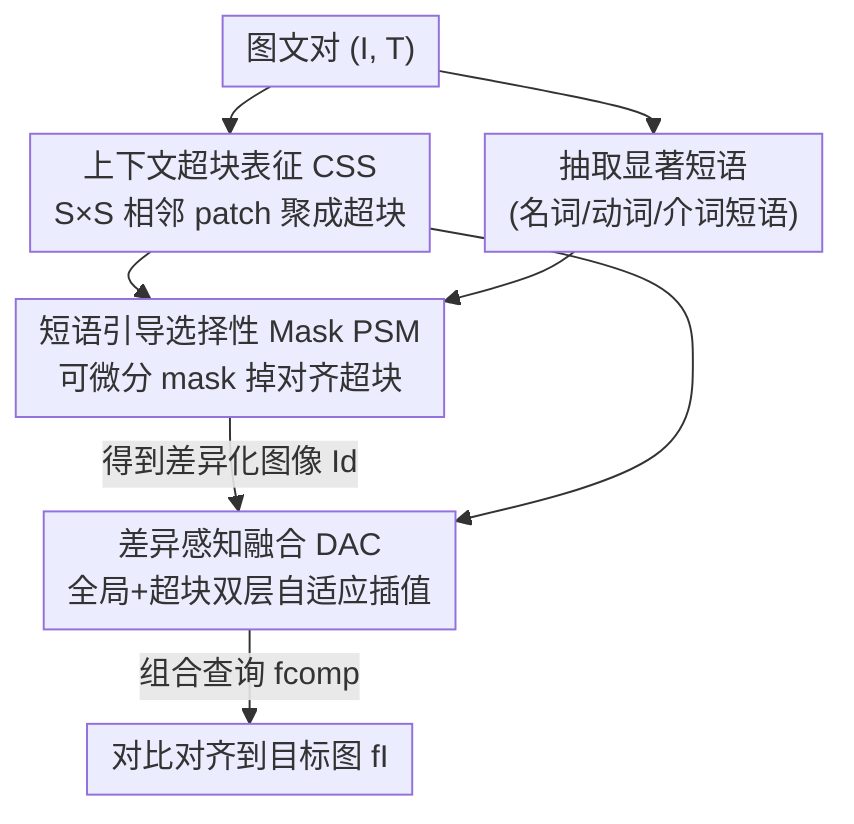

# Self-guided Semantic Inspection for Zero-Shot Composed Image Retrieval

**会议**: CVPR 2026  
**论文**: [CVF Open Access](https://openaccess.thecvf.com/content/CVPR2026/html/Zhang_Self-guided_Semantic_Inspection_for_Zero-Shot_Composed_Image_Retrieval_CVPR_2026_paper.html)  
**代码**: https://github.com/Orange1999/DiffComp  
**领域**: 多模态VLM  
**关键词**: 组合图像检索, 零样本, 跨模态差异, 自监督, 自适应融合

## 一句话总结
针对零样本组合图像检索（ZS-CIR）训练用"对齐图文对"、推理却要处理"不对齐的参考图+修改文本"的训练-推理失配问题，本文提出 DiffComp，用"先制造差异再融合"（Differentiate-then-Compose）的自监督范式，在训练阶段主动 mask 掉与文本短语对齐的视觉区域来人为引入跨模态差异，再做差异感知的自适应融合，在四个 ZS-CIR benchmark 上刷到 SOTA。

## 研究背景与动机
**领域现状**：组合图像检索（CIR）的任务是：给一张参考图 + 一句修改文本（如"把男人的衣服换成西装"），检索出反映该修改的目标图。有监督 CIR 依赖人工标注的（参考图,文本,目标图）三元组，构造成本高、难泛化。零样本 CIR（ZS-CIR）则借助预训练视觉语言模型（CLIP/BLIP）摆脱三元组监督，是当前主流方向。

**现有痛点**：ZS-CIR 普遍采用**一致性驱动**（consistency-driven）范式——在"语义对齐"的图文对上用对齐/重建目标训练。主流伪词方法（Pic2Word、LinCIR 等）把参考图映射成伪语言 token，推理时和修改文本拼接；融合类方法（如 SlerpTAT）则收紧视觉-语言空间的对齐来做特征级融合。但训练数据天然是**对齐**的，推理输入却是**不对齐、甚至冲突**的（参考图描述 A，文本要改成 B）。

**核心矛盾**：作者用 30 万训练样本与 CIR benchmark 的 CLIP 余弦相似度分布做了量化对比（Fig.1b），证实训练（对齐）与推理（不对齐）之间存在明显的**语义分布偏移**。一致性训练让模型只学会关注"共享语义"，却从没被要求去**识别和调和跨模态冲突**——而后者恰恰是 CIR 的本质。

**本文目标**：让模型在训练阶段就见到、并学会处理跨模态差异，从而弥合训练-推理 gap。分解为三个子问题：(1) 如何得到可控、可解释的局部视觉语义单元；(2) 如何在对齐数据上**人为制造**受控的跨模态差异；(3) 如何根据差异程度做自适应的视觉-文本融合。

**切入角度**：与其在对齐数据上强化一致性，不如**主动诱导差异**。作者提出范式转变：从"一致性驱动的对齐"转向"差异感知的组合"（difference-aware composition），把语义差异当作组合推理的核心信号。

**核心 idea**：用"先制造差异、再融合"（Differentiate-then-Compose）的自监督闭环，把对齐图文对改造成带受控差异的训练样本，逼模型学会感知并调和跨模态冲突。

## 方法详解

### 整体框架
DiffComp 是一个自监督框架：给一对标准训练图文对 $(I, T)$，先把图像切成"上下文超块"（super-patch）并从文本抽取显著短语；再**选择性地 mask 掉**与显著短语高度对齐的超块，从而在"被修改的图像"和"原始 caption"之间人为制造语义差异；最后用差异感知的融合模块把保留的视觉特征和文本特征自适应地融合，产出组合查询特征 $f_{comp}$，并用对比损失把它对齐到**未 mask 的目标图特征** $f_I$。推理时关闭 mask 模块，直接对参考图 $I_r$ + 修改文本 $T_m$ 做差异感知融合，再与 gallery 的全局特征算余弦相似度做检索。

三个核心模块依次串联：CSS（超块表征）→ PSM（短语引导的选择性 mask，仅训练用）→ DAC（差异感知融合）。

### 关键设计

**1. 上下文超块表征（CSS）：给 CLIP 补上可用的局部语义单元**

痛点很直接：CLIP/ViT 虽然有 patch token，但已有工作发现这些 patch 的隐状态倾向编码整体全局语义，并不能形成"独立、可解释"的局部区域表示——而 CIR 恰恰需要精确判断"哪块视觉内容该保留/修改/排除"。本文把相邻的 $S\times S$ 个 patch 分组成**空间连贯的超块**，介于"过细的 patch"和"过粗的全局特征"之间。给定图像切成 $L$ 个 patch 嵌入并加位置编码 $e_i = p_i + pos_i$，非重叠地分成 $N_s = L/S^2$ 个超块；每个超块独立过一次视觉编码器，取其 `[CLS]` 输出作为超块特征 $f^{SP}_j = \text{VisualEncoder}([e_{CLS}, e_{j_1}, \dots, e_{j_{S^2}}])$。这一步只是简单分组 + 复用编码器，几乎不增参数，却为后面的"短语-区域对应"和"差异调制融合"提供了合适粒度的语义单元。消融显示超块尺度从 $1\times1$（原始 patch）增到 $4\times4$ 持续涨点，但 $8\times8$ 过粗会模糊物体边界反而掉点。

**2. 短语引导的选择性 Mask（PSM）：在对齐数据上人为制造受控差异**

这是"Differentiate-then-Compose"里的 Differentiate 一步，专治训练-推理失配：训练时把图里**最该被文本修改掉**的区域 mask 掉，模拟推理时"参考图与文本冲突"的场景。分两步。第一步**超块-短语交互**：用 Stanford CoreNLP 从文本抽出名词/动词/介词短语集合 $K$，每个短语编码成 $f^K_i$，与每个超块算余弦相似度构成匹配矩阵 $S_{ij}$，再经 softmax 聚合得到短语显著分 $\omega_i$，反映各短语对"意图修改"的相对贡献。第二步**可微分 mask 采样**：每个超块按其短语对齐度 $z_j = \sum_i \omega_i S_{ij}$ 计算 mask 概率 $p_j = \sigma(\gamma z_j + b)$，再用 Gumbel-Softmax + 直通 argmax 得到二值 mask $m_j$，保证端到端可微。超块 mask 传播到 patch 后以对数偏置注入注意力：$\text{Attention}(Q,K,V) = \text{Softmax}(QK^\top/\sqrt{d_k} + \log(1-M^p)^\top)V$，得到差异化图像表征 $f_{I_d}$——一张"剔掉了与显著文本对齐内容、只剩残余线索"的图。比起随机 mask 或 CAM mask，短语级引导能精准对齐文本意图（消融里随机裁剪最差、句子级引导反而引入噪声）。

**3. 差异感知融合（DAC）：按语义差异程度自适应地混合视觉与文本**

痛点是：SlerpTAT 那类做法在 CLIP 空间用**全局、固定比例**的球面线性插值（Slerp）融合，无法适配局部语义差异。本文改成**全局 + 超块双层插值**：与文本对齐的区域多保留视觉语义，语义分歧大的区域更多受文本主导。全局层在文本特征 $f_T$ 与差异化图像特征 $f_{I_d}$ 之间用基础权重 $\lambda_{base}$ 做 Slerp 得 $\tilde f_{global}$。超块层对每个保留的超块算文本相似度 $sim_j = \langle f^{SP}_j, f_T\rangle / (\|f^{SP}_j\|\|f_T\|)$，自适应权重 $\lambda_j = \lambda_{base}\left(1 - \frac{\exp(sim_j)}{\max_i \exp(sim_i)}\right)$——相似度越高 $\lambda_j$ 越小，对齐区域保留更多视觉内容；再把每个超块朝文本插值。最终查询特征按系数 $\phi$ 把超块级与全局级结果加权：$f_{comp} = \phi\cdot\frac{1}{N_p}\sum_{j=1}^{N_p}\tilde f_j + (1-\phi)\cdot\tilde f_{global}$。这样实现了超块级的语义可控、差异引导的自适应融合。

### 损失函数 / 训练策略
总损失 $\mathcal{L} = \mathcal{L}_{align} + \mathcal{L}_{diff} + \mathcal{L}_{ratio}$ 三项。

$$\mathcal{L}_{align} = -\frac{1}{B}\sum_{i=1}^{B}\log\frac{\exp(s(f^{(i)}_{comp}, f^{(i)}_I)/\tau)}{\sum_{j=1}^{B}\exp(s(f^{(i)}_{comp}, f^{(j)}_I)/\tau)}$$

是单向对比损失，把组合查询 $f_{comp}$ 对齐到**未 mask 的目标图**特征 $f_I$（单向设计契合 query→target 检索目标）。$\mathcal{L}_{diff} = -\frac{1}{|M_1|}\sum_{j\in M_1} S_{k^*j}$ 鼓励 mask 掉与**最显著短语** $k^*$ 最相关的区域（$M_1$ 是被 mask 的超块集合），引导有针对性的差异诱导。$\mathcal{L}_{ratio} = \left(\frac{1}{N_s}\sum_j m_j - \eta\right)^2$ 把 mask 比例正则到目标 $\eta$ 附近，避免退化解。

训练细节：在 10% 的 CC3M 上训练，backbone 用 CLIP ViT-L/14（超块尺度 $S=4$、mask 比例 $\eta=0.7$）和 BLIP ViT-L/16（$S=2$、$\eta=0.5$）；Gumbel-Softmax 温度前半程从 1.0 线性退火到 0.1；$\lambda_{base}=0.8$、$\phi=0.4$；单张 A100、batch 64、AdamW（lr $1\times10^{-6}$），训 10 epoch，仅部分微调 backbone，三个模块新增参数与计算开销可忽略。

## 实验关键数据

### 主实验
四个 ZS-CIR benchmark：FashionIQ（服饰属性，R@10/50）、CIRR（真实场景，R@1/5/10/50）、CIRCO（120K COCO gallery、多 GT，mAP@5–50）、GeneCIS（条件相似推理，R@1/2）。下表摘 FashionIQ 平均与 CIRR（CLIP/BLIP 双 backbone）：

| Backbone | 方法 | FashionIQ Avg R@10 | FashionIQ Avg R@50 | CIRR R@1 | CIRR R@5 |
|----------|------|------|------|------|------|
| CLIP L/14 | HIT (ICCV'25) | 30.30 | 51.00 | 27.90 | 57.60 |
| CLIP L/14 | PrediCIR (CVPR'25) | 30.10 | 52.30 | 27.20 | 57.00 |
| CLIP L/14 | **DiffComp** | **32.62** | **53.85** | **32.36** | **62.90** |
| BLIP L/16 | HIT (ICCV'25) | 34.50 | 55.80 | 36.90 | 67.70 |
| BLIP L/16 | **DiffComp** | **34.71** | **56.14** | **39.72** | **68.64** |

CIRCO 上 CLIP backbone 与 SlerpTAT 持平（mAP5 16.19 vs 16.98，但 SlerpTAT 用了约 8 倍训练数据），BLIP backbone 刷新 SOTA（mAP5 18.35）。GeneCIS 在 Focus 与 Object 维度取得最高平均 Recall。整体看，CIRR 上低召回阈值（R@1）增益最大，说明语义对齐更精准。

### 消融实验
模块组合与变体配置（FashionIQ R@10 / CIRR R@1）：

| 配置 | R@10 | R@1 | 说明 |
|------|------|------|------|
| Baseline（标准 patch+随机 mask+简单融合） | 29.5 | 28.4 | 起点 |
| CSS | 30.1 | 29.5 | 单加超块即明显涨 |
| PSM | 29.8 | 28.9 | 单用提升有限/不稳 |
| DAC | 29.3 | 29.6 | 单用提升有限/不稳 |
| CSS+PSM | 31.2 | 30.4 | CSS 提供结构化语义后 PSM 才有效 |
| CSS+DAC | 30.8 | 31.0 | — |
| **CSS+PSM+DAC（Full）** | **32.6** | **32.4** | 比 CSS 单独 +2.5 / +2.9 |

| 变体维度 | 配置 | R@10 | R@1 |
|----------|------|------|------|
| CSS 聚合尺度 | grid 2×2 | 31.9 | 31.5 |
| CSS 聚合尺度 | grid 4×4（默认） | 32.6 | 32.4 |
| CSS 聚合尺度 | grid 8×8（过粗） | 29.6 | 29.7 |
| CSS 聚合方式 | K-Means 聚类 | 31.6 | 32.8 |
| PSM mask 生成 | 随机裁剪 | 29.8 | 30.9 |
| PSM mask 生成 | CAM masking | 31.2 | 31.5 |
| PSM mask 生成 | hard masking | 30.2 | 31.0 |
| PSM 引导粒度 | 句子级 | 31.6 | 32.0 |

### 关键发现
- **CSS 是地基**：PSM、DAC 单独用提升有限甚至不稳，因为原始 patch token 缺乏结构化语义；一旦配上 CSS（把 patch 聚成语义连贯超块），两者才显著起效——说明三模块是互补关系。
- **超块尺度有最优**：$1\times1\to4\times4$ 持续涨（适度空间聚合增强语义连贯又保留局部细节），$8\times8$ 反而掉点（模糊物体边界、削弱差异建模）。K-Means 聚类在 CIRR 略好、FashionIQ 略差，且簇大小不一拖累并行效率，故默认用规则 grid。
- **短语级引导最优**：随机裁剪最差（无语义选择性，常丢相关区域）；CAM 基于视觉显著性，可能与短语级文本线索错位；句子级语境更丰富但引入更多噪声。mask 比例约 0.7、$\lambda_{base}=0.8$、$\phi\approx0.4$ 时性能最佳。
- **效率友好**：CIRR 上 R@1/R@5 平均 47.6%，比 HIT 高 4.8%、比 Pic2Word 高近 10%，且只用 10% CC3M、单卡 4 小时训完；轻量线性混合 + CSS 局部特征也让推理快于伪词映射类（PrediCIR、HIT）。

## 亮点与洞察
- **范式层面的"反向操作"**：别人都在训练时强化"一致性/对齐"，本文反其道而行——**主动制造跨模态差异**来匹配推理时的不对齐输入。这种"用自监督在对齐数据上人为造差异"的思路，可迁移到任何"训练对齐、推理冲突"的跨模态任务（如指令式图像编辑、视觉问答中的反事实）。
- **超块（super-patch）是个便宜又好用的中间粒度**：不重训大模型、不加监督，只是把相邻 patch 分组再过一次编码器取 `[CLS]`，就拿到了"比 patch 稳、比全局细"的局部语义单元——这是后续短语对齐和差异调制融合能 work 的前提。
- **差异越大、文本越主导的自适应插值**：$\lambda_j$ 随相似度反向变化，让"对齐区域多保视觉、分歧区域多听文本"，把全局固定比例的 Slerp 升级成空间可选择的融合，是对 SlerpTAT 的直接改进。
- **可解释性**：可视化 $(1-\lambda_j)$ 能看到模型在不同修改文本下对视觉保留的空间调制（如"close coverage on animal instead of man"会抑制人物区域），训练得到的 mask 也对应可读的短语-区域关系。

## 局限与展望
- **依赖外部短语解析器**：PSM 用 Stanford CoreNLP 抽名词/动词/介词短语，短语质量直接影响差异诱导；CoreNLP 对非英语或口语化/复杂修改文本可能解析不佳（⚠️ 论文未深入讨论该依赖的鲁棒性）。
- **训练时多过几次编码器**：CSS 让每个超块独立过一次视觉编码器，虽说作者称开销可忽略、并放在 Appendix 分析，但超块数量多时训练前向次数会上升（⚠️ 具体复杂度以原文 Appendix A 为准）。
- **CIRCO 上仅与 SlerpTAT 持平（CLIP backbone）**：作者解释 SlerpTAT 用了约 8 倍数据，DiffComp 用 1/8 数据打平算优势；但在同等大数据下谁更强，文中未给同数据量对比。
- **超参较敏感**：mask 比例、$\lambda_{base}$、$\phi$、超块尺度都有明显最优区间，换数据集/backbone 可能需重新调（CLIP 用 $S=4,\eta=0.7$，BLIP 用 $S=2,\eta=0.5$，本身就说明要按 backbone 调）。

## 相关工作与启发
- **vs 伪词映射方法（Pic2Word / LinCIR / Context-I2W）**：它们把参考图压成伪语言 token 再和文本拼接，常扭曲视觉语义、依赖启发式融合；本文不做伪词压缩，直接在特征层显式建模视觉-语言差异，避免了语义压缩损失（FashionIQ 上对细粒度属性推理增益明显）。
- **vs 融合类方法 SlerpTAT（ECCV'24）**：SlerpTAT 用全局、固定比例的 Slerp 融合，对局部语义差异不敏感、且对数据质量敏感；DiffComp 的 DAC 做全局+超块双层自适应插值，缓解全局融合的过平滑问题，并能用 1/8 数据打平或超过它。
- **vs LLM 生成 caption 类方法**：那类直接从文本生成目标 caption，丢失视觉 grounding；DiffComp 不需 LLM、不需外部模块，保持视觉接地的同时实现可控组合。
- **启发**：把"训练-推理失配"显式量化（用相似度分布对比）再针对性地用自监督造差异来弥合 gap，是一个干净的研究范式——凡是"训练分布 ≠ 推理分布"的检索/匹配任务都可借鉴这套"诊断分布偏移 → 自监督造对应样本 → 差异感知融合"的闭环。

## 评分
- 新颖性: ⭐⭐⭐⭐⭐ 把"一致性驱动"翻转成"差异驱动"的范式转变 + 短语引导可微 mask 制造受控差异，概念清晰且新。
- 实验充分度: ⭐⭐⭐⭐ 四 benchmark + 双 backbone + 模块/变体/超参消融齐全；但 CIRCO 同数据量对比缺失。
- 写作质量: ⭐⭐⭐⭐⭐ 动机用分布对比量化、方法三模块层层递进、公式完整，叙述自洽好读。
- 价值: ⭐⭐⭐⭐ SOTA + 高效（10% 数据、单卡 4h），且范式可迁移到其他跨模态失配任务，实用价值高。

<!-- RELATED:START -->

## 相关论文

- [\[CVPR 2026\] STiTch: Semantic Transition and Transportation in Collaboration for Training-Free Zero-Shot Composed Image Retrieval](stitch_semantic_transition_and_transportation_in_collaboration_for_training-free.md)
- [\[CVPR 2026\] G-MIXER: Geodesic Mixup-based Implicit Semantic Expansion and Explicit Semantic Re-ranking for Zero-Shot Composed Image Retrieval](g_mixer_geodesic_mixup_based_implicit_semantic_expansion_for_zero_shot_cir.md)
- [\[CVPR 2026\] ReCALL: Recalibrating Capability Degradation for MLLM-based Composed Image Retrieval](recall_recalibrating_capability_degradation_for_mllm-based_composed_image_retrie.md)
- [\[CVPR 2026\] ConeSep: Cone-based Robust Noise-Unlearning Compositional Network for Composed Image Retrieval](conesep_cone-based_robust_noise-unlearning_compositional_network_for_composed_im.md)
- [\[CVPR 2026\] Air-Know: Arbiter-Calibrated Knowledge-Internalizing Robust Network for Composed Image Retrieval](air-know_arbiter-calibrated_knowledge-internalizing_robust_network_for_composed_.md)

<!-- RELATED:END -->
