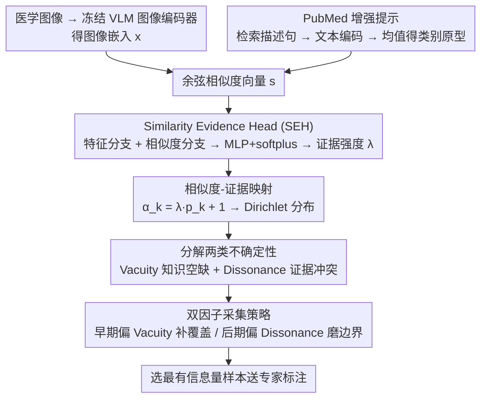

# Similarity-as-Evidence: Calibrating Overconfident VLMs for Interpretable and Label-Efficient Medical Active Learning

**会议**: CVPR2026  
**arXiv**: [2602.18867](https://arxiv.org/abs/2602.18867)  
**代码**: 待确认  
**领域**: 多模态VLM  
**关键词**: 主动学习, 视觉语言模型, 不确定性量化, Dirichlet分布, 证据深度学习, 医学图像分类, 校准

## 一句话总结

提出 Similarity-as-Evidence (SaE) 框架，将 VLM 的文本-图像相似度重新解释为 Dirichlet 证据，通过 Similarity Evidence Head (SEH) 校准过度自信的 softmax 输出，并基于 vacuity（知识空缺）和 dissonance（证据冲突）的双因子采集策略实现可解释、高效的医学主动学习，在 10 个数据集上以 20% 标注预算达到 82.57% 的 SOTA 宏平均准确率。

## 研究背景与动机

**标注成本高昂**：医学图像分析中专家标注受时间、成本和隐私法规限制，主动学习（AL）通过选择最有信息量的样本来最大化有限标注预算下的模型性能。

**冷启动问题**：传统 AL 方法在初始标注极少（如每类 1-3 个）时模型预测不可靠，导致早期轮次样本选择效率低下，浪费标注资源。

**VLM 过度自信**：VLM 通过温度缩放 softmax 将余弦相似度转为概率，本质上将几何接近性当作确定性，导致严重的校准偏差——对错误预测也赋予高置信度。

**误导采集函数**：过度自信使模型倾向于选择它认为已经"理解"的样本，而非能最大提升性能的样本，浪费宝贵的标注预算。

**缺乏可解释性**：现有 AL 策略依赖标量不确定性评分（熵/margin），只衡量不确定性大小，无法揭示不确定性来源——是缺乏知识还是存在冲突假设。

**临床需求**：临床工作流中，专家需要理解为什么某个病例被选中标注——是未见表型还是模糊决策边界——现有方法无法提供此类可解释的选择理由。

## 方法详解

### 整体框架

SaE 想解决的是"VLM 把余弦相似度当成确定性、结果过度自信，拿去做主动学习就会挑错样本"这件事。它的做法是把相似度重新解释成证据：冻结 VLM 图像编码器，只训练一个把相似度映射成 Dirichlet 证据的 Similarity Evidence Head (SEH) 和 CoOp 风格的可学习提示，再从校准后的分布里分解出两类不确定性来驱动样本采集。整条链路是 PubMed 增强提示构建富语义文本原型 → SEH 把相似度变成证据参数 → 相似度-证据映射分解出 vacuity/dissonance → 双因子策略选样本。

### 关键设计

**1. PubMed 增强提示：让类别原型带上领域语义**

单靠类名当文本原型，语义太薄，和医学图像对齐不准。SaE 对每个类别 $k$ 从 PubMed 检索 $\delta_k$ 条描述性句子，过冻结文本编码器后 L2 归一化再取均值，得到语义丰富的类别原型 $\bar{\hat{\mathbf{e}}}^k_{\text{txt}}$，并算出余弦相似度向量 $\mathbf{s} = [s_1, \dots, s_K]$ 作为后续证据模型的输入。

**2. Similarity Evidence Head (SEH)：把相似度向量当成"证据预算的分配比例"**

VLM 的 softmax 把几何接近性直接当成了置信度，这正是过度自信的根源。SEH 用一个双分支 MLP 来重新分配证据：特征分支把冻结的图像嵌入 $\mathbf{x}$ 编码为 $z_f$，相似度分支把 $\mathbf{s}$ 映射为 $z_s$，两者拼接后过浅层 MLP + softplus 输出一个严格为正的证据强度标量 $\lambda$。核心思想是把相似度向量看成"总证据预算怎么在各类间分配"，而预算总量由 $\lambda$ 控制——证据多寡不再等同于相似度高低。

**3. 相似度-证据映射：从 Dirichlet 分布里分解出两种不确定性**

光有证据标量还不够，主动学习需要知道"不确定从哪来"。SaE 把 Dirichlet 浓度参数写成 $\alpha_k(x) = \lambda(x) \cdot p_k(x) + 1$（$p_k$ 是 VLM softmax 给的类别概率），由此分解出两类可解释信号：Vacuity（空缺度）$\text{Vac}(x) = K / \sum_k \alpha_k(x)$ 衡量总证据不足，对应罕见或未见表型；Dissonance（冲突度）则基于各类 belief mass 之间的均衡度，衡量类别间证据冲突，对应模糊的决策边界。一个标量不确定性做不到的"是缺知识还是有冲突"，在这里被拆开了。

**4. 双因子采集策略：早期补覆盖、后期磨边界**

知道了两种不确定性，还要安排在主动学习的不同阶段怎么用。SaE 用线性调度 $w_v(t) = 1 - (t-1)/(T-1)$、$w_d(t) = (t-1)/(T-1)$：早期权重偏向高 vacuity 样本，先把未见表型覆盖到；后期权重偏向高 dissonance 样本，再去精炼决策边界。这条"先覆盖后精炼"的顺序和临床医生的推理逻辑也对得上，同时给出了可被专家理解的选样理由。

### 损失函数

SEH 用一个双目标损失 $\mathcal{L}_{\text{SEH}}$ 训练：

$$\mathcal{L}_{\text{SEH}} = \text{MSE}\left(\frac{1}{\lambda_i + \epsilon},\; l_{\text{cls},i}\right) + \beta \cdot \text{MSE}\left(\lambda_i,\; \frac{1}{H[\mathbf{p}_i] + \epsilon}\right)$$

第一项把逆证据和观测到的分类难度对齐（难样本 → 高 $l_{\text{cls}}$ → 低 $\lambda$）；第二项让证据强度和冻结 VLM 的内在确定性一致（低熵 → 高 $\lambda$），其中 $H[\mathbf{p}_i]$ 是 detached target、不回传梯度；$\beta = 0.5$ 平衡两项。

## 实验

### 主实验结果

在 10 个公开医学数据集上（覆盖 9 个器官），20% 标注预算下 SaE 宏平均准确率 82.57%，超越最强基线 MedCoOp+BADGE 的 77.75%（+4.82%）。

| 数据集 | Random | PCB | MedCoOp+Coreset | MedCoOp+Entropy | MedCoOp+BADGE | **SaE** |
|---|---|---|---|---|---|---|
| DermaMNIST | 69.42 | 71.07 | 74.11 | 74.56 | 75.46 | **80.21** |
| Kvasir | 71.10 | 72.92 | 80.83 | 81.92 | 81.42 | **88.58** |
| RETINA | 51.48 | 53.55 | 62.78 | 65.22 | 66.88 | **75.22** |
| LC25000 | 93.92 | 95.71 | 96.93 | 97.47 | 97.25 | **99.23** |
| BTMRI | 83.40 | 85.50 | 86.26 | 89.92 | 89.57 | **93.46** |
| BUSI | 57.10 | 58.47 | 66.53 | 72.03 | 72.88 | **79.15** |
| **宏平均** | 68.01 | 71.41 | 73.84 | 77.39 | 77.75 | **82.57** |

### 消融实验

| 变体 | 宏平均 (%) |
|---|---|
| Random | 68.01 |
| + Dual-factor score（分类器 logits） | 73.35 (+5.34) |
| + VLM similarity 替代 logits | 78.62 (+10.61) |
| **SaE: + SEH 校准** | **82.57 (+14.56)** |

SEH 贡献最大的增量提升 (+3.95%)，证明校准是关键。

### 关键发现

1. **冷启动缓解**：到第 3 轮（60% 预算），SaE 平均达到最终准确率的 96.7%，BTMRI 上第 3 轮即达 92.92%（最终 93.46%，比值 99.42%）。
2. **校准优越性**：BTMRI 上 SaE 的 ECE=0.021、NLL=0.425，远优于 PCB 的 ECE=0.116/NLL=0.757 和 BADGE 的 ECE=0.036/NLL=0.548。
3. **训练稳定性**：SaE 从第一个 epoch 即保持最低且最稳定的训练损失，而 BADGE 存在高初始损失和显著不稳定性。
4. **最大提升场景**：RETINA (+8.34%)、Kvasir (+6.66%)、BUSI (+6.27%) 提升最为显著，表明在类别不平衡/数据稀缺场景下优势更明显。

## 亮点

- **理论创新**：首次将 VLM 相似度重新解释为证据并参数化 Dirichlet 分布，在 VLM 过度自信问题上提供了原理性解决方案
- **可解释性**：vacuity/dissonance 分解让标注选择具有临床可理解的理由（未见表型 vs 模糊诊断），而非黑箱评分
- **双因子调度设计精妙**：早期覆盖 → 后期精炼的自适应策略与临床推理逻辑一致
- **实验全面**：10 个数据集、9 个器官、5 个种子，结果一致且标准差小
- **轻量高效**：仅训练 SEH 和可学习提示，冻结 VLM 编码器，单卡 RTX 4090 即可运行

## 局限性

- 仅评估分类任务，未验证在分割/检测等其他医学图像任务上的泛化能力
- PubMed 增强提示的质量依赖于检索结果，罕见疾病可能检索不到高质量描述
- 线性调度 $w_v(t)/w_d(t)$ 是启发式设计，未与自适应调度策略对比
- 仅使用 BiomedCLIP (ViT-B/16) 作为骨干，未验证对其他 VLM（如 CONCH、UNI）的适用性
- 双因子只考虑 vacuity 和 dissonance，未纳入样本多样性/代表性等互补信号

## 相关工作

- **医学 AL**：Least-Confidence/Margin/Entropy 等不确定性采样对伪影和类别不平衡敏感；Coreset/BADGE 等多样性方法计算开销大
- **VLM 校准**：CLIP 系列模型存在严重的过度自信问题，后处理温度缩放仅提供全局调整，不解释不确定性来源
- **证据深度学习 (EDL)**：将预测建模为 Dirichlet 分布实现不确定性分解，但标准 EDL 从分类 logits 直接变换证据，在早期 AL/分布偏移下表现脆弱
- **VLM+AL**：PCB 等方法将 VLM 不确定性压缩为 softmax 标量，继承过度自信问题且缺乏不确定性源分解

## 评分

- 新颖性: ⭐⭐⭐⭐ — 将相似度→证据的视角转换非常巧妙，vacuity/dissonance 分解为医学 AL 提供了新范式
- 实验充分度: ⭐⭐⭐⭐⭐ — 10 个数据集、多基线对比、详尽消融、校准分析、冷启动分析，非常完整
- 写作质量: ⭐⭐⭐⭐ — 结构清晰，动机阐述充分，图表质量高
- 价值: ⭐⭐⭐⭐ — 对医学图像标注效率提升具有实际临床价值，框架通用性强

<!-- RELATED:START -->

## 相关论文

- [\[CVPR 2026\] Perceptual-Evidence Anchored Reinforced Learning for Multimodal Reasoning](perceptual-evidence_anchored_reinforced_learning_for_multimodal_reasoning.md)
- [\[CVPR 2026\] Relational Visual Similarity](relational_visual_similarity.md)
- [\[CVPR 2026\] Sparse Spectral LoRA: Routed Experts for Medical VLMs](sparse_spectral_lora_routed_experts_for_medical_vlms.md)
- [\[CVPR 2026\] RNED: Rotary Number Encoding and Decoding for Medical VLMs](rned_rotary_number_encoding_and_decoding_for_medical_vlms.md)
- [\[CVPR 2026\] Towards Calibrating Prompt Tuning of Vision-Language Models](towards_calibrating_prompt_tuning_of_vision-language_models.md)

<!-- RELATED:END -->
