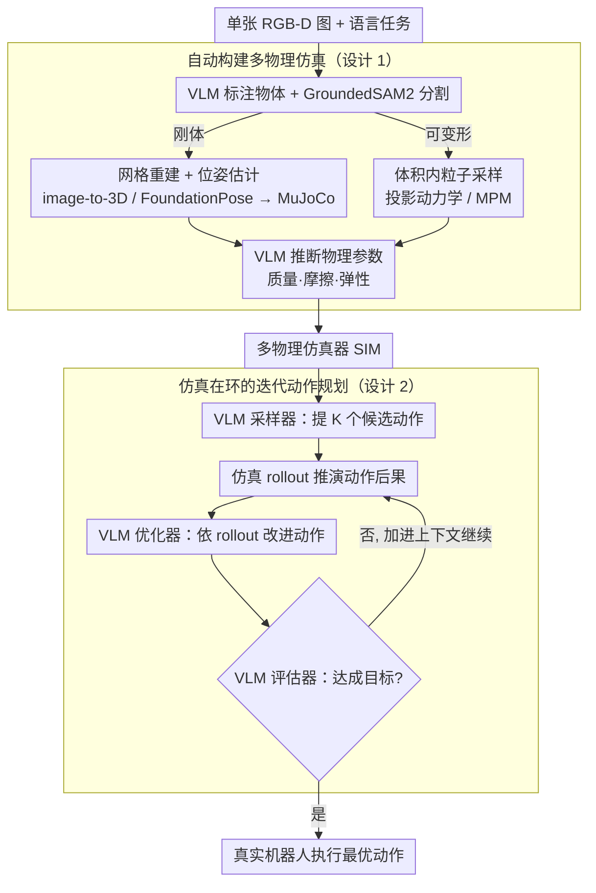

# SIMPACT: Simulation-Enabled Action Planning using Vision-Language Models

**会议**: CVPR 2026  
**arXiv**: [2512.05955](https://arxiv.org/abs/2512.05955)  
**代码**: 无（coming soon）  
**领域**: 多模态VLM / 机器人操作  
**关键词**: 仿真推理, 视觉语言模型, 动作规划, 物理推理, 机器人操作

## 一句话总结

SIMPACT 提出一种测试时的仿真增强动作规划框架，从单张 RGB-D 图像自动构建物理仿真环境，使 VLM 能够提出动作、观察仿真结果并迭代优化推理，无需额外训练即可在刚体和可变形物体操作任务上达到 SOTA 性能。

## 研究背景与动机

**领域现状**：视觉-语言模型（VLMs）如 GPT-4V、Gemini 等展现了卓越的常识推理和语义理解能力，被广泛探索用于机器人任务规划。然而，VLMs 的训练数据来源于互联网上的静态图像-文本对，不包含因果交互或动作条件下的变化。

**现有痛点**：(1) VLMs 缺乏对物理动力学的深度理解——它们不知道"推一个物体会发生什么"、"不同力度的推动效果有何区别"；(2) 现有基于 VLM 的机器人方法通常直接让模型输出动作参数，但模型缺乏物理验证能力；(3) 不训练新模型的情况下，如何让 VLM "理解"物理世界仍是开放问题。

**核心矛盾**：VLMs 拥有强大的语义推理能力，但缺乏物理动力学理解。这根本上是因为互联网数据中不存在"动作→结果"的因果链信息。

**本文目标**：在测试时为 VLM 补充物理推理能力，无需额外训练，让 VLM 能够进行需要精细物理理解的机器人操作任务规划。

**切入角度**：作者观察到物理仿真器（如 PyBullet、MuJoCo 等）可以提供精确的物理预测，如果能在测试时将仿真器作为"世界模型"嵌入 VLM 的推理循环中，就能弥补 VLM 的物理理解不足。

**核心 idea**：在 VLM 推理过程中嵌入物理仿真循环——VLM 提出动作 → 仿真器执行 → VLM 观察仿真结果 → VLM 迭代修正，实现"仿真即世界模型"的物理增强推理。

## 方法详解

### 整体框架

SIMPACT 想解决的核心问题是：VLM 有语义常识却不懂物理动力学，让它直接吐动作参数就是在"盲猜"。它的破局思路是在测试时给 VLM 外挂一个物理仿真器，把"动作会导致什么后果"这件事交给仿真器算，VLM 只负责提想法和读结果。整条 pipeline 从一张 RGB-D 图像出发，分两个阶段：**先建仿真**——把这张图自动重建成一个可交互的仿真场景（按物体是刚体还是可变形自动配两套物理引擎，并由 VLM 推断物理参数）；**再做规划**——让 VLM 在仿真里反复"提出动作→观察 rollout→评估→修正动作"，直到动作能把场景推到目标状态，最后把这串收敛好的动作搬到真实机器人上执行。全程 VLM 权重冻结，不做任何训练。

### 关键设计

**1. 从单张 RGB-D 图自动构建多物理仿真：把感知门槛压到"只要一张图"**

物理仿真要跑起来，前提是有 3D 几何和物理参数，但逐场景做 3D 扫描、手工标质量摩擦系数显然不现实——这一步就是要把门槛降到"只需要一张图"。给定 RGB-D 图像和语言任务，pipeline 先用 VLM 根据指令生成物体标签，再用 GroundedSAM2 把每个物体从图里分割出来，然后据物体类型自动切换两套物理引擎（刚体还是可变形同样由 VLM 判定）：刚体走基于网格的仿真——用 image-to-3D 模型重建完整三角网格、按点云包围盒尺寸做缩放、用 FoundationPose 估 6DoF 位姿，载入 MuJoCo；可变形物体走基于粒子的仿真——把分割掩码反投影成 3D 表面点、在物体表面与桌面之间的体积内均匀采样粒子，刚性形变用投影动力学（projective dynamics）、软体用物质点法（MPM）。两条支路最后都由 VLM 凭常识推断各自的物理参数（刚体的质量、摩擦、质心；可变形体的弹性、塑性）。这里的关键判断是：VLM 估的参数当然不精确，但仿真要的不是精确数值，而是"推一下大致会怎么动"的正确方向——实验也印证了，粗略但方向正确的物理预测远胜过完全没有物理预测。这套双引擎让"绳子操作""橡皮泥塑形"这些传统 VLM 机器人方法的盲区，第一次进入了可规划范围。

**2. 仿真在环的 VLM 迭代动作规划：让仿真器当 VLM 的"试错沙盒"**

VLM 的常识能给出合理的初始猜测（往哪推、推多大力、接触点在哪），但它没法验证这一推下去物体究竟滑多远、会不会撞到旁边——这一步就是把验证权交给仿真。规划按论文的 Algorithm 1 迭代：先让 VLM **采样器**基于场景上下文（初始观测、机器人本体感知、物体 6DoF 位姿）提出 $K$ 个初始候选动作序列，每个都丢进仿真做 rollout（逐步推演得到末态）；接着 VLM **优化器**综合已有的动作集与对应 rollout，产出一条改进后的新动作；VLM **评估器**再看这条动作的 rollout 是否达成目标——成功就搬到真实机器人执行，否则把新动作和 rollout 加进上下文继续下一轮，直到成功或达到迭代上限 $K_{max}$。同一个冻结的 VLM 靠三套不同的 system prompt 分别扮演采样器、优化器、评估器三个角色。值得注意的是，这里没有显式的数值损失函数，扮演评价函数角色的就是 VLM 自己的视觉语义判断——它看着 rollout 末态画面判断"像不像目标状态"，把语义指导和物理保障缝在了一起。

### 一个完整示例：把绳子拉成目标形状

以"把桌上一根散乱的绳子拉成 U 形"为例走一遍。**建仿真**：从 RGB-D 图抠出绳子，识别为可变形物体，载入粒子基仿真，VLM 估出绳子的长度、刚度等参数。**初始采样**：VLM 采样器一次提出 $K$ 个候选抓取点+拉动方向，分别仿真，看到大部分 rollout 把绳子拉成了直线或 J 形，只有抓中段往两侧拉的那个最接近 U 形。**迭代优化**：VLM 优化器综合这批候选和它们的 rollout，每轮产出一条改进动作（如在最优候选邻域微调抓取点和力度），再仿真、再由评估器判断是否达标；rollout 里 U 形的两个弯逐轮更对称。如此迭代直到评估器判定成功或触达上限 $K_{max}$，最后把收敛动作搬到真实机器人执行。整个过程没有一次需要真实试错，所有"试错"都发生在仿真里。

> ⚠️ 上述示例中的物体参数与迭代轮次为示意性说明，具体数值以原文为准。

### 损失函数 / 训练策略

SIMPACT 是纯推理时框架，VLM 权重全程冻结，没有训练或微调，因此也没有传统意义的损失函数。动作好坏的判定由 VLM 看仿真 rollout 的视觉结果隐式给出——它充当评价函数（TASKSUCCESS），判断 rollout 末态是否达成目标。流程上先采样 $K$ 个初始候选动作并各自仿真，之后每轮由优化器产出一条改进动作、仿真、评估，循环到成功或触达迭代上限 $K_{max}$。

> ⚠️ $K$ / $K_{max}$ 等具体取值以原文为准。

## 实验关键数据

### 主实验

| 任务 | SIMPACT | RT-2 | Code-as-Policies | VoxPoser | 说明 |
|------|---------|------|------------------|----------|------|
| 刚体推动到目标位置 | 最佳 | 较差 | 中等 | 中等 | 精细力度控制 |
| 物体排序/整理 | 最佳 | 一般 | 较好 | 一般 | 多物体规划 |
| 绳子操作 | 最佳 | 无法完成 | 无法完成 | 较差 | 可变形物体 |
| 橡皮泥塑形 | 最佳 | 无法完成 | 无法完成 | 无法完成 | 高难度变形 |
| 多物体碰撞预测 | 最佳 | 较差 | 较差 | 一般 | 接触动力学 |

### 消融实验

| 配置 | 平均成功率 | 说明 |
|------|----------|------|
| Full SIMPACT | 最佳 | 仿真优化 + 迭代精炼 |
| w/o Simulation (直接VLM) | 显著下降 | VLM直接输出动作缺乏物理验证 |
| w/o Iterative Refinement | 明显下降 | 一次采样无精细调优 |
| Random Physics Params | 轻微下降 | 物理参数的精确性有一定影响 |
| 仿真仅1轮 | 低于多轮 | 迭代改善效果显著 |

### 关键发现

- 仿真环带来的物理预测是性能提升的最大贡献因素——移除仿真后，VLM 在需要精细力度控制的任务上基本失败
- 可变形物体操作（绳子、橡皮泥）是传统方法的盲区，SIMPACT 通过粒子仿真首次展示了 VLM 在这类任务上的可行性
- 即使仿真的物理参数不完全精确（VLM 估计的），仿真反馈仍然比无仿真好得多——说明"粗略但正确方向的物理预测"远好于"无物理预测"
- 系统对物体外观变化（不同颜色、形状）和干扰物具有较好的鲁棒性

## 亮点与洞察

- **"仿真即世界模型" 的优雅思路**：不修改 VLM，不训练新模型，而是在测试时给 VLM 配备一个物理仿真器作为"大脑中的物理引擎"。这种思路可以推广到任何需要物理理解的推理任务
- **从单张 RGB-D 图像自动建仿真**：极大降低了仿真构建的门槛，使该方法在新场景中快速部署成为可能。虽然仿真精度有限，但"有仿真"远好于"无仿真"
- **刚体+可变形统一框架**：同时处理刚体和可变形操作的能力在 VLM-based 机器人方法中首次实现

## 局限与展望

- 仿真构建依赖深度信息和分割模型，在室外或深度噪声大的场景中可能不可靠
- VLM 估计物理参数（质量、摩擦等）的精度有限，对物理参数敏感的任务可能表现不佳
- 仿真-现实的 gap（sim-to-real gap）仍然存在，特别是对可变形物体的仿真精度
- 每次推理需要构建仿真环境并运行多轮 rollout，推理延迟较高
- 目前限于桌面级操作，对更复杂的长程任务（如烹饪、装配）的扩展需要进一步研究

## 相关工作与启发

- **vs Code-as-Policies**: CaP 让 LLM 直接输出机器人控制代码，缺乏物理验证。SIMPACT 通过仿真为 VLM 提供了物理"沙盒"来预测动作后果
- **vs VoxPoser**: VoxPoser 使用 VLM 生成价值函数来引导规划，但不进行显式的物理仿真。SIMPACT 的仿真提供了更准确的物理预测
- **vs RT-2/Octo 等end-to-end方法**: 这些方法需要大量机器人数据训练，SIMPACT 纯依靠预训练 VLM + 仿真，无需额外训练数据

## 评分

- 新颖性: ⭐⭐⭐⭐⭐ 仿真增强VLM推理的思路非常新颖且优雅，开辟了新方向
- 实验充分度: ⭐⭐⭐⭐ 5个真实世界任务验证，包含刚体和可变形，鲁棒性实验充分
- 写作质量: ⭐⭐⭐⭐ 方法描述清晰，可视化丰富
- 价值: ⭐⭐⭐⭐⭐ 对VLM机器人领域有重要启发，无需训练是实用优势

<!-- RELATED:START -->

## 相关论文

- [\[CVPR 2025\] Evaluating Vision-Language Models as Evaluators in Path Planning](../../CVPR2025/multimodal_vlm/evaluating_vision-language_models_as_evaluators_in_path_planning.md)
- [\[CVPR 2026\] Joint-Aligned Latent Action: Towards Scalable VLA Pretraining in the Wild](joint-aligned_latent_action_towards_scalable_vla_pretraining_in_the_wild.md)
- [\[ICCV 2025\] Perspective-Aware Reasoning in Vision-Language Models via Mental Imagery Simulation](../../ICCV2025/multimodal_vlm/perspective-aware_reasoning_in_vision-language_models_via_mental_imagery_simulat.md)
- [\[CVPR 2026\] From Observation to Action: Latent Action-based Primitive Segmentation for VLA Pre-training in Industrial Settings](from_observation_to_action_latent_action-based_primitive_segmentation_for_vla_pr.md)
- [\[CVPR 2026\] Understanding Task Transfer in Vision-Language Models](understanding_task_transfer_in_vision-language_models.md)

<!-- RELATED:END -->
