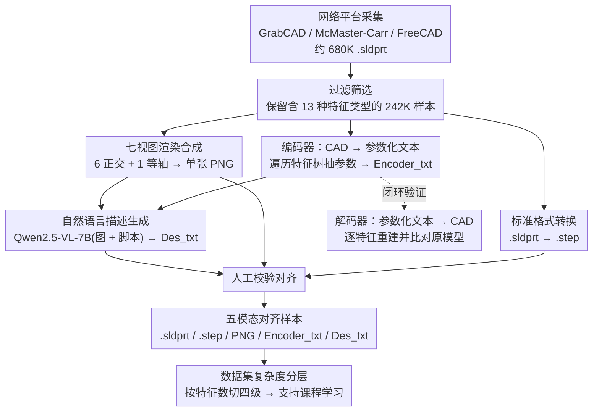

# SldprtNet: A Large-Scale Multimodal Dataset for CAD Generation in Language-Driven 3D Design

**会议**: CVPR2026  
**arXiv**: [2603.13098](https://arxiv.org/abs/2603.13098)  
**代码**: 无  
**领域**: others (3D CAD Generation / Multimodal Dataset)  
**关键词**: CAD dataset, language-driven 3D design, multimodal alignment, parametric modeling, text-to-CAD, encoder-decoder, SolidWorks

## 一句话总结

构建了包含 242,000+ 工业零件的大规模多模态 CAD 数据集 SldprtNet，每个样本包含 .sldprt/.step 3D 模型、七视图合成图像、参数化建模脚本和自然语言描述四种模态的完整对齐数据，配套开发支持 13 种 CAD 命令的无损编码器/解码器工具，baseline 实验验证了多模态输入相比纯文本输入在 CAD 生成任务上的显著优势。

## 研究背景与动机

**CAD 数据集的稀缺性**：与图像、文本数据集相比，CAD 数据集规模极小——每个样本必须由专业人员使用专业软件手工创建，建模成本高昂。数据匮乏直接制约了语义驱动 CAD 建模的研究进展

**现有数据集的模态缺失**：主流 3D 数据集存在严重的模态不完整问题。非参数化数据集（ModelNet、ShapeNet、Thingi10K）只提供 mesh/点云，丢失了设计历史和参数化信息，无法支持可编辑建模。参数化数据集（ABC、Fusion 360）虽保留了 B-Rep 或建模序列，但缺少文本标注和视觉信息，无法支撑语言驱动或跨模态任务

**Text-to-CAD 的关键瓶颈**：DeepCAD 开创性地将 CAD 建模建模为序列生成问题，但仅支持 2D 草图 + 拉伸两种操作；Text2CAD 引入文本指导但使用合成文本，存在语义与实际几何的对齐偏差，且完全缺少图像模态

**多模态学习的启示**：CLIP、Flamingo、BLIP-2 等工作已充分证明跨模态对齐学习是提升泛化能力和零样本推理的关键。CAD 领域同样需要一个融合几何、视觉、参数化序列和自然语言的统一多模态数据集来提供更丰富的监督信号

**现有 CAD-LLM 的局限**：最近的 CAD-GPT、CAD-MLLM、CAD-Coder、CAD-Llama 等工作虽展示了多模态/代码驱动方法的潜力，但各有短板——数据规模小、命令覆盖有限、合成数据占比高、缺少可执行建模序列、或偏离工业 CAD 工作流

## 方法详解

### 整体框架

SldprtNet 不是一个模型，而是一套「采集 → 筛选 → 多模态生成 → 标注校验」的数据集构建流水线，目标是补齐 CAD 领域长期缺失的多模态对齐数据。流程分四步：先从 GrabCAD、McMaster-Carr、FreeCAD 三个公开平台收集约 680,000 个 .sldprt 工业零件模型；再过滤保留含 13 种代表性特征类型的 242,000+ 高质量样本；接着用自动化流水线为每个样本生成多视图图像、参数化文本和标准格式转换；最后用多模态语言模型生成自然语言描述并人工校验对齐。

最终每个样本是五种模态的完整对齐：.sldprt 文件（SolidWorks 原生格式，编码完整特征树历史）、.step 文件（标准交换格式，支持跨平台验证）、多视图合成图像（前/后/左/右/上/下 6 个正交视图 + 1 个等轴视图合成为单张 PNG）、参数化建模脚本 Encoder_txt（含特征树和每个特征的详细参数）、自然语言描述 Des_txt（由 Qwen2.5-VL-7B 生成的外观与功能描述）。

### 关键设计

**1. 编码器/解码器：用一对无损双向工具把 CAD 和文本打通**

CAD 数据贵在每个样本都要专业人员手工建模，光靠采集难以扩展，也无法验证模型生成的序列是否真能还原成零件。SldprtNet 围绕 SolidWorks COM 接口开发了一对互逆工具：编码器（CAD → Text）自动遍历 .sldprt 的 Feature Tree，按建模历史顺序提取特征类型、名称和父子关系，再按特征类型调用对应模块抽取尺寸、约束、草图实体、依赖关系等详细参数，输出统一的、人类可读且机器可解析的结构化文本；解码器（Text → CAD）则反过来，先创建空白 .sldprt 文档，再解析 Encoder_txt 的 Feature Tree，按特征顺序和层级逐步调用 SolidWorks API 重建每个特征，确保与源模型的几何和拓扑一致。这对工具支持的 13 种 CAD 操作（2D Sketch、Extrusion、Chamfer、Fillet、Linear Pattern、Mirror Pattern 等）远超 DeepCAD 仅有的 2 种，大幅扩展了可表示的零件多样性，也使「模型输出 → 解码重建 → 与原模型比对」的闭环验证成为可能。

**2. 自然语言描述生成：让多模态语言模型批量产出可对齐的文本标注**

参数化数据集普遍缺文本，纯靠人写描述无法覆盖 24 万样本。这里用 Qwen2.5-VL-7B，输入合成图像 + 参数化脚本，生成零件的外观和功能描述；推理在 12 块 NVIDIA A100 上运行 368 GPU-hours 完成全部样本，随后人工验证与对齐校正。把七视图合成为单张图像的策略还顺带压缩了输入 token 长度、加速了推理。

**3. 数据集复杂度分层：按特征数把样本切成四级，天然支持课程学习**

为了让训练既有覆盖率又能评估推理深度，作者按每个零件 Feature Tree 中的 CAD 命令数量把模型分成四级：

| 复杂度等级 | 特征数量 | 样本数 | 占比 |
|:---:|:---:|:---:|:---:|
| Level 1（简单） | 1–5 | 93,188 | 38.4% |
| Level 2（中等） | 6–10 | 78,926 | 32.5% |
| Level 3（高级） | 11–100 | 69,259 | 28.5% |
| Level 4（专家） | >100 | 1,234 | 0.5% |

三个主要级别比例相对均衡保证了训练覆盖率，Expert 级别样本虽少却对评估推理深度至关重要；这种分层还为课程学习提供了开箱即用的支撑——先用简单样本建立几何理解，再逐步引入高复杂度样本提升泛化。

## 实验关键数据

### 主实验：单模态 vs 多模态 Baseline 对比

在 50K 样本子集上微调 Qwen2.5-7B（纯文本）和 Qwen2.5-7B-VL（图像+文本），测试集 3644 个样本：

| 指标 | Qwen2.5-7B (Text-only) | Qwen2.5-7B-VL (Multimodal) | 提升 |
|:---|:---:|:---:|:---:|
| Exact Match Score | 0.0058 | 0.0099 | +70.7% |
| BLEU Score | 97.1827 | 97.9309 | +0.77% |
| Command-Level F1 | 0.3247 | 0.3670 | +13.0% |
| Tolerance Accuracy | 0.5016 | 0.4630 | -7.7% |
| Partial Match Rate | 0.5554 | 0.6162 | +10.9% |

### 数据集对比分析

| 数据集 | 模型数 | 格式 | 参数化 | 多视图 | 可重建 | 文本描述 |
|:---|:---:|:---:|:---:|:---:|:---:|:---:|
| **SldprtNet** | **242,606** | **Sldprt** | **✓** | **✓** | **✓** | **✓** |
| ABC | 1,000,000+ | B-Rep | ✓ | ✗ | ✗ | ✗ |
| ShapeNet | 3,000,000+ | Mesh | ✗ | ✓ | ✗ | ✗ |
| ModelNet | 151,128 | Mesh | ✗ | ✗ | ✗ | ✗ |
| Fusion 360 | 50,000+ | B-Rep | ✓ | ✗ | ✗ | ✗ |
| Thingi10K | 10,000 | Mesh | ✗ | ✗ | ✗ | ✗ |

### 关键发现

1. **多模态显著优于单模态**：多模态模型在 Exact Match（+70.7%）、Command-Level F1（+13.0%）、Partial Match Rate（+10.9%）三个核心指标上均明显优于纯文本模型，表明视觉信息在几何语义理解和建模逻辑推理中发挥关键作用
2. **Tolerance Accuracy 的反直觉结果**：纯文本模型在参数容忍精度上略高（0.5016 vs 0.4630），作者推测这反映的是对数值的过拟合倾向，而非真正的结构化语义理解能力
3. **SldprtNet 的唯一性**：在对比的六个数据集中，SldprtNet 是唯一同时满足参数化、多视图、可重建和文本描述四项特性的数据集
4. **2D Sketch 主导特征分布**：作为几乎所有 3D 几何的基础，2D Sketch 是使用频率最高的特征；Chamfer 和 Fillet 的高频出现反映了数据集的工业零件属性

## 亮点与洞察

1. **闭环验证设计**：编码器-解码器的双向无损转换不仅解决了数据扩展问题，更提供了模型输出的结构化验证手段——模型生成的 CAD 序列可通过解码器重建并与原始模型对比，实现自动化质量控制
2. **七视图合成策略**：将 7 张渲染图合成为单张图像的做法非常实用，在不损失视觉完整性的前提下大幅减少了多模态模型的输入 token 数量和推理时间
3. **13 种操作的覆盖**：相比 DeepCAD 的 2 种操作，SldprtNet 支持的 13 种 CAD 命令大幅提升了可表示零件的多样性，使数据集更接近真实工业设计场景
4. **课程学习的天然支撑**：四级复杂度分层的设计为课程学习提供了开箱即用的支持，对长序列 CAD 生成任务可能带来显著的训练效率提升

## 局限性与可改进方向

1. **Baseline 过于简单**：仅对比了同一模型的单模态/多模态变体，缺少与 DeepCAD、Text2CAD、CAD-GPT 等现有方法的直接对比，难以定位数据集在前沿方法上的实际增益
2. **Exact Match 极低**：最好的多模态模型 Exact Match 仅 0.0099，说明精确复现完整 CAD 建模序列仍极具挑战性，但论文未深入分析失败模式
3. **描述质量依赖生成模型**：自然语言描述由 Qwen2.5-VL-7B 生成，虽经人工校验，但校验覆盖率和标准未详述，可能存在系统性偏差
4. **领域局限于工业零件**：数据集来自 GrabCAD 等平台的工业零件，对建筑、消费品等其他 CAD 领域的覆盖有限
5. **SolidWorks 依赖**：编码器/解码器基于 SolidWorks COM 接口，限制了在其他 CAD 平台上的可移植性
6. **缺少几何重建质量评估**：论文未提供编码器-解码器往返转换的几何精度定量分析

## 相关工作与启发

- **DeepCAD** (ICCV 2021)：将 CAD 建模形式化为序列生成问题的开创性工作，但仅限于草图+拉伸操作，SldprtNet 通过支持 13 种操作大幅扩展了命令覆盖
- **Text2CAD** (NeurIPS 2024)：首次引入文本指导的 CAD 生成，但使用合成文本且缺少图像模态，SldprtNet 通过多模态对齐补齐了这一短板
- **ABC Dataset** (CVPR 2019)：百万级 B-Rep CAD 数据集标杆，但完全缺少文本和视觉模态
- **CAD-Coder**：首个开源的图像到 CadQuery 代码的视觉语言模型，但依赖轻量 DSL 偏离工业流程
- 本文的核心启发在于：多模态对齐数据集对 CAD 生成质量有直接正面影响，即使是相对简单的 baseline 也能观察到清晰的增益

## 评分

- **新颖性**: ⭐⭐⭐⭐ — 作为首个同时提供参数化模型、多视图图像、建模脚本和自然语言描述四模态完整对齐的大规模 CAD 数据集，填补了明确的空白
- **实验充分度**: ⭐⭐⭐ — 多模态 vs 单模态 baseline 对比有效验证了核心观点，但缺少与现有方法的广泛对比和深入消融实验
- **写作质量**: ⭐⭐⭐⭐ — 结构清晰、动机充分、数据集设计原则系统化；但部分实验分析不够深入
- **价值**: ⭐⭐⭐⭐ — 242K 规模的多模态 CAD 数据集及配套工具对 Text-to-CAD 社区有较高的实用价值，但实际开源落地时其 SolidWorks 依赖可能限制采用

<!-- RELATED:START -->

## 相关论文

- [\[CVPR 2026\] CADFS: A Big CAD Program Dataset and Framework for Computer-Aided Design with Large Language Models](cadfs_a_big_cad_program_dataset_and_framework_for_computer-aided_design_with_lar.md)
- [\[CVPR 2026\] Towards Open-Vocabulary Industrial Defect Understanding with a Large-Scale Multimodal Dataset](towards_open-vocabulary_industrial_defect_understanding_with_a_large-scale_multi.md)
- [\[CVPR 2026\] SpatialStack: Layered Geometry-Language Fusion for 3D VLM Spatial Reasoning](spatialstack_layered_geometry-language_fusion_for_3d_vlm_spatial_reasoning.md)
- [\[CVPR 2026\] Uncertainty-Aware Knowledge Distillation for Multimodal Large Language Models](uncertainty-aware_knowledge_distillation_for_multimodal_large_language_models.md)
- [\[CVPR 2026\] Scaling the Long Video Understanding of Multimodal Large Language Models via Visual Memory Mechanism](scaling_the_long_video_understanding_of_multimodal_large_language_models_via_vis.md)

<!-- RELATED:END -->
