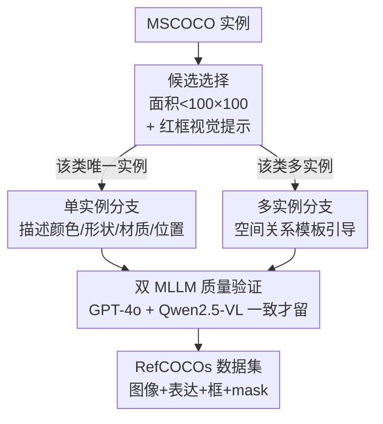

# Small Object, Great Challenge: A Benchmark for Small Object Visual Grounding

**会议**: CVPR 2026  
**论文**: [CVF Open Access](https://openaccess.thecvf.com/content/CVPR2026/html/Jia_Small_Object_Great_Challenge_A_Benchmark_for_Small_Object_Visual_CVPR_2026_paper.html)  
**代码**: https://github.com/lemonskyer/sovg  
**领域**: 多模态VLM  
**关键词**: 视觉定位, 小目标, RefCOCO, 指代表达, MLLM 自动标注

## 一句话总结
针对现有视觉定位（VG）基准只标大目标的偏差，本文用 MLLM 自动流水线在 COCO 上构建了平均目标面积仅占全图 1.60% 的 RefCOCOs 基准（32 万条指代表达），并提出带分层文本注入（HTI）模块的强基线 SoVG-Net，在小目标定位/分割上 Acc@0.5 与 mIoU 全面领先。

## 研究背景与动机

**领域现状**：视觉定位（Visual Grounding, VG）要根据一句指代表达在图像中框出或分割出对应物体，主流由两个子任务组成——REC（Referring Expression Comprehension，预测 bounding box）和 RES（Referring Expression Segmentation，预测像素级 mask）。这个方向几乎完全建立在 RefCOCO / RefCOCO+ / RefCOCOg 三个经典数据集之上。

**现有痛点**：这三个数据集是通过人工标注（两人博弈游戏 / describe-and-verify 流程）收集的，而人在标注时天然倾向于挑**大而显著**的物体来标，因为这样标得快、不容易产生歧义。结果是经典 VG 基准里被指代物体的平均面积高达全图的 **18~19%**（约 1/5），几乎没有覆盖小目标。但真实场景里小物体往往承载关键信息——比如护理机器人要在杂乱的架子上找到一个小药瓶，定位小目标的能力恰恰是缺失的。

**核心矛盾**：小目标的视觉信息本身就弱（分辨率低、特征微弱），而在深层网络逐层传递视觉特征时，这些微弱特征又**极易被占主导的背景特征稀释掉**。同时，要无歧义地指代一个小目标，往往需要更长、包含更多空间关系的描述句，这对语言推理能力提出了更高要求。现有数据集和模型都没有针对这两点。

**本文目标**：拆成两个具体子问题——（1）如何**高效、低成本**地构建一个大规模小目标 VG 基准（人工标注既贵又慢，经典 RefCOCO 也不给小目标的区域级标注）；（2）如何为这个新任务搭一个**强基线模型**，解决小目标特征在网络中被稀释的问题。

**切入角度**：作者正式提出 **SoVG（Small Object Visual Grounding）** 任务，把"被指代物体面积约占全图 1/50（< 2%）"作为小目标的操作性定义；并用 MLLM 自动生成指代表达来绕开人工标注瓶颈。

**核心 idea**：用 **MLLM 自动流水线**把 COCO 已有的小目标实例"翻译"成高质量指代表达，造出 RefCOCOs 数据集；再用**在视觉编码器多层注入文本引导**的 SoVG-Net，阻止小目标特征在深层被淹没。

## 方法详解

本文有两条主线：一条是**怎么造数据集**（RefCOCOs 的自动构建流水线，这是 benchmark 论文的核心贡献），另一条是**怎么搭基线模型**（SoVG-Net）。下面分别讲清。

### 整体框架

**数据集侧**：RefCOCOs 的构建是一条三阶段的自动标注流水线，基于 MSCOCO。第一阶段**候选选择**——从 COCO 实例标注里筛出面积小于 100×100 像素的小目标，并在目标上画一个红框作为视觉提示，引导 MLLM 把注意力聚焦到这块区域；第二阶段**表达生成**——根据该类别在图中是"唯一实例"还是"多实例"走两条不同分支生成指代表达；第三阶段**质量验证**——用 GPT-4o 和 Qwen2.5-VL 两个 MLLM 交叉判断 object-expression 对是否一致，只保留两者都认可的。最终产物是包含 COCO 图像、指代表达、对应 bounding box 和像素 mask 的 RefCOCOs。

**模型侧**：SoVG-Net 是一个基于 Transformer 的多任务框架，包含文本编码器（BERT）、视觉编码器（DINOv2）、跨模态解码器和两个任务头。图像和句子分别编码后，视觉编码器在若干层通过 HTI 模块用文本引导逐步增强视觉特征；增强后的特征送入解码器，再经 REC 头和 RES 头分别预测 box 和 mask。

### 关键设计

**1. 双分支指代表达生成：单实例查类别一致、多实例用空间模板**

这一步针对"如何让 MLLM 自动生成既准确又无歧义的小目标描述"。作者发现直接让 MLLM 描述小目标会产生幻觉——它常常被图里的大物体带跑、转而去描述大目标。于是按目标类别在图中的实例数分两条路：对**单实例**（如全图只有一把 chair），提示 MLLM 描述该物体的颜色、形状、材质、位置、朝向、状态及与其他物体的关系，然后把 MLLM 预测的类别与 ground-truth 类别做匹配校验——类别对不上（比如它描述成了"白衣服的人"而不是椅子）就丢弃，从而抑制"描述成了大物体"的幻觉。对**多实例**（如图里有多只 glove），单靠外观描述无法区分是哪一只，于是用**空间关系模板**——设计绝对位置（"at the top"）和相对位置（"to the right of [另一物体]"）两类模板，把 MLLM 的注意力定向到正确的那个实例上，生成像"the leftmost glove positioned near home plate"这样能唯一锁定目标的丰富表达。

**2. 双 MLLM 交叉质量验证：只留两个模型都认可的标注**

自动生成的标注必然有噪声，单个 MLLM 自己生成又自己判断不可靠。作者用**两个异构 MLLM（GPT-4o 与 Qwen2.5-VL）做一致性裁决**：对每个 object-expression 对，只有当两个模型都同意"这条表达确实唯一指向红框里的物体"时才保留。用模板化的判别 prompt（"Is [Expression] the sole referent of the red box in the image?"）让两个模型独立投票，靠两者交集来过滤掉歧义和错误标注，把数据质量门槛卡住。这是整条流水线能产出"可用"基准而非"噪声堆"的关键。

**3. RefCOCOs 数据集本身：把"小"做成数据分布上的硬指标**

RefCOCOs 不是简单扩容，而是在统计性质上系统性偏向小目标，这才是 benchmark 的价值所在。它含 42,407 张图、72,588 个实例、**323,266 条指代表达**，规模超过整个 RefCOCO 系列；被指代物体的**平均面积仅 1.60%**，约是经典 RefCOCO（~19%）的十二分之一；归一化尺度分布高度集中在 < 0.15、峰值约 0.05，而经典数据集峰值在 0.2~0.3。表达**平均长度 8.67 词**，长于经典数据集——因为指代小目标天然需要更多词来消歧，这也把语言推理难度一并提了上来。空间分布上 RefCOCOs 的目标在画面中更均匀，而 RefCOCO 系列存在明显的中心偏置。数据集按 train/val/testA/testB 划分，testB 与 val 含训练未见样本，testA 与训练集共享图像但物体互斥，用于稳健评测。

**4. 分层文本注入（HTI）模块：在视觉编码器多层把文本灌进视觉特征，防止小目标被稀释**

这是 SoVG-Net 的核心，针对"小目标视觉特征在深层网络中被背景稀释"。常规做法是视觉、文本各自编码到最后才融合，但小目标特征往往在传到深层前就被淹没了。HTI 的思路是**在视觉编码器内部预先选定的若干层 $K=\{k_1,\dots,k_n\}$ 上反复注入文本引导**。先把文本特征 $F_t$ 经线性层投影到视觉维度 $D_v$ 得到 $F'_t$；在每个选定层 $k$ 上做一次**单向 cross-attention**，让视觉特征作为 query 去查询文本上下文：$F^{(k)}_{\text{update}} = \text{Attention}(F^{(k)}_v, F'_t, F'_t)$；再经线性层、残差连接和 LayerNorm 把结果融回视觉流：$F'^{(k)}_v = \text{LN}(F^{(k)}_v + \text{Linear}(F^{(k)}_{\text{update}}))$。这样到编码器末端的视觉特征已经被指代表达的语义反复"点亮"，对目标（尤其是小目标）高度可判别。消融显示注入位置很关键——放在**深层**（block 15/18/21/24）效果最好，说明把语言特征注入高层视觉语义对小目标定位最有用。

### 损失函数 / 训练策略

模型端到端训练，联合优化框回归和 mask 分割：$L_{\text{total}} = \lambda_{\text{reg}} L_{\text{reg}} + \lambda_{\text{seg}} L_{\text{seg}}$。回归损失由 L1 和 GIoU 组成：$L_{\text{reg}} = \lambda_{L1} L_{1}(b,\hat b) + \lambda_{\text{giou}} L_{\text{giou}}(b,\hat b)$，监督预测框 $b$ 与 ground-truth $\hat b$ 对齐。分割损失结合 Focal 和 Dice：$L_{\text{seg}} = \lambda_{\text{focal}} L_{\text{focal}}(m,\hat m) + \lambda_{\text{dice}} L_{\text{dice}}(m,\hat m)$，其中 Focal 应对前景/背景像素的极端不平衡（小目标前景像素极少），Dice 直接优化预测与真值 mask 的重叠。视觉编码器输入 resize 到 518×518，用 AdamW，文本编码器学习率 5e-6、视觉编码器 1e-5、其余部分 2.5e-5，在 4 张 RTX A6000 上训练。

## 实验关键数据

### 主实验：RefCOCOs 上的小目标定位/分割

未在 RefCOCOs 上训练的现有方法表现极差（Acc@0.5 普遍 13% 上下），而在 RefCOCOs 上训练后所有模型都大幅跃升，SoVG-Net 在各 split 全面领先，且只有它在 val/testB 上同时超过 70% Acc@0.5 和 60% mIoU。

| 方法（w/ RefCOCOs） | val Acc@0.5 | val mIoU | testB Acc@0.5 | testB mIoU |
|--------|------|------|------|------|
| TransVG | 64.70 | - | 64.23 | - |
| HiVG | 65.32 | - | 65.34 | - |
| EEVG | 66.23 | 53.97 | 66.76 | 54.30 |
| **SoVG-Net** | **72.69** | **60.85** | **72.33** | **60.40** |

相比最强竞品 EEVG，SoVG-Net 在 testB 上 Acc@0.5 高出近 6%（72.33 vs 66.76），mIoU 也领先约 6 个点。同时在经典 RefCOCO/+/g 上（见原文 Table 3），SoVG-Net 保持有竞争力甚至 SOTA 的表现（如 RefCOCOg REC val 81.54、RES val 73.12），说明小目标训练没有牺牲通用定位能力，反而增强了整体场景理解。

### 消融实验

**HTI 模块的贡献**（Acc@0.5 / mIoU）：

| 配置 | val | testA | testB |
|------|-----|-------|-------|
| Baseline | 68.61 / 56.10 | 59.88 / 48.54 | 66.82 / 55.09 |
| Baseline + HTI | 72.69 / 60.58 | 63.39 / 53.31 | 72.33 / 60.40 |
| ΔGain | +4.08 / +4.48 | +3.51 / +4.77 | +5.51 / +5.31 |

**文本注入位置方案**（REC Acc@0.5，每方案选 4 层）：

| 方案 | Block 索引 | val | testA | testB |
|------|-----------|-----|-------|-------|
| Shallow | 3,6,9,12 | 70.01 | 51.83 | 67.59 |
| Middle | 9,12,15,18 | 71.49 | 57.57 | 70.40 |
| Uniform | 6,12,18,24 | 71.23 | 58.21 | 70.56 |
| **Deep** | 15,18,21,24 | **72.69** | **63.39** | **72.33** |

### 关键发现
- **HTI 是涨点主力**：加上 HTI 后各 split Acc@0.5 提升 3.51%~5.51%、mIoU 提升 4.48%~5.31%，证实"把文本引导灌进视觉特征"能有效防止小目标特征在深层丢失。
- **注入越深越好**：从 shallow 到 deep 性能单调上升，deep 方案在 testA 上比 shallow 高出 11.5 个点（63.39 vs 51.83），说明对小目标而言，把语言信息注入**高层视觉语义**比注入低层更有用。
- **数据集必要性**：用复杂度相近的 RefCOCOg 训练的模型在 SoVG 上会失败（如把"the rightmost green plant"误定位到右侧的大物体上、或完全找不到"the bowl filled with food in the oven"），而用 RefCOCOs 训练的能准确定位，证明经典基准不足以支撑小目标 VG。

## 亮点与洞察
- **用 MLLM 把"已有检测标注"升级成"指代表达标注"**：COCO 本就有小目标的框和 mask，缺的只是自然语言描述；本文不重新标框，而是让 MLLM 在已有实例上生成表达，把昂贵的人工指代标注几乎归零——这套"复用现有标注 + MLLM 补语言层"的思路可迁移到任何已有 detection/segmentation 数据集上造 grounding 基准。
- **红框视觉提示 + 双 MLLM 裁决**是控制自动标注质量的简洁组合：红框把 MLLM 的注意力钉在小目标上抑制"跑偏到大物体"的幻觉，双模型一致性投票再过滤剩余噪声，两招都很轻量却直击自动标注最容易翻车的地方。
- **"在哪一层融合"被实证为关键超参**：HTI 的消融把"文本该在视觉编码器哪几层注入"做成了一个可调维度，并给出"越深越好"的明确结论，对其他多模态融合架构有参考价值。

## 局限与展望
- **指代表达全部由 MLLM 生成**，缺乏人工标注，语言模式的多样性和自然度受限于 GPT-4o/Qwen2.5-VL 的生成风格——作者也承认未来要补人工标注。
- **小目标定义依赖固定像素阈值**（< 100×100、面积 < 2%），是一个工程化的硬切分，可能在不同分辨率/场景下不够普适。⚠️ 原文未讨论该阈值的敏感性。
- **仅限静态图像**，作者计划把 SoVG 扩展到视频。
- HTI 模块本质是在视觉编码器里插 cross-attention，思路相对直接；模型层面的贡献主要是"强基线"而非架构创新，数据集才是本文的主菜。

## 相关工作与启发
- **vs 经典 VG 数据集（RefCOCO/+/g）**: 它们靠人工标注、偏向大而显著的物体（平均面积 ~19%），本文靠 MLLM 自动标注、专攻小目标（平均面积 1.60%）；RefCOCOs 在规模、表达数量、小目标占比上全面超过，填补了小目标 VG 的空白。
- **vs 小目标检测（SOD，如 SODA / VisDrone / TinyPerson）**: SOD 是类别级识别任务，定位某些预定义类别的所有实例，不处理"用语言区分具体某一个"的实例级消歧；SoVG 则要用自然语言锁定特定小目标，本质不同。
- **vs 通用 VG 方法（EEVG / HiVG / TransVG 等）**: 这些方法在小目标上表现弱（未训练时 Acc@0.5 仅 ~13%），SoVG-Net 通过 HTI 多层文本注入专门强化小目标特征，在 RefCOCOs 上领先约 6 个点，同时在经典数据集上保持竞争力。

## 评分
- 新颖性: ⭐⭐⭐⭐ 首次系统定义并基准化小目标 VG，MLLM 自动标注流水线设计扎实；模型层面是强基线而非全新架构。
- 实验充分度: ⭐⭐⭐⭐ RefCOCOs 主表 + 经典 4 数据集泛化 + 多组消融（HTI、注入位置、数据集必要性）较完整。
- 写作质量: ⭐⭐⭐⭐ 结构清晰、图表到位，数据集统计分析详尽。
- 价值: ⭐⭐⭐⭐ 补齐了 VG 长期忽略的小目标场景，数据集和基线都对社区有直接价值。

<!-- RELATED:START -->

## 相关论文

- [\[CVPR 2026\] Visual Grounding for Object Questions](visual_grounding_for_object_questions.md)
- [\[CVPR 2026\] Downscaling Intelligence: Exploring Perception and Reasoning Bottlenecks in Small VLMs](downscaling_intelligence_exploring_perception_and_reasoning_bottlenecks_in_small.md)
- [\[CVPR 2026\] From Failure to Feedback: Group Revision Unlocks Hard Cases in Object-Level Grounding](from_failure_to_feedback_group_revision_unlocks_hard_cases_in_object-level_groun.md)
- [\[CVPR 2026\] HanDyVQA: A Video QA Benchmark for Fine-Grained Hand-Object Interaction Dynamics](handyvqa_a_video_qa_benchmark_for_fine-grained_hand-object_interaction_dynamics.md)
- [\[CVPR 2026\] Mechanisms of Object Localization in Vision-Language Models](mechanisms_of_object_localization_in_vision-language_models.md)

<!-- RELATED:END -->
