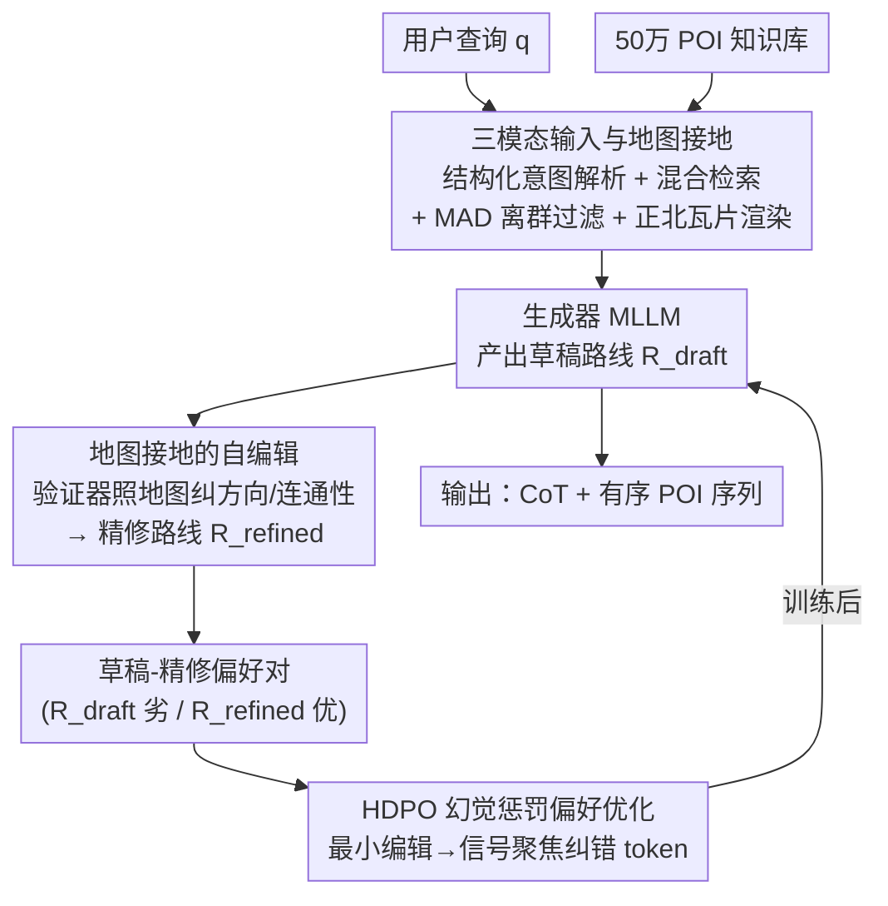

# SMAP: Semantic Route Planning with Map-Grounded Multimodal Alignment

**会议**: CVPR 2026  
**论文**: [CVF Open Access](https://openaccess.thecvf.com/content/CVPR2026/html/Zhang_SMAP_Semantic_Route_Planning_with_Map-Grounded_Multimodal_Alignment_CVPR_2026_paper.html)  
**代码**: 无（仅有项目页 https://amap-mobility-intelligence.github.io/SMAP/）  
**领域**: 多模态VLM  
**关键词**: 语义路线规划, 多模态对齐, 地图接地, 偏好优化, 幻觉抑制

## 一句话总结
SMAP 把用户查询、POI 结构化元数据和一张「只标候选 POI 的正北朝上地图瓦片」一起喂给多模态大模型来做语义路线规划，并用「生成器画草稿、验证器照地图改错」自动造出偏好对，再用幻觉惩罚版 DPO（HDPO）训练，把一个 32B 开源模型在路线效率、时序合理性和整体质量上拉到与 GPT-5 持平甚至反超。

## 研究背景与动机
**领域现状**：语义路线规划（semantic route planning）是给定用户意图（如「五日城市游」「适合带娃的一段步行路线」）生成一条既符合主题、又空间可行的 POI 序列。近年主流做法是用 LLM：要么 LLM 解析意图后交给传统 TSP/约束求解器（ITINERA、ChinaTravel），要么用 ReAct/Reflexion 式多步 agent 反复调工具。

**现有痛点**：纯文本 LLM 只能看到 POI 的文字描述，缺乏空间接地能力，经常「幻觉」出地理上不合理的路线——跨区跳跃、在不相邻 POI 间反复折返。这些错误被流畅的自然语言掩盖，但实际照着走根本走不通。求解器路线又要求把需求写成显式约束，而真实需求往往是隐式的、难以形式化。多步 agent 则交互冗长、磨用户耐心。

**核心矛盾**：路线规划本质上是**空间 + 多模态**的任务，需要「读地图」；而现有方法把它当成纯文本生成问题，模型从文字元数据里推不出空间连续性、局部 POI 密度这些细粒度信息。同时现有数据集多为粗粒度的城市级行程，缺乏支持局部、细粒度规划的多模态监督。

**本文目标**：(1) 让模型像人一样「看地图」做规划；(2) 抑制空间幻觉、保证方向与拓扑连贯；(3) 提供首个多模态、多尺度的语义路线规划数据集。

**切入角度**：人类做路线规划时会盯着地图看 POI 的相对位置——作者把这个认知过程搬给 MLLM：渲染一张只画候选 POI 的瓦片当视觉输入，逼模型基于相对位置而非纯文字来推理。

**核心 idea**：用「地图瓦片 + POI 元数据 + 查询」三模态输入做一步式路线规划，再用「自编辑造偏好对 + 幻觉惩罚 DPO」让模型把验证器的纠错内化成偏好，从而少幻觉、更可行。

## 方法详解

### 整体框架
SMAP 把语义路线规划形式化为：在用户查询 $q$、候选 POI 集合 $P=\{p_1,\dots,p_n\}$（每个带类别/标签等结构化元数据）、地图瓦片 $m$ 三个条件下，建模 $p(R\mid q,P,m)$，输出一条主题相关、空间可行、叙事连贯的路线 $R$。模型输出分两段：`<think>` 里是带空间考量的思维链（CoT）推理，`<answer>` 里是有序的 POI 索引列表。

整条 pipeline 分两大块。**前半段是输入构造**：把自然语言查询解析成四类结构化意图 → 混合检索召回候选 POI 并做空间离群过滤 → 渲染一张正北朝上、只标候选 POI 的高分辨率瓦片。**后半段是抗幻觉训练**：先用强模型蒸馏冷启动得到 SFT 模型，再让 SFT 模型出草稿、验证器 MLLM 照地图把草稿改对，每条查询都得到一对「草稿（劣）/精修（优）」偏好对，最后用 HDPO 把生成器拉向空间一致的路线。

### 关键设计

**1. 三模态输入与地图接地：把「读地图」这件事补给 LLM**

针对纯文本 LLM「推不出空间关系」的痛点，SMAP 同时喂三种互补输入：捕捉意图与约束的查询 $q$、从知识库检索来的结构化 POI 元数据 $P$、以及一张地图瓦片 $m$。瓦片的渲染有两处刻意设计：一是**正北朝上**固定朝向，给模型稳定的方向参照；二是**只叠加候选 POI**的标注标记、不画其它地物，逼模型仅凭这些相关 POI 的相对位置来推理空间关系。瓦片以 $980\times980$ 高分辨率渲染以保住空间清晰度。这和此前把地图当通用图像、缺乏朝向感知的做法不同——后者正是空间幻觉、绕路、折返的来源。

**2. 结构化意图解析 + 空间感知的候选构造：让喂进去的 POI 本身就紧凑可行**

查询先被解析成四类意图——目的地意图（如「北京海淀」）、主题意图（如「爬山」「亲子」）、显式 POI 意图（点名某地标）、附近搜索意图（「故宫附近走走」），把复杂查询拆成可分别检索的成分。检索用**词法匹配 + 稠密向量**的混合策略并重排，对「附近搜索」意图先做 3–5 km 半径的距离过滤再检索。在约 50 万 POI 的知识库里取 top-20 后，再用 **MAD（Median Absolute Deviation，中位数绝对偏差）离群过滤**：把到最近簇质心距离超过经验阈值的 POI 剪掉，保证最终候选集是一个紧凑、空间可行的探索区域。这一步的意义在于——若候选集本身就散落跨区，后面再强的模型也容易规划出跳跃路线，所以把空间合理性「从源头」就保证住。

**3. 地图接地的自编辑：用「画草稿—照地图改错」自动造偏好对，免人工标注**

给定输入 $x=(q,P,m)$，生成器 MLLM 先产出初始草稿 $R_{\text{draft}}$；再由第二个 MLLM 当**验证器**，对照 POI 元数据和地图瓦片，重点检查方向一致性、可步行性、拓扑连通性，把不合理的片段改掉（如反转错误的朝向描述、给不相邻的 POI 重排序），得到更准确的 $R_{\text{refined}}$。每条查询由此自动产出一对 $(R_{\text{draft}}, R_{\text{refined}})$ 偏好对，全程无需人工标注。关键在于验证器只做**最小化纠错**而非重写，这为下一步的训练信号聚焦埋下伏笔。

**4. HDPO 幻觉惩罚的偏好优化：把学习信号集中到「被改错的那几个 token」上**

把 $R_{\text{refined}}$ 当 accepted、$R_{\text{draft}}$ 当 rejected，在 SFT 参考模型 $\pi_{\text{ref}}$ 上做 DPO：

$$\mathcal{L}_{\text{DPO}} = -\mathbb{E}_{(x,y_a,y_r)}\left[\log\sigma\left(\beta\log\frac{\pi_\theta(y_a\mid x)}{\pi_{\text{ref}}(y_a\mid x)} - \beta\log\frac{\pi_\theta(y_r\mid x)}{\pi_{\text{ref}}(y_r\mid x)}\right)\right]$$

作者进一步把偏好差（preference gap）按 token 拆解。accepted 与 rejected 的对数似然比可写成「不同 token 的信号（Term A）」加「共同 token 的信号（Term B）」之和。由于 $y_a$ 是对 $y_r$ 的最小编辑、二者 token 高度重叠，共同 token 的前文上下文 $t^a_{<i}$ 与 $t^r_{<i}$ 几乎相同，于是 **Term B 趋近于 0，优化信号集中在 Term A**——也就是被纠正的那些幻觉片段上，模型因而精准学到「哪里错、怎么改」。相比之下标准 DPO 的正负样本往往在措辞、结构上差异巨大，学习信号被大量无关 token 稀释，模型可能把能力耗在学风格而非提升空间事实性上。这正是 HDPO 名字里「hallucination-penalized」的来源。

### 损失函数 / 训练策略
基座为 Qwen2.5-VL-7B / 32B。流程是**蒸馏冷启动 → SFT → HDPO**：先用 Gemini-2.5-Pro 加后处理生成高质量路线做 SFT 冷启动；再让 SFT 模型出草稿当 rejected，由 Gemini-2.5-Pro 经空间可行性校验改成 accepted，得到偏好对做 HDPO。训练 5 个 epoch，AdamW，学习率 1e-5，cosine 退火 + warmup + 梯度裁剪；单卡 batch 1、梯度累积 4 步，有效 batch 64；16 张 H20 + DeepSpeed ZeRO-3；按验证 loss 早停选最优 checkpoint。数据集按 13:1:1 划分训练/验证/测试。

## 实验关键数据

评测在自建 **MM-Route** 数据集（3,000 条多尺度多主题查询，每条配 ≤20 个候选 POI 的结构化元数据 + 正北瓦片）上进行。指标含：PSR（规划成功率，格式合法占比）、RDR（路线距离比，越高越省）、RTPR（主题通过率）、TSPR（时间安排合理率）、SHR（空间幻觉率，越低越好）、ORS（整体路线分 1–5）、CPR（相对 GPT-5 的偏好胜率，Gemini 裁判）。

### 主实验

| 模型 | RDR↑ | RTPR↑ | TSPR↑ | SHR↓ | ORS↑ | CPR↑ |
|------|------|-------|-------|------|------|------|
| Qwen2.5-VL-32B（预训练） | 0.667 | 59.3 | 34.5 | 31.9 | 1.69 | 4.6 |
| GPT-4o | 0.688 | 72.8 | 36.5 | 31.8 | 2.12 | 10.5 |
| OpenAI-o1 | 0.780 | 90.9 | 37.0 | 21.2 | 3.10 | 15.0 |
| GPT-5（参考） | 0.825 | **94.0** | 68.8 | **13.3** | 3.76 | — |
| Qwen2.5-VL-7B-HDPO | 0.802 | 85.4 | 70.4 | 20.4 | 3.37 | 34.0 |
| **Qwen2.5-VL-32B-HDPO** | **0.831** | 91.0 | **77.5** | 14.0 | **3.89** | **51.5** |

32B 模型经过 SFT+HDPO 后，RDR 从 0.667 提到 0.831、RTPR 从 59.3% 提到 91.0%、TSPR 从 34.5% 飙到 77.5%、SHR 从 31.9% 砍到 14.0%。最终在路线效率（RDR 0.831 vs 0.825）、时序合理性（TSPR 77.5% vs 68.8%）、整体质量（ORS 3.89 vs 3.76）上**反超 GPT-5**，并在头对头对比中拿到 51.5% 的 CPR（即多数情况下被判优于 GPT-5），仅在主题贴合（RTPR）和空间幻觉（SHR）上略逊。

### 消融实验

**多模态输入的作用（Tab. 2，text-only 是把经纬度写进文本、去掉瓦片）：**

| 配置（Qwen2.5-VL-32B） | RDR↑ | TSPR↑ | SHR↓ | ORS↑ | CPR↑ |
|------|------|-------|------|------|------|
| HDPO (text-only) | 0.789 | 73.5 | 15.4 | 3.72 | 49.0 |
| HDPO (text-image) | **0.831** | **77.5** | **14.0** | **3.89** | **51.5** |

**HDPO 样本构造方式的作用（Tab. 3，DPO 用 SFT 真值当 accepted、SFT 输出当 rejected）：**

| 配置（Qwen2.5-VL-7B） | RDR↑ | RTPR↑ | SHR↓ | ORS↑ |
|------|------|-------|------|------|
| SFT | 0.763 | 83.8 | 22.1 | 3.00 |
| DPO（标准） | 0.733 | 79.8 | 27.6 | 2.75 |
| HDPO（本文） | **0.802** | **85.4** | **20.4** | **3.37** |

### 关键发现
- **地图瓦片主要补的是空间能力**：加图后 RDR、SHR 改善最明显（空间幻觉显著下降），说明模型确实把规划「接地」到了地图上；TSPR 也涨，因为瓦片隐含了 POI 间距这类时序线索。有趣的是 7B 在 text-only 下偶尔 RTPR/ORS 略高，作者归因于 RTPR 本质评的是「遵从文字指令」、不依赖视觉，且 ORS 差距很小属实验方差。
- **标准 DPO 反而掉点**：7B 的 RDR 0.763→0.733、SHR 22.1%→27.6%，因为 SFT 真值与模型草稿在措辞/结构上差异太大，信号被稀释；且「真值 vs SFT 输出」是「好 vs 更好」的模糊监督，而非「对 vs 错」的清晰信号，会破坏 SFT 学到的空间推理。HDPO 用最小编辑的「精修 vs 草稿」给出精准、聚焦的纠错信号，才稳定涨点。
- **小模型逆袭**：定向数据 + 专门后训练能让 32B 开源模型在多项指标上压过 GPT-5，说明任务专门化的后训练对让通用 MLLM 胜任领域任务至关重要。

## 亮点与洞察
- **「正北 + 只画候选 POI」的瓦片设计很巧**：用固定朝向给方向参照、用「只标相关点」逼模型基于相对位置推理，把抽象的空间推理变成可看的图——是把人类「看地图」认知直接搬给模型的干净做法。
- **HDPO 的 token 级拆解是核心洞察**：通过「最小编辑 ⇒ 共同 token 信号 Term B≈0 ⇒ 信号集中到纠错 token」这条推导，给「为什么偏好对要做最小编辑」提供了理论解释。这个思路可迁移到任何「自编辑造偏好对」的对齐任务——想让 DPO 学得准，就让正负样本只差在你想纠正的地方。
- **验证器即免费偏好标注器**：用一个 MLLM 照地图给另一个 MLLM 改错，零人工标注就批量造出高质量偏好对，是 self-editing + DPO 组合的可复用范式。

## 局限与展望
- **强依赖一个强验证器/裁判**：偏好对由 Gemini-2.5-Pro 充当验证器和裁判生成，评测也用 Gemini-as-a-judge，存在「裁判即教师」的潜在循环偏置（作者为避偏已把其它 Gemini 系列排除出 baseline，但裁判本身仍是 Gemini）。⚠️ 评测可靠性以原文 human–LLM 一致性分析为准。
- **数据与知识库偏内部资源**：50 万 POI 知识库来自内部数据库、查询部分由 LLM 生成，泛化到其它地区/语言的能力未充分验证。
- **一步式而非交互式**：为避免多步 agent 的冗长，SMAP 采用一步规划 + RAG，但这也意味着无法在生成后与用户多轮澄清、动态改单。
- **改进思路**：把验证器换成可执行的几何/路网约束检查（而非另一个 LLM），或引入真实可步行路网代替「相对位置」近似，能进一步压低 SHR。

## 相关工作与启发
- **vs ITINERA / ChinaTravel（LLM + 求解器）**: 它们用 LLM 解析意图、再交给 TSP/神经符号求解器规划，LLM 只管理解、真正规划仍靠传统求解器，需把需求写成显式约束。SMAP 让 MLLM 直接当 planner，能处理隐式需求，但牺牲了求解器的最优性保证。
- **vs ReAct / Reflexion 式 agent**: 它们多步调工具、交互冗长。SMAP 走一步式 + RAG，候选 POI 当外部知识，对用户更友好。
- **vs TraveLLaMA 等地理多模态模型**: 后者把文本/图像/地图用于问答、检索验证，但不支持端到端路线合成，也缺对微观空间转移、朝向一致性的严格评测。SMAP 是首个在三模态上做端到端路线生成、并显式对齐方向连贯与地理可行的框架。

## 评分
- 新颖性: ⭐⭐⭐⭐⭐ 首个把地图瓦片引入语义路线规划的多模态框架，HDPO 的 token 级信号聚焦分析有理有据
- 实验充分度: ⭐⭐⭐⭐ 含完整主实验 + 双消融（多模态输入 / 样本构造），但评测重度依赖单一 LLM 裁判
- 写作质量: ⭐⭐⭐⭐⭐ 动机—方法—理论分析—实验链条清晰，HDPO 推导讲得透
- 价值: ⭐⭐⭐⭐ 让 32B 开源模型反超 GPT-5，self-editing + 幻觉惩罚 DPO 的范式可迁移；落地依赖内部地图数据

<!-- RELATED:START -->

## 相关论文

- [\[CVPR 2026\] Gravitation-Driven Semantic Alignment for Text Video Retrieval](gravitation-driven_semantic_alignment_for_text_video_retrieval.md)
- [\[CVPR 2026\] LASAR: Towards Spatio-temporal Reasoning with Latent Cognitive Map](lasar_towards_spatio-temporal_reasoning_with_latent_cognitive_map.md)
- [\[CVPR 2026\] Proxy3D: Efficient 3D Representations for Vision-Language Models via Semantic Clustering and Alignment](proxy3d_efficient_3d_representations_for_vision-language_models_via_semantic_clu.md)
- [\[CVPR 2026\] SIMPACT: Simulation-Enabled Action Planning using Vision-Language Models](simpact_simulation-enabled_action_planning_using_vision-language_models.md)
- [\[CVPR 2026\] Hyperbolic Gramian Volumes for Multimodal Alignment](hyperbolic_gramian_volumes_for_multimodal_alignment.md)

<!-- RELATED:END -->
