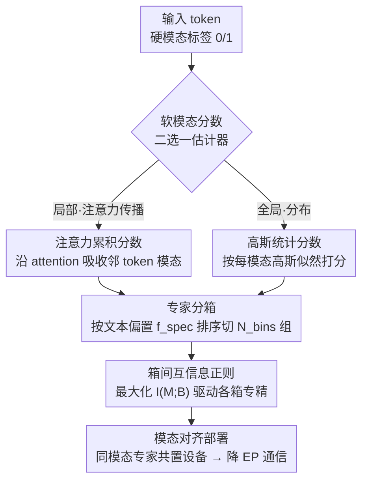

# SMoES: Soft Modality-Guided Expert Specialization in MoE-VLMs

**会议**: CVPR 2026  
**arXiv**: [2604.23996](https://arxiv.org/abs/2604.23996)  
**代码**: 无  
**领域**: 多模态VLM / MoE路由 / 推理效率  
**关键词**: MoE-VLM、模态专精、软模态分数、专家分箱、互信息正则、专家并行

## 一句话总结
针对 MoE-VLM 里"该不该、怎么让专家按模态专精"这个被忽视的问题，本文提出 SMoES：用随层动态变化的**软模态分数**刻画 token 的真实视觉/文本融合程度，把专家**分箱（bin）**成对齐部署设备的组，再用**箱间互信息正则**驱动各箱专精到不同模态——在 4 个 MoE-VLM、16 个 benchmark 上多模态/纯语言任务平均涨 0.9%/4.2%，同时把专家并行通信开销砍掉 56.1%、吞吐提升 12.3%。

## 研究背景与动机

**领域现状**：MoE 已成为大型 VLM（DeepSeek-VL2、Kimi-VL、GLM-4.5V、InternVL-3.5 等）的主流骨干——靠条件计算把容量做大而单 token 算力只小幅增加，天然适合融合视觉/文本异构模态。但"模态信号（vision vs. text）到底该如何引导专家路由"一直没被认真研究。

**现有痛点**：当前路由分三类，各有硬伤。**硬路由**把专家预先绑死到某个模态，专精很强但边界僵硬，跨模态特征和"表征随层自然混合"的现象都照顾不了；**软路由**（主流）让任意专家处理任意 token，但靠启发式先验或与模态分布脱节的辅助损失，结果要么过度混合、要么欠专精；**混合路由**把专家手工切成"模态专属 + 共享"两组，可这种切分是人定的、且全层统一，跟不上特征随深度的演化。

**核心矛盾**：作者在 LLaVA-1.5 和 DeepSeekMoE 版 VLM 上分析模态融合（Fig. 2）发现，融合是**多尺度异构**的——宏观上不同模型/不同层的视觉-文本 JS 散度轨迹差别很大；微观上同一层同一模态内，有的 token 仍是纯模态、有的已变成跨模态。也就是说，"硬性分离"或"统一混合"这类**刚性先验从根上就跟真实模态交互对不上**。

**效率维度的隐痛**：视觉 token 数量多但信息密度低（空间冗余），文本 token 少但语义集中，二者严重不对称。这带来两个效率难题：① 标准路由 + 普通负载均衡会把多数专家分给"量大但信息稀"的视觉模态，挤压专精；② 在**专家并行（EP）**部署下，模态无关的路由把 token 散到各设备，All-to-All 通信开销暴涨。反过来，若能建立清晰的专家-模态亲和并据此调度，把同模态专家**共置在同一设备**，就能在保持负载均衡的同时大幅省通信。

**核心 idea**：用"尊重模态随层演化结构"的**软**信号来引导，让 MoE 专家池**自发**形成动态模态专精——既提精度又降通信。

## 方法详解

### 整体框架
SMoES 在每个 MoE 层做三件串起来的事：先把输入端的二值"硬模态标签（0=视觉/1=文本）"逐层细化成连续的**软模态分数** $M\in[0,1]$，刻画 token 当前真实的视觉/文本成分；再把该层的 $N_e$ 个专家按各自"偏文本/偏视觉"的历史负载**分箱**成 $N_{\text{bins}}$ 组（箱数对齐部署设备数）；最后用**箱间互信息正则** $I(M;\mathbf{B})$ 推动不同箱专精到不同模态。三者协同：软分数提供"token 真实模态"这一参照，分箱提供"可专精、可部署"的结构单元，互信息把二者绑起来让箱级专精自然涌现，且专精后同模态专家可共置设备、省下 EP 通信。

软模态分数有两种互补估计器（二选一）：**注意力累积分数**（局部、序列相关）和**高斯统计分数**（全局、分布相关）。

### 关键设计

**1. 动态软模态分数：用连续融合度替代僵死的二值标签**

针对"硬模态标签捕捉不到融合随层平滑演化"的痛点，本文为每个 token、每个模态 $m\in\{\text{text},\text{vision}\}$、每层 $l$ 定义软分数 $M_{ij,m}^{(l)}\in[0,1]$ 且 $\sum_m M_{ij,m}^{(l)}=1$。它提供两条互补的估计路径。

**注意力累积分数**抓"局部跨 token 交互"：直觉是一个 token 在 attention 中关注别人时，会按注意力权重吸收对方的模态特性。第 0 层用硬标签初始化 $M_{ij,m}^{\text{attn},(0)}=\mathbf{1}\{m=m(\mathbf{x}_{ij})\}$；之后两步更新——先按注意力权重聚合被关注 token 的分数 $\tilde{M}_{ij,m}^{\text{attn},(l)}=\sum_{j'}\text{Attn}_{j,j'}^{(l)}\cdot M_{ij',m}^{\text{attn},(l)}$，再用特征范数做残差加权：

$$M_{ij,m}^{\text{attn},(l+1)}=\frac{\|\mathbf{x}_{\text{attn},ij}^{(l)}\|\cdot\tilde{M}_{ij,m}^{\text{attn},(l)}+\|\mathbf{x}_{ij}^{(l)}\|\cdot M_{ij,m}^{\text{attn},(l)}}{\|\mathbf{x}_{\text{attn},ij}^{(l)}\|+\|\mathbf{x}_{ij}^{(l)}\|}$$

这恰好对应 Transformer 的残差结构 $\mathbf{x}^{(l+1)}=\mathbf{x}^{(l)}+\mathbf{x}_{\text{attn}}^{(l)}$，用范数衡量 attention 路径与残差路径的相对贡献。

**高斯统计分数**抓"全局分布规律"：不同模态 token 在嵌入空间分布不同。为每层每模态维护一个对角协方差高斯（均值 $\boldsymbol{\mu}_m$、方差 $\boldsymbol{\sigma}_m^2$），用 Welford 算法的 EMA 变体在线更新（衰减因子 $\beta$，见公式 5-7）。推断时算 token 在各分布下的对数似然 $\text{LL}_{ij,m}=-\tfrac12\sum_d\big(\log\sigma_{m,d}^2+\tfrac{(x_{ij,d}-\mu_{m,d})^2}{\sigma_{m,d}^2}\big)$，再过温度 softmax 得到软分数 $M_{ij,m}^{\text{gauss}}=\tfrac{\exp(\text{LL}_{ij,m}/\tau)}{\sum_{m'}\exp(\text{LL}_{ij,m'}/\tau)}$。它不依赖第 0 层初始化，每层都能即时推断模态归属。

**2. 专家分箱：给"模态专精 + 设备部署"造一个共用结构单元**

针对"EP 下模态无关路由把 token 散到各设备、通信爆炸"的痛点，本文在每层把 $N_e$ 个专家划成 $N_{\text{bins}}$ 个箱 $\mathbf{B}=\{\mathbf{B}_1,\dots,\mathbf{B}_{N_{\text{bins}}}\}$，每箱 $N_B=N_e/N_{\text{bins}}$ 个专家，且**箱数可对齐设备数**——箱就成了"既能承载模态专精、又能直接当部署放置单元"的双重结构。

分箱不是按专家原始顺序固定切，而是**动量自适应分箱**：用 EMA 跟踪每个专家来自各模态的负载 $\bar{C}_{m,e,t}=\beta\bar{C}_{m,e,t-1}+(1-\beta)C_{m,e}$，算出专家的**文本偏置分** $f_{\text{spec}}(e)=\tfrac{\bar{C}_{\text{text},e}}{\bar{C}_{\text{text},e}+\bar{C}_{\text{vision},e}}$，再按 $f_{\text{spec}}$ 排序、切成 $N_{\text{bins}}$ 个连续箱，把模态偏好相近的专家归到一起。这样偏好相近的箱可共置同一设备，降通信的同时仍能均衡计算。

**3. 箱间互信息正则：在"专精"和"负载均衡"之间真正调和**

针对"想让专家专精，又不能破坏负载均衡"的核心张力，本文最大化软模态分数 $M$ 与所选箱 $\mathbf{B}$ 间的互信息 $I(M;\mathbf{B})$——直觉是：若 MI 高，则"知道选了哪个箱"就能强烈推断 token 模态，说明箱已专精。具体先按软分数加权算每个样本-模态-箱的平均门控分 $\bar{S}_{i,m,\mathbf{B}_k}=\tfrac{\sum_{e\in\mathbf{B}_k}\sum_j M_{ij,m}\cdot g_{ij,e}}{N_B\sum_j M_{ij,m}}$，归一化成联合概率 $P_i(m,\mathbf{B}_k)$，再算标准互信息 $I_i(M;\mathbf{B})=\sum_{m,k}P_i(m,\mathbf{B}_k)\log\tfrac{P_i(m,\mathbf{B}_k)}{P_i(m)P_i(\mathbf{B}_k)}$，损失 $\mathcal{L}_{\text{MI}}=-\sum_l\tfrac1{N_{\text{batch}}}\sum_i I_i(M;\mathbf{B})$。

为什么用 MI 而不用 SMAR 那种 KL 散度正则？因为 KL 把路由分布往"模态专属模式"硬推，会和负载均衡损失打架（SMAR 最终只能关掉负载均衡才能用），在"专家多、单专家小"的 MoE 里尤其失效；MI 只要求"箱与模态强相关"，不规定具体往哪个专家堆，因此能与负载均衡共存。同时它**在箱级而非专家级**操作，天然对齐 EP 的设备放置粒度——专精好的箱可直接共置设备减跨设备通信。

### 损失函数 / 训练策略
总目标是任务损失 + 箱级负载均衡 + 箱间互信息：$\mathcal{L}=\mathcal{L}_{\text{task}}+\alpha_{\text{bal}}\mathcal{L}_{\text{bal}}+\alpha_{\text{MI}}\mathcal{L}_{\text{MI}}$，其中 $\mathcal{L}_{\text{task}}$ 是语言建模损失。负载均衡改成**箱内**版本 $\mathcal{L}_{\text{bal}}=\sum_l\sum_k N_B\sum_{e\in\mathbf{B}_k}f_e P_e$，保证 EP 下每个设备内部负载平衡。训练用 8×A800，$N_{\text{bins}}=8$，高斯软分数温度 $\tau=0.5D$，EMA 衰减 $\beta=0.99$，损失权重 $\alpha_{\text{bal}}=0.001$、$\alpha_{\text{MI}}=0.0001$。沿用 LLaVA 两阶段协议（Pretrain-558K + Instruct-665K），视觉编码器 CLIP ViT-L/14 + 2 层 MLP projector。

## 实验关键数据

**自定义指标 MSI（模态专精指数）**：衡量专家路由偏离模态均匀分布的程度。先算专家 $e$ 在层 $l$ 的模态归属概率 $\tilde{\mathbf{C}}^{(l)}_{m,e}$（公式 18，按模态归一），再取 $\text{MSI}=\tfrac1L\sum_l\tfrac1E\sum_e 2\cdot|\tilde{\mathbf{C}}^{(l)}_{\text{text},e}-0.5|$，$\text{MSI}\in[0,1]$，0=无专精、1=完美专精。注意 MSI 高不等于性能好——硬路由 MSI≈1.0 反而严重掉点。

### 主实验
4 个骨干、16 个 benchmark；下表节选 DeepSeekMoE（A3B/16B，top-6/64）和 OLMoE（A1B/7B，top-8/64）的 Overall 相对增益（以无专精软路由为 100% 基线）。

| 骨干 | 方法 | MSI | 多模态(10) | 纯语言(6) | Overall |
|------|------|-----|-----------|----------|---------|
| DeepSeekMoE | No Specialization | .177 | 100% | 100% | 100% |
| DeepSeekMoE | Hard Routing (t32-v32) | 1.0 | -3.9% | -26.2% | -12.3% |
| DeepSeekMoE | MoIIE (混合, t16-v16-s32) | .504 | -1.5% | -13.1% | -5.8% |
| DeepSeekMoE | SMAR (KL, 最佳档) | .543 | +0.6% | -11.3% | -3.9% |
| DeepSeekMoE | **SMoES attention-soft** | .487 | **+1.8%** | **+6.2%** | **+3.5%** |
| DeepSeekMoE | SMoES gaussian-soft | .440 | +1.3% | +4.2% | +2.4% |
| OLMoE | No Specialization | .205 | 100% | 100% | 100% |
| OLMoE | Hard Routing (t32-v32) | 1.0 | -6.1% | -34.1% | -16.6% |
| OLMoE | SMAR (最佳档) | .485 | -0.4% | -0.1% | -0.3% |
| OLMoE | **SMoES attention-soft** | .620 | +0.5% | **+6.7%** | **+2.9%** |
| OLMoE | SMoES gaussian-soft | .754 | +0.6% | +4.3% | +2.0% |

四骨干平均：SMoES 比软路由基线总体 +2.2%（多模态 +0.9%、纯语言 +4.2%）。硬路由虽 MSI 近 1.0 但平均掉 -4.4%/-22.2%，混合路由（MoIIE）-3.1%/-17.4%，均跌破软路由基线——印证"刚性专精不能硬塞"。

### EP 部署效率（OLMoE，2×Orin GPU，10Gb 以太网）

| 指标 | 基线 | SMoES | 变化 |
|------|------|-------|------|
| Prefill 视觉 token 跨设备传输率(MMMU) | 97.7% | 15.0% | ↓84.6% |
| Prefill V+T 传输率(MMMU) | 98.0% | 31.1% | ↓68.3% |
| Decode 文本传输率(MMMU) | 86.5% | 43.3% | ↓49.9% |
| TTFT(MMMU, bs=8) | 7.949s | 6.203s | ↓22.0% |
| TPOT(MMMU, bs=1) | 0.786s | 0.703s | ↓10.5% |

摘要汇总：EP 通信开销整体降 56.1%、吞吐提升 12.3%。专精让 token 更多命中本地专家，配合异步传输把通信与计算重叠；prefill batch 越大通信占比越高、收益越大。

### 消融实验
| 配置 | MSI | 多模态 | 纯语言 | Overall | 说明 |
|------|-----|--------|--------|---------|------|
| No Specialization | .177 | 100% | 100% | 100% | 软路由基线 |
| hard-score + MI | .904 | -0.8% | +0.5% | -0.3% | 二值硬分数：MSI 最高却几乎不涨 |
| w/ binning only | .415 | +0.9% | +3.0% | +1.7% | 仅分箱就有结构性收益 |
| w/ inter-bin **KL** | .724 | -1.5% | -8.5% | -4.1% | KL 与负载均衡冲突，反掉点 |
| **MI-attention (full)** | .487 | +1.8% | +6.2% | +3.5% | 完整模型最佳 |
| MI-gaussian (full) | .440 | +1.3% | +4.2% | +2.4% | 高斯变体 |
| attention-soft + fixed bin | .450 | +2.0% | +0.2% | +1.3% | 固定分箱：纯语言几乎不涨 |
| attention-soft + adaptive bin | .487 | +1.8% | +6.2% | +3.5% | 自适应分箱关键涨纯语言 |

### 关键发现
- **软分数 vs 硬分数**：hard-score MSI 高达 .904 却几乎不提性能，attention-soft/gaussian-soft 才真正涨点——证明"专精得软、要对齐真实融合"而非靠二值标签硬分。
- **MI vs KL**：同样做箱间专精，KL 把 Overall 拖到 -4.1%（与负载均衡打架），MI 则 +3.5%——目标函数选择是成败分水岭。
- **自适应分箱很关键**：固定分箱在 attention-soft 下纯语言只 +0.2%，换成自适应（按模态 EMA 负载排序）直接到 +6.2%。
- **箱数有甜点**：箱太多虽专精更细但加剧部署不均衡，太少则专精不足。
- **层间规律**：浅层 MSI 高、专家-模态分离更锐利，深层趋于均衡、融合更多——与"token 浅层保留模态身份、深层趋于融合"一致。

## 亮点与洞察
- **把"软分数"做成真正可学、可对齐融合状态的信号**：注意力累积分数借残差范数加权、对应 Transformer 残差结构，物理直觉清晰；高斯统计分数则提供一条不依赖初始化的全局视角，两条路互补——这种"局部+全局双估计器"思路可迁移到任何需要刻画 token 属性渐变的场景。
- **箱（bin）是一石二鸟的抽象**：同一个分箱结构既是模态专精的载体，又恰好是 EP 的设备放置单元，把"算法专精"和"系统部署"在同一粒度上统一，这是本文最"啊哈"的设计。
- **用 MI 而非 KL 化解专精-均衡冲突**：KL 规定"往哪堆"，MI 只要求"箱与模态强相关、但不锁死具体专家"，因此能与负载均衡共存——这个区别对"多个小专家"的现代 MoE 尤为关键，是把 SMAR 这类前作推进一步的核心。
- **MSI 高 ≠ 性能好**：论文用硬路由/硬分数的高 MSI 低性能反复敲打"别被专精指标骗了"，提醒做 MoE 专精研究别只盯分离度。

## 局限与展望
- **作者承认**：高斯软分数当前只用单峰对角协方差高斯（为效率），虽在附录初步试过 GMM，但更丰富的密度模型仍是开放问题。
- **自己发现**：① 软分数只区分 vision/text 两模态，未涉及音频/视频等更多模态或更细的语义子簇（论文 Fig. 2 已观察到文本含多个语义簇，但未利用）；② EP 效率实验只在 2×Orin 边缘场景验证，更大规模多机集群下分箱-设备映射的收益与负载倾斜风险未充分考察；③ 注意力累积分数需逐层访问 attention 矩阵，对用了 FlashAttention 等不显式输出注意力权重的实现可能有适配成本。
- **改进思路**：把"两模态软分数"推广成"多模态/多语义簇软分配"，并让箱数/箱边界随层动态自适应（而非全层同 $N_{\text{bins}}$），可能进一步贴合"浅层锐利、深层融合"的规律。

## 相关工作与启发
- **vs 硬路由 / 混合路由（VLMo、MoIIE 等）**：它们靠人工把专家切给模态，专精强但僵硬、与真实融合脱节，实验里反而大幅掉点；SMoES 让专精**学出来**、随层自适应，并保住负载均衡。
- **vs SMAR（KL 正则）**：SMAR 用 KL 把路由分布往模态专属推，自动化了专精但与负载均衡冲突（最终需关掉均衡），在多小专家设置下失效；SMoES 改用箱间互信息，既专精又均衡。
- **vs 任务/token 级 MI 方法（Mod-Squad、ModuleFormer、CoMoE）**：它们在任务-专家或 token-模块间做 MI，但忽略多模态模型里的**模态**差异；SMoES 专门面向模态，并把 MI 放到箱级以对齐 EP 部署。
- **vs MoE 部署优化（MoGE、Grove-MoE、AEP 等）**：这些工作处理负载不均与 All-to-All 通信，但没利用模态融合特性来指导专家划分；SMoES 把"模态专精"直接转化为"模态对齐的设备共置"，是算法-系统协同的少见样本。

## 评分
- 新颖性: ⭐⭐⭐⭐⭐ 首次把"软模态分数 + 箱级互信息 + EP 部署粒度"三者统一，揭示并解决 MoE-VLM 模态专精的精度-效率双重痛点
- 实验充分度: ⭐⭐⭐⭐⭐ 4 骨干 × 16 benchmark + 多组消融 + 真实边缘 EP 部署测延迟/吞吐，覆盖效果与系统两侧
- 写作质量: ⭐⭐⭐⭐ 动机递进清晰、公式完整，唯独大量结果与可视化挪到附录，主文部分表格略密
- 价值: ⭐⭐⭐⭐⭐ 给 MoE-VLM 提供了"既涨点又省通信、还能直接落到 EP 部署"的实用方案，对边缘多模态推理很有迁移价值

<!-- RELATED:START -->

## 相关论文

- [\[CVPR 2026\] Soft Modality-Guided Expert Specialization in MoE-VLMs](soft_modality-guided_expert_specialization_in_moe-vlms.md)
- [\[CVPR 2026\] DeepAlign: Mitigating Modality Conflict through Modality-Specific Alignment](deepalign_mitigating_modality_conflict_through_modality-specific_alignment.md)
- [\[CVPR 2026\] Dual-Modality Anchor-Guided Filtering for Test-time Prompt Tuning](dual-modality_anchor-guided_filtering_for_test-time_prompt_tuning.md)
- [\[CVPR 2026\] ApET: Approximation-Error Guided Token Compression for Efficient VLMs](apet_approximation-error_guided_token_compression_for_efficient_vlms.md)
- [\[CVPR 2026\] Camouflage-aware Image-Text Retrieval via Expert Collaboration](camouflage-aware_image-text_retrieval_via_expert_collaboration.md)

<!-- RELATED:END -->
