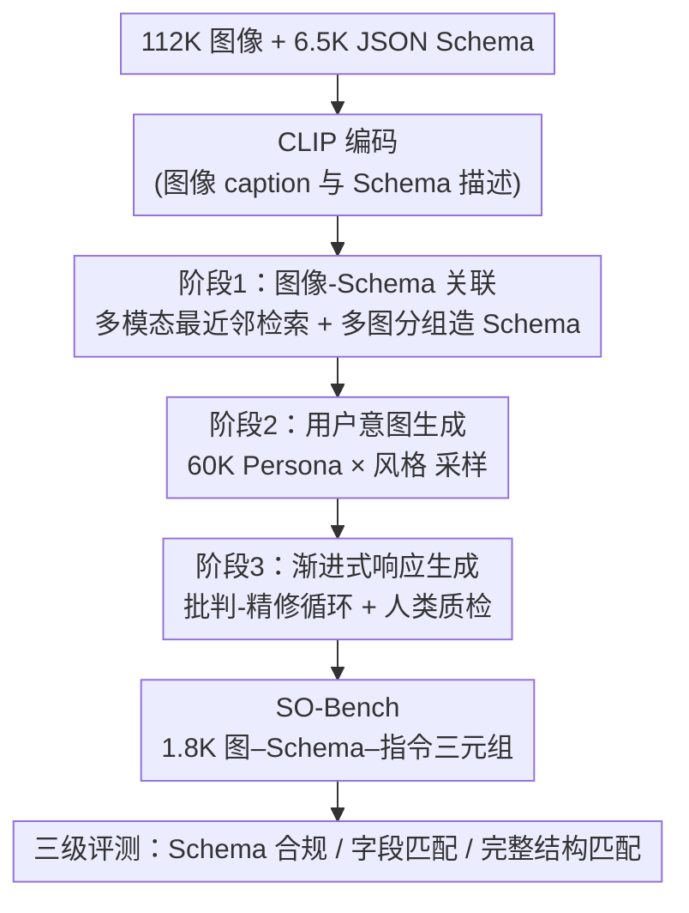

# SO-Bench: A Structural Output Evaluation of Multimodal LLM

**会议**: CVPR 2026  
**论文**: [CVF Open Access](https://openaccess.thecvf.com/content/CVPR2026/html/Feng_SO-Bench_A_Structural_Output_Evaluation_of_Multimodal_LLM_CVPR_2026_paper.html)  
**代码**: https://github.com/apple/ml-sobench  
**领域**: 多模态VLM  
**关键词**: 结构化输出, JSON Schema, 多模态评测基准, 信息抽取, Agentic工具调用

## 一句话总结
这是 Apple 提出的首个系统评测「多模态大模型把视觉输入转成符合预定义 JSON Schema 的结构化输出」能力的 benchmark——SO-Bench 用一条三阶段自动标注管线，从 11.2 万张四领域图像、6.5K 个 JSON Schema 中构造了 1.8K 个「图像–Schema–指令」三元组，配套三级评测指标，揭示了即便最强的 Gemini-2.5-Pro 完全正确率也只有 18.9% 的巨大差距。

## 研究背景与动机

**领域现状**：MLLM 越来越多地被部署到 agentic 场景（网页自动化、数据抽取、工具调用），这时模型的输出不是给人看的，而是要被下游系统、控制器、API 消费——它必须严格符合一个预定义的 JSON Schema，否则下游程序根本无法解析。OpenAI、Gemini、Anthropic 都已上线「结构化输出模式」来强约束这件事。

**现有痛点**：纯文本的结构化输出已有 StructEval、JSONSchemaBench、StructBench 等 benchmark 在评，但**视觉**结构化输出几乎无人系统评测。已有的视觉结构化工作各有局限：Pix2Struct / Image2Struct 偏重截图转 HTML 或对渲染图做语义解析，领域窄且偏 captioning；IR3D-Bench 只测纯合成 3D 场景重建；最接近的文档 KIE（关键信息抽取）任务，则只针对扁平的预定义关键词、一层字典，完全没有真实世界 Schema 那种嵌套、复杂的结构。

**核心矛盾**：现实下游应用要求的 Schema 是**多层嵌套、字段类型多样、随应用定制**的（深达 22 层、超 2K 字段），而现有评测要么不带图像输入、要么只覆盖很窄的视觉域、要么 Schema 过于简单——没有任何研究能量化「MLLM 在视觉证据 grounding 下产出 Schema 合规输出」的真实能力。

**本文目标**：(1) 造一个覆盖真实多样 Schema、跨四个视觉域的高质量 benchmark；(2) 用它系统测出现有 MLLM 的差距；(3) 验证针对性训练能否补上这个差距。

**核心 idea**：把「视觉结构化输出」形式化为 $p(Y|I,X,S)$——给定图像 $I$、JSON Schema $S$、用户指令 $X$，模型自回归生成既**语法符合** $S$ 又**语义反映** $I$ 与 $X$ 的结构化输出 $Y$；并用一条「多模态嵌入检索 + 多图分组造 Schema + 人在环路批判精修」的自动标注管线把这个任务的高质量数据规模化造出来。

## 方法详解

### 整体框架

SO-Bench 不是一个模型而是一套「数据 + 评测」基础设施。它的核心难点是：怎么把一张图像和一个有代表性的 JSON Schema 关联起来，并高效、准确地生成它对应的结构化输出标注。作者用一条**三阶段自动标注管线（每阶段都有人类专家质检）**解决：① Schema 生成阶段——给图像配上 Schema（从仓库检索或多图分组现造）；② 用户意图生成阶段——给「图–Schema」对加上模拟真实人机交互的用户指令；③ 响应生成阶段——用「批判–精修」循环迭代产出并校验结构化标注。所有图像与 Schema 先经 CLIP 编码以支持嵌入检索。最终配一套把性能拆成「Schema 合规 / 结构保真 / 取值准确」三层的评测管线。

### 关键设计

**1. 视觉结构化输出任务定义：把「读图填表」形式化为 Schema 约束下的条件生成**

论文先把任务钉死成一个清晰的概率形式 $p(Y|I,X,S)$：输入是图像 $I$、一个嵌套 JSON Schema $S$（指定 key、数据类型、对象层级）、一条用户指令 $X$（可以精确描述，也可以含糊到「帮我存下这张海报」），输出 $Y$ 必须**同时**满足两个正交约束——语法上严格 conform 于 $S$，语义上准确反映从 $I$ 和 $X$ 抽取的信息。这个定义之所以关键，是它把「文档 KIE 抽几个扁平字段」升级成「面向真实下游应用的、带任意嵌套结构的 Schema 适配」：难度来源被显式拆成「视觉信息抽取」与「层级结构对齐」两件事，也正是后面三级指标分别去测的两个维度。基准的多样性由图像（域覆盖、视觉表征）和 Schema（结构复杂度、字段类型）两侧共同撑起。

**2. 三阶段人在环路自动标注管线：用 frontier 模型造数据、用 CLIP 检索保相关、用 critic-refiner 保质量**

这是整个 benchmark 能规模化的发动机，针对「人工标注嵌套 JSON 标注成本极高、随机配对 Schema 又不相关」的痛点。**阶段一 图像–Schema 关联**：先用 GPT-4o 给图像生成 dense caption，再用 CLIP 抽图像 / caption / Schema 三种嵌入；对每张图在 Schema 库里做多模态最近邻检索，相似度按加权余弦 $\text{sim}(I,S)=w_1\cos(E_I,E_S)+w_2\cos(E_T,E_S)$ 算（$E_I,E_T,E_S$ 分别是图像、caption、Schema 嵌入），取 top-$k$（$k=20$）后再让 GPT-5 从候选里选最匹配的一个，并掺入随机选择增加多样性。当库里没有合适 Schema 时走**多图分组现造**：对查询图取 top-$m$（$m=3$）近邻图，把这一簇图一起喂给 Schema 生成器，让它提炼出跨图共享的统一嵌套 Schema（如多条目菜单、多 section 表单），图–图相似度用四项加权余弦 $\text{sim}(I_i,I_j)=w_1\cos(E_{I_i},E_{I_j})+w_2\cos(E_{I_i},E_{T_j})+w_3\cos(E_{T_i},E_{I_j})+w_4\cos(E_{T_i},E_{T_j})$。**阶段二 用户意图生成**：借鉴 persona-based prompting，先合成 6 万个在年龄、职业、地域上各异的用户画像，每个「图–Schema」对随机采一个画像 + 一种聊天风格，产出对话式 / 直接 / 含糊 / 甚至方言等多样指令。**阶段三 渐进式响应生成与精修**：用 Gemini-2.5-Pro 产初版输出（必要时喂 OCR 文本、ground-truth 值、布局元数据、UI 的 HTML 结构作辅助），再用 LLM validator 组成的 critic-refiner 工作流检查 Schema 合法性与语义一致性、给改进建议，非法或次优输出最多重生成三次，GPT-5 负责精修；全程八位人类领域专家在每阶段质检过滤后才放行下一阶段。

**3. 三级分解评测指标：把「对不对」拆成 Schema 合规、字段匹配、完整结构匹配，并配 exact/fuzzy/ignore 三档匹配**

针对「结构化输出对错不是二元」这一痛点，作者沿用 BFCL 的 AST 评测思路，把模型输出和 dict 形式的 ground truth 递归逐 key 比较，并把性能拆成三个递进指标。① **Schema Validation Accuracy**：输出相对 Schema 定义合法的样本占比，纯测语法合规。② **Field Matching Accuracy (FMA)**：设 $F(D)$ 为嵌套字典 $D$ 的全部字段（含中间嵌套节点与叶子），则

$$\text{FMA}=\frac{\sum_{k=1}^{N}\big|\{f\in F(G^{(k)}):\exists f'\in F(O^{(k)}),\ \text{Match}(f,f')\}\big|}{\sum_{k=1}^{N}\big|F(G^{(k)})\big|}$$

其中嵌套结构当且仅当其所有子字段都匹配才算匹配。③ **Full Structure Matching Accuracy (FSMA)**：整条输出全字段都匹配才算 1，即

$$\text{FSMA}=\frac{1}{N}\sum_{k=1}^{N}\mathbb{1}\big[\forall f\in F(G^{(k)}),\ \exists f'\in F(O^{(k)}):\text{Match}(f,f')\big]$$

而 $\text{Match}$ 本身分三档：primitive 默认 **exact**；当 ground truth 不含图中显式文字（如折线图里的精确数值）时允许 **fuzzy**（字符串用归一化编辑距离、数值用相对误差）；对非必填且与用户意图无关的字段标 **ignore**（直接给 1 分跳过比较）。为支持这种细粒度评测，管线里专门加了一步「评测标签生成」——把图、Schema、用户意图、最终 ground-truth 一起喂给 MLLM，为每个 primitive 字段生成 {exact, fuzzy, ignore} 的匹配类型。

## 实验关键数据

### 主实验

在 1.8K 测试集上横扫开源与闭源模型，三档核心指标（fuzzy 版）如下（节选）：

| 模型 | Schema 合规 | 字段匹配(Fuzzy) | 完整匹配(Fuzzy) |
|------|-------------|-----------------|-----------------|
| Gemini-2.5-Pro | 97.74 | **73.14** | **18.91** |
| GPT-5 | 96.38 | 62.74 | 11.60 |
| Gemini-2.5-Flash | 91.69 | 66.32 | 11.31 |
| Claude-4.5-Sonnet | 96.50 | 62.67 | 8.74 |
| Qwen2.5-VL (3B) | 60.71 | 41.59 | 2.68 |
| Phi-4-Vision (5.6B) | 22.04 | 27.78 | 0.72 |

最强的 Gemini-2.5-Pro 在 Schema 合规上接近 98%，说明 frontier 模型「会按 Schema 框架填空」；但**完整结构匹配**上谁都没破 20%（最高 18.9%），说明「整条输出全字段都填对」仍是大坑。小模型（3B/7B）在所有指标上都与闭源大模型有巨大鸿沟，尤其 Schema 合规普遍只有 50%–70%。作者进一步发现：字段匹配与完整匹配之间的大落差，常常源于模型对某些字段给了**语义上正确但 fuzzy 匹配抓不住**的答案——这也是他们坦言的指标局限。

### 关联性与消融分析

| 对比维度 | 关键发现 |
|----------|----------|
| 与外部 benchmark 相关性 (Table 2) | SO-Bench 与 **BFCL(r=0.79)、MMMU(r=0.79)、MIABench(r=0.88)、LiveBench-Coding** 强相关，说明结构化输出能力与 agentic 工具调用、通用视觉知识、视觉指令跟随高度绑定；与 IFEval、RefCOCO 几乎不相关 |
| Schema 深度 (Fig.6) | 深度越大两项指标都单调下降；GPT-5 / Gemini-2.5-Pro 在深度 >6 时仍能保持 Schema 合规 >95%，而 Intern3.5-VL(4B) 暴跌约 40% |
| 结构化 API vs 指令跟随 (Table 3) | GPT-4o 系用结构化 API 时 Schema 合规略升但字段匹配反降；GPT-5/Gemini 系反而是指令 prompt 更优——说明 API 强约束 Schema 的同时可能**牺牲取值准确性** |

### 训练实验

作者用同一管线（去掉人工核验）造了 11.4 万训练样本，在内部 3B 稠密模型（ViTDet-L 视觉编码器 + AnyRes）上做 SFT 与 RLVR：

| 配置 | Schema 合规 | 字段匹配(Fuzzy) | 完整匹配(Fuzzy) |
|------|-------------|-----------------|-----------------|
| Baseline 3B | 58.7 | 45.6 | 4.4 |
| +RLVR | 72.0 | 47.1 | 4.9 |
| +SFT | **81.3** | **54.9** | **6.5** |

SFT 把 Schema 合规拉高 ~20 个点、字段匹配 ~13 个点，全量训练后 3B 模型甚至能逼平 10 倍大的模型；且随数据规模上升性能持续涨、未见 plateau。

### 关键发现
- 「按 Schema 框架填空」与「全字段填对」是两种难度天差地别的能力——所有模型在前者上能到 95%+，在后者上没人破 20%。
- 结构化输出能力与 agentic 工具调用（BFCL）、视觉指令跟随（MIABench）的强相关，暗示它本质考的是「多模态结构化推理」而非单纯 OCR。
- 强约束的结构化输出 API 不是免费午餐：它保了语法合规，却可能压住内容生成、降低取值准确率。

## 亮点与洞察
- **把模糊的「结构化输出对不对」拆成三级正交指标 + 三档匹配策略**，既能公平比较不同 Schema 响应，又把「语法合规」和「取值准确」彻底解耦——这套评测协议本身比 benchmark 数据更可复用。
- **persona × 风格采样造指令**这个 trick 很巧：用 6 万用户画像随机配聊天风格，一举把单调的「按 Schema 抽信息」扩成对话式 / 含糊 / 方言等真实分布，逼近线上 agent 面对的指令噪声。
- **多图分组现造 Schema** 解决了「单图模板太浅」的问题：对一簇近邻图提炼共享嵌套结构，天然造出多条目菜单、多 section 表单这类深层 Schema，把结构复杂度推到 22 层。
- 相关性分析给了一个可迁移结论：想提升结构化输出，与其堆 OCR 能力，不如补 agentic 推理与视觉指令跟随——这对下游做 agent 的人是直接的能力配方。

## 局限与展望
- 作者自承评测**只用 exact/fuzzy 匹配、不做语义匹配**（为了简单与可复现），导致很多「语义对但表述不同」的字段被误判为错，这正是字段匹配与完整匹配间大落差的一部分来源；更灵活的匹配函数是明确的未来工作。
- 数据偏向英文、且对测试集做了下采样，多语种、长尾域的结构化输出能力未覆盖。
- 标注管线重度依赖 GPT-5 / Gemini-2.5-Pro 当 generator 与 critic，ground-truth 本身带这些 frontier 模型的偏置；⚠️ 人在环路虽缓解但难完全消除「用强模型评强模型」的循环依赖问题。
- 训练实验只在单个内部 3B 模型上做，SFT/RLVR 的增益能否泛化到更大模型或不同架构未验证。

## 相关工作与启发
- **vs 文本结构化 benchmark（StructEval / JSONSchemaBench / StructBench）**：它们只测纯文本输入下的格式保真与约束解码，SO-Bench 把战场搬到视觉输入，多了「从图像抽证据并对齐嵌套 Schema」这一核心难度。
- **vs 视觉结构化先例（Pix2Struct / Image2Struct / IR3D-Bench）**：前者偏截图转 HTML / 渲染图语义解析 / 纯合成 3D 重建，领域窄；SO-Bench 覆盖 UI / 自然图 / 文档 / 图表四域 + 真实定制 Schema。
- **vs 文档 KIE / OCR benchmark（OCRBenchV2 / CC-OCR / OmniDocBench）**：它们做扁平关键词抽取、一层字典模板，SO-Bench 强调带嵌套结构、应用驱动的真实 JSON Schema 适配。
- **vs agentic 工具调用 benchmark（BFCL / Tau-Bench / ToolVQA）**：它们聚焦文本 API 或有限工具集，SO-Bench 用大规模多样 JSON Schema 把感知与结构化推理桥接起来，且实验证实二者强相关。

## 评分
- 新颖性: ⭐⭐⭐⭐⭐ 首个系统评测视觉结构化输出的 benchmark，任务定义、数据管线、三级指标都是空白填补。
- 实验充分度: ⭐⭐⭐⭐⭐ 22 个开闭源模型横扫 + 外部 benchmark 相关性 + Schema 深度 + API 对比 + SFT/RLVR 训练，维度极全。
- 写作质量: ⭐⭐⭐⭐ 任务定义与管线讲得清楚，指标公式完整；部分图表分析需翻附录。
- 价值: ⭐⭐⭐⭐⭐ 直击 agent 落地刚需，评测协议与数据管线都高度可复用，且开源。

<!-- RELATED:START -->

## 相关论文

- [\[CVPR 2026\] CrossHOI-Bench: A Unified Benchmark for HOI Evaluation across Vision-Language Models and HOI-Specific Methods](crosshoi-bench_a_unified_benchmark_for_hoi_evaluation_across_vision-language_mod.md)
- [\[CVPR 2026\] StructXLIP: Enhancing Vision-Language Models with Multimodal Structural Cues](structxlip_enhancing_vision-language_models_with_multimodal_structural_cues.md)
- [\[CVPR 2026\] Breaking Multimodal LLM Safety via Video-Driven Prompting](breaking_multimodal_llm_safety_via_video-driven_prompting.md)
- [\[CVPR 2026\] Structural Graph Probing of Vision-Language Models](structural_graph_probing_of_vision-language_models.md)
- [\[CVPR 2026\] FAVE: A Structured Benchmark for Fine-Grained Audio-Visual Temporal Evaluation in Multimodal LLMs](fave_a_structured_benchmark_for_fine-grained_audio-visual_temporal_evaluation_in.md)

<!-- RELATED:END -->
