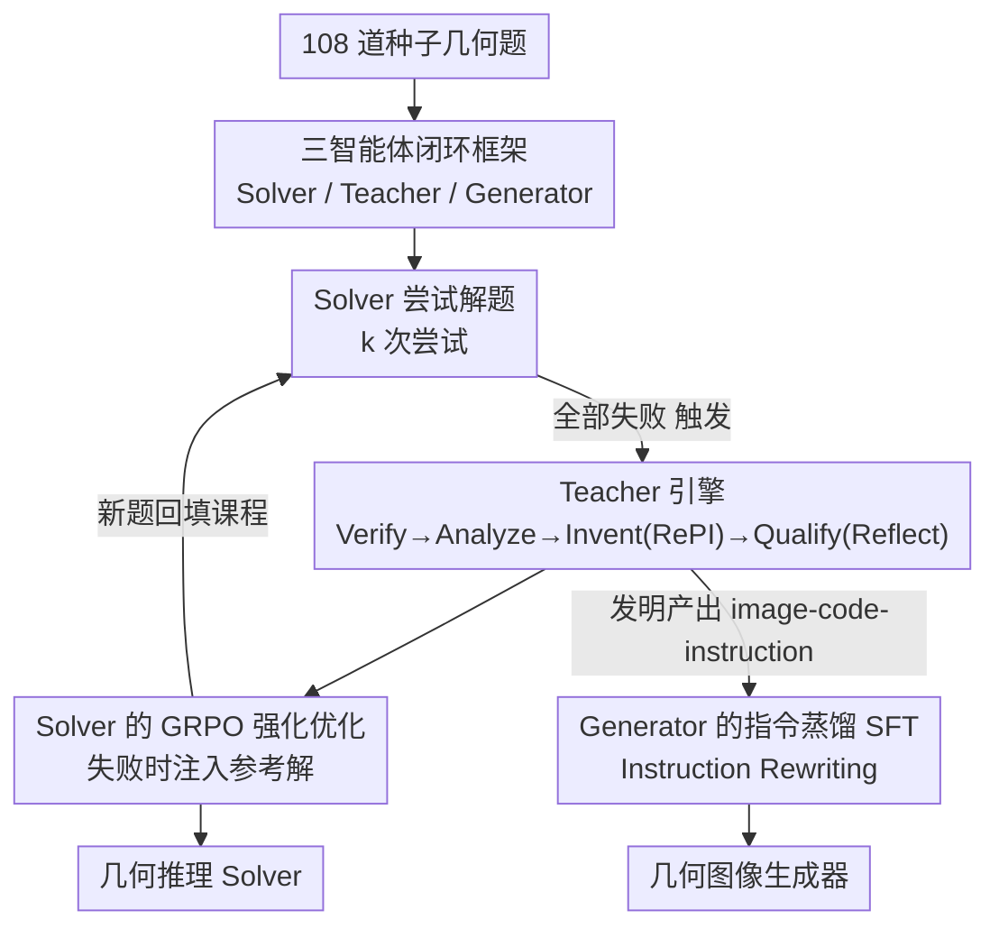

# Socratic-Geo: Synthetic Data Generation and Cross-Modal Geometric Reasoning via Multi-Agent Interaction

**会议**: CVPR 2026  
**论文**: [CVF Open Access](https://openaccess.thecvf.com/content/CVPR2026/html/Jiao_Socratic-Geo_Synthetic_Data_Generation_and_Cross-Modal_Geometric_Reasoning_via_Multi-Agent_CVPR_2026_paper.html)  
**代码**: 无  
**领域**: 多模态VLM  
**关键词**: 几何推理, 多智能体, 合成数据, 程序化生成, GRPO

## 一句话总结
Socratic-Geo 用「教师—解题者—生成器」三智能体闭环，从仅 108 道种子题出发、由教师诊断解题者失败后用 Python 代码程序化地改造几何图并自我验证，造出图文严格对齐的几何题课程：解题者用 1/4 数据在六个几何 benchmark 上拿到 49.11%（比最强 baseline 高 2.43 分），副产物图像生成器在 GenExam-Math 上达 42.4 分、刷新开源 SOTA。

## 研究背景与动机

**领域现状**：多模态大模型（MLLM）在视觉-语言理解上进步很快，但几何推理依旧是硬骨头——它同时要求精确的视觉感知和严密的逻辑演绎。要让模型学会几何，最缺的就是「图文严格对齐」的高质量训练数据。

**现有痛点**：现有的几何数据合成大致分三类，每类都有结构性缺陷。其一，**基于图像的文本增强**（R-CoT、Geo170K 一类）只在已有图片上润色文字描述，是被动的，不会构造新的几何结构；其二，**符号驱动的随机生成**（InterGPS、TrustGeoGen）靠形式语言保证正确性，但盲目穷举、先生成海量候选再启发式过滤，效率极低；其三，**LLM 驱动的增强**像个黑箱放大器，多样但继承模型偏见、缺乏细粒度控制。

**核心矛盾**：上面三类有一个共同的根本问题——它们都产出**静态、单向**的数据集，数据合成与模型学习是**解耦**的。生成发生在训练之外，模型当前到底哪里不会、需要补什么样的题，完全没有反馈进合成环节，于是大量算力浪费在模型本来就会的题上。更要命的是，几何里图和文必须在公理层面一致（图上画了什么辅助线、文字就得说什么），而纯语言的教师无法用工具去程序化地修改图、也无法验证几何完整性，导致 (图, 文, 解) 三元组不可靠。

**本文目标 / 核心 idea**：构造一个把「数据合成」和「模型学习」动态耦合起来的引擎。受苏格拉底式诘问启发，让一个强大的教师智能体**诊断解题者的失败**、据此**有目标地**用代码改造几何题，并在加入课程前自我验证图文一致性——用「学习者驱动的合成」取代「盲目探索 + 事后过滤」。

## 方法详解

### 整体框架

Socratic-Geo 是一个从极小种子集（仅 108 道题）出发、不依赖外部数据的**闭环合成引擎**，由三个分工明确的智能体驱动：

- **Solver（解题者 $S$）**：被训练的推理模型（Qwen2.5-VL-7B），尝试解当前课程里的题。它的表现、尤其是**失败**，是驱动整个合成过程的主信号。
- **Teacher（教师 $T$）**：框架的认知核心（Qwen3-VL-235B 这种强模型）。它分析解题者的失败，**程序化地发明**新题去针对性补上推理短板。
- **Generator（生成器 $G$）**：一个基于扩散的图像生成模型（Qwen-Image），学着画高保真几何图。它独立于核心推理环之外，是"顺带"训练出来的副产物。

整条流水线以「推理」为中心闭环运转：解题者失败 → 触发教师诊断与发明 → 教师产出经验证的新题三元组 → 回填课程 → 解题者下一阶段在更难的题上继续训练。课程 $C$ 的演化可形式化为：当解题者在某题 $k$ 次尝试都判错（$\sum_i V(q, a_S^{(i)}, a^*)=0$）时，就触发教师的发明流程，产出一个新的、经校验的三元组 $(I_{new}, q_{new}, a_{new})$ 追加进 $C_{t+1}$。与此并行，教师每发明一道题，还会把它翻译成自然语言绘图指令，喂给生成器做监督微调。

### 关键设计

**1. 三智能体闭环：让数据合成跟着学习者的弱点走**

这一设计直接打的是「合成与学习解耦」这个痛点。传统方法造完一批静态数据就结束，而 Socratic-Geo 让解题者的**失败成为合成的触发器和导航仪**。具体地，解题者用策略 $\pi_S$ 对每道题生成 $k$ 个解，只有当这 $k$ 次全军覆没时才唤醒教师；教师不是随便出题，而是针对这道被做错的题去诊断"到底哪步推理塌了"，再发明一道**强化了关键约束**的新题。这样课程始终贴着解题者当下的能力边界生长，把算力集中在"模型刚好不会"的题上。生成器则被刻意设计成**独立于推理环**——它不参与解题者/教师的决策，只消费教师发明过程中顺手产生的高质量资产，因此叫"协同副产物"。

**2. 教师引擎 Verify→Analyze→Invent(RePI)→Qualify(Reflect)：用程序化代码改图并自验证**

这是全框架的认知核心，解决"纯语言教师无法可靠地改图、验图"的矛盾。教师把出题做成一条四步流水线：**Verify** 先把解题者的回答和参考解形式化比对，定位错误推理；**Analyze** 做双模态错误诊断——对几何代码（及其渲染出的图）检查结构属性、找缺失或被违反的公理，对文字找语义不一致或欠约束的描述，从而锁定修复所需的最小改动；**Invent（即 RePI）** 真正地去**程序化修改底层 Python 几何代码**，把分析出的关键约束显式塞进新题，并确保代码能跑通、生成的图与新文字描述严格对齐——这就是论文反复强调的"用代码改造结构"而非被动适配；**Qualify（即 Reflect）** 是自验证关卡：教师用自己的推理流程把新发明的题再解一遍，只有解出的答案与参考一致、且几何通过所有合法性检查，这道题才被允许进入课程并用于给生成器配 (文, 图) 对。经过这四步，每个 (图, 文, 解) 三元组都是**可执行、几何自洽、文字精确、且针对解题者短板**的。这里 RePI（视觉有效性验证 / 程序化绘图）和 Reflect（可解性 / 自洽性检查）是两个互补的把关器，对应摘要里的 "Reflect for solvability, RePI for visual validity"。

**3. 基于 GRPO 的解题者优化：失败也要给金标准信号**

解题者通过 Group Relative Policy Optimization（GRPO）从教师供给的高质量针对性数据中进化。GRPO 是一种用可验证规则给输出打分的策略梯度算法：对一道题采 $G$ 个候选解，每个拿到标量奖励 $R_i$，用组内归一化算优势 $A^{(i)} = \big(R_i - \mathrm{mean}(\{R_j\})\big) / \mathrm{std}(\{R_j\})$，再用 PPO 的截断目标在 token 级优化、并加 KL 正则约束策略漂移——好处是去掉了价值网络、稀疏奖励下更稳。本文的关键巧思在于**处理全失败的情形**：当某题 $k$ 次尝试奖励全为 0 时，正负样本集退化为以教师**自己验证过的参考解 $a_{ref}$ 作为唯一正例**、$k$ 个失败解作为负例（见公式 4），保证解题者即使彻底做不出来，也能拿到一个金标准的对照信号去学，而不是这道题白白浪费。

**4. 生成器的指令蒸馏 SFT：把教师的程序绘图智能蒸进扩散模型**

这一设计回收了教师发明过程里产生的宝贵资产。教师每造一道新题、得到其程序化表示后，会额外做一步：把这套结构化信息翻译成一条自然语言**绘图指令** $p_{diagram}$，从而得到高质量的 (指令, 图) 对。生成器（扩散模型）就在这些 $(p_{diagram}, I_{new})$ 对上做监督微调，目标是标准的噪声预测损失 $L_{SFT}(\theta_G) = \mathbb{E}\big[\|\epsilon - \epsilon_{\theta_G}(z_t, t, p_{diagram})\|^2\big]$。这本质是一种**知识蒸馏**：教师那套符号化、规则化、精确的绘图智能被蒸进生成器的神经权重——生成器学的是"结构化蓝图 → 几何精确图"的映射，而非从模糊提示词到像素的弱监督。论文把这一步称为 Instruction Rewriting（IR），消融显示它是生成质量的命门。

### 一个完整示例

论文 Fig.4 给了个具体走查：一道题"三角形 ABC，∠BAC=60°，AB=6，AC=8，AD⊥BC，求外接圆半径 R"。**解题者**错误地假设这是直角三角形，用 $AB^2+AC^2=100 \Rightarrow BC=10$ 推出 $R=5$——它**忽略了 ∠BAC=60° 这个关键条件**。**教师**先 Verify 发现答案 $2\sqrt{39}/3 \neq 5$，Analyze 诊断出"只用面积公式求外接圆半径、丢了 60° 约束"，然后 Invent：**引入新点 P**（AD 延长线与外接圆的第二个交点），把题改成"求 AP 长度"，逼着解题者必须用圆周角定理结合 60° 角去建立 ∠APD 与 ∠ACD 的关系，正中其推理盲区。最后 Qualify 自解新题通过后，这道增强题才进课程。这个例子把"诊断失败 → 程序化加结构 → 自验证"的闭环具象化了。

## 实验关键数据

模型配置：教师用 Qwen3-VL-235B-A22B-Instruct，解题者基于 Qwen2.5-VL-7B-Instruct 用 GRPO 训练，生成器基于 Qwen-Image 做 SFT，32×A100。从 108 道种子题出发，课程分三阶段递增（0.4k → 1k → 2.5k）。

### 主实验：六个几何 benchmark（Mean@1 %）

| 方法 | 数据量 | MathVerse | GeoQA | MathVision | MathVista | WeMath | Overall |
|------|--------|-----------|-------|-----------|-----------|--------|---------|
| Qwen2.5-VL-7B（Zero-shot） | — | 39.59 | 43.92 | 22.70 | 61.10 | 57.59 | 44.98 |
| + R-CoT | 7.2k | 40.86 | 46.49 | 22.72 | 62.60 | 57.59 | 46.05 |
| + Geo170K | 10k | 40.36 | 47.16 | 24.34 | 62.00 | 57.44 | 46.26 |
| + GeoReasoning | 10k | 40.99 | 46.76 | 24.34 | 63.40 | 57.90 | 46.68 |
| **Socratic-Solver（+Stage3）** | **2.5k** | **45.05** | **49.20** | **26.19** | **63.55** | **61.58** | **49.11** |

Socratic-Solver 用 **1/4 数据量**（2.5k vs 基线 7.2k–10k）拿到 49.11% 的 overall，比最强 baseline GeoReasoning（46.68%）高约 2.43 分，比 zero-shot 高 +4.13 分；在 MathVerse（45.05 vs 40.99）和 WeMath（61.58 vs 57.90）上优势尤其明显。⚠️ 正文 5.2 节另写到 "overall 42.07% / 超 GeoReasoning 39.82 高 2.25 分"，与 Table 1 的 49.11/46.68 数值对不上，疑为正文笔误，此处以 Table 1（与摘要、结论一致）为准。

### 生成器：GenExam-Math（Str / Rel）

| 模型 | Strict | Relaxed |
|------|--------|---------|
| GPT-Image-1（闭源） | 8.0 | 52.0 |
| Gemini-2.5-Flash-Image（闭源） | 0.7 | 43.1 |
| Seedream 4.0（闭源） | 2.6 | 39.8 |
| Qwen-Image（开源基座） | 0.0 | 18.9 |
| **Socratic-Generator-Image** | **6.0** | **42.4** |

生成器以 42.4 的 Relaxed 分刷新**开源 SOTA**，比基座 Qwen-Image（18.9）提升 23.5 分，超过闭源 Seedream 4.0（39.8）、逼近 Gemini-2.5-Flash-Image（43.1）。Relaxed 分定义为 $Rel = 0.7C + 0.1V_{sp} + 0.1V_{lc} + 0.1V_{rd}$（$C$ 为约束正确性，$V$ 为拼写/逻辑一致/可读性三项视觉质量），由 GPT-5 自动判分。

### 消融实验

| 消融项 | 设置 | 关键指标 | 说明 |
|--------|------|---------|------|
| Qualify 模块 | w/ Qualify | MathVerse 40.33（0.4k） | 自验证过滤，数据少但质量高 |
| Qualify 模块 | w/o Qualify | MathVerse 37.09（1.3k） | 去掉后数据更多却**跌破** 39.59 zero-shot |
| Instruction Rewriting | w/o IR | Str 0.0 / Rel 20.1 | 仅比基座微涨 |
| Instruction Rewriting | w/ IR | Str 6.0 / Rel 42.4 | 结构化绘图指令是命门 |

### 关键发现
- **Qualify（自验证）是数据质量的生死线**：去掉它虽然让训练集从 0.4k 涨到 1.3k，但 MathVerse 反而从 40.33 掉到 37.09、甚至低于 zero-shot——未验证的题引入了几何不一致和逻辑错误，"数据多"在这里是负资产。
- **Instruction Rewriting 决定生成器能否画对图**：去掉 IR 后 Strict 直接归零、Relaxed 仅 20.1；加上后跃升到 6.0/42.4，说明把题翻译成结构化绘图指令、而非喂模糊提示词，才是高保真几何图的关键。
- **数据效率惊人**：2.5k 合成题打平甚至超过别人 7.2k–10k 的真实/增强数据，印证"学习者驱动合成"比"盲目穷举 + 过滤"高效得多。
- **任务无关性**：把框架迁到 Chart Reasoning（ChartQA +3.9、CharXiv +7.6）和 Multimodal Coding（Design2Code +5.2、UIFlow2Code +5.6）都稳定涨点，说明苏格拉底式交互范式不局限于几何。

## 亮点与洞察
- **把"失败"当成最值钱的信号**：解题者解不出的那道题，恰恰精确指出了它的能力缺口——用失败触发并导航合成，等于让数据生产具备了主动学习的味道，这个思路可迁移到任何"有可验证奖励 + 有合成手段"的领域。
- **程序化代码是图文对齐的天然保险**：几何题的图、解、答案都从同一份 Python 代码渲染/计算而来，从源头杜绝了图文不一致，比"先画图再配文"可靠得多。RePI 这种"改代码而非改像素"的思路，对所有需要结构精确的视觉生成都有借鉴价值。
- **副产物即财富**：生成器完全不干预推理环，纯靠回收教师发明过程中产生的 (指令, 图) 对就训成了开源 SOTA——一条流水线产出两个能力，工程上很划算。

## 局限与展望
- **强依赖一个超强教师**：整个闭环的认知质量都压在 Qwen3-VL-235B 这种大模型上，教师的诊断/发明/自验证能力是天花板；教师本身的偏见或盲区会被系统性地传染进课程。
- **域依赖程序化可表达性**：方法的根基是"题目能用 Python 代码参数化地构造与验证"。几何、图表、UI 代码这些结构化域很合适，但对难以形式化表达的视觉推理任务（如开放场景理解）能否复用，论文没有验证。⚠️
- **自验证的可靠性边界**：Qualify 让教师自己解自己出的题，若教师在某类几何上本就薄弱，可能"自洽地犯错"——错题通过自验证进了课程。论文未深入分析这种自验证失效的比例。
- **指标自洽存疑**：正文 overall 数值（42.07/39.82）与 Table 1（49.11/46.68）冲突，外部读者需以原文表格为准；评测大量依赖 LLM-as-judge（3-vote、GPT-5），判分稳定性未充分讨论。

## 相关工作与启发
- **vs Socratic-Zero**：Socratic-Zero 是纯文本数学推理的多智能体框架，教师只做"文 → 文"的题目改写、生成器学文本变换。本文指出它**无法迁到几何**——几何里图是题目定义的一部分、必须与文字公理级对齐，而纯语言教师没法用工具改图/验图。Socratic-Geo 的突破正是引入**程序化代码控制（RePI）**，让教师能真正动几何结构并验证。
- **vs 几何数据合成（R-CoT / Geo170K / TrustGeoGen / GeoReasoning）**：这些方法要么被动润色文字、要么模板化随机穷举再过滤，产出静态单向数据。本文用"诊断学习者弱点 → 目标驱动合成"取代盲目探索，且用 1/4 数据量反超它们。
- **vs 符号驱动随机生成（InterGPS / TrustGeoGen）**：它们靠形式语言保正确但盲目穷举、效率低；本文同样用程序化/可验证手段保正确，但把"生成什么"交给学习者的失败来决定，避免无效候选。

## 评分
- 新颖性: ⭐⭐⭐⭐⭐ 把苏格拉底式多智能体闭环 + 程序化代码改图引入跨模态几何推理，并顺带蒸出 SOTA 生成器，范式确有新意。
- 实验充分度: ⭐⭐⭐⭐ 六个 benchmark + 两个消融 + 跨域泛化都做了，但正文与表格数值不自洽、重度依赖 LLM 判分略减分。
- 写作质量: ⭐⭐⭐⭐ 动机与 pipeline 讲得清楚，Fig.4 走查很具象；个别数值前后矛盾。
- 价值: ⭐⭐⭐⭐⭐ "失败驱动 + 程序化合成 + 一条流水线两个能力"对数据稀缺的结构化推理任务很有借鉴价值，且证明了任务无关性。

<!-- RELATED:START -->

## 相关论文

- [\[CVPR 2026\] CogniVerse: Revolutionizing Multi-Modal Retrieval-Augmented Generation with Cognitive Reflection and Geometric Reasoning](cogniverse_revolutionizing_multi-modal_retrieval-augmented_generation_with_cogni.md)
- [\[CVPR 2026\] Hierarchical Attacks for Multi-Modal Multi-Agent Reasoning](hierarchical_attacks_for_multi-modal_multi-agent_reasoning.md)
- [\[CVPR 2026\] CRIT: Graph-Based Automatic Data Synthesis to Enhance Cross-Modal Multi-Hop Reasoning](crit_graph-based_automatic_data_synthesis_to_enhance_cross-modal_multi-hop_reaso.md)
- [\[CVPR 2026\] Role-SynthCLIP: A Role-Play Driven Diverse Synthetic Data Approach](role-synthclip_a_role-play_driven_diverse_synthetic_data_approach.md)
- [\[CVPR 2026\] Think with 3D: Geometric Imagination Grounded Spatial Reasoning from Limited Views](think_with_3d_geometric_imagination_grounded_spatial_reasoning_from_limited_view.md)

<!-- RELATED:END -->
