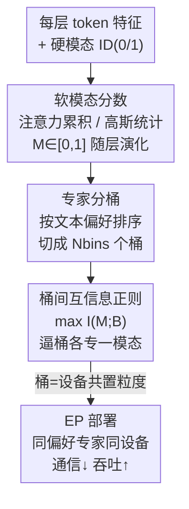

# Soft Modality-Guided Expert Specialization in MoE-VLMs

**会议**: CVPR 2026  
**论文**: [CVF Open Access](https://openaccess.thecvf.com/content/CVPR2026/html/Bo_Soft_Modality-Guided_Expert_Specialization_in_MoE-VLMs_CVPR_2026_paper.html)  
**代码**: 无  
**领域**: 多模态VLM  
**关键词**: MoE, 视觉-语言模型, 专家路由, 模态特化, 专家并行

## 一句话总结
针对 MoE-VLM 里"视觉/文本 token 该如何引导专家路由"这个被忽视的问题，本文提出 SMoES：用随层变化的"软模态分数"代替硬模态标签、把专家分成若干 bin、再用互信息正则把 bin 推向模态特化，从而在四个 MoE 骨干、16 个 benchmark 上同时拿到精度提升（多模态 +0.9%、纯语言 +4.2%）和部署效率提升（专家并行通信开销降 56.1%、吞吐 +12.3%）。

## 研究背景与动机

**领域现状**：MoE（Mixture-of-Experts）已经成为大型视觉-语言模型（VLM）的主流骨干——DeepSeek-VL2、Kimi-VL、GLM-4.5V、InternVL-3.5 都靠"条件计算"在几乎不增加每 token 算量的情况下把模型容量做大。MoE-VLM 路由 token 主要有两种范式：**硬路由**（把专家预先绑死到某个模态）和**软路由**（任何专家都能处理任何 token，是当前主流）。

**现有痛点**：硬路由特化很彻底，但边界僵硬，跨模态特征和"表征随层逐渐融合"的自然现象都没法适应；软路由灵活，但常常靠启发式先验或一个跟实际模态分布脱钩的辅助 loss，结果要么"过度混合"（专家学不出分工）、要么"特化不足"。混合路由（部分专家硬绑模态、部分共享）则依赖人工划分、且对所有层一刀切，跟特征逐层演化对不上。

**核心矛盾**：作者在 LLaVA-1.5 和一个 DeepSeekMoE-VLM 上分析模态融合，发现一个被现有路由忽略的事实——**模态融合是多尺度异质的**。宏观上，不同模型、不同层的视觉-文本 JS 散度轨迹差别很大；微观上，即便同一层同一模态内部，有的 token 仍是"纯模态"、有的已经"跨模态"。因此无论"强制硬分离"还是"统一混合"，都和模态真实的交互方式错位。更要命的是，视觉 token 数量多但信息密度低（空间冗余）、文本 token 少但语义集中，这种不对称在专家并行（EP）部署下还会让 token 散落到各设备，把跨设备通信开销撑大。

**本文目标**：① 让路由跟随"逐层演化的模态结构"而不是固定的模态身份；② 让专家分工的同时还能对齐 EP 部署粒度，把通信打下来。

**切入角度**：既然模态身份是连续、随层平滑过渡的，那就别再用 0/1 硬标签，而用一个 $[0,1]$ 的**软模态分数**去刻画每个 token 当前的融合状态，再用这个分数去引导专家特化。

**核心 idea**：用"软模态分数 + 专家分桶 + 桶间互信息正则"三件套，把模态特化从"人工硬指定"变成"数据驱动、随深度自适应学习"，并让特化结果天然对齐设备摆放，一举打通效果和效率。

## 方法详解

### 整体框架
SMoES 不改 MoE 的基本结构（vision encoder → projector → MoE-LLM），只在路由这一环动手，由三个互相咬合的部件组成。输入是每层的 token 特征 $x_{ij}\in\mathbb{R}^D$（$i$ 是样本、$j$ 是 token），先由 **soft modality scores** 把每个 token 当前的模态归属算成一个软分数 $M^{(l)}_{ij,m}\in[0,1]$（$m\in\{\text{text},\text{vision}\}$，两者和为 1）；专家则被 **expert binning** 分成若干 bin（桶），bin 是特化和设备摆放的基本单位；最后 **inter-bin MI 正则**最大化"模态分数 $M$"与"被选中 bin $B$"之间的互信息，逼着不同 bin 各自专攻不同模态。三者合到一起：软分数提供"token 此刻偏哪个模态"的连续信号，MI 把这个信号转成"bin 级别的模态偏好"，bin 又正好是 EP 里同设备共置的粒度——于是特化和部署效率被同一套机制串起来。

每层 MoE 路由的基础打底跟标准 MoE 一致：router 算 gating 分数 $g_{ij,e}=\mathrm{softmax}(W_{\text{gate}}x_{ij})_e$，top-$k$ 选最高的 $k$ 个专家，并配一个负载均衡 loss $\mathcal{L}_{\text{bal}}=\sum_l N_e\sum_{e=1}^{N_e} f_e P_e$（$f_e$ 是路由到专家 $e$ 的 token 比例、$P_e$ 是平均 gating 分数）防止路由坍缩。SMoES 的三个设计都叠在这个基础之上。

### 关键设计

**1. 软模态分数：用两个互补估计器把"硬模态标签"软化成随层演化的连续信号**

硬模态标签（输入处给的 0/1）描述不了"token 表征随层逐渐融合"这件事，所以这里给每个 token、每层、每个模态算一个软分数 $M^{(l)}_{ij,m}\in[0,1]$。作者给了两个互补的估计器。

*注意力累积分数*盯的是局部、序列内的跨 token 交互——一个 token 注意别人时，会按注意力权重吸收别人的模态特性。第 0 层用硬标签初始化 $M^{\text{attn},(0)}_{ij,m}=\mathbf{1}\{m=m(x_{ij})\}$，之后两步更新：先按注意力权重聚合邻居分数 $\tilde{M}^{\text{attn},(l)}_{ij,m}=\sum_{j'}\mathrm{Attn}^{(l)}_{j,j'}\cdot M^{\text{attn},(l)}_{ij',m}$（$\mathrm{Attn}^{(l)}$ 是该层跨头平均的注意力矩阵），再用特征范数加权把"聚合分"和"原分"残差式融合：

$$M^{\text{attn},(l+1)}_{ij,m}=\frac{\|x^{(l)}_{\text{attn},ij}\|\cdot\tilde{M}^{\text{attn},(l)}_{ij,m}+\|x^{(l)}_{ij}\|\cdot M^{\text{attn},(l)}_{ij,m}}{\|x^{(l)}_{\text{attn},ij}\|+\|x^{(l)}_{ij}\|}$$

这一步刻意对齐了 Transformer 的残差结构（$x^{(l+1)}=x^{(l)}+x^{(l)}_{\text{attn}}$），用特征范数当注意力支路和残差支路的贡献权重。

*高斯统计分数*则是全局、分布式的视角：不同模态 token 在嵌入空间里分布不同，那就为每层每模态维护一个对角协方差高斯 $(\mu_m,\sigma^2_m)$，用 Welford 算法的 EMA 变体在线更新统计量（衰减因子 $\beta$）。对每个 token 算它在各模态分布下的对数似然 $\mathrm{LL}_{ij,m}=-\tfrac12\sum_d\big(\log\sigma^2_{m,d}+\tfrac{(x_{ij,d}-\mu_{m,d})^2}{\sigma^2_{m,d}}\big)$，再做温度缩放 softmax 得软分数 $M^{\text{gauss}}_{ij,m}=\frac{\exp(\mathrm{LL}_{ij,m}/\tau)}{\sum_{m'}\exp(\mathrm{LL}_{ij,m'}/\tau)}$。这个估计器不依赖第 0 层初始化，能"瞬时"判断模态归属。两者一个偏文本、一个在高融合区偏视觉，互为补充。

**2. 专家分桶：把特化的粒度对齐到 EP 设备摆放单位**

EP 部署下，模态无关的路由会把 token 散到各设备、放大通信。这里的做法是把每层 $N_e$ 个专家切成 $N_{\text{bins}}$ 个 bin（每 bin $N_B=N_e/N_{\text{bins}}$ 个专家），$N_{\text{bins}}$ 可以直接对齐设备数——这样"模态偏好相近的专家"能被放到同一设备，既减通信又保持负载均衡。关键在于 bin 不是按专家原始顺序死分，而是 **momentum-adaptive binning**：用 EMA 跟踪每个专家从各模态接到的 token 量 $\bar{C}_{m,e,t}=\beta\bar{C}_{m,e,t-1}+(1-\beta)C_{m,e}$，算出每个专家的"文本偏好分" $f_{\text{spec}}(e)=\frac{\bar{C}_{\text{text},e}}{\bar{C}_{\text{text},e}+\bar{C}_{\text{vision},e}}$，再按 $f_{\text{spec}}$ 排序、切成连续的 $N_{\text{bins}}$ 个 bin，让偏好相近的专家自然聚到一起。消融里 adaptive 分桶稳定优于固定分桶，证明"按模态偏好动态成桶"确实关键。

**3. 桶间互信息正则：把"软模态信号"真正转成"bin 级模态特化"**

光有软分数和 bin 还不够，得有目标函数把 bin 推向特化。直觉是：若模态 $M$ 和被选 bin $B$ 之间互信息高，就意味着"知道 token 进了哪个 bin，就能很大程度推断它的模态"——这正是特化的定义。所以最大化 $I(M;B)$。具体先对每个样本 $i$、模态 $m$、bin $B_k$ 算平均 gating 分 $\bar{S}_{i,m,B_k}=\frac{\sum_{e\in B_k}\sum_j M_{ij,m}g_{ij,e}}{N_B\sum_j M_{ij,m}}$（软模态分数加权的 gating），归一化成联合概率 $P_i(m,B_k)$，再算逐样本互信息 $I_i(M;B)=\sum_m\sum_k P_i(m,B_k)\log\frac{P_i(m,B_k)}{P_i(m)P_i(B_k)}$，loss 取其负的全层平均 $\mathcal{L}_{\text{MI}}=-\sum_l\frac{1}{N_{\text{batch}}}\sum_i I_i(M;B)$。注意 MI 是在 **bin 级而非专家级**算的，正好匹配 EP 设备摆放粒度。这跟此前 SMAR 用 KL 散度把路由分布拉向"模态特定模式"形成对照——KL 正则和负载均衡约束打架（SMAR 最终模型甚至关掉了负载均衡），而 MI 目标能在维持负载均衡的同时驱动特化。

### 损失函数 / 训练策略
EP 下需要每设备内部负载均衡，所以负载均衡也改成 **bin 级** $\mathcal{L}_{\text{bal}}=\sum_l\sum_{k=1}^{N_{\text{bins}}}N_B\sum_{e\in B_k}f_e P_e$。总目标是任务 loss + bin 级均衡 + 桶间互信息：

$$\mathcal{L}=\mathcal{L}_{\text{task}}+\alpha_{\text{bal}}\mathcal{L}_{\text{bal}}+\alpha_{\text{MI}}\mathcal{L}_{\text{MI}}$$

其中 $\mathcal{L}_{\text{task}}$ 是语言建模 loss。实现细节：8×A800、$N_{\text{bins}}=8$，高斯软分数温度 $\tau=0.5D$，EMA 衰减 $\beta=0.99$（高斯更新和动量分桶共用），$\alpha_{\text{bal}}=0.001$、$\alpha_{\text{MI}}=0.0001$。训练沿用 LLaVA 两阶段协议（Pretrain-558K + Instruct-665K）。

## 实验关键数据

### 主实验
在四个 MoE 骨干（DeepSeekMoE、OLMoE、Moonlight-MoE、Qwen3-MoE）、16 个 benchmark（10 多模态 + 6 纯语言）上对比，相对 soft routing 基线平均提升 2.2%（多模态 +0.9%、纯语言 +4.2%）。下表取 DeepSeekMoE 上的 Overall 相对增益（以 No Specialization 为 100% 基准）：

| 方法 | MSI | 多模态 | 纯语言 | Overall |
|------|-----|--------|--------|---------|
| No Specialization（soft 基线） | .177 | 100% | 100% | 100% |
| Hard Routing (t48-v16) | 1.0 | -1.8% | -14.5% | -6.6% |
| MoIIE（混合, t32-v16-s16） | .800 | -1.9% | -9.6% | -4.8% |
| SMAR（KL, dKL-[0.5,1.0]） | .543 | +0.6% | -11.3% | -3.9% |
| **SMoES attention-soft** | .487 | **+1.8%** | **+6.2%** | **+3.5%** |
| **SMoES gaussian-soft** | .440 | +1.3% | +4.2% | +2.4% |

关键对照：硬路由 MSI 近乎 1（特化彻底）却严重掉点（纯语言最多 -26.2%），印证"刚性特化不能盲目硬上"；SMAR 虽改善 MSI，但 KL 与负载均衡不兼容、纯语言仍大幅掉点。只有 SMoES 在拉高特化的同时还涨点。

### 消融实验

| 配置 | MSI | 多模态 | 纯语言 | Overall | 说明 |
|------|-----|--------|--------|---------|------|
| No Specialization | .177 | 100% | 100% | 100% | 基线 |
| hard-score + MI | .904 | -0.8% | +0.5% | -0.3% | 硬分数即便配 MI 也不涨多模态 |
| w/ binning（仅分桶） | .415 | +0.9% | +3.0% | +1.7% | 分桶本身就提供特化结构 |
| w/ inter-bin **KL** | .724 | -1.5% | -8.5% | -4.1% | KL 正则反而掉点 |
| **MI + attention-soft** | .487 | +1.8% | +6.2% | +3.5% | 完整模型（最佳） |
| **MI + gaussian-soft** | .440 | +1.3% | +4.2% | +2.4% | 完整模型 |
| 固定分桶 + attention-soft | .450 | +2.0% | +0.2% | +1.3% | adaptive 分桶纯语言显著更好 |

### 关键发现
- **软分数 > 硬分数**：hard-score MSI 高达 .904 却几乎不涨多模态，attention-soft / gaussian-soft 才真正带来增益——说明特化要"软"、要随层演化才有用。
- **MI 目标是涨点关键**：仅分桶 +1.7%，加桶间 MI 升到 +3.5%（attention）；换成 KL 正则反而 -4.1%，正面验证 MI 比 KL 更适配"多个小专家 + 负载均衡"的场景。
- **adaptive 分桶 > 固定分桶**：固定分桶 attention-soft 纯语言只有 +0.2%，adaptive 升到 +6.2%；bin 数量需折中——太多 bin 部署不均、太少 bin 特化不足。
- **效率**：在两张 Orin GPU（10Gb 以太网，模拟车端 EP）上，跨 GPU EP 传输比大幅下降（如 MMMU prefill V+T 从 98.0% 降到 31.1%、↓68.3%），TTFT/TPOT 在 batch=1 时降约 10%、batch=8 prefill 最高 ↓22.0%。摘要汇报整体 EP 通信开销降 56.1%、吞吐 +12.3%。

## 亮点与洞察
- **把"特化"和"部署效率"用同一套机制打通**：bin 既是特化单位又是 EP 设备共置粒度，MI 一拉，模态偏好相近的专家自动聚到同设备——这是本文最巧的地方，效果和效率不再是两条独立优化线。
- **MI vs KL 的对照很有说服力**：作者直接给出"换成 KL 就掉点"的消融，点明 KL 正则与负载均衡天然冲突，而 MI 能在保均衡的前提下驱动特化，这个 trick 可迁移到其它需要"特化但别牺牲均衡"的 MoE 场景。
- **软模态分数的两个估计器互补**：注意力累积（局部、序列内）+ 高斯统计（全局、分布式），一个偏文本一个偏视觉，给"模态身份是连续量"提供了两种可落地的量化方式。
- **MSI 这个指标本身有复用价值**：用"专家级模态归属概率偏离均匀分布的程度"量化特化强度，可作为分析任何 MoE-VLM 路由特化的通用探针。

## 局限与展望
- 主表只完整给了 DeepSeekMoE 和 OLMoE，Moonlight-MoE / Qwen3-MoE 结果放在补充材料，正文不便直接核对。⚠️ 具体数值以原文/补充为准。
- 软模态分数目前只区分 vision/text 二元模态，扩展到音频、视频等更多模态时，分桶和 MI 是否还稳定有效未验证。
- 效率实验聚焦车端两卡 Orin 的边缘场景，更大规模多卡集群下通信收益是否同比例保持，论文未充分展开。
- 引入了 $\tau$、$\beta$、$\alpha_{\text{bal}}$、$\alpha_{\text{MI}}$、$N_{\text{bins}}$ 等多个超参，bin 数量已知敏感，实际迁移到新骨干时调参成本可能不低。

## 相关工作与启发
- **vs 硬路由 / 混合路由（MoIIE）**：它们靠人工把专家绑模态、且对所有层一刀切；本文用数据驱动的软分数 + adaptive 分桶让特化随层自适应，避免了"刚性边界掉点"的问题，MSI 不必拉满也能涨点。
- **vs SMAR（KL 正则软路由）**：同样想自动化模态特化，但 SMAR 用 KL 把路由分布拉向模态特定模式，与负载均衡冲突（最终关掉了均衡）；本文改用桶间互信息，既保均衡又驱动特化，在"多个小专家"设定下明显更稳。
- **vs Mod-Squad / ModuleFormer / CoMoE 等 MI 类工作**：它们在 task-expert 或 token-module 之间最大化 MI，但忽略多模态差异；本文把 MI 用在"模态 × bin"上，并对齐 EP 部署粒度，是 MI 约束在 MoE-VLM 上的新落点。

## 评分
- 新颖性: ⭐⭐⭐⭐ 软模态分数 + bin 级 MI 正则把模态特化与 EP 部署粒度统一，切入点新颖且实用。
- 实验充分度: ⭐⭐⭐⭐ 四骨干 16 benchmark + 多组消融 + 真实边缘 EP 效率测试，较全面；部分骨干结果在补充材料。
- 写作质量: ⭐⭐⭐⭐ 动机分析（多尺度异质融合）有图有据，方法三件套层次清晰。
- 价值: ⭐⭐⭐⭐ 同时改善 MoE-VLM 效果与部署效率，对工业级 EP 部署有直接参考意义。

<!-- RELATED:START -->

## 相关论文

- [\[CVPR 2026\] SMoES: Soft Modality-Guided Expert Specialization in MoE-VLMs](smoes_soft_modality-guided_expert_specialization_in_moe-vlms.md)
- [\[CVPR 2026\] DeepAlign: Mitigating Modality Conflict through Modality-Specific Alignment](deepalign_mitigating_modality_conflict_through_modality-specific_alignment.md)
- [\[CVPR 2026\] Vision-Language Model Guided Source-Free Domain Adaptation via Optimal Transport](vision-language_model_guided_source-free_domain_adaptation_via_optimal_transport.md)
- [\[CVPR 2026\] Dual-Modality Anchor-Guided Filtering for Test-time Prompt Tuning](dual-modality_anchor-guided_filtering_for_test-time_prompt_tuning.md)
- [\[CVPR 2026\] ApET: Approximation-Error Guided Token Compression for Efficient VLMs](apet_approximation-error_guided_token_compression_for_efficient_vlms.md)

<!-- RELATED:END -->
