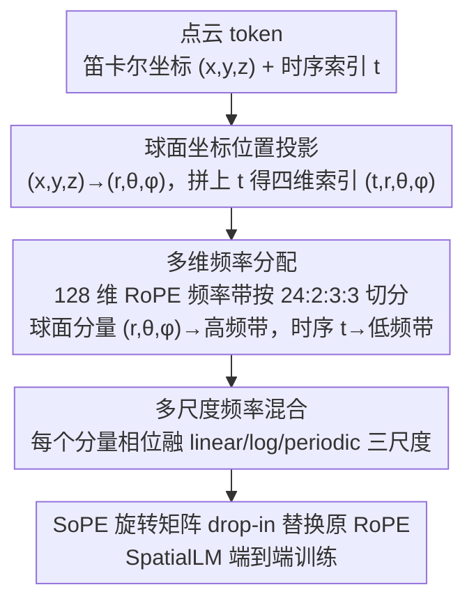

# SoPE: Spherical Coordinate-Based Positional Embedding for 3D LVLMs

**会议**: CVPR 2026  
**arXiv**: [2602.22716](https://arxiv.org/abs/2602.22716)  
**代码**: 无  
**领域**: 3D视觉 / 多模态VLM / 位置编码  
**关键词**: 3D LVLM, 位置编码, 球面坐标, RoPE, SpatialLM, 空间推理

## 一句话总结

揭示 RoPE 在 3D LVLM 中的空间感知偏差问题（1D 索引破坏 3D 局部性且忽视方向），提出球面坐标位置编码 SoPE（$(t,r,\theta,\phi)$ 四维索引 + 多维频率分配 + 多尺度混合），在 SpatialLM 上实现 3D 布局估计和物体检测 SOTA。

## 研究背景与动机

**领域现状**：3D LVLM 将点云编码后与 LLM 联合处理实现 3D 场景理解。主流方法继承 LLM 的 RoPE 位置编码，将点云 token 按光栅扫描展平为 1D 序列。

**现有痛点**：信息流可视化揭示严重的空间感知偏差——跨模态注意力集中在少数热点，大量 3D token 获得近似相同权重，小物体和结构边界被系统性抑制。两个根本原因：(i) 1D 光栅索引破坏点云的 3D 空间连续性，空间相邻 token 获得不相邻位置索引；(ii) 相对距离 $\Delta t = t_1 - t_2$ 仅捕捉序列时序，无法感知空间位置和方向变化。

**核心矛盾**：RoPE 为 1D 文本设计，强行用于 3D 点云忽略了空间结构和方向信息的本质差异。现有 2D/视频改进（VideoRoPE、M-RoPE）面向图像网格，不适用于非规则点云。

**切入角度**：球面坐标 $(r, \theta, \phi)$ 天然分离距离和方向，将 3D token 映射到球面空间后可同时编码位置和角度。

**核心 idea**：用球面坐标 $(t,r,\theta,\phi)$ 替换 1D 光栅索引，将 RoPE 频率带按功能分配给不同坐标分量。

## 方法详解

### 整体框架

SoPE 想解决的是 3D LVLM 里一个被忽视的错配：点云本是三维的，却被光栅扫描压成一维序列喂给继承自文本 LLM 的 RoPE，结果空间相邻的 token 拿到的位置索引天差地别，方向信息更是彻底丢失。它的做法是不碰主干、只换位置编码——在 SpatialLM 基线上，把每个点云 token 的笛卡尔坐标 $(x,y,z)$ 先换算成球面坐标 $(r,\theta,\phi)$，连同原有的时序索引 $t$ 一起构成四维位置；再把 128 维 RoPE 频率带按 $t:r:\theta:\phi=24:2:3:3$ 切给四个分量，每个分量内部又叠一层多尺度相位混合；最后整体替换掉原始 RoPE，端到端训练。三步加起来就是一次纯粹的位置编码改造，推理路径长度不变。

### 关键设计

**1. 球面坐标位置投影：让位置索引重新带上 3D 几何**

1D 光栅索引的根本问题是它只知道 token 在序列里的先后，不知道它们在空间里的远近和朝向——相对距离 $\Delta t = t_1 - t_2$ 捕捉的是时序而非几何。SoPE 把每个 token 的 $(x,y,z)$ 换成球面坐标，$r=\sqrt{x^2+y^2+z^2}$、$\theta=\arccos(z/r)$、$\phi=\text{atan2}(y,x)$，于是相对位置从单一的 $\Delta t$ 扩展成 $(\Delta t,\Delta r,\Delta\theta,\Delta\phi)$ 四个分量，径向距离的变化和两个角度方向的变化被分别显式编码出来。选球面而非笛卡尔（即 RoPE-3D）是关键：笛卡尔 $(x,y,z)$ 虽然恢复了位置，但三个轴是耦合的，模型很难从中读出"这两个 token 朝向相近、只是远近不同"这类方向关系；球面分解天然把距离 $r$ 和角度 $(\theta,\phi)$ 正交开，方向信息从此是一等公民。

**2. 多维频率分配：按值域和精度需求把频率带分给四个分量**

四个分量共享同一组 128 维 RoPE 频率带，怎么切直接决定谁被编码得更细。SoPE 的分法是把三个球面分量 $(r,\theta,\phi)$ 放到前端高频子带，把时序 $t$ 放到后端低频子带，旋转矩阵随之分块对角化、各分量独立旋转后加性组合。背后的取舍很直接：$t$ 的取值范围远大于角度，需要更多低频带才能在长序列上保持平滑连贯；而角度变化往往细小却关键，必须用高频带才区分得开。具体的 $24:2:3:3$ 不是拍脑袋定的，而是在 Uniform、Angular-Biased、Temporal-Biased 等多种配比上跑大规模消融选出来的最优解——均分（$1:1:1:1$）直接掉 3 分，说明这个分配本身就是性能来源之一。

**3. 多尺度频率混合：单一频率尺度看不全从细节到布局的全谱**

即便分好了频率带，单一尺度的相位函数仍难以同时刻画近处的细粒度几何和远处的大尺度布局。SoPE 在每个分量的 RoPE 相位层面再融三种变换：

$$\varphi_k(u) = \frac{1}{3}\left(\omega_k^{lin}g^{lin}(u) + \omega_k^{log}g^{log}(u) + \omega_k^{per}g^{per}(u)\right)$$

其中线性项保留绝对位置精度、对数项强调局部邻域、周期项捕捉全局结构，三者等权相加、不引入任何可学习参数。这样一来同一个位置在不同空间尺度上都有区分力。值得注意的是多尺度混合和球面坐标是相互成全的——消融里它给 SoPE 带来 +1.8 的提升，给笛卡尔的 RoPE-3D 却几乎没用，说明只有先把方向编码到位，多尺度才有发挥空间。

### 损失函数 / 训练策略

完全继承 SpatialLM 的训练设置：点云编码器 Sonata + LLM Qwen2.5-0.5B + 2 层 MLP 投影，4 × NVIDIA H20 GPU 单阶段训练。SoPE 是 drop-in 替换 RoPE，不新增参数、不改变推理开销。

## 实验关键数据

### 主实验

| 方法 | ARKitScenes F1@0.25 | F1@0.50 | SpatialLM Dataset F1@0.25 | F1@0.50 |
|---|---|---|---|---|
| SpatialLM (RoPE) | 63.9 | 60.7 | 69.7 | 62.0 |
| + CCA | 64.1 | 60.5 | 69.8 | 62.5 |
| + RoPE-3D | 64.2 | 61.4 | 69.7 | 62.4 |
| **SpatialSoPE** | **66.1** | **63.2** | **71.4** | **63.4** |

| 方法 | Structured3D IoU2D@0.25 | IoU2D@0.50 |
|---|---|---|
| RoomFormer | 70.4 | 67.2 |
| SceneScript | 83.1 | 80.8 |
| SpatialLM (ft.) | 86.5 | 84.6 |
| **SpatialSoPE (ft.)** | **88.7** | **86.2** |

### 消融实验

| 配置 | ARKit F1@0.25 | F1@0.50 | 说明 |
|---|---|---|---|
| 比例 24:2:3:3（最优） | 66.1 | 63.2 | 本文设计 |
| 比例 8:6:9:9 (Angular-Biased) | 65.5 | 62.7 | 球面分配过多 |
| 比例 1:1:1:1 (Uniform) | 63.0 | 59.0 | 掉 3 分 |
| 比例 5:1:1:1 (Temporal-Biased) | 65.0 | 62.7 | 时序主导 |
| SoPE 无多尺度混合 | 65.4 | 61.4 | 多尺度贡献 +1.8 |
| RoPE-3D + 多尺度 | 64.8 | 62.1 | 球面 > 笛卡尔 |

### 关键发现

- 多尺度混合对 SoPE 提升大（+0.7/+1.8），对 RoPE-3D 提升小——球面坐标是多尺度充分受益的前提
- 球面 > 笛卡尔 > 2D 投影，方向/角度编码是关键差异来源
- 信息流可视化确认 SoPE 产生更均衡的跨模态注意力，消除 RoPE 的热点聚集现象

## 亮点与洞察

- 球面坐标自然分离距离和角度——几何上比笛卡尔更适合 3D 位置编码，思路直接有效但此前无人尝试
- 简单改动（坐标变换 + 频率重分配）带来显著提升（ARKitScenes +2.2/+2.5），证明位置编码确实是 3D LVLM 的关键瓶颈
- 信息流可视化作为诊断工具值得推广——先看哪些 token 没被注意到，再针对性改进编码

## 局限与展望

- 仅在 0.5B 小模型上验证，大模型（7B+）效果待确认
- 球面原点选择（场景几何中心 vs 相机位置）未深入探讨，可能影响编码质量
- 频率分配比例手动确定，自适应/可学习方案可能更优
- 仅室内 3D 场景，室外/自动驾驶等大场景未测试

## 相关工作与启发

- **vs RoPE-3D**: 笛卡尔坐标改善位置感知但缺方向信息，SoPE 球面分解同时编码两者
- **vs VideoRoPE/M-RoPE**: 针对 2D 图像/视频的时空分解，不适用于 3D 点云的非规则结构
- **vs DRoPE**: 极坐标方向性扩展面向航向周期性等特定任务，SoPE 球面方案更通用

## 评分

- 新颖性: ⭐⭐⭐⭐ 球面坐标 PE 在 3D LVLM 中首创
- 实验充分度: ⭐⭐⭐⭐ 多基准完整消融 + 真机部署延迟测试
- 写作质量: ⭐⭐⭐⭐ 动机分析透彻，信息流可视化出色
- 实用价值: ⭐⭐⭐⭐ drop-in 替换 RoPE，跨领域参考价值高

<!-- RELATED:START -->

## 相关论文

- [\[ICML 2026\] Circle-RoPE: Cone-like Decoupled Rotary Positional Embedding for Vision-Language Models](../../ICML2026/multimodal_vlm/circle-rope_cone-like_decoupled_rotary_positional_embedding_for_large_vision-lan.md)
- [\[ICLR 2026\] PPE: Positional Preservation Embedding for Token Compression in Multimodal Large Language Models](../../ICLR2026/multimodal_vlm/ppe_positional_preservation_embedding_for_token_compression_in_multimodal_large_.md)
- [\[CVPR 2026\] MODIX: Training-Free Multimodal Information-Driven Positional Index Scaling for VLMs](modix_positional_index_scaling.md)
- [\[CVPR 2026\] Beyond 3D VQAs: Injecting 3D Spatial Priors into Vision-Language Models for Enhanced Geometric Reasoning](beyond_3d_vqas_injecting_3d_spatial_priors_into_vision-language_models_for_enhan.md)
- [\[CVPR 2026\] Bias Is a Subspace, Not a Coordinate: A Geometric Rethinking of Post-hoc Debiasing in Vision-Language Models](bias_is_a_subspace_not_a_coordinate_a_geometric_rethinking_of_post-hoc_debiasing.md)

<!-- RELATED:END -->
