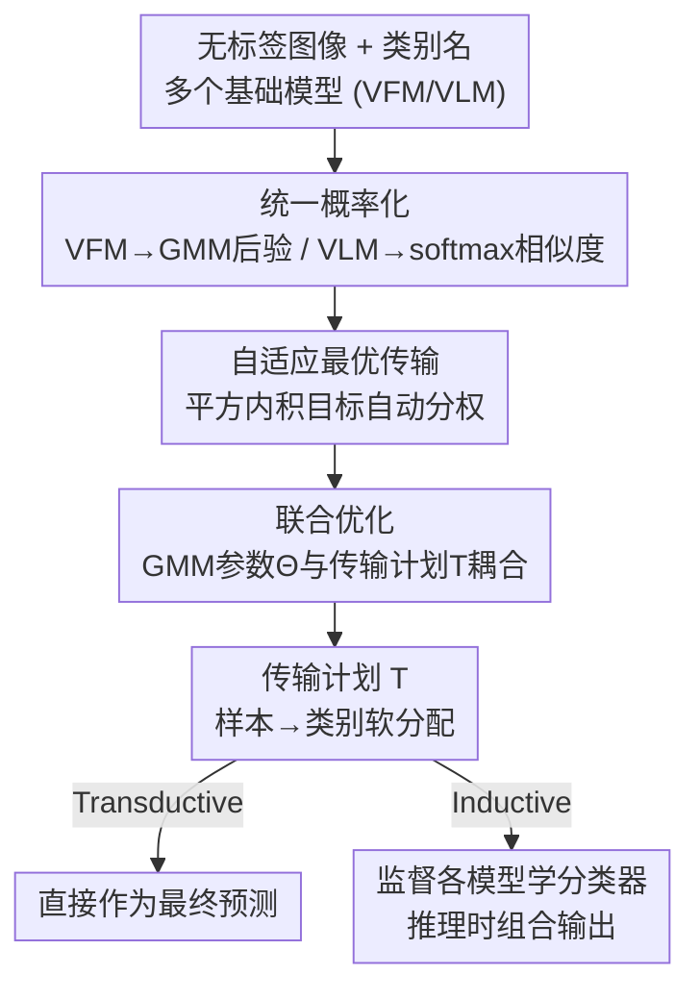

# SOTA: Self-adaptive Optimal Transport for Zero-Shot Classification with Multiple Foundation Models

**会议**: CVPR 2026  
**论文**: [CVF Open Access](https://openaccess.thecvf.com/content/CVPR2026/html/Hu_SOTA_Self-adaptive_Optimal_Transport_for_Zero-Shot_Classification_with_Multiple_Foundation_CVPR_2026_paper.html)  
**代码**: https://github.com/Afleve/selfadaptive-Optimal-Transport  
**领域**: 多模态VLM  
**关键词**: 零样本分类, 最优传输, 基础模型集成, 自适应加权, CLIP

## 一句话总结
SOTA 把每个基础模型（CLIP 这类 VLM、DINO 这类 VFM）的分类输出都转成一张代价矩阵，再用一个"平方内积"目标的自适应最优传输求一个软分配 transport plan，免训练、免先验地自动平衡各模型贡献，在自然/遥感/医学三大域 26 个 benchmark 上比最强单模型大幅涨点。

## 研究背景与动机

**领域现状**：CLIP、DINO 这些基础模型靠大规模预训练学到通用表征，可以直接做零样本分类。改进零样本能力的主流路线有 prompt engineering、label propagation、distribution alignment，但它们几乎都只盯着**单个模型**做文章。

**现有痛点**：作者观察到两件事。其一，VLM（如 CLIP）有强跨模态对齐能力，但视觉编码器过度依赖类别级文本先验，抓不住细粒度视觉线索——在 StanfordCars、Flower102、Pets 这种视觉相似类别上，纯视觉模型 DINOv2/v3 的聚类精度反而明显高于 CLIP；而 VFM（如 DINO）视觉特征判别力强，却天生缺少和类别标签的语义对齐。其二，不同 VLM 因预训练差异，在不同数据集上性能波动很大（自然图像上 CLIP 好，医学/遥感上专域 CLIP 才好）。

**核心矛盾**：VLM 的"语义对齐"和 VFM 的"视觉判别力"是互补的两块短板，单靠任何一个模型都不完整；而要把多个模型加权融合，又面临一个死结——零样本场景下没有标签，无法用验证集去估计"哪个模型更靠谱、该给多大权重"。

**本文目标**：在不微调、不引入任何先验权重、不接触模型内部权重（黑盒 API 也能用）的前提下，把多个异构基础模型的输出融合成一个更可靠的预测。

**切入角度**：把"每个基础模型"看成"衡量样本-类别相关性的一个视角"，每个视角给一张代价矩阵；融合多视角的问题，正好可以写成一个最优传输（OT）问题——求一个从样本到类别的软分配（transport plan）使总传输代价最小。

**核心 idea**：用一个**平方内积**形式的自适应 OT 目标，让 transport plan 与各模型分布的"吻合度"本身充当权重，从而免标签、免先验地自动给质量高的模型更大话语权。

## 方法详解

### 整体框架
SOTA（Self-adaptive Optimal TrAnsport）是一个免训练的集成框架。输入是一批无标签图像 $D_u=\{x_i\}_{i=1}^N$、一组类别名，以及若干个现成基础模型（任意组合 VFM 与 VLM）；输出是每张图的类别预测。整条流水线分三段：先把**每个**基础模型的输出统一转成一张概率矩阵 $P\in\mathbb{R}^{N\times K}$（再转成代价矩阵 $C=E-P$）；接着用自适应 OT 把所有代价矩阵联合求解出一个 transport plan $T$（样本到类别的软分配）；最后按部署场景分流——transductive 直接拿 $T$ 当预测，inductive 则用 $T$ 监督各模型学一个分类器、推理时组合。

### 关键设计

**1. 统一概率化：把异构模型输出对齐成同一张代价矩阵**

不同模型输出形态不一样，没法直接融合，所以第一步是把每个模型都变成一张 $N\times K$ 的类别概率矩阵 $P$（每行和为 1，每列表示样本对该类的相似度），再统一转成代价矩阵 $C=E-P$（$E$ 是全 1 矩阵）——高置信预测对应低传输代价，反之亦然。两类模型走不同通道：VLM 有文本编码器，直接算图像特征 $v_i$ 与类名文本嵌入 $t_j$ 的余弦相似度再过 softmax，$\hat P_{ij}=\frac{\exp(\tau\cos(v_i,t_j))}{\sum_k\exp(\tau\cos(v_i,t_k))}$；VFM 没有语义对齐，先提视觉特征，再在特征上拟合一个高斯混合模型（GMM）$\Theta=\{\pi_k,\mu_k,\Sigma_k\}$，用后验 $p(y=k\mid v_i)=\frac{\pi_k\mathcal{N}(v_i\mid\mu_k,\Sigma_k)}{\sum_j\pi_j\mathcal{N}(v_i\mid\mu_j,\Sigma_j)}$ 当作类别分布。这一步的巧妙在于把"VFM 无标签"这个障碍，转化成"用 GMM 在视觉空间无监督聚类、再把簇当类别"——而且 GMM 一旦学好就天然是个分类器，可迁移到测试数据上。最终得到 $V_1$ 个 VFM 分布 $\{P_v\}$ 和 $V_2$ 个 VLM 分布 $\{\hat P_v\}$。

**2. 自适应最优传输：用平方内积让"吻合度"当权重**

最直白的融合是给各代价矩阵手工配权重 $\lambda_v,\mu_v$ 解一个加权 OT：$\max_{T}\sum_v\lambda_v\langle T,P_v\rangle+\sum_v\mu_v\langle T,\hat P_v\rangle+\epsilon H(T)$（这里已用 $T\mathbf{1}=p$ 把 $\langle T,C\rangle$ 等价改写成 $\langle T,P\rangle$，$H(T)=-\sum T_{ij}\log T_{ij}$ 是熵正则，便于 Sinkhorn 高效求解）。但零样本下没标签，没法定这些权重。SOTA 的关键一招是**把线性内积换成平方内积**：

$$\max_{T\in\Pi(p,q)}\ \sum_{v=1}^{V_1}\langle T,P_v\rangle^2+\sum_{v=1}^{V_2}\langle T,\hat P_v\rangle^2+\epsilon H(T)$$

这一改就不再有任何人工权重了。直觉上，对 $\langle T,P_v\rangle^2$ 关于 $T$ 求梯度得到 $2\langle T,P_v\rangle\cdot P_v$，等价于给第 $v$ 个分布配了一个**正比于当前 $\langle T,P_v\rangle$（即该模型与当前传输计划的吻合度/传输距离）的权重**。于是与当前共识 $T$ 越一致的模型，权重自动越大；噪声大、与大势相左的弱模型权重被自动压低。整个过程免标签、免先验，自动适配数据集特性，对不可靠分布更鲁棒。

**3. 联合优化：让语义引导视觉聚类，GMM 与传输计划耦合迭代**

设计 2 还有个隐患：VFM 的 GMM 分布 $\{P_v\}$ 是脱离 VLM 语义信息**独立**拟合的，纯视觉聚类容易和真实类别对不齐。SOTA 进一步把 GMM 参数 $\Theta$ 和传输计划 $T$ 放进同一个目标里联合学：

$$\max_{T\in\Pi(p,q),\,\Theta}\ \sum_{v=1}^{V_1}\langle T,P_v(\Theta)\rangle^2+\sum_{v=1}^{V_2}\langle T,\hat P_v\rangle^2+\epsilon H(T)$$

此时 $T$ 同时被 GMM 的视觉分配和 VLM 的语义分布塑形，反过来又去更新 $\Theta$，形成相互引导：VLM 的语义把 GMM 的簇往"语义一致"的方向拉，使学出来的簇既视觉连贯又语义对齐，融合更稳。求解上，若没有平方项，可直接交替优化（Sinkhorn 更新 $T$ + 用当前分配更新 $\Theta$）；但平方项 $\langle T,\cdot\rangle^2$ 把 $T$ 非线性耦合了，所以改用迭代的 Minorization-Maximization（MM）方案逐步逼近（细节在附录）。

**4. transductive / inductive 双模式部署**

同一个 $T$ 支撑两种场景。transductive 下，$D_u$ 本身就是整个测试集，直接拿 $T$ 当最终预测（软分配取 argmax）。inductive 下，$D_u$ 当训练数据，$T$ 作为监督信号指导各模型学独立分类器——VFM 侧学好的 GMM 参数 $\Theta$ 直接induce一个视觉分类器，与文本分类器协作，推理时对未见测试样本逐样本预测。相比 DMN、COSMIC 这类需要在测试时维护缓存序列的 TTA 方法，SOTA 推理时只需几个 GMM 参数和自适应系数，存储开销极小。

## 实验关键数据

在自然图像、遥感、医学病理三类共 26 个 benchmark 上验证，免微调、免额外监督。

### 主实验（Transductive，自然图像 11 数据集，平均 Top-1）

| 方法 | Average | 相对 CLIP-1 |
|------|---------|------------|
| CLIP-1 (ViT-B/16) | 65.2 | — |
| TransCLIP-2 [37] | 70.3 | +5.1 |
| GTA-CLIP [24]（前最强） | 74.5 | +9.3 |
| SOTA (CLIP-1+CLIP-2) | 72.5 | +7.3 |
| SOTA (CLIP-1+DINOv2) | 75.7 | +10.5 |
| SOTA (CLIP-1+DINOv3) | 77.4 | +12.2 |
| **SOTA (CLIP-1+DINO v2+v3)** | **77.8** | **+12.6** |

接入更强视觉编码器 DINOv3 时，SOTA 平均比最强竞品再高约 6.9%，印证它能充分榨取高质量视觉特征。

### 跨域结果（Transductive，平均 Top-1）

| 域 | 数据集数 | 最强单模型 | 最强 T-基线 | SOTA |
|----|---------|-----------|------------|------|
| 遥感 | 10 | GeoRSCLIP 64.5 | T-GeoRSCLIP 76.2 | **81.5 (+17.0)** |
| 医学病理 | 5 | MUSK 66.3 | T-MUSK 76.0 | **83.9 (+14.1)** |

遥感上比最强单模型 +17.0，医学上 +14.1，说明免训练融合在专域同样有效。

### 消融实验（Fig. 4，三域平均增量）

| 配置 | 说明 | 三域增益（自然/遥感/医学） |
|------|------|------------------|
| Base | 最强单基模型 | — |
| Only-$\hat P_v$ | 只融多个 VLM、不用 VFM | 小幅（+0.2/+0.3/+0.8） |
| Non Self-adaptive | $\lambda,\mu$ 固定不自适应 | 中等 |
| Disjoint-learning | GMM 与 OT 解耦学习 | 中等（+1.4/+6.7/+4.9） |
| **SOTA** | 完整模型 | **最高（VFM 引入贡献 +11.1/+8.6/+12.9）** |

### 关键发现
- **引入 VFM 是涨点主力**：只融多个 VLM（Only-$\hat P_v$）增益很小，一旦加入视觉基础模型的判别性特征去纠正 VLM 预测，三域分别再涨 +11.1/+8.6/+12.9——视觉相关性比纯语义更可靠。
- **自适应权重在模型能力差距大时尤其关键**：作者特意用能力悬殊的 CLIP 与 MUSK 组合（Table 5），非自适应版在所有数据集上都落后自适应版；当多个强模型同质时，自适应增益相对温和，因为弱模型本就被自动压制。
- **耦合学习有效**：解耦 GMM 与 OT（Disjoint-learning）明显掉点，说明让语义引导视觉聚类、二者相互塑形是融合更稳的来源。

## 亮点与洞察
- **"平方内积自动配权"是最巧的一招**：不引任何超参、不需验证集，靠目标函数的几何性质让"与共识吻合度高的模型自动获得更大权重"，把"无标签下没法估权重"这个死结直接绕开——这个 trick 可迁移到任何需要无监督融合多源软标签的场景（多教师蒸馏、多专家集成）。
- **把基础模型当"视角"而非"特征"**：每个模型只贡献一张 $N\times K$ 代价矩阵，不碰内部权重，因此黑盒 API 模型也能纳入融合，工程上门槛极低。
- **VFM 用 GMM 当无监督分类器**：把"DINO 没有类别头"的劣势，用特征空间 GMM 聚类巧妙补上，且 GMM 学好后天然支持 inductive 泛化。

## 局限与展望
- 自适应机制在模型能力同质或差距很小时增益有限（作者自己承认），主要靠模型间真实多样性吃饭。
- GMM 拟合质量依赖 VFM 特征的可聚类性，在类别极多或长尾分布下 GMM 估计可能不稳——⚠️ 论文未充分讨论大 $K$ 场景。
- 平方内积带来的非凸耦合用 MM 求解，收敛性与对初始化的敏感度细节在附录，正文未展开，实际部署需关注迭代稳定性。
- 改进方向：可探索把更多模态（深度、文本描述）作为额外"视角"接入同一 OT 框架；或为 GMM 引入更强的类别先验缓解大 $K$ 失稳。

## 相关工作与启发
- **vs TransCLIP [37]**: TransCLIP 也走 transductive、用 OT 思路，但聚焦提升**单个 CLIP**的表现；SOTA 把它推广成**多异构模型**的自适应集成框架，且对 VFM/VLM 都适用，性能在三域全面领先。
- **vs GTA-CLIP / ADAPT 等 transductive 方法**: 这些方法靠利用视觉特征分布做标签校正，但仍是单模型内部优化；SOTA 的增益主要来自跨模型互补（尤其 VFM 补 VLM 的视觉短板），思路正交且可叠加。
- **vs DMN / COSMIC（TTA）**: 它们测试时要维护缓存序列、存储开销大；SOTA inductive 模式只存几个 GMM 参数和自适应系数，逐样本推理，更轻量。

## 评分
- 新颖性: ⭐⭐⭐⭐⭐ 首次系统研究多基础模型在零样本分类上的互补性，平方内积自适应 OT 是干净利落的新机制
- 实验充分度: ⭐⭐⭐⭐⭐ 跨自然/遥感/医学 26 个 benchmark，transductive+inductive 双设置，消融拆解到每个组件
- 写作质量: ⭐⭐⭐⭐ 动机清晰、公式完整，但优化（MM）与部分推导推到附录，正文略简
- 价值: ⭐⭐⭐⭐⭐ 免训练、免先验、支持黑盒模型，落地门槛低且增益显著，实用性强

<!-- RELATED:START -->

## 相关论文

- [\[CVPR 2026\] Vision-Language Model Guided Source-Free Domain Adaptation via Optimal Transport](vision-language_model_guided_source-free_domain_adaptation_via_optimal_transport.md)
- [\[CVPR 2026\] Self-guided Semantic Inspection for Zero-Shot Composed Image Retrieval](self-guided_semantic_inspection_for_zero-shot_composed_image_retrieval.md)
- [\[CVPR 2026\] FlowComposer: Composable Flows for Compositional Zero-Shot Learning](flowcomposer_composable_flows_for_compositional_zeroshot_learning.md)
- [\[CVPR 2026\] Bridging the Modality Gap in Compositional Zero-Shot Learning via Sparse Alignment and Unimodal Memory Bank](bridging_the_modality_gap_in_compositional_zero-shot_learning_via_sparse_alignme.md)
- [\[CVPR 2026\] Beyond Heuristic Prompting: A Concept-Guided Bayesian Framework for Zero-Shot Image Recognition](beyond_heuristic_prompting_a_concept-guided_bayesian_framework_for_zero-shot_ima.md)

<!-- RELATED:END -->
