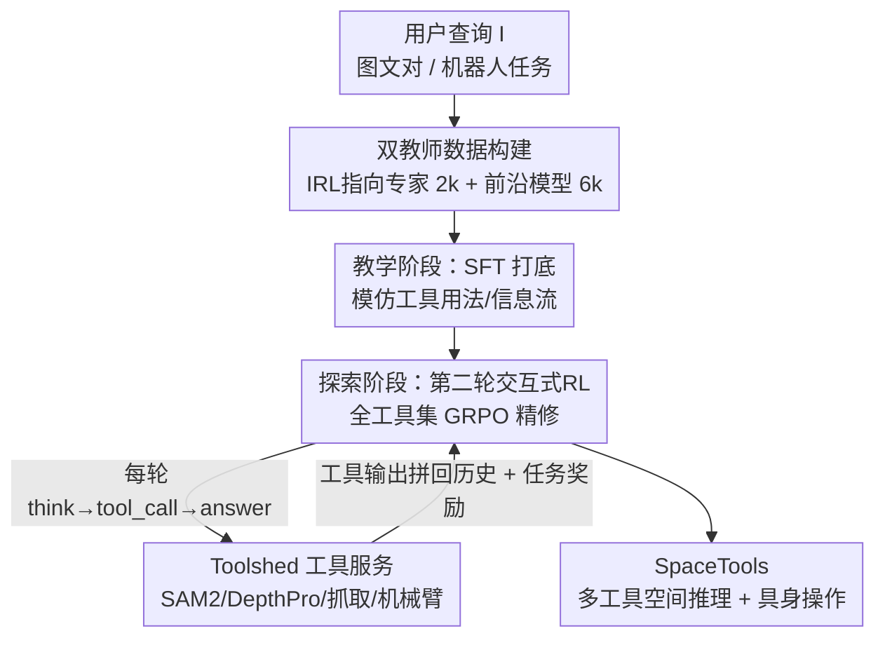

# SpaceTools: Tool-Augmented Spatial Reasoning via Double Interactive RL

**会议**: CVPR 2026  
**arXiv**: [2512.04069](https://arxiv.org/abs/2512.04069)  
**代码**: 有（Project Page / Code，论文标注开源 Toolshed）  
**领域**: 多模态VLM / Agent / 空间推理 / 工具增强 / 强化学习  
**关键词**: 工具增强推理、空间推理、双交互式RL、GRPO、具身操作

## 一句话总结
本文提出 **DIRL（双交互式强化学习）**——先用"单工具专家 IRL 教师 + 前沿模型全工具教师"混合数据做 SFT 打底，再用全工具集做第二轮交互式 RL 精修——把一个 3B 的 Qwen2.5-VL 训练成会自主调度十余种视觉/机器人工具的空间推理智能体 SpaceTools，在 RoboSpatial、BLINK、BOP-ASK 等基准上全面 SOTA，并能把真实 7-DOF 机械臂当作工具完成抓取放置（86% 成功率）。

## 研究背景与动机
**领域现状**：VLM 在开放式视觉问答上很强，但要支撑机器人等具身应用，需要"度量级精确"的空间推理——判断相对位置、距离、遮挡、朝向、姿态、可抓取性。主流做法是在任务特定数据集上微调（SpatialVLM、RoboRefer 等），每加一种低层感知能力（深度、指向、3D 感知）都要大规模标注 + 改架构。

**现有痛点**：微调路线靠堆数据和改模型，扩展性差。一个更优雅的替代是让 VLM **调用现成的视觉/机器人工具**（深度估计、分割、位姿估计、抓取生成），用工具的精确输出辅助推理。但已有工具增强方法要么靠手工 prompt，要么写死固定工具流水线（SpatialPIN、APC），都是 training-free，限制了模型自己发现最优工具用法的能力。

**核心矛盾**：RL 本可以让模型自主学会用工具，但 ViGoRL 之类的工作只能在**单个**轻量工具（如裁剪）上做交互式 RL。一旦把 RL 直接铺到 10+ 个异构工具上，动作空间组合爆炸，朴素探索根本找不到有效策略——这是多工具 RL 的根本障碍。此外还有系统层挑战：训练时如何高吞吐地在线提供 SAM2、Depth Pro 这类重算力工具。

**本文目标**：(1) 设计一个能在多工具场景下稳定收敛的训练范式；(2) 搭建能在训练循环里实时服务重型视觉工具的基础设施。

**切入角度**：作者的关键洞察是——**用单一指向工具做 RL 是可解的、且能教会 grounding；多工具 RL 能精修多样化推理但需要好的初始化**。于是把难题拆成"先教基本工具用法、再放开探索"两个递进且各自可解的阶段。

**核心 idea**：把交互式 RL 用**两次**（DIRL）——第一次（藏在教师里）训出单工具专家供蒸馏，第二次直接对全工具集做交互式 RL 精修；中间用 SFT 把两路教师的轨迹灌给基座模型做初始化，从而绕开多工具 RL 的探索坍塌。

## 方法详解

### 整体框架
SpaceTools 把空间推理建模为**序列决策**：VLM 策略 $\pi_\theta$ 接收用户查询 $\mathcal{I}$（图文对或机器人任务），按 `<think>`（推理）/ `<tool_call>`（调工具）/ `<answer>`（最终答案）的结构化对话格式多轮交互，每轮把工具输出拼回历史 $h_t$，直到产出答案或达到最大轮数 $T_{\max}$（Algorithm 1）。

训练范式 DIRL 分两阶段串行。**教学阶段**：构造一个 8k 轨迹的教学数据集，来源是两路互补教师——单工具指向专家（自身由 IRL 训出）贡献 2k 条 grounded 推理示范，前沿模型（Claude Sonnet 4.5）接全工具贡献 6k 条正确轨迹——然后对基座 Qwen2.5-VL-3B 做 SFT，得到带初步工具使用行为的策略。**探索阶段**：从 SFT 初始化的策略出发，放开全部工具继续做交互式 RL（IRL），用 GRPO + KL 正则在与真实工具的交互反馈中精修工具链调度。整套交互依赖 **Toolshed** 这套分布式工具服务基础设施：把每个重型工具隔离成按需服务，与 RL/推理主循环解耦异步扩展，保证训练时的高工具吞吐。

### 关键设计

**1. DIRL 两阶段交互式 RL：把多工具探索坍塌拆成两个可解子问题**

直接对 10+ 工具做 RL，动作空间组合爆炸、优化信号微弱；而纯 SFT 在工具轨迹上又学不会灵活协调、走不出训练轨迹之外。DIRL 的解法是把"用两次交互式 RL"。第一次 IRL **不直接训目标模型**，而是去训一个只用指向工具（RoboRefer）的单工具专家——因为搜索空间受限，IRL 能可靠收敛、产出有竞争力的 grounded 推理行为。把这个专家轨迹和前沿模型的全工具轨迹一起 SFT 给基座，得到一个"已经会基本工具用法"的初始化策略。第二次 IRL（探索阶段）才在这个强初始化上放开全工具集做 RL：好的初始化避免了大动作空间里的探索坍塌，交互反馈则进一步打磨工具链。名字里的"Double"正来自这两轮 IRL——一轮用于教学、一轮用于探索。消融显示去掉第二阶段 IRL 后 mean 从 52.48 掉到 50.99，去掉 IRL 教师则暴跌到 41.68。

**2. 双教师互补数据构建：grounding 精度 + 多工具组合，按 1:3 配比**

教学数据集的两路来源各补一块短板。**IRL 指向专家**（2k 条）专攻精细空间 grounding——它用单一指向工具，能把"先指向再查别的工具"这一空间推理常见首步教扎实；消融里去掉它后 RefSpatial、RoboSpatial 这类需要细粒度定位的任务掉得最狠（RefSpatial 53.07→29.60）。**通用教师**（前沿模型 Claude Sonnet 4.5，6k 条）接 Toolshed 全工具，负责示范"分割+深度+3D bbox"这类多工具组合，只保留导向正确答案的轨迹；去掉它后位姿任务从 34.37 崩到 8.92（因为位姿最依赖多工具组合）。两者按 IRL 教师 1 份、通用教师 3 份混合，既保 grounding 精度又保多工具协同。

**3. Toolshed 工具服务基础设施：让重型视觉工具能在 RL 训练循环里实时在线**

DIRL 要求训练时能真实、在线、按需地调工具，这正是以往工作的系统瓶颈：要么把工具和训练循环紧耦合（只能用裁剪这种轻工具），要么像搜索那样靠 web API（图像吞吐不够），要么干脆用预计算输出（模型学不到交互式、依赖状态的工具用法）。Toolshed 通过三点解决：(1) 每个工具实例做资源与环境隔离；(2) 工具的扩缩容和执行与策略主推理循环解耦；(3) 每工具配异步并行 worker，让工具资源独立于训练资源扩展。它托管模块化视觉工具（分割 SAM2、指向 Molmo/RoboRefer、单目深度 Depth Pro、长方体拟合、抓取生成 GraspGen、裁剪、数组索引、透视投影）和机器人工具（取图、取深度、抓取、放置）。把**真实且随机**的工具输出喂进学习循环，迫使模型推理工具可靠性、学会更好的查询方式和失败回退。

**4. 任务特定的归一化奖励：把异构空间任务统一成 [0,1] 的可验证信号**

RL 覆盖选择题、2D 框、指向、位姿、抓取等异构任务，需要把每类都归一化成可比奖励。选择题用二元奖励 $R_B\in\{0,1\}$；2D 框用与最近真值框的平均 IoU $R_{\text{MIoU}}=\frac{1}{N}\sum_i \max_j \mathrm{IoU}(\hat{B}_i,B_j)$；指向用"归一化负质心距离" $R_{\text{NNDC}}=\frac{\exp(-5d)-\exp(-5\sqrt2)}{1-\exp(-5\sqrt2)}$（$d$ 为到目标区质心距离），并与二元项取 max 以强调精度；位姿把预测/真值各投影成 8 个 2D 角点、取凸包 IoU（角点数都为 8 才有效，否则 0）；抓取用"归一化负坐标误差" $R_{\text{NNCE}}=1-\frac{1}{\delta_{\max}}\min(\delta_{\max},\frac{1}{N}\sum_i \frac{\lVert\hat p_i-p_i\rVert_2}{d})$（$d$ 为夹爪宽度、$\delta_{\max}=10$ 截断极端误差）。作者还试过加结构化 format 奖励但无明显增益，最终弃用。

### 损失函数 / 训练策略
基座为 Qwen2.5-VL-3B-Instruct。**第一阶段 SFT** 用交叉熵 next-token 预测损失，在多轮对话的所有 assistant 轮上模仿两路教师的推理与工具用法（LLaMA-Factory 平台）。**第二阶段 IRL** 用 **GRPO**：对每个输入 $\mathcal{I}$ 异步并发 $N$ 个 rollout（各按 Algorithm 1 多轮交互），得到奖励 $r_1,\dots,r_N$ 后用组相对优势优化 $\mathcal{L}_{\text{GRPO}}$，并对参考策略 $\pi_{\text{ref}}$ 做 KL 正则（把 Toolshed 集成进 VERL 框架）。数据来自 RoboSpatial、RefSpatial、BOP-ASK，并用 HOPE 数据集扩展抓取与取放控制任务；两阶段用同一批图文对。

## 实验关键数据

### 主实验
SpaceTools-3B 在多个空间推理基准上全面 SOTA，3B 体量超过一众专有大模型与专用空间 VLM：

| 模型 | RoboSpatial Overall | BLINK Depth | RefSpatial 2D Rel. | CVBench 3D Depth | BOP-ASK Pose | Grasp-SR |
|------|------|------|------|------|------|------|
| Claude Sonnet 4.5 | 57.43 | 78.23 | 07.49 | 78.50 | 01.67 | 48.33 |
| GPT-5 | 58.39 | 66.13 | 23.10 | 91.33 | 09.03 | 41.67 |
| Gemini-ER 1.5 | 62.50 | 69.23 | 41.72 | 90.50 | 00.00 | 23.33 |
| RoboRefer-8B-SFT | 59.43 | 88.71 | 48.37 | 96.50 | 00.00 | 00.00 |
| Qwen2.5-VL-3B Tool-free SFT | 58.00 | 80.65 | 20.22 | 83.33 | 02.44 | 35.00 |
| Qwen2.5-VL-3B Tool-free RL | 54.00 | 80.65 | 23.10 | 70.83 | 12.00 | 36.67 |
| **SpaceTools-3B (本文)** | **70.00** | **90.32** | **53.07** | 96.00 | **34.37** | **50.00** |

- 比 Gemini-ER 1.5 在 RoboSpatial 上 +7.5%，比 Claude 在位姿上 +24.4%，比 GPT-5 在抓取上 +8.3%。
- 同一 8k 数据下，工具增强训练全面碾压无工具微调：相对 Tool-free SFT/RL 在 RoboSpatial 上分别 **+12%/+16%**。

真实机器人操作（把机械臂当作动作工具，闭环感知-动作）：

| 模型 | Pick | Rel. Pick | Pick & Place | TTFM |
|------|------|------|------|------|
| π0.5 (VLA) | 0 (0/7) | 0 (0/6) | 0 (0/14) | 1s |
| GPT-5 + Toolshed | 71 (5/7) | 33 (2/6) | 65 (9/14) | 36s |
| Claude Sonnet 4.5 + Toolshed | 86 (6/7) | 50 (3/6) | 79 (11/14) | 30s |
| **SpaceTools (本文)** | **86 (6/7)** | **83 (5/6)** | **86 (12/14)** | **10s** |

SpaceTools 用同样工具就超过装备相同工具的前沿模型，且首次动作耗时（TTFM）仅 10s，远快于 GPT-5(36s)/Claude(30s)——它复用已算好的抓取位姿/相机内参，而 GPT-5 会"凭空发明"这些值导致工具链断裂。

### 消融实验
| 配置 | IRL-T | Univ-T | S2-IRL | RoboSpatial | RefSpatial | Pose | Mean |
|------|:---:|:---:|:---:|------|------|------|------|
| SpaceTools（完整） | ✓ | ✓ | ✓ | 70.00 | 53.07 | 34.37 | **52.48** |
| w/o IRL 教师 | ✗ | ✓ | ✓ | 61.14 | 29.60 | 34.29 | 41.68 |
| w/o 通用教师 | ✓ | ✗ | ✓ | 65.14 | 54.51 | 8.92 | 42.86 |
| w/o 第二阶段 IRL | ✓ | ✓ | ✗ | 67.71 | 51.98 | 33.28 | 50.99 |
| Tool SFT（非交互） | ✗ | ✓ | ✗ | 59.71 | 24.91 | 32.94 | 39.19 |
| Tool NIRL（非交互） | ✗ | ✓ | ✗ | 55.14 | 28.16 | 30.89 | 38.06 |

### 关键发现
- **IRL 教师对细粒度 grounding 最关键**：去掉后 RefSpatial 从 53.07 暴跌到 29.60，RoboSpatial 也明显下滑。
- **通用教师对多工具组合最关键**：去掉后位姿任务（需分割+深度+3D bbox 组合）从 34.37 崩到 8.92。
- **交互式 RL 是教多工具链的核心**：两个非交互基线（Tool SFT / Tool NIRL）分别比 DIRL 低 13.4 / 14.4 mean——说明喂固定/预计算轨迹学不会复杂工具序列。
- **IRL 带来意外的跨域泛化**：只在 RoboSpatial 上训的模型在 RefSpatial 上拿到 34.3%，而其他微调方法在 RefSpatial 上得 0 分。
- **零样本给前沿模型加 Toolshed 也涨**：GPT-5 + Toolshed 在 RefSpatial 23.1→36.1、位姿 9.0→15.0；但 RoboSpatial/BLINK 这类高层任务反而混合涨跌，因为模型会过度调工具、误读工具输出。

## 亮点与洞察
- **"把交互式 RL 用两次"的拆解很巧**：单工具 RL 可解、能教 grounding，多工具 RL 需好初始化——DIRL 正好让第一次 RL 产出的专家给第二次 RL 当初始化，绕开了多工具探索坍塌。这种"用一个可解子问题的产物去初始化一个难子问题"的范式可迁移到任何动作空间爆炸的 agentic RL。
- **真实+随机的工具输出进训练循环**：相比预计算工具输出，让模型在训练时直面工具的真实行为（含失败/噪声），逼出"工具失败时回退自估、切换备用指向工具"这类纠错行为——这是固定流水线方法学不到的。
- **3B 模型当工具调度器即可超大模型**：核心能力不在模型参数量，而在"会不会编排工具"，这把空间推理的瓶颈从"模型容量/数据规模"转移到"工具协调策略"，对小模型具身落地很有启发。
- **机械臂作为工具纳入同一推理循环**：感知工具与动作工具交替调用，语言推理全程主导闭环，而非把机器人动作当作模型外部的独立过程。

## 局限与展望
- **依赖外部工具质量**：整个能力建立在 SAM2/Depth Pro/RoboRefer/GraspGen 等现成工具上，工具本身的误差/适用范围会成为天花板；论文也观察到前沿模型加工具在高层任务上会过度调用、误读输出。
- **系统复杂度高**：Toolshed 这套分布式工具服务 + 两阶段训练 + 双教师数据构建，工程门槛和算力成本都不低，复现需要可观基础设施。
- **教学阶段依赖前沿闭源模型**：6k 轨迹来自 Claude Sonnet 4.5，蒸馏上限受教师能力约束，也带来对闭源 API 的依赖。
- **真实机器人评测规模偏小**：Pick/Rel.Pick/Pick&Place 各只有 7/6/14 个 trial，统计置信度有限，结论需谨慎外推。

## 相关工作与启发
- **vs ViGoRL**：ViGoRL 证明了 RL 能让 VLM 学会用**单个**视觉工具（裁剪）做 grounded 推理；本文把它推广到 10+ 异构工具，靠 DIRL 两阶段范式解决单工具→多工具的探索坍塌，并补上 Toolshed 解决在线工具服务的系统瓶颈。
- **vs SpatialPIN / APC（固定流水线工具增强）**：它们是 training-free、写死工具调用顺序；本文让模型通过 RL **自己学**工具选择、排序与错误恢复，能动态适配任务（指向类任务靠指向工具、相对深度调深度工具、位姿/抓取组合多工具）。
- **vs RoboRefer / SpatialVLM（数据微调路线）**：它们把感知能力"烤进"模型权重，每加一种能力都要大规模标注+改架构；本文主张通过学到的工具协调获取新技能，无需改架构或大规模数据驱动微调。
- **vs Tool NIRL（LLM 经典工具学习）**：NIRL 需要真值工具调用轨迹、奖励基于工具名/参数/答案正确性；本文的交互式 IRL 只需最终答案的任务奖励、在与真实工具交互中学习，mean 高出 14.4。

## 评分
- 新颖性: ⭐⭐⭐⭐⭐ "双交互式 RL"把多工具探索坍塌拆解的思路新颖且通用，Toolshed 补齐系统短板。
- 实验充分度: ⭐⭐⭐⭐⭐ 5 个空间基准 + 真机操作 + 完整训练配方消融 + 给前沿模型加工具的零样本分析，覆盖很全。
- 写作质量: ⭐⭐⭐⭐ 动机递进清晰、奖励定义到位；个别系统/附录细节（MACE、GRPO 目标）需查附录。
- 价值: ⭐⭐⭐⭐⭐ 3B 模型靠工具编排超大模型并落到真实机械臂，对具身空间推理的小模型路线很有示范意义。

<!-- RELATED:START -->

## 相关论文

- [\[CVPR 2026\] Thinking With Videos: Multimodal Tool-Augmented Reinforcement Learning for Long Video Reasoning](thinking_with_videos_multimodal_tool-augmented_reinforcement_learning_for_long_v.md)
- [\[CVPR 2026\] Stable and Efficient Single-Rollout RL for Multimodal Reasoning](stable_and_efficient_single-rollout_rl_for_multimodal_reasoning.md)
- [\[CVPR 2026\] Visual Reasoning through Tool-supervised Reinforcement Learning](visual_reasoning_through_tool-supervised_reinforcement_learning.md)
- [\[CVPR 2026\] Think with 3D: Geometric Imagination Grounded Spatial Reasoning from Limited Views](think_with_3d_geometric_imagination_grounded_spatial_reasoning_from_limited_view.md)
- [\[CVPR 2026\] Hear you are: Teaching LLMs Spatial Reasoning with Vision and Spatial Sound](hear_you_are_teaching_llms_spatial_reasoning_with_vision_and_spatial_sound.md)

<!-- RELATED:END -->
