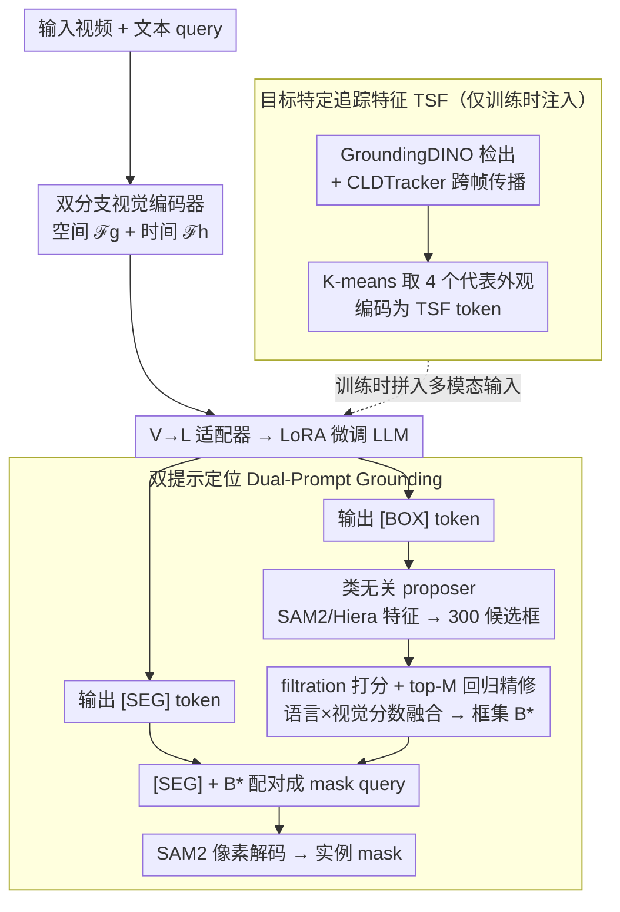

# SPARROW: Learning Spatial Precision and Temporal Referential Consistency in Pixel-Grounded Video MLLMs

**会议**: CVPR 2026  
**arXiv**: [2603.12382](https://arxiv.org/abs/2603.12382)  
**代码**: 无  
**领域**: 多模态VLM  
**关键词**: 视频像素级定位, 参考视频目标分割, 时间一致性, 双提示解码, 多模态大语言模型

## 一句话总结

提出 SPARROW 框架，通过 **目标特定追踪特征（TSF）** 注入时间一致性监督、**双提示（[BOX]+[SEG]）粗到细解码** 稳定首帧初始化，以即插即用方式集成到现有视频 MLLM 上，在 6 个基准 3 个任务上取得一致提升。

## 研究背景与动机

**领域现状**：多模态大语言模型（MLLMs）在图像级视觉推理与像素级定位上已有不少进展，LISA / PixelLM 等方法通过 [SEG] token 实现语言条件化分割。但把它们搬到**视频**上时，运动动态、遮挡和时间一致性带来了额外挑战。

**现有痛点**：现有视频 MLLM（VideoGLaMM、UniPixel、GLUS）主要靠**静态 [SEG] token** 逐帧推理，由此暴露两个问题。其一是**时间漂移与身份切换**——文本提示是静态的、视频却是动态的，模型只能纯靠视觉线索推断运动和外观变化，导致同一目标在不同帧被分割成不一致的两个"人"。其二是**首帧初始化不可靠**——[SEG] token 只给语义线索、不给空间先验，首帧 mask 容易与目标错位，而这个误差会逐帧累积放大。

**核心矛盾**：静态语义 token 编码不了目标随时间变化的位置与外观；而首帧定位一旦出错，后续每帧的分割都会被误差传播拖累。

**要解决什么**：在不修改基础模型架构的前提下，同时拿下 (i) 时间参考一致性（身份保持）和 (ii) 首帧空间精度（减少漂移）两个问题。

**切入角度与核心 idea**：作者从追踪得到的目标特定特征里提炼时间监督信号——训练时注入、推理时去除（即 TSF），让模型把身份持久性内化；再引入 [BOX] 几何先验与 [SEG] 语义先验协同的双提示解码，把首帧定位从"一步到位"改成"粗到细"两步走。

## 方法详解

### 整体框架

SPARROW 要在不动基础视频 MLLM 架构的前提下，同时治好两个老毛病：分割结果跨帧"换人"（身份不一致）与首帧定位飘忽（误差逐帧累积）。它的做法是在原有 pipeline 上挂两组轻量、即插即用的模块——**目标特定追踪特征（TSF）** 负责注入时间一致性、**双提示定位（Dual-Prompt Grounding）** 负责稳住首帧空间精度。一段视频先经双分支视觉编码器——空间分支 ℱg 抓单帧外观、时间分支 ℱh 抓帧间运动——再过 V→L 适配器送进 LoRA 微调的 LLM；LLM 不只回答文本，还吐出两类特殊 token：[BOX] 和 [SEG]，二者经 L→V 适配器投影回视觉空间，[BOX] 驱动类无关 proposer 给出几何框、[SEG] 驱动 SAM2 像素解码，最终以粗到细方式合作出 mask。TSF 模块则只在训练时把跨帧追踪到的目标外观拼进输入、推理时默认撤掉。由于所有新增模块都不改骨干，这套设计能直接套到 UniPixel、GLUS、VideoGLaMM 等不同架构的视频 MLLM 上。

### 关键设计

**1. 目标特定追踪特征（TSF）：用训练期的伪追踪监督把"身份持久性"灌进模型，推理时再悄悄撤掉**

视频 MLLM 沿用了图像时代的静态 [SEG] token，文本提示是死的、视频却在动，模型只能纯靠视觉线索去猜目标的运动和外观变化，结果同一目标在不同帧被分成两个"人"。TSF 反其道而行——训练时直接喂给模型一组"这就是同一个目标"的参考样本。具体地，给定文本 query，先用 GroundingDINO 在某一帧检出目标，再用 CLDTracker 跨帧传播，得到一串候选框 $B'_1 \dots B'_{K'}$；这串框冗余又数量不定，于是在联合视觉-空间特征空间上做 K-means 聚类（$K=4$），取最靠近各质心的样本组成紧凑子集 $B_1 \dots B_K$，让 4 个代表既覆盖目标的不同外观（正面 / 侧面 / 遮挡 / 远景）又不互相重复。这些区域经图像编码器 ℱg 编码、再过 V→L 适配器投影成 $Z_{\text{TSF}}$ token，拼进多模态输入。这一思路呼应 Artemis 的发现：追踪得到的目标特定特征能改善时间一致性。而最关键的一笔是——**推理时默认不挂 TSF**：模型在训练中已把"身份持久性"内化，上线时无需任何外部检测器或追踪器，省掉了部署开销。为支撑这套监督，作者把 HC-STVG、VID-Sentence、A2D Sentences、LaSOT、MeViS、GOT-10k、Ref-SAV 等 7 个公开数据集统一成 30,646 个视频序列、45,231 个 Q&A 对，每条都带时间一致的轨迹、bbox 与分割 mask。

**2. 双提示定位（Dual-Prompt Grounding）：[BOX] 先给几何先验、[SEG] 再做语义精修，用粗到细两步稳住首帧**

只靠 [SEG] 时首帧定位常常糊成一团——[SEG] 只携带语义线索、没有空间先验，第一帧 mask 一旦错位，后面每帧都跟着错。双提示的做法是在 [SEG] 之前先插一个 [BOX] 分支补上几何约束。[BOX] 分支里，LLM 先吐出 $e_{\text{BOX}}$，经 L→V 适配器 $W_b$ 投影；与此同时一个类无关 proposer（Deformable-DETR 结构、只保留单一 objectness head，搭在冻结的 SAM2/Hiera 特征上）生成 $K=300$ 个候选 proposal。$e_{\text{BOX}}$ 与每个 proposal 特征做 cross-attention 融合后，filtration head 给它们打分，对 top-M 候选再做文本条件化的 bbox 回归精修，最后把语言分数与视觉分数融合、过阈值，得到最终框集合 $B^*$。[SEG] 分支则拿筛过的 $\hat{b}$ 与 $e_{\text{SEG}}$ 组成 mask query，送进 SAM2 的 prompt encoder，每个空间先验吐一个实例级 mask；当 $|B^*|>1$ 时天然支持多实例输出。这套设计的好处不止落在首帧——在任意中间帧重新发一次 [BOX]+[SEG]，就能把已经漂移的目标重新拉回，等于内建了漂移校正。

### 一个完整示例

以 query"穿过画面奔跑的那只狗" + 一段视频为例。**训练时（带 TSF）**：GroundingDINO 在中间某帧框出狗，CLDTracker 向前后传播得到十几个候选框，K-means 聚成 4 个代表外观，编码成 4 个 TSF token 拼进输入，模型据此学到"这 4 个外观属于同一只狗"。**推理时（不带 TSF）**：首帧 LLM 直接输出 [BOX]+[SEG]；proposer 在这一帧产出 300 个类无关 proposal，$e_{\text{BOX}}$ 与它们逐一打分，filtration head 留下 top-M 个，经回归精修与语言 / 视觉分数融合、过阈值后只剩 1 个框——正是那只狗，即 $B^*$；[SEG] 把这个框当空间先验送进 SAM2，吐出狗的像素 mask。后续帧若目标因遮挡而漂移，在那一帧重新发 [BOX]+[SEG] 即可重新锁定。

### 损失函数 / 训练策略

**两阶段训练**：

**Stage 1 — TSF 信息注入**：训练 V→L 适配器 (Wg, Wh)、L→V SEG 适配器 Ws、LLM LoRA 参数，骨干和像素解码器冻结。损失：L_total = L_CE + L_BCE + L_DICE。

**Stage 2 — Box Prompt 学习**：
- 先独立预训练类无关 proposer（D-DETR head，在 COCO/Objects365/OpenImages/V3Det 上训练，丢弃类别标签）。损失：L_prop = L_obj + λ1·L_ℓ1 + λ2·L_GIoU
- 再微调 filtration head + L→V BOX 适配器 Wb，其余全部冻结。损失：L_filter = λ_cls·L_BCE + λ_box·(L_ℓ1 + L_GIoU)，其中 λ_cls=1.0, λ_box=2.0

## 实验关键数据

### 主实验

在 3 个视频 MLLM 基线（UniPixel、GLUS、VideoGLaMM）上分别集成 SPARROW，涵盖 RVOS、VG、GCG 三个任务。

**表 1：MeViS 参考视频目标分割（运动表达式）**

| 方法 | val J&F | val^u J&F |
|------|---------|-----------|
| UniPixel | 53.1 | 59.7 |
| + SPARROW | **54.4** (+1.3) | **60.7** (+1.0) |
| GLUS | 51.3 | 59.8 |
| + SPARROW | **53.2** (+1.9) | **61.9** (+0.3) |
| VideoGLaMM | 45.2 | 48.5 |
| + SPARROW | **47.5** (+2.3) | **57.4** (+8.9) |

**表 2：Ref-YTVOS & Ref-DAVIS17 参考视频目标分割**

| 方法 | Ref-YTVOS J&F | Ref-DAVIS17 J&F |
|------|---------------|-----------------|
| UniPixel | 70.5 | 74.2 |
| + SPARROW | **70.7** (+0.2) | **76.4** (+2.2) |
| GLUS | 67.3 | 72.9 |
| + SPARROW | **69.1** (+1.8) | **75.5** (+2.6) |
| VideoGLaMM | 66.8 | 69.5 |
| + SPARROW | **68.9** (+2.1) | **76.8** (+7.3) |

VideoGLaMM 在 Ref-DAVIS17 上 F（边界质量）提升高达 +14.5，所有集成 SPARROW 的模型 F 均超过 80。

**表 3：VideoGCG 视频定位对话生成**

| 方法 | mIoU | Recall | CLAIR |
|------|------|--------|-------|
| UniPixel | 52.0 | 0.311 | 26.0 |
| + SPARROW | **54.5** (+2.5) | **0.325** | **29.4** (+3.4) |
| VideoGLaMM | 62.34 | 0.375 | 28.2 |
| + SPARROW | **65.59** (+3.25) | **0.383** | **33.6** (+5.4) |

### 消融实验

基于 Ref-DAVIS17 (val) + VideoGLaMM 基线。

**TSF 与 BOX 联合消融**（J&F）：

| TSF 模式 | BOX OFF | BOX ON |
|----------|---------|--------|
| 无 TSF | 69.5 (baseline) | 72.5 (+3.0) |
| 仅训练时（默认） | 72.4 (+2.9) | **76.8** (+7.3) |
| 训练+推理 | 75.3 (+5.8) | **77.7** (+8.2) |

**提示组合消融**：[SEG] only 69.5、[BOX] only 68.2、[BOX]+[SEG] **72.5**（+3.0），证实双提示互补性。

### 关键发现

1. TSF **仅在训练时使用**即可带来 +2.9 提升，无需推理时的检测器/追踪器开销
2. [BOX] 提示单独贡献 +3.0，与 TSF 叠加呈**近似可加**效果（+7.3）
3. VideoGLaMM 上收益最大（MeViS val^u +8.9, Ref-DAVIS17 +7.3），说明基线越弱，改进空间越大
4. VidSTG（视觉定位）任务上三个基线均获得约 +5 mIoU 的一致提升

## 亮点与洞察

- **即插即用设计**：SPARROW 不修改基线骨干/LLM，仅通过轻量适配器和 proposal head 集成，成功应用于 3 个不同架构的视频 MLLM，具有很强的通用性
- **训练时追踪、推理时免追踪**：TSF 的核心洞察是利用伪追踪监督在训练阶段注入时间一致性先验，模型内化后推理时无需外部追踪器，大幅降低部署成本
- **粗到细双提示**：[BOX] 提供几何约束、[SEG] 提供语义精修，二者在信息维度上正交互补，类似于检测后分割的两阶段思路但通过 token 优雅实现
- **大规模数据集构建**：整合 7 个公开数据源形成 30K+ 视频的统一训练集，填补了目标中心时间定位数据的空白

## 局限与展望

1. **依赖 proposal 召回**：小目标、严重遮挡或未见类别若 proposal 未覆盖则无法恢复，recall 是瓶颈
2. **长视频误差累积**：早期 [BOX] 错误仍可能在长序列中传播，虽然双提示缓解了但未完全消除
3. **TSF 伪标签质量**：依赖 GroundingDINO + CLDTracker 生成伪追踪，严重噪声/ID 切换会影响训练
4. 未来方向：更高召回的 proposal 方法、在线校正机制、更强的追踪监督信号

## 相关工作与启发

- **Artemis**：启发了 TSF 中"追踪目标特定特征提升时间一致性"的思路
- **Groma**：启发了用 box prompting 增强细粒度视觉定位的双提示设计
- **VideoGLaMM / UniPixel / GLUS**：三个不同设计理念的基线，SPARROW 均能集成并提升，验证了通用性
- 与 SAM2 的结合方式值得借鉴：利用 Hiera 冻结特征做 proposal，保持 prompt encoder 接口不变

## 评分

⭐⭐⭐⭐ 工程导向强、方法模块化设计优雅、实验覆盖全面（3基线×6数据集），但核心技术（proposal+追踪伪标签）创新性中等，更多是已有组件的精巧组合。

<!-- RELATED:START -->

## 相关论文

- [\[CVPR 2026\] LFPC: Learning to Focus and Precise Cropping for MLLMs](lfpc_learning_to_focus_and_precise_cropping_for_mllms.md)
- [\[CVPR 2026\] Video-Only ToM: Enhancing Theory of Mind in Multimodal Large Language Models](video-only_tom_enhancing_theory_of_mind_in_multimodal_large_language_models.md)
- [\[CVPR 2026\] TimeLens: Rethinking Video Temporal Grounding with Multimodal LLMs](timelens_rethinking_video_temporal_grounding_with_multimodal_llms.md)
- [\[CVPR 2026\] A3: Towards Advertising Aesthetic Assessment](a3_towards_advertising_aesthetic_assessment.md)
- [\[CVPR 2026\] Predictive Regularization Against Visual Representation Degradation in Multimodal Large Language Models](predictive_regularization_against_visual_representation_degradation_in_multimoda.md)

<!-- RELATED:END -->
