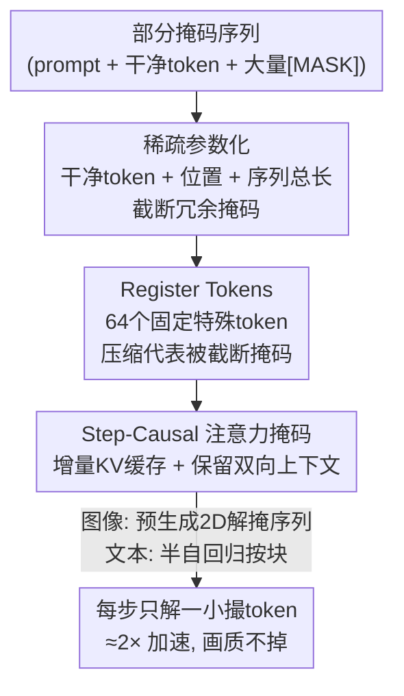

# Sparse-LaViDa: Sparse Multimodal Discrete Diffusion Language Models

**会议**: CVPR 2026  
**论文**: [CVF Open Access](https://openaccess.thecvf.com/content/CVPR2026/html/Li_Sparse-LaViDa_Sparse_Multimodal_Discrete_Diffusion_Language_Models_CVPR_2026_paper.html)  
**代码**: 无  
**领域**: 多模态VLM / 扩散模型 / LLM效率  
**关键词**: 掩码离散扩散, 多模态统一模型, KV缓存, 稀疏参数化, 推理加速

## 一句话总结
针对掩码离散扩散模型（MDM）每步都要把上千个冗余掩码 token 全部喂进网络、且无法用 KV 缓存的两大效率瓶颈，Sparse-LaViDa 提出一种"稀疏参数化 + register token + step-causal 注意力掩码"的等价改造，在不破坏 MDM 双向上下文的前提下，让模型每步只处理"该解码的那一小撮 token"，在文生图、图像编辑、视觉数学推理上拿到最高 ~2.8× 的加速且画质/精度基本不掉。

## 研究背景与动机
**领域现状**：统一多模态模型（既能理解又能生成）是当前热点。其中一条很有前景的路线是掩码离散扩散模型（Masked Discrete Diffusion Model, MDM）——把文本和图像都表示成离散 token 序列，前向过程逐步把干净 token 替换成 `[MASK]`，模型学反向过程，从全掩码序列出发迭代地"解掩码"直到得到干净序列。代表作 LaViDa-O 在图像理解、文生图、图像编辑上都拿到了 SOTA。相比自回归（AR）模型，MDM 天然有双向上下文、支持并行解码、能做 inpainting/文本填空这类任务。

**现有痛点**：MDM 虽然支持并行解码，推理却很慢，原因有两个。其一，它用的是全注意力而非 AR 的因果注意力，这让它**无法用 KV 缓存**——每步都得重算整段序列。其二，它每一步都要把**全部** token（包括大量还没轮到解码的冗余 `[MASK]`）过一遍网络。比如一张图被表示成 1024 个 token，即便某一步只解开其中几十个，模型也得把 1024 个 token 全跑一遍。

**核心矛盾**：现有的加速方案要么治标不治本，要么"加速换功能"。免训练的 KV 缓存方法（Fast-dLLM、dKV-Cache 等）靠启发式硬塞缓存，掉点不可控、随任务波动。训练式的 Block Diffusion 用 block-causal 注意力把并行解码约束成**严格从左到右**的块状顺序，确实能缓存能截断，但这套左到右的假设对图像生成/编辑很不友好（图像 token 没有天然顺序），而且 block-causal 掩码**砍掉了双向上下文**，inpainting 这类 MDM 的看家任务直接做不了。

**本文目标**：在**既支持 KV 缓存、又能截断任意位置冗余 token**的同时，不假设左到右解码顺序、不牺牲双向上下文，把标准 MDM 公式忠实、高效地实现出来。

**切入角度**：作者抓住 MDM 的一个数学性质——反向过程在标准独立性假设下被因式分解成 $p_\theta(X_0|X_t)=\prod_{i=1}^{L}p_\theta(X_0^i|X_t)$，每个位置的预测是**独立**优化、独立采样的。既然只关心子集 $C$ 上的预测，就没必要去算 $C$ 之外位置的 logits；再加上"掩码 token 除了'此处被掩码'外不携带任何实质信息"，那么这些掩码就可以被压缩掉、不必逐个物化（materialize）。

**核心 idea**：用一套**稀疏参数化**把"部分掩码序列"用"干净 token + 它们的位置 + 序列总长度"唯一表示，从而每步只把 prompt、已解码 token 和当前要解码的那一小撮 token 送进网络；再用少量 register token 补回截断损失的建模容量，用 step-causal 掩码消除训练/推理鸿沟。

## 方法详解

### 整体框架
Sparse-LaViDa 不是一个新模型，而是对标准 MDM 的一种**等价但更高效的参数化**——它建立在 SOTA 统一 MDM 模型 LaViDa-O（10.4B）之上，用同样的 MDM 训练目标，只改"怎么实现 $p_\theta(X_0^i|X_t)$"这一层。整条链路分三块：① **稀疏表示**——把含大量 `[MASK]` 的序列压成"干净 token + 序列长度"，不再物化所有掩码；② **register token**——在序列末尾挂 64 个固定的特殊 token，作为被截断掩码的压缩代表，把截断丢掉的建模容量补回来；③ **step-causal 注意力掩码**——一套结构化掩码，让推理时能增量更新 KV 缓存、训练时又能并行模拟这套缓存行为，二者行为对齐。

推理时（见下图），任意采样步 $k$ 的输入只有四类 token：已在缓存里的历史解码 token、上一步刚解码待入缓存的 token、本步要解码的掩码 token、register token；模型只为"本步要解码的 token"输出 logits 并采样解掩。这样每步处理的 token 数远小于完整序列，叠加 KV 缓存复用，就拿到了加速。

### 关键设计

**1. 稀疏参数化：把部分掩码序列压成"干净 token + 总长度"，每步只算该算的**

这是全文的命门。痛点在于 MDM 每步都把所有 $L$ 个 token（含一大堆冗余 `[MASK]`）喂进网络、输出一个 $L\times V$ 的稠密 logits 张量，而其中绝大多数位置的预测当前根本用不上。作者的依据是反向过程的因式分解 $p_\theta(X_0|X_t)=\prod_{i=1}^{L}p_\theta(X_0^i|X_t)$ 每个位置独立，所以只需为目标子集 $C$ 输出 logits。但光有这点还不够——因为 $X_t$ 里那些掩码位置 $X_t^j$ 形式上仍是输入的一部分。关键的第二步观察是：**掩码 token 不携带实质信息，只标记"此处被掩码"**，所以可以被压缩。一个七 token 序列 "I have [m] dog [m] [m] [m]" 不必用 7 个 token 表示，等价地用"带位置编码的干净 token（I@1, have@2, dog@4）+ 一个标明序列总长（=7）的特殊 token"就能唯一恢复——因为掩码位置就是干净 token 没占的那些位置。这样网络真正处理的 token 数从"全序列"降到"prompt + 已解码 + 待解码的一小撮"，这是加速的根本来源，且因为它只是标准 MDM 的等价改写，不引入近似误差。

**2. Register Token：用 64 个固定特殊 token 补回截断损失的建模容量**

单纯靠"一个长度 token"表示被截断的掩码，会让图像生成质量明显下降。作者分析有两个原因：其一，截断本身会损失模型容量——一张 1024×1024 的图要用 4096 个 token，而最初几步只采样不到 100 个 token，激进地砍 token 数固然提速，却也削掉了模型的表达能力；其二，已有文生图工作表明，要让特殊 token 通过注意力机制**实质性地影响生成**，需要**足够数量**的特殊 token。因此 Sparse-LaViDa 最终用 **64 个 register token**，位置 id 连续放在序列末尾（上例中即位置 8–51）。这个数目在整个推理过程中**保持恒定、不随被截断掩码数增长**，相对总序列长很小。消融显示（见下表）register 主要提升的是细粒度对齐和低层视觉细节：GenEval 这种靠物体检测的高层对齐几乎不受影响，而 DPG（用 VQA 判精细对齐）和 FID/HPS 这类画质指标在去掉 register 后明显变差。

**3. Step-Causal 注意力掩码：让训练并行地模拟推理的增量缓存，消除训练/推理鸿沟**

截断 + KV 缓存意味着推理时"并非所有 token 互相可见、模型也看不到全部 token"，这与 vanilla MDM 训练用的全注意力不一致——若不对齐，训练学到的东西和推理实际跑的就对不上。作者设计了一套 step-causal 掩码来在一次训练前向里**并行模拟**推理的逐步入缓存行为。具体地，把序列 $X_t$ 切成 $M+N$ 个"块"：prompt 记为块 0，干净 token 随机分到块 $\{1,\dots,M\}$，掩码 token 随机分到块 $\{M+1,\dots,M+N\}$（"块"只是编号，同块 token 不必在序列里连续）。规则是：干净块 $i$ 只能注意到块 $j\le i$（模拟干净 token 顺序入缓存）；掩码块 $i$ 只能注意到**同一掩码块** $j=i$ 或所有 prompt/干净块 $j\le M$，但**不能注意到其它掩码块**——即掩码之间互不可见，但都能看 prompt 和干净 token。每个掩码块再挂上对应的 register token、共享块号、遵守相同注意力规则。这样一次前向就能模拟出推理里 $0\to1\to2\to3\to4$ 和 $0\to1\to2\to3\to5$ 等多条解码路径。与 Block Diffusion 的 block-causal 掩码不同，step-causal 掩码**保留了图像生成/编辑/inpainting 所必需的双向上下文**（掩码 token 能双向看到所有干净上下文），不假设左到右顺序。消融里去掉这个掩码会让 GenEval 从 0.78 掉到 0.71、DPG 从 82.4 掉到 78.9，正是训练/推理行为不匹配的代价。

### 一个完整示例
以推理某一步 $k$ 为例（对应原文 Figure 3）：一个长度为 10 的待解序列，位置 4、5、8 是早先已解码并存进 KV 缓存的 token；位置 2、7 是上一步刚解码、本步要被写入缓存的"新缓存 token"；位置 1、10 是本步要解码的掩码 token；再加上挂在末尾的 register token。注意力掩码保证：新缓存 token（2、7）**不能**注意到本步的掩码/register token（1、10），从而保证"已缓存表示不被掩码 token 污染"，缓存才能安全复用；register 能注意到所有 token，但只被本步掩码和 register 注意到。模型只为位置 1、10 输出 logits 并采样解掩，下一步把 1、10 并入缓存，如此往复直到全部解开。解掩顺序按任务而定：文生图/图像编辑用 LaViDa-O 的分层随机采样器预先生成 2D 解掩顺序（无需置信度分数，画质更高）；文本生成/图像理解用半自回归——按块从左到右采样，块内用置信度动态决定解哪些 token，但仍保留块的双向上下文与任意块顺序能力（故能做文本填空、约束生成，而 Block Diffusion 因单边上下文做不到）。

### 损失函数 / 训练策略
由于 Sparse-LaViDa 只是标准 MDM 的等价参数化，它**沿用 vanilla MDM 训练目标** $L_\mathrm{MDM}=-\mathbb{E}_{t,X_0,X_t}\big[\tfrac{1}{t}\log p_\theta(X_0|X_t)\big]$，唯一区别是 $p_\theta(X_0^i|X_t)$ 的实现走稀疏参数化 + step-causal 掩码。与 D2F 等依赖蒸馏做事后加速的方法不同，它是一种**本质上高效的参数化**，无需额外蒸馏阶段，可扩展训练与推理。实现上从 LaViDa-O 预训练权重初始化，在图像理解（MAmmoth-VL、VisualWebInstruct）、文生图（从 LAION-2B/COYO-700M/SA-1B/JourneyDB 等子采样 20M 图文对）、图像编辑（GPT-Edit-1.5M）的混合数据上做 SFT，64 张 H100 训练 100k 步。

## 实验关键数据

### 主实验
基座为 LaViDa-O（10.4B），所有图像生成实验在单卡 A100、1024 分辨率下测；"加速比"相对 LaViDa-O。

| 任务 / 数据集 | 指标 | LaViDa-O | Sparse-LaViDa | 加速 |
|--------|------|----------|---------------|------|
| 文生图 GenEval | Overall ↑ | 0.77 | 0.78 (+0.01) | 1.95× |
| 文生图 GenEval | Latency (s) ↓ | 21.27 | 10.86 | — |
| 文生图 DPG-bench | Score ↑ | 81.8 | 82.4 (+0.6) | — |
| 文生图 MJHQ-30k | FID ↓ | 6.68 | 7.63 | — |
| 图像编辑 ImgEdit | Overall ↑ | 3.71 | 3.79 (+0.08) | 2.83× |
| 图像编辑 ImgEdit | Latency (s) ↓ | 63.98 | 22.55 | — |
| 视觉数学 MathVista | Acc ↑ | 56.9 | 56.7 | 2.80× |

文生图上画质与 LaViDa-O 持平甚至略升（GenEval +0.01、DPG +0.6），延迟近乎减半，且性能/效率同时超过 Flux.1-Dev 等强基线。值得注意的是，当 LaViDa-O 与 Sparse-LaViDa 在**同一 20M 子集**上训练时，Sparse-LaViDa 的 FID（7.63）反而优于 LaViDa-O*（8.11），说明稀疏参数化 + step-causal 训练在同数据条件下不仅不掉、还能略升画质。图像理解短问答任务（MME/MMMU/ChartQA/DocVQA 等）上性能整体竞争力相当，但加速有限——因为输出 token 数常少于一个块（32 token），此时 Sparse-LaViDa 退化为仅做 prompt 缓存、没有截断收益。

### 消融实验

**速度来源拆解（文生图，原文 Table 6）**：把加速拆成缓存 prompt、缓存已解码 token、截断冗余 token 三个开关，任开其一都能提速，全开收益最大。

| Cache Prompt | Cache Res | Truncate Res | Latency ↓ | Speedup ↑ |
|:---:|:---:|:---:|:---:|:---:|
| — | — | — | 21.27 | 1.00× |
| ✓ | — | — | 16.43 | 1.29× |
| — | ✓ | — | 18.87 | 1.13× |
| — | — | ✓ | 17.93 | 1.19× |
| ✓ | ✓ | — | 14.09 | 1.51× |
| ✓ | — | ✓ | 13.72 | 1.55× |
| ✓ | ✓ | ✓ | 10.86 | 1.96× |

**Register 数量（文生图）**：register 主要补低层视觉细节与精细对齐，对高层对齐影响小。

| #Register | GenEval ↑ | DPG ↑ | HPS v3 ↑ | FID ↓ |
|:---:|:---:|:---:|:---:|:---:|
| 0 | 0.76 | 80.3 | 8.68 | 9.32 |
| 1 | 0.76 | 79.6 | 8.71 | 9.50 |
| 32 | 0.77 | 82.1 | 8.87 | 8.25 |
| 64 | 0.78 | 82.4 | 8.89 | 7.63 |

**训练策略（原文 Table 8）**：去掉 step-causal 掩码或干脆不微调，性能大幅崩塌。

| 配置 | GenEval ↑ | DPG ↑ | 说明 |
|------|:---:|:---:|------|
| Sparse-LaViDa（完整） | 0.78 | 82.4 | 完整模型 |
| − No Step-Causal Mask | 0.71 | 78.9 | 训练/推理行为不匹配 |
| − No Training | 0.24 | 47.9 | 直接把稀疏推理套在原权重上，几乎不可用 |

### 关键发现
- **截断 + 缓存缺一不可**：三个开关里截断（Truncate Res）单开 1.19×、缓存 prompt 单开 1.29×，但只有三者叠加才能逼近 1.96×；这也解释了为何短问答任务（无截断空间）几乎不加速。
- **step-causal 掩码是训练成败的关键**：去掉它 GenEval 掉 0.07、DPG 掉 3.5；而"不训练直接套稀疏推理"会从 0.78 崩到 0.24，说明这套参数化必须配套微调才能让权重适配。
- **register 的作用是"补细节"而非"补结构"**：GenEval（物体级对齐）对 register 数几乎不敏感，但 DPG（VQA 精细对齐）和 FID/HPS（画质）随 register 从 0→64 单调改善——印证它增强的是低层视觉细节。

## 亮点与洞察
- **把"等价改写"做成加速**：核心洞察是 MDM 反向过程位置独立 + 掩码不携带信息，于是"全掩码序列"可被无损压成"干净 token + 长度"。这不是近似加速而是**等价参数化**，理论上无质量代价——这点比一众启发式免训练缓存法干净得多。
- **用注意力掩码弥合训练/推理鸿沟**：step-causal 掩码用"块编号 + 同块/前块可见"的规则，在一次并行前向里模拟出推理的多条增量缓存路径，是个很可复用的 trick——任何"推理是增量/稀疏、训练想并行"的场景都能借鉴这种"块编号编码因果结构"的做法。
- **register token 当"容量缓冲"**：把截断丢掉的容量用一小撮固定特殊 token 补回来，且数目恒定不随截断量增长，是个轻量又有效的设计；消融还顺手定位了它的作用层次（低层细节）。
- **不牺牲双向上下文的加速**：相比 Block Diffusion 用单边上下文换速度，这里同时保住了 inpainting/outpainting、并行 grounding、约束 captioning 等只有双向上下文才能做的任务。

## 局限与展望
- **需要额外训练**：作者承认 Sparse-LaViDa 必须微调（"No Training"直接崩到 0.24），不像免训练缓存法即插即用；但其上限超过"缓存所有可能 token"这种最激进缓存策略（启发式免训练法的上界）。
- **只在后训练设定验证**：原则上稀疏参数化可用于从零预训练大模型，但因算力成本，本文只在 LaViDa-O 后训练设定上做了实验，从零训练与更大规模 scaling 留作未来工作——⚠️ 因此"是否能在 from-scratch 预训练中保持等价性与加速"尚未实证。
- **短输出任务收益小**：当输出 token 少于一个块（32）时退化为纯 prompt 缓存、无截断收益，对短问答类理解任务加速有限。
- **加速依赖任务有足够"冗余掩码"可截**：方法收益本质来自截断冗余 token，序列越长（如高分辨率图）收益越大，序列短则收益受限。

## 相关工作与启发
- **vs Block Diffusion / SDAR / D2F（训练式加速）**：它们靠 block-causal 注意力把解码约束成左到右块状顺序来支持缓存与截断，但牺牲了双向上下文、对无天然顺序的图像 token 不友好；Sparse-LaViDa 用 step-causal 掩码同样支持缓存 + 截断，却保留双向上下文与任意解码顺序，是**首个不假设左到右、不牺牲双向上下文**的方案。D2F 还需蒸馏，Sparse-LaViDa 无需额外蒸馏阶段。
- **vs Fast-dLLM / dKV-Cache / Sparse-dLLM（免训练缓存）**：这些靠启发式硬塞 KV 缓存，掉点不可控且随任务波动；Sparse-LaViDa 是学习式截断，MathVista 上精度（56.7 vs 56.1）和延迟（3.72s vs 5.57s）都胜过 Fast-dLLM。
- **vs LaViDa-O（基座）**：同为 10.4B 统一 MDM、同套训练目标，Sparse-LaViDa 只换参数化实现，在三类任务上拿到 1.95×–2.83× 加速且画质/精度持平或略升，是对基座的"纯效率增强"。

## 评分
- 新颖性: ⭐⭐⭐⭐⭐ 从"位置独立 + 掩码无信息"推出无损稀疏参数化，首个兼顾 KV 缓存、任意位置截断与双向上下文的 MDM 加速方案。
- 实验充分度: ⭐⭐⭐⭐ 覆盖文生图/编辑/理解三类任务 + 速度/register/训练策略三组消融，但仅后训练设定、缺 from-scratch 验证。
- 写作质量: ⭐⭐⭐⭐⭐ 动机推导清晰，稀疏表示与 step-causal 掩码配图讲解到位，训练/推理对齐论证完整。
- 价值: ⭐⭐⭐⭐ 对统一 MDM 是实打实的近 2–3× 提速且不掉质，工程可落地，但依赖微调、短输出收益有限。

<!-- RELATED:START -->

## 相关论文

- [\[CVPR 2026\] Cubic Discrete Diffusion: Discrete Visual Generation on High-Dimensional Representation Tokens](cubic_discrete_diffusion_discrete_visual_generation_on_high-dimensional_represen.md)
- [\[CVPR 2026\] Sparse Spectral LoRA: Routed Experts for Medical VLMs](sparse_spectral_lora_routed_experts_for_medical_vlms.md)
- [\[CVPR 2026\] VISion On Request: Enhanced VLLM Efficiency with Sparse, Dynamically Selected, Vision-Language Interactions](vision_on_request_enhanced_vllm_efficiency_with_sparse_dynamically_selected_visi.md)
- [\[CVPR 2026\] Bridging the Modality Gap in Compositional Zero-Shot Learning via Sparse Alignment and Unimodal Memory Bank](bridging_the_modality_gap_in_compositional_zero-shot_learning_via_sparse_alignme.md)
- [\[NeurIPS 2025\] Sparse Autoencoders Learn Monosemantic Features in Vision-Language Models](../../NeurIPS2025/multimodal_vlm/sparse_autoencoders_learn_monosemantic_features_in_visionlan.md)

<!-- RELATED:END -->
