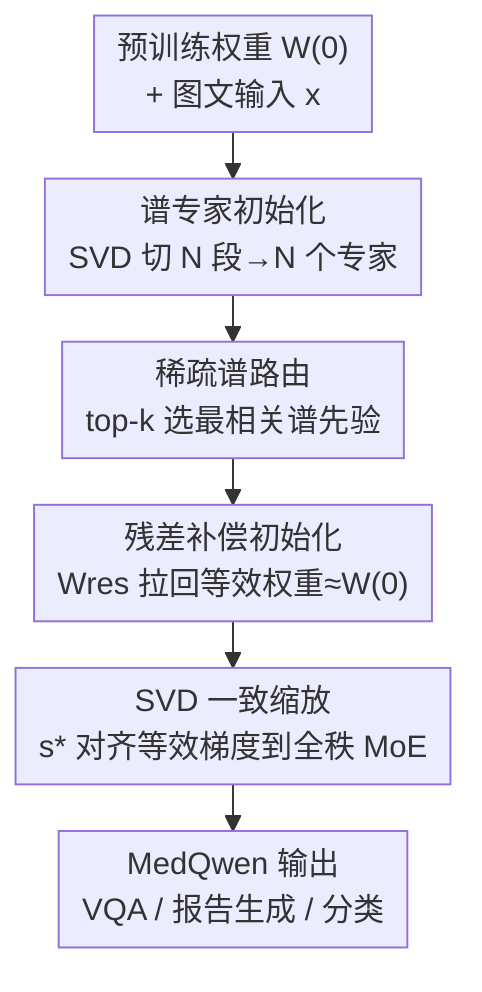

# Sparse Spectral LoRA: Routed Experts for Medical VLMs

**会议**: CVPR 2026  
**论文**: [CVF Open Access](https://openaccess.thecvf.com/content/CVPR2026/html/Nejatimanzari_Sparse_Spectral_LoRA_Routed_Experts_for_Medical_VLMs_CVPR_2026_paper.html)  
**代码**: 无  
**领域**: 多模态VLM  
**关键词**: 医学VLM、LoRA-MoE、SVD谱初始化、缩放因子、灾难性遗忘

## 一句话总结
本文提出 MedQwen，把预训练权重的 SVD 谱段切成互不重叠的专家、用 top-k 路由按输入选谱先验，再配一套有理论依据的残差补偿与缩放规则把低秩 MoE 的训练动力学对齐到全秩全量微调，在 23 个医学数据集上逼近全量微调（参数少 339×），并把序列训练的灾难性遗忘从 >20–50% 压到约 5%。

## 研究背景与动机

**领域现状**：通用视觉语言模型（VLM）要落到医学任务上，主流做法是用 LoRA 这类参数高效微调（PEFT）在冻结骨干上挂一组低秩矩阵 $W=W^{(0)}+sBA$，省下大模型的全量微调成本，已经在医学 VQA、报告生成上做出 LLaVA-Med、HealthGPT 等专用模型。

**现有痛点**：作者观察到标准 LoRA 对"训练数据配方"极其敏感——在单个医学数据集（如 Slake）上调好的模型，换到别的数据集（如 PathVQA）就崩；而把多个异构来源直接混在一起训，又会引入跨数据集干扰（cross-dataset interference），互相拖后腿。更糟的是，临床场景里数据和任务是顺序到达的，朴素的持续训练会把先学的知识冲掉，造成灾难性遗忘。

**核心矛盾**：根子在于 SVD 谱段携带的是"任务相关"信息——论文引用的实验显示，Slake 上最大奇异值段（$x=l$）最好、PathVQA 上最小段（$x=0$）最好、$r=128$ 时中间段最关键。也就是说没有哪一个固定谱段对所有医学任务都最优；PiSSA 死磕主成分、MiLoRA/KaSA 死磕次成分，都是在一个固定子空间里二选一，无法随输入自适应。

**本文目标**：(1) 让模型按输入自动挑选最相关的谱先验、减少跨数据集干扰；(2) 在不改骨干、不换优化器的前提下，把低秩 MoE 的训练动力学对齐到全秩全量微调，缩小 PEFT 与全量微调长期存在的性能差。

**切入角度**：既然不同谱段各有所长，那就别再二选一——把整个奇异值谱切成若干互不重叠的段，每段交给一个 LoRA 专家，让路由器学着"看输入选谱段"。

**核心 idea**：用"SVD 谱段 → 专家 → 稀疏路由"替代"固定单一子空间的 LoRA"，并用残差补偿 + 理论缩放把这套低秩 MoE 的初始权重和梯度都对齐到全秩 MoE。

## 方法详解

### 整体框架
MedQwen 以 Qwen2.5-VL 7B 为底座，整条线就是把一层里原本的单个 LoRA 适配器换成一组"谱专家 + 路由器"，再在初始化和缩放两个环节上做对齐校正。具体地：先对预训练权重做 SVD，把奇异值谱均匀切成 $N$ 段，每段初始化成一个低秩专家（谱先验）；前向时路由器对输入打分、只激活 top-$k$ 个专家，把它们的低秩更新加到冻结底座上；但直接塞 SVD 子空间会破坏 LoRA 原本"零初始化"带来的良性动力学，于是引入一个常数残差项 $W_{\text{res}}$ 把初始等效权重拉回 $W^{(0)}$，再用一个理论推导的缩放因子把每个专家的等效梯度对齐到全量微调 MoE。整体输出为

$$\text{MoELoRA}(x) = W^{(0)}x + \sum_{i\in S_k(x)} R(x)_i\,(s B_i A_i x)$$

其中 $S_k(x)$ 是 top-$k$ 专家下标集，$R(x)_i$ 是归一化后的路由权重，$s$ 是缩放因子。

### 关键设计

**1. 稀疏谱 LoRA：把 SVD 谱段切成互不重叠的专家**

这一条直接针对"单一固定子空间无法兼顾所有医学任务"的痛点。对预训练权重 $W^{(0)}=USV^\top$ 做 SVD 后，按秩把谱均匀切成 $N$ 段，第 $j$ 个专家分到段 $[k:k+t]$（$t=\min(m,n)/N$，$k=(j-1)t$），每个专家秩 $d=r/N$，其低秩因子由所属谱段构造：

$$B_i=\sqrt{\tfrac{1}{s}}\,U'S'^{1/2}\in\mathbb{R}^{m\times d},\qquad A_i=\sqrt{\tfrac{1}{s}}\,S'^{1/2}V'^\top\in\mathbb{R}^{d\times n}$$

前向时用 Mixtral 式 top-$k$ 路由：路由 logits $z(x)=W_z x$，对 top-$k$ 专家做归一化 softmax $R(x)_i$，其余置 0，只有被选中的专家及其门控路径回传梯度（$k\ll N$，激活参数远少于稠密 MoE）。这样路由器学到的是"按输入选谱段"——Slake 类输入路由到偏大奇异值的专家、PathVQA 类输入路由到偏小的专家——既保留了预训练结构、又把不同数据集的适配隔离在不同专家里，从机制上压住跨数据集干扰。和 PiSSA/MiLoRA 只在固定主/次成分上微调相比，它把"挑哪个谱段"从人工先验改成了数据驱动的可学习路由。

**2. 残差补偿初始化：让等效权重在初始时刻就等于 $W^{(0)}$**

直接把 SVD 子空间塞进 MoE 会带来普通零初始化 LoRA 没有的麻烦——初始时 $\sum_i R(x)_i sB_i^{(0)}A_i^{(0)}$ 不为零，等效权重 $\tilde W^{(0)}$ 会偏离真正的预训练权重 $W^{(0)}$，相当于一开始就动了底座。本文按"upcycled MoE"的思路引入一个常数残差项做减法补偿：

$$\tilde W^{(0)} = W^{(0)} - W_{\text{res}} + \sum_{i=1}^{N} R(x)_i\, s B_i^{(0)}A_i^{(0)} \approx W^{(0)}$$

$W_{\text{res}}$ 取所有专家初始贡献的期望，并通过最小化期望 MSE $\arg\min_{W_{\text{res}}}\mathbb{E}_x\|W_{\text{res}}-s\sum_i R(x)_iB_i^{(0)}A_i^{(0)}\|^2$ 求闭式解。借助 top-$k$ 路由的矩量恒等式 $\mathbb{E}[R(x)_i]=\tfrac{1}{N}$、$\mathrm{Var}(R(x)_i)=\tfrac{N-k}{kN^2}$，得到

$$W_{\text{res}}^{+}=\frac{s}{N}\sum_{i=1}^{N} B_i^{(0)}A_i^{(0)}$$

也就是说只要先把所有专家初始更新平均掉、再从底座里减去，就能保证初始等效权重无偏地等于 $W^{(0)}$。常见的 LoRA-MoE 零初始化方案恰好是 $W_{\text{res}}^{+}=0$ 的特例，本文把它推广成了非零谱初始化也能用的形式。

**3. SVD 一致缩放：用理论缩放因子把等效梯度对齐到全秩 MoE**

光对齐初始权重还不够，低秩还会改变梯度几何，造成与全量微调的收敛差距。作者把对齐拆成逐专家条件（Theorem 2）：只要每个专家满足 $\tilde W_i^{(0)}\approx W_i^{(0)}$ 且 $\tilde g_i^t\approx g_i^t$，整个 LoRA-MoE 的训练动力学就等价于全秩全量微调的 upcycled MoE，各专家可独立优化、训练更稳。对零初始化下的等效梯度 $\tilde g_i^t=s^2(B_i^t B_i^{t\top}g_i^t+g_i^t A_i^{t\top}A_i^t)$ 做分析，最小化 $\|\tilde g_i^t-g_i^t\|$（学习率比 $\eta$）得到最优缩放因子

$$s^{*}=\sqrt{\frac{3n\,\eta}{r}}$$

由于实践中 $n\gg r$，$s^*$ 明显大于常用的 $s=2$——这从理论上解释了为什么小缩放因子收敛慢、为什么 MoE 里把秩切小后要用更大的缩放来补回梯度范数。同时为了在塞入 SVD 谱子空间时仍保持数值稳定，用阻尼系数 $\rho>0$ 进一步压初始因子幅度 $B_i^{(0)}=\sqrt{\tfrac{1}{s\rho}}U_iS_i^{1/2}$、$A_i^{(0)}=\sqrt{\tfrac{1}{s\rho}}S_i^{1/2}V_i^\top$，把系统推向 $s^*$ 公式成立的零初始化邻域。实测 $s\in[4,16]$ 在收敛速度和稳定性之间最平衡。

### 损失函数 / 训练策略
三阶段训练：第一、二阶段用 LLaVA-Med 提供的对齐 + 指令微调数据；第三阶段在 SLAKE、VQA-RAD、PathVQA 等医学数据集上做 MoE 微调。MoE 训练带负载均衡损失（与单 LoRA 对比时为公平起见关闭）。实践默认 2-of-8 配置（8 专家激活 2 个），总秩 32。

## 实验关键数据

### 主实验
医学 VQA 综合对比（Avg. 为多数据集均值）：

| 模型 | 参数 | VQA-RAD close/open | SLAKE close/open | PathVQA close/open | OMVQA | Avg. |
|------|------|------|------|------|------|------|
| Qwen-2.5-VL | 7B | 61.8 / 27.2 | 64.7 / 36.7 | 60.5 / 33.4 | 60.8 | 49.3 |
| HealthGPT-L14 | 14B | 74.5 / 54.5 | 71.9 / 56.2 | 75.2 / 42.1 | 67.2 | 63.1 |
| **MedQwen** | 7B | **78.8 / 59.6** | **75.3 / 59.9** | **84.2 / 49.1** | **70.6** | **68.2** |

MedQwen 比 Qwen-2.5-VL 底座平均高 18.9%，比 Med-LLaVA、Med-Flamingo 分别高 23.2%、29.6%。

零样本分类（BiomedCLIP ViT-B/16，9 个放射学数据集均值）：

| 方法 | 参数(%) | Avg. | 说明 |
|------|---------|------|------|
| Full FT | 100 | 56.76 | 全量微调 |
| Full FT MoE | 760 | 61.72 | 全秩 MoE 上界 |
| LoRA (rank32) | 5.98 | 55.45 | 最强单 LoRA 基线 |
| MoELoRA | 2.24 | 55.52 | LoRA-MoE 基线 |
| **Ours** | **2.24** | **58.83** | 达全秩 MoE 的 95.31%，参数少 339× |

MedQwen 用 2.24% 参数拿到 58.83%，比 rank-32 单 LoRA 高 +3.38、比 PiSSA 高 8.75%、比 HydraLoRA 高 4.84%，9 个数据集全胜，且超过全量微调（56.76%）。

### 消融实验
SVD 初始化与 MoE 缩放（MS）的消融（O=本文谱段，P=主成分段，M=次成分段，R=随机段）：

| 配置 | Avg. | Avg.(w/o MS) | 说明 |
|------|------|------|------|
| MoE + P | 67.3 | 66.8 | 只用主成分段 |
| MoE + M | 67.4 | 66.6 | 只用次成分段 |
| MoE + R | 67.6 | 66.9 | 随机段 |
| MoE + O（完整）| **68.2** | 67.3 | 本文谱段，最优 |
| O 但无 MoE | 60.1 | — | 单 LoRA 上用谱段，掉到 60.1 |
| 无 SVD 初始化（零初始化）| 67.3 | 66.8 | — |

### 关键发现
- **专家化是大头**：同样用本文 SVD 谱段，去掉 MoE 退回单 LoRA 直接从 68.2 掉到 60.1（−8.1），说明"谱段切分 + 路由专家化"才是性能来源，单靠谱初始化不够。
- **缩放稳定贡献正向**：开启 MoE 缩放（MS）普遍比关闭高约 0.5–1.0 点，且本文谱段（O）始终优于主/次/随机段。
- **灾难性遗忘对照鲜明**：Harvard-FairVLMed → PathVQA 顺序训练 15 epoch 后，标准 LoRA 掉 >50%、MoELoRA 掉 >20%，本文仅掉约 5%。
- **稀疏激活更优**：总秩固定 32 时，2-of-8 是性能/存储的最佳折中；激活更多专家反而可能掉点，且路由更难训、显存与运行时变差。
- **秩的收益递减**：rank 8→128 性能差距持续缩小，但 rank 64→128 仅 +0.3%，说明高秩边际收益有限。

## 亮点与洞察
- **把"选谱段"从人工先验改成可学路由**：PiSSA/MiLoRA 争论"该调主成分还是次成分"，本文直接把整个谱切片、让路由按输入挑——一个机制吸收了两派的优点，还顺带隔离了跨数据集干扰，这是最"啊哈"的地方。
- **闭式残差补偿很优雅**：靠 top-$k$ 路由的均值/方差矩量恒等式，把"初始等效权重无偏"这件事化成 $W_{\text{res}}^{+}=\tfrac{s}{N}\sum_i B_i^{(0)}A_i^{(0)}$ 的闭式解，并证明零初始化 LoRA-MoE 是它的特例，理论上把谱初始化和现有方案统一了。
- **缩放因子的理论落点可迁移**：$s^*=\sqrt{3n\eta/r}$ 把"小缩放收敛慢、低秩要配大缩放"这个经验观察给量化了，这条结论对任何 LoRA-MoE 调参都有参考价值。
- **不改骨干即插即用**：整套方法不动 Qwen2.5-VL 架构、不换优化器，对已有医学 VLM 流水线友好。

## 局限与展望
- **理论对齐在谱子空间里只是近似**：作者自己指出 SVD 子空间的精确梯度动力学难分析，$s^*$ 公式严格成立于零初始化，他们靠加大 $s$、$\rho$ 把系统"推向"零初始化邻域来近似——这是工程化妥协，⚠️ 严谨性以原文 Theorem 5 及附录为准。
- **专家/激活数的超参敏感**：2-of-8 是经验最优，专家数与激活比变化会同时影响性能、显存和路由可训练性，缺乏自动选 $N,k$ 的机制。
- **只在 Qwen2.5-VL 7B 上验证**：是否能稳定迁移到更小/更大底座或非医学领域未充分检验。
- **改进方向**：把谱段划分做成自适应（不均匀切、按任务动态合并段）、或把残差补偿从常数项升级为可学习项，可能进一步缩小与全秩 MoE 的差距。

## 相关工作与启发
- **vs PiSSA / MiLoRA / KaSA**：它们都在单一固定谱子空间上微调（主成分 / 次成分 / 把次成分当噪声替换），本文把谱切成互不重叠多段交给多个专家、用路由自适应选段，优势是"按输入选谱"而非"全局二选一"，零样本分类上比 PiSSA 高 8.75%。
- **vs MoELoRA / HydraLoRA / AdaMoLE**：同为 LoRA-MoE，但它们是零初始化 + 经验缩放，本文加了 SVD 谱先验初始化、闭式残差补偿和理论缩放因子，在相同参数（2.24%）和相同显存/训练时间下持续更优，灾难性遗忘上 5% vs >20%。
- **vs 全量微调 / 全秩 MoE**：本文用 339× 更少参数逼近全秩 MoE（达其 95.31%），并在多数医学 VQA 数据集上超过全量微调，验证了 PEFT 与全量微调间长期性能差是可以靠对齐显著缩小的。

## 评分
- 新颖性: ⭐⭐⭐⭐ 把 SVD 谱切片做成 MoE 专家、配闭式残差补偿与理论缩放对齐全秩 MoE，是 PEFT 路线上一个干净的新组合。
- 实验充分度: ⭐⭐⭐⭐⭐ 23 个医学数据集覆盖 VQA/报告生成/分类/遗忘/幻觉，主实验+多组消融+收敛/扩展性分析都给齐。
- 写作质量: ⭐⭐⭐⭐ 理论推导（5 个定理）与方法叙述清晰，但部分公式记号偏密、谱初始化细节需对照原文。
- 价值: ⭐⭐⭐⭐ 参数效率与抗遗忘对真实临床顺序学习有实用价值，方法也可迁移到通用 LoRA-MoE 微调。

<!-- RELATED:START -->

## 相关论文

- [\[CVPR 2026\] RNED: Rotary Number Encoding and Decoding for Medical VLMs](rned_rotary_number_encoding_and_decoding_for_medical_vlms.md)
- [\[CVPR 2026\] Sparse-LaViDa: Sparse Multimodal Discrete Diffusion Language Models](sparse-lavida_sparse_multimodal_discrete_diffusion_language_models.md)
- [\[CVPR 2026\] Medic-AD: Towards Medical Vision-Language Model's Clinical Intelligence](medic-ad_towards_medical_vision-language_models_clinical_intelligence.md)
- [\[ICML 2025\] Dynamic Mixture of Curriculum LoRA Experts for Continual Multimodal Instruction Tuning](../../ICML2025/multimodal_vlm/dynamic_mixture_of_curriculum_lora_experts_for_continual_multimodal_instruction_.md)
- [\[CVPR 2026\] Similarity-as-Evidence: Calibrating Overconfident VLMs for Interpretable and Label-Efficient Medical Active Learning](similarity-as-evidence_calibrating_overconfident_vlms_for_interpretable_and_labe.md)

<!-- RELATED:END -->
