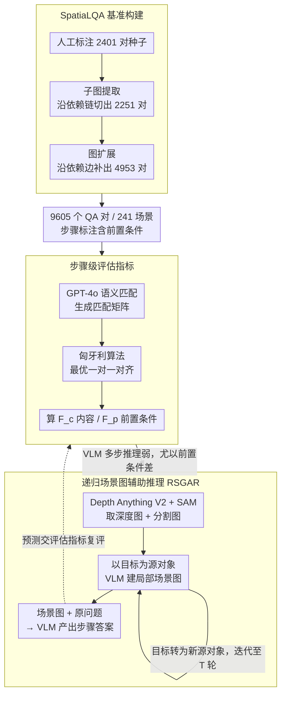

# SpatiaLQA: A Benchmark for Evaluating Spatial Logical Reasoning in Vision-Language Models

**会议**: CVPR 2026  
**arXiv**: [2602.20901](https://arxiv.org/abs/2602.20901)  
**代码**: [https://github.com/xieyc99/SpatiaLQA](https://github.com/xieyc99/SpatiaLQA)  
**领域**: 多模态VLM  
**关键词**: 空间逻辑推理, VLM基准, 场景图, 室内场景理解, 多步推理

## 一句话总结
提出SpatiaLQA基准（9605个QA对、241个真实室内场景），系统评估41个VLM在空间逻辑推理上的表现，并设计递归场景图辅助推理方法来提升VLM的空间逻辑推理能力。

## 研究背景与动机
**领域现状**：VLM在通用VQA和逻辑推理任务上已取得不错成绩，但在需要结合空间理解和多步逻辑推理的复杂现实场景中仍然力不从心。

**现有痛点**：现有基准要么聚焦空间理解（如SpatialRGPT-Bench）、要么聚焦逻辑推理（如MathVista），缺乏将二者整合的评估体系。同时，EQA任务关注的是动作执行，而非纯视觉-语义层面的推理。

**核心矛盾**：空间逻辑推理要求模型同时具备精确的空间感知能力和严密的多步因果推理能力，这两种能力的融合在现有VLM中未被系统研究。

**本文目标**：(a) 构建一个全面的空间逻辑推理基准；(b) 系统评估现有VLM在该任务上的表现；(c) 提出改进方法。

**切入角度**：将复杂场景分解为任务相关的场景图，让VLM聚焦于目标对象周围的空间环境。

**核心 idea**：用递归场景图构建方法将复杂室内场景逐步分解为与任务相关的空间关系图，增强VLM的多步空间推理能力。

## 方法详解

### 整体框架
这篇论文要回答一个问题：当 VLM 既要"看准"空间布局、又要"想清"多步因果时，它到底差在哪里，又能怎么补。为此它先搭了一个名为 SpatiaLQA 的基准来量化这种"空间逻辑推理"能力，再针对评估暴露出的短板提出一套推理时增强方法。

整条链路是这样转的：给定一张室内场景图和一个需要多步空间推理的问题，系统先用视觉基础模型抽出深度图和分割图作为几何线索，再以问题里的目标对象为锚点递归地搭出一张场景图，最后把这张图连同原问题一起喂给 VLM，让它产出一串逻辑连贯的操作步骤作为答案。基准负责"出题和判分"，方法负责"帮 VLM 把题做对"，二者一前一后构成全文——基准构建产出数据、评估指标在数据上判分暴露出 VLM 的短板、RSGAR 再针对短板做推理时增强后回到指标下复评。

### 关键设计

**1. SpatiaLQA 基准：用逻辑依赖关系把少量人工标注扩成大规模数据**

纯靠人工标注空间逻辑推理 QA 成本极高，而这类题目的核心恰恰是步骤之间的逻辑依赖，于是作者把"依赖关系"本身当成扩增的杠杆。数据采集分三阶段递进：先人工标注 2401 对作为种子，再用子图提取从已有标注里切出自洽的子推理链得到 2251 对，最后用图扩展沿依赖边补充新节点生成 4953 对，合计 9605 个 QA 对、覆盖 241 个真实室内场景。子图提取和图扩展都沿着逻辑依赖结构来做，因此扩增出来的题目在步骤前后关系上仍然自洽，而不是随机拼凑的伪样本。

**2. 步骤级评估指标：先语义匹配再最优对齐，给开放式多步答案打分**

空间逻辑推理的答案是一串开放式操作步骤，措辞和顺序都可能不同，传统的整体准确率根本无从下手。作者把判分拆成两步：先用 GPT-4o 在预测步骤和标注步骤之间生成一个语义匹配矩阵，判断哪一步在讲同一件事；再用匈牙利算法在这个矩阵上求最优一对一匹配，避免一个标注步骤被重复命中。对齐之后，分别在"步骤内容"和"步骤前置条件"两个维度上算精确率与召回率，得到内容 F1（$F_c$）和前置条件 F1（$F_p$）。把前置条件单独拎出来评，正是为了考查模型有没有真正理解步骤之间的依赖，而不只是凑齐了动作。

**3. 递归场景图辅助推理（RSGAR）：把复杂场景拆成逐步聚焦的局部子图**

直接把整张复杂场景丢给 VLM，它很容易漏掉关键的空间关系，于是 RSGAR 让模型像走思维链一样，沿空间结构一步步往外摊开。它先用 Depth Anything V2 和 SAM 拿到深度与分割信息，再以问题指定的对象为初始源对象：VLM 识别出与当前源对象直接接触的目标对象及它们之间的空间关系，把这些落成场景图的节点和边；随后把新加入的对象当作下一轮的源对象继续展开，直到达到预设的最大迭代次数。每一轮模型只需关注"当前对象的局部空间邻域"这一个小问题，复杂场景就被切成了一串可控的子问题。举例来说，若问题锚定在"桌上的杯子"，第一轮可能展开出"杯子—在—桌面""桌面—靠—墙"，第二轮再从桌面继续延伸到相邻的椅子和地面，几轮下来即拼出一张以目标为中心、由近及远的关系图，VLM 据此推理就不易遗漏关键关系。实验显示迭代轮数 $T$ 越大、最终场景图覆盖的空间信息越全、$F_c$/$F_p$ 越高（论文默认 $T=5$），且 RSGAR 的增益主要体现在步骤数多的复杂样本上，验证了"逐步分解"确实比一次性硬啃更有效。

### 损失函数 / 训练策略
RSGAR 是纯推理时方法，不引入任何额外训练，直接复用预训练 VLM 与视觉基础模型（Depth Anything V2、SAM）来增强推理。

## 实验关键数据

### 主实验

| 模型 | $F_c$ (内容F1) | $F_p$ (前置条件F1) |
|------|---------------|-------------------|
| Human | 97.6 | 92.5 |
| GPT-4o | 52.5 | 19.2 |
| Claude 3.5 Sonnet | 46.3 | 15.8 |
| Gemini 2.0 Flash | 44.1 | 14.7 |
| GPT-4o + RSGAR | **56.8** | **22.4** |
| InternVL2-26B | 38.2 | 12.1 |

### 消融实验

| 配置 | $F_c$ | $F_p$ | 说明 |
|------|-------|-------|------|
| GPT-4o (baseline) | 52.5 | 19.2 | 无场景图辅助 |
| + 深度图 | 53.8 | 20.1 | 仅加深度信息 |
| + 分割图 | 54.2 | 20.5 | 仅加分割信息 |
| + RSGAR (1轮) | 55.1 | 21.3 | 单轮场景图 |
| + RSGAR (3轮) | 56.8 | 22.4 | 递归3轮，效果最佳 |

### 关键发现
- 即使最强的GPT-4o在空间逻辑推理上的 $F_c$ 也仅约52.5%，与人类97.6%差距巨大
- 所有VLM在前置条件推理 $F_p$ 上表现更差，说明理解步骤间依赖关系是核心难题
- 随着答案步骤数增加，模型performance急剧下降，多步推理是瓶颈
- RSGAR方法在多个VLM上均能带来一致提升，验证了场景图分解的有效性

## 亮点与洞察
- **评估体系设计巧妙**：使用GPT-4o做语义匹配+匈牙利算法做最优对齐，解决了开放式多步回答的评估难题。这种两阶段评估范式可迁移到其他多步推理任务。
- **递归场景图分解**：将端到端的复杂空间推理转化为逐步聚焦的子问题求解，类似于思维链的空间版本，巧妙利用了视觉基础模型的互补能力。
- **数据增强策略**：子图提取和图扩展从有限标注中高效生成大量训练数据，同时保持逻辑一致性。

## 局限与展望
- 基准仅覆盖室内场景，室外复杂场景（如交通、建筑工地）未涉及
- RSGAR依赖外部视觉模型（SAM、Depth Anything），引入额外计算开销和误差传播
- 场景图的最大迭代次数是固定的，缺乏自适应终止机制
- 未探索如何将空间逻辑推理能力注入到VLM训练中，仅在推理时增强

## 相关工作与启发
- **vs SpatialRGPT-Bench**：SpatialRGPT仅关注空间理解，不涉及多步逻辑推理；SpatiaLQA在此基础上加入了步骤依赖关系
- **vs EmbodiedBench**：EmbodiedBench关注具身执行，输出空间是预定义动作原语；SpatiaLQA关注开放词汇的推理过程

## 评分
- 新颖性: ⭐⭐⭐⭐ 提出新任务定义和大规模基准，填补了空间逻辑推理评估空白
- 实验充分度: ⭐⭐⭐⭐⭐ 评估了41个VLM，涵盖主流模型，分析全面
- 写作质量: ⭐⭐⭐⭐ 结构清晰，但部分描述较冗长
- 价值: ⭐⭐⭐⭐ 基准资源对社区有重要价值，方法改进空间较大

<!-- RELATED:START -->

## 相关论文

- [\[ICLR 2026\] Spatial-DISE: A Unified Benchmark for Evaluating Spatial Reasoning in Vision-Language Models](../../ICLR2026/multimodal_vlm/spatial-dise_a_unified_benchmark_for_evaluating_spatial_reasoning_in_vision-lang.md)
- [\[ICLR 2026\] OmniSpatial: Towards Comprehensive Spatial Reasoning Benchmark for Vision Language Models](../../ICLR2026/multimodal_vlm/omnispatial_towards_comprehensive_spatial_reasoning_benchmark_for_vision_languag.md)
- [\[CVPR 2026\] HandVQA: Diagnosing and Improving Fine-Grained Spatial Reasoning about Hands in Vision-Language Models](handvqa_diagnosing_and_improving_fine-grained_spatial_reasoning_about_hands_in_v.md)
- [\[CVPR 2026\] Beyond Static Artifacts: A Forensic Benchmark for Video Deepfake Reasoning in Vision Language Models](beyond_static_artifacts_a_forensic_benchmark_for_video_deepfake_reasoning_in_vis.md)
- [\[CVPR 2026\] Beyond Recognition: Evaluating Visual Perspective Taking in Vision Language Models](beyond_recognition_evaluating_visual_perspective_taking_in_vision_language_model.md)

<!-- RELATED:END -->
