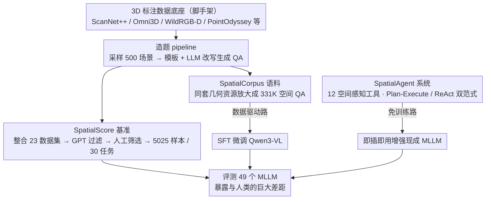

# SpatialScore: Towards Comprehensive Evaluation for Spatial Intelligence

**会议**: CVPR 2026 Highlight  
**arXiv**: [2505.17012](https://arxiv.org/abs/2505.17012)  
**代码**: [https://github.com/haoningwu3639/SpatialScore/](https://github.com/haoningwu3639/SpatialScore/)  
**领域**: 多模态VLM  
**关键词**: 空间智能, 多模态评测, 空间推理, Agent系统, 空间语料库

## 一句话总结
本文提出了目前最全面的多模态空间智能基准 SpatialScore（5K样本/30任务），并通过数据驱动的 SpatialCorpus（331K QA）微调方案和免训练的 SpatialAgent（12个工具）两条互补路径来提升 MLLM 的空间理解能力。

## 研究背景与动机
1. **领域现状**：多模态大语言模型（MLLM）在语义问答、数学推理等任务上表现优异，但在空间智能方面的评估仍然碎片化且范围有限。
2. **现有痛点**：现有空间基准存在两大问题——（i）任务过于简单，主要关注粗粒度的空间关系（如物体存在/位置），忽视了严格的视觉几何感知（如相机位姿、动态感知）；（ii）评估范围窄，仅依赖简单的判断题、单模态输入或单一技能，无法全面衡量空间智能。
3. **核心矛盾**：传统计算机视觉已有成熟的几何优化工具和数学基础，但这些进展仍停留在纯视觉范式内，缺乏与语言的紧密集成和统一评估协议。
4. **本文目标**：（i）构建最全面的空间智能基准；（ii）广泛评估49个代表性MLLM；（iii）通过数据驱动和Agent两条路径提升空间推理能力。
5. **切入角度**：将语义理解和空间感知的融合视为下一个前沿，系统性地研究现有MLLM在何种程度上具备空间智能。
6. **核心idea**：提出覆盖30个任务的综合基准，配合大规模训练语料和多工具Agent系统，从评估和增强两个维度推动空间智能发展。

## 方法详解

### 整体框架
这篇论文想回答一个问题：现在的多模态大模型到底有多懂空间？为此它一口气端出三件互相咬合的东西。先是 SpatialScore 这把"尺子"——5025 个人工验证过的样本，横跨真实/仿真/AIGC 三种数据来源、图像与视频两种模态、判断/选择/开放三类问答格式，把空间智能拆成 10 大类 30 个具体任务来量。光有尺子不够，论文又给出两条把模型"撑高"的路：一条是数据驱动的 SpatialCorpus，331K 条空间 QA 拿去微调；另一条是免训练的 SpatialAgent，用 12 个空间感知工具临时给现有模型"搭脚手架"。值得注意的是，SpatialScore 基准和 SpatialCorpus 语料共享同一套 3D 标注数据底座与造题 pipeline，所以训练分布和评测口径天然对齐；两条增强路（语料微调、Agent 免训练）最终都回到 SpatialScore 上复评，三者合起来构成一个"评估—增强"的闭环。

### 关键设计

**1. SpatialScore 基准：用真 3D 标注造题，把空间智能量全**

旧基准的毛病是题太浅、面太窄——大多只问"物体在不在、在左还是在右"这种粗粒度关系，碰不到相机位姿、动态感知这类需要严格几何的硬骨头。SpatialScore 的造题思路是直接吃 3D 数据的红利：从 ScanNet++、Omni3D 等带精确 3D 标注的数据集里随机采 500 个场景，靠真实几何标注自动生成开放式 QA，再用 LLM 把问法改写一遍增加语言多样性；同时把 23 个现有数据集里跟空间相关的样本也整合进来。最后经 GPT 过滤加 5 位志愿者人工筛选，留下 5025 个高质量样本。这样既保住了自建题的几何严谨，又借现有数据集铺开了任务覆盖面，回避了"要么太简单、要么太窄"的两难。

**2. SpatialCorpus 训练语料：评测之外，补一条能真正提升能力的数据路**

只拿尺子量、不给模型练，差距永远还在。SpatialCorpus 的做法是把造题那套几何资源放大成训练规模：用 2D 模拟器配合 ScanNet++、WildRGB-D、Omni3D、PointOdyssey 等已有 3D 标注，批量生成 331K 条多模态空间 QA，直接拿来对 Qwen3-VL 这类模型做有监督微调。它和基准共享同一套 3D 数据底座，所以训练分布和评测口径是对齐的，微调后在空间推理任务上的提升因此来得实在，而不是刷题式过拟合。

**3. SpatialAgent 多 Agent 系统：不动模型权重，靠工具临时补上几何短板**

微调虽好但要算力和数据成本，SpatialAgent 走的是即插即用的另一条路：不训练任何东西，而是给现有 MLLM 配 12 个专业空间感知工具——深度估计器、相机位姿估计器、运动估计器等——让模型把自己算不准的几何量外包出去。工具怎么调由两种推理范式编排：Plan-Execute 先把任务层次化拆成子任务再顺序调工具，适合流程清晰的题；ReAct 则让推理与行动交错、迭代式地反复调工具，适合需要边看边想的题。两条范式按题型动态切换，于是不碰权重也能把空间理解顶上去，正好和 SpatialCorpus 的"重训练但更彻底"形成互补。

### 损失函数 / 训练策略
SpatialCorpus 微调采用标准的有监督微调范式；SpatialAgent 为免训练方案，不涉及额外的损失函数设计。

## 实验关键数据

### 主实验

| 模型 | Overall | Mental Anim. | Counting | Depth Est. | Obj-Dist | Camera |
|------|---------|-------------|----------|------------|----------|--------|
| Human | 86.60 | 96.87 | 89.72 | 82.33 | 78.96 | 86.89 |
| GPT-5 (Text-only) | 30.62 | 18.79 | 20.34 | 29.36 | 24.20 | 32.01 |
| Qwen3-VL-2B | 41.41 | 35.35 | 52.74 | 34.64 | 35.42 | 30.59 |
| InternVL3-1B | 33.03 | 26.85 | 47.69 | 24.74 | 24.02 | 25.71 |

### 消融实验

| 配置 | 关键指标 | 说明 |
|------|---------|------|
| Qwen3-VL + SpatialCorpus | Overall 显著提升 | 数据驱动微调有效 |
| SpatialAgent (Plan-Execute) | 显著优于基础模型 | 免训练范式可行 |
| SpatialAgent (ReAct) | 与Plan-Execute互补 | 适合需要迭代推理的场景 |

### 关键发现
- 即使最强的现有模型在SpatialScore上也远未达到人类水平（86.60 vs 最高约50+），说明空间智能仍是巨大挑战。
- 纯文本GPT-5的表现接近随机水平（30.62 vs 28.29），证实了视觉信息对空间推理的必要性。
- SpatialCorpus微调和SpatialAgent都能显著提升性能，两者互补。
- 相机位姿/运动类任务最具挑战性，模型与人类差距最大。

## 亮点与洞察
- **评测规模前所未有**：30个任务、5025个样本、49个模型的系统评估，为空间智能研究提供了坚实基础。
- **双路径提升策略**：数据驱动和Agent免训练方案互补，可根据场景灵活选择。
- **3D数据重用pipeline**：将3D标注转化为QA格式的流程可迁移到其他领域。

## 局限与展望
- 基准仍以静态评测为主，缺乏交互式空间推理的评估。
- Agent系统依赖外部工具的准确性，工具失败会级联影响结果。
- 未来可扩展到具身AI和自主导航的实际场景评测。

## 相关工作与启发
- **vs VSI-Bench/STI-Bench**: 这些基准仅覆盖少量任务和格式，SpatialScore在规模和多样性上全面超越。
- **vs OmniSpatial**: 虽然任务数量多（50个），但样本量小（1533个），SpatialScore在质量和平衡性上更优。

## 评分
- 新颖性: ⭐⭐⭐⭐ 系统性整合+新构建的评测基准，贡献巨大但核心技术创新有限
- 实验充分度: ⭐⭐⭐⭐⭐ 49个模型评测+人类基线+多条提升路径验证
- 写作质量: ⭐⭐⭐⭐⭐ 结构清晰，数据翔实
- 价值: ⭐⭐⭐⭐⭐ 空间智能领域的重要基础设施工作

<!-- RELATED:START -->

## 相关论文

- [\[CVPR 2026\] Is your VLM Sky-Ready? A Comprehensive Spatial Intelligence Benchmark for UAV Navigation](is_your_vlm_sky-ready_a_comprehensive_spatial_intelligence_benchmark_for_uav_nav.md)
- [\[CVPR 2026\] Scaling Spatial Intelligence with Multimodal Foundation Models](scaling_spatial_intelligence_with_multimodal_foundation_models.md)
- [\[ICML 2026\] ReVSI: Rebuilding Visual Spatial Intelligence Evaluation for Accurate Assessment of VLM 3D Reasoning](../../ICML2026/multimodal_vlm/revsi_rebuilding_visual_spatial_intelligence_evaluation_for_accurate_assessment_.md)
- [\[CVPR 2026\] SpatialTree: How Spatial Intelligence Branches Out in MLLMs](spatialtree_how_spatial_intelligence_branches_out_in_mllms.md)
- [\[CVPR 2026\] Abstract 3D Perception for Spatial Intelligence in Vision-Language Models](abstract_3d_perception_for_spatial_intelligence_in_vision-language_models.md)

<!-- RELATED:END -->
