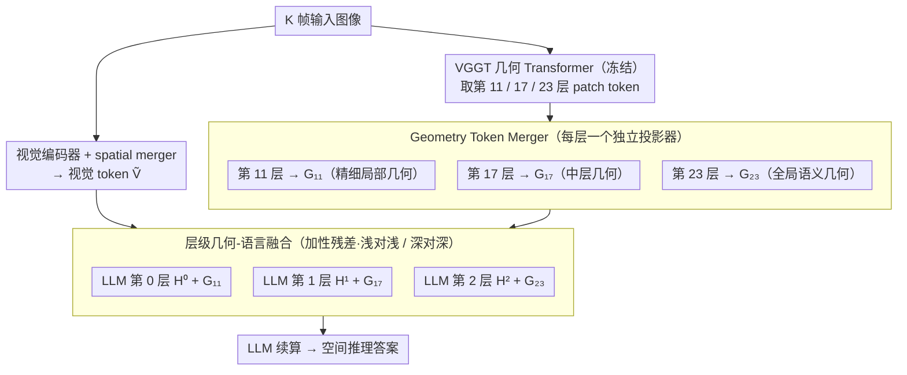

# SpatialStack: Layered Geometry-Language Fusion for 3D VLM Spatial Reasoning

**会议**: CVPR2026  
**arXiv**: [2603.27437](https://arxiv.org/abs/2603.27437)  
**代码**: [https://spatial-stack.github.io/](https://spatial-stack.github.io/)  
**领域**: 多模态VLM  
**关键词**: 3D空间推理, 几何-语言融合, 层级特征融合, VLM, VGGT

## 一句话总结
提出SpatialStack框架，将多视图几何编码器（VGGT）的多层级几何特征逐层注入LLM解码器的不同层（而非仅融合最后一层），通过浅层→细粒度空间感知、深层→高层语义推理的层级对齐，在多个3D空间推理基准上达到开源SOTA。

## 研究背景与动机
大型视觉语言模型（VLM）在3D空间推理方面仍有明显短板——无法可靠地编码3D几何结构和空间关系。现有方法如Spatial-MLLM、VG-LLM、VLM-3R虽然将端到端几何编码器（DUST3R/VGGT等）集成到VLM中，但**仅融合几何编码器最后一层的特征**与视觉编码器特征。

**核心矛盾**：几何编码器（如VGGT）采用DPT架构，从不同Transformer层显式提取多层级表示来恢复详细几何信息。仅取最后一层会丢弃中间层的丰富层级几何线索——浅层保留尖锐的局部结构和几何边界，深层产生过度同质化的激活。实验验证了这一发现：注入浅层几何特征有利于低级感知任务（深度估计、距离比较），注入深层特征有利于高级推理任务（跨视图关系推理）。

**关键发现**：简单将多层几何特征拼接后注入视觉通路（naive multi-layer fusion）反而导致**特征干扰而非协同**，性能不如单层融合。这揭示了真正的挑战在于**融合策略**，而非仅提取多层级特征。

**切入角度**：将几何特征的融合从视觉编码器端转移到LLM解码器端，通过层级对齐实现浅层几何→LLM浅层、深层几何→LLM深层的渐进式融合。

## 方法详解

### 整体框架

SpatialStack 想解决的是：VLM 看不懂 3D 几何，而现有做法只把几何编码器的最后一层特征塞进视觉通路，白白丢掉了中间层的层级几何线索。它的整体思路是把几何编码器（VGGT，全程冻结）多个不同深度的输出各自对齐后，以加性残差的方式分别注入 LLM 解码器的不同深度——浅层几何配 LLM 浅层、深层几何配 LLM 深层。

一次前向是这样转的：K 帧输入图像先过视觉编码器，经 spatial merger 压成视觉 token $\tilde{\mathbf{V}}$；同一组图像再过 VGGT 几何 Transformer，从第 11/17/23 层各取一份 patch token；这三份几何特征经各自独立的投影器（Geometry Token Merger）对齐到语言空间后，被加到 LLM 解码器第 0/1/2 层的 hidden state 上；最后 LLM 处理这条融合后的多模态序列，吐出答案。整个改动只发生在"几何特征往哪注、怎么注"这一处，主干模型不动。

### 关键设计

**1. 层级几何-语言融合：让浅层几何对浅层 LLM、深层几何对深层 LLM**

痛点很直接——VGGT 用 DPT 架构，本就靠不同 Transformer 层显式恢复不同粒度的几何：浅层留住尖锐的局部结构和边界，深层给出趋于同质的全局语义。只取最后一层，等于把浅层那份精细几何整个扔掉。SpatialStack 的做法是从第 $l_i \in \{11, 17, 23\}$ 层各抽一份 patch token $\mathbf{Z}_{l_i} \in \mathbb{R}^{(KN) \times D_{\text{geo}}}$，经层特定的 merger 投影到语言维度，再加性注入对应的 LLM 层：

$$\mathbf{G}_{l_i} = \mathcal{M}_{\text{geo}}^{(l_i)}(\mathbf{Z}_{l_i}), \qquad \mathbf{H}^{(j)'} = \mathbf{H}^{(j)} + \mathbf{G}_{l_j}, \quad j \in \{0, 1, 2\}$$

之所以要"浅对浅、深对深"，是因为 LLM 解码器自己也是浅层管底层感知、深层管高层推理——把精细几何喂给 LLM 浅层去做深度估计、距离比较，把全局几何喂给深层去做跨视图关系推理，两边的层级功能正好咬合。这也是论文最核心的 insight：决定性能的是"从哪里融合"，而不是"融了几层特征"。消融里把多层几何一股脑拼进视觉通路（naive multi-layer）反而互相干扰，还不如只融单层。

**2. Geometry Token Merger：每个注入层配一个独立投影器，避免跨层级特征打架**

几何特征和 LLM hidden state 在空间分辨率、嵌入维度上都对不上，不能直接相加。每个注入层因此各带一个独立投影器 $\mathcal{M}_{\text{geo}}^{(l_i)}$，仿照视觉编码器的 spatial merger，把相邻 2×2 patch 分组后投影压缩，输出 $\mathbf{G}_{l_i} \in \mathbb{R}^{N' \times D_{\text{lang}}}$。关键在"层独立"——第 11 层那份精细几何和第 23 层那份语义几何抽象程度差很远，若共用一个投影器会被强行揉成同一种表示，这正是 naive 融合产生特征干扰的根源；各管各的投影才能让每一层几何保留自己的性格再进 LLM。

**3. 冻结编码器、只调 merger 与 LLM：让空间先验靠统一指令微调自然涌现**

训练时把视觉编码器和 VGGT 几何编码器全部冻结，只训 geometry token merger 和 LLM 解码器，优化目标就是一个标准 next-token 交叉熵，不加任何辅助损失。这样做一是省算力、不动两个已经训好的大编码器；二是验证了一个更强的主张——不需要专门的空间自监督目标（对比 Cambrian-S 额外引入的自监督空间学习），只要把层级几何接好、跑普通指令微调，空间推理能力就能长出来。

### 损失函数 / 训练策略
- 损失：标准交叉熵 $\mathcal{L}_{\text{ce}} = -\sum_{i=1}^{|o|} \log P_\theta(o^{(i)} | o^{(<i)}, q, \mathcal{C})$
- 基座模型：Qwen2.5-VL / Qwen3.5（⚠️ 模型名以原文为准），几何编码器 VGGT
- Batch size 64，学习率 $1 \times 10^{-5}$，AdamW，warmup ratio 0.03，cosine schedule
- 训练数据：SPAR、LLaVA-Hound、ScanNet、VSI-590K 子集

## 实验关键数据

### 主实验（VSI-Bench）

| 方法 | 排名 | 平均 | Obj.Count | Abs.Dist | Rel.Dist | Rel.Dir | Route Plan | Appr.Order |
|------|------|------|-----------|----------|----------|---------|------------|------------|
| GPT-4o | - | 34.0 | 46.2 | 5.3 | 37.0 | 41.3 | 31.5 | 28.5 |
| Gemini-2.5 Pro | - | 51.5 | 43.8 | 34.9 | 61.1 | 47.8 | 45.9 | 71.3 |
| SpatialStack-4B (Qwen2.5) | 2 | 60.9 | 69.2 | 45.4 | 57.9 | 68.4 | 40.2 | 79.6 |
| **SpatialStack-5B (Qwen3.5)** | **1** | **67.5** | 71.0 | **55.6** | **67.3** | **84.1** | 41.2 | **83.5** |
| Cambrian-S-3B | 3 | 57.3 | 70.7 | 40.6 | 64.8 | 61.9 | 27.3 | 78.8 |
| VG-LLM-4B | 5 | 47.3 | 66.0 | 37.8 | 44.6 | 45.6 | 33.5 | 36.4 |

### 跨基准对比

| 方法 | VSI-Bench | SPAR-Bench | BLINK-Spatial | CV-Bench | Overall |
|------|-----------|------------|---------------|----------|---------|
| Qwen3.5 (fine-tuned) | 64.76 | 68.75 | **56.10** | 84.49 | 68.52 |
| GVF-L23 (VG-LLM) | 66.36 | 70.83 | 51.91 | 84.64 | 68.43 |
| GVF-L11/17/23 (naive multi) | 65.15 | 71.20 | 51.28 | 84.33 | 67.99 |
| **SpatialStack** | **67.52** | **71.39** | 52.12 | **85.53** | **69.14** |

### 消融实验

| 配置 | 低级任务 Avg | 高级任务 Avg | 说明 |
|------|-------------|-------------|------|
| 单层注入 L11 | **66.11** | 64.48 | 浅层最利于低级感知 |
| 单层注入 L23 | 64.33 | **66.36** | 深层最利于高级推理 |
| Naive多层融合(视觉端) | 64.69 | 65.15 | 特征干扰，两头不讨好 |
| SpatialStack (LLM端层级融合) | 65.89* | 67.52 | 兼顾两类任务 |

### 融合顺序消融

| 方法 | VSI-Bench | SPAR-Bench | BLINK-Spatial | CV-Bench | Overall |
|------|-----------|------------|---------------|----------|---------|
| SpatialStack (正序) | **67.52** | 71.39 | 52.12 | **85.53** | **69.14** |
| SpatialStack (反序) | 67.22 | **71.97** | 50.08 | 84.82 | 68.52 |
| Vision Fusion | 64.27 | 69.68 | **56.45** | 83.11 | 68.38 |

### 关键发现
- **层级对应关系**：VGGT浅层→精细局部几何，深层→全局语义结构；这与LLM解码器的层级功能天然对应
- **Naive多层融合失败**：将多层几何特征混合注入视觉通路导致特征干扰，不如单层融合（这是本文的核心motivation）
- **SpatialStack显著优于同base model方法**：在Qwen2.5上，SpatialStack-4B (60.9) vs VG-LLM-4B (47.3) vs Cambrian-S-3B (57.3)
- 融合顺序matters：正序（shallow-to-shallow）优于反序，验证了层级对齐假设
- 通用能力不退化：在MMBench、Video-MME上与base model持平，无灾难性遗忘
- **Route Planning零样本泛化**：训练数据中无路径规划数据，但SpatialStack-5B在该任务上仍达84.1（超越所有开源模型），展示强零样本迁移

## 亮点与洞察
- **"从哪里融合"比"融合什么"更重要**：论文系统性地论证了将几何特征从视觉编码器端迁移到LLM解码器端的必要性，这一发现对多模态模型的架构设计有普遍指导意义
- **层级对应性的实证分析**：通过定性（相似度热图）和定量（低/高级任务性能）双重验证，建立了几何编码器层-LLM解码器层的最优对应关系
- **加性残差注入的简洁性**：融合方式仅为 $H' = H + G$，无需cross-attention或门控机制，极度简洁且有效
- **模型无关框架**：SpatialStack可应用于任意开源VLM（论文在Qwen2.5和Qwen3.5上均验证），具有很好的通用性
- **DeepStack启发**：将DeepStack在视觉token层级堆叠LLM的思路迁移到几何token，是一种elegant的cross-pollination

## 局限与展望
- BLINK-Spatial上SpatialStack不如base model Qwen3.5（52.12 vs 56.10），几何注入在某些细粒度视觉感知上可能引入干扰
- 仅选择了3个VGGT层（11/17/23），更细粒度的层选择策略（如可学习门控）未探索
- 当前仅验证了VGGT作为几何编码器，对DUST3R/CUT3R等其他几何编码器的兼容性未测试
- 加性残差可能不是最优融合方式——自适应权重或cross-attention融合可能进一步提升
- 训练数据来自室内场景为主，室外/动态场景的泛化性有待验证

## 相关工作与启发
- **vs VG-LLM**：VG-LLM仅融合VGGT最后一层到视觉端，SpatialStack通过层级LLM端融合在VSI-Bench上从47.3提升到60.9（同base model）
- **vs Cambrian-S**：Cambrian-S额外引入自监督空间学习，SpatialStack通过架构创新无需额外训练范式即可超越（60.9 vs 57.3）
- **vs DeepStack**：SpatialStack将DeepStack的视觉token堆叠思路扩展到几何token，是一种自然的推广
- **vs Spatial-MLLM**：双编码器架构但仅做单层融合，SpatialStack的层级融合带来显著提升

## 评分
- 新颖性: ⭐⭐⭐⭐ 层级几何-语言融合是首创，核心insight（从哪里融合比融合什么更重要）有深度
- 实验充分度: ⭐⭐⭐⭐⭐ 4个空间推理基准+通用能力测试+多维度消融（层选择、融合顺序、视觉vs语言端融合）
- 写作质量: ⭐⭐⭐⭐⭐ 从定性分析→定量验证→方法设计→实验验证的逻辑链非常完整流畅
- 价值: ⭐⭐⭐⭐ 建立了视觉-语言-几何融合的新范式，对3D空间推理及更广泛的模态融合有重要参考价值

<!-- RELATED:START -->

## 相关论文

- [\[ICML 2026\] ReVSI: Rebuilding Visual Spatial Intelligence Evaluation for Accurate Assessment of VLM 3D Reasoning](../../ICML2026/multimodal_vlm/revsi_rebuilding_visual_spatial_intelligence_evaluation_for_accurate_assessment_.md)
- [\[ICML 2026\] R$^3$L: Reasoning 3D Layouts from Relative Spatial Relations](../../ICML2026/multimodal_vlm/r3l_reasoning_3d_layouts_from_relative_spatial_relations.md)
- [\[NeurIPS 2025\] Learning from Videos for 3D World: Enhancing MLLMs with 3D Vision Geometry Priors](../../NeurIPS2025/multimodal_vlm/learning_from_videos_for_3d_world_enhancing_mllms_with_3d_vision_geometry_priors.md)
- [\[CVPR 2026\] HiSpatial: Taming Hierarchical 3D Spatial Understanding in Vision-Language Models](hispatial_taming_hierarchical_3d_spatial_understanding_in_vision-language_models.md)
- [\[CVPR 2026\] Continual Learning with Vision-Language Models via Semantic-Geometry Preservation](continual_learning_with_vision-language_models_via_semantic-geometry_preservatio.md)

<!-- RELATED:END -->
