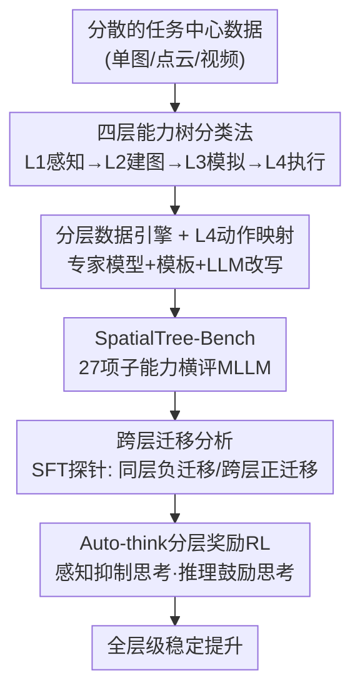

# SpatialTree: How Spatial Intelligence Branches Out in MLLMs

**会议**: CVPR 2026  
**论文**: [CVF Open Access](https://openaccess.thecvf.com/content/CVPR2026/html/Xiao_SpatialTree_How_Spatial_Intelligence_Branches_Out_in_MLLMs_CVPR_2026_paper.html)  
**代码**: 无  
**领域**: 多模态VLM  
**关键词**: 空间智能, 能力分层, 评测基准, 跨层迁移, auto-think RL

## 一句话总结
受认知科学启发，把多模态大模型（MLLM）的空间智能拆成"感知→建图→模拟→执行"四层 27 项原子能力，建成首个"以能力为中心"的分层基准 SpatialTree-Bench，并用 SFT/RL 干预实验揭示：低层能力彼此独立但能向高层强迁移，且过度"思考"会损害直觉感知——为此提出 auto-think 策略让 RL 在全层级稳定提升。

## 研究背景与动机
**领域现状**：MLLM 的空间智能（感知、理解、推理、与 3D 空间交互）是一系列下游能力的基石。现有评测沿"任务中心"路线展开：早期做单图内的相对位置/尺寸估计，后来扩到点云的 grounding/检测/captioning，再到多视角与视频的时空推理。

**现有痛点**：这些任务中心的 benchmark 是**碎片化**的——把空间能力当成一堆孤立或重叠的技能各测各的，既看不出能力之间的**内在结构**，也无法回答"哪些能力是原子的、它们如何涌现、如何相互依赖、如何迁移"。换句话说，我们有一堆分数，却不知道空间智能这棵"树"长什么样。

**核心矛盾**：任务定义五花八门、互相交叉，导致无法把"复杂任务的好坏"归因到"底层缺了哪种基础能力"。要做出可控、可扩展的空间智能，就需要一套**统一、分层、可解释**的能力坐标系，而不是又一个任务清单。

**本文目标**：(1) 给空间能力建立一个紧凑的原子能力集合与层级结构；(2) 据此建一个覆盖全层级的基准；(3) 用训练干预（SFT/RL）实证能力之间的依赖与迁移规律；(4) 找到能在全层级稳定提升的训练范式。

**切入角度**：作者借认知科学的经典洞见——智能是"经由若干发展阶段逐级搭建起来的动态结构"（Piaget 的发展阶段、Tolman 的认知地图、Kuipers 的分层空间表示）——主张从"任务中心"转向"能力中心"。

**核心 idea**：把空间智能组织成一棵**四层能力树**（L1 感知 → L2 心智建图 → L3 心智模拟 → L4 空间智能体），用它当统一坐标系来构建基准、归因能力、并指导如何分阶段地把空间智能"长大"。

## 方法详解

### 整体框架
SpatialTree 不是一个新模型，而是一套"分类法 + 基准 + 分析方法论"。整条工作流是：先定义一棵植根于基础多模态能力（L0）的**四层能力树**（L1→L4，共 27 项子能力）；再为每一层造一个**专用数据引擎**（Spatial Engine 整合一批专家模型 + 模板 + LLM 改写），把分散的旧数据重组到这棵树上，并补造稀缺能力（尤其是 L4 智能体数据），形成 SpatialTree-Bench；然后在该基准上横评主流 MLLM，用 Pearson 相关性看能力间的依赖结构；最后用 **SFT 探针**和 **RL（GRPO）** 做训练干预，验证跨层迁移并提出 **auto-think** 奖励机制。

### 关键设计

**1. 四层能力树：把空间智能从"任务清单"重构成"能力坐标系"**

针对"任务碎片化、看不出结构"的痛点，作者把空间能力组织成自下而上的四层，每层强调不同的认知侧重：

- **L1 感知（Perception）**：不依赖语言的原生空间感知，分 5 类——Geometry（距离/尺寸/形状）、Motion（自我运动 ego / 外物运动 allo）、Orientation（重力方向 / 物体姿态）、Relation（拓扑关系如 inside/outside、跨视角 Correspondence）、Localization（检测 / grounding）。
- **L2 心智建图（Mental Mapping）**：把感知**对齐到语言**，含 Understanding（空间 captioning、语义关系、perspective taking、affordance）和 Memory（把多帧/多视角观测综合成 Cognitive Map，再做 Memory Retrieval）。
- **L3 心智模拟（Mental Simulation）**：在心里"跑一遍"，分 Causal Reasoning（几何/动力学/语义关系的因果链）和 Sequential Planning（把因果洞见转成分步语言计划与抽象路径），天然对应 CoT。
- **L4 空间智能体（Agentic Competence）**：把内部计划落成对环境的真实交互动作（游戏控制、机械臂操作、导航 affordance），以语言为唯一接口连接环境。

关键不只是"分了四层"，而是这棵树给出了**可归因的结构假设**：高层能力应当依赖低层能力。后面所有分析都是在检验/利用这个假设。

**2. 分层数据引擎与 L4 动作映射：把稀缺的"智能体能力"也塞进基准**

光有分类法不够，得有数据填进 27 个格子。作者为每层造一个数据引擎（图 3）：L1 用一批专家感知模型（DepthAnything3、SpatialTracker、GeoCalib、OrientAnything 等）抽出深度/对应/跟踪/重力等中间表示，再用 QA 模板 + LLM 改写成题；L2 用 3D 重建管线从视频生成 BEV/认知地图再 caption 成题；L3 在已标注推理 QA 上套"思考模板"，让 LLM 改写器补出显式 CoT。

最硬的是 **L4**——以往 benchmark 几乎没有"智能体交互"数据。作者跨三类具身（游戏角色导航、机械臂夹爪、人手）采网络视频，关键设计是**动作映射策略**：把各具身五花八门的低层动作**离散化成统一的"高层运动基元 / 键鼠动作序列"**（如 `[Move Down, 7cm]`、`[Gripper Close, True]`、`[Roll CCW, 20°]`），形成 MLLM 可输出的可执行动作空间；人–物交互序列再经人工标注重排成多步选择题。由此补出 SpatialPlus 新数据集，重点覆盖 L1 朝向/形状、L2 空间 caption、以及最缺的 L4。

**3. 跨能力迁移探针：用 SFT 实证"同层互斥、跨层增益、多能力协同"**

有了基准，作者不止横评，还做训练干预来验证层级假设。先用 Pearson 相关性发现：**L1 能力彼此弱相关（近乎正交、独立）**，而 **L3/L4 高层能力强相关**（说明复杂任务共享底层子技能）。据此挑出与高层最相关的三项 L1 能力（距离 Geo.Dist、尺寸 Geo.Size、对应 Relat.Corr）做单能力 SFT（各约 0.25M QA，按 1:3 混入通用指令数据）。

两个反直觉发现：**Finding 1（跨层迁移）**——单项 L1 SFT 在**同层**往往零增益甚至明显掉点（如 B+Dist. 让 Geometry +3.2 却让 Relation −5.8、Local. −4.6），但对**高层**有非平凡提升（Understanding +2.0、Goal Exec. +3.4）；距离能力还能零样本迁移到 in-the-wild 复杂推理（+36.0%）和机械臂操作（+27.1%）。**Finding 2（多能力协同）**——任一单能力 SFT 整体几乎无益甚至略降，但三者**混合训练**整体 +1.1，超过任一单项、甚至超过三者单独贡献之和；连单训时掉点的 L1.Motion（最好也只 −2.0）在混训下反转为 +0.7。这把"低层是高层的垫脚石、且需联合训练才解锁协同"讲实了。

**4. Auto-think 分层奖励：让 RL 别在"该快"的任务上过度思考**

最后用 GRPO（RLVR）想把空间能力整体推高，却撞上一个关键矛盾：**朴素 RL 鼓励"广泛思考"是不可靠的**——它帮到复杂推理，却**损害直觉感知**（如数值估计，over-thinking 反而降精度），单层 RL 还会过拟合到该层奖励、难以泛化。

作者的假设是：不同层级需要不同"认知模式"。于是提出 **Hierarchy-Aware Reward（即 auto-think）**：对**直觉感知**类（深度估计、计数、朝向）**去掉"思考过程"奖励并加长度惩罚**，逼模型走"快系统"的直接视觉–文本对齐；对**复杂推理**类（导航规划、因果推理）**保留并放大推理步奖励**，鼓励多花 token 计算。实测 Full RL@auto-think 在整张 SpatialTree-Bench 上同时超过 baseline 与朴素 GRPO（如 Qwen2.5-VL-7B 平均 27.5→30.8），且训练/测试严格去污染、训练只优化离散 MCQ 奖励而测试用连续/语义指标，说明提升来自内化的泛化策略而非记忆。这一结果反过来**验证了分类法本身**：空间智能不是扁平任务集，而是"底层要直接对齐、高层要刻意推理"的结构化层级。

## 实验关键数据

### 主实验（SpatialTree-Bench 横评，Avg 为加权平均）

| 模型 | 类别 | Rank | Avg. | L1 Geom. | L4 Goal Exec. |
|------|------|------|------|----------|---------------|
| Gemini3-Flash | Thinking | 1 | **57.8** | 50.1 | 31.6 |
| Gemini3-Pro | Thinking | 2 | 56.5 | 54.5 | 29.9 |
| Seed1.8 | Thinking | 3 | 50.3 | 42.5 | 26.0 |
| Gemini2.5-Pro | Thinking | 4 | 50.1 | 47.8 | 28.3 |
| Qwen3VL-235B | Open-source | 8 | 40.0 | 33.9 | 28.8 |
| GPT-4o | Non-Thinking | 13 | 31.9 | 23.9 | 25.8 |
| Kimi-VL-A3B | Open-source | 20 | 24.4 | 13.8 | 15.7 |

关键现象：即便最强的 Gemini3-Flash 也只有 57.8，而 **L4 Goal Exec. 全员低迷**（最高仅 31.6），说明"把计划落成真实交互动作"是当前 MLLM 的共同短板；开源最强 Qwen3VL-235B（40.0）与闭源头部仍有明显差距。

### SFT 跨能力迁移（Tab. 2，括号内为相对 Baseline 变化）

| 配置 | Avg. | L1 Geom. | L1 Rel. | L2 Underst. | L4 Goal Exec. |
|------|------|----------|---------|-------------|----------------|
| Baseline | 25.0 | 20.9 | 28.9 | 22.6 | 22.1 |
| B+Dist. | 24.5 | 24.1 (+3.2) | 23.2 (−5.8) | 24.6 (+2.0) | 25.5 (+3.4) |
| B+Size | 23.5 | 24.3 (−3.4)⚠️ | 21.4 (−7.5) | 21.9 (−0.8) | 21.5 (−0.6) |
| B+Corr. | 25.2 | 17.6 (−3.2) | 30.2 (+1.3) | 21.9 (−0.7) | 24.7 (+2.6) |
| **B+Dist.+Size+Corr.** | **26.1** | 25.5 (+4.6) | 29.4 (+0.5) | 23.0 (+0.4) | 26.0 (+3.9) |

> ⚠️ 表中 B+Size 行 Geom. 标注为"24.3 (−3.4)"，数值升、括号却为负，疑为原文配色/标注笔误，**以原文为准**。结论不受影响：单能力 SFT 同层常掉点，三者混训整体最高（+1.1）。

### RLVR 对比（Tab. 3，基座 Qwen2.5-VL-7B = 27.5）

| 配置 | Avg. | L1 Geom. | L3 Caus.Reas. | L4 Open Expl. |
|------|------|----------|----------------|----------------|
| Qwen2.5-VL-7B | 27.5 | 17.8 | 28.4 | 31.1 |
| Full RL@think | 30.1 (+2.9) | 29.7 | 33.6 | 41.7 |
| **Full RL@auto-think** | **30.8 (+3.6)** | 31.9 (+3.3) | 33.5 | 44.1 (+8.3) |

### 关键发现
- **层级依赖被实证**：L1 子能力近乎正交（弱相关），L3/L4 高层强相关——复杂任务共享底层子技能，"能力树"不是比喻而是可测结构。
- **跨层 > 同层**：单项 L1 SFT 在同层常负迁移，却能向高层强迁移（距离能力零样本迁到机械臂 +27.1%、in-the-wild 推理 +36.0%）。
- **协同效应**：三项基础能力混训整体增益超过各自之和，连单训掉点的 Motion 都被"救"回到 +0.7。
- **思考≠越多越好**：朴素 RL 鼓励思考会伤直觉感知（数值估计 over-thinking 降精度）；auto-think 按层切换"快/慢系统"才在全层级稳定提升。

## 亮点与洞察
- **从"任务中心"到"能力中心"的范式切换**：用认知科学的发展阶段论给空间智能建坐标系，让"复杂任务做不好"能归因到"缺了哪项底层原子能力"，这是 benchmark 设计上的真创新，而不是又攒一批题。
- **L4 动作映射很实用**：把游戏/机械臂/人手的异构低层动作统一离散成键鼠运动基元，让纯语言接口的 MLLM 也能被评测"智能体能力"，这个工程抽象可直接复用到具身评测。
- **auto-think 是个可迁移的训练 trick**：按任务认知层级动态决定"奖不奖励思考过程 + 要不要长度惩罚"，对任何"既有直觉子任务又有推理子任务"的混合训练都适用，提示"统一鼓励 CoT"未必最优。
- **最 aha 的一点**：训练某项低层能力，收益常常**不在本层而在高层**，而本层反而互相干扰——这颠覆了"想提升 X 就练 X"的直觉。

## 局限与展望
- 作者承认这是 **proof-of-concept**：RL 部分主要在 Qwen2.5-VL-7B 单一基座、且训练只用机械臂等少量具身数据，跨基座/跨具身的普适性还需验证。
- L4 Goal Exec. 全员极低（最高 31.6），基准对"真实交互"的可判定性、动作离散化是否丢失关键控制信息（⚠️ 离散键鼠基元 vs 连续控制的差距）值得追问。
- 数据引擎依赖一批专家模型（深度/朝向/跟踪）生成标注，标注质量与专家模型偏差会传导进基准，论文未充分量化这部分噪声。
- 迁移/协同结论基于 0.25M 规模、固定 1:3 混比的 SFT 探针，混比与数据规模的敏感性、是否在更大模型上仍成立，是自然的下一步。

## 相关工作与启发
- **vs 任务中心基准（BLINK / SpatialEval / 3DSR-Bench / VSI-Bench / MMSI-Bench / Omnispatial）**: 它们按任务形态（单图/多视角/几何谜题）切分、把空间能力当孤立技能；本文按**认知层级**统一组织成 27 项原子能力并显式建模跨层依赖，优势是可归因、可指导分阶段扩展，代价是分类法本身需要认知科学假设支撑。
- **vs VST 等空间微调方法**: 本文复用 VST 的数据混合配方造 SFT 数据，但目标不是"训一个更强的空间模型"，而是把 SFT/RL 当**探针**去测能力间的迁移结构，落点是"理解空间智能怎么长大"而非单纯刷分。
- **vs VLA（机器人低层控制）**: VLA 直接解码低层控制信号；本文 L4 坚持"以语言为唯一接口"（类 GUI Agent），把动作抽象成高层基元，定位更偏认知评测而非端到端控制。

## 评分
- 新颖性: ⭐⭐⭐⭐⭐ 用认知科学发展阶段论把空间智能重构成四层能力树，是 benchmark 设计的范式级创新。
- 实验充分度: ⭐⭐⭐⭐ 横评 20 个主流 MLLM + SFT/RL 双干预实证迁移规律，但 RL 仅单基座、L4 数据有限。
- 写作质量: ⭐⭐⭐⭐ 层级动机与发现叙述清晰，个别表格配色/正负标注疑有笔误。
- 价值: ⭐⭐⭐⭐⭐ 提供可归因的空间智能坐标系 + auto-think 训练范式，对系统性扩展 MLLM 空间能力有方法论意义。

<!-- RELATED:START -->

## 相关论文

- [\[CVPR 2026\] Scaling Spatial Intelligence with Multimodal Foundation Models](scaling_spatial_intelligence_with_multimodal_foundation_models.md)
- [\[ICLR 2026\] On the Generalization Capacities of MLLMs for Spatial Intelligence](../../ICLR2026/multimodal_vlm/on_the_generalization_capacities_of_mllms_for_spatial_intelligence.md)
- [\[CVPR 2026\] SpatialScore: Towards Comprehensive Evaluation for Spatial Intelligence](spatialscore_towards_comprehensive_evaluation_for_spatial_intelligence.md)
- [\[CVPR 2026\] Is your VLM Sky-Ready? A Comprehensive Spatial Intelligence Benchmark for UAV Navigation](is_your_vlm_sky-ready_a_comprehensive_spatial_intelligence_benchmark_for_uav_nav.md)
- [\[CVPR 2026\] Abstract 3D Perception for Spatial Intelligence in Vision-Language Models](abstract_3d_perception_for_spatial_intelligence_in_vision-language_models.md)

<!-- RELATED:END -->
