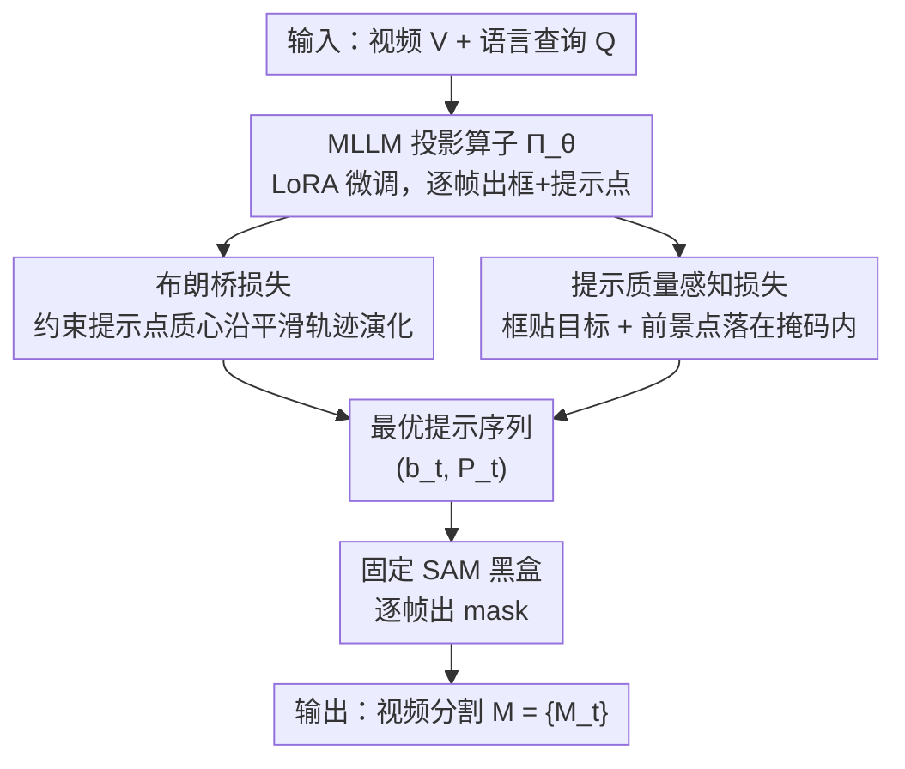

# SPOT: Spatiotemporal Prompt Optimization for Motion-Stabilized MLLM-Guided Video Segmentation

**会议**: CVPR 2026  
**论文**: [CVF Open Access](https://openaccess.thecvf.com/content/CVPR2026/html/Fan_SPOT_Spatiotemporal_Prompt_Optimization_for_Motion-Stabilized_MLLM-Guided_Video_Segmentation_CVPR_2026_paper.html)  
**代码**: 无  
**领域**: 多模态VLM / 视频分割  
**关键词**: 指代视频分割, 推理视频分割, 提示优化, 布朗桥, SAM

## 一句话总结
SPOT 不给 MLLM 做视频预训练、也不改 SAM 架构，只通过两个损失约束图像预训练 MLLM 输出的「提示点」轨迹——用布朗桥损失逼时序平滑、用提示质量损失逼空间贴合——就让级联式「MLLM 出 prompt + SAM 出 mask」的视频分割在六个 benchmark 上全面超越 SOTA。

## 研究背景与动机
**领域现状**：指代视频分割（RVOS）和推理视频分割（ReasonVOS）的主流做法，是把 MLLM 和视觉基础模型 SAM 级联起来——MLLM 解析语言+视觉语义、为每一帧吐出空间提示点（前景/背景点 + 边界框），SAM 拿着这些 prompt 做像素级分割。这套在静态图像上表现极好。

**现有痛点**：但这些 MLLM 几乎都是在「静态图文对」上预训练的，逐帧独立地生成 prompt，完全没有建模目标物体的运动轨迹。结果相邻帧的 prompt 点会突然跳变，导致 SAM 输出的 mask 在帧间出现严重的「非物理抖动」（temporal jittering），时序一致性垮掉。

**核心矛盾**：为补救，现有研究走两条路——要么在大规模视频-文本数据上微调/预训练 MLLM（吃算力、吃标注，难复用现成基础模型），要么外接复杂的时序融合模块/记忆库（系统变复杂、泛化变差）。两条路都想给 MLLM 硬塞「显式时空理解能力」，却忽略了视频本身的物理先验：物体轨迹天然遵循运动连续性，本来就是一条平滑的时空流。

**本文目标**：在不动模型架构、不做视频预训练的前提下，同时拿到分割的「时序平滑」和「空间精度」。

**切入角度**：作者提出一个关键判断——静态预训练的 MLLM 其实已经潜在具备时空推理能力，只要用物理运动约束去「规范它的输出行为」就能激活，而不必改它本身。换句话说，性能瓶颈不在基础模型架构，而在 prompt 生成阶段缺约束。

**核心 idea**：把 SAM 当成固定黑盒，问题就等价于「为每一帧找最优 prompt 序列」；于是把 MLLM 重构成一个可学习的「提示投影算子」，用时间+空间两个损失把它的输出推向最优 prompt 集 $P^*$ 的邻域。

## 方法详解

### 整体框架
SPOT 协调一个 MLLM（Qwen-VL-7B-Chat）和固定的视觉基础模型 SAM（EfficientViT-XL1-SAM）完成视频分割。给定视频序列 $V=\{I_t\}_{t=1}^T$ 和语言查询 $Q$，系统走两阶段：**提示生成阶段**——MLLM 为每帧 $I_t$ 预测一个边界框 $b_t\in\mathbb{R}^4$ 和一组前景/背景提示点 $P_t=\{(x_{t,i},y_{t,i},l_{t,i})\}_{i=1}^K$（$l_{t,i}\in\{0,1\}$ 标前景/背景，所有点都约束在 $b_t$ 内）；**掩码生成阶段**——SAM 吃 $(I_t,b_t,P_t)$ 逐帧输出 $M_t=\mathrm{SAM}(I_t,b_t,P_t)$。

关键的重构在于：SAM 是固定、不可微的黑盒，输出只取决于输入 prompt。所以学习目标 $F:(V,Q)\mapsto M$ 就等价于「找一个 prompt 序列 $\{(b_t,P_t)\}$ 使 SAM 输出逼近真值掩码」。作者把这个最优 prompt 集 $P^*$ 的两条几何性质拎出来：① **时序连续性**——相邻帧 prompt 要满足运动平滑，避免突变；② **空间局部性**——$b_t$ 覆盖目标、前景点落在真值掩码内、背景点落在外。然后把 MLLM 当作可学习投影算子 $\Pi_\theta:(I_t,Q)\mapsto(b_t,P_t)$，用 LoRA 微调（低秩参数化天然带隐式正则、抑制噪声 prompt 过拟合），靠三个损失把它的输出轨迹推向 $P^*$。MLLM 与 SAM 之间是两轮对话：第一轮出框，第二轮在框内采 $5\times5$ 网格点判前景/背景；推理时按置信度阈值过滤点再喂给 SAM，端到端出 mask，不碰真值、不做测试时优化。

### 关键设计

**1. 把 MLLM 重构成「提示投影算子」：用约束输出代替改架构**

针对「现有方法要么视频预训练、要么外接时序模块」的痛点，SPOT 换了个问题表述：既然 SAM 输出只取决于 prompt，那时序一致性的根源就在 prompt 生成，而不在基础模型。于是不动 MLLM 和 SAM 的结构，只把 MLLM 视为映射 $\Pi_\theta:(I_t,Q)\mapsto(b_t,P_t)$，目标是把它的输出推到最优 prompt 集 $P^*$ 的邻域。微调用 LoRA（冻结绝大多数原参数，低秩更新带隐式正则），并保留一个文本对齐损失防止 MLLM 丢掉语义泛化能力。这一步是全文的「地基」——它把「视频时序建模」这个看似要动架构的难题，转化成「对 MLLM 输出空间加两个约束」的优化问题，从而省掉大规模视频预训练，并保住 MLLM 的零样本泛化。

**2. 布朗桥损失：用端点约束的高斯过程逼出平滑运动轨迹**

这是时间维度的核心，专治帧间抖动。把目标中心轨迹建模成一个**布朗桥**随机过程——一个满足端点约束 $B(0)=a,\,B(T)=b$ 的高斯过程，其路径在固定端点下最小化期望 Dirichlet 能量 $\int_0^T\|\dot B(t)\|^2 dt$，物理含义是「在缺中间帧监督时，最平滑的轨迹就是速度变化最小的那条」。由于真实中心 $c_t^{\text{gt}}$ 中间帧不可观测，作者只用视频片段首尾帧的真值掩码质心当端点先验，则任意中间时刻 $t$ 的轨迹服从条件高斯 $\mathcal{N}(\mu_t,\Sigma_t)$，其中 $\mu_t=(1-\alpha_t)c_{t_0}^{\text{gt}}+\alpha_t c_{t_0+T_s-1}^{\text{gt}}$、$\Sigma_t=\sigma^2\alpha_t(1-\alpha_t)I_2$，$\alpha_t=\frac{t-t_0}{T_s-1}$ 是归一化时间。损失把所有提示点（含正负样本）拉向共享均值 $\mu_t$：

$$\mathcal{L}_{\text{BBridge}}^{[t_0,t_0+T_s-1]}=\sum_{t=t_0+1}^{t_0+T_s-2}\frac{1}{K}\sum_{k=1}^{K}\frac{\|P_{t,k}-\mu_t\|_2^2}{\max(\alpha_t(1-\alpha_t),\epsilon)}$$

巧妙之处是分母里的**方差自适应加权** $\alpha_t(1-\alpha_t)$：端点附近（$\alpha_t\to 0$ 或 $1$）方差小、权重高，强制精确定位；中间帧方差大、权重低，允许合理运动波动——这正好契合「端点有真值、中间靠平滑外推」的不确定性结构。作者还给了贝叶斯解释（Theorem 1）：最小化该损失等价于在「布朗桥先验 + 逐帧独立高斯似然」下对真实轨迹做后验均值估计，方差权重对应后验精度。⚠️ 定理与推导细节以原文为准。

**3. 提示质量感知损失：框 + 几何一致性硬监督，把 prompt 钉在目标上**

这是空间维度，对应 $P^*$ 的「空间局部性」。作者依据 SAM 的特性——对正样本点位置敏感、对负样本较宽容——把监督重心放在「正点是否落在目标内」。损失由两项组成：**边界框损失** $\mathcal{L}_{\text{bbox}}^t=\mathrm{SmoothL1}(b^t,b_{\text{gt}}^t)$ 保证粗定位；**几何一致性硬监督** $\mathcal{L}_{\text{class}}^t$ 直接对每个提示点的真值标签做二元交叉熵——把点坐标 round+clip 到像素位，查真值掩码得 $y_{t,i}^{\text{gt}}=M_{\text{gt}}^t(u_{t,i},v_{t,i})$，再用 MLLM 输出的连续 logit $z_{t,i}$ 做可微监督：

$$\mathcal{L}_{\text{class}}^t=-\sum_{i=1}^{K}\big[y_{t,i}^{\text{gt}}\log\sigma(z_{t,i})+(1-y_{t,i}^{\text{gt}})\log(1-\sigma(z_{t,i}))\big]$$

合起来 $\mathcal{L}_{\text{quality}}^t=\mathcal{L}_{\text{bbox}}^t+\mathcal{L}_{\text{class}}^t$。这里的「硬监督」指：训练时虽然 SAM 只用离散标签，但用 logit 构造可微信号，落在掩码内的点被鼓励出高前景 logit、外面的点被压制。作者论证：当正点都在掩码内、框覆盖目标时，SAM 的 IoU 随正点增多/负点远离单调非降，所以最小化 $\mathcal{L}_{\text{quality}}$ 的方向与分割性能提升对齐，相当于间接最大化 SAM 性能。

### 损失函数 / 训练策略
总损失是一个三约束优化。除上面的时间项与空间项外，再加一个标准自回归语言建模的**文本对齐损失** $\mathcal{L}_{\text{text}}^t=-\sum_j\log p_\theta(w_j\mid I_t,Q,w_{<j})$——监督 MLLM 生成结构化文本响应（含 `<box>` 坐标与点标签），保住语言理解能力。对每个采样片段 $[t_0,t_0+T_s-1]$：

$$\mathcal{L}_{\text{total}}=\sum_{t=t_0}^{t_0+T_s-1}\big(\mathcal{L}_{\text{quality}}^t+\lambda_{\text{text}}\mathcal{L}_{\text{text}}^t\big)+\lambda_{\text{bb}}\mathcal{L}_{\text{BBridge}}^{[t_0,t_0+T_s-1]}$$

语义约束保泛化、几何约束保单帧空间精度、时序约束保跨帧平滑。最优权重 $\lambda_{\text{bb}}=0.1$、$\lambda_{\text{text}}=0.5$。

## 实验关键数据

### 主实验
在 RVOS 三大数据集上，SPOT-13B 全面领先（J&F↑）：

| 数据集 | 指标 | SPOT-13B | 之前SOTA | 提升 |
|--------|------|----------|----------|------|
| Ref-YouTube-VOS | J&F | 71.8 | 69.2 (SAMWISE) | +2.6 |
| Ref-DAVIS-2017 | J&F | 77.2 | 74.9 (DTOS-9B) | +2.3 |
| MeViS | J&F | 51.2 | 49.5 (SAMWISE) | +1.7 |
| A2D-Sentences | IoU(Overall) | 82.2 (7B) | 81.1 (DsHmp) | +1.1 |
| JHMDB-Sentences | IoU(Overall) | 75.0 (7B) | 73.9 (DsHmp) | +1.1 |

在更难的 ReVOS 推理视频分割上，SPOT-13B 拿到 Overall J&F 54.8、稳定性指标 R 18.0，明显超过 VISA-13B（50.8 / 15.1），说明显式建模运动连续性既压住时序抖动又不损推理能力：

| 方法 | Referring J&F | Reasoning J&F | Overall J&F | R(稳定性) |
|------|---------------|---------------|-------------|-----------|
| VISA-7B | 51.0 | 43.2 | 47.1 | 15.3 |
| VISA-13B | 57.4 | 44.2 | 50.8 | 15.1 |
| SPOT-7B | 59.3 | 46.0 | 52.7 | 16.5 |
| SPOT-13B | 61.5 | 48.0 | 54.8 | 18.0 |

### 消融实验
在 Ref-YouTube-VOS 上（SPOT-7B，J&F 满配 70.5）：

| 配置 | J&F | 说明 |
|------|------|------|
| Full Model | 70.5 | 完整模型 |
| w/o $\mathcal{L}_{\text{BBridge}}$ | 65.2 | 去时序约束，掉 5.3% |
| w/o $\mathcal{L}_{\text{quality}}$ | 62.7 | 去空间约束，掉 7.8%（最大） |
| w/o $\mathcal{L}_{\text{text}}$ | 67.8 | 去文本对齐，中等下降 |
| MLLM + SAM 2（无 Eq.10） | 66.9 | 换 SAM 2 也不如原 SAM + 本文约束 |

布朗桥损失的设计变体消融，验证「方差自适应加权」与「建模中间帧」都必要：

| 变体 | J&F | 说明 |
|------|------|------|
| Full（自适应加权） | 70.5 | 完整 |
| 常数加权（$\lambda_t=1$） | 68.7 | 均匀权重不分帧位不确定性，掉 1.8% |
| 仅端点监督（无中间） | 67.3 | 不建模中间帧轨迹，进一步下降 |
| 无布朗桥 | 65.2 | 完全去掉 |

空间约束消融：仅 BBox 掉 2.7%、仅几何硬监督掉 2.2%，两者互补。

### 关键发现
- **空间约束贡献最大**：去 $\mathcal{L}_{\text{quality}}$ 掉 7.8%，超过去时序的 5.3%，说明「把正点钉进目标」对 SAM 是第一性的，时序平滑是锦上添花。
- **抖动来自 prompt 而非架构**：原始 SAM + 本文约束（70.5）反超「MLLM + SAM 2 流式记忆」（66.9），直接证伪「要靠 SAM 2 架构才能时序一致」的假设——这是全文最有说服力的一击。
- **方差自适应是关键 trick**：把端点高权、中间低权写进分母，比常数权重高 1.8%，对应了「端点有真值该精确、中间靠外推该宽容」的物理直觉。
- 权重敏感性：J&F 在 $\lambda_{\text{bb}}=0.1$、$\lambda_{\text{text}}=0.5$ 处取峰；$\lambda_{\text{bb}}$ 太小时序约束不足、太大则损语义推理。

## 亮点与洞察
- **把视频时序问题转成 prompt 优化问题**：核心洞察是「SAM 是固定黑盒、输出只取决于 prompt，那一致性瓶颈就在 prompt 生成」，于是绕开了改架构/视频预训练，只优化输出空间——这个 reframe 干净且可迁移到任何「冻结基础模型 + 可学习 prompt 生成器」的级联系统。
- **用布朗桥把「缺中间帧监督」变成「最小能量平滑路径」**：只要首尾两帧真值，就能给中间帧造出一个带不确定性的轨迹先验，方差自适应权重还自动平衡了定位精度与运动容忍——这套思路可迁到任何「端点已知、中段需平滑」的弱监督时序任务（轨迹预测、关键点跟踪）。
- **几何一致性硬监督的「用 logit 训、用离散标签推」**：训练时拿连续 logit 构可微 BCE、推理时只用离散点，既可微又匹配 SAM 接口，是个轻巧的实现 trick。

## 局限与展望
- **端点依赖首尾帧真值掩码**：布朗桥的两个端点先验来自片段首尾帧 GT；若首/尾帧本身定位差、或目标在端点处被遮挡，整条轨迹先验会被带偏（作者未充分讨论这种退化）。⚠️
- **质心轨迹建模偏简单**：布朗桥约束的是提示点质心沿平滑路径演化，对快速形变、分裂/合并、急转弯等非平滑运动可能过度平滑（运动连续性假设的边界）。
- **稳定性指标 R 缺明确定义**：ReVOS 上的 R（稳定性）在缓存正文里未给出计算式，跨方法比较时其口径需以原文为准。⚠️
- 改进方向：把端点先验从「硬两端」扩展到多锚点/可学习端点检测，或将布朗桥换成允许局部突变的跳跃扩散过程，以适配非平滑运动。

## 相关工作与启发
- **vs VISA / VideoLISA（视频预训练 MLLM）**：它们直接在视频-文本上微调 MLLM 塞入时序能力，吃算力吃标注；SPOT 用图像预训练 MLLM + 输出约束，省掉视频预训练，ReVOS 上 SPOT-13B(54.8) 反超 VISA-13B(50.8)，且保住零样本泛化。
- **vs SAMWISE / RefSAM（基础模型级联 prompting）**：同属「MLLM/语言 + SAM prompt」范式，但它们没显式约束 prompt 的时序轨迹；SPOT 加布朗桥损失专治帧间抖动，三个 RVOS 数据集 J&F 均反超 SAMWISE。
- **vs SAM 2（流式记忆做时序）**：SAM 2 靠架构内的 streaming memory 维持一致性；SPOT 证明原始 SAM + prompt 约束（70.5）就能超过 MLLM+SAM2（66.9），把「时序一致」从「架构能力」重新定位成「prompt 生成质量」。

## 评分
- 新颖性: ⭐⭐⭐⭐⭐ 「时序问题=prompt 优化问题」的 reframe + 布朗桥端点约束，角度新且自洽。
- 实验充分度: ⭐⭐⭐⭐ 六个 benchmark + 多组消融，但稳定性指标 R 与部分理论细节交代不够。
- 写作质量: ⭐⭐⭐⭐ 动机与方法逻辑清晰，公式完整；个别符号/定理推导略简。
- 价值: ⭐⭐⭐⭐⭐ 不动架构、不做视频预训练即提点，复用现成基础模型生态，落地友好。

<!-- RELATED:START -->

## 相关论文

- [\[CVPR 2026\] Rethinking MLLM Itself as a Segmenter with a Single Segmentation Token](rethinking_mllm_itself_as_a_segmenter_with_a_single_segmentation_token.md)
- [\[CVPR 2025\] Efficient Motion-Aware Video MLLM](../../CVPR2025/multimodal_vlm/efficient_motion-aware_video_mllm.md)
- [\[CVPR 2026\] Better, Stronger, Faster: Tackling the Trilemma in MLLM-based Segmentation with Simultaneous Textual Mask Prediction](better_stronger_faster_tackling_the_trilemma_in_mllm-based_segmentation_with_sim.md)
- [\[CVPR 2026\] ReMoRa: Multimodal Large Language Model based on Refined Motion Representation for Long-Video Understanding](remora_multimodal_large_language_model_based_on_refined_motion_representation_fo.md)
- [\[CVPR 2026\] Spot The Ball: A Benchmark for Visual Social Inference](spot_the_ball_a_benchmark_for_visual_social_inference.md)

<!-- RELATED:END -->
