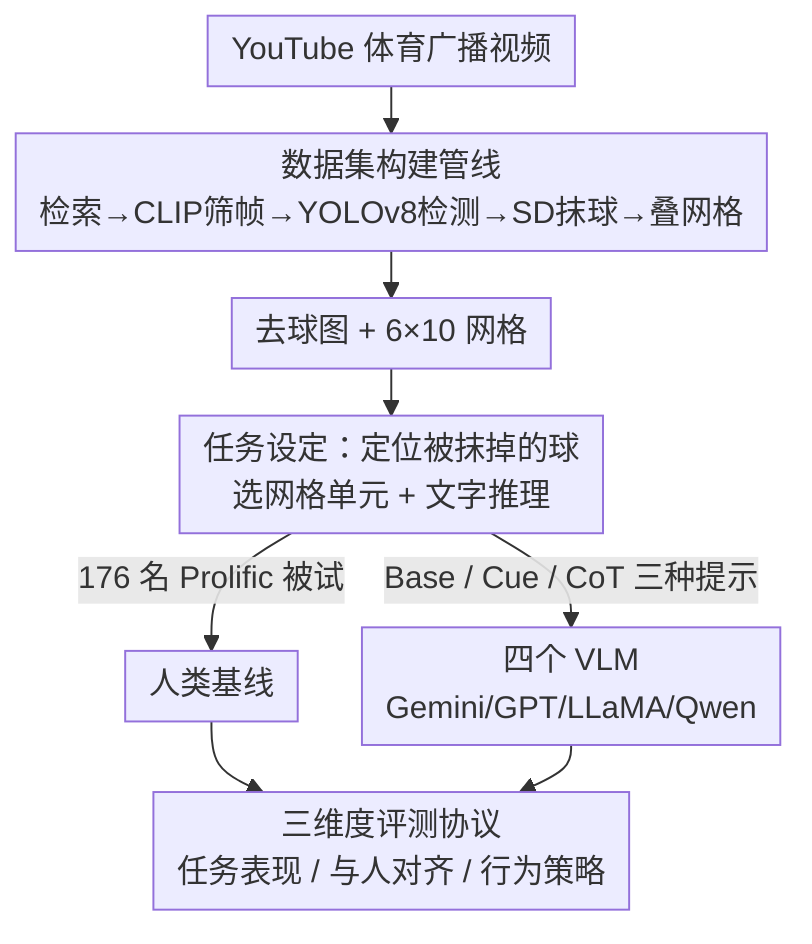

# Spot The Ball: A Benchmark for Visual Social Inference

**会议**: CVPR 2026  
**论文**: [CVF Open Access](https://openaccess.thecvf.com/content/CVPR2026/html/Balamurugan_Spot_The_Ball_A_Benchmark_for_Visual_Social_Inference_CVPR_2026_paper.html)  
**代码**: 无（原文称推理与评测代码在 GitHub、3,000 张扩展图在 HuggingFace，但未给出具体 URL，⚠️ 以原文为准）  
**领域**: 多模态VLM  
**关键词**: 视觉社会推理, VLM benchmark, 心智理论, 注视/姿态线索, 人机差距

## 一句话总结
这篇论文提出 SPOT THE BALL 基准：从「抹掉球的体育画面」里让人和 VLM 反推球的位置，发现人类靠球员的注视与姿态等社会线索推理、准确率是模型的 2–3 倍，而四个主流 VLM 只会用「猜中心 / 猜球员附近」的肤浅空间启发式，揭示出当前 VLM 在视觉社会推理上的系统性短板。

## 研究背景与动机
**领域现状**：人类擅长「视觉社会推理」——从别人的注视方向、身体姿态、朝向这些细微行为线索，去推断画面里看不见的信息，这种能力根植于心智理论（Theory of Mind）。现有的社会推理基准大多是纯文本的（ToM、共情、道德推理、谈判等），少数视觉基准要么呈现完全可见的场景，要么只关注物理遮挡这类「死物」的推断。

**现有痛点**：纯文本社会推理可能只是语言模式匹配，没有真正的感知接地（perceptual grounding）；而现有视觉基准没有一个去考察「模型能否纯靠视觉社会线索，去推断被隐藏的信息」。也就是说，没人系统评测过 VLM 在「部分可观测 + 需要读懂人的意图」这种最贴近人类日常社会推理的设定下表现如何。

**核心矛盾**：要把「社会推理」和「物理/常识推理」干净地切开很难——大多数任务里模型可以靠物体属性、世界知识蒙混过关，分不清它到底是在读懂人，还是在背规则。

**本文目标**：构造一个任务，让「答对」必须依赖于解读场景中人的心理状态（注视、姿态、注意力指向），从而隔离出纯粹的视觉社会推理能力，并量化人与 VLM 之间的差距。

**切入角度**：作者借用一个经典报纸游戏「Spot the Ball」——把体育画面里的球抹掉，让你猜球在哪。球类运动是理想试验台：球员的注视、姿势、站位与球的位置存在**因果耦合**，给出可解释的社会信号；用静态图像还能把社会推理从运动动力学中剥离出来。

**核心 idea**：用「定位被抹掉的球」当代理任务——球的位置无法从物体本身读出，只能从在场球员的意图与注意力反推，从而把视觉社会推理逼成唯一可行的解法。

## 方法详解
本文是 benchmark 论文，「方法」由两部分组成：**怎么造出这批可控的测试图像（数据集构建）**，以及**用什么指标和实验协议去拆解人/模型的差距（评测设计）**。

### 整体框架
任务定义很干净：给定一张「球已被抹掉」的体育画面，覆盖一个 $6\times10$ 的字母数字网格（行 A–F，列 1–10），人和模型都要选出球最可能所在的网格单元（如「B6」）并给出文字推理；预测与「覆盖原球位置的真值单元集合」比对，相邻单元若与球区域重叠也算对。

围绕这个任务，作者搭了两条线：一条是**可扩展的数据构建管线**（从 YouTube 视频到带网格的去球图），另一条是**三维度评测协议**（任务表现 / 与人对齐 / 行为策略），再叠加三种提示策略和人类基线做对照。

### 关键设计

**1. 去球定位任务：把「读懂人」逼成唯一解法**

这个任务设计直击「如何隔离社会推理」的核心矛盾。球被抹掉后，画面里再没有任何关于球的物理证据，模型不能靠识别球本身蒙对；而球类运动里球员的注视、姿态、站位与球位置因果耦合，所以**唯一可靠的线索就是在场球员在「看哪、朝哪、注意力汇聚到哪」**。这就把任务和遮挡/物理推理基准区分开了：那些基准里隐藏物的位置可从物体属性推断，而这里必须从智能体的心理状态去推。作者特意用静态图像（而非视频），把社会推理从运动轨迹这类动力学线索中剥离，确保模型不能靠「球往哪飞」的物理外推作弊。

**2. 可扩展数据构建管线：模块化造出无伪影的去球图**

为了既有高质量评测集又能规模化扩展，作者设计了一条四步模块化管线。先用带动作关键词（"best"、"highlights"、"moments"）的体育查询从 YouTube 检索广播画面，OpenCV 解码并按约 1 FPS 采样；再用 CLIP 对每帧与「比赛中带球的某项运动」之类提示算相似度，只保留超过阈值的「有意义瞬间」；接着用 YOLOv8 检测球和球员，按置信度和空间合理性过滤——**要求每帧恰好一个球、与球员不重叠且邻近**，剔除虚检同时保住上下文线索；最后用 Stable Diffusion inpainting 抹掉球区并填充逼真纹理光照，人工复检去掉残留的球影或伪影。每张图叠上 $6\times10$ 网格，真值标注为覆盖原球位置的单元（单格如 [A5]，跨格如 [A5, A6, B5, B6]）。

这条管线的价值在于**可控可扩展**：人工精修的评测集只有 150 张，但同一管线已额外生成 3,000 张足球图用于训练分析，且模块化设计允许换运动项目或调难度（变球员密度、遮挡程度）。150 张评测图覆盖足球、排球、篮球各 50 张，三项运动在球员数量和球与人接触时长上差异明显，从而制造出信息量和视觉密度不同的图像。

**3. 三维度评测协议：把「差在哪」拆成表现、对齐、策略**

作者没有只报一个准确率，而是从三个维度刻画差距，这是论文洞察力的来源。**任务表现**用整体准确率（预测单元落在真值集合 $G_i$ 内即对）加欧氏误差 $d_i=\min_{g\in G_i}\lVert c(\hat y_i)-c(g)\rVert_2$（预测单元中心到最近真值单元的像素距离），后者能区分「错得离谱」还是「擦边没中」。**与人对齐**用模型与人类响应分布之间的 Wasserstein 距离（推土机距离），值越低说明模型猜的整体分布越像人。**行为策略**则用一组自定义指标量化模型在用什么启发式：

$$\text{NR}=\frac{1}{\sum_i T_i}\sum_{i,t}\mathbb{1}\!\left[\min_{b\in B_i}\text{dist}(p_{i,t},b)\le \epsilon D\right]$$

近球员率 NR 衡量预测落在任一球员阈值（$\epsilon=0.08$，$D$ 为图像对角线）内的比例；重叠率 OR 衡量预测单元与球员框相交达到一定面积比例的占比；中心比 CR 是预测质量与真值先验在中央 $3\times5$ 窗口上的比值（$>1$ 即中心偏置）；还有归一化熵 $\hat H(p)=-\sum_j p_j\log p_j/\log 60$，刻画预测分布有多分散。这套指标让作者能定性地说出模型究竟是「靠猜中心」还是「靠贴球员」，而不只是「准确率低」。

**4. 三提示策略 × 人类预注册基线：控制「是不是没听懂任务」**

模型侧测三种提示：Base（只要求给出球所在单元）、Cue-Directed（额外提示关注球员姿态与注视）、Chain-of-Thought（先一次性问球员位置/姿态/注视三个问题，再把答案当上下文让模型预测）。Base/Cue 每图采样 $n=50$、CoT 采样 $n=20$，温度均 $T=0.6$。人类侧招募 176 名 Prolific 被试（剔除注意力检查失败后剩 $N=150$，每项运动 50 人），实验在 OSF 预注册并经过 IRB 审批，每人对分配到的运动看 50 张图、每图点选三次。这个对照设计的意义在于：**Cue/CoT 等于把「该看注视和姿态」的答案直接喂给模型**，如果模型仍然不会用，就说明瓶颈不是任务理解、而是社会线索整合本身。

## 实验关键数据

### 主结果：人类准确率是模型的 2–3 倍

| 维度 | 人类 | 四个 VLM | 差距 |
|------|------|----------|------|
| 准确率（跨运动） | 19–34% | ≤ 17% | 人类约为模型 2–3 倍 |
| 篮球欧氏误差（像素） | 68.5±40.8 | 约为人类 2 倍 | 模型错得更远，非「擦边没中」 |
| 近球员预测比例 | 65–75% | ~90% | 模型更死板地贴着球员猜 |

欧氏误差（Table 2，越低越好，节选）显示模型预测普遍远离真值，且更丰富的提示并不稳定带来改善——LLaMA 在排球的 CoT 提示下误差反而飙到 272.6±50.7 像素：

| 模型 | 提示 | 足球 | 排球 | 篮球 |
|------|------|------|------|------|
| Human | Base | 113.4±65.1 | 72.0±40.1 | 68.5±40.8 |
| Gemini | Base | 139.1±79.2 | 151.9±54.9 | 132.2±81.4 |
| GPT | Base | 135.6±79.4 | 142.7±58.5 | 127.7±69.8 |
| LLaMA | CoT | 140.2±87.1 | 272.6±50.7 | 211.4±82.6 |
| Qwen | CoT | 139.0±81.0 | 271.5±52.9 | 211.0±82.5 |

### 行为分析：中心比与熵

中心比 $R>1$ 表示中心偏置，归一化熵 $\hat H$ 越高说明分布越散（跨运动节选）：

| 运动 | 模型 | 中心比 R | 归一化熵 $\hat H$ |
|------|------|----------|------|
| 排球 | Gemini | 1.697 | 0.721 |
| 排球 | GPT | 1.487 | 0.710 |
| 排球 | Human | 1.602 | 0.768 |
| 篮球 | Human | 1.093 | 0.801 |
| 篮球 | LLaMA | 0.510 | 0.515 |

人类整体熵（0.855 量级）高于所有模型（0.698–0.808）：人类即便也偏向中心，仍会把概率铺到更多可能区域，而模型常把质量塌缩到狭窄区域。

### 关键发现
- **人和模型觉得难的运动不一样**：人类篮球最好、排球次之、足球最差；模型在篮球和足球差不多、排球最差。篮球场景球员少（约 5.5 人）但占画面大（约 20,000 像素/人），姿态注视线索最清晰，所以人类最准；排球球员近两倍（约 9.9 人）但每人像素密度低（约 6,600），且球常被击打而非持有，使「贴球员」启发式失效，模型因此最差。
- **更丰富的提示救不了模型**：Cue-Directed 偶有改善但不稳定；CoT 有时反而掉点（GPT 在足球和篮球），且没有跨模型的一致规律——这说明模型是**根本性地不会用社会线索**，而不只是没被提示到。
- **模型偏重姿态、忽视注视**：嵌入相似度分析显示模型推理文本更靠近「姿态」模板而非「注视」模板，而人类对姿态和注视的利用相对均衡；CoT 会让模型文本更多提到注视，但**这种文本层面的转变并没有转化成更高的准确率**。
- **瓶颈不是任务理解**：把给人看的示例图同样喂给模型，三项运动的表现反而全部下降——证明短板在社会线索整合，而非看不懂任务。
- **三类重复失败模式**：忽视注视（无视强注视证据）、角色混淆（认错持球/将动作的球员）、默认猜中心（把预测直接放图像几何中心，如排球网处这种球几乎不可能在的位置）。

## 亮点与洞察
- **用一个游戏把抽象能力做成可测任务**：「抹掉球让你猜」这个设定极其巧妙——它天然保证答对必须读懂人的意图，把「社会推理」从世界知识和物理推理里干净地隔离出来，比堆砌问答题更可信。
- **不止报准确率，而是解剖「错在哪」**：NR/OR/CR/熵这套行为指标让作者能定量说出「模型在用猜中心/贴球员的肤浅启发式」，而 Wasserstein + 熵的组合还能区分「分布太窄」和「质量放错位置」两种失配来源，这种诊断思路可迁移到任何「人机分布对齐」研究。
- **文本看起来对、行为却没变**的发现很有警示性：CoT 让模型嘴上多谈注视，准确率却没涨——提醒大家别把「推理文本像人」当成「真在推理」的证据。
- **可扩展管线即资产**：同一套 CLIP+YOLOv8+SD-inpainting 流程已造出 3,000 张训练图，且能换运动/调难度，给后续做受控消融（如合成环境隔离姿态 vs 注视贡献）留了接口。

## 局限与展望
- **静态图像剥离了运动动力学**：作者主动用静态图隔离社会推理，但这也意味着基准没考察「球往哪飞」这类时序线索；作者把扩展到视频片段列为future work。
- **网格分辨率较粗**：$6\times10$ 网格让空间误差分析的精度有限，更细网格能给出更精确的定位评估。
- **未隔离姿态 vs 注视的因果贡献**：当前只能从相关性观察到「模型偏姿态」，作者建议用合成环境（如 Google Research Football）做受控消融来分离两者。
- **人类侧的运动熟悉度未作协变量**：被试对某项运动的熟悉程度可能影响基线，未来应纳入控制。
- **模型与提示空间有限**：只测了四个 VLM 和三种提示，结论是否随更强模型/更复杂 agent 流程改变仍待验证。

## 相关工作与启发
- **vs 纯文本社会推理基准（ToM / 共情 / 谈判等）**：那些基准在文本里评测社会推理，无法判断模型是否能从视觉感知里抽取社会线索；本文坚持视觉接地，逼模型在像素而非语言里读懂人。
- **vs 视频社会推理基准**：视频基准引入动态交互，但混入了运动动力学；本文用静态图像主动剥离时序，把社会推理孤立出来评测。
- **vs 物理遮挡/物理推理基准**：那些任务里隐藏物可从物体属性或物理规律推断，本文的球只能从智能体的心理状态反推，从而真正测的是「读懂人」而非「读懂物」。

## 评分
- 新颖性: ⭐⭐⭐⭐⭐ 「抹球猜位置」把视觉社会推理做成可隔离、可量化的代理任务，设定干净而原创。
- 实验充分度: ⭐⭐⭐⭐ 四模型 × 三提示 × 三运动 + 176 人预注册基线 + 多维行为指标，诊断扎实；模型与提示空间略窄。
- 写作质量: ⭐⭐⭐⭐⭐ 动机、任务、指标、失败模式层层递进，图表与结论对应清晰。
- 价值: ⭐⭐⭐⭐ 精准暴露 VLM 在社会线索整合上的系统短板，并开源数据/管线/评测，对具身与安全关键场景有现实意义。

<!-- RELATED:START -->

## 相关论文

- [\[CVPR 2026\] SPOT: Spatiotemporal Prompt Optimization for Motion-Stabilized MLLM-Guided Video Segmentation](spot_spatiotemporal_prompt_optimization_for_motion-stabilized_mllm-guided_video_.md)
- [\[ACL 2025\] Multimodal Coreference Resolution for Chinese Social Media Dialogues: Dataset and Benchmark Approach](../../ACL2025/multimodal_vlm/multimodal_coreference_resolution_for_chinese_social_media_dialogues_dataset_and.md)
- [\[CVPR 2026\] AVA-Bench: Atomic Visual Ability Benchmark for Vision Foundation Models](ava-bench_atomic_visual_ability_benchmark_for_vision_foundation_models.md)
- [\[CVPR 2026\] Small Object, Great Challenge: A Benchmark for Small Object Visual Grounding](small_object_great_challenge_a_benchmark_for_small_object_visual_grounding.md)
- [\[CVPR 2026\] When Visualizing is the First Step to Reasoning: MIRA, a Benchmark for Visual Chain-of-Thought](when_visualizing_is_the_first_step_to_reasoning_mira_a_benchmark_for_visual_chai.md)

<!-- RELATED:END -->
