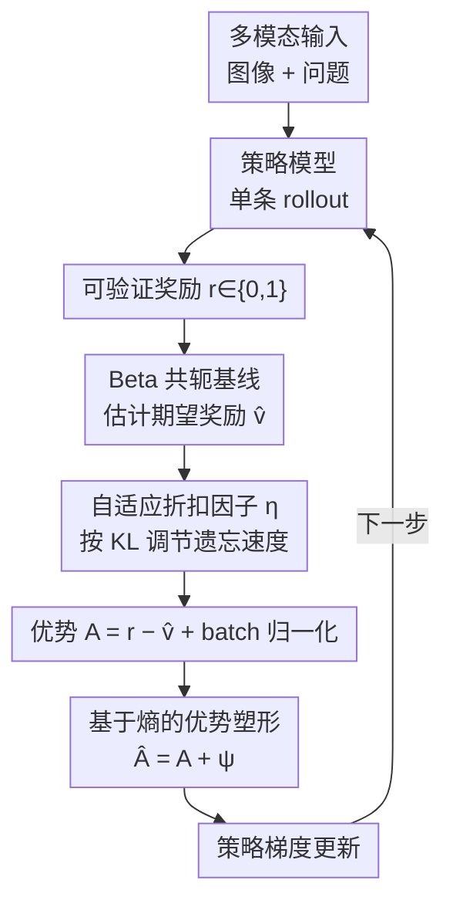

# Stable and Efficient Single-Rollout RL for Multimodal Reasoning

**会议**: CVPR 2026  
**论文**: [CVF Open Access](https://openaccess.thecvf.com/content/CVPR2026/html/Liu_Stable_and_Efficient_Single-Rollout_RL_for_Multimodal_Reasoning_CVPR_2026_paper.html)  
**代码**: https://mssr-proj.github.io （项目页）  
**领域**: 多模态VLM / 对齐RLHF  
**关键词**: 多模态推理, RLVR, 单rollout, 熵塑形优势, GRPO

## 一句话总结
针对多模态 RLVR 中 GRPO 多 rollout 太贵、而单 rollout 又会熵塌缩崩溃的两难，本文提出 MSSR——用 Beta 共轭基线替代分组归一化、再叠加一个"基于熵的优势塑形"机制稳住训练，做到每个样本只采一条轨迹，却能用一半训练步数追平 GRPO，并在 5 个基准上平均超过它 2 个多点。

## 研究背景与动机

**领域现状**：用可验证奖励做强化学习（RLVR）已经成为提升多模态大模型（MLLM）推理能力的主流范式。答案对就给 1、错就给 0，奖励信号自动可验证，不再依赖人类偏好标注。当前最常用的算法是 GRPO 这类 group-based 方法：对同一个 prompt 采样一组（通常 8 条）rollout，用组内相对好坏来估计每条轨迹的优势（advantage）。

**现有痛点**：分组采样有两个硬伤。一是**贵**——每个输入要前向多次，而多模态模型的视觉编码器+语言编码器都要跑，对大模型来说重复前向的开销极其可观。二是**浪费**——当一组里所有 rollout 结果都一样（全对或全错）时，组内相对优势直接坍缩为 0，这一步白采了，没有任何学习信号。

**核心矛盾**：自然会想到"那每个输入只采一条轨迹不就省了"。文本域里确实已经有单 rollout 的成功实践，但作者实验发现，把这套直接搬到多模态会**崩**：高维稠密的视觉输入大幅放大了输入方差，跨模态的信用分配更难，没有了组内归一化来削峰，二元奖励的高随机性会让策略熵迅速塌缩、训练发散。于是问题变成一个 trade-off：**单 rollout 省算力但不稳，多 rollout 稳但费算力**。

**本文目标**：造一个既只用单 rollout（拿到算力效率）、又能稳定收敛（不熵塌缩）的多模态 RLVR 框架。

**切入角度**：作者先把文本域的单 rollout 公式泛化到多模态，得到一个朴素版本 MVSR——它仍然会塌缩；然后系统性地试了一圈常见稳定化手段（KL 正则、跨模态锚定、熵损失），发现都只能部分缓解；最后定位到真正管用的那一招——**基于熵的优势塑形**。

**核心 idea**：把策略输出熵直接揉进优势里——对那些奖励虽低但模型不确定（高熵）的回答，给它更高的有效优势，从而保住探索、防止模式坍缩。这个机制在 group-based 里只是"锦上添花"，但在多模态单 rollout 设定下，作者论证它是**生死攸关的必需品**。

## 方法详解

### 整体框架

MSSR 是一个 **group-free**（无分组）的 RLVR 训练框架：对每个"图像+问题"的多模态输入，策略模型只生成**一条** rollout，拿到二元可验证奖励后，用一个按样本维护的 Beta 分布来估计基线值、算出优势、做 batch 归一化，最后叠加熵塑形项再去更新策略。整条管线相比 GRPO 的区别只在两处——把"组内相对比较"换成"Beta 共轭基线"，把"靠组归一化天然稳定"换成"靠熵塑形主动稳定"。朴素版（只有前者）叫 MVSR，加上熵塑形后的完整版叫 MSSR。

### 关键设计

**1. Beta 共轭基线：用一条轨迹也能估出靠谱的优势基线**

单 rollout 最大的缺口是没有组内同伴可比，优势 $A=r-v̂$ 里的基线 $v̂$（期望奖励）无从估起。作者注意到二元奖励 $r(x,o)\in\{0,1\}$ 天然是伯努利分布，而伯努利的共轭先验正是 Beta 分布——于是为每个输入 $x$ 维护一对形状参数 $\alpha(x),\beta(x)$，基线取 Beta 的均值 $v̂(x)=\frac{\alpha(x)}{\alpha(x)+\beta(x)}$。每步观察到奖励后做共轭更新：$\alpha\leftarrow\eta\cdot\alpha+r$，$\beta\leftarrow\eta\cdot\beta+(1-r)$。优势用的是**上一步**的基线 $v̂_{-1}(x)$（即 $A=r-v̂_{-1}$）以避免偏差，再在 batch 内归一化降方差。这一招把"组内相对比较"替换成"单样本的贝叶斯期望基线"，让单 rollout 也能算出有意义的优势，是省掉分组的前提。

**2. 自适应折扣因子 η：让基线随策略变化快慢自动调遗忘速度**

共轭更新里的 $\eta\in[\eta_{\min},\eta_{\max}]\subset(0,1]$ 是个"遗忘因子"——它决定旧的奖励统计在 Beta 参数里衰减多快。如果固定不变，策略变快时旧基线就过时、策略稳定时又记不住历史。作者用一个长度 $N$ 的滑动窗口跟踪相邻两次策略更新之间的 KL 散度均值 $\overline{KL}_s$，并和目标 $KL_\text{target}$ 比较：当 $\overline{KL}_s>KL_\text{target}$（策略变化剧烈）时，按 $\eta_s=\eta_{\max}-\tau_s(\eta_{\max}-\eta_{\min})$ 线性调小 $\eta$，**加快遗忘**、防止旧基线拖累；当 $\overline{KL}_s\le KL_\text{target}$（更新平稳）时反向调大 $\eta$、**放慢遗忘**、多保留历史信息。其中比例 $\tau_s=\min(\overline{KL}_s/KL_\text{target},1.0)$。这让基线估计能跟着策略演化自适应，是对设计 1 的稳态补强。

**3. 基于熵的优势塑形：本文真正稳住训练的那一招**

即便有了 Beta 基线，MVSR 仍会崩——因为只采一条轨迹，奖励信号高度随机（相似推理可能这次 r=1、下次 r=0），策略更新震荡、熵迅速塌缩、准确率随训练反而下滑（图 3 实测）。作者的补救是把策略熵**直接塑进优势**：定义熵 bonus

$$\psi_t=\min\left(\frac{|A_t|}{\gamma},\;\lambda\cdot\text{stopgrad}(H_t)\right)$$

其中 $H_t(\pi_\theta)=-\mathbb{E}_{o\sim\pi_\theta}[\log\pi_\theta(o_{<t}\mid x)]$ 是 token 级熵，$\text{stopgrad}$ 只取熵的数值、不让它反传梯度，$\gamma,\lambda$ 是缩放系数。塑形后的优势为 $\hat A_t=A_t+\psi_t$。直觉上，它给那些**奖励低但模型不确定（高熵）的回答**额外加权——这类回答可能正落在"接近正确却采样不足"的推理路径附近，softening 了对低奖励回答的惩罚，从而保住足够的策略熵、维持探索、阻止模式坍缩。论文强调：熵塑形在 group-based RLVR 里早被用过、只算有益；但在缺少组内归一化、不稳定被放大的单 rollout 多模态设定里，它从"有益"升级成"必需"。

### 损失函数 / 训练策略
基座为 Qwen2.5-VL-3B/7B，在 Vision-R1-RL 数据集（约 10K 多模态数学推理样本）上直接做 RL，输出格式要求推理包在 `<think></think>`、答案用 `\boxed{}`，奖励是"答案精确匹配才给 1"的硬规则二元奖励。训练 120 步，AdamW，lr=1e-6，weight decay=0.01；熵塑形 $\gamma=0.4,\lambda=2.0$；Beta 折扣 $\eta_{\min}=0.875,\eta_{\max}=0.96$；KL 滑窗 $N=20$，$KL_\text{target}=0.01$，对参考策略的 KL 正则系数 0.01。实现基于 EasyR1 框架。公平起见，所有方法每步总 rollout 数都对齐到 2048（单 rollout 是 2048×1，GRPO 是 256×8）。

## 实验关键数据

### 主实验
五个多模态推理基准上的泛化对比（准确率 %，3B / 7B 两个规模；表头取自原文 Table 1）：

| 模型 | MathVerse | MathVista | MMK12 | R1-OneVision | HallusionBench | 平均 |
|------|-----------|-----------|-------|--------------|----------------|------|
| Qwen2.5-VL-3B（base） | 33.3 | 59.5 | 42.5 | 27.6 | 59.9 | 44.6 |
| + GRPO | 36.8 | 61.7 | 46.1 | 30.2 | 62.3 | 47.4 |
| + RLOO | 35.7 | 59.7 | 45.5 | 28.8 | 61.6 | 46.3 |
| + REINFORCE++ | 35.3 | 47.7 | 46.0 | 21.7 | 63.2 | 42.8 |
| **+ MSSR** | **39.6** | **63.0** | **49.2** | 29.0 | **66.6** | **49.5** |
| Qwen2.5-VL-7B（base） | 45.8 | 67.2 | 48.1 | 34.6 | 68.4 | 52.8 |
| + GRPO | 48.5 | 70.0 | 55.8 | 37.7 | 69.7 | 56.3 |
| + RLOO | 47.8 | 69.2 | 56.0 | 38.5 | 68.5 | 56.0 |
| + REINFORCE++ | 42.7 | 68.5 | 51.3 | 34.0 | 69.2 | 53.1 |
| **+ MSSR** | **49.8** | **71.1** | **62.5** | **39.2** | **70.6** | **58.6** |

MSSR 在两个规模上均超过所有 group-free / group-based baseline：3B 比 GRPO 高 2.1 个点、7B 高 2.3 个点，7B+MSSR 取得全表最强平均（58.6）。值得注意的是单 rollout 的 REINFORCE++ 在两个规模都低于 base，印证了"朴素单 rollout 不稳"。

### 消融实验
作者逐一替换稳定化手段，验证熵塑形不可替代（基于 7B，图 3/4 趋势）：

| 配置 | 训练稳定性 | 验证准确率 | 说明 |
|------|-----------|-----------|------|
| MVSR（朴素单 rollout，仅 KL 正则） | 熵塌缩、发散 | 随训练下滑 | 仅有对参考策略的 KL 正则远不足以稳住 |
| + 跨模态正则（text-only 锚定分支） | 部分稳定 | 训练升、验证仍降 | 用纯文本分支当 anchor policy 做 KL 约束，只能部分缓解 |
| + 熵损失（系数 0.01） | 部分保熵 | 验证仍降 | 末期训练准确率有改善，但熵保不住，加大系数 {0.05,0.10,0.15} 最终仍塌缩 |
| **+ 熵塑形（MSSR）** | **稳定、熵不塌** | **稳步上升** | 比最强单 rollout 变体最终验证准确率高约 5% |

### 关键发现
- **熵塑形是唯一管用的稳定器**：KL 正则、跨模态锚定、熵损失都只能"部分救场"，唯有把熵塑进优势才能全程保熵、稳定收敛——这是本文最核心的实证结论。
- **算力效率**：每步开销仅略增（6.9 vs 6.1 min/step，多出的来自 Beta 基线估计），但只用 **一半训练步数**就追平 GRPO 的验证准确率，等预算下还反超；换 30K 的 MMRL30K 数据集结论一致。
- **推理更细粒度**（Table 2）：MMK12 上 MSSR 平均产生 3.3 个关键推理步（按 markdown 加粗对计数），高于 GRPO 的 1.9 和 base 的 3.1；平均回答长度 511.6 也长于 GRPO 的 439.7——说明 GRPO 倾向收敛到更短解，而 MSSR 保留了更结构化的分步推理。
- **超参鲁棒**：滑窗 $N=20$、$KL_\text{target}=0.01$ 在末期验证准确率最佳；自适应 η 比固定 η 略好但两者都稳，说明对基线更新规则不敏感。

## 亮点与洞察
- **共轭分布配二元奖励，干净又自洽**：奖励是伯努利、基线用其共轭先验 Beta，更新规则就是简单的参数累加，省掉了分组采样还保留了概率解释——是个很优雅的"用一条轨迹估基线"方案。
- **"给高熵低奖励回答加权"这个直觉很迁移**：它本质是在说"别急着惩罚那些不确定但可能接近正确的探索"，这套保熵思路对任何容易模式坍缩的单样本/稀疏奖励 RL 都有借鉴价值。
- **方法论上的诚实**：作者没有一上来就卖熵塑形，而是先试遍 KL/跨模态/熵损失这些更"显然"的手段、逐一证明它们不够，再反衬出熵塑形的必需性——这种"消去法"叙事让结论更有说服力。
- **同一机制在不同设定下角色不同**：熵塑形在 group-based 里只是 nice-to-have，在单 rollout 多模态里却是 must-have，提醒我们稳定化技巧的价值高度依赖于是否还有别的方差抑制来源（这里少了组归一化）。

## 局限与展望
- **任务域偏窄**：训练与评测都聚焦多模态**数学/推理**类（图表、几何、视觉数学），奖励是"答案精确匹配"的硬规则二元奖励，是否能推广到开放式生成、需要部分分/过程奖励的任务尚未验证。
- **规模仅到 7B**：只在 Qwen2.5-VL-3B/7B 上验证，更大模型上"分组归一化缺失被熵塑形补偿"这一权衡是否依旧成立未知。
- **熵塑形的超参敏感性**：$\gamma=0.4,\lambda=2.0$ 沿用他人设置，论文对这两个核心系数本身没做系统扫描（只扫了 $N$ 和 $KL_\text{target}$），其稳健边界不清晰。
- **关键步数的度量较粗**：用"markdown 加粗对的个数"近似推理粒度，是个易受输出格式影响的代理指标，"更多关键步=更鲁棒推理"的因果仍偏经验。

## 相关工作与启发
- **vs GRPO / RLOO（group-based）**：它们靠每个 prompt 采一组 rollout 做组内相对优势，稳但贵、且全同结果时优势归零浪费采样；MSSR 只采一条、用 Beta 基线替代组归一化，半数步数追平、等预算反超，核心优势是算力效率。
- **vs REINFORCE++（group-free 单 rollout）**：同样是单 rollout，但缺乏针对多模态高方差的稳定化，实测两个规模都低于 base；MSSR 的差异点正是加了熵塑形，把"不稳的单 rollout"救成"稳定且更强"。
- **vs 文本域单 rollout 方法（如 [35]）**：本文把它们的 Beta 基线 + batch 归一化公式泛化到多模态，但发现 batch 归一化这类文本域有效的手段在视觉高维输入下失效，必须额外引入熵塑形——这是"文本 RLVR 经验不能直接搬到多模态"的一个具体例证。
- **vs 跨模态正则 / 双分支熵损失类工作**：这些被作者当作对照基线证明其"只能部分稳定"，反衬熵塑形的核心地位。

## 评分
- 新颖性: ⭐⭐⭐⭐ 首个把单 rollout RLVR 做稳的多模态方法，Beta 基线+熵塑形组合清晰，但单个组件（共轭基线、熵塑形）均源自已有工作。
- 实验充分度: ⭐⭐⭐⭐ 5 基准 × 2 规模主结果 + 系统消除法消融 + 换数据集复现 + 超参敏感性，证据链完整；规模和任务域偏窄。
- 写作质量: ⭐⭐⭐⭐ 动机—朴素版崩—消去法定位熵塑形的叙事顺畅，公式与图表呼应清楚。
- 价值: ⭐⭐⭐⭐ "半数步数追平 GRPO"对算力敏感的多模态 RL 训练很实用，保熵思路可迁移到其他稀疏奖励单样本 RL。

<!-- RELATED:START -->

## 相关论文

- [\[CVPR 2026\] SpaceTools: Tool-Augmented Spatial Reasoning via Double Interactive RL](spacetools_tool-augmented_spatial_reasoning_via_double_interactive_rl.md)
- [\[ICLR 2026\] Shuffle-R1: Efficient RL Framework for Multimodal Large Language Models via Data-centric Dynamic Shuffle](../../ICLR2026/multimodal_vlm/shuffle-r1_efficient_rl_framework_for_multimodal_large_language_models_via_data-.md)
- [\[CVPR 2026\] ReaGEN: Adaptive Generation of Structured Chains-of-Thought for Efficient Multimodal Reasoning](reagen_adaptive_generation_of_structured_chains-of-thought_for_efficient_multimo.md)
- [\[CVPR 2026\] Multi-Modal Image Fusion via Intervention-Stable Feature Learning](multi-modal_image_fusion_via_intervention-stable_feature_learning.md)
- [\[CVPR 2026\] Perceptual-Evidence Anchored Reinforced Learning for Multimodal Reasoning](perceptual-evidence_anchored_reinforced_learning_for_multimodal_reasoning.md)

<!-- RELATED:END -->
