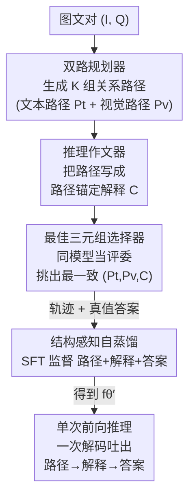

# StaR-KVQA: Structured Reasoning Traces for Implicit-Knowledge Visual Question Answering

**会议**: CVPR 2026  
**论文**: [CVF Open Access](https://openaccess.thecvf.com/content/CVPR2026/html/Wen_StaR-KVQA_Structured_Reasoning_Traces_for_Implicit-Knowledge_Visual_Question_Answering_CVPR_2026_paper.html)  
**代码**: 无  
**领域**: 多模态VLM  
**关键词**: 知识型视觉问答, 隐式知识, 结构化推理轨迹, 关系路径, 自蒸馏

## 一句话总结
StaR-KVQA 用同一个开源 MLLM 自己造出「双路符号关系路径 + 路径锚定的自然语言解释」作为结构化推理轨迹，把只监督答案的微调换成监督「推理轨迹 + 答案」的结构感知自蒸馏，在不接任何外部检索的前提下让 OK-VQA 准确率比最强基线高出 +11.3%，同时输出可审计的中间推理。

## 研究背景与动机

**领域现状**：知识型视觉问答（KVQA）要求模型既能把图像里的实体定位出来，又能调用图像之外的事实知识来回答问题（如"这是什么品种的狗？"）。传统做法在感知 backbone 之上挂一套外部知识图谱（KG）或检索模块（ConceptBERT、KRISP、MAVEx、WikiLLaVA、EchoSight 等），靠检索回来的事实补充推理。

**现有痛点**：外部检索式 pipeline 在真实部署里有三重代价——① 隐私/合规：用户图像、问题、抽出的实体要发给第三方服务或存进外部索引；② 延迟/成本：检索与证据融合在规模上开销大，效果还随索引时效、领域漂移波动；③ 可靠性差：多阶段设计里识别或检索一旦出错就会沿管线传播，证据融合脆弱，失败难以归因审计。这催生了**隐式知识 KVQA（IK-KVQA）**——禁用一切外部知识源，让 MLLM 只凭 $(I, Q)$ 和参数里的知识直接作答 $\hat{a} = f_\theta(I, Q)$。

**核心矛盾**：IK-KVQA 把瓶颈从"检索知识"转成了"激发、组织、校验模型内部知识"。但现有 IK-KVQA 方法基本都是**只用答案做监督（answer-only SFT）**：推理过程留在黑箱里，中间描述要么缺失、要么弱关联、要么前后不一致；标准 SFT 还容易过拟合到域内模式，换个分布就崩。换言之，模型可能"蒙对了答案，但中间步骤站不住脚"。

**本文目标**：在不引入任何外部检索器/验证器/知识库、且推理只跑一遍前向的约束下，给 IK-KVQA 注入一个比"只看答案"更强的归纳偏置，让模型既答得更准、中间推理又更透明可审计。

**切入角度**：作者观察到——**关系（relation）比实体更稳定**。具体实体千变万化，但实体之间的语义关系（如 `dog.color → dog.size → dog.breed`）共享一套紧凑的 ontology，在文本和视觉两侧都能对齐到物体级/场景级属性。所以可以把"符号关系路径"当作低维、离散的**推理脚手架（planning scaffold）**，引导模型关注相关实体和属性，又不把推理死锁在某一条固定链上。

**核心 idea**：用同一个开源 MLLM 自己生成「双路关系路径 + 路径锚定解释」这种**结构化推理轨迹**，离线扩充出带轨迹的训练集，再做**结构感知自蒸馏**——把自蒸馏从"只蒸馏答案"升级为"蒸馏结构化的中间推理"。

## 方法详解

### 整体框架

StaR-KVQA 的核心是：**全程只用一个 MLLM$_\phi$**（如 Qwen2.5-VL-7B），让它分饰三角——既当"规划器"生成关系路径，又当"作文器"把路径写成解释，还当"评委"挑出最一致的三元组——把这些自产的推理轨迹和真值答案拼成增强训练集，然后微调出 $f_\theta'$。整个轨迹构造是**离线**的，推理时只需单次自回归解码同时吐出"路径 → 解释 → 答案"，不调用任何选择器、检索器或额外模块。

形式上，对训练图文对 $(I_{tr}, Q_{tr})$：先生成 $K$ 个候选 dual-path 对 $\{(P_t^{(k)}, P_v^{(k)})\}$，每对配一段解释 $C^{(k)}$；选择器挑出最优三元组 $T_{b^*} = (P_t^{b^*}, P_v^{b^*}, C^{b^*})$；与答案 $a_{tr}$ 一起构成增强样本，在其上做 token 级交叉熵微调。

### 关键设计

**1. 双路规划器：把跨模态推理拆成"文本侧"和"视觉侧"两条稳定的关系路径**

痛点直说：IK-KVQA 里模型怎么从视觉线索连到内部知识全是隐式的，缺一个显式的"该看哪些实体/属性"的引导。规划器让冻结的 MLLM$_\phi$ 对 $(I, Q)$ 生成 $K$ 组候选路径对 $\{(P_t^{(k)}, P_v^{(k)})\} = \text{Planner}_\phi(I, Q)$：其中**文本路径** $P_t$ 捕捉来自问题 $Q$ 的语义关联与语言先验，**视觉路径** $P_v$ 编码锚定在图像 $I$ 上的属性与关系。比如对"这是什么品种的狗"，一条候选是 $P_v$: `dog.color → dog.coat_length → dog.size`，$P_t$: `dog.size → dog.breed_group → dog.breed`，两条互补地把视觉线索接到语义先验。

之所以用关系路径而不是实体，是因为关系是低维、离散、可复用的——它充当"软规划提示"，缩小搜索空间、把模型从"死记标签的捷径"上拉开，同时**不强行约束推理链**：下游作文器可以补充额外线索、也可以跳过冗余的 hop。作者明确承认这些路径"不必最小、也不必充分"，允许带噪声的冗余/轻微虚假 hop，把它们当作"有用但有噪声的脚手架"，后续靠选择器和自蒸馏精炼。

**2. 推理作文器：把抽象的符号路径变成"绑定到路径"的自然语言解释，让解释本身成为可监督信号**

只有符号路径还不够具象，模型需要一段连贯的文字推理。作文器用同一 backbone 生成 $C^{(k)} = \text{Compose}_\phi(I, Q, P_t^{(k)}, P_v^{(k)})$。关键在于**显式绑定**：构造轨迹时要求解释里（i）至少提到视觉路径 $P_v$ 的一个属性/关系 token，（ii）至少包含文本路径 $P_t$ 的一个语义 hop；随后算一个解释与路径 token 之间的**覆盖度分数（coverage score）**，把覆盖度极低（如两条路径都没有重叠）的候选直接丢掉。

这一绑定把"可解释性"从事后副产品变成了**路径感知的监督信号**：它逼着解释聚焦在符号计划真正用到的实体/属性上，压住"文字很流畅但根本没扣住证据"的自由发挥，也让解释天然容易对照路径做审计，同时仍允许加入额外线索。

**3. 最佳三元组选择器：用"模型当评委（LLM-as-a-judge）"挑出对自己最有用的轨迹，过滤噪声监督**

并非所有三元组 $(P_t^k, P_v^k, C^k)$ 都可靠，直接拿来训练会注入噪声和前后不一致。选择器仍**复用同一个 MLLM$_\phi$**，在数据增强阶段对 $K$ 个候选按三条标准排序：（i）面向答案的路径一致性——答案能自然地从解释和路径推出；（ii）内部连贯且简洁；（iii）路径引用——明确提到 $P_t$/$P_v$ 的元素。主目标是答案质量，忠实性被鼓励但不作硬约束。形式上 $b^* = \arg\max_b s_\phi(I, Q, P_t^b, P_v^b, C^b)$，取 $T_{b^*} = (P_t^{b^*}, P_v^{b^*}, C^{b^*})$。

这一步**不引入任何可训练参数**。作者强调"全程单模型"的三点理由：① 生成与学习同源——规划/作文/选择都用同一模型家族，学生 $f_\theta$ 学的是同家族轨迹，缓解监督-生成风格错配与灾难性遗忘；② 测试时简单——选择器只在离线增强用，推理仍是单次前向；③ IK 合规——设计保持纯参数化，无任何外部知识或模块。选出的三元组反映"MLLM 自己觉得最有助于答题的链"，可能不是对人最直观的，但实证上提供更强的监督。

**4. 结构感知自蒸馏 + 单次前向推理：把"路径+解释+答案"一起当作监督目标，推理时一次吐完整轨迹**

有了增强集 $D_{aug} = \{(I_{tr}^i, Q_{tr}^i, T_{b^*}^i, a_{tr}^i)\}$，在其上以 token 级交叉熵微调基座 $f_\theta$：

$$\mathcal{L}_{SFT}(\theta; D_{aug}) = -\sum_{(I,Q,T,a)\in D_{aug}} \log p_\theta(T, a \mid I, Q)$$

其中目标序列把推理路径 $P_t, P_v$、推理内容 $C$、最终答案 $a$ **拼成一条连贯输出**。这与普通 SFT 的根本区别在于：监督信号不再只是孤立答案，而是"如何从视觉线索连到内部知识再到答案"的整条结构化轨迹，提供更强的归纳偏置、压住捷径依赖。微调后的 $f_\theta'$ 在测试时对 $(I_{te}, Q_{te})$ **单次自回归解码**就同时输出 $(\hat{P}_t, \hat{P}_v, \hat{C}, \hat{a})$——"路径 → 解释 → 答案"的结构直接暴露一条完整可审计的轨迹，全程零外部检索。

### 一个完整示例

以"这是什么品种的狗？"配一张狗的图为例走一遍离线增强：

1. **规划器**产出 $K=3$ 组双路（如 $T_0$: $P_t^0$=`dog.size → dog.breed_group → dog.breed`、$P_v^0$=`dog.color → dog.coat_length → dog.size`；$T_1$ 是另一条更短的链；$T_k$ ……）。
2. **作文器**给每组写解释：$C_0$ 提到"首先看物种……接着看毛色（黑色）……中等体型品种……Labrador Retriever"，并扣住路径 token。
3. **选择器**按答案一致性/连贯性/路径引用排序，挑出 $T_{b^*}$（这里答案"labrador retriever"被解释和双路稳稳支撑）。
4. 把 $T_{b^*}$ + 真值答案拼进 $D_{aug}$，进入结构感知 SFT。

测试时模型对一张新图直接一次解码就输出双路 + 解释 + 答案，无需再跑选择器。

## 实验关键数据

数据集：主验证在 **OK-VQA**（14,055 图-问对，该领域最难基准），补充验证在 **FVQA**。指标为标准 direct-answer VQA accuracy。backbone 覆盖 Qwen2.5-VL-7B、Llama-3.2-11B-Vision、Gemma-3-12B；LoRA rank 32 / alpha 64，3 epoch，$K=3$（OK-VQA）/ $K=4$（FVQA）。

### 主实验

| 方法（类别） | 外部知识 | OK-VQA Acc.(%) | FVQA Acc.(%) |
|--------------|----------|----------------|--------------|
| MCAN（KG/检索类最强） | 无 | 44.65 | — |
| MAIL（LLM 类最强） | MiniGPT-4 + ConceptNet | 56.69 | — |
| Qwen2.5-VL-7B（裸 IK 基线） | 无 | 75.74 | 71.61 |
| Qwen2.5-VL-72B | 无 | 80.75 | 75.95 |
| GPT-4o | 无 | 77.86 | 72.36 |
| Gemini 2.5 Pro | 无 | 80.53 | 73.39 |
| CoT + SFT（强 CoT 基线） | 无 | 79.58 | 75.13 |
| SDFT（最强基线） | 无 | 82.56 | 75.54 |
| **StaR-KVQA$_{Qwen}$** | 无 | **91.51** | **82.82** |
| **StaR-KVQA$_{Gemma}$** | 无 | **91.90** | 81.20 |
| **StaR-KVQA$_{Llama}$** | 无 | 90.01 | 80.19 |

要点：① 即便不接外部知识，MLLM 凭参数化知识已远超 KG/检索类老方法；② StaR-KVQA 在三种 backbone 上都拿最好成绩，OK-VQA 相对最强基线 SDFT（82.56）提升约 +8.95，论文宣称对"最强基线最高 +11.3%"⚠️（推测是对照某一更弱基线或某一拆分，以原文为准）；③ 它甚至反超 Gemini 2.5 Pro 这类顶级闭源多模态推理模型；④ SDFT（自蒸馏改写答案风格）已经很强、仅次于本文，但 StaR-KVQA 进一步把"答案自蒸馏"升级为"结构化轨迹自蒸馏"，在保住准确率收益的同时给出透明中间推理。

### 消融实验

| 配置 | 视觉路径 | 文本路径 | 作文器 | 选择器 | 三 backbone 均值(%) |
|------|:---:|:---:|:---:|:---:|:---:|
| No paths（去双路） | ✗ | ✗ | ✓ | ✓ | 80.15 |
| No content（去解释） | ✓ | ✓ | ✗ | ✓ | 81.23 |
| No text path（只视觉） | ✓ | ✗ | ✓ | ✓ | 76.29 |
| No vision path（只文本） | ✗ | ✓ | ✓ | ✓ | 77.84 |
| No selector（随机选） | ✓ | ✓ | ✓ | ✗ | 78.80 |
| **StaR-KVQA（完整）** | ✓ | ✓ | ✓ | ✓ | **86.27** |

（均值列为 OK-VQA + FVQA × 三 backbone 的平均，便于横向对比；单 backbone 数值波动较大，需结合原表看）

去掉双路或去掉解释都明显掉点，说明符号路径与自然语言解释是**互补**监督；只留单一模态（只视觉/只文本）进一步退化，印证"文本先验必须与视觉锚定对齐"；把选择器换成随机选会出现混合结果——有时在 Qwen/Gemma 上略升，但在 Llama 上严重崩坏（如 FVQA-Llama 掉到 49.18），说明选择器对**跨 backbone 的鲁棒性**至关重要。

### 跨域泛化（最亮的发现）

| 配置 | 源域调优 | OK-VQA→FVQA | FVQA→OK-VQA |
|------|:---:|:---:|:---:|
| Frozen Qwen | — | 71.61 | 75.74 |
| SFT$_{Qwen}$ | 有 | 64.77（**−6.84**） | 67.50（**−8.24**） |
| **StaR-KVQA$_{Qwen}$** | 有 | 82.09（**+10.48**） | 85.45（**+9.71**） |

普通 SFT 一旦换到跨域测试就**比冻结基座还差**（负迁移），而 StaR-KVQA 在跨域上仍有 +9~+10 的正向提升——结构化轨迹监督带来的归纳偏置实打实地改善了分布外鲁棒性，这正是针对"标准 SFT 易过拟合域内模式"痛点的直接回应。

### 关键发现
- **贡献排序**：双路 + 解释 + 选择器三者都有贡献，缺一掉点；其中"文本/视觉单模态"退化最重，说明跨模态对齐是核心；选择器主要保鲁棒性（防止某些 backbone 崩盘）。
- **超参 $K$**：候选路径数 $K$ 增大初期涨点，但 $K=5$ 时因上下文过长拖累选择器而掉点；增强耗时随 $K$ 近似线性增长而收益很快饱和，$K=3$ 是效率-效果最佳折中。整体对 $K$ 不敏感。
- **效率**：用 vLLM 在单节点 L20 上，离线增强每条样本约 1–2 秒，开销适中，适合真实生产部署。

## 亮点与洞察
- **"一个模型分饰三角"省掉整条外部依赖**：规划器/作文器/选择器全是同一个 MLLM 的不同 prompt 角色，不引入任何额外可训练参数，既满足 IK 的纯参数化约束，又让学生学的是"同家族轨迹"，天然缓解监督-生成风格错配和灾难性遗忘——这是把自蒸馏做"干净"的关键 trick。
- **把可解释性变成可监督信号，而不是事后解释**：通过 coverage 绑定 + 选择器引用打分，强行让自然语言解释扣住符号路径 token，使"透明度"在训练阶段就被优化，而非推理后再硬解释。这个"用结构约束把解释拉回证据"的思路可迁移到任何需要可审计推理的生成任务。
- **关系比实体稳定 → 用关系路径当低维脚手架**：核心洞察是把推理脚手架建在共享 ontology 的关系上而非易变实体上，"软计划但不锁链"既缩小搜索空间又保留灵活性，对 KG 推理之外的多跳问答也有启发。
- **跨域负迁移→正迁移的反转**最具说服力：同样是微调，answer-only SFT 跨域掉 6~8 个点，结构化轨迹监督反而涨 9~10 个点，直接证明"监督什么"比"监督多少"更重要。

## 局限与展望
- **轨迹质量上限受 backbone 自身能力约束**：路径、解释、选择全靠同一个开源 MLLM 自产自销，若 backbone 本身知识缺失或有系统性偏见，离线增强很难凭空补上正确知识（纯参数化的固有天花板）。
- **选择器是 LLM-as-a-judge，可能引入自偏好噪声**：作者也承认选出的链"可能不是对人最直观的"；随机选在个别 backbone 上甚至略好，说明选择器的排序信号并不总是最优，且对不同 backbone 的鲁棒性不一致（Llama 上波动尤其大）。
- **评测面偏窄**：主要在 OK-VQA / FVQA 两个经典 KVQA 基准上验证，更开放域、更长尾知识、更复杂多跳的场景泛化性仍待考察。⚠️ "最高 +11.3%"的具体对照基线在缓存正文中未完全对齐到表格数值，建议以原文为准。
- **改进思路**：可探索引入轻量外部校验只在离线阶段、不破坏 IK 推理约束；或把 coverage/选择信号做成可学习的 reward 而非启发式打分。

## 相关工作与启发
- **vs 检索增强 KVQA（WikiLLaVA / EchoSight / KRISP / MAVEx）**：它们靠外部 KG/检索补知识，但有隐私、延迟、错误传播、低透明度问题；StaR-KVQA 完全纯参数化、单次前向、轨迹可审计，是"自包含、低成本、可审计"部署 regime 的解法（作者强调二者互补而非替代）。
- **vs answer-only SFT / CoT+SFT**：普通 SFT 只监督答案、CoT 只给通用思维链且无结构；本文用"双符号路径 + 路径锚定解释"提供更强且模态感知的结构归纳偏置，跨域泛化反转负迁移。
- **vs SDFT（自蒸馏微调）**：SDFT 把答案改写成模型自己风格再微调，已是最强基线；StaR-KVQA 把自蒸馏从"蒸馏答案"扩展到"蒸馏结构化中间推理"，在保住准确率的同时多给一层透明推理。
- **vs plan-first prompting / KG path reasoning**：前者在外部做规划或在显式 KG 上走路径，本文把"规划"内化进单模型、用双路统一文本先验与视觉属性，无需外部 KG。

## 评分
- 新颖性: ⭐⭐⭐⭐⭐ 把"自蒸馏"从蒸馏答案升级为蒸馏结构化双路推理轨迹，单模型分饰三角，IK-KVQA 设定下角度新颖。
- 实验充分度: ⭐⭐⭐⭐ 三 backbone + 主结果/消融/超参/跨域齐全，跨域泛化对比尤其有说服力；但仅两基准、"+11.3%"对照略含糊。
- 写作质量: ⭐⭐⭐⭐ 动机-挑战-方法链条清晰，设计原则交代到位；部分表格数值需结合原文细读。
- 价值: ⭐⭐⭐⭐⭐ 给注重隐私/成本/可审计的生产部署提供了无检索、可解释、可迁移的实用方案。

<!-- RELATED:START -->

## 相关论文

- [\[CVPR 2026\] VQ-VA World: Towards High-Quality Visual Question-Visual Answering](vq-va_world_towards_high-quality_visual_question-visual_answering.md)
- [\[CVPR 2026\] ChartR: Evaluating Reasoning Accuracy and Robustness in Chart Question Answering](chartr_evaluating_reasoning_accuracy_and_robustness_in_chart_question_answering.md)
- [\[CVPR 2026\] DocPrune: Efficient Document Question Answering via Background, Question, and Comprehension-aware Token Pruning](docpruneefficient_document_question_answering_via_background_question_and_compre.md)
- [\[CVPR 2026\] SEA: Evaluating Sketch Abstraction Efficiency via Element-level Commonsense Visual Question Answering](sea_evaluating_sketch_abstraction_efficiency_via_element-level_commonsense_visua.md)
- [\[CVPR 2026\] VKG-QA: Visual Knowledge Graph-based Question Answer for Large Multimodal Models](vkg-qa_visual_knowledge_graph-based_question_answer_for_large_multimodal_models.md)

<!-- RELATED:END -->
