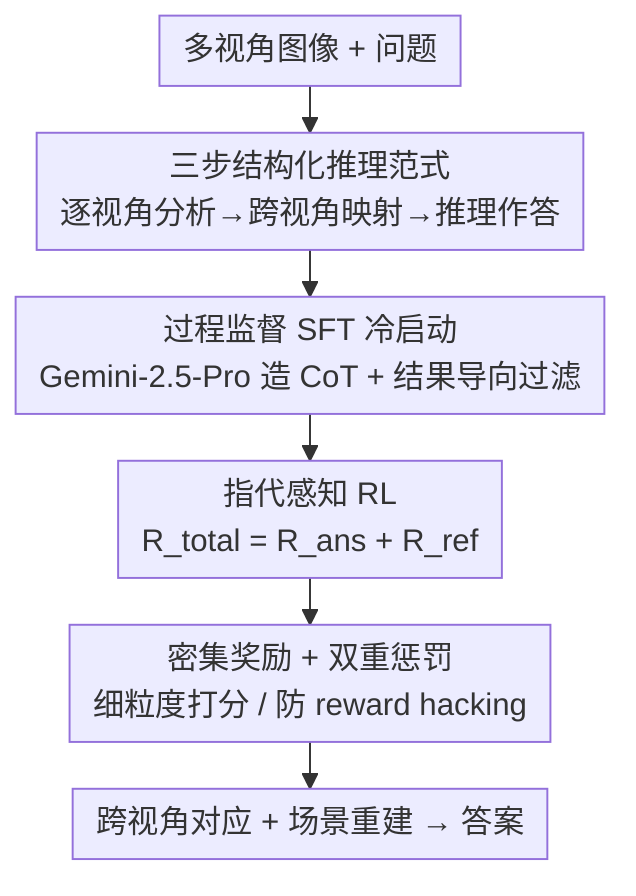

# STAR-R1: Multi-View Spatial TrAnsformation Reasoning by Reinforcing Multimodal LLMs

**会议**: CVPR 2026  
**论文**: [CVF Open Access](https://openaccess.thecvf.com/content/CVPR2026/html/Li_STAR-R1_Multi-View_Spatial_TrAnsformation_Reasoning_by_Reinforcing_Multimodal_LLMs_CVPR_2026_paper.html)  
**领域**: 多模态VLM  
**关键词**: 多视角空间推理, 强化学习, 跨视角对应, GRPO, 过程监督

## 一句话总结
STAR-R1 用"过程监督 SFT 冷启动 + 指代感知 RL"两阶段训练 Qwen2.5-VL-7B，让模型像人一样先锚定关键参照物、再跨视角对齐重建场景，从而在 TVR、MMSI-Bench、MindCube-Tiny、SPAR-Bench 等多视角空间理解基准上全面超越开源乃至部分闭源模型。

## 研究背景与动机

**领域现状**：强化学习（RL）已被证明能显著提升 LLM 和 MLLM 的推理能力（DeepSeek-R1 之后大量 multimodal-R1 工作涌现），但这些工作几乎都是面向数学、通用 VQA、视频时序等任务设计的，**多视角空间推理**——也就是模型要在多张不同视角的图像之间建立物体对应、再推断出一致的场景语义——几乎无人专门探索。

**现有痛点**：作者用一个有代表性的双视角任务 TVR（Transformation-Driven Visual Reasoning，描述两张图之间物体属性的变化）做诊断，发现两条路都走不通。监督微调（SFT）能死记硬背标注里的物体变换模式，但缺乏对空间关系的显式推理，一旦初始图和末态图视角不同就大量出错（例如把"2.color.cyan"这种实际没发生的变化也报出来）。而朴素 RL（vanilla GRPO）虽然能自发鼓励模型显式建立跨视角的关键物体对应，但**没有冷启动时常常漏掉关键物体、给出错误对应，输出格式也不规整**。

**核心矛盾**：作者把它提炼成一句精辟的观察——"**SFT 记忆，RL 泛化**"。表 1 给出量化证据：在无视角变化的 ID 集上 SFT 拿到 84.2 TAcc 远高于 RL 的 76.3；但一到有视角变化的 OOD 集，SFT 暴跌到 30.9，RL 反而有 53.9（领先 23%）。行为分析进一步发现，RL 模型在 OOD 场景下 81% 的样本会显式建立跨视角物体对应（ID 场景只有 67%），说明它在复杂条件下自发做更彻底的跨视角核对——这正是它鲁棒的根因。

**本文目标 / 切入角度**：既然 SFT 给结构、RL 给泛化，那就别二选一，把两者的优点缝起来。核心 idea 是：**先用过程监督 SFT 把"逐视角分析 → 跨视角映射 → 空间推理"这条结构化推理轨迹注入模型，再用指代感知的 RL（在参照物选择和最终答案上同时给细粒度奖励）让模型自由探索、把跨视角对应做扎实**。

## 方法详解

### 整体框架
STAR-R1 是一个两阶段训练框架，底座是 Qwen2.5-VL-7B。它先在 TVR 任务上做"探索实验"，确认 RL 能自发诱导出人类式的"锚定关键物体 → 跨视角验证"行为；再把这套思路推广到真实世界多视角任务，落地成一个三步推理范式 + 两阶段训练。

推理时，模型对一组多视角图像执行固定三步：① **逐视角参照分析**——每张图里挑出若干关键参照物，把它们之间的方向关系编码成三元组 `[物体1, 物体2, 关系]`（如 `[沙发, 球, 后面]`）；② **跨视角空间映射**——比对外观特征和相对配置，把各视角的局部关系合并成一张统一的场景级空间地图；③ **空间推理与答案推断**——在重建好的空间地图上推理，输出标准化的 `<answer>...</answer>`。

训练时，**阶段一**用 Gemini-2.5-Pro 按上述三步格式生成高质量 CoT，只保留最终答案正确的样本做 SFT 冷启动（4.1k 样本）；**阶段二**在此基础上做 RL（19.2k 样本），奖励同时作用于"参照物选择"和"答案正确性"。整套奖励的精细设计（尤其密集奖励 + 双重惩罚）是论文在 TVR 探索阶段打磨出来的关键。

### 关键设计

**1. "SFT 记忆 / RL 泛化"的诊断与两阶段缝合：用过程监督冷启动给结构，用 RL 给泛化**

直接上 SFT 会过拟合标注模式、视角一变就崩；直接上 RL 又会漏物体、格式乱。作者没有押注单一路线，而是先在 TVR 上做控制实验把这对 trade-off 量化清楚（ID 上 SFT 赢、OOD 上 RL 赢 23% TAcc），再据此设计两阶段：阶段一不是普通 SFT，而是**过程监督冷启动**——强制每条 CoT 都遵循"逐视角参照分析 → 跨视角空间映射 → 空间推理作答"三步轨迹，并用一个**结果导向的数据过滤**只保留最终答案正确的 CoT，避免把错误推理路径也学进去。这样 SFT 只负责"把推理骨架和输出格式立起来"，把"探索更优轨迹、做扎实跨视角核对"的活留给阶段二的 RL。消融里单阶段 SFT 或单阶段 RL 都明显不如完整两阶段，印证了这种"结构 + 泛化"互补的必要性。

**2. 细粒度密集准确率奖励：把"全对才给分"的稀疏信号拆成可部分得分的稠密信号**

TVR 要求一个变换的 `(index, attribute, value)` 三元组全对才算对，若沿用以往 RL 的二值奖励（全对才 1、否则 0），探索效率和上限都被卡死。作者把奖励粒度细化到**每一个变换 $t_i$**，并按匹配程度给阶梯式正奖励：

$$R^{\text{pos}}(t_i)=\begin{cases}5.0,& t_i\text{ 完全匹配};\\ 1.5,& (\text{index}_i,\text{attribute}_i)\text{ 匹配};\\ 0.5,& \text{仅 index}_i\text{ 匹配};\\ 0.0,& \text{其他}.\end{cases}$$

整条序列的正奖励是所有变换之和 $R^{\text{pos}}=\sum_{i=1}^{n}R^{\text{pos}}(t_i)$。再加上格式奖励——推理必须在 `<think>` 内、答案在 `<answer>` 内，正确得 $R^{\text{format}}=1$ 否则 0。这种"先认对物体（0.5）、再认对属性（1.5）、最后认对取值（5.0）"的渐进式打分，给了模型清晰的爬坡信号，比二值奖励探索得更高效。消融显示去掉物体奖励或属性奖励都会掉点（TAcc 从 61.4 分别降到 58.0 / 56.8）。

**3. 双重惩罚机制：堵住"枚举刷分"的 reward hacking 漏洞**

光有正奖励会被钻空子——模型可以把所有可能的 `(index, attribute, value)` 三元组全枚举一遍来骗取正分。为此作者设计了双重惩罚：每个错误预测扣 $-1.0$（$n_{\text{miss}}$ 个错误就扣 $-n_{\text{miss}}$）；如果预测的变换数 $n_{\text{pred}}$ 少于真值 $n_{\text{gt}}$，再额外扣 $-(n_{\text{gt}}-n_{\text{pred}})$ 逼模型完整探索：

$$R^{\text{pun}}=\begin{cases}-n_{\text{miss}}-(n_{gt}-n_{pred}),& n_{pred}<n_{gt};\\ -n_{\text{miss}},& \text{其他}.\end{cases}$$

最终准确率奖励 $R^{\text{acc}}=R^{\text{pos}}+R^{\text{pun}}$。消融里去掉"漏报惩罚"会明显掉点（58.2），去掉"错答惩罚"会直接触发枚举式 reward hacking（54.3），而把惩罚换成简单的数量差惩罚 $-|n_{pred}-n_{gt}|$ 同样更差（54.5）——证明"对每个错误预测及时、定点扣分"才是关键，逼模型主动找对的变换而不是回避犯错。

**4. 指代感知 RL 奖励：让真实世界任务把"答对"和"锚对参照物"一起优化**

把方法推到真实世界多视角任务时，光靠答案对错的奖励不够，模型可能蒙对答案却没真正建立跨视角对应。作者引入两路互补奖励：参照选择奖励 $R^{\text{ref}}$ 鼓励在多视角中准确识别关键参照物，结果奖励 $R^{\text{ans}}$ 基于最终答案正确性，总奖励为

$$R^{\text{total}}=R^{\text{ans}}+R^{\text{ref}}.$$

这让模型在"答对"之外被显式逼着"把跨视角的参照接地做扎实"，从而自主精炼空间推理策略。消融表 4 显示去掉 $R^{\text{ref}}$ 后，MMSI-Bench、MindCube-Tiny Rotation、Among 分别掉 5.2%、17.5%、5.2%——尤其在跨视角线索弱的 Rotation 上，物体锚定奖励几乎是决定性的。

### 损失函数 / 训练策略
底座 Qwen2.5-VL-7B，单节点 8×H20 GPU。TVR 探索阶段为省算力只做单阶段 RL（足以释放长 CoT 推理）；真实世界任务走完整两阶段（4.1k SFT + 19.2k RL，样本均匀采自 MindCube 和 SPAR-7M 各空间理解类别）。RL 以 GRPO 为基础并扩展密集奖励与惩罚。响应长度训练曲线（图 3）呈"先骤降、再缓升、最后稳定"：早期模型把冗长描述压成简洁单物体推理，但太短会漏物体导致错配，最终收敛到"简洁但系统比对所有物体"的稳定策略。

## 实验关键数据

### 主实验

| 基准 / 子任务 | 指标 | STAR-R1 (7B) | 对比最佳 | 提升 |
|--------------|------|------|----------|------|
| TVR | TAcc↑ | 61.4 | o3 36.0 / GPT-4o 23.5 | +25.4% / +37.9% |
| TVR | NDiff↓ | 0.3 | Qwen2.5-VL-7B 1.5 | 大幅下降 |
| MMSI-Bench | Acc↑ | 31.4 | GPT-4o 30.3 | +1.1 |
| MindCube-Tiny Rotation | Acc↑ | 98.5 | 开源 SOTA 53.0 | +45.5% |
| MindCube-Tiny Around | Acc↑ | 82.8 | 开源 SOTA 70.4 | +12.4% |
| SPAR-Bench ObjRel-OC-MV | Acc↑ | 86.0 | SOTA 64.0 | +22.0% |
| SPAR-Bench ObjRel-OO-MV | Acc↑ | 76.7 | SOTA 59.0 (人类 80) | +17.7% |

STAR-R1 在 TVR 三项指标全部最优，比 STAR-SFT 高约 13% TAcc，说明结构化 RL 即便只用少量高质量数据也能大幅提升复杂视觉推理；在 SPAR-Bench 上甚至超过用 10× 数据训练的最佳方法，ObjRel-OC-MV 接近/超过人类水平。

### 消融实验（TVR 奖励设计，表 3）

| 配置 | TAcc | NDiff↓ | 说明 |
|------|------|--------|------|
| STAR-R1 (Full) | 61.4 | 0.31 | 完整奖励 |
| w/o obj reward | 58.0 | 0.37 | 去物体奖励，探索效率降 |
| w/o attr reward | 56.8 | 0.40 | 去属性奖励，掉点最多 |
| w/o under-pred 惩罚 | 58.2 | 0.41 | 鼓励完整探索的约束没了 |
| w/o 错答惩罚 | 54.3 | 0.44 | 触发枚举式 reward hacking |
| w/ naive GRPO | 54.5 | 0.43 | 朴素 GRPO 不适配 TVR |

### 关键发现
- **错答惩罚是防作弊命门**：去掉它模型立刻退化成"枚举所有三元组刷正分"，TAcc 从 61.4 跌到 54.3；把它换成粗糙的数量差惩罚也救不回（54.5），说明惩罚必须"定点、及时、针对每个错误预测"。
- **属性奖励比物体奖励更关键**：w/o attr（56.8）比 w/o obj（58.0）掉得更多，密集分级奖励里"认对属性"这一档贡献最大。
- **物体数越多越难**：按物体数 {1-3, 4-6, 7-8, 9-10} 分组，STAR-R1 的组内准确率从 91.0 递减到 37.5，说明跨视角对应的难度随场景复杂度急升。
- **Rotation 子任务最吃 RL**：它跨视角线索最弱，STAR-R1 比 STAR-SFT 高 44.5%，去掉 $R^{\text{ref}}$ 掉 17.5%——参照物锚定对弱线索场景几乎是决定性的。

## 亮点与洞察
- **"SFT 记忆、RL 泛化"是个干净且可复用的洞察**：作者没有空喊，而是用 ID/OOD 控制实验 + 行为统计（OOD 下 81% vs ID 67% 显式建立对应）把它量化坐实，再据此设计两阶段，方法论闭环很漂亮，这个诊断范式可迁移到其他"格式 vs 泛化"两难的任务。
- **奖励工程里"防 reward hacking"被认真对待**：把"模型会枚举刷分"这个 RL 常见暗坑显式建模成双重惩罚，并用消融证明每一项的必要性，比单纯堆正奖励扎实得多——这套密集分级奖励 + 定点惩罚的思路可直接搬到其他结构化输出的 RLVR 任务。
- **结构化三步推理范式既是接口又是监督**：`逐视角分析 → 跨视角映射 → 推理作答`既是 CoT 监督模板，又是 $R^{\text{ref}}$ 的打分锚点，把"可解释推理结构"和"可验证奖励"统一了起来。
- **小数据高质量也能打 10× 数据**：仅 4.1k SFT + 19.2k RL 就在 SPAR-Bench 超过用 10 倍数据训练的方法，印证"结构化冷启动 + 精细奖励"的样本效率。

## 局限与展望
- **任务域仍偏狭**：TVR 用的是 CLEVR 风格合成场景（属性变换），真实基准也集中在参照物方向关系这类问答；对更开放的多视角任务（如导航、长程几何推理）泛化性未充分验证。
- **依赖闭源教师造数据**：阶段一 CoT 由 Gemini-2.5-Pro 生成并按"答案正确"过滤，监督质量受教师模型上限和过滤噪声影响，且只保留答对样本可能丢掉"推理对但答案错"的有价值轨迹。
- **奖励是手工设计且任务定制**：密集分级分数（5.0/1.5/0.5）和惩罚项是为 TVR 三元组结构量身定的，换到非结构化答案任务需要重新设计 reward，迁移成本不低。
- **参照物选择奖励的监督来源**：$R^{\text{ref}}$ 如何精确判定"参照物选对"原文（正文部分）未给完整定义，细节需查补充材料，复现时是潜在不确定点（⚠️ 以原文/补充材料为准）。

## 相关工作与启发
- **vs MM-Eureka / LMM-R1 / Video-R1**：这些都是 multimodal-R1 路线，MM-Eureka 主攻数学、LMM-R1 用文本+多模态两阶段 RL、Video-R1 设计时序奖励；它们都是通用目标、需在多任务间折中，没有针对多视角空间推理做专门优化。STAR-R1 把 RL 首次系统用到多视角空间理解，并定制了参照感知奖励。
- **vs 朴素 GRPO**：STAR-R1 以 GRPO 为底座，但把二值准确率奖励换成细粒度密集奖励 + 双重惩罚；消融里 naive GRPO 在 TVR 上 54.5 明显落后，证明朴素 GRPO 不适配这种结构化多步输出。
- **vs MMSI-Bench / MindCube**：这两者主要贡献是构建多视角评测数据集，停留在"评估"层面缺乏任务特定优化；STAR-R1 则在这些基准上给出"怎么训得更好"的方法侧答案。
- **可迁移的启发**：把"显式结构化推理轨迹"既当 SFT 模板又当 RL 奖励锚点的做法，可推广到任何"需要中间步骤可验证"的多模态推理任务（如图表推理、流程图理解）。

## 评分
- 新颖性: ⭐⭐⭐⭐ 首次系统把 RL 用于多视角空间推理，"SFT 记忆/RL 泛化"诊断 + 指代感知奖励组合新颖，但单项技术（两阶段、密集奖励、GRPO）均有前作。
- 实验充分度: ⭐⭐⭐⭐ 覆盖 4 个基准 + 充分的奖励消融 + ID/OOD 行为分析，证据链完整；真实任务多样性和参照奖励细节稍欠。
- 写作质量: ⭐⭐⭐⭐ "SFT 记忆 RL 泛化"主线清晰、图表到位；部分关键定义（$R^{\text{ref}}$ 判定）下放补充材料。
- 价值: ⭐⭐⭐⭐ 在多视角空间理解上把开源 7B 推到接近/超人类，奖励防作弊设计实用，对空间智能方向有明确推动。

<!-- RELATED:START -->

## 相关论文

- [\[NeurIPS 2025\] Video-R1: Reinforcing Video Reasoning in MLLMs](../../NeurIPS2025/multimodal_vlm/video-r1_reinforcing_video_reasoning_in_mllms.md)
- [\[NeurIPS 2025\] SpatialThinker: Reinforcing 3D Reasoning in Multimodal LLMs via Spatial Rewards](../../NeurIPS2025/multimodal_vlm/spatialthinker_reinforcing_3d_reasoning_in_multimodal_llms_via_spatial_rewards.md)
- [\[ICLR 2026\] SophiaVL-R1: Reinforcing MLLMs Reasoning with Thinking Reward](../../ICLR2026/multimodal_vlm/sophiavl-r1_reinforcing_mllms_reasoning_with_thinking_reward.md)
- [\[CVPR 2026\] ARM-Thinker: Reinforcing Multimodal Generative Reward Models with Agentic Tool Use and Visual Reasoning](arm-thinker_reinforcing_multimodal_generative_reward_models_with_agentic_tool_us.md)
- [\[CVPR 2026\] Hear you are: Teaching LLMs Spatial Reasoning with Vision and Spatial Sound](hear_you_are_teaching_llms_spatial_reasoning_with_vision_and_spatial_sound.md)

<!-- RELATED:END -->
