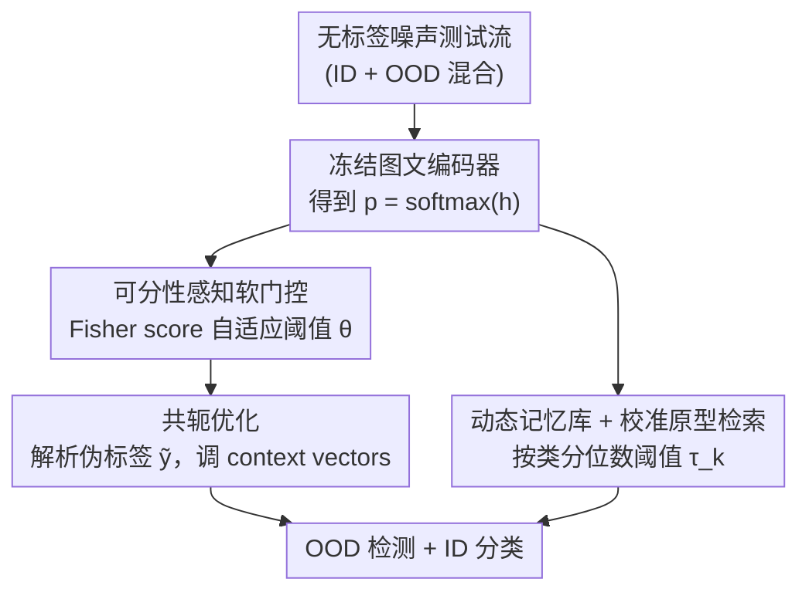

# STAR: Test-Time Adaptation Can Enhance Universal Prompt Learning for Vision-Language Models

**会议**: CVPR 2026  
**论文**: [CVF Open Access](https://openaccess.thecvf.com/content/CVPR2026/html/Fu_STAR_Test-Time_Adaptation_Can_Enhance_Universal_Prompt_Learning_for_Vision-Language_CVPR_2026_paper.html)  
**代码**: 无  
**领域**: 多模态VLM  
**关键词**: 提示学习, 测试时自适应, OOD检测, 共轭优化, CLIP

## 一句话总结
STAR 让已经做过 few-shot prompt tuning 的 CLIP 在推理阶段继续用无标签测试流（混着 ID 和 OOD 样本）自我适应：先用 Fisher score 自适应地软门控分开 ID/OOD，再用共轭优化生成可靠伪标签做无监督微调，最后用动态原型库做按类校准的 OOD 检测——在 ImageNet-1K 上把 LoCoOp/SCT 的 FPR95 大幅压低。

## 研究背景与动机

**领域现状**：CLIP 这类 VLM 把图文对齐到同一嵌入空间，零样本分类很强，也成了 OOD 检测的新载体。现有做法分两派：一派是 score-based（从 logits/特征算个判别分数，如 MCM、Energy、Max-Logit），不调模型；另一派是 tuning-based，其中 few-shot prompt learning（LoCoOp、SCT）最受欢迎——用少量带标签数据微调文本提示词，增强区分 ID 与 OOD 的能力。

**现有痛点**：这些 prompt learning 方法是"训练好就冻住"，但真实部署是**流式、无标签、还混着噪声/分布漂移**的测试数据不断到来。论文 Figure 1 显示：随着噪声样本累积，不做适应的 prompt 方法 FPR95 一路恶化。而现有 test-time adaptation（TTA）方法又有两个毛病：（1）伪标签不可靠——不确定性估计太粗糙；（2）把测试样本一视同仁，忽略了不同类别之间的异质性和不确定性差异，反而在测试时引入额外的适应偏差。

**核心矛盾**：测试时只有无标签数据，既想用它们继续适应，又怕被里面的 OOD/噪声样本带偏。关键是**没有一个可靠的机制把"该信的样本"和"该压制的样本"分开**，并据此生成可信的学习信号。

**本文目标**：在推理阶段，用无标签的 ID+OOD 混合测试流去增强 prompt learning，同时（i）可靠地区分 ID/OOD，（ii）做不确定性感知的自适应，只吸收有信息量的样本、压制有害噪声。

**切入角度**：用熵作为 OOD 的粗指标（OOD 输入偏离 ID 决策边界 → 预测更分散 → 熵更高），但不写死阈值，而是用 Fisher score 自适应地找出最能分开两类熵分布的门控阈值；再把门控嵌进一个可微的共轭优化里产生伪标签。

**核心 idea**：把"可分性感知的软门控"塞进"共轭优化"产生可靠伪标签，再叠一个"动态原型检索"按类校准 OOD 检测——三者协同，让 prompt learning 在测试时持续自我强化。

## 方法详解

### 整体框架

STAR 建立在一个已经做过 few-shot prompt tuning 的 CLIP 之上（图像/文本编码器冻结，只调提示词的 context vectors）。推理时，无标签的噪声测试图像成批进来，STAR 走两条互补的支线再耦合：一条是**可分性感知的共轭优化**（负责"该不该学、学成什么伪标签"），一条是**校准式原型检索**（负责"按类精修 OOD 判定边界"）。两条线通过共轭伪标签的优化过程耦合，输出更鲁棒的 OOD 检测。

整体数据流：每个 batch 先过冻结的图文编码器拿到图像嵌入和文本嵌入，算出预测概率 $\mathbf{p}=\mathrm{softmax}(\mathbf{h})$（$\mathbf{h}$ 是温度缩放后的图文余弦相似度）；用熵 $H(\mathbf{p})$ 和 Fisher score 自适应阈值做软门控，把样本"软性"地划成 ID/OOD 两摊；再用共轭优化从 $\mathbf{p}$ 解析出伪标签 $\tilde{\mathbf{y}}$，回传梯度只更新 context vectors；同时把高置信样本塞进动态记忆库构造按类原型，用原型检索的分位数阈值校准每一类的 OOD 判定。

### 关键设计

**1. 可分性感知的软门控：用 Fisher score 自适应找熵阈值，不再写死**

直接对预测熵卡一个固定阈值 $\theta$ 来分 ID/OOD 太脆——分布一漂移就失准。STAR 先写出一个硬门控的目标：对低熵（自信）样本用交叉熵把它往 ID 类推，对高熵（不自信）样本用 KL 散度把它往均匀分布 $\mathbf{u}$ 拉（即"别瞎猜，承认不知道"），形式为 $\mathcal{L} = -\mathbb{I}(H(\mathbf{p})<\theta)\,\mathbf{y}^\top\log\mathbf{p} + \alpha\,\mathbb{I}(H(\mathbf{p})>\theta)\,\mathrm{KL}(\mathbf{p}\|\mathbf{u})$。关键是阈值 $\theta$ 怎么定：作者把它当成"两个熵分布的最优分界"，用 Fisher score 自适应求解

$$\max_{\theta} F_{\text{score}} = \max_{\theta} \frac{w_{\mathrm{ID}}\,w_{\mathrm{OOD}}\,(\mu_{\mathrm{ID}}-\mu_{\mathrm{OOD}})^2}{w_{\mathrm{ID}}\,\sigma_{\mathrm{ID}}^2 + w_{\mathrm{OOD}}\,\sigma_{\mathrm{OOD}}^2},$$

其中 $w_{\mathrm{ID}},w_{\mathrm{OOD}}$ 是按 $\theta$ 划开后两摊样本的比例，$\mu,\sigma^2$ 分别是各摊的均值熵和熵方差。这就是经典的类间方差/类内方差比——让两类熵均值离得最远、各自又最紧。但硬指示函数 $\mathbb{I}(\cdot)$ 不可微、梯度过不去自适应阈值，所以作者把它换成 Sigmoid 软门控 $\phi_n(\mathbf{p})=\sigma(n(\theta-H(\mathbf{p})))$，损失变成 $\mathcal{L}_n = -\phi_n(\mathbf{p})\,\mathbf{y}^\top\log\mathbf{p} + \alpha\,(1-\phi_n(\mathbf{p}))\,\mathrm{KL}(\mathbf{p}\|\mathbf{u})$，$n$ 控制过渡的陡峭程度。论文 Lemma 3.1 证明 $n\to\infty$ 时软门收敛到硬指示函数，等于保证了"软"是硬的可微平滑版而非另一回事。

**2. 共轭优化产生可靠伪标签：把损失重参数化成 Legendre–Fenchel 形式解析求伪标签**

软门控只是决定"信多少"，还得给出无监督下"该学什么"——即不依赖真标签的伪标签。STAR 借 Legendre–Fenchel（共轭函数）视角重写损失：令 $\mathcal{L}_n = f(\mathbf{h}) - \mathbf{y}^\top g(\mathbf{h})$，其中 $f(\mathbf{h})=\alpha(1-\phi_n)(\log K - H(\mathbf{p}))$、$g(\mathbf{h})=\phi_n\log\mathbf{p}$。由于 softmax 的平移不变性，$\nabla_\mathbf{h}g$ 在 $\mathrm{span}\{\mathbf{1}\}$ 方向上奇异、不可全局求逆，作者把它限制到子空间 $\mathcal{S}=\{\mathbf{v}\in\mathbb{R}^K\mid\mathbf{1}^\top\mathbf{v}=0\}$（Lemma 3.2 证明 $g$ 在 $\mathcal{S}$ 上局部可逆）。在驻点附近用一阶最优条件，伪标签解析地写成

$$\tilde{\mathbf{y}} = \nabla_\mathbf{z}(f\circ g^{-1})(\mathbf{z})\big|_{\mathbf{z}=g(\mathbf{h})} = \big(\nabla_\mathbf{h}g(\mathbf{h})\big|_{\mathcal{S}}\big)^{-\top}\nabla_\mathbf{h}f(\mathbf{h}),$$

最终可由模型预测 $\mathbf{p}$ 直接算出（详细展开见原文 Eq. 14，⚠️ 矩阵求逆形式以原文为准）。这样得到的"不确定性感知共轭适应损失"有三个好处：阈值随分布漂移自适应调整；自信样本侧重交叉熵、不确定样本侧重 KL，对噪声/OOD 鲁棒；完全不需要真标签。实现上作者还加了数值稳健的矩阵求解 + 轻度后处理防止退化解。

**3. 校准式原型检索 + 动态记忆库：按类自适应阈值，而非全局一刀切**

前两步把 ID/OOD 在熵空间分开了，但 OOD 判定如果对所有类用同一个全局阈值，会忽略类间的特征分布、样本量、语义对齐差异（长尾时尤其吃亏）。STAR 维护一个按类的动态记忆库 $\mathcal{B}=\{\mathcal{B}_k\}$，只存每类置信度 $\bar{p}_i=\max_k p_{i,k}>\eta$ 的高置信样本（每类容量上限 $L$，满了丢最早的）。类原型先用文本表示初始化 $\mathbf{c}_k^0=\mathcal{T}(\mathbf{t}_k)$，再用动量更新 $\mathbf{c}_k^{t+1}=\beta\cdot(\text{库内按置信度加权的图像嵌入均值})+(1-\beta)\mathbf{c}_k^t$。检测时算样本与其伪标签对应原型的余弦相似度 $s^c_{i,k}$，并按每类高置信样本相似度分布的 $\gamma$ 分位数（如下 5% 尾部）定出**类专属阈值** $\tau_k=\mathrm{Quantile}_\gamma(\{s^c_{i,k}\mid \mathbf{x}_i\in\mathcal{B}_k\})$，相似度低于 $\tau_k$ 即判为 OOD。早期某些类样本不够时，作者把文本嵌入聚成 $\tilde{K}=\rho K$ 个 meta-cluster，用同簇其他类的样本拼凑出阈值，缓解冷启动。这个按类校准的检索是"表示一致性"学习器，和前面"不确定性判别"学习器互补，二者通过共轭伪标签耦合。

### 损失函数 / 训练策略
推理时只优化 prompt learner 的 context vectors（图文编码器冻结），用上面的不确定性感知共轭适应损失，SGD、batch size 128、学习率 1e-4。关键超参：$\alpha=0.001$（CE 与 KL 的 trade-off）、$n=5$（软门陡峭度）、$\beta=0.9$（原型动量）、$\gamma=0.05$（分位数）、$\rho=0.2$（meta-cluster 比例）、每类记忆库上限 64。backbone 用 LoCoOp/SCT 训好的 ViT-B/16。

## 实验关键数据

### 主实验

ID 数据集为 ImageNet-1K，OOD 测试集为 iNaturalist / SUN / Texture / Places。STAR 有两个变体：STAR$_L$（基于 LoCoOp）、STAR$_S$（基于 SCT）。下表为 1-shot 设置下的平均结果（FPR95 越低越好，AUROC 越高越好）：

| 方法 | iNat FPR95↓ | SUN FPR95↓ | Places FPR95↓ | 平均 FPR95↓ | 平均 AUROC↑ |
|------|------|------|------|------|------|
| MCM (zero-shot) | 31.86 | 37.28 | 42.94 | 42.61 | 90.66 |
| CLIPN (zero-shot) | 23.94 | 26.17 | 33.45 | 31.10 | 93.10 |
| LoCoOp$_G$ (1-shot) | 19.57 | 26.26 | 36.10 | 33.08 | 91.86 |
| **STAR$_L$** | **6.28** | 22.81 | 26.77 | **27.03** | **93.64** |
| SCT$_G$ (1-shot) | 27.76 | 24.46 | 32.67 | 34.46 | 91.17 |
| **STAR$_S$** | 11.48 | **20.63** | **25.43** | **27.82** | **93.41** |

STAR$_L$ 相对 1-shot LoCoOp 在平均 FPR95 上提升 6.05%、AUROC 提升 1.73%；16-shot 时 STAR$_L$ 平均 FPR95 进一步降到 19.91、AUROC 95.36。在衡量"ID 分类 + OOD 检测综合能力"的 ACC$_H$（ID/OOD 准确率的调和平均）上，STAR$_S$ 在四个数据集取得最高排名（1-shot 平均 42.22 vs SCT 40.23，16-shot 46.04 vs LoCoOp 39.85）。

### 消融实验

三个组件：M1 = 可分性感知软门控（Eq. 2，去掉则换成固定阈值 $\theta=0.6\log K$）；M2 = 共轭优化（去掉则换成 softmax 熵最小化）；M3 = 推理时 prompt 微调（去掉则直接在 few-shot 模型上检测）。结果为 iNaturalist 与 SUN 平均：

| M1 | M2 | M3 | STAR$_L$ FPR95↓ | STAR$_L$ AUROC↑ | STAR$_S$ FPR95↓ | STAR$_S$ AUROC↑ |
|----|----|----|------|------|------|------|
| ✗ | ✓ | ✓ | 83.02 | 74.28 | 72.19 | 81.72 |
| ✓ | ✗ | ✓ | 87.24 | 56.26 | 81.99 | 66.54 |
| ✓ | ✓ | ✗ | 38.36 | 92.53 | 42.59 | 91.61 |
| ✓ | ✓ | ✓ | **14.55** | **97.08** | **16.06** | **96.78** |

### 关键发现
- **共轭优化（M2）最关键**：把它换成 softmax 熵最小化后掉点最猛（STAR$_L$ FPR95 从 14.55 暴涨到 87.24），因为没有可靠伪标签时部分 OOD 被错当成可信样本学了进去。
- **软门控（M1）次之**：换成固定阈值后 FPR95 涨到 83.02，自适应阈值确实显著强化了 ID/OOD 的区分。
- **去掉推理时微调（M3）影响最小**：FPR95 仅升到 38.36，说明 STAR 的增益主要来自"测试时怎么学"而非"学不学"本身，但完整三件套缺一不可。
- 超参 $\alpha$ 在 1e-3 附近不敏感；batch size 32–512 范围内表现稳定。
- **Texture 数据集是短板**：STAR 在 Texture 上反而略逊于部分 baseline（如 16-shot STAR$_S$ FPR95 48.42 高于 LoCoOp$_G$ 40.59），纹理类 OOD 与 ID 在 CLIP 空间可能更难分。

## 亮点与洞察
- **把 OOD 阈值选择问题转成 Fisher 判别**：不是拍脑袋设阈值，而是显式最大化两类熵分布的类间/类内方差比，思路干净且可迁移到任何"靠某个标量分两堆"的场景。
- **共轭/Legendre–Fenchel 视角导出解析伪标签**：避开了"伪标签靠 argmax 硬贴"的不可靠，用一阶最优条件把伪标签写成模型预测的闭式函数，并用子空间 $\mathcal{S}$ 巧妙绕开 softmax 平移不变带来的奇异性——这套数学处理本身就值得借鉴。
- **双学习器互补 + 共轭耦合**：熵空间的判别学习器和表示空间的原型检索学习器分工明确，又通过共轭伪标签串起来，是一种"判别 + 一致性"协同的范式。
- **按类分位数阈值对长尾友好**：用每类记忆库的相似度分位数定阈值、冷启动用 meta-cluster 兜底，是处理类不平衡 OOD 检测的实用 trick。

## 局限与展望
- **依赖一个已经 prompt-tuned 的好底座**：STAR 是"增强器"而非从零训练，效果上限受 LoCoOp/SCT 质量约束。
- **纹理类 OOD 仍是软肋**：Texture 上不稳定甚至退化，说明方法对"语义接近但纹理不同"的 OOD 区分力有限。
- ⚠️ **共轭伪标签的数值稳定性**：原文提到需要"数值稳健的矩阵求解 + 后处理防退化"，暗示矩阵求逆在线上可能不稳，复现时需留意；Eq. 14 的具体展开较复杂，建议对照附录推导。
- **多个超参需要协调**（$\alpha,n,\beta,\gamma,\rho,\eta,L$），虽然单参敏感性低，但联合调参成本和跨数据集泛化性论文未充分讨论。
- 改进方向：把 Fisher 软门从单一熵标量扩展到多视图/多尺度不确定性；或把原型检索的分位数阈值也做成可学习。

## 相关工作与启发
- **vs LoCoOp / SCT**：它们做的是训练阶段的 few-shot prompt tuning，训练完即冻结；STAR 在其之上加测试时自适应，用无标签测试流继续调 context vectors，是正交的增强，因此能直接套在两者上分别得到 STAR$_L$/STAR$_S$。
- **vs 传统 TTA（如熵最小化/Tent 类）**：传统 TTA 直接最小化 softmax 熵，容易把高熵 OOD 也"自信化"而带偏；STAR 用共轭优化产生可靠伪标签 + 软门控压制噪声，针对性解决了无监督适应的可靠性问题。
- **vs 全局阈值 OOD 检测（MCM、Energy 等 score-based）**：它们用单一全局判别分数，分布漂移下鲁棒性差；STAR 用按类动态原型 + 分位数阈值做细粒度校准，对长尾和类异质性更稳。

## 评分
- 新颖性: ⭐⭐⭐⭐ 把 Fisher 软门控 + 共轭优化伪标签 + 按类原型检索三者组合到"测试时 prompt 学习"上，组合新颖、数学处理扎实。
- 实验充分度: ⭐⭐⭐⭐ ImageNet-1K + 4 个 OOD 集、两个底座变体、三组件消融 + 超参敏感性齐全；但 ID 仅 ImageNet-1K、未在更多 ID 域验证。
- 写作质量: ⭐⭐⭐⭐ 动机清晰、含两条引理支撑；共轭优化部分公式密集，缓存中数学渲染碎片化，需对照附录。
- 价值: ⭐⭐⭐⭐ 即插即用地增强现有 prompt learning 框架的测试时鲁棒性，实用性强。

<!-- RELATED:START -->

## 相关论文

- [\[CVPR 2026\] TTL: Test-time Textual Learning for OOD Detection with Pretrained Vision-Language Models](ttl_test-time_textual_learning_for_ood_detection_with_pretrained_vision-language.md)
- [\[CVPR 2026\] Controllable Federated Prompt Learning at Test Time](controllable_federated_prompt_learning_at_test_time.md)
- [\[CVPR 2026\] Dynamic Logits Adjustment and Exploration for Test-Time Adaptation in Vision Language Models](dynamic_logits_adjustment_and_exploration_for_test-time_adaptation_in_vision_lan.md)
- [\[CVPR 2026\] Improving Calibration in Test-Time Prompt Tuning for Vision-Language Models via Data-Free Flatness-Aware Prompt Pretraining](improving_calibration_in_test-time_prompt_tuning_for_vision-language_models_via_.md)
- [\[CVPR 2026\] Ramen: Robust Test-Time Adaptation of Vision-Language Models with Active Sample Selection](ramen_robust_test-time_adaptation_of_vision-language_models_with_active_sample_s.md)

<!-- RELATED:END -->
