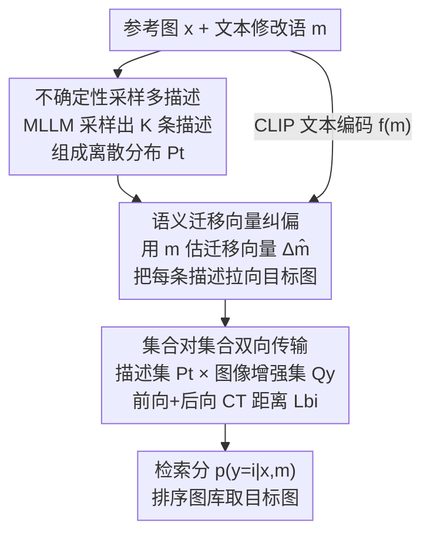

# STiTch: Semantic Transition and Transportation in Collaboration for Training-Free Zero-Shot Composed Image Retrieval

**会议**: CVPR 2026  
**论文**: [CVF Open Access](https://openaccess.thecvf.com/content/CVPR2026/html/Li_STiTch_Semantic_Transition_and_Transportation_in_Collaboration_for_Training-Free_Zero-Shot_CVPR_2026_paper.html)  
**代码**: https://github.com/keepgoingjkg/STiTch  
**领域**: 多模态VLM（组合图像检索 / 零样本检索）  
**关键词**: 组合图像检索, 零样本, 免训练, 语义迁移向量, 双向传输距离

## 一句话总结
STiTch 是一个免训练的零样本组合图像检索（ZS-CIR）框架：先让 MLLM 采样出多条目标描述（视为离散分布），再用文本修改语在嵌入空间构造一个"迁移向量"把这些描述往目标图像方向纠偏、滤掉参考图带来的噪声，最后把"描述集合 vs 目标图像增强集合"建模成集合对集合的双向传输（CT）距离来算检索分，在 CIRCO / CIRR / FashionIQ / GeneCIS 四个基准上免训练方法里整体最优。

## 研究背景与动机

**领域现状**：组合图像检索（CIR）要解决的是「参考图 + 文本修改语 → 目标图」这个三元组：用户给一张图、再给一句"把背景换成雪山、把狗的数量改成 9 只"，系统要从图库里检出符合的图。早期方法靠百万级人工标注三元组做有监督融合，泛化差、成本高。零样本路线（Pic2Word、SEARLE、LinCIR 等）训练一个把图像映射成文本 token 的网络，省掉三元组标注但仍要图文对训练。最新的免训练路线直接用基础模型（captioner + LLM，或一个 MLLM）把参考图和修改语融合成"目标描述"，再用 CLIP 算描述与候选图的相似度做检索——无需任何训练、推理灵活、还能借 LLM 的推理能力。

**现有痛点**：作者指出免训练这条"生成描述→检索"的管线有两个具体毛病。其一是**参考图信息泄漏**：图比文字信息密度高得多，MLLM 生成目标描述时会顺手把参考图里跟修改无关的细节（如原图人物的"红夹克和墨镜"）也写进去，这些噪声把核心修改意图（"雪山"）淹没了，论文把它称作额外认知负荷（Extraneous Cognitive Load）。其二是**点对点对齐太粗**：现有方法要么只生成一条描述、要么把多条描述特征直接平均成一个点，再和目标图的单点特征算相似度；一张图"胜过千言万语"，单点对单点只能抓住局部特征，抓不住图文之间复杂的多重对应关系，造成跨模态的语义失衡。

**核心矛盾**：免训练 CIR 的两难在于——想用 MLLM 的强生成能力，就得忍受它把参考图噪声塞进描述；想做细粒度对齐，单点表示又表达力不足。本质是**生成阶段的描述不够"纯"**和**检索阶段的对齐不够"细"**两件事卡在一起。

**本文目标**：在完全免训练的前提下，(1) 把生成的目标描述往真实目标图像方向"纠偏"，滤掉参考图噪声；(2) 把检索从点对点升级成集合对集合的细粒度对齐。

**切入角度**：作者的两个关键观察是——文本修改语 $m$ 本身就编码了"从参考图到目标图"的增量、高质量、密集的相对信息，而且它和生成描述同属文本模态，可以无缝地在嵌入空间里去纠正描述，不引入模态间隙、不需要额外参数；同时 MLLM 解码器天然带不确定性，采样多条描述就能把"目标描述"自然地变成一个离散分布。

**核心 idea**：用"语义迁移（Semantic Transition）+ 双向传输（Transportation）"协同——前者用修改语构造迁移向量把描述往目标图拉、去噪；后者把描述集合与图像增强集合建模成两个离散分布，用条件传输（Conditional Transport, CT）的双向距离做集合对集合对齐。

## 方法详解

### 整体框架
STiTch 是一个**一阶段、免训练**的 ZS-CIR 框架，由三个模块串成：**Querying（采样多条描述）→ Semantic Transition（迁移向量纠偏）→ Set-to-set Alignment（双向传输打分）**。输入是参考图 $x$ + 文本修改语 $m$，输出是图库 $Y=\{y_n\}_{n=1}^N$ 里每张候选图的检索分 $p(y=i\mid x,m)$。

和以往把目标描述当成"一个点" $t$ 不同，STiTch 全程把它当成**离散分布**来处理：先让 MLLM 通过采样吐出 $K$ 条描述，组成文本侧离散分布 $P_t$；再用从修改语估出的迁移向量把每条描述往目标图拉一把，得到去噪后的 $\hat{t}_k$；图像侧也对每张候选图做 $M-1$ 次增强，组成图像侧离散分布 $Q_y$；最后用一个双向传输距离 $L_{bi}(P_t, Q_y)$ 替换掉原来 CLIP 的余弦相似度，作为检索分。整条链路没有任何要训练的参数。

### 关键设计

**1. 多描述不确定性采样：把单点目标描述变成离散分布**

针对"一条描述只抓住一种组合模式、表达力不够"的痛点，STiTch 不再用以往的贪心解码生成单条描述，而是利用语言解码器本身的不确定性，用 in-context prompt（模板形如"<in-context prompt>. <x>. Instruction:<m>. Edited Description:"）配合 top-k（k=50）+ top-p（p=0.8）、温度 $\tau=0.7$ 的采样，一次采出 $K$ 条目标描述。把它们写成一个离散分布：

$$P_t = \frac{1}{K}\sum_{k=1}^K \delta_{t_k}$$

其中 $\delta_{t_k}$ 是落在第 $k$ 条描述文本嵌入 $t_k$ 处的点质量（point mass）。直观上，对同一对 $(x,m)$ 本来就存在多条合理描述，它们从不同角度描述同一张目标图；把它们聚成集合 $P_t$，就能覆盖目标图的多样化视觉语义，而不像单点估计那样只押一种解释。这一步是后面"集合对集合对齐"的前提——没有多条描述，传输距离就退化回点对点。

**2. 语义迁移向量：用修改语在嵌入空间给描述去噪纠偏**

这是全文最核心的设计，直击"参考图信息泄漏"痛点。作者的观察是：MLLM 能描述出变化后的内容，但因为修改语 $m$ 给的引导有限，它会过度关注参考图，把一堆无关视觉细节当噪声写进描述。理想的目标描述应该等于"参考图嵌入 + 从参考图到目标图的增量语义"。这个增量 $\Delta m$ 本应是目标图与参考图嵌入之差 $y-x$，但目标图未知；作者发现修改语 $m$ 恰好编码了这条从参考图指向目标图的高质量相对信息，于是直接用 CLIP 文本编码器 $f$ 把 $m$ 编码出来当作迁移向量的估计：

$$\Delta\hat{m} = f(m), \qquad \hat{t}_k = (1-\alpha)\,t_k + \alpha\,\Delta\hat{m}$$

其中 $\alpha\in[0,1]$ 是权衡超参（默认 0.45），$t_k$ 来自 MLLM、编码了对组合输入 $(x,m)$ 的多模态理解，$\Delta\hat{m}$ 提供参考图到目标图的纯净相对指令。为什么这么做有效：一来 $m$ 和生成描述**同属文本模态**，在嵌入空间里直接做凸组合就能纠偏，不引入模态间隙、不需要任何额外参数或训练；二来它把描述的注意力从参考图细节重新拉回核心修改意图（论文热力图可视化显示，纠偏后模型从"白栅栏""左侧"等噪声转向正确的焦点物体）。整套操作只是嵌入空间里一次线性插值——简单却把"去噪"和"保多样性"同时做到了。纠偏后分布更新为 $P_t=\frac{1}{K}\sum_{k=1}^K \delta_{\hat{t}_k}$。

**3. 双向传输距离：把检索重写成集合对集合的细粒度对齐**

针对"点对点对齐太粗"的痛点，STiTch 在图像侧也对目标图做 $M-1$ 次增强（仅用 random resized crop + random horizontal flip），组成图像侧离散分布 $Q_y=\frac{1}{M}\sum_{m=1}^M \delta_{y_m}$，每个增强抓住目标图的一处局部视觉。于是检索从"一个描述点 vs 一个图像点"升级成"描述集合 $P_t$ vs 图像增强集合 $Q_y$"的集合对集合问题。作者用条件传输（CT）框架定义一个**双向**距离：

$$L_{bi}(P_t, Q_y) = \sum_{m,k}\pi(y_m\mid\hat{t}_k)\,c(\hat{t}_k,y_m) + \pi(\hat{t}_k\mid y_m)\,c(y_m,\hat{t}_k)$$

代价函数 $c(\hat{t},y)$ 取余弦距离；前向传输计划 $\pi(y_m\mid\hat{t}_k)$ 衡量第 $k$ 条描述被"运"到第 $m$ 个图像增强的概率，用 softmax 归一化：

$$\pi(y_m\mid\hat{t}_k) = \frac{\exp(\hat{t}_k^{\top}y_m/\tau)}{\sum_{m'=1}^M \exp(\hat{t}_k^{\top}y_{m'}/\tau)}$$

后向 $\pi(\hat{t}_k\mid y_m)$ 对称定义。嵌入空间里越近的描述-图像对，传输概率越高。为什么选 CT 而不是经典最优传输（OT）：OT 要靠 Sinkhorn 迭代求解、慢；CT 基于样本间语义相似度直接构造双向传输计划，无迭代、复杂度低、可无缝并入深度框架。双向（前向 + 后向）让对齐既考虑"描述→图像"也考虑"图像→描述"，更充分地挖掘跨模态细粒度对应。最后用 $L_{bi}$ 替换 CLIP 余弦相似度，得到更细粒度的检索分：

$$p(y=i\mid x,m) = \frac{\exp(-L_{bi}(P_t, Q_{y_i}))}{\sum_{n=1}^N \exp(-L_{bi}(P_t, Q_{y_n}))}$$

> 说明：原文公式 1 给出的基线 CLIP 检索分把目标描述特征 $t$ 当原型与候选图算相似度，STiTch 等于把这个"原型"从单点升级成分布、把"相似度"从余弦升级成双向传输——三个模块协同就是「采样出分布 → 迁移向量纠偏 → 双向传输对齐」。

## 实验关键数据

实验在四个 CIR 基准上做：CIRR（首个自然图 CIR 数据集）、CIRCO（COCO2017，每个 query 多个 ground truth，用 mAP@k）、FashionIQ（时尚检索，shirt/dress/toptee 三子集）、GeneCIS（单词级指令，焦点/改变 物体/属性 四类任务）。默认 MLLM 为 Qwen2-VL-7B，检索骨干 CLIP-L/14（同时报 ViT-G/14 / bigG 结果），$K=5$、$M=10$、$\alpha=0.45$，单卡 A6000，跑三组随机种子取均值。

### 主实验

CIRCO + CIRR（免训练方法里 top-2 加粗/下划线），STiTch 在 ViT-G/14 上多数指标第一：

| 数据集/指标 | 骨干 | OSrCIR | SEIZE | STiTch | 说明 |
|------|------|--------|-------|--------|------|
| CIRCO mAP@5 | ViT-G/14 | 30.47 | 32.46 | **34.40** | 比次优 SEIZE +1.94 |
| CIRCO mAP@10 | ViT-G/14 | 31.14 | 33.77 | **35.56** | +1.79 |
| CIRR R@5 | ViT-G/14 | 67.25 | 69.42 | **69.95** | 细粒度编辑场景领先 |
| CIRCO mAP@5 | ViT-L/14 | 23.87 | 24.98 | **25.55** | 小骨干同样最优 |
| CIRR Subset R@1 | ViT-L/14 | 62.12 | 62.22 | **65.22** | 子集召回大幅领先 |

FashionIQ 与 GeneCIS（ViT-G/14 平均）：

| 基准 | 指标 | SEIZE | STiTch | 备注 |
|------|------|-------|--------|------|
| FashionIQ | Avg R@10 | **43.05** | 39.12 | 时尚域 LLM 方法整体不如文本反演法 |
| FashionIQ | Avg R@50 | **65.85** | 59.43 | 同上 |
| GeneCIS | Avg R@1 | 19.8 | **20.4** | 24 个设置里赢 19 个 |
| GeneCIS (L/14) | Avg R@1 | 18.1 | **18.6** | 单词级指令复杂组合也领先 |

关键观察：STiTch 在 CIRR 的 $k=1$ 上略逊，作者归因于 CIRR 标注噪声大（参考图与目标图相关性弱）；在 FashionIQ 上 LLM 类方法整体不敌文本反演法（LinCIR），因为时尚图背景单一、限制了 MLLM 发挥，而有监督映射网络反而能更准地描述参考图。

### 消融实验

迁移（Transition）/ 传输（Transportation）两模块在 CIRCO+CIRR（CLIP-bigG/14）上的拆解：

| Transition | Transportation | CIRCO mAP@5 | CIRR R@5 | CIRR Subset R@1 | 说明 |
|:---:|:---:|:---:|:---:|:---:|------|
| ✗ | ✗ | 31.23 | 67.36 | 69.93 | 仅 Querying 基线 |
| ✓ | ✗ | 31.89 | 68.45 | 72.81 | 加迁移，Subset R@1 +2.88 |
| ✗ | ✓ | 32.14 | 68.38 | 72.15 | 加传输 |
| ✓ | ✓ | **34.40** | **69.95** | **73.56** | 完整模型，协同最优 |

### 关键发现
- **迁移模块在多数情形下增益大于传输模块**，说明用修改语估迁移向量、把描述拉向目标图这步最关键——它确实抓住了参考图与目标图的差异并去掉噪声；两模块协同才到最优，呼应了"描述含噪 + 单点对齐粗"两个痛点必须一起治。
- **描述数 $K$ 与增强数 $M$**（CIRCO，CLIP-B/32）：$K>1$ 时性能大幅提升，证明多描述（尤其经迁移后）能捕获更丰富语义；增大 $M$ 持续提升，体现多尺度图像多样性的价值；作者建议 $K=5$、$M=10$ 即足够。
- **CT vs OT**：把双向 CT 距离换成 OT 距离，四个数据集上 CT 全面胜出，验证双向对齐 + 免迭代构造既更准又更省。
- **效率**：STiTch 单 query 推理 3.5s，在 LLM 类方法里最低——CIReVL（3.82s）、LDRE（4.28s）、OSrCIR（6.65s，含大量 CoT 推理）、SEIZE（10.3s，两阶段）都更慢；传统映射模型（Pic2Word/SEARLE <0.01s）虽快但精度低。STiTch 在算上图像增强的情况下仍是 LLM 方法里最快的。

## 亮点与洞察
- **用文本修改语当"迁移向量"去噪**是真正巧妙的点：它把"目标图未知、无法直接算 $y-x$"的难题，换成"修改语本就是参考图到目标图的相对信息"这个观察，而且因为同属文本模态，纠偏只是嵌入空间一次凸组合，零参数零训练。这个思路可迁移到任何"生成内容被条件噪声污染、但又有一个干净的差量信号可用"的场景。
- **把检索重写成集合对集合的双向传输**：与其纠结"用哪一条描述 / 哪一个图像视角"，不如全都保留成分布、让传输计划自己去匹配最优对应。选 CT 而非 OT 规避了 Sinkhorn 迭代，是免训练框架下兼顾精度与速度的务实选择。
- **一阶段、训练全免、可解释**：热力图可视化能直接看到迁移前后注意力从噪声转向正确焦点物体，给免训练方法少见地提供了可解释性。

## 局限与展望
- **依赖修改语质量**：迁移向量完全来自 $f(m)$，当修改语很短/很模糊（如 GeneCIS 的单词指令）或本身有歧义时，纠偏信号会变弱；FashionIQ 上 LLM 方法整体落后也暴露了在背景单一、修改信息稀薄场景里 MLLM 描述能力受限的问题。
- **CIRR $k=1$ 略逊**：作者把锅甩给数据集标注噪声，但也说明该方法对"参考图与目标弱相关"的样本鲁棒性一般。
- **推理仍偏重**：虽是 LLM 方法里最快，3.5s/query 相比映射类方法仍慢两个数量级，难直接用于大规模实时检索；$K$、$M$、$\alpha$ 三个超参也需按数据集调。
- **改进方向**：迁移向量目前是 $m$ 的静态线性插值，可探索按样本自适应的 $\alpha$ 或多步迁移；图像增强仅用 crop+flip，换更语义化的增强或许能进一步丰富 $Q_y$。

## 相关工作与启发
- **vs Pic2Word / SEARLE / LinCIR（零样本文本反演）**：它们训练映射网络把参考图投到 token 空间再套模板融合修改语，仍需图文对训练且模板是静态的；STiTch 完全免训练、用 MLLM 在线生成 + 嵌入空间纠偏，灵活性更高，但在背景单一的时尚域反而不如这类有监督映射法。
- **vs CIReVL / LDRE（两阶段免训练）**：它们先 caption 再用 LLM 重组，或生成多描述后 ensemble 成单特征；STiTch 是一阶段，且不把多描述平均成单点，而是保留成分布做集合对齐，避免了平均带来的信息损失，速度也更快。
- **vs OSrCIR（一阶段免训练）**：OSrCIR 用 MLLM + 反射式 CoT 直接推目标描述，推理重（6.65s）且仍受参考图丰富语义干扰；STiTch 不靠 CoT，而是生成后用迁移向量显式去噪，更快更准。
- **vs OT 类对齐**：经典最优传输需 Sinkhorn 迭代、慢；STiTch 借条件传输（CT）双向构造传输计划，无迭代、可扩展，把"多描述对多视角"的细粒度对齐做成了免训练检索分。

## 评分
- 新颖性: ⭐⭐⭐⭐ 用修改语当嵌入空间迁移向量去噪、把检索重写成集合对集合双向传输，组合新颖且贴合 CIR 痛点。
- 实验充分度: ⭐⭐⭐⭐ 四基准 + 多骨干 + 模块/K/M/CT-vs-OT/效率全套消融，三种子取均值；FashionIQ 落后也如实报告。
- 写作质量: ⭐⭐⭐⭐ 动机（认知负荷、点对点对齐）讲得清楚，公式与可视化到位，三模块逻辑连贯。
- 价值: ⭐⭐⭐⭐ 免训练、可解释、LLM 方法里最快，且迁移向量去噪思路可迁移到其他条件生成-检索任务。

<!-- RELATED:START -->

## 相关论文

- [\[CVPR 2026\] Self-guided Semantic Inspection for Zero-Shot Composed Image Retrieval](self-guided_semantic_inspection_for_zero-shot_composed_image_retrieval.md)
- [\[CVPR 2026\] G-MIXER: Geodesic Mixup-based Implicit Semantic Expansion and Explicit Semantic Re-ranking for Zero-Shot Composed Image Retrieval](g_mixer_geodesic_mixup_based_implicit_semantic_expansion_for_zero_shot_cir.md)
- [\[CVPR 2026\] ReCALL: Recalibrating Capability Degradation for MLLM-based Composed Image Retrieval](recall_recalibrating_capability_degradation_for_mllm-based_composed_image_retrie.md)
- [\[CVPR 2026\] ConeSep: Cone-based Robust Noise-Unlearning Compositional Network for Composed Image Retrieval](conesep_cone-based_robust_noise-unlearning_compositional_network_for_composed_im.md)
- [\[CVPR 2026\] Pointing at Parts: Training-Free Few-Shot Grounding in Multimodal LLMs](pointing_at_parts_training-free_few-shot_grounding_in_multimodal_llms.md)

<!-- RELATED:END -->
