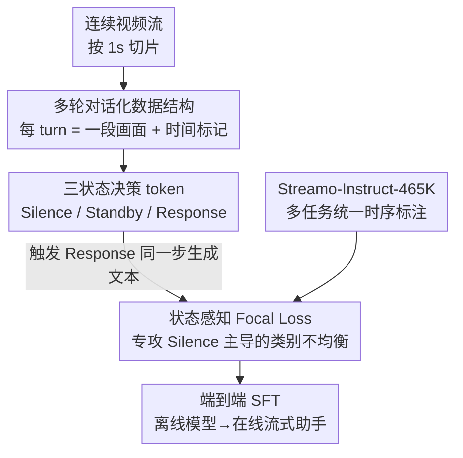

# Streaming Video Instruction Tuning (Streamo)

**会议**: CVPR 2026  
**论文**: [CVF Open Access](https://openaccess.thecvf.com/content/CVPR2026/html/Xia_Streaming_Video_Instruction_Tuning_CVPR_2026_paper.html)  
**代码**: 无（论文称将公开 code/model/dataset）  
**领域**: 多模态VLM / 视频理解  
**关键词**: 流式视频理解, 视频大模型, 指令微调, 响应时机决策, Focal Loss

## 一句话总结
Streamo 把"何时该开口说话"这件事直接做进视频大模型的 next-token 预测里——用三个状态 token（Silence/Standby/Response）让模型逐帧自己判断响应时机，再配一份 46.5 万条多任务流式指令数据集端到端训练，把离线视频模型一键改造成能实时旁白、定位、问答的在线助手，OVO-Bench 上比此前 SOTA Dispider 高 13.83%。

## 研究背景与动机
**领域现状**：视频大模型（InternVideo2.5、Keye-VL、Qwen2.5-VL 等）在"离线"理解上已经很强——把整段录好的视频喂进去，做总结、问答、字幕都不错。但它们的范式是"看完整段再输出一次"，本质上是单次推理。

**现有痛点**：真正的实时 AI 助手面对的是连续、无界的视频流，需要边看边判断"现在该不该应答、应答什么"。离线模型做不到这点，因为它们没有机制去识别"流里哪个时刻该开口"。

**核心矛盾**：已有的流式改造方法都走"外挂决策模块"路线——Dispider、StreamBridge 用一个辅助模型先把视频流切成定长片段或预测响应状态，再调用离线大模型生成内容。这带来一个绕不开的 trade-off：决策模块做小了，理解不了复杂指令和时序依赖；做大了，推理延迟和算力暴涨。更糟的是决策与生成分离，感知和响应耦合不紧，难以跟上快速变化的流式上下文。VideoLLM-Online、StreamingVLM 改用一个 `[EOS]` 特殊 token 直接预测响应时机，但只能做实时旁白一种任务，且无法在"沉默"和"响应"之间平衡。

**本文目标**：要一个统一框架，让单个模型既能逐帧决定"何时说"，又能立刻"说什么"，还要覆盖旁白/动作字幕/事件字幕/事件定位/时敏问答等多种流式任务。

**核心 idea**：把"响应状态预测"从外挂模块塞回模型内部，用三个离散状态 token 嵌进正常的 next-token 预测流程，实现决策与生成一次推理（one-pass）完成；同时造一份标注规范统一、带精确时间边界的多任务指令数据集来喂这套训练。

## 方法详解

### 整体框架
Streamo 的核心不是改架构，而是改"数据怎么组织 + 训练怎么算 loss"，从而把任意离线视频大模型（如 Qwen2.5-VL）端到端转成在线流式助手。整条管线分三步：先把传统"整段视频 + 单轮问答"的离线格式**重写成带时间标记的多轮对话**，把视频按 1 秒切成连续片段，每个 turn 喂一段新画面、模型回一个响应状态；其次在每个 turn 的回复里嵌入 **三个状态 token（Silence/Standby/Response）**，让模型逐帧判断现在处于"继续沉默 / 已察觉相关输入待命 / 信息够了该应答"哪种状态，一旦触发 Response 就立刻在同一步生成文本；最后针对流式数据里 Silence 占比超 80% 的严重类别不均衡，用 **状态感知 Focal Loss** 专门给三个状态 token 重加权，让模型学得会稀有的"该说话"时刻。整套用标准 SFT 的并行训练即可完成。

### 关键设计

**1. 多轮对话化的流式数据结构：把"看完再答"改成"边看边判断"**

离线范式假设推理前整段视频 $V=\{v_1,...,v_T\}$ 都可见，但流式场景下模型在 $t$ 时刻只能看到部分观测 $V_{:t}=\{v_1,...,v_t\}$、拿不到未来帧。Streamo 把单轮离线格式重构成多轮对话：先把视频切成 $N$ 段连续片段 $V=\{V^{(1)},...,V^{(N)}\}$，每段用 `<2s-3s>` 这样的特殊标记显式编码时间边界，再组织成 $D=\{(V^{(1)},R^{(1)}),...,(V^{(N)},R^{(N)})\}$，其中 $R^{(i)}$ 是第 $i$ 轮的响应。问题和答案按任务需要插在合适的 turn 上。这样训练时既能模拟真实的逐帧流式交互、能在任意时间点抛出问题，又完全兼容标准 SFT 的并行训练，不需要特殊的在线训练机制——把"在线决策"问题转化成了"多轮序列里预测下一个 token"。

**2. 三状态决策 token：把"何时说话"做进 next-token 预测**

这是替代外挂决策模块的核心。模型在每个 turn 输出三个离散状态之一：`<Silence>` 表示当前没相关信息、继续沉默处理后续帧；`<Standby>` 表示已察觉到相关视频输入、但还在等完整信息；`<Response>` 表示信息已足够、紧接着就生成对应文本回答。如表 1 的训练样本所示，用户给"绿灯亮了通知我"的指令后，模型在前几秒一路输出 `<Silence>`，察觉到灯要变时输出 `<Standby>`，灯真变绿那一刻输出 `<Response> The light just turned green.`。关键在于这三个状态被直接整合进正常的 token 预测流程，决策与生成在**一次前向**里完成（one-pass inference），既不靠外部 controller，又让感知和响应紧耦合——既显著提升了响应时机的准确性，又省掉了"先决策再调大模型"的二段式延迟。

**3. 状态感知 Focal Loss：救活被 Silence 淹没的"该说话"时刻**

多轮流式格式带来一个致命的类别不均衡：典型场景里 `<Silence>` 常占 80% 以上（数据集里实测 Silence:Standby:Response ≈ 12:3:2），普通交叉熵会把模型训得一味沉默、学不会响应时机。Streamo 只对三个状态 token 施加 Focal Loss 重加权。先算 token 级难度权重 $w_{\text{focal}}(x_i)=(1-p_{c_i})^{\gamma}$，$p_{c_i}$ 是该位置真类的预测概率、$\gamma$ 控制对易样本的降权（实验取 2），让模型聚焦难预测的位置；再用 batch 内频次算稀有类的 alpha 权重 $\alpha_k=\frac{1}{|S|}\cdot\frac{\sum_{j\in S}n_j}{n_k}$（$|S|=3$，$n_k$ 是状态 $k$ 在当前 batch 的出现次数），让出现越少的状态 token 拿到越大权重。两者独立计算后乘进交叉熵：

$$L_i = \begin{cases}\alpha_{t_i}\,w_{\text{focal}}(i)\,L_{\text{CE}}(i,t_i), & t_i\in S\\ L_{\text{CE}}(i,t_i), & \text{否则}\end{cases}$$

总损失对所有有效（非 mask）位置 $M$ 求平均 $L_{\text{total}}=\frac{1}{|M|}\sum_{i\in M}L_i$，避免序列长度差异影响。相比"按频次反比设固定权重（0.3/1.3/2.0）"，Focal Loss 能动态捕捉 token 级难度和不同任务的状态分布异质性（旁白任务一段里有多次响应，QA 可能只有一次），因此更鲁棒。

**4. Streamo-Instruct-465K：统一标注规范的多任务流式指令数据**

模型再好也要有对的数据喂。已有数据集混合异构来源、标注标准不一致，模型很难学到精确的时序对齐和多任务响应行为。作者基于多个开源视频集（LLaVA-Video、ActivityNet、QVHighlight、YouCook2、HACS、COIN 等共 135,875 段视频）重新标注，用**统一协议**给每段视频打上多种任务标签和清晰的响应时间边界，共 40 万有效样本再并入 LLaVA-Video 的离线 QA，凑成 46.5 万。覆盖五类任务，标注用大模型流水线自动生成：实时旁白（按秒切、Qwen2.5-VL-72B 描述相邻两秒变化、GLM-4.5 去重平滑）、事件字幕（ARC-Hunyuan-Video-7B 生成段级字幕并时序定位、只保留时间跨度互相一致的样本以滤噪）、动作字幕（复用事件流水线 + 动作导向 prompt）、事件定位（字幕预先给出、模型持续监控流去检测并定位）、时敏问答（GLM-4.5V 检测属性/位置/动作/计数等随时间变化的"change point"、围绕一个统一问题在不同时刻给不同答案）。同一段视频被多种任务标注（见图 1），让模型在一致监督下同时强化指令遵循和时序推理。

### 损失函数 / 训练策略
统一训练配置：全参数微调但冻结视觉编码器，只更新 connector 和 LLM；单 epoch、batch size 512、学习率 1e-5；多轮对话每 turn 切 1 秒、帧率 1 fps 采样；Focal 的 $\gamma=2$。Base model 用 Qwen2.5-VL（3B/7B），框架也兼容 Qwen3-VL、InternVL-3 等其他离线模型。

## 实验关键数据

### 主实验（OVO-Bench 在线视频基准）
OVO-Bench 覆盖实时感知 / 后向追溯 / 前向主动响应三类、共 12 个子任务。"Streamo Framework"指用本文框架把离线模型改造到在线。

| 模型 | 帧率 | 实时感知 Avg | 后向 Avg | 前向 Avg | 总平均 |
|------|------|------|------|------|------|
| Dispider-7B（前 SOTA 在线） | 1fps | 54.55 | 36.06 | 48.75 | 41.78 |
| ViSpeak-7B | 1fps | 66.28 | 57.52 | 60.42 | 61.08 |
| Streamo-3B | 1fps | 61.51 | 41.76 | 53.72 | 52.33 |
| Streamo-7B | 1fps | 65.98 | 46.10 | 54.77 | 55.61 |
| Streamo-7B | 2fps* | 67.44 | 49.18 | 56.96 | **57.86** |

关键结论：Streamo-7B 在前向主动响应任务上把前 SOTA Dispider 平均拉高 **+13.83%**；且 1fps 训练的模型直接换到 2fps 评测无需重训，还能再涨 +4.66%，说明对更高测试帧率有强泛化；用 Streamo-Instruct-465K 替换 ET-Instruct-164K，前向任务 +7.1%、总体 +11.79%。

### 离线视频基准（转在线后是否保留通用能力）
| 模型 | OVO-RT | MVBench | TempCompass | VideoMME | LongVideoBench | Avg |
|------|------|------|------|------|------|------|
| Qwen2.5-VL-7B（离线 base） | 58.8 | 69.6 | 71.7 | 65.1 | 56.0 | 60.6 |
| StreamingVLM-7B（在线 SOTA） | 62.0 | 69.2 | - | 65.1 | 59.0 | - |
| Streamo-7B | 66.0 | 72.3 | 71.8 | 67.9 | 59.2 | **63.9** |

转成在线后 Streamo 不仅没掉点，反而在每个离线基准上都超过在线 SOTA StreamingVLM，比离线 base 平均 +3.4%，说明流式改造没牺牲通用感知能力。

### 消融实验（Focal Loss，OVO-Bench 前向任务）
| Base | Loss 类型 | REC | SSR | CRR |
|------|------|------|------|------|
| Qwen2.5-VL-3B | CrossEntropy | 6.45 | 20.99 | 41.67 |
| Qwen2.5-VL-3B | Loss Scale（固定权重） | 18.62 | 41.02 | 49.17 |
| Qwen2.5-VL-3B | **Focal Loss** | **27.94** | **50.72** | **82.5** |
| InternVL3-2B | CrossEntropy | 9.46 | 20.50 | 40.42 |
| InternVL3-2B | Focal Loss | **29.23** | **47.38** | **80.42** |

### 关键发现
- 状态重加权是命门：纯交叉熵被 12:3:2 的类别不均衡压垮，CRR 仅 41.67；固定权重（0.3/1.3/2.0）能缓解但抓不住 token 级难度和任务异质性；Focal Loss 把 CRR 抬到 82.5，两个 backbone 上都一致大幅领先。
- 离线监督会反噬在线学习：给 ET-Instruct 加离线 LLaVA-Video 数据虽提升实时感知精度，却损害流式能力，暴露了纯离线监督的内在 trade-off；而 Streamo-Instruct-465K 能同时保住离线感知和在线流式两边。
- Streamo-Bench（300 视频、3000 指令任务）上，已有在线模型在开放式 prompt（去掉预设选项的 grounding）几乎全军覆没、且在动态 QA 里常忽略"随条件更新答案"导致 recall 暴跌；Streamo 各任务均衡稳健，验证了其指令遵循泛化能力。

## 亮点与洞察
- 最"啊哈"的一点：把"何时响应"这个看似需要外挂控制器的决策，巧妙地编码成三个普通 token 塞进 next-token 预测，于是整个在线决策问题退化成标准 SFT 能解的多轮序列建模——不改架构、可并行训练、决策与生成一次推理完成。
- 三状态而非二状态：相比 VideoLLM-Online 只用一个 `[EOS]` 区分说不说，Standby 这个"察觉到了但还在等完整信息"的中间态，让模型能在沉默与响应间做更细粒度的时机权衡，是覆盖多任务的关键。
- Focal Loss 用在"决策 token"而非传统的分类不均衡场景，是个可迁移的 trick：任何"绝大多数时刻什么都不做、偶尔触发动作"的序列决策（如流式 ASR 端点检测、事件触发）都能套这套 token 级难度 + batch 频次双重加权。

## 局限与展望
- 作者承认：流式视频天然是无界时序上下文，当前 pipeline 缺少专门的长序列优化，序列一长内存和延迟开销就变得难以承受。展望靠框架兼容性接入 KV-cache 管理、视觉 token 剪枝、滑窗注意力、自适应帧压缩来扩展有效上下文。
- 自己发现的局限：核心提升很大程度依赖那份 46.5 万的数据集，而数据标注是多个大模型（Qwen2.5-VL-72B/GLM-4.5/ARC-Hunyuan/GLM-4.5V）自动生成的，标注质量和潜在偏差未做人工核验级别的量化分析，⚠️ 以原文为准。
- 评测帧率从 1fps 到 2fps 能涨点，但更高帧率或真实低延迟在线部署下的实际吞吐/延迟数字论文正文未给。

## 相关工作与启发
- **vs Dispider / StreamBridge**: 他们用辅助模型先把流切成定长片段再喂离线大模型，决策与生成分离、算力开销大且多轮交互易丢上下文；Streamo 把决策 token 化做进模型本体，one-pass 完成，OVO-Bench 前向任务高出 Dispider 13.83%。
- **vs VideoLLM-Online / StreamingVLM**: 他们用单个 `[EOS]` token 监督响应时机，只能做实时旁白、无法在沉默与响应间平衡；Streamo 用三状态 token + 多任务数据集覆盖旁白/字幕/定位/时敏问答全谱系。
- **vs OVO-Bench / StreamBench / SVBench**: 已有流式基准多为 QA 选项式评测，测不了 grounding、captioning 这类开放式指令遵循；本文额外提出 Streamo-Bench（300 视频 / 3000 任务）专门探测多任务感知与响应能力。

## 评分
- 新颖性: ⭐⭐⭐⭐ 三状态 token 把在线决策化进 next-token 预测的思路简洁有效，但属于"巧妙工程整合"而非全新机制
- 实验充分度: ⭐⭐⭐⭐ 在线/离线/自建基准三维度评测 + 多 backbone 验证兼容性，消融聚焦 Focal Loss；延迟/吞吐实测数据偏弱
- 写作质量: ⭐⭐⭐⭐ 动机清晰、数据集构造交代详尽，公式和样例直观
- 价值: ⭐⭐⭐⭐ 提供可复用的离线→在线改造框架 + 46.5 万数据集 + 新基准，对实时视频助手落地有实际推动

<!-- RELATED:START -->

## 相关论文

- [\[CVPR 2026\] Multimodal Continual Instruction Tuning with Dynamic Gradient Guidance](multimodal_continual_instruction_tuning_with_dynamic_gradient_guidance.md)
- [\[CVPR 2026\] LLaDA-V: Large Language Diffusion Models with Visual Instruction Tuning](llada-v_large_language_diffusion_models_with_visual_instruction_tuning.md)
- [\[CVPR 2026\] Harmonious Parameter Adaptation in Continual Visual Instruction Tuning for Safety-Aligned MLLMs](harmonious_parameter_adaptation_in_continual_visual_instruction_tuning_for_safet.md)
- [\[NeurIPS 2025\] Visual Instruction Bottleneck Tuning](../../NeurIPS2025/multimodal_vlm/visual_instruction_bottleneck_tuning.md)
- [\[CVPR 2026\] WeaveTime: Streaming from Earlier Frames into Emergent Memory in VideoLLMs](weavetime_streaming_from_earlier_frames_into_emergent_memory_in_videollms.md)

<!-- RELATED:END -->
